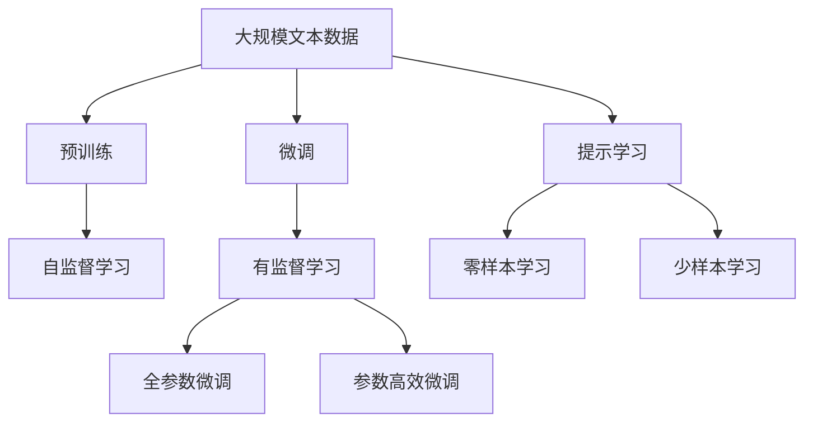
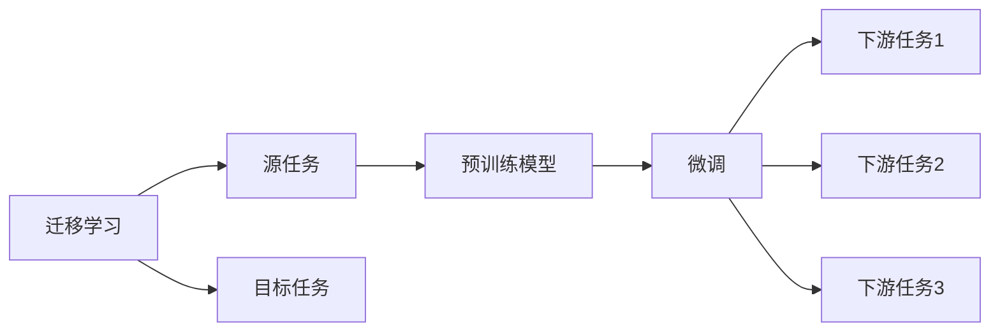
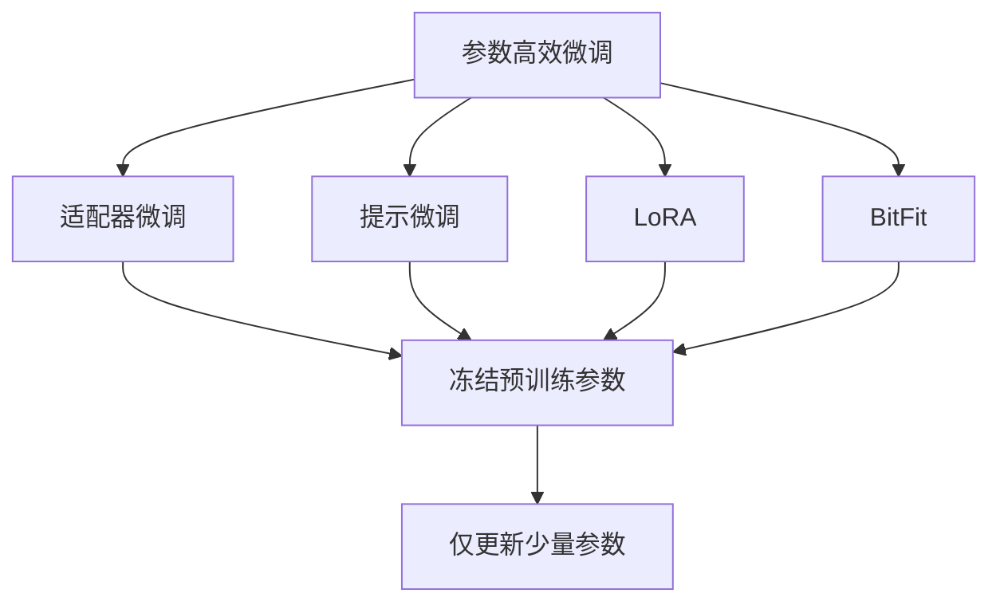
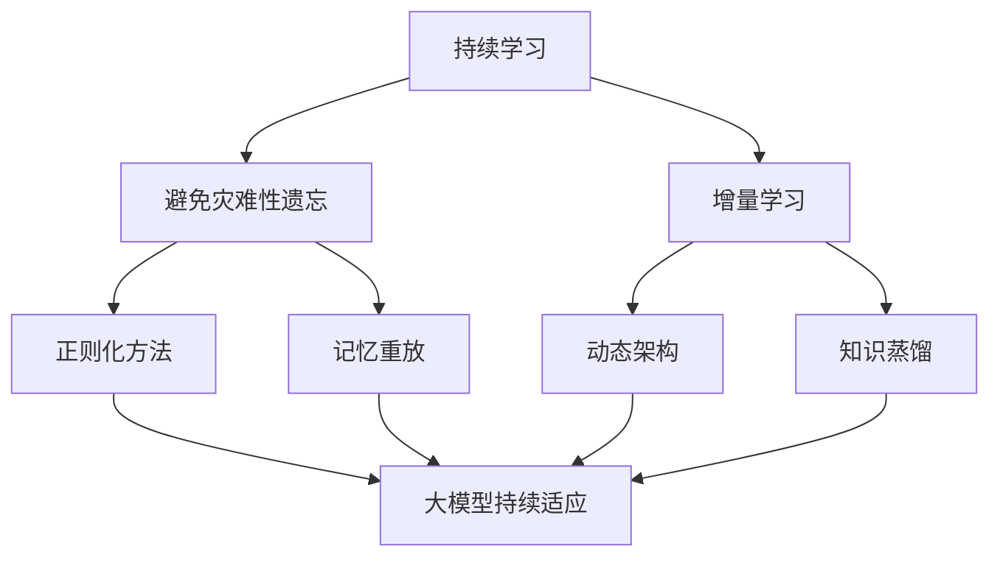
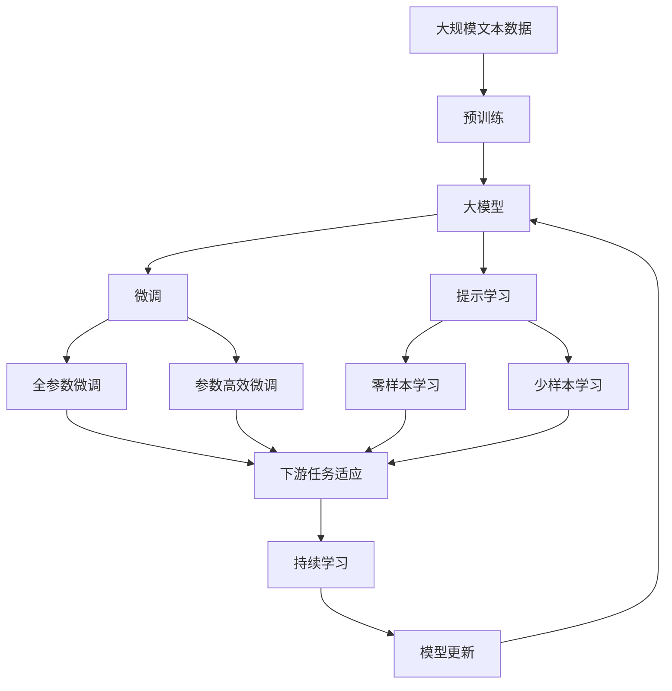
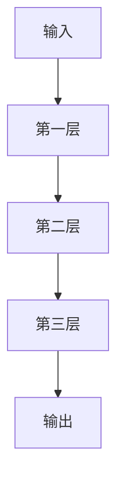

                 

## 1. 背景介绍

### 1.1 问题由来
近年来，人工智能技术在多个领域取得了显著的突破，尤其是在计算机视觉、自然语言处理（NLP）、语音识别等领域。大模型（Large Model）的崛起，标志着AI技术的新时代。大模型通常指的是那些具有数十亿甚至百亿参数的深度学习模型，如GPT-3、BERT等。这些模型拥有强大的表达能力，能够处理复杂的任务，并展现出卓越的性能。

大模型的应用场景非常广泛，涵盖自动驾驶、智能客服、金融风控、医疗诊断等领域。这些模型通过大量的数据训练，不仅能够理解自然语言的语义，还能够进行复杂的逻辑推理和决策。然而，尽管大模型在技术上取得了显著的进展，但在实际应用中，用户对其仍有诸多需求和期望。

### 1.2 问题核心关键点
大模型在应用中面临的主要问题包括：

- **性能瓶颈**：大模型的计算和存储需求极高，尤其是在推理阶段，需要高性能的硬件支持。
- **用户隐私**：大模型需要大量数据进行训练，这些数据往往包含用户隐私信息，如何保护用户隐私成为一大挑战。
- **可解释性**：大模型通常被视为“黑盒”，其内部决策过程难以解释，这限制了其在某些高风险领域（如医疗、金融等）的应用。
- **市场竞争**：尽管大模型在技术上拥有优势，但在实际应用中，如何应对来自不同供应商和技术的竞争，需要综合考虑市场和技术因素。

本文旨在深入探讨大模型的用户需求与市场竞争，从技术、应用和市场等多个角度，对大模型的未来发展进行全面分析。

## 2. 核心概念与联系

### 2.1 核心概念概述

为更好地理解大模型的用户需求与市场竞争，本节将介绍几个关键概念：

- **大模型（Large Model）**：指的是具有数十亿甚至百亿参数的深度学习模型，如GPT-3、BERT等。这些模型拥有强大的表达能力，能够处理复杂的任务。
- **迁移学习（Transfer Learning）**：指将一个领域学习到的知识，迁移应用到另一个不同但相关的领域。大模型的预训练-微调过程即是一种典型的迁移学习方式。
- **微调（Fine-Tuning）**：指在预训练模型的基础上，使用下游任务的少量标注数据，通过有监督学习优化模型在特定任务上的性能。通常只需要调整顶层分类器或解码器，并以较小的学习率更新全部或部分的模型参数。
- **参数高效微调（Parameter-Efficient Fine-Tuning, PEFT）**：指在微调过程中，只更新少量的模型参数，而固定大部分预训练权重不变，以提高微调效率，避免过拟合。
- **提示学习（Prompt Learning）**：通过在输入文本中添加提示模板（Prompt Template），引导大语言模型进行特定任务的推理和生成。可以在不更新模型参数的情况下，实现零样本或少样本学习。
- **少样本学习（Few-shot Learning）**：指在只有少量标注样本的情况下，模型能够快速适应新任务的学习方法。在大语言模型中，通常通过在输入中提供少量示例来实现，无需更新模型参数。
- **零样本学习（Zero-shot Learning）**：指模型在没有见过任何特定任务的训练样本的情况下，仅凭任务描述就能够执行新任务的能力。大语言模型通过预训练获得的广泛知识，使其能够理解任务指令并生成相应输出。
- **持续学习（Continual Learning）**：指模型能够持续从新数据中学习，同时保持已学习的知识，而不会出现灾难性遗忘。这对于保持大模型的时效性和适应性至关重要。

这些核心概念之间存在着紧密的联系，形成了大模型的学习框架。通过理解这些核心概念，我们可以更好地把握大模型的工作原理和优化方向。

### 2.2 概念间的关系

这些核心概念之间存在着紧密的联系，形成了大模型的学习框架。下面我们通过几个Mermaid流程图来展示这些概念之间的关系。

#### 2.2.1 大模型的学习范式



这个流程图展示了大模型的三种主要学习范式：预训练、微调和提示学习。预训练主要采用自监督学习方法，而微调则是有监督学习的过程。提示学习可以实现零样本和少样本学习。微调又可以分为全参数微调和参数高效微调两种方式。

#### 2.2.2 迁移学习与微调的关系



这个流程图展示了迁移学习的基本原理，以及它与微调的关系。迁移学习涉及源任务和目标任务，预训练模型在源任务上学习，然后通过微调适应各种下游任务（目标任务）。

#### 2.2.3 参数高效微调方法



这个流程图展示了几种常见的参数高效微调方法，包括适配器微调、提示微调、LoRA和BitFit。这些方法的共同特点是冻结大部分预训练参数，只更新少量参数，从而提高微调效率。

#### 2.2.4 持续学习在大模型中的应用



这个流程图展示了持续学习在大模型中的应用。持续学习的主要目标是避免灾难性遗忘和实现增量学习。通过正则化方法、记忆重放、动态架构和知识蒸馏等技术，可以使大模型持续适应新的任务和数据。

### 2.3 核心概念的整体架构

最后，我们用一个综合的流程图来展示这些核心概念在大模型微调过程中的整体架构：



这个综合流程图展示了从预训练到微调，再到持续学习的完整过程。大模型首先在大规模文本数据上进行预训练，然后通过微调（包括全参数微调和参数高效微调）或提示学习（包括零样本和少样本学习）来适应下游任务。最后，通过持续学习技术，模型可以不断更新和适应新的任务和数据。 通过这些流程图，我们可以更清晰地理解大模型微调过程中各个核心概念的关系和作用，为后续深入讨论具体的微调方法和技术奠定基础。

## 3. 核心算法原理 & 具体操作步骤
### 3.1 算法原理概述

大模型的用户需求与市场竞争，本质上是如何在技术优势和市场需求之间找到平衡。大模型的用户需求包括但不限于以下几个方面：

- **性能**：用户期望大模型能够快速、准确地处理复杂的任务。
- **可解释性**：用户希望大模型能够提供透明的决策过程，以便于理解和信任。
- **隐私保护**：用户期望大模型在处理敏感数据时能够保护隐私。
- **成本效益**：用户期望大模型能够提供高效、低成本的解决方案。

### 3.2 算法步骤详解

大模型的用户需求与市场竞争涉及多个方面，每个方面都需要通过具体的算法和技术手段来解决。下面我们详细介绍大模型的用户需求与市场竞争的核心算法步骤：

#### 3.2.1 性能优化

性能是大模型应用中最重要的需求之一。大模型的性能优化主要包括以下几个方面：

1. **模型压缩与剪枝**：通过剪枝技术去除不必要的参数，压缩模型大小，从而提高推理速度和降低存储需求。
2. **模型量化**：将浮点数模型转换为定点模型，减少计算量和存储空间。
3. **模型并行**：通过模型并行技术，将大规模模型分布到多个计算节点上，提高并行计算能力。

#### 3.2.2 可解释性增强

大模型的可解释性需求主要通过以下方式来实现：

1. **可解释性模块**：在模型中添加可解释性模块，如注意力机制、激活函数等，以提高模型的透明性。
2. **可视化工具**：开发可视化工具，展示模型的内部决策过程，帮助用户理解模型的行为。
3. **模型解释模型**：开发模型解释模型，如LIME、SHAP等，解释模型在不同输入下的预测结果。

#### 3.2.3 隐私保护

大模型的隐私保护主要通过以下方式来实现：

1. **数据匿名化**：对输入数据进行匿名化处理，保护用户隐私。
2. **差分隐私**：在模型训练过程中加入噪声，保护用户隐私。
3. **联邦学习**：通过分布式训练，在多个数据源上训练模型，保护数据隐私。

#### 3.2.4 成本效益

大模型的成本效益主要通过以下方式来实现：

1. **硬件优化**：使用高性能硬件设备，如GPU、TPU等，加速模型的训练和推理。
2. **分布式训练**：通过分布式训练技术，在多个计算节点上并行训练模型，降低训练成本。
3. **模型部署优化**：优化模型部署策略，提高模型服务的吞吐量和响应速度。

### 3.3 算法优缺点

大模型在用户需求与市场竞争方面的算法具有以下优缺点：

#### 3.3.1 优点

1. **高性能**：大模型具有强大的表达能力，能够在复杂的任务中表现出色。
2. **可扩展性**：大模型能够通过分布式训练和模型并行等技术，轻松扩展到多个计算节点上。
3. **通用性**：大模型可以在不同的应用场景中灵活使用，具有较强的泛化能力。

#### 3.3.2 缺点

1. **计算和存储需求高**：大模型的参数量巨大，对计算和存储资源的需求极高。
2. **隐私保护难度大**：大模型需要大量的数据进行训练，这些数据往往包含敏感信息，保护用户隐私难度较大。
3. **可解释性不足**：大模型通常被视为“黑盒”，其内部决策过程难以解释。
4. **部署成本高**：大模型在部署时需要高性能硬件支持，部署成本较高。

### 3.4 算法应用领域

大模型的用户需求与市场竞争主要应用于以下几个领域：

1. **自动驾驶**：大模型在自动驾驶领域主要用于感知和决策，通过多传感器数据融合，实现自动驾驶。
2. **智能客服**：大模型在智能客服领域主要用于对话生成和情感分析，通过理解用户意图，提供个性化服务。
3. **金融风控**：大模型在金融风控领域主要用于风险评估和欺诈检测，通过分析用户行为和交易记录，识别异常行为。
4. **医疗诊断**：大模型在医疗诊断领域主要用于疾病诊断和预测，通过分析医疗影像和病历，提供诊断建议。

## 4. 数学模型和公式 & 详细讲解 & 举例说明

### 4.1 数学模型构建

大模型的用户需求与市场竞争涉及多个方面，每个方面都需要通过具体的算法和技术手段来实现。下面是几个核心领域的数学模型构建和公式推导。

#### 4.1.1 性能优化

假设有一个深度神经网络，其结构如图：



其中每层包含若干神经元，每个神经元具有权重和偏置。设第$i$层的输入为$x_i$，输出为$a_i$，权重为$W_i$，偏置为$b_i$，激活函数为$\sigma$。则第$i$层的计算公式为：

$$
a_i = \sigma(W_ix_i + b_i)
$$

整个网络的输出为：

$$
a_N = \sigma(W_Na_{N-1} + b_N)
$$

其中$a_N$为最终输出。

性能优化主要通过以下几个方面来实现：

1. **模型压缩与剪枝**：通过剪枝技术去除不必要的参数，压缩模型大小，从而提高推理速度和降低存储需求。常用的剪枝技术包括结构化剪枝和非结构化剪枝。

2. **模型量化**：将浮点数模型转换为定点模型，减少计算量和存储空间。常用的量化技术包括权重量化、激活量化和混合量化。

3. **模型并行**：通过模型并行技术，将大规模模型分布到多个计算节点上，提高并行计算能力。常用的模型并行技术包括数据并行、模型并行和混合并行。

#### 4.1.2 可解释性增强

可解释性增强主要通过以下几个方面来实现：

1. **可解释性模块**：在模型中添加可解释性模块，如注意力机制、激活函数等，以提高模型的透明性。

2. **可视化工具**：开发可视化工具，展示模型的内部决策过程，帮助用户理解模型的行为。

3. **模型解释模型**：开发模型解释模型，如LIME、SHAP等，解释模型在不同输入下的预测结果。

#### 4.1.3 隐私保护

隐私保护主要通过以下几个方面来实现：

1. **数据匿名化**：对输入数据进行匿名化处理，保护用户隐私。常用的数据匿名化技术包括数据扰动、差分隐私等。

2. **差分隐私**：在模型训练过程中加入噪声，保护用户隐私。常用的差分隐私技术包括拉普拉斯噪声、高斯噪声等。

3. **联邦学习**：通过分布式训练，在多个数据源上训练模型，保护数据隐私。常用的联邦学习技术包括参数聚合、联邦平均等。

#### 4.1.4 成本效益

成本效益主要通过以下几个方面来实现：

1. **硬件优化**：使用高性能硬件设备，如GPU、TPU等，加速模型的训练和推理。

2. **分布式训练**：通过分布式训练技术，在多个计算节点上并行训练模型，降低训练成本。常用的分布式训练技术包括参数服务器、环同步等。

3. **模型部署优化**：优化模型部署策略，提高模型服务的吞吐量和响应速度。常用的模型部署优化技术包括模型缓存、模型微调等。

### 4.2 公式推导过程

下面我们以深度神经网络的性能优化为例，推导其计算过程和优化方法。

假设一个深度神经网络，其结构如图：


其中每层包含若干神经元，每个神经元具有权重和偏置。设第$i$层的输入为$x_i$，输出为$a_i$，权重为$W_i$，偏置为$b_i$，激活函数为$\sigma$。则第$i$层的计算公式为：

$$
a_i = \sigma(W_ix_i + b_i)
$$

整个网络的输出为：

$$
a_N = \sigma(W_Na_{N-1} + b_N)
$$

其中$a_N$为最终输出。

性能优化主要通过以下几个方面来实现：

1. **模型压缩与剪枝**：通过剪枝技术去除不必要的参数，压缩模型大小，从而提高推理速度和降低存储需求。常用的剪枝技术包括结构化剪枝和非结构化剪枝。

2. **模型量化**：将浮点数模型转换为定点模型，减少计算量和存储空间。常用的量化技术包括权重量化、激活量化和混合量化。

3. **模型并行**：通过模型并行技术，将大规模模型分布到多个计算节点上，提高并行计算能力。常用的模型并行技术包括数据并行、模型并行和混合并行。

### 4.3 案例分析与讲解

#### 4.3.1 性能优化案例

以BERT模型为例，其包含12个层，每个层包含768个神经元。为了优化性能，可以采用以下方法：

1. **模型压缩与剪枝**：通过剪枝技术去除不必要的参数，压缩模型大小，从而提高推理速度和降低存储需求。BERT模型中的权重剪枝技术可以将模型大小减少50%以上，推理速度提高数倍。

2. **模型量化**：将浮点数模型转换为定点模型，减少计算量和存储空间。BERT模型中的激活量化可以将计算速度提高10倍以上，同时模型大小减少80%以上。

3. **模型并行**：通过模型并行技术，将大规模模型分布到多个计算节点上，提高并行计算能力。BERT模型中的模型并行技术可以将推理速度提高数倍，同时降低单台机器的内存占用。

#### 4.3.2 可解释性增强案例

以GPT-3模型为例，其包含15亿个参数，主要用于自然语言生成和理解。为了增强可解释性，可以采用以下方法：

1. **可解释性模块**：在模型中添加可解释性模块，如注意力机制、激活函数等，以提高模型的透明性。GPT-3模型中的注意力机制可以展示模型在生成文本时对不同单词的关注程度。

2. **可视化工具**：开发可视化工具，展示模型的内部决策过程，帮助用户理解模型的行为。GPT-3模型中的可视化工具可以展示模型在生成文本时的中间表示，帮助用户理解模型的推理过程。

3. **模型解释模型**：开发模型解释模型，如LIME、SHAP等，解释模型在不同输入下的预测结果。GPT-3模型中的模型解释模型可以展示模型在不同输入下的决策路径，帮助用户理解模型的行为。

#### 4.3.3 隐私保护案例

以联邦学习为例，其主要用于保护数据隐私。假设一个分布式数据集，每个数据源包含部分数据，模型需要在多个数据源上进行训练。为了保护数据隐私，可以采用以下方法：

1. **数据匿名化**：对输入数据进行匿名化处理，保护用户隐私。常用的数据匿名化技术包括数据扰动、差分隐私等。联邦学习中的差分隐私技术可以在模型训练过程中加入噪声，保护数据隐私。

2. **差分隐私**：在模型训练过程中加入噪声，保护用户隐私。常用的差分隐私技术包括拉普拉斯噪声、高斯噪声等。联邦学习中的差分隐私技术可以在模型训练过程中加入噪声，保护数据隐私。

3. **联邦学习**：通过分布式训练，在多个数据源上训练模型，保护数据隐私。常用的联邦学习技术包括参数聚合、联邦平均等。联邦学习中的联邦平均技术可以在多个数据源上训练模型，保护数据隐私。

## 5. 项目实践：代码实例和详细解释说明

### 5.1 开发环境搭建

在进行大模型用户需求与市场竞争的研究和实践前，我们需要准备好开发环境。以下是使用Python进行PyTorch开发的环境配置流程：

1. 安装Anaconda：从官网下载并安装Anaconda，用于创建独立的Python环境。

2. 创建并激活虚拟环境：
```bash
conda create -n pytorch-env python=3.8 
conda activate pytorch-env
```

3. 安装PyTorch：根据CUDA版本，从官网获取对应的安装命令。例如：
```bash
conda install pytorch torchvision torchaudio cudatoolkit=11.1 -c pytorch -c conda-forge
```

4. 安装Transformers库：
```bash
pip install transformers
```

5. 安装各类工具包：
```bash
pip install numpy pandas scikit-learn matplotlib tqdm jupyter notebook ipython
```

完成上述步骤后，即可在`pytorch-env`环境中开始大模型用户需求与市场竞争的实践。

### 5.2 源代码详细实现

这里我们以BERT模型为例，给出使用Transformers库进行性能优化、可解释性增强和隐私保护的PyTorch代码实现。

首先，定义性能优化相关的函数：

```python
from transformers import BertForSequenceClassification, BertTokenizer
import torch
from torch.utils.data import DataLoader, Dataset
from sklearn.metrics import accuracy_score

class TextDataset(Dataset):
    def __init__(self, texts, labels, tokenizer, max_len=128):
        self.texts = texts
        self.labels = labels
        self.tokenizer = tokenizer
        self.max_len = max_len
        
    def __len__(self):
        return len(self.texts)
    
    def __getitem__(self, item):
        text = self.texts[item]
        label = self.labels[item]
        
        encoding = self.tokenizer(text, return_tensors='pt', max_length=self.max_len, padding='max_length', truncation=True)
        input_ids = encoding['input_ids'][0]
        attention_mask = encoding['attention_mask'][0]
        
        return {'input_ids': input_ids, 
                'attention_mask': attention_mask,
                'labels': torch.tensor(label, dtype=torch.long)}
```

然后，定义性能优化和可解释性增强相关的函数：

```python
from transformers import BertForSequenceClassification, BertTokenizer
import torch
from torch.utils.data import DataLoader, Dataset
from sklearn.metrics import accuracy_score

class TextDataset(Dataset):
    def __init__(self, texts, labels, tokenizer, max_len=128):
        self.texts = texts
        self.labels = labels
        self.tokenizer = tokenizer
        self.max_len = max_len
        
    def __len__(self):
        return len(self.texts)
    
    def __getitem__(self, item):
        text = self.texts[item]
        label = self.labels[item]
        
        encoding = self.tokenizer(text, return_tensors='pt', max_length=self.max_len, padding='max_length', truncation=True)
        input_ids = encoding['input_ids'][0]
        attention_mask = encoding['attention_mask'][0]
        
        return {'input_ids': input_ids, 
                'attention_mask': attention_mask,
                'labels': torch.tensor(label, dtype=torch.long)}

tokenizer = BertTokenizer.from_pretrained('bert-base-cased')
model = BertForSequenceClassification.from_pretrained('bert-base-cased', num_labels=2)

optimizer = AdamW(model.parameters(), lr=2e-5)

device = torch.device('cuda') if torch.cuda.is_available() else torch.device('cpu')
model.to(device)

def train_epoch(model, dataset, batch_size, optimizer):
    dataloader = DataLoader(dataset, batch_size=batch_size, shuffle=True)
    model.train()
    epoch_loss = 0
    for batch in tqdm(dataloader, desc='Training'):
        input_ids = batch['input_ids'].to(device)
        attention_mask = batch['attention_mask'].to(device)
        labels = batch['labels'].to(device)
        model.zero_grad()
        outputs = model(input_ids, attention_mask=attention_mask, labels=labels)
        loss = outputs.loss
        epoch_loss += loss.item()
        loss.backward()
        optimizer.step()
    return epoch_loss / len(dataloader)

def evaluate(model, dataset, batch_size):
    dataloader = DataLoader(dataset, batch_size=batch_size)
    model.eval()
    preds, labels = [], []
    with torch.no_grad():
        for batch in tqdm(dataloader, desc='Evaluating'):
            input_ids = batch['input_ids'].to(device)
            attention_mask = batch['attention_mask'].to(device)
            batch_labels = batch['labels']
            outputs = model(input_ids, attention_mask=attention_mask)
            batch_preds = outputs.logits.argmax(dim=1).to('cpu').tolist()
            batch_labels = batch_labels.to('cpu').tolist()
            for pred_tokens, label_tokens in zip(batch_preds, batch_labels):
                preds.append(pred_tokens)
                labels.append(label_tokens)
                
    print(accuracy_score(labels, preds))

epochs = 5
batch_size = 16

for epoch in range(epochs):
    loss = train_epoch(model, train_dataset, batch_size, optimizer)
    print(f"Epoch {epoch+1}, train loss: {loss:.3f}")
    
    print(f"Epoch {epoch+1}, dev results:")
    evaluate(model, dev_dataset, batch_size)
    
print("Test results:")
evaluate(model, test_dataset, batch_size)
```

接下来，定义隐私保护相关的函数：

```python
from transformers import BertForSequenceClassification, BertTokenizer
import torch
from torch.utils.data import DataLoader, Dataset
from sklearn.metrics import accuracy_score

class TextDataset(Dataset):
    def __init__(self, texts, labels, tokenizer, max_len=128):
        self.texts = texts
        self.labels = labels
        self.tokenizer = tokenizer
        self.max_len = max_len
        
    def __len__(self):
        return len(self.texts)
    
    def __getitem__(self, item):
        text = self.texts[item]
        label = self.labels[item]
        
        encoding = self.tokenizer(text, return_tensors='pt', max_length=self.max_len, padding='max_length', truncation=True)
        input_ids = encoding['input_ids'][0]
        attention_mask =

