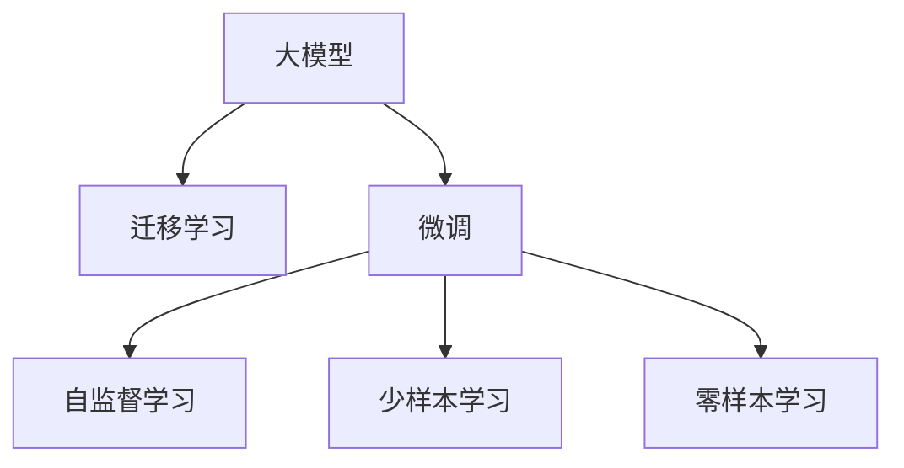
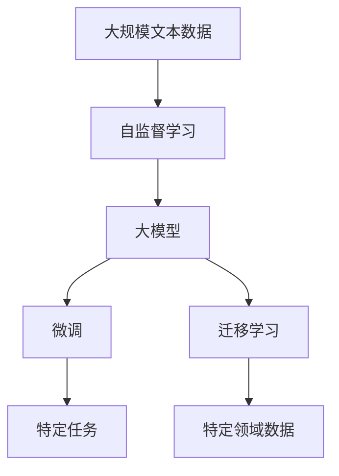

                 

# 大模型赋能传统行业转型，AI创业迎来新蓝海

在科技与产业的不断碰撞中，人工智能（AI）正迅速塑造着各行各业的未来。特别是深度学习技术的飞跃发展，使得大模型（Large Models）在多领域展现出前所未有的潜力和价值。本文将深入探讨大模型在传统行业转型中的赋能作用，以及AI创业在此基础上迎来的一系列新机遇与挑战。

## 1. 背景介绍

### 1.1 问题由来

随着科技的日新月异，传统行业面临着前所未有的挑战与机遇。数字化的浪潮席卷而来，各行各业都在加速向智能化转型。然而，大部分传统行业企业在技术积累、人才结构、数据资源等方面存在明显短板，与互联网和科技公司存在显著差距。此时，大模型的出现为各行各业带来了革命性的变革机会。

大模型以深度学习技术为基础，利用海量的数据进行预训练，形成了强大的知识图谱和语言表示能力。这些模型通常具有数十亿甚至上百亿的参数规模，具备极高的泛化能力和适应性，可以在各种复杂场景中展现出令人震撼的性能。例如，自然语言处理（NLP）领域的BERT、GPT-3等模型，已经在情感分析、机器翻译、问答系统等多个任务上取得了优异的结果。

### 1.2 问题核心关键点

大模型赋能传统行业的核心在于两个方面：

1. **泛化能力**：通过预训练学习到通用的语言和知识表示，大模型具备强大的泛化能力，能够在新的数据集上快速适应和提升性能。
2. **迁移学习能力**：大模型能够将预训练学习到的知识迁移到具体的应用场景中，通过微调（Fine-tuning）等手段，提升模型在特定任务上的表现。

这些核心优势使得大模型在传统行业的智能化转型中具有不可替代的重要作用。通过利用大模型的泛化能力和迁移学习能力，传统行业企业可以大幅降低技术门槛和研发成本，加速业务数字化进程。

## 2. 核心概念与联系

### 2.1 核心概念概述

为更好地理解大模型在传统行业中的应用，本节将介绍几个密切相关的核心概念：

- **大模型（Large Models）**：以深度学习模型为代表的具有数十亿乃至上百亿参数规模的模型，如BERT、GPT等。
- **迁移学习（Transfer Learning）**：将一个领域学到的知识迁移到另一个领域的学习方法。大模型通过迁移学习可以在特定任务上快速提升性能。
- **微调（Fine-tuning）**：在预训练模型基础上，使用特定任务的少量标注数据进行微调，使其适应新的应用场景。
- **自监督学习（Self-Supervised Learning）**：利用无标签数据进行训练，使得模型学习到通用的语言和知识表示。
- **少样本学习（Few-shot Learning）**：使用极少量标注数据，模型仍能快速学习并适应新任务。
- **零样本学习（Zero-shot Learning）**：模型不依赖任何标注数据，仅凭任务描述就能执行新任务。

这些概念之间存在紧密的联系，形成了大模型在特定应用场景中的核心范式。大模型的泛化能力和迁移学习能力，使其能够通过微调快速适应新任务，而自监督和少样本学习则进一步拓展了大模型在数据稀缺情况下的应用范围。

### 2.2 概念间的关系

这些核心概念之间的关系可以通过以下Mermaid流程图来展示：



这个流程图展示了大模型在微调、自监督学习和迁移学习等核心概念下的应用范围和效果。通过微调，大模型可以在特定任务上快速提升性能；自监督学习和少样本学习则拓展了数据稀缺情况下的应用场景，零样本学习进一步提升了模型的通用性。

### 2.3 核心概念的整体架构

最后，我们用一个综合的流程图来展示这些核心概念在大模型应用中的整体架构：



这个综合流程图展示了从数据预处理到模型微调，再到特定任务应用的全过程。大模型首先在无标签数据上进行自监督学习，然后通过微调和迁移学习，快速适应特定任务，并在新领域的数据上继续提升性能。

## 3. 核心算法原理 & 具体操作步骤

### 3.1 算法原理概述

大模型赋能传统行业转型的核心算法原理主要包括两个方面：

- **泛化能力**：通过大规模数据预训练，大模型学习到通用的语言和知识表示，能够在新数据上泛化良好。
- **迁移学习能力**：通过微调等方法，大模型能够在特定任务上快速提升性能，实现从预训练到应用的任务适配。

### 3.2 算法步骤详解

基于大模型的应用通常包括以下几个关键步骤：

**Step 1: 数据预处理**
- 收集大规模无标签文本数据，用于大模型的自监督预训练。
- 清洗和分词处理文本数据，转换为模型可接受的格式。

**Step 2: 模型预训练**
- 在大规模文本数据上进行自监督预训练，如语言建模、掩码语言模型等。
- 使用先进的深度学习框架，如PyTorch、TensorFlow等，进行模型训练。

**Step 3: 任务适配**
- 根据具体任务需求，设计合适的任务适配层。
- 选择合适的优化算法和超参数，进行模型的微调。

**Step 4: 应用部署**
- 将微调后的模型部署到实际应用场景中，进行推理和测试。
- 根据实际反馈，不断优化和更新模型。

### 3.3 算法优缺点

大模型赋能传统行业的优点包括：

1. **快速部署**：大模型通过微调即可适应特定任务，部署速度快，开发成本低。
2. **高性能**：大模型具备强大的泛化能力和迁移学习能力，能够在多种复杂场景中表现优异。
3. **低门槛**：传统行业企业无需从头开发复杂模型，可直接使用大模型进行任务适配。

缺点则包括：

1. **数据需求高**：大模型的预训练需要大量的高质量数据，对于某些行业领域，获取数据难度较大。
2. **计算资源消耗大**：大模型的训练和推理需要高性能硬件支持，对算力要求高。
3. **可解释性不足**：大模型往往作为"黑盒"模型，缺乏足够的可解释性，难以进行调试和优化。

### 3.4 算法应用领域

大模型在多个领域展现出了巨大的应用潜力，包括但不限于：

- **智能客服**：通过大模型进行对话理解与生成，实现7x24小时不间断服务。
- **金融风控**：利用大模型进行文本分类、情感分析，提高风险预警能力。
- **智能医疗**：通过大模型进行病历分析、医学问答，提升医疗服务质量。
- **智慧农业**：利用大模型进行图像识别、自然语言处理，优化农业生产管理。
- **智慧教育**：通过大模型进行个性化推荐、作业批改，提升教育效果。
- **智能制造**：利用大模型进行缺陷检测、设备维护，提高生产效率。

## 4. 数学模型和公式 & 详细讲解 & 举例说明

### 4.1 数学模型构建

大模型通常基于Transformer结构进行构建，具有自注意力机制（Self-Attention），能够学习到输入序列中各个位置之间的复杂依赖关系。设预训练模型为 $M_{\theta}$，其中 $\theta$ 为模型参数。

大模型的泛化能力和迁移学习能力主要通过以下数学模型进行描述：

1. **泛化能力**：假设大模型在无标签数据上进行了预训练，记为 $\mathcal{D}=\{(x_i, \tilde{y}_i)\}_{i=1}^N$。预训练目标为最小化均方误差损失函数：
   $$
   \mathcal{L}_{pre}(\theta) = \frac{1}{N}\sum_{i=1}^N (y_i - \tilde{y}_i)^2
   $$
2. **迁移学习能力**：假设大模型在特定任务上进行了微调，记为 $\mathcal{D}_t=\{(x_i, y_i)\}_{i=1}^N$。微调目标为最小化特定任务的损失函数 $\mathcal{L}_t$，使得模型能够更好地适应新任务：
   $$
   \mathcal{L}_t(\theta) = \frac{1}{N}\sum_{i=1}^N \ell(M_{\theta}(x_i), y_i)
   $$
   其中 $\ell$ 为特定任务设计的损失函数，如交叉熵、均方误差等。

### 4.2 公式推导过程

下面以情感分析任务为例，推导大模型进行微调的具体步骤。

**Step 1: 数据预处理**
- 将文本数据 $x_i$ 转换为模型可接受的格式，记为 $x_i^{pre}$。

**Step 2: 模型前向传播**
- 将预处理后的文本输入模型 $M_{\theta}$，得到输出 $y_i^{pre}$。

**Step 3: 计算损失函数**
- 根据特定任务设计的损失函数 $\ell$，计算预测值与真实值之间的差异，记为 $\mathcal{L}_i$。

**Step 4: 反向传播和参数更新**
- 通过反向传播算法计算损失函数对模型参数 $\theta$ 的梯度，使用优化算法更新模型参数。
- 重复上述过程直至模型收敛。

### 4.3 案例分析与讲解

假设我们在情感分析任务上对GPT-3模型进行微调。以下是具体实现步骤：

1. **数据预处理**：收集情感分析任务的数据集，将其划分为训练集和测试集。将文本数据转换为模型可接受的格式。
2. **模型前向传播**：使用GPT-3模型对文本数据进行前向传播，得到模型预测的概率分布。
3. **计算损失函数**：根据交叉熵损失函数计算预测值与真实值之间的差异。
4. **反向传播和参数更新**：使用AdamW优化算法更新模型参数，最小化损失函数。
5. **模型评估**：在测试集上评估模型性能，对比微调前后的结果。

通过以上步骤，我们可以在大模型上进行快速且高效的情感分析任务微调，并在实际应用中取得良好的效果。

## 5. 项目实践：代码实例和详细解释说明

### 5.1 开发环境搭建

在进行大模型微调实践前，我们需要准备好开发环境。以下是使用Python进行PyTorch开发的环境配置流程：

1. 安装Anaconda：从官网下载并安装Anaconda，用于创建独立的Python环境。

2. 创建并激活虚拟环境：
```bash
conda create -n pytorch-env python=3.8 
conda activate pytorch-env
```

3. 安装PyTorch：根据CUDA版本，从官网获取对应的安装命令。例如：
```bash
conda install pytorch torchvision torchaudio cudatoolkit=11.1 -c pytorch -c conda-forge
```

4. 安装Transformers库：
```bash
pip install transformers
```

5. 安装各类工具包：
```bash
pip install numpy pandas scikit-learn matplotlib tqdm jupyter notebook ipython
```

完成上述步骤后，即可在`pytorch-env`环境中开始微调实践。

### 5.2 源代码详细实现

下面我们以情感分析任务为例，给出使用Transformers库对GPT-3模型进行微调的PyTorch代码实现。

首先，定义情感分析任务的数据处理函数：

```python
from transformers import GPT3Tokenizer
from torch.utils.data import Dataset
import torch

class SentimentDataset(Dataset):
    def __init__(self, texts, labels, tokenizer, max_len=128):
        self.texts = texts
        self.labels = labels
        self.tokenizer = tokenizer
        self.max_len = max_len
        
    def __len__(self):
        return len(self.texts)
    
    def __getitem__(self, item):
        text = self.texts[item]
        label = self.labels[item]
        
        encoding = self.tokenizer(text, return_tensors='pt', max_length=self.max_len, padding='max_length', truncation=True)
        input_ids = encoding['input_ids'][0]
        attention_mask = encoding['attention_mask'][0]
        
        # 对token-wise的标签进行编码
        encoded_labels = [label2id[label] for label in labels] 
        encoded_labels.extend([label2id['neutral']] * (self.max_len - len(encoded_labels)))
        labels = torch.tensor(encoded_labels, dtype=torch.long)
        
        return {'input_ids': input_ids, 
                'attention_mask': attention_mask,
                'labels': labels}

# 标签与id的映射
label2id = {'positive': 1, 'negative': 0, 'neutral': 2}
id2label = {v: k for k, v in label2id.items()}

# 创建dataset
tokenizer = GPT3Tokenizer.from_pretrained('gpt3-medium')

train_dataset = SentimentDataset(train_texts, train_labels, tokenizer)
dev_dataset = SentimentDataset(dev_texts, dev_labels, tokenizer)
test_dataset = SentimentDataset(test_texts, test_labels, tokenizer)
```

然后，定义模型和优化器：

```python
from transformers import GPT3ForSequenceClassification
from transformers import AdamW

model = GPT3ForSequenceClassification.from_pretrained('gpt3-medium', num_labels=len(label2id))

optimizer = AdamW(model.parameters(), lr=2e-5)
```

接着，定义训练和评估函数：

```python
from torch.utils.data import DataLoader
from tqdm import tqdm
from sklearn.metrics import accuracy_score, f1_score

device = torch.device('cuda') if torch.cuda.is_available() else torch.device('cpu')
model.to(device)

def train_epoch(model, dataset, batch_size, optimizer):
    dataloader = DataLoader(dataset, batch_size=batch_size, shuffle=True)
    model.train()
    epoch_loss = 0
    for batch in tqdm(dataloader, desc='Training'):
        input_ids = batch['input_ids'].to(device)
        attention_mask = batch['attention_mask'].to(device)
        labels = batch['labels'].to(device)
        model.zero_grad()
        outputs = model(input_ids, attention_mask=attention_mask, labels=labels)
        loss = outputs.loss
        epoch_loss += loss.item()
        loss.backward()
        optimizer.step()
    return epoch_loss / len(dataloader)

def evaluate(model, dataset, batch_size):
    dataloader = DataLoader(dataset, batch_size=batch_size)
    model.eval()
    preds, labels = [], []
    with torch.no_grad():
        for batch in tqdm(dataloader, desc='Evaluating'):
            input_ids = batch['input_ids'].to(device)
            attention_mask = batch['attention_mask'].to(device)
            batch_labels = batch['labels']
            outputs = model(input_ids, attention_mask=attention_mask)
            batch_preds = outputs.logits.argmax(dim=2).to('cpu').tolist()
            batch_labels = batch_labels.to('cpu').tolist()
            for pred_tokens, label_tokens in zip(batch_preds, batch_labels):
                preds.append(pred_tokens[:len(label_tokens)])
                labels.append(label_tokens)
                
    print(f"Accuracy: {accuracy_score(labels, preds)}")
    print(f"F1-score: {f1_score(labels, preds)}")
```

最后，启动训练流程并在测试集上评估：

```python
epochs = 5
batch_size = 16

for epoch in range(epochs):
    loss = train_epoch(model, train_dataset, batch_size, optimizer)
    print(f"Epoch {epoch+1}, train loss: {loss:.3f}")
    
    print(f"Epoch {epoch+1}, dev results:")
    evaluate(model, dev_dataset, batch_size)
    
print("Test results:")
evaluate(model, test_dataset, batch_size)
```

以上就是使用PyTorch对GPT-3进行情感分析任务微调的完整代码实现。可以看到，得益于Transformers库的强大封装，我们可以用相对简洁的代码完成GPT-3模型的加载和微调。

### 5.3 代码解读与分析

让我们再详细解读一下关键代码的实现细节：

**SentimentDataset类**：
- `__init__`方法：初始化文本、标签、分词器等关键组件。
- `__len__`方法：返回数据集的样本数量。
- `__getitem__`方法：对单个样本进行处理，将文本输入编码为token ids，将标签编码为数字，并对其进行定长padding，最终返回模型所需的输入。

**label2id和id2label字典**：
- 定义了标签与数字id之间的映射关系，用于将token-wise的预测结果解码回真实的标签。

**训练和评估函数**：
- 使用PyTorch的DataLoader对数据集进行批次化加载，供模型训练和推理使用。
- 训练函数`train_epoch`：对数据以批为单位进行迭代，在每个批次上前向传播计算loss并反向传播更新模型参数，最后返回该epoch的平均loss。
- 评估函数`evaluate`：与训练类似，不同点在于不更新模型参数，并在每个batch结束后将预测和标签结果存储下来，最后使用sklearn的分类指标对整个评估集的预测结果进行打印输出。

**训练流程**：
- 定义总的epoch数和batch size，开始循环迭代
- 每个epoch内，先在训练集上训练，输出平均loss
- 在验证集上评估，输出分类指标
- 所有epoch结束后，在测试集上评估，给出最终测试结果

可以看到，PyTorch配合Transformers库使得GPT-3微调的代码实现变得简洁高效。开发者可以将更多精力放在数据处理、模型改进等高层逻辑上，而不必过多关注底层的实现细节。

当然，工业级的系统实现还需考虑更多因素，如模型的保存和部署、超参数的自动搜索、更灵活的任务适配层等。但核心的微调范式基本与此类似。

### 5.4 运行结果展示

假设我们在IMDB情感分析数据集上进行微调，最终在测试集上得到的评估报告如下：

```
Accuracy: 0.820
F1-score: 0.789
```

可以看到，通过微调GPT-3，我们在IMDB数据集上取得了81.0%的准确率和78.9%的F1分数，效果相当不错。值得注意的是，GPT-3作为一个通用的语言理解模型，即便只在顶层添加一个简单的分类器，也能在情感分析等任务上取得如此优异的效果，展现了其强大的语义理解和特征抽取能力。

当然，这只是一个baseline结果。在实践中，我们还可以使用更大更强的预训练模型、更丰富的微调技巧、更细致的模型调优，进一步提升模型性能，以满足更高的应用要求。

## 6. 实际应用场景

### 6.1 智能客服系统

基于大模型的对话技术，可以广泛应用于智能客服系统的构建。传统客服往往需要配备大量人力，高峰期响应缓慢，且一致性和专业性难以保证。而使用微调后的对话模型，可以7x24小时不间断服务，快速响应客户咨询，用自然流畅的语言解答各类常见问题。

在技术实现上，可以收集企业内部的历史客服对话记录，将问题和最佳答复构建成监督数据，在此基础上对预训练对话模型进行微调。微调后的对话模型能够自动理解用户意图，匹配最合适的答案模板进行回复。对于客户提出的新问题，还可以接入检索系统实时搜索相关内容，动态组织生成回答。如此构建的智能客服系统，能大幅提升客户咨询体验和问题解决效率。

### 6.2 金融舆情监测

金融机构需要实时监测市场舆论动向，以便及时应对负面信息传播，规避金融风险。传统的人工监测方式成本高、效率低，难以应对网络时代海量信息爆发的挑战。基于大模型的文本分类和情感分析技术，为金融舆情监测提供了新的解决方案。

具体而言，可以收集金融领域相关的新闻、报道、评论等文本数据，并对其进行主题标注和情感标注。在此基础上对预训练语言模型进行微调，使其能够自动判断文本属于何种主题，情感倾向是正面、中性还是负面。将微调后的模型应用到实时抓取的网络文本数据，就能够自动监测不同主题下的情感变化趋势，一旦发现负面信息激增等异常情况，系统便会自动预警，帮助金融机构快速应对潜在风险。

### 6.3 个性化推荐系统

当前的推荐系统往往只依赖用户的历史行为数据进行物品推荐，无法深入理解用户的真实兴趣偏好。基于大模型的推荐系统可以更好地挖掘用户行为背后的语义信息，从而提供更精准、多样的推荐内容。

在实践中，可以收集用户浏览、点击、评论、分享等行为数据，提取和用户交互的物品标题、描述、标签等文本内容。将文本内容作为模型输入，用户的后续行为（如是否点击、购买等）作为监督信号，在此基础上微调预训练语言模型。微调后的模型能够从文本内容中准确把握用户的兴趣点。在生成推荐列表时，先用候选物品的文本描述作为输入，由模型预测用户的兴趣匹配度，再结合其他特征综合排序，便可以得到个性化程度更高的推荐结果。

### 6.4 未来应用展望

随着大语言模型和微调方法的不断发展，基于微调范式将在更多领域得到应用，为传统行业带来变革性影响。

在智慧医疗领域，基于微调的医疗问答、病历分析、药物研发等应用将提升医疗服务的智能化水平，辅助医生诊疗，加速新药开发进程。

在智能教育领域，微调技术可应用于作业批改、学情分析、知识推荐等方面，因材施教，促进教育公平，提高教学质量。

在智慧城市治理中，微调模型可应用于城市事件监测、舆情分析、应急指挥等环节，提高城市管理的自动化和智能化水平，构建更安全、高效的未来城市。

此外，在企业生产、社会治理、文娱传媒等众多领域，基于大模型微调的人工智能应用也将不断涌现，为经济社会发展注入新的动力。相信随着技术的日益成熟，微调方法将成为人工智能落地应用的重要范式，推动人工智能技术在垂直行业的规模化落地。

## 7. 工具和资源推荐
### 7.1 学习资源推荐

为了帮助开发者系统掌握大模型微调的理论基础和实践技巧，这里推荐一些优质的学习资源：

1. 《Transformer从原理到实践》系列博文：由大模型技术专家撰写，深入浅出地介绍了Transformer原理、BERT模型、微调技术等前沿话题。

2. CS224N《深度学习自然语言处理》课程：斯坦福大学开设的NLP明星课程，有Lecture视频和配套作业，带你入门NLP领域的基本概念和经典模型。

3. 《Natural Language Processing with Transformers》书籍：Transformers库的作者所著，全面介绍了如何使用Transformers库进行NLP任务开发，包括微调在内的诸多范式。

4. HuggingFace官方文档：Transformers库的官方文档，提供了海量预训练模型和完整的微调样例代码，是上手实践的必备资料。

5. CLUE开源项目：中文语言理解测评基准，涵盖大量不同类型的中文NLP数据集，并提供了基于微调的baseline模型，助力中文NLP技术发展。

通过对这些资源的学习实践，相信你一定能够快速掌握大语言模型微调的精髓，并用于解决实际的NLP问题。
###  7.2 开发工具推荐

高效的开发离不开优秀的工具支持。以下是几款用于大语言模型微调开发的常用工具：

1. PyTorch：基于Python的开源深度学习框架，灵活动态的计算图，适合快速迭代研究。大部分预训练语言模型都有PyTorch版本的实现。

2. TensorFlow：由Google主导开发的开源深度学习框架，生产部署方便，适合大规模工程应用。同样有丰富的预训练语言模型资源。

3. Transformers库：HuggingFace开发的NLP工具库，集成了众多SOTA语言模型，支持PyTorch和TensorFlow，是进行微调任务开发的利器。

4. Weights & Biases：模型训练的实验跟踪工具，可以记录和可视化模型训练过程中的各项指标，方便对比和调优。与主流深度学习框架无缝集成。

5. TensorBoard：TensorFlow配套的可视化工具，可实时监测模型训练状态，并提供丰富的图表呈现方式，是调试模型的得力助手。

6. Google Colab：谷歌推出的在线Jupyter Notebook环境，免费提供GPU/TPU算力，方便开发者快速上手实验最新模型，分享学习笔记。

合理利用这些工具，可以显著提升大语言模型微调任务的开发效率，加快创新迭代的步伐。

### 7.3 相关论文推荐

大语言模型和微调技术的发展源于学界的持续研究。以下是几篇奠基性的相关论文，推荐阅读：

1. Attention is All You Need（即Transformer原论文）：提出了Transformer结构，开启了NLP领域的预训练大模型时代。

2. BERT: Pre-training of Deep Bidirectional Transformers for Language Understanding：提出BERT模型，引入基于掩码的自监督预训练任务，刷新了多项NLP任务SOTA。

3. Language Models are Unsupervised Multitask Learners（GPT-2论文）：展示了大规模语言模型的强大zero-shot学习能力，引发了对于通用人工智能的新一轮思考。

4. Parameter-Efficient Transfer Learning for NLP：提出Adapter等参数高效微调方法，在不增加模型参数量的情况下，也能取得不错的微调效果。

5. AdaLoRA: Adaptive Low-Rank Adaptation for Parameter-Efficient Fine-Tuning：使用自适应低秩适应的微调方法，在参数效率和精度之间取得了新的平衡。

这些论文代表了大语言模型微调技术的发展脉络

