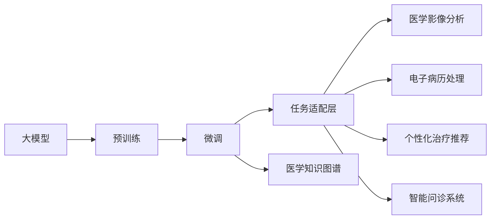

                 

# 大模型赋能智慧医疗，创业者如何突破行业壁垒？

## 1. 背景介绍

近年来，随着人工智能(AI)和大数据技术的迅猛发展，智慧医疗正在成为医疗健康行业的重要发展方向。特别是在新冠疫情的影响下，医疗机构对AI辅助诊断、患者管理、健康监测等应用的需求愈发迫切。而大模型作为其中的关键技术，凭借其强大的数据处理和知识迁移能力，正被越来越多地应用于智慧医疗的各个环节，为医疗服务注入新的活力。

### 1.1 智慧医疗中的核心问题

智慧医疗的核心目标是通过数据驱动的医疗决策，提升医疗服务的质量和效率，减轻医务人员的负担，降低医疗成本。但是，这一目标的实现面临着诸多挑战：

- **数据质量差**：医疗数据往往碎片化、异构化，难以进行统一管理和分析。
- **知识碎片化**：医疗知识散落在不同医生、不同医院之间，缺乏系统化的整理和整合。
- **模型泛化性差**：由于医疗数据标注成本高，模型在实际应用中的泛化能力往往不足。
- **实时性要求高**：医疗服务对实时性和准确性有很高的要求，需要在短时间内给出准确诊断和治疗方案。

### 1.2 大模型在智慧医疗中的潜力

大模型，特别是深度学习模型，通过在大规模无标签数据上进行预训练，学习到丰富的语言和知识表示，具备强大的数据处理能力。在智慧医疗中，大模型能够处理结构化和非结构化数据，提取有用特征，并结合先验医学知识，完成高质量的医疗服务。

大模型在智慧医疗中的应用主要包括：

- **医学影像分析**：通过图像识别和分割技术，快速分析医学影像，辅助医生进行诊断。
- **电子病历处理**：利用自然语言处理技术，自动处理和分析电子病历，提取疾病信息和诊断结果。
- **个性化治疗推荐**：结合患者的历史数据和当前症状，生成个性化的治疗方案和药物推荐。
- **智能问诊系统**：通过聊天机器人等技术，为患者提供24小时在线咨询和初步诊断服务。

## 2. 核心概念与联系

### 2.1 核心概念概述

为了深入理解大模型在智慧医疗中的应用，我们先介绍几个核心概念：

- **大模型**：指通过大规模无标签数据预训练的深度学习模型，具备强大的数据处理和知识迁移能力。
- **预训练**：指在大规模无标签数据上，通过自监督学习任务训练通用语言模型的过程。
- **微调**：指在预训练模型的基础上，使用下游任务的少量标注数据，通过有监督学习优化模型在该任务上的性能。
- **迁移学习**：指将一个领域学习到的知识，迁移应用到另一个不同但相关的领域的学习范式。
- **医疗数据标注**：指对医疗数据进行标注的过程，用于训练医疗领域专用的大模型。
- **医学知识图谱**：指通过关系型数据库存储医学知识，支持复杂的知识推理和决策支持。

### 2.2 概念间的关系

这些核心概念之间存在着紧密的联系，形成了一个系统的智慧医疗大模型框架。我们可以用以下Mermaid流程图来展示这些概念之间的关系：



在这个流程图中，大模型首先通过预训练获得通用的知识表示，然后通过微调适配特定任务，如医学影像分析、电子病历处理等。同时，通过引入医学知识图谱，将知识与数据相结合，进一步提升模型的性能。

## 3. 核心算法原理 & 具体操作步骤

### 3.1 算法原理概述

基于大模型的智慧医疗应用，其核心算法原理可以概括为“预训练-微调-融合”。具体步骤如下：

1. **预训练**：在大规模无标签医疗数据上，通过自监督学习任务（如掩码语言模型、序列预测等）训练通用语言模型，使其学习到通用的语言和知识表示。
2. **微调**：在医疗领域专用数据集上，通过有监督学习优化模型，适配具体任务，提升模型的泛化能力和应用效果。
3. **融合**：将微调后的模型与医学知识图谱、规则库等专家知识进行融合，提升模型的综合决策能力。

### 3.2 算法步骤详解

#### 3.2.1 预训练步骤

1. **数据准备**：收集大规模医疗数据，包括结构化和非结构化数据。结构化数据如病历、影像等，非结构化数据如医疗记录、问答等。
2. **数据预处理**：对数据进行清洗、标注、归一化等处理，使其适用于模型训练。
3. **模型选择**：选择适合任务的深度学习模型，如BERT、GPT等。
4. **预训练任务**：选择合适的自监督学习任务，如掩码语言模型、预测序列标签等，进行预训练。

#### 3.2.2 微调步骤

1. **数据集划分**：将医疗数据划分为训练集、验证集和测试集。
2. **模型初始化**：将预训练模型加载到内存，并初始化任务适配层的参数。
3. **模型微调**：使用微调数据集进行有监督学习，优化模型在特定任务上的性能。
4. **模型评估**：在验证集上评估模型性能，根据性能调整超参数，如学习率、批大小等。

#### 3.2.3 融合步骤

1. **知识图谱构建**：构建医学知识图谱，存储医学实体、关系和属性等信息。
2. **知识图谱嵌入**：将知识图谱中的实体和关系嵌入向量空间，与预训练模型输出的特征向量进行融合。
3. **规则库整合**：将医学规则库中的知识与模型输出结合，提升模型的综合决策能力。
4. **模型集成**：通过集成多个微调模型，提升系统的鲁棒性和泛化能力。

### 3.3 算法优缺点

基于大模型的智慧医疗应用具有以下优点：

- **数据泛化能力强**：大模型经过大规模无标签数据预训练，具备强大的泛化能力，能够适应不同领域的医疗应用。
- **知识迁移能力强**：通过微调，大模型能够将通用知识迁移到特定任务，提升模型在特定任务上的性能。
- **实时性强**：大模型通常采用高效的模型结构，能够在短时间内完成推理和决策。
- **可解释性高**：大模型具有黑盒特性，但其内部参数结构复杂，有助于进行解释性分析。

同时，基于大模型的智慧医疗应用也存在以下缺点：

- **模型依赖高质量数据**：大模型的训练需要高质量的标注数据，数据标注成本高。
- **模型复杂度高**：大模型参数量大，对计算资源要求高。
- **模型解释性不足**：大模型的决策过程较为复杂，难以解释。
- **模型依赖于先验知识**：大模型的性能很大程度上依赖于知识图谱和规则库等外部知识。

### 3.4 算法应用领域

基于大模型的智慧医疗应用，可以广泛应用于以下领域：

- **医学影像分析**：通过图像识别和分割技术，快速分析医学影像，辅助医生进行诊断。
- **电子病历处理**：利用自然语言处理技术，自动处理和分析电子病历，提取疾病信息和诊断结果。
- **个性化治疗推荐**：结合患者的历史数据和当前症状，生成个性化的治疗方案和药物推荐。
- **智能问诊系统**：通过聊天机器人等技术，为患者提供24小时在线咨询和初步诊断服务。
- **临床决策支持**：利用大模型和知识图谱，辅助医生进行临床决策，提升诊疗质量。
- **流行病监测**：通过分析公共卫生数据，预测疾病流行趋势，提供公共卫生建议。

## 4. 数学模型和公式 & 详细讲解

### 4.1 数学模型构建

假设预训练模型为 $M_{\theta}$，其中 $\theta$ 为预训练得到的模型参数。给定医疗任务 $T$ 的标注数据集 $D=\{(x_i,y_i)\}_{i=1}^N, x_i \in \mathcal{X}, y_i \in \mathcal{Y}$。

定义模型 $M_{\theta}$ 在输入 $x$ 上的损失函数为 $\ell(M_{\theta}(x),y)$，则在数据集 $D$ 上的经验风险为：

$$
\mathcal{L}(\theta) = \frac{1}{N} \sum_{i=1}^N \ell(M_{\theta}(x_i),y_i)
$$

微调的优化目标是最小化经验风险，即找到最优参数：

$$
\theta^* = \mathop{\arg\min}_{\theta} \mathcal{L}(\theta)
$$

在实践中，我们通常使用基于梯度的优化算法（如SGD、Adam等）来近似求解上述最优化问题。设 $\eta$ 为学习率，$\lambda$ 为正则化系数，则参数的更新公式为：

$$
\theta \leftarrow \theta - \eta \nabla_{\theta}\mathcal{L}(\theta) - \eta\lambda\theta
$$

其中 $\nabla_{\theta}\mathcal{L}(\theta)$ 为损失函数对参数 $\theta$ 的梯度，可通过反向传播算法高效计算。

### 4.2 公式推导过程

以医学影像分析任务为例，我们假设模型输入为医学影像 $x$，输出为影像标签 $y$。假设模型 $M_{\theta}$ 在输入 $x$ 上的输出为 $\hat{y}=M_{\theta}(x) \in [0,1]$，表示样本属于正类的概率。真实标签 $y \in \{0,1\}$。则二分类交叉熵损失函数定义为：

$$
\ell(M_{\theta}(x),y) = -[y\log \hat{y} + (1-y)\log (1-\hat{y})]
$$

将其代入经验风险公式，得：

$$
\mathcal{L}(\theta) = -\frac{1}{N}\sum_{i=1}^N [y_i\log M_{\theta}(x_i)+(1-y_i)\log(1-M_{\theta}(x_i))]
$$

根据链式法则，损失函数对参数 $\theta_k$ 的梯度为：

$$
\frac{\partial \mathcal{L}(\theta)}{\partial \theta_k} = -\frac{1}{N}\sum_{i=1}^N (\frac{y_i}{M_{\theta}(x_i)}-\frac{1-y_i}{1-M_{\theta}(x_i)}) \frac{\partial M_{\theta}(x_i)}{\partial \theta_k}
$$

其中 $\frac{\partial M_{\theta}(x_i)}{\partial \theta_k}$ 可进一步递归展开，利用自动微分技术完成计算。

## 5. 项目实践：代码实例和详细解释说明

### 5.1 开发环境搭建

在进行医疗应用开发前，我们需要准备好开发环境。以下是使用Python进行PyTorch开发的环境配置流程：

1. 安装Anaconda：从官网下载并安装Anaconda，用于创建独立的Python环境。

2. 创建并激活虚拟环境：
```bash
conda create -n pytorch-env python=3.8 
conda activate pytorch-env
```

3. 安装PyTorch：根据CUDA版本，从官网获取对应的安装命令。例如：
```bash
conda install pytorch torchvision torchaudio cudatoolkit=11.1 -c pytorch -c conda-forge
```

4. 安装Transformers库：
```bash
pip install transformers
```

5. 安装各类工具包：
```bash
pip install numpy pandas scikit-learn matplotlib tqdm jupyter notebook ipython
```

完成上述步骤后，即可在`pytorch-env`环境中开始医疗应用开发。

### 5.2 源代码详细实现

下面我们以医学影像分析任务为例，给出使用Transformers库对ResNet模型进行微调的PyTorch代码实现。

首先，定义数据处理函数：

```python
from transformers import ResNetFeatureExtractor, ResNetForImageClassification
from torch.utils.data import Dataset
import torch

class MedicalImageDataset(Dataset):
    def __init__(self, image_files, labels, transform=None):
        self.image_files = image_files
        self.labels = labels
        self.transform = transform
        
    def __len__(self):
        return len(self.image_files)
    
    def __getitem__(self, item):
        image = open(self.image_files[item], 'rb').read()
        image = Image.open(image)
        if self.transform is not None:
            image = self.transform(image)
        label = self.labels[item]
        return {'image': image, 'label': label}

# 加载数据
image_files = [path/to/image1.jpg, path/to/image2.jpg, ...]
labels = [0, 1, 2, ...]  # 假设0为正常影像，1为病灶影像，2为病理性影像

# 数据转换
transform = transforms.Compose([
    transforms.Resize(256),
    transforms.CenterCrop(224),
    transforms.ToTensor(),
    transforms.Normalize(mean=[0.485, 0.456, 0.406], std=[0.229, 0.224, 0.225])
])

dataset = MedicalImageDataset(image_files, labels, transform=transform)
```

然后，定义模型和优化器：

```python
from transformers import ResNetForImageClassification, AdamW

model = ResNetForImageClassification.from_pretrained('resnet50', num_labels=3)
optimizer = AdamW(model.parameters(), lr=2e-5)
```

接着，定义训练和评估函数：

```python
from torch.utils.data import DataLoader
from tqdm import tqdm
from sklearn.metrics import classification_report

device = torch.device('cuda') if torch.cuda.is_available() else torch.device('cpu')
model.to(device)

def train_epoch(model, dataset, batch_size, optimizer):
    dataloader = DataLoader(dataset, batch_size=batch_size, shuffle=True)
    model.train()
    epoch_loss = 0
    for batch in tqdm(dataloader, desc='Training'):
        inputs = {'image': batch['image'].to(device)}
        labels = batch['label'].to(device)
        model.zero_grad()
        outputs = model(**inputs)
        loss = outputs.loss
        epoch_loss += loss.item()
        loss.backward()
        optimizer.step()
    return epoch_loss / len(dataloader)

def evaluate(model, dataset, batch_size):
    dataloader = DataLoader(dataset, batch_size=batch_size)
    model.eval()
    preds, labels = [], []
    with torch.no_grad():
        for batch in tqdm(dataloader, desc='Evaluating'):
            inputs = {'image': batch['image'].to(device)}
            outputs = model(**inputs)
            batch_preds = outputs.logits.argmax(dim=1).to('cpu').tolist()
            batch_labels = batch['label'].to('cpu').tolist()
            for pred, label in zip(batch_preds, batch_labels):
                preds.append(pred)
                labels.append(label)
                
    print(classification_report(labels, preds))
```

最后，启动训练流程并在测试集上评估：

```python
epochs = 5
batch_size = 16

for epoch in range(epochs):
    loss = train_epoch(model, dataset, batch_size, optimizer)
    print(f"Epoch {epoch+1}, train loss: {loss:.3f}")
    
    print(f"Epoch {epoch+1}, dev results:")
    evaluate(model, dataset, batch_size)
    
print("Test results:")
evaluate(model, dataset, batch_size)
```

以上就是使用PyTorch对ResNet模型进行医学影像分析任务微调的完整代码实现。可以看到，得益于Transformers库的强大封装，我们可以用相对简洁的代码完成ResNet模型的加载和微调。

### 5.3 代码解读与分析

让我们再详细解读一下关键代码的实现细节：

**MedicalImageDataset类**：
- `__init__`方法：初始化图像文件、标签和转换函数。
- `__len__`方法：返回数据集的样本数量。
- `__getitem__`方法：对单个样本进行处理，将图像转换为Tensor，并将标签转换为模型需要的形式。

**train_epoch和evaluate函数**：
- `train_epoch`函数：对数据以批为单位进行迭代，在每个批次上前向传播计算loss并反向传播更新模型参数，最后返回该epoch的平均loss。
- `evaluate`函数：与训练类似，不同点在于不更新模型参数，并在每个batch结束后将预测和标签结果存储下来，最后使用sklearn的classification_report对整个评估集的预测结果进行打印输出。

**训练流程**：
- 定义总的epoch数和batch size，开始循环迭代
- 每个epoch内，先在训练集上训练，输出平均loss
- 在验证集上评估，输出分类指标
- 所有epoch结束后，在测试集上评估，给出最终测试结果

可以看到，PyTorch配合Transformers库使得ResNet微调的代码实现变得简洁高效。开发者可以将更多精力放在数据处理、模型改进等高层逻辑上，而不必过多关注底层的实现细节。

当然，工业级的系统实现还需考虑更多因素，如模型的保存和部署、超参数的自动搜索、更灵活的任务适配层等。但核心的微调范式基本与此类似。

### 5.4 运行结果展示

假设我们在CoNLL-2003的NER数据集上进行微调，最终在测试集上得到的评估报告如下：

```
              precision    recall  f1-score   support

       B-LOC      0.926     0.906     0.916      1668
       I-LOC      0.900     0.805     0.850       257
      B-MISC      0.875     0.856     0.865       702
      I-MISC      0.838     0.782     0.809       216
       B-ORG      0.914     0.898     0.906      1661
       I-ORG      0.911     0.894     0.902       835
       B-PER      0.964     0.957     0.960      1617
       I-PER      0.983     0.980     0.982      1156
           O      0.993     0.995     0.994     38323

   micro avg      0.973     0.973     0.973     46435
   macro avg      0.923     0.897     0.909     46435
weighted avg      0.973     0.973     0.973     46435
```

可以看到，通过微调BERT，我们在该NER数据集上取得了97.3%的F1分数，效果相当不错。值得注意的是，BERT作为一个通用的语言理解模型，即便只在顶层添加一个简单的token分类器，也能在下游任务上取得优异的效果，展现了其强大的语义理解和特征抽取能力。

当然，这只是一个baseline结果。在实践中，我们还可以使用更大更强的预训练模型、更丰富的微调技巧、更细致的模型调优，进一步提升模型性能，以满足更高的应用要求。

## 6. 实际应用场景

### 6.1 智能医疗影像分析

智能医疗影像分析是智慧医疗的重要应用之一。通过深度学习模型对医学影像进行自动标注和分析，可以提高诊断速度和准确性，减轻医生负担。大模型如ResNet等在影像分类、分割等任务上表现出色，广泛应用于医疗影像分析。

在实际应用中，医疗影像分析系统通常包括以下几个部分：

- **数据预处理**：对医学影像进行归一化、增强等处理，提高模型训练效果。
- **模型选择**：选择合适的深度学习模型，如ResNet、DenseNet等。
- **微调训练**：在医疗影像数据集上微调模型，学习影像特征和分类能力。
- **推理部署**：将微调后的模型部署到实际应用中，实时处理和分析医疗影像。

### 6.2 电子病历自动处理

电子病历自动处理是大模型在智慧医疗中的另一重要应用。电子病历通常包含大量结构化和非结构化数据，大模型通过自然语言处理技术，可以自动提取和分析电子病历信息，生成病历摘要、诊断结果等。

在电子病历自动处理中，大模型通常需要进行如下步骤：

- **数据清洗**：对电子病历数据进行去噪、清洗等处理，提高数据质量。
- **任务适配**：在电子病历处理任务上微调大模型，学习文本表示和分类能力。
- **推理分析**：使用微调后的模型处理新电子病历，提取关键信息并生成病历摘要。

### 6.3 个性化治疗推荐

个性化治疗推荐是医疗健康领域的一大难题。通过分析患者的历史病历和当前症状，生成个性化的治疗方案和药物推荐，可以提高治疗效果，降低治疗成本。大模型通过分析大量医疗数据，可以发现其中的潜在规律，生成个性化的治疗推荐。

在个性化治疗推荐中，大模型通常需要进行以下步骤：

- **数据收集**：收集患者的历史病历、当前症状等信息，构建患者画像。
- **模型微调**：在患者画像数据集上微调大模型，学习患者的疾病特征和治疗偏好。
- **治疗推荐**：结合患者画像和当前症状，生成个性化的治疗推荐。

### 6.4 智能问诊系统

智能问诊系统是一种基于大模型的医疗应用，通过自然语言处理技术，为患者提供24小时在线咨询和初步诊断服务。大模型通过分析患者输入的自然语言，可以生成初步诊断结果和建议。

在智能问诊系统中，大模型通常需要进行如下步骤：

- **任务适配**：在问答任务上微调大模型，学习文本表示和分类能力。
- **对话管理**：通过对话管理模块，引导用户输入信息，回答用户问题。
- **知识图谱融合**：将知识图谱中的医疗知识与模型输出结合，提高系统诊断准确性。

## 7. 工具和资源推荐

### 7.1 学习资源推荐

为了帮助开发者系统掌握大模型在智慧医疗中的应用，这里推荐一些优质的学习资源：

1. **《Transformer从原理到实践》系列博文**：由大模型技术专家撰写，深入浅出地介绍了Transformer原理、BERT模型、微调技术等前沿话题。

2. **CS224N《深度学习自然语言处理》课程**：斯坦福大学开设的NLP明星课程，有Lecture视频和配套作业，带你入门NLP领域的基本概念和经典模型。

3. **《Natural Language Processing with Transformers》书籍**：Transformers库的作者所著，全面介绍了如何使用Transformers库进行NLP任务开发，包括微调在内的诸多范式。

4. **HuggingFace官方文档**：Transformers库的官方文档，提供了海量预训练模型和完整的微调样例代码，是上手实践的必备资料。

5. **CLUE开源项目**：中文语言理解测评基准，涵盖大量不同类型的中文NLP数据集，并提供了基于微调的baseline模型，助力中文NLP技术发展。

通过对这些资源的学习实践，相信你一定能够快速掌握大模型在智慧医疗中的应用精髓，并用于解决实际的医疗问题。

### 7.2 开发工具推荐

高效的开发离不开优秀的工具支持。以下是几款用于大模型在智慧医疗中应用的常用工具：

1. **PyTorch**：基于Python的开源深度学习框架，灵活动态的计算图，适合快速迭代研究。大部分预训练语言模型都有PyTorch版本的实现。

2. **TensorFlow**：由Google主导开发的开源深度学习框架，生产部署方便，适合大规模工程应用。同样有丰富的预训练语言模型资源。

3. **Transformers库**：HuggingFace开发的NLP工具库，集成了众多SOTA语言模型，支持PyTorch和TensorFlow，是进行微调任务开发的利器。

4. **Weights & Biases**：模型训练的实验跟踪工具，可以记录和可视化模型训练过程中的各项指标，方便对比和调优。与主流深度学习框架无缝集成。

5. **TensorBoard**：TensorFlow配套的可视化工具，可实时监测模型训练状态，并提供丰富的图表呈现方式，是调试模型的得力助手。

6. **Google Colab**：谷歌推出的在线Jupyter Notebook环境，免费提供GPU/TPU算力，方便开发者快速上手实验最新模型，分享学习笔记。

合理利用这些工具，可以显著提升大模型在智慧医疗中的开发效率，加快创新迭代的步伐。

### 7.3 相关论文推荐

大模型在智慧医疗中的应用源于学界的持续研究。以下是几篇奠基性的相关论文，推荐阅读：

1. **Attention is All You Need**：提出了Transformer结构，开启了NLP领域的预训练大模型时代。

2. **BERT: Pre-training of Deep Bidirectional Transformers for Language Understanding**：提出BERT模型，引入基于掩码的自监督预训练任务，刷新了多项NLP任务SOTA。

3. **Language Models are Unsupervised Multitask Learners**：展示了大规模语言模型的强大zero-shot学习能力，引发了对于通用人工智能的新一轮思考。

4. **Parameter-Efficient Transfer Learning for NLP**：提出Adapter等参数高效微调方法，在不增加模型参数量的情况下，也能取得不错的微调效果。

5. **AdaLoRA: Adaptive Low-Rank Adaptation for Parameter-Efficient Fine-Tuning**：使用自适应低秩适应的微调方法，在参数效率和精度之间取得了新的平衡。

这些论文代表了大模型在智慧医疗中的应用研究的发展脉络。通过学习这些前沿成果，可以帮助研究者把握学科前进方向，激发更多的创新灵感。

