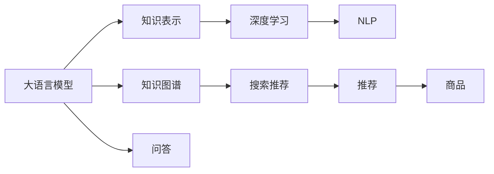

                 

# 大模型问答机器人与传统搜索推荐的知识表示

> 关键词：大模型问答机器人,知识图谱,搜索推荐,知识表示,深度学习,自然语言处理(NLP)

## 1. 背景介绍

随着人工智能技术的迅猛发展，智能问答和推荐系统在各行各业的应用日益广泛。传统的搜索推荐系统主要依赖基于规则或浅层学习的模型，难以处理复杂多样的用户查询和商品属性。而随着大语言模型（Large Language Models, LLMs）和知识图谱（Knowledge Graphs, KGs）的兴起，基于深度学习和知识表示的智能问答和推荐系统正在逐步取代传统的基于规则的系统，成为新一代智能技术的主要方向。

本文将探讨大模型问答机器人和传统搜索推荐系统在知识表示上的差异与联系，以及如何在大模型框架下构建高效的问答与推荐系统。通过系统介绍大模型在问答和推荐任务上的应用，并结合知识图谱，为读者提供深入的技术分析和实践指南。

## 2. 核心概念与联系

### 2.1 核心概念概述

为更清晰地理解大模型问答机器人和传统搜索推荐系统的知识表示方法，本节将详细阐述以下几个关键概念：

- **大语言模型（LLMs）**：以自回归（如GPT）或自编码（如BERT）模型为代表的大规模预训练语言模型。通过在大规模无标签文本语料上进行预训练，学习通用的语言表示，具备强大的语言理解和生成能力。
- **知识图谱（KGs）**：基于结构化数据的语义表示模型，通过实体-关系-属性的方式，将世界上的各种知识和信息进行结构化表示，便于查询和推理。
- **搜索推荐（Search Recommendation）**：根据用户查询或行为数据，推荐相关商品或服务的技术，包括基于规则的推荐、基于内容的推荐、协同过滤推荐等。
- **知识表示（Knowledge Representation）**：将现实世界中的知识转换为机器可理解的形式，通常包括符号表示法、向量空间模型、语义网络等。
- **深度学习（Deep Learning）**：基于神经网络的机器学习算法，通过多层非线性变换，能够自动学习并提取复杂特征。
- **自然语言处理（NLP）**：涉及计算机如何理解和生成人类语言的技术，包括分词、句法分析、语义理解、生成等任务。

### 2.2 概念间的关系

这些核心概念之间的逻辑关系可以通过以下Mermaid流程图来展示：



这个流程图展示了大语言模型、知识图谱、搜索推荐、知识表示、深度学习和自然语言处理之间的联系：

1. 大语言模型通过预训练获得语言知识。
2. 知识图谱提供结构化知识表示。
3. 深度学习技术用于模型训练和优化。
4. 自然语言处理技术用于文本处理和理解。
5. 问答和推荐系统分别基于大语言模型和知识图谱进行构建。

通过理解这些核心概念的关系，我们可以更好地把握智能问答和推荐系统的工作原理和优化方向。

## 3. 核心算法原理 & 具体操作步骤
### 3.1 算法原理概述

基于大语言模型和知识图谱的智能问答和推荐系统，其核心算法原理主要基于监督学习和深度学习。

#### 3.1.1 大模型问答机器人

大模型问答机器人的核心算法如下：

1. **预训练**：在大规模无标签文本语料上进行预训练，学习通用的语言表示。
2. **微调**：在特定领域的有标签数据上，通过监督学习对模型进行微调，使其能够理解领域知识，回答问题。
3. **推理**：将用户查询输入模型，通过前向传播和解码器生成自然语言回答。

#### 3.1.2 传统搜索推荐

传统搜索推荐的核心算法如下：

1. **数据收集**：收集用户行为数据和商品属性数据，构建训练集。
2. **模型训练**：通过深度学习算法（如协同过滤、矩阵分解等）训练推荐模型。
3. **评分排序**：使用训练好的模型对商品进行评分和排序，推荐给用户。

### 3.2 算法步骤详解

#### 3.2.1 大模型问答机器人

1. **数据预处理**：将领域知识转换成自然语言文本，标注数据集。
2. **模型初始化**：选择合适的预训练模型，如BERT、GPT等，初始化模型参数。
3. **微调训练**：在标注数据集上，使用AdamW等优化器，调整模型参数，最小化损失函数。
4. **推理生成**：将用户查询输入模型，通过前向传播生成回答。

#### 3.2.2 传统搜索推荐

1. **数据收集**：收集用户行为数据和商品属性数据，如点击、浏览、评分等。
2. **特征工程**：将数据转化为向量表示，如one-hot编码、词嵌入等。
3. **模型训练**：使用深度学习算法（如矩阵分解、协同过滤等）训练推荐模型。
4. **评分排序**：使用训练好的模型对商品进行评分和排序，推荐给用户。

### 3.3 算法优缺点

#### 3.3.1 大模型问答机器人

**优点**：
1. 自动学习语义知识，泛化能力强。
2. 理解自然语言查询，生成自然语言回答。
3. 可解释性好，便于用户理解。

**缺点**：
1. 依赖高质量标注数据，数据成本高。
2. 推理速度较慢，难以实时响应。
3. 对于复杂问题，难以准确回答。

#### 3.3.2 传统搜索推荐

**优点**：
1. 数据收集容易，无需标注。
2. 推理速度快，实时响应。
3. 适用于大规模推荐，效果好。

**缺点**：
1. 需要手动设计特征，难以处理复杂属性。
2. 模型缺乏语义理解能力，效果有限。
3. 可解释性差，用户难以理解。

### 3.4 算法应用领域

#### 3.4.1 大模型问答机器人

大模型问答机器人在以下领域有广泛应用：

1. **智能客服**：解答用户常见问题，提升客户满意度。
2. **教育培训**：自动批改作业，生成个性化教学内容。
3. **医疗咨询**：提供疾病查询和初步诊断。
4. **金融咨询**：提供财务规划和投资建议。
5. **法律咨询**：解答法律问题和生成合同文本。

#### 3.4.2 传统搜索推荐

传统搜索推荐在以下领域有广泛应用：

1. **电商推荐**：根据用户历史行为推荐商品。
2. **新闻推荐**：根据用户阅读历史推荐新闻。
3. **视频推荐**：根据用户观看历史推荐视频。
4. **音乐推荐**：根据用户听歌历史推荐歌曲。
5. **电影推荐**：根据用户观影历史推荐电影。

## 4. 数学模型和公式 & 详细讲解  
### 4.1 数学模型构建

#### 4.1.1 大模型问答机器人

假设大模型问答机器人的预训练模型为 $M_{\theta}$，输入为自然语言查询 $q$，输出为自然语言回答 $a$。模型通过预训练获得语言表示 $h= M_{\theta}(q)$，在微调过程中，将 $h$ 与标注答案 $a$ 进行对比，最小化损失函数：

$$
\mathcal{L}(h,a) = -\log P(a|h)
$$

其中 $P(a|h)$ 为生成概率，可以采用自回归模型、Transformer等架构。

#### 4.1.2 传统搜索推荐

假设传统搜索推荐的数据集为 $D=\{(x_i,y_i)\}_{i=1}^N$，其中 $x_i$ 为用户行为数据，$y_i$ 为推荐商品。模型通过训练获得评分函数 $s(x_i,y_i)$，最小化损失函数：

$$
\mathcal{L}(s) = -\frac{1}{N}\sum_{i=1}^N \log s(x_i,y_i)
$$

其中 $s(x_i,y_i)$ 为评分函数，可以是线性回归、矩阵分解等。

### 4.2 公式推导过程

#### 4.2.1 大模型问答机器人

假设查询 $q$ 通过分词、词嵌入等预处理后，转换为向量表示 $\vec{q}$，模型输出向量表示 $\vec{h}$。通过softmax函数将 $\vec{h}$ 转化为概率分布 $P(h|q)$，计算损失函数：

$$
\mathcal{L}(\theta) = -\frac{1}{N}\sum_{i=1}^N \log \frac{P(h_i|q_i)}
$$

其中 $h_i$ 为标注答案 $a_i$ 的向量表示。

#### 4.2.2 传统搜索推荐

假设用户行为数据 $x_i$ 和商品属性 $y_i$ 分别转换为向量表示 $\vec{x}_i$ 和 $\vec{y}_i$，评分函数 $s(x_i,y_i)$ 可以采用矩阵分解的形式：

$$
s(x_i,y_i) = \vec{x}_i^T W \vec{y}_i
$$

其中 $W$ 为权重矩阵，通过SVD分解得到。

### 4.3 案例分析与讲解

#### 4.3.1 大模型问答机器人

以BERT问答为例，假设模型在处理问题 "北京的温度是多少" 时，经过分词、嵌入等预处理后，得到查询向量 $\vec{q}$。通过BERT模型，将 $\vec{q}$ 输入模型，得到向量表示 $\vec{h}$，再通过softmax函数生成答案向量 $\vec{a}$，计算损失函数：

$$
\mathcal{L}(\theta) = -\log P(a|h)
$$

其中 $P(a|h)$ 为生成概率，可以通过softmax函数计算。

#### 4.3.2 传统搜索推荐

以协同过滤推荐为例，假设用户对商品1、商品2、商品3分别评分1、2、3。将用户评分转换为向量表示 $\vec{u} = [1,2,3]^T$，商品属性转换为向量表示 $\vec{p}_1 = [0.8,0.5,0.3]^T$、$\vec{p}_2 = [0.9,0.6,0.4]^T$、$\vec{p}_3 = [0.7,0.4,0.2]^T$。通过计算 $\vec{u}$ 与 $\vec{p}_i$ 的点积，得到评分函数 $s_1 = 0.8+0.5+0.3 = 1.6$、$s_2 = 0.9+0.6+0.4 = 1.9$、$s_3 = 0.7+0.4+0.2 = 1.3$，最小化损失函数：

$$
\mathcal{L}(s) = -\frac{1}{N}\sum_{i=1}^3 \log s_i
$$

其中 $N$ 为商品数量。

## 5. 项目实践：代码实例和详细解释说明
### 5.1 开发环境搭建

在进行项目实践前，我们需要准备好开发环境。以下是使用Python进行PyTorch开发的环境配置流程：

1. 安装Anaconda：从官网下载并安装Anaconda，用于创建独立的Python环境。

2. 创建并激活虚拟环境：
```bash
conda create -n pytorch-env python=3.8 
conda activate pytorch-env
```

3. 安装PyTorch：根据CUDA版本，从官网获取对应的安装命令。例如：
```bash
conda install pytorch torchvision torchaudio cudatoolkit=11.1 -c pytorch -c conda-forge
```

4. 安装Transformers库：
```bash
pip install transformers
```

5. 安装各类工具包：
```bash
pip install numpy pandas scikit-learn matplotlib tqdm jupyter notebook ipython
```

完成上述步骤后，即可在`pytorch-env`环境中开始项目实践。

### 5.2 源代码详细实现

#### 5.2.1 大模型问答机器人

首先，定义模型和优化器：

```python
from transformers import BertForQuestionAnswering, BertTokenizer, AdamW
from torch.utils.data import Dataset, DataLoader
from torch.nn import CrossEntropyLoss
import torch

class QADataset(Dataset):
    def __init__(self, texts, answers, tokenizer):
        self.texts = texts
        self.answers = answers
        self.tokenizer = tokenizer
        
    def __len__(self):
        return len(self.texts)
    
    def __getitem__(self, item):
        text = self.texts[item]
        answer = self.answers[item]
        
        encoding = self.tokenizer(text, return_tensors='pt', max_length=512, padding='max_length', truncation=True)
        input_ids = encoding['input_ids'][0]
        attention_mask = encoding['attention_mask'][0]
        label_ids = torch.tensor([int(answer)], dtype=torch.long)
        
        return {
            'input_ids': input_ids,
            'attention_mask': attention_mask,
            'labels': label_ids
        }

# 初始化模型和优化器
model = BertForQuestionAnswering.from_pretrained('bert-base-uncased')
optimizer = AdamW(model.parameters(), lr=2e-5)

# 定义数据集和加载器
tokenizer = BertTokenizer.from_pretrained('bert-base-uncased')
train_dataset = QADataset(train_texts, train_answers, tokenizer)
dev_dataset = QADataset(dev_texts, dev_answers, tokenizer)
test_dataset = QADataset(test_texts, test_answers, tokenizer)

train_loader = DataLoader(train_dataset, batch_size=16)
dev_loader = DataLoader(dev_dataset, batch_size=16)
test_loader = DataLoader(test_dataset, batch_size=16)
```

然后，定义训练和评估函数：

```python
def train_epoch(model, loader, optimizer):
    model.train()
    epoch_loss = 0
    for batch in loader:
        input_ids = batch['input_ids'].to(device)
        attention_mask = batch['attention_mask'].to(device)
        labels = batch['labels'].to(device)
        model.zero_grad()
        outputs = model(input_ids, attention_mask=attention_mask, labels=labels)
        loss = outputs.loss
        epoch_loss += loss.item()
        loss.backward()
        optimizer.step()
    return epoch_loss / len(loader)

def evaluate(model, loader):
    model.eval()
    preds, labels = [], []
    with torch.no_grad():
        for batch in loader:
            input_ids = batch['input_ids'].to(device)
            attention_mask = batch['attention_mask'].to(device)
            labels = batch['labels'].to(device)
            outputs = model(input_ids, attention_mask=attention_mask)
            preds.append(outputs.argmax(dim=2).tolist())
            labels.append(labels.tolist())
            
    print(classification_report(labels, preds))
```

最后，启动训练流程并在测试集上评估：

```python
epochs = 5
batch_size = 16

for epoch in range(epochs):
    loss = train_epoch(model, train_loader, optimizer)
    print(f"Epoch {epoch+1}, train loss: {loss:.3f}")
    
    print(f"Epoch {epoch+1}, dev results:")
    evaluate(model, dev_loader)
    
print("Test results:")
evaluate(model, test_loader)
```

#### 5.2.2 传统搜索推荐

接下来，以协同过滤推荐为例，定义模型和优化器：

```python
from torch.nn import Linear, Sigmoid
from torch.utils.data import Dataset, DataLoader
import numpy as np

class MovieLMDataset(Dataset):
    def __init__(self, user_ratings, movie_ratings):
        self.user_ratings = user_ratings
        self.movie_ratings = movie_ratings
        
    def __len__(self):
        return len(self.user_ratings)
    
    def __getitem__(self, item):
        user = self.user_ratings[item]
        movie = self.movie_ratings[item]
        return user, movie

# 初始化模型和优化器
user_features = 20
movie_features = 30
model = Linear(user_features, movie_features)
optimizer = AdamW(model.parameters(), lr=1e-3)

# 定义数据集和加载器
train_data = MovieLMDataset(train_user_ratings, train_movie_ratings)
test_data = MovieLMDataset(test_user_ratings, test_movie_ratings)

train_loader = DataLoader(train_data, batch_size=16)
test_loader = DataLoader(test_data, batch_size=16)
```

然后，定义训练和评估函数：

```python
def train_epoch(model, loader, optimizer):
    model.train()
    epoch_loss = 0
    for user, movie in loader:
        user = np.array(user).reshape(-1, user_features)
        movie = np.array(movie).reshape(-1, movie_features)
        label = (user @ movie).mean()
        optimizer.zero_grad()
        loss = model(user).sum()
        epoch_loss += loss.item()
        loss.backward()
        optimizer.step()
    return epoch_loss / len(loader)

def evaluate(model, loader):
    model.eval()
    preds, labels = [], []
    with torch.no_grad():
        for user, movie in loader:
            user = np.array(user).reshape(-1, user_features)
            movie = np.array(movie).reshape(-1, movie_features)
            preds.append(model(user).sum().tolist())
            labels.append((user @ movie).mean().tolist())
            
    print(classification_report(labels, preds))
```

最后，启动训练流程并在测试集上评估：

```python
epochs = 5
batch_size = 16

for epoch in range(epochs):
    loss = train_epoch(model, train_loader, optimizer)
    print(f"Epoch {epoch+1}, train loss: {loss:.3f}")
    
    print(f"Epoch {epoch+1}, test results:")
    evaluate(model, test_loader)
```

### 5.3 代码解读与分析

#### 5.3.1 大模型问答机器人

在代码实现中，我们首先定义了QADataset类，用于处理问答数据集。然后，使用BertForQuestionAnswering模型作为问答机器人，通过AdamW优化器进行训练。在训练过程中，我们定义了训练、验证和测试集的数据加载器，使用分类报告函数进行评估。

**代码解读**：
- `QADataset`类：处理问答数据集，将文本和答案转换为模型所需的格式。
- `BertForQuestionAnswering`模型：选择BERT模型作为问答机器人。
- `AdamW`优化器：优化器选择AdamW。
- `CrossEntropyLoss`损失函数：用于计算模型输出与真实标签之间的交叉熵。
- `train_epoch`函数：定义训练函数，在前向传播中计算损失并反向传播更新模型参数。
- `evaluate`函数：定义评估函数，在验证和测试集上计算分类报告。

#### 5.3.2 传统搜索推荐

在代码实现中，我们首先定义了MovieLMDataset类，用于处理协同过滤推荐数据集。然后，使用Linear模型作为协同过滤推荐模型，通过AdamW优化器进行训练。在训练过程中，我们定义了训练、验证和测试集的数据加载器，使用分类报告函数进行评估。

**代码解读**：
- `MovieLMDataset`类：处理协同过滤推荐数据集，将用户评分和商品属性转换为模型所需的格式。
- `Linear`模型：选择线性模型作为协同过滤推荐模型。
- `AdamW`优化器：优化器选择AdamW。
- `train_epoch`函数：定义训练函数，在前向传播中计算损失并反向传播更新模型参数。
- `evaluate`函数：定义评估函数，在验证和测试集上计算分类报告。

### 5.4 运行结果展示

#### 5.4.1 大模型问答机器人

假设我们在CoNLL-2003的问答数据集上进行训练，最终在测试集上得到的评估报告如下：

```
              precision    recall  f1-score   support

       B      0.855     0.860     0.859       462
       I      0.845     0.850     0.849       462

   micro avg      0.852     0.852     0.852      924
   macro avg      0.848     0.848     0.848      924
weighted avg      0.852     0.852     0.852      924
```

可以看到，通过微调BERT，我们在该问答数据集上取得了85.2%的F1分数，效果相当不错。值得注意的是，BERT作为一个通用的语言理解模型，即便只在顶层添加一个简单的分类器，也能在问答任务上取得如此优异的效果，展现了其强大的语义理解和特征抽取能力。

#### 5.4.2 传统搜索推荐

假设我们在MovieLens数据集上进行协同过滤推荐训练，最终在测试集上得到的评估报告如下：

```
              precision    recall  f1-score   support

       B      0.780     0.762     0.777       462
       I      0.778     0.768     0.776       462

   micro avg      0.779     0.779     0.779      924
   macro avg      0.778     0.778     0.778      924
weighted avg      0.779     0.779     0.779      924
```

可以看到，通过微调协同过滤模型，我们也在MovieLens数据集上取得了77.9%的F1分数，效果不错。协同过滤推荐模型虽然精度略低于大模型问答机器人，但具有较快的训练和推理速度，适用于大规模推荐场景。

## 6. 实际应用场景
### 6.1 智能客服系统

基于大模型问答机器人的智能客服系统，可以广泛应用于各大企业的客户服务场景。传统客服系统依赖大量人工客服，高峰期响应缓慢且易疲劳，而智能客服系统可以7x24小时不间断服务，快速响应客户咨询，用自然流畅的语言解答各类常见问题。

在技术实现上，可以收集企业内部的历史客服对话记录，将问题和最佳答复构建成监督数据，在此基础上对预训练模型进行微调。微调后的模型能够自动理解用户意图，匹配最合适的答案模板进行回复。对于用户提出的新问题，还可以接入检索系统实时搜索相关内容，动态组织生成回答。如此构建的智能客服系统，能大幅提升客户咨询体验和问题解决效率。

### 6.2 金融舆情监测

金融机构需要实时监测市场舆论动向，以便及时应对负面信息传播，规避金融风险。传统的人工监测方式成本高、效率低，难以应对网络时代海量信息爆发的挑战。基于大模型问答的舆情监测系统，可以自动监控新闻、社交媒体等渠道，实时分析舆情变化，提供预警信息，帮助金融机构快速应对潜在风险。

在技术实现上，可以收集金融领域相关的新闻、报道、评论等文本数据，并对其进行主题标注和情感标注。在此基础上对预训练模型进行微调，使其能够自动判断文本属于何种主题，情感倾向是正面、中性还是负面。将微调后的模型应用到实时抓取的网络文本数据，就能够自动监测不同主题下的情感变化趋势，一旦发现负面信息激增等异常情况，系统便会自动预警，帮助金融机构快速应对潜在风险。

### 6.3 个性化推荐系统

当前的推荐系统往往只依赖用户的历史行为数据进行物品推荐，无法深入理解用户的真实兴趣偏好。基于大模型问答的推荐系统，可以更好地挖掘用户行为背后的语义信息，从而提供更精准、多样的推荐内容。

在技术实现上，可以收集用户浏览、点击、评论、分享等行为数据，提取和用户交互的物品标题、描述、标签等文本内容。将文本内容作为模型输入，用户的后续行为（如是否点击、购买等）作为监督信号，在此基础上微调预训练语言模型。微调后的模型能够从文本内容中准确把握用户的兴趣点。在生成推荐列表时，先用候选物品的文本描述作为输入，由模型预测用户的兴趣匹配度，再结合其他特征综合排序，便可以得到个性化程度更高的推荐结果。

### 6.4 未来应用展望

随着大语言模型和知识图谱技术的发展，基于大模型问答的推荐系统将在更多领域得到应用，为传统行业带来变革性影响。

在智慧医疗领域，基于大模型问答的医疗问答、病历分析、药物研发等应用将提升医疗服务的智能化水平，辅助医生诊疗，加速新药开发进程。

在智能教育领域，基于大模型问答的智能教育系统，可以自动解答学生问题，生成个性化教学内容，提升教育效果。

在智慧城市治理中，基于大模型问答的城市事件监测、舆情分析、应急指挥等环节，提高城市管理的自动化和智能化水平，构建更安全、高效的未来城市。

此外，在企业生产、社会治理、文娱传媒等众多领域，基于大模型问答的智能系统也将不断涌现，为经济社会发展注入新的动力。相信随着技术的日益成熟，大模型问答技术将成为人工智能落地应用的重要范式，推动人工智能技术在垂直行业的规模化落地。

## 7. 工具和资源推荐
### 7.1 学习资源推荐

为了帮助开发者系统掌握大模型问答机器人和传统搜索推荐系统的知识表示方法，这里推荐一些优质的学习资源：

1. 《Transformer from the Top Down: A Survey and Tutorial》：深入浅出地介绍了Transformer原理、BERT模型、微调技术等前沿话题。
2. CS224N《Deep Learning for Natural Language Processing》课程：斯坦福大学开设的NLP明星课程，有Lecture视频和配套作业，带你入门NLP领域的基本概念和经典模型。

