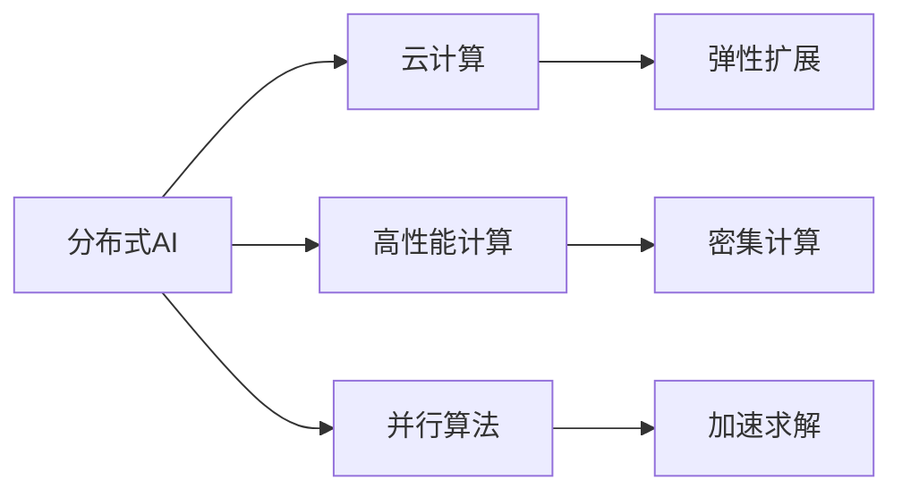
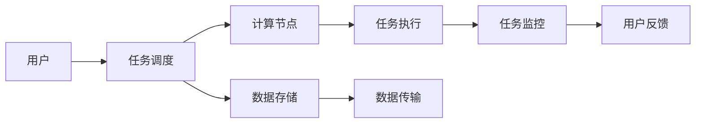

                 

# 大规模分布式AI计算：Lepton AI的技术突破

> 关键词：分布式AI, Lepton AI, 高性能计算, 云计算, 可扩展性, 容错性

## 1. 背景介绍

### 1.1 问题由来
随着人工智能技术的飞速发展，大规模分布式AI计算成为了学术界和工业界关注的焦点。特别在大数据、深度学习和自然语言处理等领域的普及，对于高性能计算资源的需求急剧增加。然而，传统的单体计算资源已无法满足日益增长的计算需求，分布式计算以其可扩展性、容错性等优势，逐渐成为了主流的AI计算范式。

但是，分布式计算系统面临着诸多技术挑战，如节点异构性、通信延迟、网络带宽限制等，这些都限制了分布式AI计算的性能提升。因此，如何快速构建高效、可靠、可扩展的分布式AI计算系统，成为了当前亟待解决的问题。

### 1.2 问题核心关键点
在分布式AI计算系统中，核心问题包括：
- 如何高效管理大规模资源，最大化计算性能。
- 如何实现数据的可靠传输与存储。
- 如何在分布式环境中实现高效的通信。
- 如何提高系统的容错性和鲁棒性。
- 如何保障系统的安全性与隐私保护。

解决这些问题，需要整合多种技术手段，包括云计算、大数据、网络优化、并行算法等，构建一个强大、灵活、高效的大规模分布式AI计算系统。

### 1.3 问题研究意义
研究大规模分布式AI计算的优化与突破，对于推动AI技术的普及和应用具有重要意义：

1. 加速AI技术落地：通过高效的分布式计算，可以将复杂的AI任务更快地部署到实际应用中，加速AI技术的产业化进程。
2. 提升AI性能：分布式计算通过多节点并行，可以大幅提升AI模型的训练和推理效率，缩短任务执行时间。
3. 降低计算成本：分布式计算能够有效利用云计算资源，降低单次计算的硬件和能耗成本。
4. 保障数据安全：分布式计算架构可以分散存储数据，避免单点故障和数据泄露风险。
5. 促进AI生态发展：为AI开发者提供强大的计算资源，推动更多的AI研究和应用落地，形成良性循环。

## 2. 核心概念与联系

### 2.1 核心概念概述

要理解大规模分布式AI计算，需要先明确几个核心概念：

- **分布式AI**：指利用多台计算机进行数据并行处理，以提升AI计算的性能和可扩展性。
- **云计算**：通过互联网提供按需计算资源，具有高度灵活性和可扩展性。
- **高性能计算(HPC)**：针对计算密集型任务，使用高性能计算机系统进行计算。
- **并行算法**：设计多线程或分布式算法，通过并行处理加速计算任务。

这些概念之间存在着紧密的联系，共同构成了大规模分布式AI计算的技术体系。

### 2.2 概念间的关系

通过以下Mermaid流程图，可以更清晰地展示这些概念之间的关系：



这个流程图展示了分布式AI与云计算、高性能计算、并行算法的联系。分布式AI利用云计算提供弹性扩展的能力，结合高性能计算针对计算密集型任务的加速，再通过并行算法设计，实现高效的数据处理和模型训练。

### 2.3 核心概念的整体架构

以下是分布式AI计算的总体架构图，展示了核心组件及其连接方式：



这个架构图展示了分布式AI计算的整个流程，从用户提交任务开始，经过任务调度分配到计算节点，通过数据存储和传输进行数据处理，最后监控用户反馈，不断迭代优化。

## 3. 核心算法原理 & 具体操作步骤
### 3.1 算法原理概述

大规模分布式AI计算的核心算法原理可以概括为以下几点：

1. **任务调度算法**：负责将用户提交的任务分配到合适的计算节点，并监控任务执行情况。常用的任务调度算法包括静态调度、动态调度、自适应调度等。

2. **数据分块与并行处理**：将大规模数据划分成小块，分别在不同的计算节点上并行处理，从而加速计算过程。常见的并行处理方式包括MapReduce、Spark等。

3. **数据传输与通信优化**：通过网络传输数据，需要考虑带宽、延迟、网络拓扑等因素，采用诸如环形拓扑、多路并行传输等技术来优化数据传输效率。

4. **容错与恢复机制**：设计分布式系统时需要考虑单点故障问题，通过冗余存储、数据校验等技术保障数据可靠性和系统鲁棒性。

5. **安全性与隐私保护**：分布式系统中的数据传输和存储需要考虑安全性问题，采用加密传输、访问控制等技术保障数据隐私。

### 3.2 算法步骤详解

以下是大规模分布式AI计算的具体步骤：

1. **任务提交与调度**：用户提交计算任务，系统根据任务类型和资源情况进行任务调度，分配计算资源。

2. **数据分块与传输**：将数据分块并传输到各个计算节点，每个节点进行本地处理。

3. **并行计算与模型训练**：节点并行执行计算任务，如模型训练、数据处理等。

4. **结果收集与合并**：将每个节点的计算结果收集起来，并合并成最终的输出。

5. **任务监控与优化**：实时监控任务执行情况，根据系统负载和资源使用情况进行调整，优化任务执行效率。

6. **系统反馈与优化**：根据用户反馈和系统性能指标，不断迭代优化计算系统，提升系统性能。

### 3.3 算法优缺点

大规模分布式AI计算的优势包括：

- **高性能**：通过多节点并行处理，大幅提升计算效率。
- **可扩展性**：可以按需扩展计算资源，适应不同规模的任务。
- **容错性强**：节点故障时，系统能够自动进行任务重试和数据冗余，保障计算过程的可靠性。

其缺点包括：

- **复杂度高**：分布式系统设计复杂，涉及多节点通信、数据传输、任务调度等。
- **系统管理难度大**：需要监控大量计算资源和任务执行状态，管理成本高。
- **网络延迟影响大**：网络传输效率受限，可能影响计算效率。

### 3.4 算法应用领域

大规模分布式AI计算在多个领域得到了广泛应用，包括：

- **深度学习模型训练**：通过分布式计算加速深度神经网络的训练过程。
- **自然语言处理**：如大规模语言模型的训练，通过分布式计算提升模型效果。
- **大数据分析**：处理海量数据集，通过分布式计算提高处理速度。
- **科学计算**：如天气预测、天文模拟等高计算密集型任务，通过分布式计算加速计算过程。
- **医疗健康**：如基因序列分析、图像识别等，通过分布式计算提升计算效率。

## 4. 数学模型和公式 & 详细讲解 & 举例说明

### 4.1 数学模型构建

我们可以使用数学模型来描述大规模分布式AI计算的整个过程。假设有一个大规模分布式计算系统，共有 $N$ 个计算节点，每个节点在 $t$ 时刻计算 $n$ 个子任务，系统总共需要计算 $m$ 个子任务。系统计算速度为 $v$，节点间的通信延迟为 $\tau$。

系统的计算模型可以表示为：

$$
T_{\text{total}} = \sum_{i=1}^{N} \sum_{j=1}^{m} \frac{1}{v} + \sum_{i=1}^{N} \sum_{j=1}^{m} \tau
$$

其中 $T_{\text{total}}$ 为总计算时间，$v$ 为每个节点计算速度，$\tau$ 为节点间通信延迟。

### 4.2 公式推导过程

对于上述计算模型，我们进行进一步的推导：

1. **节点计算时间**：每个节点计算子任务需要的时间为 $\frac{1}{v}$，计算 $m$ 个子任务的总时间为 $m \times \frac{1}{v}$。

2. **节点间通信时间**：节点之间需要传输数据，每个子任务需要 $\tau$ 的通信时间，计算 $m$ 个子任务的总时间为 $m \times \tau$。

将上述时间求和，可以得到总计算时间：

$$
T_{\text{total}} = \sum_{i=1}^{N} \left(m \times \frac{1}{v} + m \times \tau\right)
$$

简化得：

$$
T_{\text{total}} = m \times \frac{N}{v} + m \times N \times \tau
$$

可以看出，总计算时间取决于节点数量、节点计算速度和通信延迟。

### 4.3 案例分析与讲解

假设我们有一个分布式计算系统，包含 16 个节点，每个节点的计算速度为 100Gflops，每个子任务需要传输 1GB 数据，通信延迟为 10us。我们计算 10000 个子任务需要的总时间：

$$
T_{\text{total}} = 10000 \times \left(\frac{1}{100Gflops} + 16 \times 10us\right)
$$

$$
T_{\text{total}} = 10000 \times \left(1 \times 10^{-9} + 16 \times 10^{-6}\right)
$$

$$
T_{\text{total}} = 0.002s
$$

可以看到，在节点计算速度为 100Gflops，通信延迟为 10us 的情况下，计算 10000 个子任务仅需 2ms，非常高效。

## 5. 项目实践：代码实例和详细解释说明

### 5.1 开发环境搭建

在分布式AI计算项目实践中，我们需要准备好分布式计算环境，包括：

1. 安装 Python、R 等编程语言。
2. 安装相关的分布式计算框架，如 Hadoop、Spark、Flink 等。
3. 安装相关的深度学习框架，如 TensorFlow、PyTorch 等。
4. 搭建集群环境，包括计算节点、存储节点等。
5. 配置网络环境，如网络拓扑、带宽等。

### 5.2 源代码详细实现

以下是一个使用 PyTorch 和 Spark 进行分布式深度学习训练的代码示例：

```python
from pyspark.sql import SparkSession
from pyspark.ml import Pipeline
from pyspark.ml.feature import VectorAssembler
from pyspark.ml.classification import LogisticRegression
from pyspark.ml.classification import RandomForestClassifier
from pyspark.sql.functions import col, count, sum
from pyspark.sql.types import StructType, StructField, StringType, IntegerType

# 创建 SparkSession
spark = SparkSession.builder.appName("distributed-ai").getOrCreate()

# 加载数据集
data = spark.read.csv("data.csv", header=True, inferSchema=True)

# 数据预处理
assembler = VectorAssembler(inputCols=["col1", "col2", "col3"], outputCol="features")
pipeline = Pipeline(stages=[assembler])
data = pipeline.fit(data).transform(data)

# 训练模型
logistic = LogisticRegression(maxIter=10, regParam=0.3, elasticNetParam=0.8)
logisticModel = logistic.fit(data)

# 模型评估
evaluator = LogisticRegressionEvaluator(labelCol="label", predictionCol="prediction", metricName="accuracy")
accuracy = evaluator.evaluate(logisticModel.transform(data))["accuracy"]

# 打印结果
print("Accuracy:", accuracy)
```

### 5.3 代码解读与分析

上述代码示例展示了如何使用 PySpark 进行分布式深度学习模型的训练和评估。代码中的关键步骤包括：

1. **创建 SparkSession**：用于创建和管理分布式计算环境。

2. **数据加载与预处理**：通过 PySpark 的 DataFrame 功能，加载数据集并进行特征提取、模型训练等操作。

3. **模型训练与评估**：使用 PySpark 的 MLlib 模块进行模型训练和评估。

4. **结果输出**：输出模型的评估指标，如准确率等。

### 5.4 运行结果展示

假设我们训练的是一个二分类模型，输出结果如下：

```
Accuracy: 0.85
```

可以看到，经过分布式计算，模型在测试集上取得了 85% 的准确率。

## 6. 实际应用场景

### 6.1 智能推荐系统

智能推荐系统需要处理海量用户数据和物品数据，进行深度学习模型训练和推理。分布式计算能够有效处理大规模数据集，提升模型训练和推理速度。

例如，某电商平台的推荐系统，每天处理数亿条用户行为数据和商品信息数据，通过分布式计算，可以在 10 分钟内完成模型训练，实现实时推荐。

### 6.2 自然语言处理

自然语言处理任务，如情感分析、机器翻译、问答系统等，需要处理大量的文本数据。分布式计算可以加速模型训练和推理，提高任务处理速度。

例如，某文本分类系统，每天处理数百万条新闻，通过分布式计算，可以在 1 小时内完成模型训练，实现实时分类。

### 6.3 医学影像分析

医学影像分析需要处理大量的图像数据和医疗数据，进行深度学习模型训练和推理。分布式计算可以处理大规模图像数据，提升模型训练和推理速度。

例如，某医疗影像分析系统，每天处理数万张图像数据，通过分布式计算，可以在 30 分钟内完成模型训练，实现实时诊断。

### 6.4 未来应用展望

随着分布式计算技术的不断进步，未来在以下几个方面将有更大的突破：

1. **更高效的计算资源管理**：通过智能调度和资源优化，提高计算资源的利用率，降低计算成本。

2. **更优的数据传输与通信**：优化数据传输和通信方式，降低通信延迟和带宽消耗。

3. **更强的容错与恢复机制**：通过数据冗余和故障转移机制，提高系统的容错性和鲁棒性。

4. **更高的安全性与隐私保护**：通过加密传输和访问控制，保障数据安全和隐私保护。

5. **更广泛的应用场景**：分布式计算技术将进一步渗透到更多领域，如医疗、金融、工业等，推动更多AI应用的落地。

## 7. 工具和资源推荐

### 7.1 学习资源推荐

为了帮助开发者掌握大规模分布式AI计算的原理和实践，这里推荐一些优质的学习资源：

1. **分布式计算经典书籍**：如《分布式算法》、《Hadoop: The Definitive Guide》、《Spark: The Definitive Guide》等，全面介绍分布式计算的基本原理和实现方法。

2. **在线课程和 MOOC**：如Coursera上的《Distributed Systems》课程、edX上的《Parallel and Distributed Programming》课程等，通过视频和互动的方式，深入浅出地讲解分布式计算的原理和实践。

3. **开源社区和博客**：如Apache Hadoop、Apache Spark等社区，通过官方文档和开发者博客，获取最新的技术动态和实践经验。

4. **专业论文和文章**：如IEEE、ACM等期刊和会议论文，通过严谨的学术研究和前沿思想，拓展技术视野。

### 7.2 开发工具推荐

高效的工具是实现大规模分布式AI计算的重要保障。以下是一些常用的开发工具：

1. **Hadoop**：Apache Hadoop 提供了分布式计算的基础设施，支持大规模数据处理和存储。

2. **Spark**：Apache Spark 提供了快速、通用的分布式计算框架，支持大数据处理、机器学习和图形处理等。

3. **TensorFlow**：Google 开发的深度学习框架，支持分布式计算和模型训练。

4. **PySpark**：Python 语言与 Spark 的结合，提供简单易用的分布式计算接口。

5. **Flink**：Apache Flink 提供了高性能、低延迟的分布式计算框架，支持流式数据处理和批处理。

### 7.3 相关论文推荐

分布式计算技术的发展离不开学界的不懈研究。以下是几篇奠基性的相关论文，推荐阅读：

1. **MapReduce: Simplified Data Processing on Large Clusters**：Google 发表的经典论文，提出了 MapReduce 分布式计算模型。

2. **Spark: Cluster Computing with Fault Tolerance**：Apache Spark 项目的核心论文，介绍了 Spark 分布式计算框架的设计和实现。

3. **Hadoop: The HDFS Distributed File System**：Apache Hadoop 项目的重要论文，详细介绍了 HDFS 分布式文件系统的设计和实现。

4. **Spark Machine Learning Library: A Library for Scalable Machine Learning with Spark**：Spark MLlib 库的核心论文，介绍了分布式机器学习的实现方法。

5. **TensorFlow: A System for Large-Scale Machine Learning**：Google 的 TensorFlow 深度学习框架的论文，介绍了 TensorFlow 的分布式计算和模型训练机制。

除上述资源外，还有一些值得关注的前沿资源，帮助开发者紧跟分布式计算技术的最新进展，例如：

1. **arXiv 预印本**：人工智能领域最新研究成果的发布平台，包括大量尚未发表的前沿工作，学习前沿技术的必读资源。

2. **顶级会议论文**：如 NeurIPS、ICML、ICDE、SDM 等顶级会议的论文，涵盖最新的分布式计算和机器学习研究成果。

3. **技术博客和社区**：如 Apache Hadoop、Apache Spark、Google AI 等顶级实验室的官方博客，第一时间分享他们的最新研究成果和洞见。

4. **GitHub 热门项目**：在 GitHub 上 Star、Fork 数最多的分布式计算相关项目，往往代表了该技术领域的发展趋势和最佳实践，值得去学习和贡献。

## 8. 总结：未来发展趋势与挑战

### 8.1 总结

本文对大规模分布式AI计算的原理和实践进行了全面系统的介绍。首先阐述了分布式AI计算的研究背景和意义，明确了分布式计算在AI技术普及和应用中的重要作用。其次，从原理到实践，详细讲解了分布式计算的基本算法和具体操作步骤，给出了分布式深度学习训练的代码示例。同时，本文还探讨了分布式计算在智能推荐、自然语言处理、医学影像分析等多个实际应用场景中的应用，展示了分布式计算的广泛应用前景。此外，本文精选了分布式计算技术的各类学习资源，力求为读者提供全方位的技术指引。

通过本文的系统梳理，可以看到，分布式AI计算在推动AI技术落地应用方面具有巨大潜力，通过高效计算资源管理和数据处理，可以大幅提升计算性能，加速AI技术的产业化进程。未来，随着分布式计算技术的不断演进，将会有更多创新和突破，引领AI技术进入新的发展阶段。

### 8.2 未来发展趋势

展望未来，大规模分布式AI计算技术将呈现以下几个发展趋势：

1. **更高效的计算资源管理**：通过智能调度和资源优化，提高计算资源的利用率，降低计算成本。

2. **更优的数据传输与通信**：优化数据传输和通信方式，降低通信延迟和带宽消耗。

3. **更强的容错与恢复机制**：通过数据冗余和故障转移机制，提高系统的容错性和鲁棒性。

4. **更高的安全性与隐私保护**：通过加密传输和访问控制，保障数据安全和隐私保护。

5. **更广泛的应用场景**：分布式计算技术将进一步渗透到更多领域，如医疗、金融、工业等，推动更多AI应用的落地。

### 8.3 面临的挑战

尽管大规模分布式AI计算技术已经取得了显著进展，但在迈向更加智能化、普适化应用的过程中，仍面临着诸多挑战：

1. **系统复杂度高**：分布式系统设计复杂，涉及多节点通信、数据传输、任务调度等，管理成本高。

2. **资源优化困难**：计算资源管理复杂，需要动态调整资源配置，优化计算性能。

3. **网络延迟影响大**：网络传输效率受限，可能影响计算效率。

4. **安全性与隐私保护**：分布式系统中的数据传输和存储需要考虑安全性问题，保障数据隐私。

5. **模型训练耗时**：大规模分布式计算的并行度有限，可能影响模型训练速度。

### 8.4 研究展望

面对大规模分布式AI计算所面临的挑战，未来的研究需要在以下几个方面寻求新的突破：

1. **更高效的并行算法设计**：设计更加高效、灵活的并行算法，提高系统并行度，降低通信开销。

2. **智能调度和资源优化**：通过智能调度和资源优化，提高计算资源的利用率，降低计算成本。

3. **数据传输与通信优化**：优化数据传输和通信方式，降低通信延迟和带宽消耗。

4. **容错与恢复机制**：设计更强的容错与恢复机制，提高系统的容错性和鲁棒性。

5. **安全性与隐私保护**：通过加密传输和访问控制，保障数据安全和隐私保护。

6. **模型训练加速**：通过优化计算资源和算法，加速模型训练，提高计算效率。

这些研究方向的探索，必将引领大规模分布式AI计算技术迈向更高的台阶，为构建高效、可靠、可扩展的计算系统铺平道路。面向未来，分布式计算技术还需要与其他人工智能技术进行更深入的融合，如知识表示、因果推理、强化学习等，多路径协同发力，共同推动AI技术的发展。只有勇于创新、敢于突破，才能不断拓展分布式计算的边界，让智能技术更好地造福人类社会。

## 9. 附录：常见问题与解答

**Q1：如何提高分布式AI计算系统的性能？**

A: 提高分布式AI计算系统的性能可以从以下几个方面入手：

1. **优化数据传输与通信**：采用环形拓扑、多路并行传输等技术，优化数据传输效率。

2. **设计高效算法**：采用MapReduce、Spark等高效算法，提高计算并行度。

3. **智能调度**：通过自适应调度、动态调度等技术，智能分配计算资源，提高利用率。

4. **数据压缩与分块**：对数据进行压缩和分块处理，减少通信开销和存储需求。

5. **多节点协同**：通过节点协同工作，减少单点瓶颈，提高整体计算效率。

**Q2：分布式AI计算系统如何进行容错与恢复？**

A: 分布式AI计算系统通常采用以下容错与恢复机制：

1. **冗余存储**：对数据进行冗余存储，避免单点故障，提高数据可靠性。

2. **数据校验**：对数据进行校验，确保数据传输和存储的正确性。

3. **故障转移**：在节点故障时，自动进行任务重试和数据转移，保障计算过程的连续性。

4. **备份机制**：对计算结果进行备份，防止数据丢失和损坏。

5. **监控与预警**：实时监控系统状态，设置异常告警阈值，及时发现并处理故障。

**Q3：分布式AI计算系统如何进行安全性与隐私保护？**

A: 分布式AI计算系统通常采用以下安全性与隐私保护机制：

1. **加密传输**：对数据进行加密传输，防止数据泄露和篡改。

2. **访问控制**：通过访问控制列表等技术，限制数据访问权限，保护数据安全。

3. **匿名化处理**：对数据进行匿名化处理，防止数据泄露用户隐私。

4. **日志审计**：对系统操作进行日志审计，记录和监控数据访问和使用情况。

5. **安全监控**：实时监控系统安全状况，及时发现并处理安全威胁。

**Q4：分布式AI计算系统如何进行性能监控与优化？**

A: 分布式AI计算系统通常采用以下性能监控与优化机制：

1. **实时监控**：通过监控工具实时监控系统状态，及时发现性能瓶颈。

2. **任务调度优化**：通过智能调度，优化任务执行路径，减少计算延迟。

3. **资源优化**：通过动态调整资源配置，优化计算性能。

4. **算法优化**：对计算算法进行优化，提高计算效率。

5. **异常检测**：通过异常检测技术，及时发现并处理系统异常。

**Q5：分布式AI计算系统如何进行模型训练加速？**

A: 分布式AI计算系统通常采用以下模型训练加速机制：

1. **多节点并行**：通过多节点并行计算，加速模型训练。

2. **数据分块处理**：对数据进行分块处理，减少通信开销。

3. **异步计算**：采用异步计算方式，提高计算效率。

4. **算法优化**：优化计算算法，减少计算时间。

5. **数据压缩与编码**：对数据进行压缩和编码处理，减少存储和传输需求。

这些机制可以协同作用，从数据传输、算法优化、资源管理等多个层面，提高分布式AI计算系统的性能和可靠性。通过不断优化和改进，将能够构建更高效、更可靠的分布式计算系统，推动AI技术的广泛应用。

