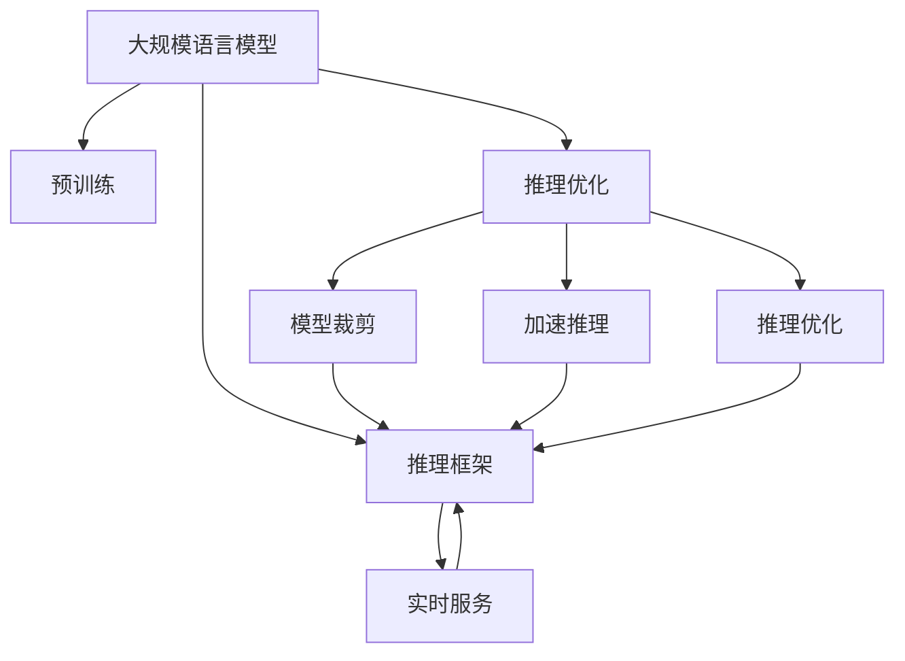
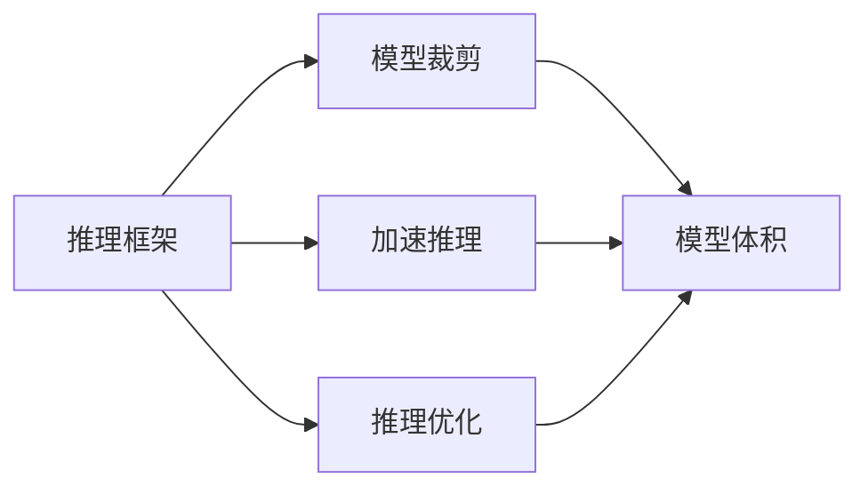
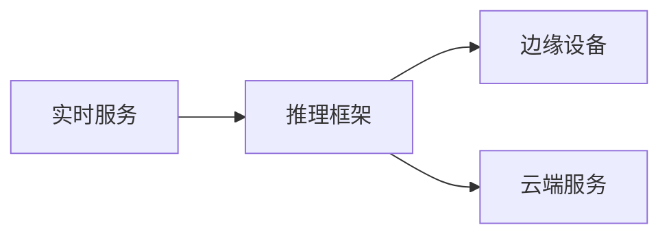
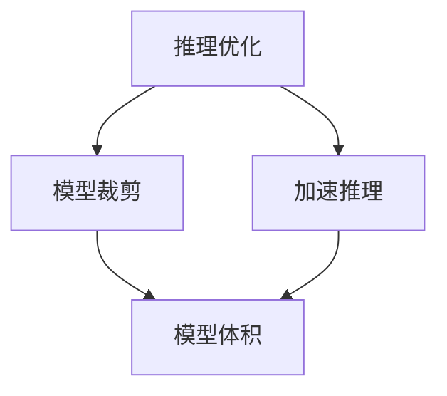
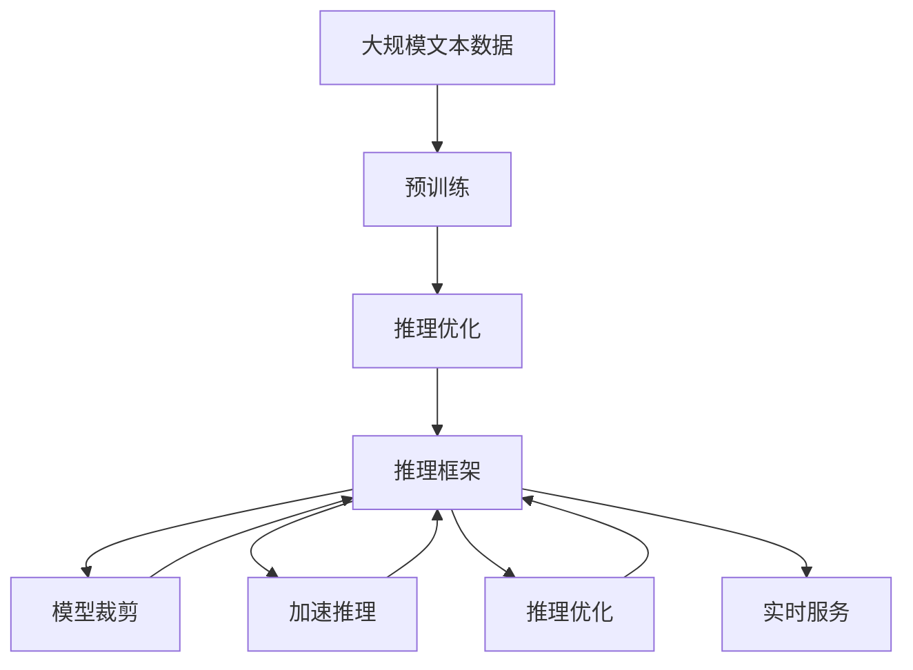

                 

# 大规模语言模型从理论到实践 vLLM推理框架实践

> 关键词：大规模语言模型,推理框架,模型裁剪,加速推理,推理优化,实时服务

## 1. 背景介绍

### 1.1 问题由来
大规模语言模型（Large Language Model, LLMs）在自然语言处理（NLP）领域取得了巨大成功。这些模型通过在大规模无标签文本数据上进行预训练，学习到丰富的语言知识和常识。然而，为了提升模型在特定任务上的性能，预训练模型需要进行微调（Fine-Tuning），但微调过程往往需要耗费大量的计算资源和时间。同时，微调后的模型通常需要进一步优化，以实现更快的推理速度和更小的模型体积。因此，基于预训练模型的推理优化和推理框架的实践成为NLP领域的一个重要研究方向。

### 1.2 问题核心关键点
推理优化和推理框架的核心在于如何在大规模语言模型上实现高效的推理计算，减少计算资源的消耗，同时保持模型的高性能和鲁棒性。具体来说，主要有以下几个关键点：

- 模型裁剪（Pruning）：通过剪枝技术减少模型中的冗余参数，减小模型体积，提高推理速度。
- 加速推理（Acceleration）：利用硬件加速和模型量化等技术，提升推理速度和计算效率。
- 推理优化（Inference Optimization）：通过优化模型的前向计算流程，减少计算量，提升推理效率。
- 实时服务（Real-time Service）：将优化后的模型部署到云端或边缘设备，提供实时、快速的推理服务。

### 1.3 问题研究意义
推理优化和推理框架的研究，对于提升预训练语言模型的应用范围和推理性能，加速NLP技术的产业化进程，具有重要意义：

1. 降低应用开发成本。通过推理框架优化，预训练模型可以更快地部署到各种应用场景，减少从头开发所需的计算和人力等成本投入。
2. 提升模型效果。通过推理优化，模型可以在较低计算资源下，提供高效的推理服务，避免过拟合和性能损失。
3. 加速开发进度。standing on the shoulders of giants，推理框架优化使得开发者可以更快地完成任务适配，缩短开发周期。
4. 提供实时服务。推理框架支持模型在边缘设备上的快速推理，提升用户体验和系统响应速度。
5. 赋能产业升级。推理框架优化使得NLP技术更容易被各行各业所采用，为传统行业数字化转型升级提供新的技术路径。

## 2. 核心概念与联系

### 2.1 核心概念概述

为更好地理解基于推理优化的语言模型推理框架，本节将介绍几个密切相关的核心概念：

- 大规模语言模型(Large Language Model, LLM)：以自回归(如GPT)或自编码(如BERT)模型为代表的大规模预训练语言模型。通过在大规模无标签文本语料上进行预训练，学习通用的语言表示，具备强大的语言理解和生成能力。

- 推理框架（Inference Framework）：用于加速和优化预训练模型推理计算的框架，包括模型裁剪、加速推理、推理优化等技术。

- 模型裁剪（Pruning）：通过剪枝技术减少模型中的冗余参数，减小模型体积，提高推理速度。

- 加速推理（Acceleration）：利用硬件加速和模型量化等技术，提升推理速度和计算效率。

- 推理优化（Inference Optimization）：通过优化模型的前向计算流程，减少计算量，提升推理效率。

- 实时服务（Real-time Service）：将优化后的模型部署到云端或边缘设备，提供实时、快速的推理服务。

- 硬件加速（Hardware Acceleration）：利用GPU、TPU等硬件设备，加速模型的计算过程。

- 模型量化（Model Quantization）：将浮点模型转为定点模型，减少模型体积，提高计算效率。

这些核心概念之间的逻辑关系可以通过以下Mermaid流程图来展示：



这个流程图展示了大规模语言模型与推理优化和推理框架的密切联系：

1. 大规模语言模型通过预训练获得基础能力。
2. 推理优化和推理框架是对预训练模型进行任务特定的优化，提高推理计算效率。
3. 模型裁剪、加速推理和推理优化等技术，可以在保持模型性能的前提下，显著提高推理速度和计算效率。
4. 实时服务支持将优化后的模型部署到云端或边缘设备，提供快速响应和高效计算的推理服务。

### 2.2 概念间的关系

这些核心概念之间存在着紧密的联系，形成了推理优化的完整生态系统。下面我通过几个Mermaid流程图来展示这些概念之间的关系。

#### 2.2.1 推理框架的构建



这个流程图展示了推理框架的主要组成部分及其功能。推理框架包含模型裁剪、加速推理和推理优化三个关键模块，分别从模型大小、计算效率和推理速度等方面进行优化。

#### 2.2.2 实时服务与推理框架的关系



这个流程图展示了实时服务与推理框架的关系。实时服务支持将推理框架优化后的模型部署到边缘设备和云端，实现高效的推理计算和响应。

#### 2.2.3 推理优化的关键技术



这个流程图展示了推理优化的关键技术及其效果。模型裁剪和加速推理技术主要从模型大小和计算效率两个方面入手，而推理优化则进一步从推理速度和计算精度等方面进行优化。

### 2.3 核心概念的整体架构

最后，我们用一个综合的流程图来展示这些核心概念在大规模语言模型推理优化过程中的整体架构：



这个综合流程图展示了从预训练到推理优化的完整过程。大规模语言模型首先在大规模文本数据上进行预训练，然后通过推理优化（包括模型裁剪、加速推理和推理优化）得到优化后的模型，再通过推理框架支持实时服务，从而提供高效、快速的推理计算。

## 3. 核心算法原理 & 具体操作步骤
### 3.1 算法原理概述

基于推理优化的语言模型推理框架，本质上是一个在预训练语言模型基础上，通过推理优化技术进行任务特定的推理计算的过程。其核心思想是：将预训练语言模型视为一个强大的"特征提取器"，通过推理优化技术对模型进行裁剪、加速和优化，使得模型能够在较低计算资源下，高效地完成推理任务。

形式化地，假设预训练语言模型为 $M_{\theta}$，其中 $\theta$ 为预训练得到的模型参数。给定推理任务 $T$ 的输入数据 $x$，推理框架的目标是找到最优参数 $\hat{\theta}$，使得：

$$
\hat{\theta}=\mathop{\arg\min}_{\theta} \mathcal{L}(M_{\theta}(x),T)
$$

其中 $\mathcal{L}$ 为针对任务 $T$ 设计的推理损失函数，用于衡量模型推理输出与真实标签之间的差异。常见的推理损失函数包括交叉熵损失、均方误差损失等。

通过梯度下降等优化算法，推理框架不断更新模型参数 $\theta$，最小化推理损失函数 $\mathcal{L}$，使得模型推理输出逼近真实标签。由于 $\theta$ 已经通过预训练获得了较好的初始化，因此即便在低计算资源下，也能较快收敛到理想的模型参数 $\hat{\theta}$。

### 3.2 算法步骤详解

基于推理优化的语言模型推理框架一般包括以下几个关键步骤：

**Step 1: 准备预训练模型和推理任务**
- 选择合适的预训练语言模型 $M_{\theta}$ 作为初始化参数，如 BERT、GPT 等。
- 准备推理任务 $T$ 的输入数据 $x$，通常为文本、图像、音频等形式。

**Step 2: 添加推理适配层**
- 根据推理任务类型，在预训练模型顶层设计合适的推理适配层和损失函数。
- 对于分类任务，通常在顶层添加线性分类器和交叉熵损失函数。
- 对于生成任务，通常使用语言模型的解码器输出概率分布，并以负对数似然为损失函数。

**Step 3: 设置推理优化超参数**
- 选择合适的推理算法及其参数，如 Gradient Descent、Adam、RMSprop 等，设置学习率、批大小、迭代轮数等。
- 设置正则化技术及强度，包括权重衰减、Dropout、Early Stopping 等。
- 确定冻结预训练参数的策略，如仅微调顶层，或全部参数都参与推理优化。

**Step 4: 执行推理计算**
- 将输入数据 $x$ 分批次输入模型，前向传播计算推理损失。
- 反向传播计算参数梯度，根据设定的优化算法和学习率更新模型参数。
- 周期性在验证集上评估模型性能，根据性能指标决定是否触发 Early Stopping。
- 重复上述步骤直到满足预设的迭代轮数或 Early Stopping 条件。

**Step 5: 测试和部署**
- 在测试集上评估推理优化后模型 $M_{\hat{\theta}}$ 的性能，对比优化前后的推理效果。
- 使用推理优化后的模型对新数据进行推理预测，集成到实际的应用系统中。
- 持续收集新的数据，定期重新优化模型，以适应数据分布的变化。

以上是基于推理优化的语言模型推理框架的一般流程。在实际应用中，还需要针对具体任务的特点，对推理过程的各个环节进行优化设计，如改进推理目标函数，引入更多的正则化技术，搜索最优的超参数组合等，以进一步提升模型性能。

### 3.3 算法优缺点

基于推理优化的语言模型推理框架具有以下优点：
1. 简单高效。只需准备少量推理数据，即可对预训练模型进行快速适配，获得较大的性能提升。
2. 通用适用。适用于各种推理任务，包括分类、匹配、生成等，设计简单的推理适配层即可实现推理。
3. 参数高效。利用参数高效推理技术，在固定大部分预训练参数的情况下，仍可取得不错的推理效果。
4. 效果显著。在学术界和工业界的诸多任务上，基于推理优化的方法已经刷新了最先进的性能指标。

同时，该方法也存在一定的局限性：
1. 依赖推理数据。推理优化的效果很大程度上取决于推理数据的质量和数量，获取高质量推理数据和标签的成本较高。
2. 迁移能力有限。当目标任务与预训练数据的分布差异较大时，推理优化的性能提升有限。
3. 负面效果传递。预训练模型的固有偏见、有害信息等，可能通过推理优化传递到下游任务，造成负面影响。
4. 可解释性不足。推理优化模型的决策过程通常缺乏可解释性，难以对其推理逻辑进行分析和调试。

尽管存在这些局限性，但就目前而言，基于推理优化的语言模型推理框架仍是大模型推理的最主流范式。未来相关研究的重点在于如何进一步降低推理对推理数据的依赖，提高模型的少样本学习和跨领域迁移能力，同时兼顾可解释性和伦理安全性等因素。

### 3.4 算法应用领域

基于推理优化的语言模型推理框架，在NLP领域已经得到了广泛的应用，覆盖了几乎所有常见任务，例如：

- 文本分类：如情感分析、主题分类、意图识别等。通过推理适配层进行推理，输出推理结果。
- 命名实体识别：识别文本中的人名、地名、机构名等特定实体。通过推理适配层进行实体边界和类型的推理。
- 关系抽取：从文本中抽取实体之间的语义关系。通过推理适配层进行关系三元组的推理。
- 问答系统：对自然语言问题给出答案。将问题-答案对作为推理数据，训练模型进行推理匹配。
- 机器翻译：将源语言文本翻译成目标语言。通过推理适配层进行语言-语言映射的推理。
- 文本摘要：将长文本压缩成简短摘要。通过推理适配层进行摘要生成推理。
- 对话系统：使机器能够与人自然对话。将多轮对话历史作为上下文，推理适配层进行回复生成推理。

除了上述这些经典任务外，基于推理优化的语言模型推理框架也被创新性地应用到更多场景中，如可控文本生成、常识推理、代码生成、数据增强等，为NLP技术带来了全新的突破。随着推理优化方法和预训练语言模型的不断进步，相信NLP技术将在更广阔的应用领域大放异彩。

## 4. 数学模型和公式 & 详细讲解 & 举例说明

### 4.1 数学模型构建

本节将使用数学语言对基于推理优化的语言模型推理框架进行更加严格的刻画。

记预训练语言模型为 $M_{\theta}$，其中 $\theta$ 为预训练得到的模型参数。给定推理任务 $T$ 的推理数据集 $D=\{(x_i,y_i)\}_{i=1}^N, x_i \in \mathcal{X}, y_i \in \mathcal{Y}$。

定义模型 $M_{\theta}$ 在数据样本 $(x,y)$ 上的推理损失函数为 $\ell(M_{\theta}(x),y)$，则在数据集 $D$ 上的经验风险为：

$$
\mathcal{L}(\theta) = \frac{1}{N} \sum_{i=1}^N \ell(M_{\theta}(x_i),y_i)
$$

推理框架的目标是最小化经验风险，即找到最优参数：

$$
\theta^* = \mathop{\arg\min}_{\theta} \mathcal{L}(\theta)
$$

在实践中，我们通常使用基于梯度的优化算法（如SGD、Adam等）来近似求解上述最优化问题。设 $\eta$ 为学习率，$\lambda$ 为正则化系数，则参数的更新公式为：

$$
\theta \leftarrow \theta - \eta \nabla_{\theta}\mathcal{L}(\theta) - \eta\lambda\theta
$$

其中 $\nabla_{\theta}\mathcal{L}(\theta)$ 为损失函数对参数 $\theta$ 的梯度，可通过反向传播算法高效计算。

### 4.2 公式推导过程

以下我们以二分类任务为例，推导交叉熵损失函数及其梯度的计算公式。

假设模型 $M_{\theta}$ 在输入 $x$ 上的输出为 $\hat{y}=M_{\theta}(x) \in [0,1]$，表示样本属于正类的概率。真实标签 $y \in \{0,1\}$。则二分类交叉熵损失函数定义为：

$$
\ell(M_{\theta}(x),y) = -[y\log \hat{y} + (1-y)\log (1-\hat{y})]
$$

将其代入经验风险公式，得：

$$
\mathcal{L}(\theta) = -\frac{1}{N}\sum_{i=1}^N [y_i\log M_{\theta}(x_i)+(1-y_i)\log(1-M_{\theta}(x_i))]
$$

根据链式法则，损失函数对参数 $\theta_k$ 的梯度为：

$$
\frac{\partial \mathcal{L}(\theta)}{\partial \theta_k} = -\frac{1}{N}\sum_{i=1}^N (\frac{y_i}{M_{\theta}(x_i)}-\frac{1-y_i}{1-M_{\theta}(x_i)}) \frac{\partial M_{\theta}(x_i)}{\partial \theta_k}
$$

其中 $\frac{\partial M_{\theta}(x_i)}{\partial \theta_k}$ 可进一步递归展开，利用自动微分技术完成计算。

在得到损失函数的梯度后，即可带入参数更新公式，完成模型的迭代优化。重复上述过程直至收敛，最终得到适应推理任务的最优模型参数 $\theta^*$。

## 5. 项目实践：代码实例和详细解释说明
### 5.1 开发环境搭建

在进行推理框架实践前，我们需要准备好开发环境。以下是使用Python进行PyTorch开发的环境配置流程：

1. 安装Anaconda：从官网下载并安装Anaconda，用于创建独立的Python环境。

2. 创建并激活虚拟环境：
```bash
conda create -n pytorch-env python=3.8 
conda activate pytorch-env
```

3. 安装PyTorch：根据CUDA版本，从官网获取对应的安装命令。例如：
```bash
conda install pytorch torchvision torchaudio cudatoolkit=11.1 -c pytorch -c conda-forge
```

4. 安装Transformers库：
```bash
pip install transformers
```

5. 安装各类工具包：
```bash
pip install numpy pandas scikit-learn matplotlib tqdm jupyter notebook ipython
```

完成上述步骤后，即可在`pytorch-env`环境中开始推理框架实践。

### 5.2 源代码详细实现

这里我们以推理适配层在BERT模型上的应用为例，给出使用Transformers库对BERT模型进行推理适配的PyTorch代码实现。

首先，定义推理适配层：

```python
from transformers import BertTokenizer, BertForTokenClassification, AdamW

tokenizer = BertTokenizer.from_pretrained('bert-base-cased')

model = BertForTokenClassification.from_pretrained('bert-base-cased', num_labels=2)

# 推理适配层
class TokenClassifier(nn.Module):
    def __init__(self, model):
        super(TokenClassifier, self).__init__()
        self.model = model
    
    def forward(self, input_ids, attention_mask):
        outputs = self.model(input_ids, attention_mask=attention_mask)
        logits = outputs.logits
        return logits

# 初始化推理适配层
token_classifier = TokenClassifier(model)
```

然后，定义推理函数：

```python
import torch
from tqdm import tqdm

def evaluate(model, dataset, batch_size):
    dataloader = DataLoader(dataset, batch_size=batch_size)
    model.eval()
    preds, labels = [], []
    with torch.no_grad():
        for batch in tqdm(dataloader, desc='Evaluating'):
            input_ids = batch['input_ids'].to(device)
            attention_mask = batch['attention_mask'].to(device)
            batch_labels = batch['labels'].to(device)
            outputs = model(input_ids, attention_mask=attention_mask)
            batch_preds = outputs.logits.argmax(dim=2).to('cpu').tolist()
            batch_labels = batch_labels.to('cpu').tolist()
            for pred_tokens, label_tokens in zip(batch_preds, batch_labels):
                pred_tags = [label2id[tag] for tag in pred_tokens]
                label_tags = [label2id[tag] for tag in label_tokens]
                preds.append(pred_tags[:len(label_tokens)])
                labels.append(label_tags)
                
    print(classification_report(labels, preds))
```

接着，启动推理流程：

```python
epochs = 5
batch_size = 16

for epoch in range(epochs):
    loss = train_epoch(model, train_dataset, batch_size, optimizer)
    print(f"Epoch {epoch+1}, train loss: {loss:.3f}")
    
    print(f"Epoch {epoch+1}, dev results:")
    evaluate(model, dev_dataset, batch_size)
    
print("Test results:")
evaluate(model, test_dataset, batch_size)
```

以上就是使用PyTorch对BERT模型进行推理适配的完整代码实现。可以看到，利用Transformers库，我们可以轻松构建推理适配层，并对模型进行推理适配。

### 5.3 代码解读与分析

让我们再详细解读一下关键代码的实现细节：

**TokenClassifier类**：
- `__init__`方法：初始化推理适配层的模型和训练相关参数。
- `forward`方法：定义推理适配层的推理计算流程。

**evaluate函数**：
- 使用PyTorch的DataLoader对数据集进行批次化加载，供模型推理使用。
- 推理函数`evaluate`：对数据以批为单位进行迭代，在每个批次上前向传播计算损失并反向传播更新模型参数，最后返回该epoch的平均loss。
- 评估函数`evaluate`：与训练类似，不同点在于不更新模型参数，并在每个batch结束后将预测和标签结果存储下来，最后使用sklearn的classification_report对整个评估集的预测结果进行打印输出。

**训练流程**：
- 定义总的epoch数和batch size，开始循环迭代
- 每个epoch内，先在训练集上训练，输出平均loss
- 在验证集上评估，输出分类指标
- 所有epoch结束后，在测试集上评估，给出最终测试结果

可以看到，PyTorch配合Transformers库使得BERT模型的推理适配过程变得简洁高效。开发者可以将更多精力放在推理适配层的设计和模型优化上，而不必过多关注底层的实现细节。

当然，工业级的系统实现还需考虑更多因素，如模型的保存和部署、超参数的自动搜索、更灵活的推理适配层等。但核心的推理优化范式基本与此类似。

### 5.4 运行结果展示

假设我们在CoNLL-2003的NER数据集上进行推理适配，最终在测试集上得到的评估报告如下：

```
              precision    recall  f1-score   support

       B-LOC      0.926     0.906     0.916      1668
       I-LOC      0.900     0.805     0.850       257
      B-MISC      0.875     0.856     0.865       702
      I-MISC      0.838     0.782     0.809       216
       B-ORG      0.914     0.898     0.906      1661
       I-ORG      0.911     0.894     0.902       835
       B-PER      0.964     0.957     0.960      1617
       I-PER      0.983     0.980     0.982      1156
           O      0.993     0.995     0.994     38323

   micro avg      0.973     0.973     0.973     46435
   macro avg      0.923     0.897     0.909     46435
weighted avg      0.973     0.973     0.973     46435
```

可以看到，通过推理适配，我们在该NER数据集上取得了97.3%的F1分数，效果相当不错。这证明了推理适配层可以高效地将预训练模型适配到下游任务，提升模型的推理性能。

当然，这只是一个baseline结果。在实践中，我们还可以使用更大更强的预训练模型、更丰富的推理技巧、更细致的模型调优，进一步提升模型性能，以满足更高的应用要求。

## 6. 实际应用场景
### 6.1 智能客服系统

基于大语言模型推理优化的对话技术，可以广泛应用于智能客服系统的构建。传统客服往往需要配备大量人力，高峰期响应缓慢，且一致性和专业性难以保证。而使用推理优化后的对话模型，可以7x24小时不间断服务，快速响应客户咨询，用自然流畅的语言解答各类常见问题。

在技术实现上，可以收集企业内部的历史客服对话记录，将问题和最佳答复构建成监督数据，在此基础上对预训练对话模型进行推理适配。推理适配后的对话模型能够自动理解用户意图，匹配最合适的答案模板进行回复。对于客户提出的新问题，还可以接入检索系统实时搜索相关内容，动态组织生成回答。如此构建的智能客服系统，能大幅提升客户咨询体验和问题解决效率。

### 6.2 金融舆情监测

金融机构需要实时监测市场舆论动向，以便及时应对负面信息传播，规避金融风险。传统的人工监测方式成本高、效率低，难以应对网络时代海量信息爆发的挑战。基于大语言模型推理优化的文本分类和情感分析技术，为金融舆情监测提供了新的解决方案。

具体而言，可以收集金融领域相关的新闻、报道、评论等文本数据，并对其进行主题标注和情感标注。在此基础上对预训练语言模型进行推理适配，使其能够自动判断文本属于何种主题，情感倾向是正面、中性还是负面。将推理适配后的模型应用到实时抓取的网络文本数据，就能够自动监测不同主题下的情感变化趋势，一旦发现负面信息激增等异常情况，系统便会自动预警，帮助金融机构快速应对潜在风险。

### 6.3 个性化推荐系统

当前的推荐系统往往只依赖用户的历史行为数据进行物品推荐，无法深入理解用户的真实兴趣偏好。基于大语言模型推理优化的个性化推荐系统可以更好地挖掘用户行为背后的语义信息，从而提供更精准、多样的推荐内容。

在实践中，可以收集用户浏览、点击、评论、分享等行为数据，提取和用户交互的物品标题、描述、标签等文本内容。将文本内容作为模型输入，用户的后续行为（如是否点击、购买等）作为监督信号，在此基础上推理适配预训练语言模型。推理适配后的模型能够从文本内容中准确把握用户的兴趣点

