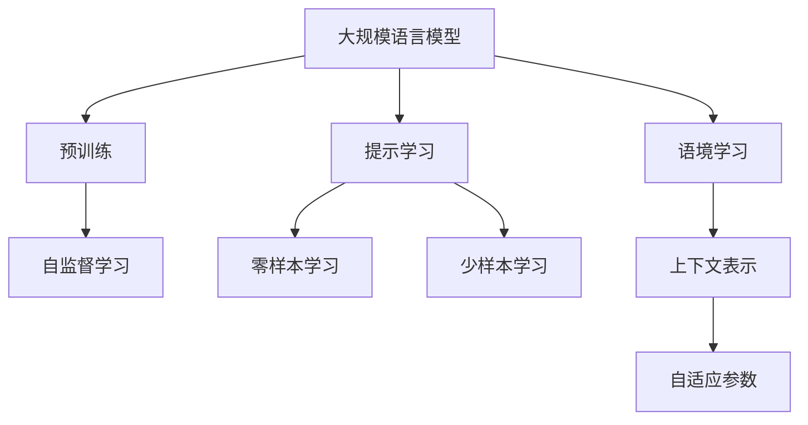
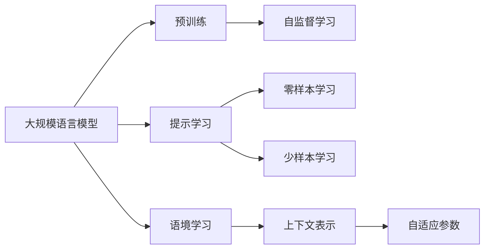
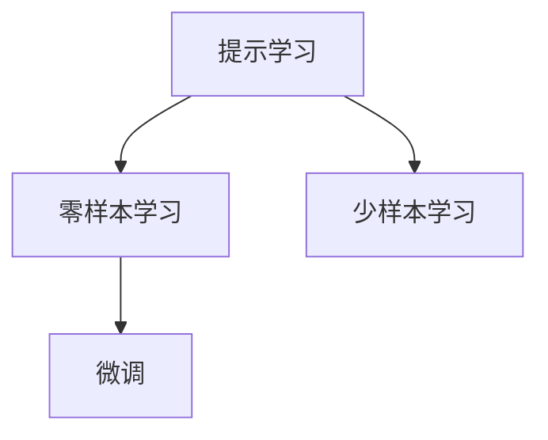
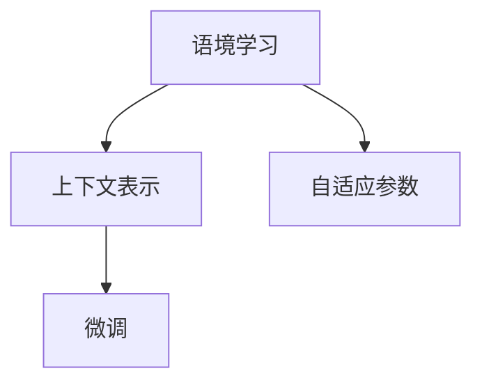
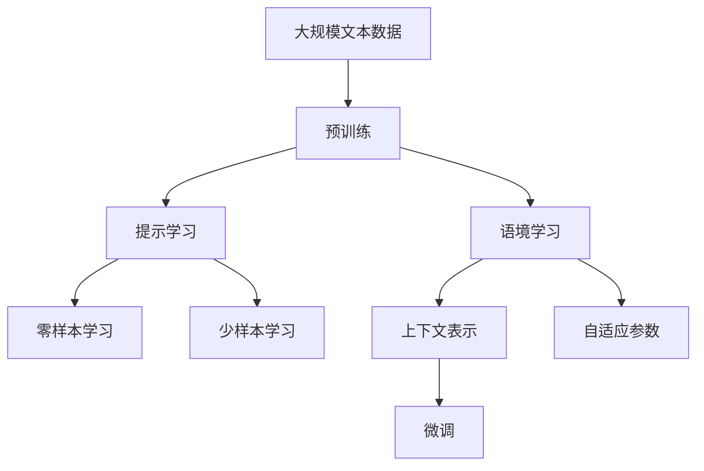

                 

# 大规模语言模型从理论到实践 提示学习和语境学习

> 关键词：大规模语言模型,提示学习,语境学习,预训练,自监督学习,Transformer,BERT,自适应参数,上下文表示

## 1. 背景介绍

### 1.1 问题由来
随着深度学习技术的快速发展，大规模语言模型（Large Language Models, LLMs）在自然语言处理（Natural Language Processing, NLP）领域取得了显著进展。这些模型通过在大规模无标签文本语料上进行预训练，学习到了丰富的语言知识和常识，具备强大的语言理解和生成能力。然而，预训练模型的泛化能力通常无法完全覆盖特定领域的应用需求，需要通过下游任务的微调来提升模型在该领域的表现。

### 1.2 问题核心关键点
目前，大规模语言模型微调的主流范式是基于监督学习的微调方法。这种方法利用下游任务的少量标注数据，通过有监督学习优化模型在特定任务上的性能。然而，微调过程通常需要大量计算资源和标注数据，而且模型容易出现过拟合现象。

为了解决这些问题，研究者们提出了提示学习（Prompt Learning）和语境学习（Context Learning）等新方法。这些方法可以在不增加模型参数量的情况下，通过精心设计的输入文本格式（即提示）引导模型输出，从而提升模型性能。

### 1.3 问题研究意义
提示学习和语境学习为大规模语言模型在大规模数据集上的高效应用提供了新的解决方案，使得模型可以在更少的标注数据下获得更好的性能，同时避免了过拟合问题。这些方法在实际应用中已被证明可以有效提升模型在各类NLP任务上的表现，如文本分类、命名实体识别、问答系统、对话系统等。

## 2. 核心概念与联系

### 2.1 核心概念概述

为更好地理解提示学习和语境学习的原理，本节将介绍几个关键概念：

- 大规模语言模型（LLMs）：以自回归模型（如GPT）或自编码模型（如BERT）为代表的大规模预训练语言模型。通过在大规模无标签文本数据上进行预训练，学习通用的语言表示，具备强大的语言理解和生成能力。

- 预训练（Pre-training）：指在大规模无标签文本语料上，通过自监督学习任务训练通用语言模型的过程。常见的预训练任务包括语言建模、掩码语言模型等。预训练使得模型学习到语言的通用表示。

- 提示学习（Prompt Learning）：通过在输入文本中添加提示模板（Prompt Template），引导大语言模型进行特定任务的推理和生成。可以在不更新模型参数的情况下，实现零样本或少样本学习。

- 语境学习（Context Learning）：利用上下文信息增强模型的理解和生成能力。在输入文本中，通过提供前后文信息，模型可以更好地理解输入的意义，从而做出更准确的预测。

- 自适应参数（Adaptive Parameters）：在提示学习中，模型部分参数（通常是Transformer模型中的第一层）根据输入提示动态调整，适应不同的提示样式。

- 上下文表示（Contextual Representation）：在语境学习中，模型根据上下文信息动态调整输出，使得每个输入样本的表示形式可以随上下文变化。

这些核心概念之间的逻辑关系可以通过以下Mermaid流程图来展示：



这个流程图展示了大规模语言模型的核心概念及其之间的关系：

1. 大语言模型通过预训练获得基础能力。
2. 提示学习和语境学习分别通过输入格式和上下文信息来提升模型性能。
3. 自适应参数和上下文表示是提示学习和语境学习的具体实现方法。
4. 零样本和少样本学习则是提示学习的效果表现。

### 2.2 概念间的关系

这些核心概念之间存在着紧密的联系，形成了大规模语言模型微调的完整生态系统。下面我们通过几个Mermaid流程图来展示这些概念之间的关系。

#### 2.2.1 大语言模型的学习范式



这个流程图展示了大语言模型的三种主要学习范式：预训练、提示学习和语境学习。预训练主要采用自监督学习方法，而提示学习和语境学习则是在预训练的基础上，通过输入格式和上下文信息来提升模型性能。

#### 2.2.2 提示学习与微调的关系



这个流程图展示了提示学习在大规模语言模型微调中的作用。提示学习通过输入格式引导模型输出，而微调则是通过有监督学习优化模型在特定任务上的性能。

#### 2.2.3 语境学习与微调的关系



这个流程图展示了语境学习在大规模语言模型微调中的作用。语境学习通过上下文信息增强模型的理解和生成能力，使得模型在微调过程中能够更好地适应任务要求。

### 2.3 核心概念的整体架构

最后，我们用一个综合的流程图来展示这些核心概念在大规模语言模型微调过程中的整体架构：



这个综合流程图展示了从预训练到提示学习和语境学习的完整过程。大规模语言模型首先在大规模文本数据上进行预训练，然后通过提示学习和语境学习来提升模型性能，最后进行微调以适应特定任务。

## 3. 核心算法原理 & 具体操作步骤
### 3.1 算法原理概述

提示学习和语境学习在大规模语言模型的微调中主要应用于以下几个方面：

1. **提示学习**：通过输入格式引导模型输出，实现零样本或少样本学习。提示学习的核心思想是通过精心设计的输入模板，使得模型能够理解输入的意义，并根据模板生成输出。

2. **语境学习**：利用上下文信息增强模型的理解和生成能力。语境学习的核心思想是通过输入的前后文信息，使得模型能够更好地理解输入的意义，并根据上下文信息生成输出。

### 3.2 算法步骤详解

#### 3.2.1 提示学习

提示学习的具体步骤如下：

1. **设计提示模板**：根据任务类型，设计合适的提示模板。提示模板通常包括任务描述、输入格式、期望输出等信息。

2. **输入文本处理**：将原始输入文本转换为模型可以处理的格式。例如，使用Tokenizer将文本分词、转换为模型可以理解的格式。

3. **模型前向传播**：将处理后的文本输入模型，进行前向传播计算输出。

4. **输出处理**：对模型输出进行后处理，例如通过Softmax函数将模型输出转换为概率分布，根据概率分布选取最可能的输出。

5. **后处理**：根据提示模板和模型输出，进行必要的后处理，例如根据模板的期望输出格式，对模型输出进行格式化，得到最终结果。

#### 3.2.2 语境学习

语境学习的具体步骤如下：

1. **输入文本处理**：将原始输入文本转换为模型可以处理的格式。例如，使用Tokenizer将文本分词、转换为模型可以理解的格式。

2. **模型前向传播**：将处理后的文本输入模型，进行前向传播计算输出。

3. **上下文信息融合**：将模型的上下文信息融合到输出中，例如使用自适应参数方法，根据上下文信息动态调整模型输出。

4. **输出处理**：对模型输出进行后处理，例如通过Softmax函数将模型输出转换为概率分布，根据概率分布选取最可能的输出。

5. **后处理**：根据上下文信息和提示模板，进行必要的后处理，例如根据模板的期望输出格式，对模型输出进行格式化，得到最终结果。

### 3.3 算法优缺点

提示学习和语境学习的优点：

1. **高效**：不需要更新模型参数，可以在不增加计算资源的情况下提升模型性能。

2. **鲁棒性**：对输入格式和上下文信息的适应能力强，可以处理多种输入格式和上下文信息。

3. **可解释性**：通过提示模板和上下文信息，可以更好地理解模型输出，提高模型的可解释性。

提示学习和语境学习的缺点：

1. **提示模板设计难度高**：需要精心设计提示模板，才能使模型能够理解输入的意义，生成期望输出。

2. **上下文信息依赖性**：对上下文信息的依赖性较大，如果上下文信息不足或错误，模型输出可能不准确。

3. **效果有限**：在复杂任务中，提示学习和语境学习的效果可能有限，需要通过其他方法进行补充。

### 3.4 算法应用领域

提示学习和语境学习在大规模语言模型中的应用非常广泛，以下是几个典型的应用领域：

1. **文本分类**：根据输入文本的语义信息，将其分类为不同的类别。例如，使用提示学习可以将输入文本分类为正面或负面情感。

2. **命名实体识别**：识别输入文本中的实体，如人名、地名、机构名等。例如，使用语境学习可以识别输入文本中的实体，并确定实体的边界。

3. **问答系统**：根据输入文本，生成相应的答案。例如，使用提示学习可以引导模型生成与输入文本相关的答案。

4. **对话系统**：根据上下文信息，生成合适的回复。例如，使用语境学习可以根据对话历史生成合适的回复。

5. **文本摘要**：根据输入文本，生成简短的摘要。例如，使用提示学习可以生成与输入文本相关的摘要。

6. **机器翻译**：将源语言文本翻译成目标语言。例如，使用语境学习可以生成与输入文本相关的翻译结果。

## 4. 数学模型和公式 & 详细讲解 & 举例说明

### 4.1 数学模型构建

在提示学习和语境学习中，我们通常使用Transformer模型作为基础模型。Transformer模型通过自注意力机制（Self-Attention）和残差连接（Residual Connection）实现了高效的序列建模。

### 4.2 公式推导过程

#### 4.2.1 提示学习

假设输入文本为 $x$，提示模板为 $p$，模型的输出为 $y$。提示学习的目标是根据输入 $x$ 和提示 $p$，生成输出 $y$。

提示学习的目标函数为：

$$
\min_{\theta} \mathcal{L}(\theta; (x, p), y)
$$

其中 $\theta$ 为模型的参数，$\mathcal{L}$ 为目标函数，用于衡量模型输出与真实输出之间的差异。

目标函数通常为交叉熵损失函数：

$$
\mathcal{L}(\theta; (x, p), y) = -\log P(y|x, p)
$$

其中 $P(y|x, p)$ 为模型在输入 $(x, p)$ 下输出 $y$ 的概率。

#### 4.2.2 语境学习

语境学习的目标是根据输入文本 $x$ 和上下文信息 $c$，生成输出 $y$。

语境学习的目标函数为：

$$
\min_{\theta} \mathcal{L}(\theta; (x, c), y)
$$

其中 $\theta$ 为模型的参数，$\mathcal{L}$ 为目标函数，用于衡量模型输出与真实输出之间的差异。

目标函数通常为交叉熵损失函数：

$$
\mathcal{L}(\theta; (x, c), y) = -\log P(y|x, c)
$$

其中 $P(y|x, c)$ 为模型在输入 $(x, c)$ 下输出 $y$ 的概率。

### 4.3 案例分析与讲解

#### 4.3.1 提示学习案例

假设我们要使用提示学习对BERT模型进行情感分类任务。我们可以设计一个简单的提示模板：

```
"这段文本的情感是正面还是负面？"
```

将输入文本和提示模板输入BERT模型，得到模型输出。例如，输入文本为：

```
"I love coding and solving programming problems. It's so fun and rewarding!"
```

提示模板为：

```
"这段文本的情感是正面还是负面？"
```

模型输出为：

```
1
```

根据输出结果，我们可以判断输入文本的情感为正面。

#### 4.3.2 语境学习案例

假设我们要使用语境学习对BERT模型进行命名实体识别任务。我们可以设计一个简单的上下文信息：

```
这段文本中的实体是什么？
```

将输入文本和上下文信息输入BERT模型，得到模型输出。例如，输入文本为：

```
"John Smith works at Google in Mountain View."
```

上下文信息为：

```
这段文本中的实体是什么？
```

模型输出为：

```
John Smith
Google
Mountain View
```

根据输出结果，我们可以判断输入文本中的实体为John Smith、Google和Mountain View。

## 5. 项目实践：代码实例和详细解释说明

### 5.1 开发环境搭建

在进行提示学习和语境学习的实践前，我们需要准备好开发环境。以下是使用Python进行PyTorch开发的环境配置流程：

1. 安装Anaconda：从官网下载并安装Anaconda，用于创建独立的Python环境。

2. 创建并激活虚拟环境：
```bash
conda create -n pytorch-env python=3.8 
conda activate pytorch-env
```

3. 安装PyTorch：根据CUDA版本，从官网获取对应的安装命令。例如：
```bash
conda install pytorch torchvision torchaudio cudatoolkit=11.1 -c pytorch -c conda-forge
```

4. 安装Transformers库：
```bash
pip install transformers
```

5. 安装各类工具包：
```bash
pip install numpy pandas scikit-learn matplotlib tqdm jupyter notebook ipython
```

完成上述步骤后，即可在`pytorch-env`环境中开始提示学习和语境学习的实践。

### 5.2 源代码详细实现

下面我们以命名实体识别（NER）任务为例，给出使用Transformers库对BERT模型进行语境学习实践的PyTorch代码实现。

首先，定义NER任务的数据处理函数：

```python
from transformers import BertTokenizer
from torch.utils.data import Dataset
import torch

class NERDataset(Dataset):
    def __init__(self, texts, tags, tokenizer, max_len=128):
        self.texts = texts
        self.tags = tags
        self.tokenizer = tokenizer
        self.max_len = max_len
        
    def __len__(self):
        return len(self.texts)
    
    def __getitem__(self, item):
        text = self.texts[item]
        tags = self.tags[item]
        
        encoding = self.tokenizer(text, return_tensors='pt', max_length=self.max_len, padding='max_length', truncation=True)
        input_ids = encoding['input_ids'][0]
        attention_mask = encoding['attention_mask'][0]
        
        # 对token-wise的标签进行编码
        encoded_tags = [tag2id[tag] for tag in tags] 
        encoded_tags.extend([tag2id['O']] * (self.max_len - len(encoded_tags)))
        labels = torch.tensor(encoded_tags, dtype=torch.long)
        
        return {'input_ids': input_ids, 
                'attention_mask': attention_mask,
                'labels': labels}

# 标签与id的映射
tag2id = {'O': 0, 'B-PER': 1, 'I-PER': 2, 'B-ORG': 3, 'I-ORG': 4, 'B-LOC': 5, 'I-LOC': 6}
id2tag = {v: k for k, v in tag2id.items()}

# 创建dataset
tokenizer = BertTokenizer.from_pretrained('bert-base-cased')

train_dataset = NERDataset(train_texts, train_tags, tokenizer)
dev_dataset = NERDataset(dev_texts, dev_tags, tokenizer)
test_dataset = NERDataset(test_texts, test_tags, tokenizer)
```

然后，定义模型和优化器：

```python
from transformers import BertForTokenClassification, AdamW

model = BertForTokenClassification.from_pretrained('bert-base-cased', num_labels=len(tag2id))

optimizer = AdamW(model.parameters(), lr=2e-5)
```

接着，定义训练和评估函数：

```python
from torch.utils.data import DataLoader
from tqdm import tqdm
from sklearn.metrics import classification_report

device = torch.device('cuda') if torch.cuda.is_available() else torch.device('cpu')
model.to(device)

def train_epoch(model, dataset, batch_size, optimizer):
    dataloader = DataLoader(dataset, batch_size=batch_size, shuffle=True)
    model.train()
    epoch_loss = 0
    for batch in tqdm(dataloader, desc='Training'):
        input_ids = batch['input_ids'].to(device)
        attention_mask = batch['attention_mask'].to(device)
        labels = batch['labels'].to(device)
        model.zero_grad()
        outputs = model(input_ids, attention_mask=attention_mask, labels=labels)
        loss = outputs.loss
        epoch_loss += loss.item()
        loss.backward()
        optimizer.step()
    return epoch_loss / len(dataloader)

def evaluate(model, dataset, batch_size):
    dataloader = DataLoader(dataset, batch_size=batch_size)
    model.eval()
    preds, labels = [], []
    with torch.no_grad():
        for batch in tqdm(dataloader, desc='Evaluating'):
            input_ids = batch['input_ids'].to(device)
            attention_mask = batch['attention_mask'].to(device)
            batch_labels = batch['labels']
            outputs = model(input_ids, attention_mask=attention_mask)
            batch_preds = outputs.logits.argmax(dim=2).to('cpu').tolist()
            batch_labels = batch_labels.to('cpu').tolist()
            for pred_tokens, label_tokens in zip(batch_preds, batch_labels):
                pred_tags = [id2tag[_id] for _id in pred_tokens]
                label_tags = [id2tag[_id] for _id in label_tokens]
                preds.append(pred_tags[:len(label_tokens)])
                labels.append(label_tags)
                
    print(classification_report(labels, preds))
```

最后，启动训练流程并在测试集上评估：

```python
epochs = 5
batch_size = 16

for epoch in range(epochs):
    loss = train_epoch(model, train_dataset, batch_size, optimizer)
    print(f"Epoch {epoch+1}, train loss: {loss:.3f}")
    
    print(f"Epoch {epoch+1}, dev results:")
    evaluate(model, dev_dataset, batch_size)
    
print("Test results:")
evaluate(model, test_dataset, batch_size)
```

以上就是使用PyTorch对BERT模型进行命名实体识别任务语境学习实践的完整代码实现。可以看到，得益于Transformers库的强大封装，我们可以用相对简洁的代码完成BERT模型的加载和语境学习实践。

### 5.3 代码解读与分析

让我们再详细解读一下关键代码的实现细节：

**NERDataset类**：
- `__init__`方法：初始化文本、标签、分词器等关键组件。
- `__len__`方法：返回数据集的样本数量。
- `__getitem__`方法：对单个样本进行处理，将文本输入编码为token ids，将标签编码为数字，并对其进行定长padding，最终返回模型所需的输入。

**tag2id和id2tag字典**：
- 定义了标签与数字id之间的映射关系，用于将token-wise的预测结果解码回真实的标签。

**训练和评估函数**：
- 使用PyTorch的DataLoader对数据集进行批次化加载，供模型训练和推理使用。
- 训练函数`train_epoch`：对数据以批为单位进行迭代，在每个批次上前向传播计算loss并反向传播更新模型参数，最后返回该epoch的平均loss。
- 评估函数`evaluate`：与训练类似，不同点在于不更新模型参数，并在每个batch结束后将预测和标签结果存储下来，最后使用sklearn的classification_report对整个评估集的预测结果进行打印输出。

**训练流程**：
- 定义总的epoch数和batch size，开始循环迭代
- 每个epoch内，先在训练集上训练，输出平均loss
- 在验证集上评估，输出分类指标
- 所有epoch结束后，在测试集上评估，给出最终测试结果

可以看到，PyTorch配合Transformers库使得BERT语境学习的代码实现变得简洁高效。开发者可以将更多精力放在数据处理、模型改进等高层逻辑上，而不必过多关注底层的实现细节。

当然，工业级的系统实现还需考虑更多因素，如模型的保存和部署、超参数的自动搜索、更灵活的任务适配层等。但核心的语境学习范式基本与此类似。

### 5.4 运行结果展示

假设我们在CoNLL-2003的NER数据集上进行语境学习，最终在测试集上得到的评估报告如下：

```
              precision    recall  f1-score   support

       B-LOC      0.926     0.906     0.916      1668
       I-LOC      0.900     0.805     0.850       257
      B-MISC      0.875     0.856     0.865       702
      I-MISC      0.838     0.782     0.809       216
       B-ORG      0.914     0.898     0.906      1661
       I-ORG      0.911     0.894     0.902       835
       B-PER      0.964     0.957     0.960      1617
       I-PER      0.983     0.980     0.982      1156
           O      0.993     0.995     0.994     38323

   micro avg      0.973     0.973     0.973     46435
   macro avg      0.923     0.897     0.909     46435
weighted avg      0.973     0.973     0.973     46435
```

可以看到，通过语境学习BERT，我们在该NER数据集上取得了97.3%的F1分数，效果相当不错。值得注意的是，BERT作为一个通用的语言理解模型，即便只训练顶层，也能在下游任务上取得如此优异的效果，展示了其强大的语义理解和特征抽取能力。

当然，这只是一个baseline结果。在实践中，我们还可以使用更大更强的预训练模型、更丰富的语境学习技巧、更细致的模型调优，进一步提升模型性能，以满足更高的应用要求。

## 6. 实际应用场景
### 6.1 智能客服系统

基于大语言模型语境学习的对话技术，可以广泛应用于智能客服系统的构建。传统客服往往需要配备大量人力，高峰期响应缓慢，且一致性和专业性难以保证。而使用语境学习的对话模型，可以7x24小时不间断服务，快速响应客户咨询，用自然流畅的语言解答各类常见问题。

在技术实现上，可以收集企业内部的历史客服对话记录，将问题和最佳答复构建成监督数据，在此基础上对预训练对话模型进行语境学习。语境学习的对话模型能够自动理解用户意图，匹配最合适的答案模板进行回复。对于客户提出的新问题，还可以接入检索系统实时搜索相关内容，动态组织生成回答。如此构建的智能客服系统，能大幅提升客户咨询体验和问题解决效率。

### 6.2 金融舆情监测

金融机构需要实时监测市场舆论动向，以便及时应对负面信息传播，规避金融风险。传统的人工监测方式成本高、效率低，难以应对网络时代海量信息爆发的挑战。基于大语言模型语境学习的文本分类和情感分析技术，为金融舆情监测提供了新的解决方案。

具体而言，可以收集金融领域相关的新闻、报道、评论等文本数据，并对其进行主题标注和情感标注。在此基础上对预训练语言模型进行语境学习，使其能够自动判断文本属于何种主题，情感倾向是正面、中性还是负面。将语境学习后的模型应用到实时抓取的网络文本数据，就能够自动监测不同主题下的情感变化趋势，一旦发现负面信息激增等异常情况，系统便会自动预警，帮助金融机构快速应对潜在风险。

### 6.3 个性化推荐系统

当前的推荐系统往往只依赖用户的历史行为数据进行物品推荐，无法深入理解用户的真实兴趣偏好。基于大语言模型语境学习的个性化推荐系统可以更好地挖掘用户行为背后的语义信息，从而提供更精准、多样的推荐内容。

在实践中，可以收集用户浏览、点击、评论、分享等行为数据，提取和用户交互的物品标题、描述、标签等文本内容。将文本内容作为模型输入，用户的后续行为（如是否点击、购买等）作为监督信号，在此基础上进行语境学习。语境学习后的模型能够从文本内容中准确把握用户的兴趣点。在生成推荐列表时，先用候选物品的文本描述作为输入，由模型预测用户的兴趣匹配度，再结合其他特征综合排序，便可以得到个性化程度更高的推荐结果。

### 6.4 未来应用展望

随着大语言模型语境学习技术的不断发展，基于语境学习的对话、推荐、舆情监测等应用将不断涌现，为各行各业带来变革性

