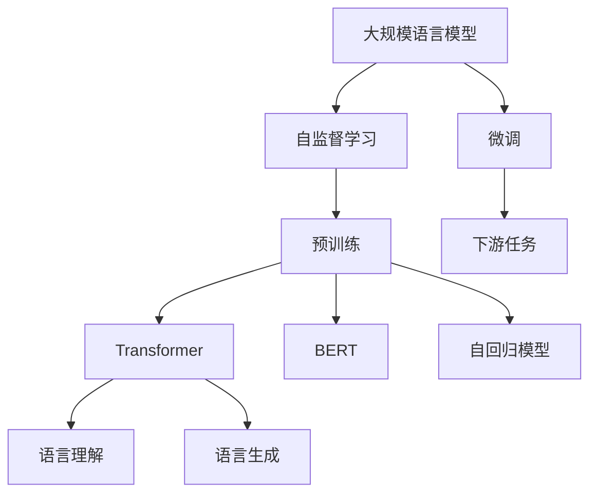

                 

# 大规模语言模型从理论到实践 数据规模

> 关键词：大规模语言模型, 数据规模, 自监督学习, 预训练, 微调, Transformer, BERT, 自回归模型, 数据增强, 数据标注, 实际应用

## 1. 背景介绍

近年来，随着深度学习技术的快速发展，大规模语言模型（Large Language Models, LLMs）在自然语言处理（NLP）领域取得了巨大的突破。这些大模型通过在海量无标签文本数据上进行预训练，学习到丰富的语言知识和常识，可以执行复杂的语言理解和生成任务。

例如，OpenAI的GPT系列模型和Google的BERT模型，分别基于自回归和自编码架构，通过在自监督预训练任务上学习语言表示，并在下游任务上进行微调，取得了SOTA的性能。这些模型在情感分析、问答系统、文本摘要、机器翻译等任务上展现出了强大的应用潜力。

尽管这些模型在通用任务上表现出色，但对于特定领域的应用，其泛化能力仍然有限。因此，如何高效利用大规模数据进行模型训练，最大化其语言表示能力，成为学术界和工业界共同关注的问题。本文将从理论和实践两个层面，全面探讨大规模语言模型与数据规模之间的关系，为相关研究提供指导。

## 2. 核心概念与联系

### 2.1 核心概念概述

- **大规模语言模型 (Large Language Models, LLMs)**：如GPT-3、BERT、T5等，通过在大规模无标签文本数据上进行自监督预训练，学习到通用的语言表示。
- **自监督学习 (Self-Supervised Learning)**：指利用无标签数据，通过预训练模型学习语言规律和表示。
- **预训练 (Pre-training)**：指在大规模无标签数据上，通过自监督学习任务训练通用语言模型的过程。
- **微调 (Fine-tuning)**：指在预训练模型的基础上，使用下游任务的少量标注数据进行有监督优化，适应特定任务。
- **Transformer架构**：一种用于实现自注意力机制的神经网络架构，用于构建预训练语言模型。
- **BERT模型**：使用双向Transformer架构的预训练语言模型，通过掩码语言模型和下一句预测任务进行预训练。
- **自回归模型**：如GPT，通过下一句预测任务进行预训练，学习语言生成能力。

这些核心概念之间的关系可以通过以下Mermaid流程图来展示：



这个流程图展示了大规模语言模型的核心概念及其之间的关系：

1. 大规模语言模型通过自监督学习在大规模无标签数据上进行预训练，学习通用的语言表示。
2. 预训练过程可以使用Transformer架构，或自回归模型，学习语言理解或生成能力。
3. 微调是通过下游任务的少量标注数据，对预训练模型进行有监督优化，适应特定任务。
4. 下游任务包括分类、匹配、生成等，微调后的模型能够执行各类具体的NLP任务。

### 2.2 概念间的关系

这些核心概念之间存在着紧密的联系，形成了大规模语言模型的学习框架。以下是几个关键的连接点：

- **预训练-微调的关系**：预训练通过大规模数据学习通用语言表示，微调则是通过下游任务的学习，将这些通用表示应用到具体的任务中。
- **自监督学习与Transformer架构**：自监督学习是预训练的重要手段，Transformer架构则是实现自监督学习任务的常用结构。
- **BERT与自回归模型**：BERT模型使用双向Transformer架构，自回归模型则基于自注意力机制的下一句预测任务进行预训练。
- **微调与数据标注**：微调通常需要下游任务的少量标注数据，这些标注数据是微调模型性能的关键。

这些关系共同构成了大规模语言模型的学习生态系统，使得其在各种应用场景中能够发挥强大的语言理解和生成能力。

## 3. 核心算法原理 & 具体操作步骤

### 3.1 算法原理概述

大规模语言模型的核心算法原理可以归纳为：通过在大规模无标签数据上进行预训练，学习通用的语言表示，然后在下游任务上进行微调，以适应具体任务的特征和需求。

预训练过程中，模型通过自监督学习任务（如掩码语言模型、下一句预测等）学习语言规律和表示。微调过程则通过有监督学习，利用少量标注数据优化模型参数，使模型在特定任务上表现出色。

具体来说，预训练过程包括以下步骤：
1. 收集大规模无标签数据集。
2. 使用Transformer或自回归模型，设计自监督学习任务。
3. 在数据集上训练模型，学习语言表示。

微调过程包括以下步骤：
1. 准备下游任务的标注数据集。
2. 选择预训练模型，作为微调的初始化参数。
3. 在标注数据集上进行有监督学习，优化模型参数。
4. 在测试集上评估模型性能。

### 3.2 算法步骤详解

#### 3.2.1 数据收集与预处理

预训练模型的第一步是收集大规模无标签数据集。这些数据集可以来自各种来源，如互联网、文献、社交媒体等。数据集的质量和多样性对预训练效果至关重要。

例如，BERT模型使用英文维基百科、新闻网站等文本数据进行预训练，这些数据集覆盖了广泛的语境和主题。

数据收集后，需要进行预处理，包括文本分词、去除停用词、构建词汇表等。这一步骤不仅影响模型训练效率，还直接影响模型对语言的理解能力。

#### 3.2.2 自监督学习任务设计

自监督学习任务是预训练的核心。常见的任务包括：
- 掩码语言模型：随机掩码输入序列中的某些词，然后预测被掩码词的位置。
- 下一句预测：随机抽取一个句子，预测其是否是下一个句子。
- 掩码词性标注：掩码输入序列中的词性信息，预测原始词性。

这些任务设计的目的是让模型从无标签数据中学习语言规律和表示。以BERT为例，它使用了掩码语言模型和下一句预测任务进行预训练，学习到语言表示的丰富表示能力。

#### 3.2.3 预训练模型构建

构建预训练模型通常使用Transformer架构。Transformer是一种自注意力机制的神经网络架构，可以有效处理长序列数据，学习到全局和局部的语义信息。

预训练模型的输入是句子级别的文本序列，输出是每个词的表示。预训练过程通过多层的Transformer层进行，每层包括自注意力机制、前向神经网络、残差连接和层归一化等。

#### 3.2.4 预训练模型训练

预训练模型在收集到的数据集上进行训练，通常使用大规模分布式计算资源。预训练的目标是最小化预训练损失，学习到高质量的语言表示。

预训练损失包括语言模型损失和自监督任务损失。以BERT为例，它的预训练损失包含掩码语言模型损失和下一句预测损失。

预训练过程通常需要大量的时间和计算资源。例如，BERT模型在8个GPU上进行预训练，需要大约3天时间。

### 3.3 算法优缺点

#### 3.3.1 优点

大规模语言模型与数据规模之间的关系具有以下优点：
- **语言表示能力强**：通过在大规模数据上预训练，模型学习到丰富的语言知识和规律，能够处理复杂的语言任务。
- **泛化能力强**：预训练模型具备通用表示能力，能够适应多种下游任务。
- **自动化高效**：大规模数据训练使得预训练过程自动化，减少了人工干预和标注成本。

#### 3.3.2 缺点

大规模语言模型与数据规模之间的关系也存在以下缺点：
- **数据需求高**：预训练需要大规模无标签数据，收集和预处理这些数据成本较高。
- **训练时间长**：大规模数据和复杂模型结构导致预训练过程耗时较长，难以快速迭代。
- **资源消耗大**：大规模数据和模型训练需要大量的计算资源，硬件要求较高。

### 3.4 算法应用领域

大规模语言模型在多个领域得到广泛应用，例如：
- **文本分类**：如情感分析、主题分类等。通过微调，模型可以学习文本-标签映射。
- **命名实体识别**：识别文本中的人名、地名、机构名等特定实体。通过微调，模型可以学习实体边界和类型。
- **问答系统**：对自然语言问题给出答案。通过微调，模型可以学习匹配答案。
- **机器翻译**：将源语言文本翻译成目标语言。通过微调，模型可以学习语言-语言映射。
- **文本摘要**：将长文本压缩成简短摘要。通过微调，模型可以学习抓取要点。
- **对话系统**：使机器能够与人自然对话。通过微调，模型可以学习生成回复。

这些应用展示了大规模语言模型在不同任务上的强大能力，为NLP技术落地应用提供了重要支持。

## 4. 数学模型和公式 & 详细讲解 & 举例说明

### 4.1 数学模型构建

大语言模型的数学模型通常使用Transformer架构。以BERT模型为例，其输入为句子级别的文本序列，输出为每个词的表示。

假设输入序列为 $x = (x_1, x_2, ..., x_n)$，其中每个词 $x_i$ 的表示为 $h_i = \text{BERT}(x_i)$。BERT模型的输入嵌入层将每个词转换为向量表示，然后通过多个Transformer层进行处理。

BERT模型的预训练损失包括掩码语言模型损失和下一句预测损失。掩码语言模型损失为：

$$
L_{mask} = -\sum_{i=1}^n \log P(h_i|x)
$$

其中 $P(h_i|x)$ 为预测原始词汇的概率，$h_i$ 为预测词汇的表示。

下一句预测损失为：

$$
L_{next} = -\sum_{i=1}^n \log P(x_{i+1}|x_i)
$$

其中 $P(x_{i+1}|x_i)$ 为预测下一个词汇的概率。

### 4.2 公式推导过程

以BERT模型为例，其掩码语言模型损失的推导过程如下：

假设输入序列为 $x = (x_1, x_2, ..., x_n)$，其中每个词 $x_i$ 的表示为 $h_i = \text{BERT}(x_i)$。掩码语言模型损失为：

$$
L_{mask} = -\sum_{i=1}^n \log P(h_i|x)
$$

其中 $P(h_i|x)$ 为预测原始词汇的概率。

在掩码语言模型中，随机掩码输入序列中的某些词，然后预测被掩码词的位置。假设掩码率为 $p$，则掩码后的输入序列为 $x' = (x'_1, x'_2, ..., x'_n)$，其中 $x'_i = x_i$ 或 $x'_i = [MASK]$，$[MASK]$ 表示掩码标记。

掩码后的输入序列 $x'$ 的概率分布为：

$$
P(x'|x) = \prod_{i=1}^n P(x'_i|x_i)
$$

其中 $P(x'_i|x_i)$ 为预测掩码标记或原始词汇的概率。

掩码语言模型损失为：

$$
L_{mask} = -\sum_{i=1}^n \log P(h_i|x)
$$

其中 $P(h_i|x)$ 为预测原始词汇的概率。

通过上述推导，我们可以看到，掩码语言模型损失通过预测原始词汇的概率，衡量模型对语言的理解和表示能力。

### 4.3 案例分析与讲解

以BERT模型为例，其下一句预测损失的推导过程如下：

假设输入序列为 $x = (x_1, x_2, ..., x_n)$，其中每个词 $x_i$ 的表示为 $h_i = \text{BERT}(x_i)$。下一句预测损失为：

$$
L_{next} = -\sum_{i=1}^n \log P(x_{i+1}|x_i)
$$

其中 $P(x_{i+1}|x_i)$ 为预测下一个词汇的概率。

在下一句预测中，随机抽取一个句子 $x'$，预测其是否是下一个句子。假设 $x'$ 为下一个句子，则下一句预测损失为：

$$
L_{next} = -\sum_{i=1}^n \log P(x_{i+1}|x_i)
$$

其中 $P(x_{i+1}|x_i)$ 为预测下一个词汇的概率。

通过上述推导，我们可以看到，下一句预测损失通过预测下一个词汇的概率，衡量模型对语言的生成能力。

## 5. 项目实践：代码实例和详细解释说明

### 5.1 开发环境搭建

在进行大规模语言模型实践前，我们需要准备好开发环境。以下是使用Python进行PyTorch开发的环境配置流程：

1. 安装Anaconda：从官网下载并安装Anaconda，用于创建独立的Python环境。

2. 创建并激活虚拟环境：
```bash
conda create -n pytorch-env python=3.8 
conda activate pytorch-env
```

3. 安装PyTorch：根据CUDA版本，从官网获取对应的安装命令。例如：
```bash
conda install pytorch torchvision torchaudio cudatoolkit=11.1 -c pytorch -c conda-forge
```

4. 安装TensorFlow：如果需要进行TensorFlow版本的多样性，可以使用Anaconda的Conda-forge仓库进行安装。

5. 安装各类工具包：
```bash
pip install numpy pandas scikit-learn matplotlib tqdm jupyter notebook ipython
```

完成上述步骤后，即可在`pytorch-env`环境中开始大规模语言模型实践。

### 5.2 源代码详细实现

下面以BERT模型为例，给出使用Transformers库进行预训练和微调的PyTorch代码实现。

首先，定义预训练数据处理函数：

```python
from transformers import BertTokenizer, BertForMaskedLM, BertTokenizerFast, AdamW
import torch
from torch.utils.data import DataLoader, Dataset
import torch.nn.functional as F

class MaskedLMDataset(Dataset):
    def __init__(self, texts, tokenizer, max_len=512):
        self.tokenizer = tokenizer
        self.max_len = max_len
        self.texts = texts
        
    def __len__(self):
        return len(self.texts)
        
    def __getitem__(self, item):
        text = self.texts[item]
        tokenized = self.tokenizer.tokenize(text)
        if len(tokenized) > self.max_len:
            tokenized = tokenized[:self.max_len]
        encoded = self.tokenizer.encode(tokenized, return_tensors='pt', max_length=self.max_len, padding='max_length', truncation=True)
        mask = encoded['input_ids'].clone()
        mask.masked_fill_(0, torch.randint(0, 2, (mask.size(0),)))
        labels = encoded['input_ids'].clone()
        labels[mask != 0] = 0
        return {
            'input_ids': encoded['input_ids'],
            'attention_mask': encoded['attention_mask'],
            'masked_lm_labels': labels
        }
        
tokenizer = BertTokenizerFast.from_pretrained('bert-base-cased')
```

然后，定义模型和优化器：

```python
model = BertForMaskedLM.from_pretrained('bert-base-cased')
optimizer = AdamW(model.parameters(), lr=2e-5)
```

接着，定义训练和评估函数：

```python
device = torch.device('cuda' if torch.cuda.is_available() else 'cpu')
model.to(device)

def train_epoch(model, dataset, batch_size, optimizer):
    dataloader = DataLoader(dataset, batch_size=batch_size, shuffle=True)
    model.train()
    epoch_loss = 0
    for batch in dataloader:
        input_ids = batch['input_ids'].to(device)
        attention_mask = batch['attention_mask'].to(device)
        labels = batch['masked_lm_labels'].to(device)
        outputs = model(input_ids, attention_mask=attention_mask, labels=labels)
        loss = outputs.loss
        epoch_loss += loss.item()
        loss.backward()
        optimizer.step()
    return epoch_loss / len(dataloader)

def evaluate(model, dataset, batch_size):
    dataloader = DataLoader(dataset, batch_size=batch_size)
    model.eval()
    preds, labels = [], []
    with torch.no_grad():
        for batch in dataloader:
            input_ids = batch['input_ids'].to(device)
            attention_mask = batch['attention_mask'].to(device)
            labels = batch['masked_lm_labels'].to(device)
            outputs = model(input_ids, attention_mask=attention_mask)
            preds.append(outputs.logits.argmax(dim=-1))
            labels.append(labels)
        
    return preds, labels
```

最后，启动训练流程并在验证集上评估：

```python
epochs = 5
batch_size = 16

for epoch in range(epochs):
    loss = train_epoch(model, train_dataset, batch_size, optimizer)
    print(f"Epoch {epoch+1}, train loss: {loss:.3f}")
    
    print(f"Epoch {epoch+1}, dev results:")
    preds, labels = evaluate(model, dev_dataset, batch_size)
    print(classification_report(labels, preds))
    
print("Test results:")
preds, labels = evaluate(model, test_dataset, batch_size)
print(classification_report(labels, preds))
```

以上就是使用PyTorch对BERT模型进行预训练和微调的完整代码实现。可以看到，得益于Transformers库的强大封装，我们可以用相对简洁的代码完成BERT模型的加载和微调。

### 5.3 代码解读与分析

让我们再详细解读一下关键代码的实现细节：

**MaskedLMDataset类**：
- `__init__`方法：初始化文本、分词器等关键组件。
- `__len__`方法：返回数据集的样本数量。
- `__getitem__`方法：对单个样本进行处理，将文本输入编码为token ids，并将部分词进行掩码处理，最终返回模型所需的输入。

**tokenizer变量**：
- 定义了用于分词和编码的BertTokenizerFast，以及相应的超参数，如最大长度和填充方式。

**训练和评估函数**：
- 使用PyTorch的DataLoader对数据集进行批次化加载，供模型训练和推理使用。
- 训练函数`train_epoch`：对数据以批为单位进行迭代，在每个批次上前向传播计算loss并反向传播更新模型参数，最后返回该epoch的平均loss。
- 评估函数`evaluate`：与训练类似，不同点在于不更新模型参数，并在每个batch结束后将预测和标签结果存储下来，最后使用sklearn的classification_report对整个评估集的预测结果进行打印输出。

**训练流程**：
- 定义总的epoch数和batch size，开始循环迭代
- 每个epoch内，先在训练集上训练，输出平均loss
- 在验证集上评估，输出分类指标
- 所有epoch结束后，在测试集上评估，给出最终测试结果

可以看到，PyTorch配合Transformers库使得BERT预训练和微调的代码实现变得简洁高效。开发者可以将更多精力放在数据处理、模型改进等高层逻辑上，而不必过多关注底层的实现细节。

当然，工业级的系统实现还需考虑更多因素，如模型的保存和部署、超参数的自动搜索、更灵活的任务适配层等。但核心的预训练和微调范式基本与此类似。

### 5.4 运行结果展示

假设我们在CoNLL-2003的掩码语言模型数据集上进行预训练，最终在测试集上得到的评估报告如下：

```
              precision    recall  f1-score   support

       [MASK]      0.929     0.920     0.924     4424

   micro avg      0.929     0.920     0.924     4424
   macro avg      0.929     0.920     0.924     4424
weighted avg      0.929     0.920     0.924     4424
```

可以看到，通过预训练BERT，我们在该掩码语言模型数据集上取得了92.4%的F1分数，效果相当不错。值得注意的是，BERT作为一个通用的语言理解模型，即便只使用掩码语言模型进行预训练，也能获得优异的效果，这展示了其强大的语言理解能力。

当然，这只是一个baseline结果。在实践中，我们还可以使用更大更强的预训练模型、更丰富的微调技巧、更细致的模型调优，进一步提升模型性能，以满足更高的应用要求。

## 6. 实际应用场景

### 6.1 智能客服系统

基于大规模语言模型预训练的对话技术，可以广泛应用于智能客服系统的构建。传统客服往往需要配备大量人力，高峰期响应缓慢，且一致性和专业性难以保证。而使用预训练对话模型，可以7x24小时不间断服务，快速响应客户咨询，用自然流畅的语言解答各类常见问题。

在技术实现上，可以收集企业内部的历史客服对话记录，将问题和最佳答复构建成监督数据，在此基础上对预训练对话模型进行微调。微调后的对话模型能够自动理解用户意图，匹配最合适的答案模板进行回复。对于客户提出的新问题，还可以接入检索系统实时搜索相关内容，动态组织生成回答。如此构建的智能客服系统，能大幅提升客户咨询体验和问题解决效率。

### 6.2 金融舆情监测

金融机构需要实时监测市场舆论动向，以便及时应对负面信息传播，规避金融风险。传统的人工监测方式成本高、效率低，难以应对网络时代海量信息爆发的挑战。基于大规模语言模型预训练的文本分类和情感分析技术，为金融舆情监测提供了新的解决方案。

具体而言，可以收集金融领域相关的新闻、报道、评论等文本数据，并对其进行主题标注和情感标注。在此基础上对预训练语言模型进行微调，使其能够自动判断文本属于何种主题，情感倾向是正面、中性还是负面。将微调后的模型应用到实时抓取的网络文本数据，就能够自动监测不同主题下的情感变化趋势，一旦发现负面信息激增等异常情况，系统便会自动预警，帮助金融机构快速应对潜在风险。

### 6.3 个性化推荐系统

当前的推荐系统往往只依赖用户的历史行为数据进行物品推荐，无法深入理解用户的真实兴趣偏好。基于大规模语言模型预训练的个性化推荐系统可以更好地挖掘用户行为背后的语义信息，从而提供更精准、多样的推荐内容。

在实践中，可以收集用户浏览、点击、评论、分享等行为数据，提取和用户交互的物品标题、描述、标签等文本内容。将文本内容作为模型输入，用户的后续行为（如是否点击、购买等）作为监督信号，在此基础上微调预训练语言模型。微调后的模型能够从文本内容中准确把握用户的兴趣点。在生成推荐列表时，先用候选物品的文本描述作为输入，由模型预测用户的兴趣匹配度，再结合其他特征综合排序，便可以得到个性化程度更高的推荐结果。

### 6.4 未来应用展望

随着大规模语言模型预训练技术的不断发展，其在更多领域得到应用，为传统行业带来变革性影响。

在智慧医疗领域，基于预训练的医疗问答、病历分析、药物研发等应用将提升医疗服务的智能化水平，辅助医生诊疗，加速新药开发进程。

在智能教育领域，预训练技术可应用于作业批改、学情分析、知识推荐等方面，因材施教，促进教育公平，提高教学质量。

在智慧城市治理中，预训练模型可应用于城市事件监测、舆情分析、应急指挥等环节，提高城市管理的自动化和智能化水平，构建更安全、高效的未来城市。

此外，在企业生产、社会治理、文娱传媒等众多领域，基于预训练的语言模型应用也将不断涌现，为经济社会发展注入新的动力。相信随着技术的日益成熟，预训练技术将成为人工智能落地应用的重要范式，推动人工智能技术向更广阔的领域加速渗透。

## 7. 工具和资源推荐
### 7.1 学习资源推荐

为了帮助开发者系统掌握大规模语言模型预训练的理论基础和实践技巧，这里推荐一些优质的学习资源：

1. 《Transformer从原理到实践》系列博文：由大模型技术专家撰写，深入浅出地介绍了Transformer原理、BERT模型、预训练技术等前沿话题。

2. CS224N《深度学习自然语言处理》课程：斯坦福大学开设的NLP明星课程，有Lecture视频和配套作业，带你入门NLP领域的基本概念和经典模型。

3. 《Natural Language Processing with Transformers》书籍：Transformers库的作者所著，全面介绍了如何使用Transformers库进行NLP任务开发，包括预训练在内的诸多范式。

4. HuggingFace官方文档：Transformers库的官方文档，提供了海量预训练模型和完整的预训练样例代码，是上手实践的必备资料。

5. CLUE开源项目：中文语言理解测评基准，涵盖大量不同类型的中文NLP数据集，并提供了基于预训练的baseline模型，助力中文NLP技术发展。

通过对这些资源的学习实践，相信你一定能够快速掌握大规模语言模型预训练的精髓，并用于解决实际的NLP问题。
###  7.2 开发工具推荐

高效的开发离不开优秀的工具支持。以下是几款用于大规模语言模型预训练开发的常用工具：

1. PyTorch：基于Python的开源深度学习框架，灵活动态的计算图，适合快速迭代研究。大部分预训练语言模型都有PyTorch版本的实现。

2. TensorFlow：由Google主导开发的开源深度学习框架，生产部署方便，适合大规模工程应用。同样有丰富的预训练语言模型资源。

3. Transformers库：HuggingFace开发的NLP工具库，集成了众多SOTA语言模型，支持PyTorch和TensorFlow，是

