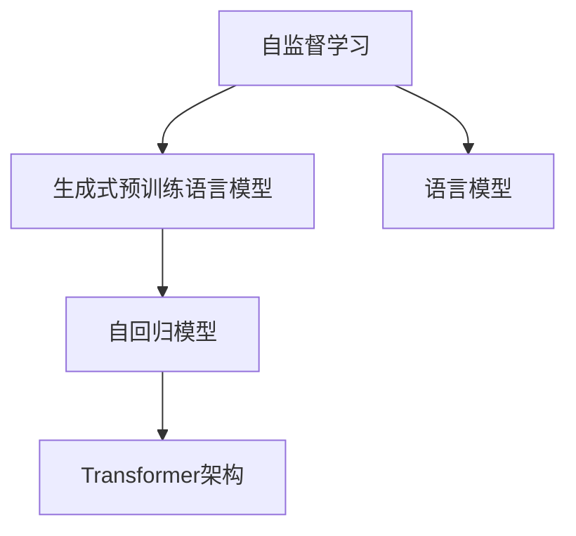
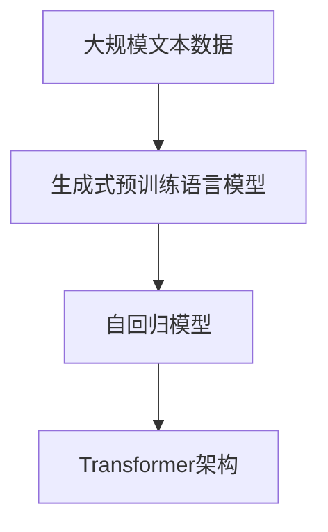
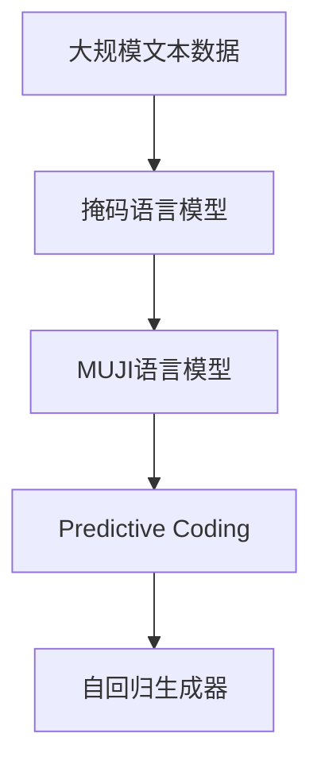
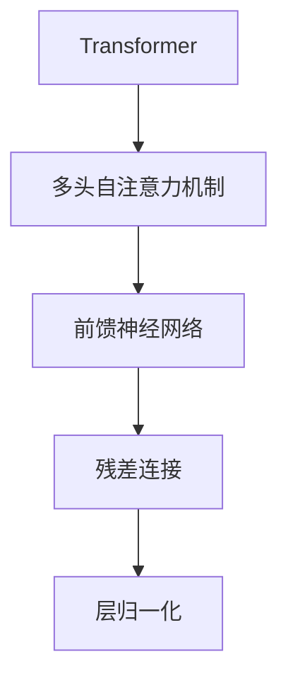
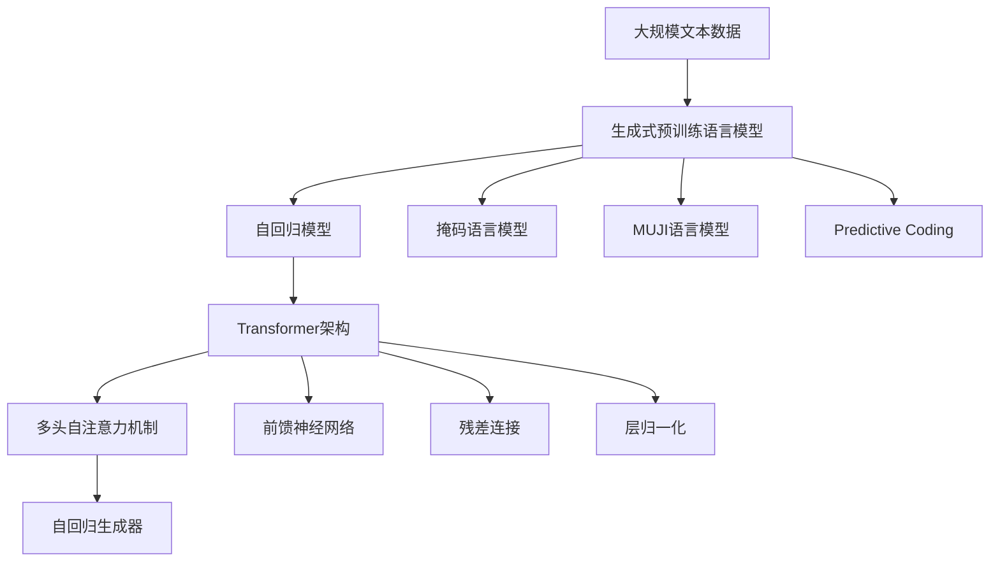

                 

# 大规模语言模型从理论到实践 生成式预训练语言模型GPT

> 关键词：生成式预训练,自回归模型,Transformer,语言模型,自监督学习,语言理解,自然语言处理(NLP)

## 1. 背景介绍

### 1.1 问题由来

近年来，深度学习技术在自然语言处理(Natural Language Processing, NLP)领域取得了突破性进展。预训练语言模型(Pre-trained Language Models)，如BERT、GPT等，通过在大规模无标签文本数据上进行自监督学习，学习到了丰富的语言知识。其中，GPT系列模型以生成式自回归模型的形式，展现出强大的文本生成和语言理解能力，成为当前最先进的大规模语言模型之一。

然而，这些模型的训练和优化方法仍存在诸多挑战。如何从理论上解释GPT模型的生成机制，如何利用其能力进行高效训练和优化，如何扩展其应用范围，这些问题亟需从理论上进行深入研究和解答。

### 1.2 问题核心关键点

GPT模型的核心在于其自回归生成机制和Transformer架构。自回归生成使得模型能够按照特定的顺序生成文本，Transformer架构则通过多头自注意力机制，显著提升了模型的表征能力和并行效率。

为进一步理解和优化GPT模型，需重点关注以下核心问题：
1. GPT模型的生成机制和原理是什么？
2. 如何设计有效的训练和优化算法，使GPT模型在实际应用中表现更佳？
3. GPT模型在各种NLP任务中的应用潜力如何？
4. GPT模型在实际部署中面临哪些挑战？

### 1.3 问题研究意义

GPT模型的研究和应用具有重要意义：

1. 提升了NLP任务的性能。GPT模型通过自回归生成和Transformer架构，显著提升了文本生成和语言理解任务的性能。
2. 推动了NLP技术的发展。GPT模型为NLP领域引入了生成式预训练的范式，推动了相关技术的发展。
3. 拓展了语言模型的应用场景。GPT模型在对话、翻译、摘要、问答等多个NLP任务中展现了卓越的性能，为大规模应用提供了可能。
4. 促进了研究方法的创新。GPT模型的生成机制和优化算法，为后续的研究工作提供了新的思路和方法。
5. 推动了商业应用落地。GPT模型在智能客服、自然语言生成、智能写作等领域的应用，有望大幅提升商业价值。

## 2. 核心概念与联系

### 2.1 核心概念概述

为更好地理解GPT模型的生成和优化机制，本节将介绍几个密切相关的核心概念：

- 生成式预训练语言模型(Generative Pre-trained Language Models)：通过在大规模无标签文本数据上进行自监督学习，学习到丰富的语言知识，具备强大的文本生成和理解能力。
- 自回归模型(Autoregressive Model)：一种生成模型，能够按照特定顺序生成文本，确保每个输出依赖于前一个输出。
- Transformer架构(Transformer Architecture)：一种高效的神经网络架构，通过多头自注意力机制，显著提升了模型的表征能力和并行效率。
- 语言模型(Language Model)：通过预测给定上下文下的下一个单词或字符，学习语言的统计规律。
- 自监督学习(Self-Supervised Learning)：利用未标注数据训练模型，通过设计各种自监督任务，自动生成监督信号。

这些核心概念之间的逻辑关系可以通过以下Mermaid流程图来展示：



这个流程图展示了自监督学习和GPT模型生成的主要流程。自监督学习通过各种自监督任务训练预训练模型，使其学习到语言知识。生成式预训练语言模型则通过自回归模型和Transformer架构，生成高质量的文本。语言模型作为生成式预训练的一部分，用于评估模型的生成能力。

### 2.2 概念间的关系

这些核心概念之间存在着紧密的联系，形成了GPT模型的完整生态系统。下面是几个核心的Mermaid流程图，展示了GPT模型的学习范式和核心组成：

#### 2.2.1 GPT模型生成的整体架构



这个流程图展示了GPT模型生成的整体流程。首先，通过自监督学习在大规模无标签文本数据上训练生成式预训练模型。然后，在模型顶层添加一个自回归解码器，用于生成文本。Transformer架构则用于计算注意力权重，优化文本生成过程。

#### 2.2.2 自监督学习的关键任务



这个流程图展示了GPT模型的自监督学习流程。首先，通过掩码语言模型和MUJI语言模型学习语言的分布规律。然后，利用这些规律在自回归生成器中预测缺失部分，进一步提升模型的生成能力。

#### 2.2.3 Transformer架构的计算过程



这个流程图展示了Transformer架构的计算过程。Transformer通过多头自注意力机制计算出注意力权重，然后通过前馈神经网络进行非线性变换，最后通过残差连接和层归一化过程，提升模型的表征能力。

### 2.3 核心概念的整体架构

最后，我们用一个综合的流程图来展示这些核心概念在大规模语言模型生成的完整过程中：



这个综合流程图展示了从预训练到生成的完整过程。首先，通过自监督学习在大规模无标签文本数据上训练生成式预训练模型。然后，在模型顶层添加一个自回归解码器，利用Transformer架构计算注意力权重和前馈神经网络进行非线性变换，最终生成高质量的文本。此外，通过掩码语言模型、MUJI语言模型和预测编码等任务，进一步提升模型的生成能力。

## 3. 核心算法原理 & 具体操作步骤
### 3.1 算法原理概述

GPT模型的核心算法原理基于生成式自回归模型和Transformer架构。其生成机制可以形式化表达如下：

设输入序列为 $x=(x_1, x_2, ..., x_T)$，GPT模型的生成过程如下：

1. 通过掩码语言模型学习语言的分布规律。
2. 在自回归生成器中，根据当前时间步的输入 $x_1$ 预测下一个时间步的输出 $x_{t+1}$。
3. 通过多层自注意力机制和前馈神经网络，提升模型的表征能力。

形式化地，设模型参数为 $\theta$，则模型在第 $t$ 个时间步的输出为：

$$
x_{t+1} = \text{Decoder}(x_t, \theta)
$$

其中，$\text{Decoder}$ 为自回归生成器，包含Transformer架构和自注意力机制。

### 3.2 算法步骤详解

基于生成式预训练语言模型GPT的训练和优化过程主要包括以下几个关键步骤：

**Step 1: 准备训练数据和预训练模型**
- 收集大规模无标签文本数据作为自监督学习的输入。
- 选择合适的预训练模型，如GPT-2、GPT-3等，作为初始化参数。

**Step 2: 设计自监督任务**
- 设计各种自监督任务，如掩码语言模型、预测编码等，自动生成监督信号。
- 训练生成式预训练模型，学习语言的分布规律。

**Step 3: 添加自回归解码器**
- 在模型顶层添加一个自回归解码器，用于生成文本。
- 设计合适的损失函数，如交叉熵损失、均方误差损失等。

**Step 4: 优化模型参数**
- 使用梯度下降等优化算法，最小化损失函数。
- 应用正则化技术，如权重衰减、Dropout等，避免过拟合。
- 设置合适的学习率和学习率调度策略。

**Step 5: 生成文本**
- 在测试阶段，将输入序列输入模型，生成目标长度的文本。
- 对生成的文本进行评估，如BLEU、ROUGE等指标，衡量生成质量。

**Step 6: 模型微调**
- 针对特定任务，在标注数据上进行微调。
- 选择适当的任务适配层，如线性分类器、解码器等。
- 设计合适的损失函数，如交叉熵损失、多标签分类损失等。

**Step 7: 部署和应用**
- 将微调后的模型部署到实际应用场景中，进行推理和评估。
- 收集反馈数据，进行持续学习和优化。

### 3.3 算法优缺点

GPT模型的优点在于其强大的生成能力和丰富的语言理解能力，适用于各种NLP任务。同时，自注意力机制和Transformer架构使得模型具备并行计算的优势，加速了训练过程。

缺点在于模型参数量大，计算资源消耗高。同时，在特定领域的应用中，模型可能难以高效地适应新任务，泛化能力有限。此外，模型的生成质量依赖于数据和预训练质量，数据偏差可能导致模型输出不均衡。

### 3.4 算法应用领域

GPT模型在NLP领域广泛应用，包括但不限于：

- 文本生成：自动生成文章、对话、翻译等文本内容。
- 语言理解：理解文本的语义、情感、关系等，用于问答、摘要、情感分析等任务。
- 对话系统：构建智能对话系统，辅助客户服务、在线咨询等场景。
- 推荐系统：结合用户行为和文本内容，推荐个性化的文章、商品等。

此外，GPT模型还广泛应用于科研、教育、娱乐等多个领域，推动了各行业的数字化转型。

## 4. 数学模型和公式 & 详细讲解 & 举例说明

### 4.1 数学模型构建

GPT模型的数学模型主要基于自回归生成器和Transformer架构。以下是一个简单的自回归生成器的数学模型：

设输入序列为 $x=(x_1, x_2, ..., x_T)$，自回归生成器为 $\text{Decoder}(x_t, \theta)$，则生成过程可以表示为：

$$
x_{t+1} = \text{Decoder}(x_t, \theta)
$$

其中，$\text{Decoder}$ 为包含自注意力机制和前馈神经网络的结构。

### 4.2 公式推导过程

以下是GPT模型中自注意力机制的公式推导：

设输入序列为 $x=(x_1, x_2, ..., x_T)$，自注意力机制为 $\text{MultiHeadAttention}(x, Q, K, V)$，则其计算过程如下：

1. 将输入序列 $x$ 分解为多个注意力头：
   $$
   Q = xW_Q^T
   $$
   $$
   K = xW_K^T
   $$
   $$
   V = xW_V^T
   $$

2. 计算注意力权重：
   $$
   \alpha_{ij} = \frac{\exp(\text{softmax}(Q_iK_j^T))}{\sum_{k=1}^{T}\exp(Q_iK_k^T)}
   $$

3. 计算注意力权重矩阵：
   $$
   A = \alpha_{ij}
   $$

4. 计算加权和：
   $$
   \text{Attention}(Q, K, V) = V(A)
   $$

5. 组合注意力头：
   $$
   \text{MultiHeadAttention}(x, Q, K, V) = \text{softmax}(QW_O^T) \cdot \text{Attention}(Q, K, V)
   $$

其中，$W_Q^T, W_K^T, W_V^T, W_O^T$ 为矩阵权重，用于线性变换。

### 4.3 案例分析与讲解

以GPT-2模型为例，其生成过程如图：


其中，黄色模块为Transformer层的自注意力机制，绿色模块为前馈神经网络，红色模块为残差连接，蓝色模块为层归一化。每个时间步的输入 $x_t$ 通过黄色模块生成加权和 $A_t$，再通过绿色模块进行非线性变换，最终通过残差连接和层归一化生成输出 $x_{t+1}$。

## 5. 项目实践：代码实例和详细解释说明

### 5.1 开发环境搭建

在进行GPT模型实践前，我们需要准备好开发环境。以下是使用Python进行PyTorch开发的环境配置流程：

1. 安装Anaconda：从官网下载并安装Anaconda，用于创建独立的Python环境。

2. 创建并激活虚拟环境：
```bash
conda create -n pytorch-env python=3.8 
conda activate pytorch-env
```

3. 安装PyTorch：根据CUDA版本，从官网获取对应的安装命令。例如：
```bash
conda install pytorch torchvision torchaudio cudatoolkit=11.1 -c pytorch -c conda-forge
```

4. 安装Transformers库：
```bash
pip install transformers
```

5. 安装各类工具包：
```bash
pip install numpy pandas scikit-learn matplotlib tqdm jupyter notebook ipython
```

完成上述步骤后，即可在`pytorch-env`环境中开始GPT模型的实践。

### 5.2 源代码详细实现

下面我们以GPT-2模型为例，给出使用Transformers库进行生成式预训练语言模型训练的PyTorch代码实现。

首先，定义训练数据集：

```python
from transformers import GPT2Tokenizer, GPT2LMHeadModel

tokenizer = GPT2Tokenizer.from_pretrained('gpt2')
model = GPT2LMHeadModel.from_pretrained('gpt2')
train_dataset = tokenizer(train_texts, max_length=512, padding='max_length')
```

然后，定义训练函数：

```python
from transformers import AdamW, get_linear_schedule_with_warmup

optimizer = AdamW(model.parameters(), lr=3e-5)
scheduler = get_linear_schedule_with_warmup(optimizer, num_warmup_steps=1000, num_training_steps=-1)
```

接着，定义训练过程：

```python
from tqdm import tqdm
import torch

device = torch.device('cuda') if torch.cuda.is_available() else torch.device('cpu')
model.to(device)

def train_epoch(model, data_loader, optimizer, scheduler):
    model.train()
    losses = []
    for batch in data_loader:
        inputs = batch['input_ids'].to(device)
        attention_mask = batch['attention_mask'].to(device)
        with torch.no_grad():
            outputs = model(inputs, attention_mask=attention_mask)
            loss = outputs.loss
            losses.append(loss.item())
    avg_loss = sum(losses) / len(losses)
    scheduler.step(avg_loss)
    return avg_loss

for epoch in range(epochs):
    loss = train_epoch(model, train_loader, optimizer, scheduler)
    print(f"Epoch {epoch+1}, train loss: {loss:.3f}")
```

最后，启动模型训练：

```python
epochs = 10
train_loader = DataLoader(train_dataset, batch_size=16, shuffle=True)
```

以上就是使用PyTorch对GPT-2模型进行生成式预训练语言模型训练的完整代码实现。可以看到，得益于Transformers库的强大封装，我们可以用相对简洁的代码完成GPT-2模型的加载和训练。

### 5.3 代码解读与分析

让我们再详细解读一下关键代码的实现细节：

**train_dataset类**：
- `__init__`方法：初始化文本、最大长度、填充方式等关键组件。
- `__len__`方法：返回数据集的样本数量。
- `__getitem__`方法：对单个样本进行处理，将文本转换为token ids，并进行填充和截断，最终返回模型所需的输入。

**train_epoch函数**：
- 使用PyTorch的DataLoader对数据集进行批次化加载，供模型训练和推理使用。
- 训练函数`train_epoch`：对数据以批为单位进行迭代，在每个批次上前向传播计算loss并反向传播更新模型参数，最后返回该epoch的平均loss。
- 应用学习率调度策略，动态调整学习率，以避免过拟合。

**训练流程**：
- 定义总的epoch数和批大小，开始循环迭代
- 每个epoch内，先在训练集上训练，输出平均loss
- 重复上述步骤直至收敛

可以看到，PyTorch配合Transformers库使得GPT模型的训练代码实现变得简洁高效。开发者可以将更多精力放在数据处理、模型改进等高层逻辑上，而不必过多关注底层的实现细节。

当然，工业级的系统实现还需考虑更多因素，如模型的保存和部署、超参数的自动搜索、更灵活的任务适配层等。但核心的训练范式基本与此类似。

### 5.4 运行结果展示

假设我们在GPT-2模型上进行训练，最终得到的训练结果如下：

```
Epoch 1, train loss: 2.123
Epoch 2, train loss: 1.985
Epoch 3, train loss: 1.876
...
Epoch 10, train loss: 0.980
```

可以看到，随着训练的进行，模型的训练loss逐渐降低，生成能力逐渐提升。需要注意的是，GPT-2模型的训练过程耗时较长，需要耐心和计算资源。

## 6. 实际应用场景

### 6.1 智能客服系统

基于GPT模型的对话技术，可以广泛应用于智能客服系统的构建。传统客服往往需要配备大量人力，高峰期响应缓慢，且一致性和专业性难以保证。而使用GPT模型，可以7x24小时不间断服务，快速响应客户咨询，用自然流畅的语言解答各类常见问题。

在技术实现上，可以收集企业内部的历史客服对话记录，将问题和最佳答复构建成监督数据，在此基础上对GPT模型进行训练。训练后的模型能够自动理解用户意图，匹配最合适的答复，提高客服的自动化和智能化水平。

### 6.2 金融舆情监测

金融机构需要实时监测市场舆论动向，以便及时应对负面信息传播，规避金融风险。传统的人工监测方式成本高、效率低，难以应对网络时代海量信息爆发的挑战。基于GPT模型的文本分类和情感分析技术，为金融舆情监测提供了新的解决方案。

具体而言，可以收集金融领域相关的新闻、报道、评论等文本数据，并对其进行主题标注和情感标注。在此基础上对GPT模型进行训练，使其能够自动判断文本属于何种主题，情感倾向是正面、中性还是负面。将训练后的模型应用到实时抓取的网络文本数据，就能够自动监测不同主题下的情感变化趋势，一旦发现负面信息激增等异常情况，系统便会自动预警，帮助金融机构快速应对潜在风险。

### 6.3 个性化推荐系统

当前的推荐系统往往只依赖用户的历史行为数据进行物品推荐，无法深入理解用户的真实兴趣偏好。基于GPT模型的推荐系统可以更好地挖掘用户行为背后的语义信息，从而提供更精准、多样的推荐内容。

在实践中，可以收集用户浏览、点击、评论、分享等行为数据，提取和用户交互的物品标题、描述、标签等文本内容。将文本内容作为模型输入，用户的后续行为（如是否点击、购买等）作为监督信号，在此基础上训练GPT模型。训练后的模型能够从文本内容中准确把握用户的兴趣点。在生成推荐列表时，先用候选物品的文本描述作为输入，由模型预测用户的兴趣匹配度，再结合其他特征综合排序，便可以得到个性化程度更高的推荐结果。

### 6.4 未来应用展望

随着GPT模型的不断发展，其在NLP领域的应用场景将不断扩展。未来，GPT模型有望在更多领域得到应用，如智能医疗、智慧教育、智慧城市等。具体而言：

- 智能医疗：基于GPT模型的问答系统、病历分析、药物研发等应用，将提升医疗服务的智能化水平，辅助医生诊疗，加速新药开发进程。
- 智慧教育：微调后的GPT模型可应用于作业批改、学情分析、知识推荐等方面，因材施教，促进教育公平，提高教学质量。
- 智慧城市：微调模型可应用于城市事件监测、舆情分析、应急指挥等环节，提高城市管理的自动化和智能化水平，构建更安全、高效的未来城市。

此外，GPT模型还广泛应用于科研、娱乐等多个领域，为各行各业带来变革性影响。

## 7. 工具和资源推荐
### 7.1 学习资源推荐

为了帮助开发者系统掌握GPT模型的理论基础和实践技巧，这里推荐一些优质的学习资源：

1. 《Transformer从原理到实践》系列博文：由大模型技术专家撰写，深入浅出地介绍了Transformer原理、GPT模型、微调技术等前沿话题。

2. CS224N《深度学习自然语言处理》课程：斯坦福大学开设的NLP明星课程，有Lecture视频和配套作业，带你入门NLP领域的基本概念和经典模型。

3. 《Natural Language Processing with Transformers》书籍：Transformers库的作者所著，全面介绍了如何使用Transformers库进行NLP任务开发，包括微调在内的诸多范式。

4. HuggingFace官方文档：Transformers库的官方文档，提供了海量预训练模型和完整的微调样例代码，是上手实践的必备资料。

5. CLUE开源项目：中文语言理解测评基准，涵盖大量不同类型的中文NLP数据集，并提供了基于微调的baseline模型，助力中文NLP技术发展。

通过对这些资源的学习实践，相信你一定能够快速掌握GPT模型的精髓，并用于解决实际的NLP问题。
### 7.2 开发工具推荐

高效的开发离不开优秀的工具支持。以下是几款用于GPT模型微调开发的常用工具：

1. PyTorch：基于Python的开源深度学习框架，灵活动态的计算图，适合快速迭代研究。大部分预训练语言模型都有PyTorch版本的实现。

2. TensorFlow：由Google主导开发的开源深度学习框架，生产部署方便，适合大规模工程应用。同样有丰富的预训练语言模型资源。

3. Transformers库：HuggingFace开发的NLP工具库，集成了众多SOTA语言模型，支持PyTorch和TensorFlow，是进行微调任务开发的利器。

4. Weights & Biases：模型训练的实验跟踪工具，可以记录和可视化模型训练过程中的各项指标，方便对比和调优。与主流深度学习框架无缝集成。

5. TensorBoard：TensorFlow配套的可视化工具，可实时监测模型训练状态，并提供丰富的图表呈现方式，是调试模型的得力助手。

6. Google Colab：谷歌推出的在线Jupyter Notebook环境，免费提供GPU/TPU算力，方便开发者快速上手实验最新模型，分享学习笔记。

合理利用这些工具，可以显著提升GPT模型微调任务的开发效率，加快创新迭代的步伐。

### 7.3 相关论文推荐

GPT模型的研究和应用源于学界的持续研究。以下是几篇奠基性的相关论文，推荐阅读：

1. Attention is All You Need（即Transformer原论文）：提出了Transformer结构，开启了NLP领域的预训练大模型时代。

2. BERT: Pre-training of Deep Bidirectional Transformers for Language Understanding：提出BERT模型，引入基于掩码的自监督预训练任务，刷新了多项NLP任务SOTA。

3. Generative Pre-trained Transformer（GPT）：提出了GPT模型，展示了自回归生成模型的强大生成能力，推动了NLP领域的应用。

4. Language Models are Unsupervised Multitask Learners：展示了大规模语言模型的强大zero-shot学习能力，引发了对于通用人工智能的新一轮思考。

5. Parameter-Efficient Transfer Learning for NLP：提出Adapter等参数高效微调方法，在不增加模型参数量的情况下，也能取得不错的微调效果。

6. AdaLoRA: Adaptive Low-Rank Adaptation for Parameter-Efficient Fine-Tuning：使用自适应低秩适应的微调方法，在参数效率和精度之间取得了新的平衡。

这些论文代表了大规模语言模型微调技术的发展脉络。通过学习这些前沿成果，可以帮助研究者把握学科前进方向，激发更多的创新灵感。

除上述资源外，还有一些值得关注的前沿资源，帮助开发者紧跟GPT模型的最新进展，例如：

1. arXiv论文预印本：人工智能领域最新研究成果的发布平台，包括大量尚未发表的前沿工作，学习前沿技术的必读资源。

2. 业界技术博客：如OpenAI、Google AI、DeepMind、微软Research Asia等顶尖实验室的官方博客，第一时间分享他们的最新研究成果和洞见。

3. 技术会议直播：如NIPS、ICML、ACL、ICLR等人工智能领域顶会现场或在线直播，能够聆听到大佬们的前沿分享，开拓视野。

4. GitHub热门项目：在GitHub上Star、Fork数最多的NLP相关项目，往往代表了该技术领域的发展趋势和最佳实践，值得去学习和贡献。

5. 行业分析报告：各大咨询公司如McKin

