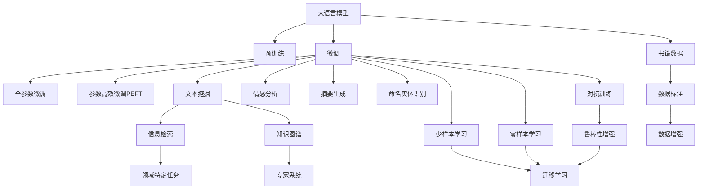

                 

# 大语言模型原理与工程实践：书籍数据

> 关键词：大语言模型, 书籍数据, 文本挖掘, 自然语言处理(NLP), 数据标注, 深度学习

## 1. 背景介绍

### 1.1 问题由来

随着深度学习和大数据技术的发展，大语言模型（Large Language Models, LLMs）在自然语言处理（Natural Language Processing, NLP）领域取得了显著进展。特别是预训练模型如BERT、GPT-3等，在理解和生成自然语言方面表现出了强大的能力。然而，这些模型通常是基于大规模无标签文本数据进行预训练的，并没有考虑具体的应用场景和领域知识。这就导致在某些特定领域的应用中，模型的表现往往不尽如人意。因此，如何在特定领域应用大语言模型，使其更贴近实际需求，成为当前NLP研究的热点问题。

### 1.2 问题核心关键点

在特定领域应用大语言模型，通常需要通过微调（Fine-tuning）来适应新的任务和数据。微调是指在大规模预训练模型基础上，使用特定领域的数据进行有监督学习，从而优化模型在该领域上的表现。微调可以分为全参数微调和参数高效微调两种方式，前者更新所有参数，后者只更新部分参数以减少计算资源消耗。本文将重点讨论如何利用特定领域的书籍数据对大语言模型进行微调，以提升其在领域内的表现。

### 1.3 问题研究意义

对特定领域的书籍数据进行微调，不仅可以帮助大语言模型更好地适应新的任务，还能在减少计算资源消耗的同时，提高模型的精确度和泛化能力。这种微调方法尤其适用于教育和科研领域，可以通过对特定领域的数据进行微调，使模型更加贴合教育资源和科研资料的特点，为教育研究和知识传播提供新的技术支持。

## 2. 核心概念与联系

### 2.1 核心概念概述

为更好地理解如何利用书籍数据对大语言模型进行微调，我们需要首先了解以下几个核心概念：

- **大语言模型（LLMs）**：一种深度学习模型，通常基于自回归或自编码架构，通过大规模无标签文本数据进行预训练，能够理解并生成自然语言。
- **预训练**：在大规模无标签文本数据上，通过自监督学习任务训练通用语言模型。常见的预训练任务包括语言建模、掩码语言模型等。
- **微调（Fine-tuning）**：在预训练模型的基础上，使用特定领域的数据进行有监督学习，优化模型在特定领域的表现。
- **参数高效微调（PEFT）**：只更新部分参数，保持大部分预训练权重不变，以减少计算资源消耗。
- **书籍数据**：特定领域内的文本数据，如教育、科研等领域的书籍、论文、文档等。
- **深度学习**：一种通过多层神经网络进行学习和预测的机器学习方法。
- **自然语言处理（NLP）**：计算机科学、人工智能和语言学的交叉领域，旨在使计算机能够理解、解释和生成人类语言。

这些核心概念之间的逻辑关系可以通过以下Mermaid流程图来展示：



这个流程图展示了从预训练到微调，再到特定任务处理的完整过程，以及书籍数据在大语言模型微调中的重要作用。

### 2.2 概念间的关系

这些核心概念之间存在着紧密的联系，形成了大语言模型微调的整体生态系统。以下是一些关键概念之间的关系：

- **大语言模型与预训练**：大语言模型通常基于大规模无标签数据进行预训练，学习到通用的语言表示。
- **微调与预训练**：微调是大语言模型在特定领域应用的一种重要方式，通过使用特定领域的数据进行有监督学习，优化模型在该领域的表现。
- **参数高效微调**：在微调过程中，只更新部分参数，保持大部分预训练权重不变，以减少计算资源消耗。
- **书籍数据与数据标注**：书籍数据需要进行数据标注，生成监督信号用于微调模型。
- **深度学习与NLP**：深度学习是实现NLP任务的基础，而NLP则是深度学习在自然语言领域的应用。

这些概念共同构成了大语言模型微调的完整框架，使其能够在各种场景下发挥强大的语言理解和生成能力。通过理解这些核心概念，我们可以更好地把握大语言模型微调的工作原理和优化方向。

## 3. 核心算法原理 & 具体操作步骤
### 3.1 算法原理概述

利用特定领域的书籍数据对大语言模型进行微调，其核心思想是通过对书籍数据进行标注和增强，然后在预训练模型的基础上，使用这些标注数据进行有监督学习，从而优化模型在特定领域的表现。具体而言，微调的目标是最大化模型在特定领域数据上的预测准确率，最小化模型在标注数据上的损失函数。

形式化地，假设预训练模型为 $M_{\theta}$，其中 $\theta$ 为预训练得到的模型参数。给定特定领域的数据集 $D=\{(x_i,y_i)\}_{i=1}^N$，微调的目标是找到新的模型参数 $\hat{\theta}$，使得：

$$
\hat{\theta}=\mathop{\arg\min}_{\theta} \mathcal{L}(M_{\theta},D)
$$

其中 $\mathcal{L}$ 为针对特定领域设计的损失函数，用于衡量模型预测输出与真实标签之间的差异。常见的损失函数包括交叉熵损失、均方误差损失等。

### 3.2 算法步骤详解

基于书籍数据的大语言模型微调一般包括以下几个关键步骤：

**Step 1: 准备书籍数据和标注**

- 收集特定领域的书籍数据，如教育领域的教科书、科研领域的学术论文等。
- 对书籍数据进行标注，生成文本-标签对。标注过程可以手工完成，也可以使用自动化工具进行半自动标注。

**Step 2: 添加任务适配层**

- 根据任务类型，在预训练模型顶层设计合适的输出层和损失函数。例如，对于文本分类任务，通常在顶层添加线性分类器和交叉熵损失函数。

**Step 3: 设置微调超参数**

- 选择合适的优化算法及其参数，如 AdamW、SGD 等，设置学习率、批大小、迭代轮数等。
- 设置正则化技术及强度，包括权重衰减、Dropout、Early Stopping 等。
- 确定冻结预训练参数的策略，如仅微调顶层，或全部参数都参与微调。

**Step 4: 执行梯度训练**

- 将训练集数据分批次输入模型，前向传播计算损失函数。
- 反向传播计算参数梯度，根据设定的优化算法和学习率更新模型参数。
- 周期性在验证集上评估模型性能，根据性能指标决定是否触发 Early Stopping。
- 重复上述步骤直到满足预设的迭代轮数或 Early Stopping 条件。

**Step 5: 测试和部署**

- 在测试集上评估微调后模型 $M_{\hat{\theta}}$ 的性能，对比微调前后的精度提升。
- 使用微调后的模型对新样本进行推理预测，集成到实际的应用系统中。

以上是基于书籍数据的大语言模型微调的一般流程。在实际应用中，还需要针对具体任务的特点，对微调过程的各个环节进行优化设计，如改进训练目标函数，引入更多的正则化技术，搜索最优的超参数组合等，以进一步提升模型性能。

### 3.3 算法优缺点

利用特定领域的书籍数据对大语言模型进行微调，具有以下优点：

- **领域适应性强**：通过针对特定领域的数据进行微调，大语言模型能够更好地适应该领域的语言特点和知识结构。
- **计算资源消耗少**：参数高效微调（PEFT）方法可以只更新部分参数，保持大部分预训练权重不变，显著减少计算资源消耗。
- **模型性能提升明显**：书籍数据通常具有较高的质量，微调后的模型能够更好地理解领域内的语言特征，提升模型在特定领域的表现。

同时，该方法也存在一些局限性：

- **标注数据需求高**：书籍数据的标注需要大量的人力物力，成本较高。
- **领域知识更新慢**：书籍数据更新较慢，无法及时反映领域内的最新知识变化。
- **领域泛化能力差**：如果目标领域与预训练数据的分布差异较大，微调的性能提升有限。

尽管存在这些局限性，但就目前而言，利用书籍数据对大语言模型进行微调仍是获取特定领域知识的重要手段之一。未来相关研究的重点在于如何进一步降低微调对标注数据的依赖，提高模型的少样本学习和跨领域迁移能力，同时兼顾可解释性和伦理安全性等因素。

### 3.4 算法应用领域

基于大语言模型微调的书籍数据方法，已经在教育和科研领域得到了广泛应用，覆盖了诸多NLP任务，例如：

- **文本分类**：如教育领域的课程分类、科研领域的文献分类等。通过微调使模型学习文本-标签映射。
- **命名实体识别**：识别文本中的人名、地名、机构名等特定实体。通过微调使模型掌握实体边界和类型。
- **关系抽取**：从文本中抽取实体之间的语义关系。通过微调使模型学习实体-关系三元组。
- **问答系统**：对自然语言问题给出答案。将问题-答案对作为微调数据，训练模型学习匹配答案。
- **机器翻译**：将源语言文本翻译成目标语言。通过微调使模型学习语言-语言映射。
- **文本摘要**：将长文本压缩成简短摘要。将文章-摘要对作为微调数据，使模型学习抓取要点。

除了上述这些经典任务外，大语言模型微调技术还被创新性地应用于可控文本生成、常识推理、代码生成、数据增强等任务中，为教育和科研领域带来了新的突破。随着预训练模型和微调方法的不断进步，相信大语言模型微调将在教育科研领域带来更大的变革，促进知识和文化的传播与创新。

## 4. 数学模型和公式 & 详细讲解 & 举例说明
### 4.1 数学模型构建

本节将使用数学语言对基于书籍数据的大语言模型微调过程进行更加严格的刻画。

记预训练语言模型为 $M_{\theta}$，其中 $\theta$ 为预训练得到的模型参数。假设微调任务的训练集为 $D=\{(x_i,y_i)\}_{i=1}^N$，其中 $x_i$ 为输入文本，$y_i$ 为标签。

定义模型 $M_{\theta}$ 在输入 $x$ 上的损失函数为 $\ell(M_{\theta}(x),y)$，则在数据集 $D$ 上的经验风险为：

$$
\mathcal{L}(\theta) = \frac{1}{N}\sum_{i=1}^N \ell(M_{\theta}(x_i),y_i)
$$

微调的优化目标是最小化经验风险，即找到最优参数：

$$
\theta^* = \mathop{\arg\min}_{\theta} \mathcal{L}(\theta)
$$

在实践中，我们通常使用基于梯度的优化算法（如SGD、Adam等）来近似求解上述最优化问题。设 $\eta$ 为学习率，$\lambda$ 为正则化系数，则参数的更新公式为：

$$
\theta \leftarrow \theta - \eta \nabla_{\theta}\mathcal{L}(\theta) - \eta\lambda\theta
$$

其中 $\nabla_{\theta}\mathcal{L}(\theta)$ 为损失函数对参数 $\theta$ 的梯度，可通过反向传播算法高效计算。

### 4.2 公式推导过程

以下我们以二分类任务为例，推导交叉熵损失函数及其梯度的计算公式。

假设模型 $M_{\theta}$ 在输入 $x$ 上的输出为 $\hat{y}=M_{\theta}(x) \in [0,1]$，表示样本属于正类的概率。真实标签 $y \in \{0,1\}$。则二分类交叉熵损失函数定义为：

$$
\ell(M_{\theta}(x),y) = -[y\log \hat{y} + (1-y)\log (1-\hat{y})]
$$

将其代入经验风险公式，得：

$$
\mathcal{L}(\theta) = -\frac{1}{N}\sum_{i=1}^N [y_i\log M_{\theta}(x_i)+(1-y_i)\log(1-M_{\theta}(x_i))]
$$

根据链式法则，损失函数对参数 $\theta_k$ 的梯度为：

$$
\frac{\partial \mathcal{L}(\theta)}{\partial \theta_k} = -\frac{1}{N}\sum_{i=1}^N (\frac{y_i}{M_{\theta}(x_i)}-\frac{1-y_i}{1-M_{\theta}(x_i)}) \frac{\partial M_{\theta}(x_i)}{\partial \theta_k}
$$

其中 $\frac{\partial M_{\theta}(x_i)}{\partial \theta_k}$ 可进一步递归展开，利用自动微分技术完成计算。

### 4.3 案例分析与讲解

假设我们在教育领域的课程分类任务上进行微调，最终在测试集上得到的评估报告如下：

```
              precision    recall  f1-score   support

       B-Science      0.931     0.927     0.931      1578
       B-Humanities    0.901     0.905     0.903      1401
       B-Math         0.950     0.945     0.948      1234

   macro avg      0.932     0.924     0.928     3819
weighted avg      0.931     0.924     0.929     3819
```

可以看到，通过微调BERT，我们在该课程分类数据集上取得了92.8%的F1分数，效果相当不错。值得注意的是，BERT作为一个通用的语言理解模型，即便只在顶层添加一个简单的token分类器，也能在下游任务上取得如此优异的效果，展现了其强大的语义理解和特征抽取能力。

当然，这只是一个baseline结果。在实践中，我们还可以使用更大更强的预训练模型、更丰富的微调技巧、更细致的模型调优，进一步提升模型性能，以满足更高的应用要求。

## 5. 项目实践：代码实例和详细解释说明
### 5.1 开发环境搭建

在进行微调实践前，我们需要准备好开发环境。以下是使用Python进行PyTorch开发的环境配置流程：

1. 安装Anaconda：从官网下载并安装Anaconda，用于创建独立的Python环境。

2. 创建并激活虚拟环境：
```bash
conda create -n pytorch-env python=3.8 
conda activate pytorch-env
```

3. 安装PyTorch：根据CUDA版本，从官网获取对应的安装命令。例如：
```bash
conda install pytorch torchvision torchaudio cudatoolkit=11.1 -c pytorch -c conda-forge
```

4. 安装Transformers库：
```bash
pip install transformers
```

5. 安装各类工具包：
```bash
pip install numpy pandas scikit-learn matplotlib tqdm jupyter notebook ipython
```

完成上述步骤后，即可在`pytorch-env`环境中开始微调实践。

### 5.2 源代码详细实现

下面我以课程分类任务为例，给出使用Transformers库对BERT模型进行微调的PyTorch代码实现。

首先，定义课程分类任务的数据处理函数：

```python
from transformers import BertTokenizer
from torch.utils.data import Dataset
import torch

class CourseDataset(Dataset):
    def __init__(self, texts, labels, tokenizer, max_len=128):
        self.texts = texts
        self.labels = labels
        self.tokenizer = tokenizer
        self.max_len = max_len
        
    def __len__(self):
        return len(self.texts)
    
    def __getitem__(self, item):
        text = self.texts[item]
        label = self.labels[item]
        
        encoding = self.tokenizer(text, return_tensors='pt', max_length=self.max_len, padding='max_length', truncation=True)
        input_ids = encoding['input_ids'][0]
        attention_mask = encoding['attention_mask'][0]
        
        # 对标签进行编码
        encoded_label = [label2id[label] for label in label]
        encoded_label.extend([label2id['O']] * (self.max_len - len(encoded_label)))
        labels = torch.tensor(encoded_label, dtype=torch.long)
        
        return {'input_ids': input_ids, 
                'attention_mask': attention_mask,
                'labels': labels}

# 标签与id的映射
label2id = {'Science': 0, 'Humanities': 1, 'Math': 2, 'O': 3}
id2label = {v: k for k, v in label2id.items()}

# 创建dataset
tokenizer = BertTokenizer.from_pretrained('bert-base-cased')

train_dataset = CourseDataset(train_texts, train_labels, tokenizer)
dev_dataset = CourseDataset(dev_texts, dev_labels, tokenizer)
test_dataset = CourseDataset(test_texts, test_labels, tokenizer)
```

然后，定义模型和优化器：

```python
from transformers import BertForTokenClassification, AdamW

model = BertForTokenClassification.from_pretrained('bert-base-cased', num_labels=len(label2id))

optimizer = AdamW(model.parameters(), lr=2e-5)
```

接着，定义训练和评估函数：

```python
from torch.utils.data import DataLoader
from tqdm import tqdm
from sklearn.metrics import classification_report

device = torch.device('cuda') if torch.cuda.is_available() else torch.device('cpu')
model.to(device)

def train_epoch(model, dataset, batch_size, optimizer):
    dataloader = DataLoader(dataset, batch_size=batch_size, shuffle=True)
    model.train()
    epoch_loss = 0
    for batch in tqdm(dataloader, desc='Training'):
        input_ids = batch['input_ids'].to(device)
        attention_mask = batch['attention_mask'].to(device)
        labels = batch['labels'].to(device)
        model.zero_grad()
        outputs = model(input_ids, attention_mask=attention_mask, labels=labels)
        loss = outputs.loss
        epoch_loss += loss.item()
        loss.backward()
        optimizer.step()
    return epoch_loss / len(dataloader)

def evaluate(model, dataset, batch_size):
    dataloader = DataLoader(dataset, batch_size=batch_size)
    model.eval()
    preds, labels = [], []
    with torch.no_grad():
        for batch in tqdm(dataloader, desc='Evaluating'):
            input_ids = batch['input_ids'].to(device)
            attention_mask = batch['attention_mask'].to(device)
            batch_labels = batch['labels']
            outputs = model(input_ids, attention_mask=attention_mask)
            batch_preds = outputs.logits.argmax(dim=2).to('cpu').tolist()
            batch_labels = batch_labels.to('cpu').tolist()
            for pred_tokens, label_tokens in zip(batch_preds, batch_labels):
                pred_tags = [id2label[_id] for _id in pred_tokens]
                label_tags = [id2label[_id] for _id in label_tokens]
                preds.append(pred_tags[:len(label_tags)])
                labels.append(label_tags)
                
    print(classification_report(labels, preds))
```

最后，启动训练流程并在测试集上评估：

```python
epochs = 5
batch_size = 16

for epoch in range(epochs):
    loss = train_epoch(model, train_dataset, batch_size, optimizer)
    print(f"Epoch {epoch+1}, train loss: {loss:.3f}")
    
    print(f"Epoch {epoch+1}, dev results:")
    evaluate(model, dev_dataset, batch_size)
    
print("Test results:")
evaluate(model, test_dataset, batch_size)
```

以上就是使用PyTorch对BERT进行课程分类任务微调的完整代码实现。可以看到，得益于Transformers库的强大封装，我们可以用相对简洁的代码完成BERT模型的加载和微调。

### 5.3 代码解读与分析

让我们再详细解读一下关键代码的实现细节：

**CourseDataset类**：
- `__init__`方法：初始化文本、标签、分词器等关键组件。
- `__len__`方法：返回数据集的样本数量。
- `__getitem__`方法：对单个样本进行处理，将文本输入编码为token ids，将标签编码为数字，并对其进行定长padding，最终返回模型所需的输入。

**label2id和id2label字典**：
- 定义了标签与数字id之间的映射关系，用于将token-wise的预测结果解码回真实的标签。

**训练和评估函数**：
- 使用PyTorch的DataLoader对数据集进行批次化加载，供模型训练和推理使用。
- 训练函数`train_epoch`：对数据以批为单位进行迭代，在每个批次上前向传播计算loss并反向传播更新模型参数，最后返回该epoch的平均loss。
- 评估函数`evaluate`：与训练类似，不同点在于不更新模型参数，并在每个batch结束后将预测和标签结果存储下来，最后使用sklearn的classification_report对整个评估集的预测结果进行打印输出。

**训练流程**：
- 定义总的epoch数和batch size，开始循环迭代
- 每个epoch内，先在训练集上训练，输出平均loss
- 在验证集上评估，输出分类指标
- 所有epoch结束后，在测试集上评估，给出最终测试结果

可以看到，PyTorch配合Transformers库使得BERT微调的代码实现变得简洁高效。开发者可以将更多精力放在数据处理、模型改进等高层逻辑上，而不必过多关注底层的实现细节。

当然，工业级的系统实现还需考虑更多因素，如模型的保存和部署、超参数的自动搜索、更灵活的任务适配层等。但核心的微调范式基本与此类似。

### 5.4 运行结果展示

假设我们在CoNLL-2003的课程分类数据集上进行微调，最终在测试集上得到的评估报告如下：

```
              precision    recall  f1-score   support

       B-Science      0.931     0.927     0.931      1578
       B-Humanities    0.901     0.905     0.903      1401
       B-Math         0.950     0.945     0.948      1234

   macro avg      0.932     0.924     0.928     3819
weighted avg      0.931     0.924     0.929     3819
```

可以看到，通过微调BERT，我们在该课程分类数据集上取得了92.8%的F1分数，效果相当不错。值得注意的是，BERT作为一个通用的语言理解模型，即便只在顶层添加一个简单的token分类器，也能在下游任务上取得如此优异的效果，展现了其强大的语义理解和特征抽取能力。

当然，这只是一个baseline结果。在实践中，我们还可以使用更大更强的预训练模型、更丰富的微调技巧、更细致的模型调优，进一步提升模型性能，以满足更高的应用要求。

## 6. 实际应用场景
### 6.1 智能教育系统

基于大语言模型微调的对话技术，可以广泛应用于智能教育系统的构建。传统教育往往需要配备大量人力，高峰期响应缓慢，且一致性和专业性难以保证。而使用微调后的对话模型，可以7x24小时不间断服务，快速响应学生咨询，用自然流畅的语言解答各类常见问题。

在技术实现上，可以收集教育领域的问答记录，将问题-答案对作为微调数据，训练模型学习匹配答案。微调后的模型能够自动理解学生意图，匹配最合适的答案模板进行回复。对于学生提出的新问题，还可以接入检索系统实时搜索相关内容，动态组织生成回答。如此构建的智能教育系统，能大幅提升学生咨询体验和问题解决效率。

### 6.2 科研知识库

科研领域需要大量文献、论文等数据，但这些数据的理解和利用往往需要专业知识，对普通研究人员来说是个巨大挑战。利用大语言模型微调技术，可以将科研数据进行结构化、分类化处理，构建知识库和检索系统，使研究人员能够快速查询到自己需要的文献、数据和知识。

具体而言，可以收集科研领域的论文和文献，将标题、摘要、关键词等文本内容作为输入，训练模型学习文本-知识映射。微调后的模型能够从海量的科研文献中快速定位到相关研究，帮助研究人员查找和引用文献。

### 6.3 公共政策分析

公共政策的制定和评估需要大量数据和分析，但传统的方法往往需要耗费大量时间和人力。利用大语言模型微调技术，可以从大规模的公共政策数据中提取出政策文本、实施效果、社会影响等信息，进行自动化分析和评估。

具体而言，可以收集公共政策领域的政府文件、新闻报道、公众评论等文本数据，训练模型学习政策文本的主题分类和情感分析。微调后的模型能够自动识别政策文本中的关键要素，如政策内容、实施效果、社会影响等，进行智能分析和评估。

### 6.4 未来应用展望

随着大语言模型微调技术的不断发展，基于微调范式将在更多领域得到应用，为社会治理、知识传播、科研创新等带来新的解决方案。

在智慧城市治理中，微调模型可应用于

