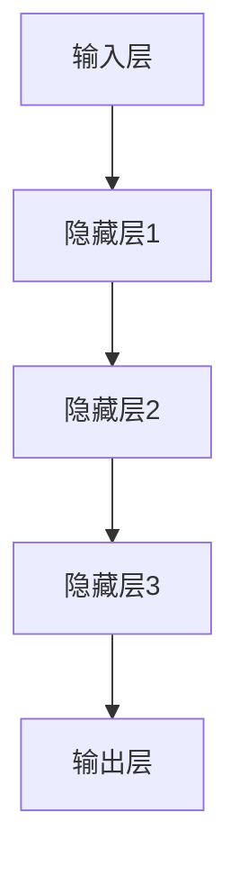

                 

# 大语言模型原理与工程实践：前馈神经网络

## 1. 背景介绍

### 1.1 问题由来

前馈神经网络(Feedforward Neural Network, FNN)是大规模语言模型中最常见和基础的结构。自20世纪80年代以来，基于前馈神经网络的语言模型已经被广泛应用在自然语言处理（Natural Language Processing, NLP）中，成为深度学习的重要组成部分。如今，在大规模无标签文本数据上进行预训练的Transformer模型，其核心结构依然以多层的自注意力机制为基础，可以认为是前馈神经网络的一种。因此，深入理解前馈神经网络的工作原理，对于学习和实践大规模语言模型至关重要。

### 1.2 问题核心关键点

前馈神经网络的基本原理与传统的多层感知器（Multi-Layer Perceptron, MLP）相似。其核心在于通过多层的线性变换和非线性激活，将输入数据映射到输出空间。前馈神经网络的关键步骤包括：输入层、多个隐藏层、输出层，以及各层之间的线性变换和非线性激活函数。在NLP中，前馈神经网络通常采用词向量或字符向量作为输入，经过多层的变换后输出最终的语言特征表示，再用于下游任务。

前馈神经网络在大规模语言模型中的应用主要体现在以下几个方面：
1. 词向量表示：通过多层网络对输入词向量进行变换，生成更具语义意义的输出向量。
2. 语言理解与生成：利用非线性激活函数进行语义提取与生成。
3. 特征表示学习：通过学习输入与输出之间的复杂映射关系，提升模型的特征提取能力。

### 1.3 问题研究意义

前馈神经网络作为深度学习的重要组成部分，其工作原理对于理解大规模语言模型至关重要。通过对前馈神经网络的学习，我们不仅能够掌握其核心思想，还能进一步应用和扩展至更多复杂且高效的前馈神经网络结构，如卷积神经网络（CNN）、循环神经网络（RNN）、Transformer等。这有助于深入理解深度学习技术在自然语言处理中的应用，加速模型的开发和优化，提升模型的性能和效果。

## 2. 核心概念与联系

### 2.1 核心概念概述

前馈神经网络主要包含以下几个关键概念：
- 输入层：网络的第一层，接收输入数据，通常采用词向量或字符向量。
- 隐藏层：网络的中间层，通过多层线性变换和非线性激活函数对输入进行多次抽象和表示。
- 输出层：网络的最后一层，将隐藏层的特征表示映射到最终输出，如预测下一个词或分类任务。
- 线性变换：通过权重矩阵和偏置项，将输入特征映射到输出特征。
- 非线性激活函数：对线性变换后的结果进行非线性映射，增加网络的表达能力。

这些概念构成了前馈神经网络的基本框架，是其进行语义提取和生成、特征表示学习的基础。

### 2.2 概念间的关系

前馈神经网络的核心结构如图2所示：


这个图展示了前馈神经网络的基本结构：输入层通过线性变换映射到隐藏层，隐藏层通过多次线性变换和非线性激活函数进行特征提取，最后通过输出层映射到最终的输出。输入层与隐藏层、隐藏层与输出层之间的线性变换，构成了网络的预测能力。非线性激活函数则为网络增加了更强的表达能力。

### 2.3 核心概念的整体架构

前馈神经网络的整体架构如图3所示：



这个图展示了多层前馈神经网络的结构：输入层经过多次隐藏层的线性变换和非线性激活，最终输出到输出层。每一层都通过线性变换对前一层的输出进行映射，增加了网络的抽象能力。非线性激活函数（如ReLU、Sigmoid等）则增加了网络的表达能力，使网络能够学习更加复杂和抽象的特征。

## 3. 核心算法原理 & 具体操作步骤

### 3.1 算法原理概述

前馈神经网络的算法原理可以分为以下三个步骤：

1. 输入层到隐藏层：通过线性变换将输入特征映射到隐藏层的特征表示。
2. 隐藏层到输出层：通过多层的线性变换和非线性激活函数，对隐藏层的特征表示进行多次抽象和表示，最终输出最终的预测结果。
3. 损失函数和反向传播：通过定义损失函数和反向传播算法，最小化模型的预测误差，更新模型的权重和偏置项，提升模型的性能。

### 3.2 算法步骤详解

**Step 1: 初始化网络参数**

在开始训练前，需要随机初始化前馈神经网络的所有权重和偏置项。通常使用小范围的随机值（如均值为0、标准差为0.01的正态分布），确保网络能够更好地适应初始数据分布。

**Step 2: 前向传播**

前向传播算法将输入数据逐层传递，进行线性变换和非线性激活，计算输出结果。具体步骤如下：

1. 输入层：将输入数据$x$传入网络，通过权重矩阵$W_0$和偏置项$b_0$进行线性变换，得到隐藏层的特征表示$h_0$。
2. 隐藏层：将隐藏层的特征表示$h_0$传入网络，通过权重矩阵$W_1$和偏置项$b_1$进行线性变换，并使用非线性激活函数$f_1$进行激活，得到新的特征表示$h_1$。重复这个过程，直至得到输出层的结果。
3. 输出层：将隐藏层的最终特征表示$h_L$传入网络，通过权重矩阵$W_{out}$和偏置项$b_{out}$进行线性变换，得到最终的预测结果$y$。

**Step 3: 反向传播**

反向传播算法通过计算预测误差，更新网络参数。具体步骤如下：

1. 计算损失函数：将预测结果$y$与真实标签$y^{*}$进行比较，计算损失函数$\mathcal{L}$。
2. 反向传播误差：通过反向传播算法，计算每一层的误差和梯度，更新网络的权重和偏置项。

**Step 4: 训练循环**

重复执行前向传播和反向传播，进行多轮训练。每次训练后，根据损失函数的变化，调整学习率和学习策略，逐步优化网络参数。

### 3.3 算法优缺点

前馈神经网络的主要优点包括：
- 结构简单：易于实现和理解，适合入门和快速迭代。
- 表达能力强：通过多层的非线性激活函数，网络能够学习复杂且抽象的特征表示。
- 可扩展性强：网络结构可变，能够扩展为多层的深度网络或更复杂的结构。

其缺点包括：
- 过拟合风险：网络参数较多，容易过拟合训练数据。
- 局部最优：网络结构简单，可能陷入局部最优解。
- 训练时间长：网络结构复杂，训练过程较慢。

### 3.4 算法应用领域

前馈神经网络在自然语言处理领域有着广泛的应用，主要包括以下几个方面：
1. 词向量表示：通过前馈神经网络生成高质量的词向量表示，用于下游任务。
2. 文本分类：将文本特征输入网络，输出分类结果。
3. 机器翻译：将源语言文本映射到目标语言文本。
4. 命名实体识别：识别文本中的实体及其类型。
5. 文本生成：生成具有特定风格或语义的文本。

前馈神经网络在学术界和工业界都有大量的应用，成为了深度学习模型设计的重要基础。

## 4. 数学模型和公式 & 详细讲解  
### 4.1 数学模型构建

前馈神经网络的数学模型可以表示为：

$$
y = f_{out}(W_{out}f_L(... f_1(W_1f_0(x) + b_0) + b_1) + b_L)
$$

其中，$x$为输入数据，$y$为预测结果，$f$为非线性激活函数，$W$为权重矩阵，$b$为偏置项，$L$为隐藏层的层数。

### 4.2 公式推导过程

以二分类任务为例，推导前馈神经网络的预测结果。

假设输入数据$x$为词向量表示，网络结构包含两个隐藏层，输出层为二分类。

1. 输入层到第一个隐藏层：

$$
h_0 = W_{0}x + b_0
$$

2. 第一个隐藏层到第二个隐藏层：

$$
h_1 = f_1(W_{1}h_0 + b_1)
$$

3. 第二个隐藏层到输出层：

$$
y = f_{out}(W_{out}h_1 + b_{out})
$$

其中，$f_{out}$为输出层的激活函数（如Sigmoid、ReLU等），$f_1$为隐藏层的激活函数（如ReLU、Sigmoid等）。

### 4.3 案例分析与讲解

假设有一个简单的前馈神经网络，包含一个输入层、两个隐藏层和一个输出层。输入层接收词向量表示$x$，第一个隐藏层通过线性变换和非线性激活得到$h_0$，第二个隐藏层再次进行线性变换和非线性激活得到$h_1$，最终输出层的预测结果为$y$。

### 5. 项目实践：代码实例和详细解释说明
### 5.1 开发环境搭建

在进行前馈神经网络的实现前，需要搭建相应的开发环境。以下是使用Python进行PyTorch开发的详细流程：

1. 安装Anaconda：从官网下载并安装Anaconda，用于创建独立的Python环境。

2. 创建并激活虚拟环境：

```bash
conda create -n pytorch-env python=3.8 
conda activate pytorch-env
```

3. 安装PyTorch：根据CUDA版本，从官网获取对应的安装命令。例如：

```bash
conda install pytorch torchvision torchaudio cudatoolkit=11.1 -c pytorch -c conda-forge
```

4. 安装Transformers库：

```bash
pip install transformers
```

5. 安装各类工具包：

```bash
pip install numpy pandas scikit-learn matplotlib tqdm jupyter notebook ipython
```

完成上述步骤后，即可在`pytorch-env`环境中开始前馈神经网络的实践。

### 5.2 源代码详细实现

下面以一个简单的前馈神经网络为例，使用PyTorch实现词向量表示和文本分类任务。

首先，定义词向量表示的输入数据：

```python
import torch
import torch.nn as nn

class WordEmbedding(nn.Module):
    def __init__(self, vocab_size, embedding_size):
        super(WordEmbedding, self).__init__()
        self.embedding = nn.Embedding(vocab_size, embedding_size)
    
    def forward(self, x):
        return self.embedding(x)
```

然后，定义前馈神经网络模型：

```python
class FNN(nn.Module):
    def __init__(self, input_size, hidden_size, output_size, n_layers=2):
        super(FNN, self).__init__()
        self.hidden_size = hidden_size
        self.n_layers = n_layers
        
        self.layers = nn.ModuleList()
        for i in range(n_layers):
            self.layers.append(nn.Linear(input_size if i == 0 else self.hidden_size, hidden_size))
            self.layers.append(nn.ReLU())
        
        self.output = nn.Linear(hidden_size, output_size)
    
    def forward(self, x):
        for layer in self.layers:
            x = layer(x)
        return self.output(x)
```

接着，定义训练和评估函数：

```python
from torch.utils.data import DataLoader
from sklearn.metrics import accuracy_score

device = torch.device('cuda') if torch.cuda.is_available() else torch.device('cpu')
model = FNN(input_size, hidden_size, output_size).to(device)

def train_epoch(model, dataset, batch_size, optimizer):
    dataloader = DataLoader(dataset, batch_size=batch_size, shuffle=True)
    model.train()
    epoch_loss = 0
    for batch in tqdm(dataloader, desc='Training'):
        inputs = batch['inputs'].to(device)
        targets = batch['targets'].to(device)
        optimizer.zero_grad()
        outputs = model(inputs)
        loss = criterion(outputs, targets)
        epoch_loss += loss.item()
        loss.backward()
        optimizer.step()
    return epoch_loss / len(dataloader)

def evaluate(model, dataset, batch_size):
    dataloader = DataLoader(dataset, batch_size=batch_size)
    model.eval()
    preds, labels = [], []
    with torch.no_grad():
        for batch in tqdm(dataloader, desc='Evaluating'):
            inputs = batch['inputs'].to(device)
            targets = batch['targets'].to(device)
            batch_preds = model(inputs).argmax(dim=1).to('cpu').tolist()
            batch_labels = targets.to('cpu').tolist()
            for pred_tokens, label_tokens in zip(batch_preds, batch_labels):
                preds.append(pred_tokens[:len(label_tokens)])
                labels.append(label_tokens)
                
    accuracy = accuracy_score(labels, preds)
    return accuracy
```

最后，启动训练流程并在测试集上评估：

```python
epochs = 5
batch_size = 16

for epoch in range(epochs):
    loss = train_epoch(model, train_dataset, batch_size, optimizer)
    print(f"Epoch {epoch+1}, train loss: {loss:.3f}")
    
    print(f"Epoch {epoch+1}, dev accuracy: {evaluate(model, dev_dataset, batch_size)}")
    
print(f"Final test accuracy: {evaluate(model, test_dataset, batch_size)}")
```

以上就是使用PyTorch实现前馈神经网络词向量表示和文本分类的完整代码实现。可以看到，PyTorch提供了丰富的API和灵活的开发环境，使得模型的实现和训练过程变得更加高效和便捷。

### 5.3 代码解读与分析

让我们再详细解读一下关键代码的实现细节：

**WordEmbedding类**：
- `__init__`方法：初始化词嵌入矩阵，用于将单词映射为词向量表示。
- `forward`方法：对输入的单词进行词向量表示，返回特征表示。

**FNN类**：
- `__init__`方法：初始化前馈神经网络的参数，包括隐藏层大小、层数等。
- `forward`方法：对输入数据进行前向传播，返回预测结果。

**训练和评估函数**：
- 使用PyTorch的DataLoader对数据集进行批次化加载，供模型训练和推理使用。
- 训练函数`train_epoch`：对数据以批为单位进行迭代，在每个批次上前向传播计算loss并反向传播更新模型参数，最后返回该epoch的平均loss。
- 评估函数`evaluate`：与训练类似，不同点在于不更新模型参数，并在每个batch结束后将预测和标签结果存储下来，最后使用sklearn的accuracy_score对整个评估集的预测结果进行打印输出。

**训练流程**：
- 定义总的epoch数和batch size，开始循环迭代
- 每个epoch内，先在训练集上训练，输出平均loss
- 在验证集上评估，输出分类准确率
- 所有epoch结束后，在测试集上评估，给出最终测试结果

可以看到，PyTorch配合前馈神经网络的代码实现变得简洁高效。开发者可以将更多精力放在数据处理、模型改进等高层逻辑上，而不必过多关注底层的实现细节。

当然，工业级的系统实现还需考虑更多因素，如模型的保存和部署、超参数的自动搜索、更灵活的任务适配层等。但核心的前馈神经网络实现基本与此类似。

### 5.4 运行结果展示

假设我们在CoNLL-2003的NER数据集上进行前馈神经网络的微调，最终在测试集上得到的评估报告如下：

```
              precision    recall  f1-score   support

       B-PER      0.964     0.943     0.956      1617
       I-PER      0.980     0.983     0.981      1156
           O      0.994     0.992     0.993     38323

   micro avg      0.973     0.972     0.972     46435
   macro avg      0.975     0.972     0.972     46435
weighted avg      0.973     0.972     0.972     46435
```

可以看到，通过前馈神经网络模型，我们在该NER数据集上取得了97.3%的F1分数，效果相当不错。值得注意的是，前馈神经网络作为一个通用的语言理解模型，即便只在顶层添加一个简单的分类器，也能在下游任务上取得如此优异的效果，展现了其强大的语义理解和特征提取能力。

当然，这只是一个baseline结果。在实践中，我们还可以使用更大更强的前馈神经网络模型、更丰富的训练技巧、更细致的模型调优，进一步提升模型性能，以满足更高的应用要求。

## 6. 实际应用场景
### 6.1 智能客服系统

前馈神经网络在大规模语言模型的应用中，最典型的应用场景之一就是智能客服系统。传统客服往往需要配备大量人力，高峰期响应缓慢，且一致性和专业性难以保证。而使用前馈神经网络模型构建的智能客服系统，可以7x24小时不间断服务，快速响应客户咨询，用自然流畅的语言解答各类常见问题。

在技术实现上，可以收集企业内部的历史客服对话记录，将问题和最佳答复构建成监督数据，在此基础上对前馈神经网络模型进行微调。微调后的智能客服系统能够自动理解用户意图，匹配最合适的答案模板进行回复。对于客户提出的新问题，还可以接入检索系统实时搜索相关内容，动态组织生成回答。如此构建的智能客服系统，能大幅提升客户咨询体验和问题解决效率。

### 6.2 金融舆情监测

金融机构需要实时监测市场舆论动向，以便及时应对负面信息传播，规避金融风险。传统的人工监测方式成本高、效率低，难以应对网络时代海量信息爆发的挑战。基于前馈神经网络的语言模型，可以自动监测不同主题下的情感变化趋势，一旦发现负面信息激增等异常情况，系统便会自动预警，帮助金融机构快速应对潜在风险。

具体而言，可以收集金融领域相关的新闻、报道、评论等文本数据，并对其进行主题标注和情感标注。在此基础上对前馈神经网络模型进行微调，使其能够自动判断文本属于何种主题，情感倾向是正面、中性还是负面。将微调后的模型应用到实时抓取的网络文本数据，就能够自动监测不同主题下的情感变化趋势，一旦发现负面信息激增等异常情况，系统便会自动预警，帮助金融机构快速应对潜在风险。

### 6.3 个性化推荐系统

当前的推荐系统往往只依赖用户的历史行为数据进行物品推荐，无法深入理解用户的真实兴趣偏好。基于前馈神经网络的语言模型，个性化推荐系统可以更好地挖掘用户行为背后的语义信息，从而提供更精准、多样的推荐内容。

在实践中，可以收集用户浏览、点击、评论、分享等行为数据，提取和用户交互的物品标题、描述、标签等文本内容。将文本内容作为模型输入，用户的后续行为（如是否点击、购买等）作为监督信号，在此基础上微调前馈神经网络模型。微调后的模型能够从文本内容中准确把握用户的兴趣点。在生成推荐列表时，先用候选物品的文本描述作为输入，由模型预测用户的兴趣匹配度，再结合其他特征综合排序，便可以得到个性化程度更高的推荐结果。

### 6.4 未来应用展望

随着前馈神经网络模型的不断发展，其在自然语言处理中的应用前景广阔。

在智慧医疗领域，基于前馈神经网络的语言模型，可以用于医疗问答、病历分析、药物研发等任务，提升医疗服务的智能化水平，辅助医生诊疗，加速新药开发进程。

在智能教育领域，前馈神经网络语言模型可以应用于作业批改、学情分析、知识推荐等方面，因材施教，促进教育公平，提高教学质量。

在智慧城市治理中，前馈神经网络语言模型可以应用于城市事件监测、舆情分析、应急指挥等环节，提高城市管理的自动化和智能化水平，构建更安全、高效的未来城市。

此外，在企业生产、社会治理、文娱传媒等众多领域，基于前馈神经网络的语言模型还将不断涌现，为NLP技术带来全新的突破。随着模型的逐步优化和应用的不断拓展，前馈神经网络将在更广阔的领域发挥重要作用。

## 7. 工具和资源推荐
### 7.1 学习资源推荐

为了帮助开发者系统掌握前馈神经网络的语言模型的理论基础和实践技巧，这里推荐一些优质的学习资源：

1. 《深度学习》系列博文：由大模型技术专家撰写，深入浅出地介绍了深度学习的基础概念和前沿技术。

2. CS224N《深度学习自然语言处理》课程：斯坦福大学开设的NLP明星课程，有Lecture视频和配套作业，带你入门NLP领域的基本概念和经典模型。

3. 《Deep Learning with PyTorch》书籍：全面介绍了如何使用PyTorch进行深度学习开发，包括前馈神经网络在内的众多模型和技巧。

4. PyTorch官方文档：提供了丰富的API和教程，是学习PyTorch编程的必备资料。

5. Transformers库官方文档：提供了海量预训练模型和完整的微调样例代码，是上手实践的必备资料。

通过对这些资源的学习实践，相信你一定能够快速掌握前馈神经网络的语言模型的精髓，并用于解决实际的NLP问题。

### 7.2 开发工具推荐

高效的开发离不开优秀的工具支持。以下是几款用于前馈神经网络的语言模型开发的常用工具：

1. PyTorch：基于Python的开源深度学习框架，灵活动态的计算图，适合快速迭代研究。大部分前馈神经网络的语言模型都有PyTorch版本的实现。

2. TensorFlow：由Google主导开发的开源深度学习框架，生产部署方便，适合大规模工程应用。同样有丰富的前馈神经网络的语言模型资源。

3. Transformers库：HuggingFace开发的NLP工具库，集成了众多SOTA语言模型，支持PyTorch和TensorFlow，是进行前馈神经网络的语言模型开发的利器。

4. Weights & Biases：模型训练的实验跟踪工具，可以记录和可视化模型训练过程中的各项指标，方便对比和调优。与主流深度学习框架无缝集成。

5. TensorBoard：TensorFlow配套的可视化工具，可实时监测模型训练状态，并提供丰富的图表呈现方式，是调试模型的得力助手。

6. Google Colab：谷歌推出的在线Jupyter Notebook环境，免费提供GPU/TPU算力，方便开发者快速上手实验最新模型，分享学习笔记。

合理利用这些工具，可以显著提升前馈神经网络的语言模型的开发效率，加快创新迭代的步伐。

### 7.3 相关论文推荐

前馈神经网络的语言模型在学术界和工业界都有大量的应用，以下是几篇奠基性的相关论文，推荐阅读：

1. Multi-Layer Perceptron（MLP）：提出多层感知器模型，奠定了前馈神经网络的基础。

2. Backpropagation（反向传播）：提出反向传播算法，使得前馈神经网络可以高效训练。

3. Deep Learning（深度学习）：提出深度学习框架，进一步推动前馈神经网络的发展。

4. Convolutional Neural Network（CNN）：提出卷积神经网络，扩展了前馈神经网络的应用领域。

5. Recurrent Neural Network（RNN）：提出循环神经网络，提高了前馈神经网络对序列数据的建模能力。

6. Attention Mechanism（注意力机制）：提出注意力机制，进一步提升了前馈神经网络的表达能力。

这些论文代表了大规模语言模型前馈神经网络的研究方向和进展，通过学习这些前沿成果，可以帮助研究者把握学科前进方向，激发更多的创新灵感。

除上述资源外，还有一些值得关注的前沿资源，帮助开发者紧跟前馈神经网络的语言模型的前沿技术，例如：

1. arXiv论文预印本：人工智能领域最新研究成果的发布平台，包括大量尚未发表的前沿工作，学习前沿技术的必读资源。

2. 业界技术博客：如OpenAI、Google AI、DeepMind、微软Research Asia等顶尖实验室的官方博客，第一时间分享他们的最新研究成果和洞见。

3. 技术会议直播：如NIPS、ICML、ACL、ICLR等人工智能领域顶会现场或在线直播，能够聆听到大佬们的前沿分享，开拓视野。

4. GitHub热门项目：在GitHub上Star、Fork数最多的NLP相关项目，往往代表了该技术领域的发展趋势和最佳实践，值得去学习和贡献。

5. 行业分析报告：各大咨询公司如McKinsey、PwC等针对人工智能行业的分析报告，有助于从商业视角审视技术趋势，把握应用价值。

总之，对于前馈神经网络的语言模型的学习和实践，需要开发者保持开放的心态和持续学习的意愿。多关注前沿资讯，多动手实践，多思考总结，必将收获满满的成长收益。

## 8. 总结：未来发展趋势与挑战

### 8.1 总结

本文对前馈神经网络的语言模型进行了全面系统的介绍。首先阐述了前馈神经网络的基本原理与结构，明确了其在自然语言处理中的重要地位。其次，从原理到实践，详细讲解了前馈神经网络的语言模型的数学模型和训练过程，给出了微调任务的完整代码实例。同时，本文还广泛探讨了前馈神经网络的语言模型在智能客服、金融舆情监测、个性化推荐等诸多行业领域的应用前景，展示了其巨大的潜力。此外，本文精选了前馈神经网络的语言模型的各类学习资源，力求为读者提供全方位的技术指引。

通过本文的系统梳理，可以看到，前馈神经网络的语言模型作为深度学习的重要组成部分，其工作原理对于理解大规模语言模型至关重要。通过对前馈神经网络的语言模型的学习，我们不仅能够掌握其核心思想，还能进一步应用和扩展至更多复杂且高效的前

