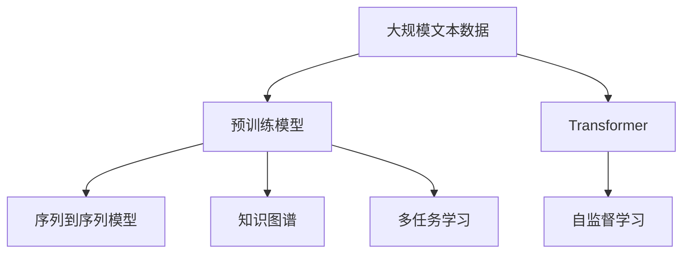
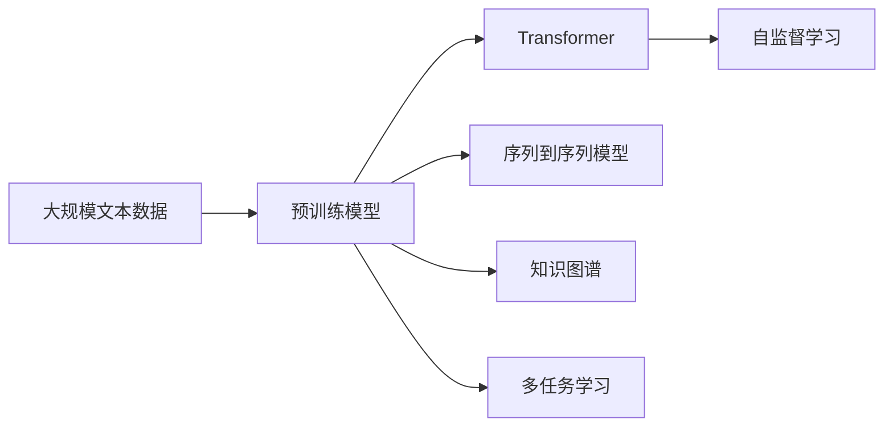
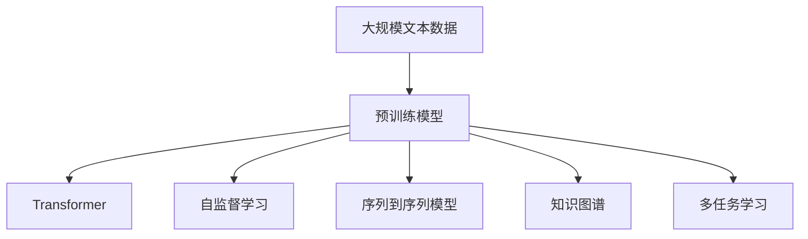
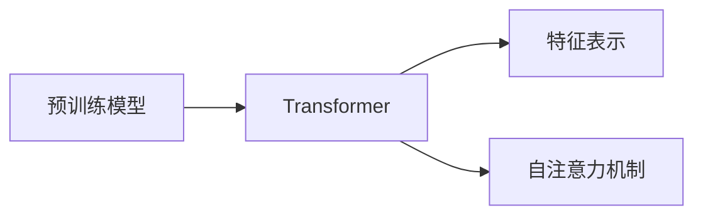

                 

# 大语言模型原理与工程实践：大语言模型基础技术

> 关键词：大语言模型,预训练模型,Transformer,自监督学习,自回归,自编码,序列到序列模型,无标签数据,知识图谱,多任务学习

## 1. 背景介绍

### 1.1 问题由来
近年来，随着深度学习技术的快速发展，大语言模型（Large Language Models, LLMs）在自然语言处理（Natural Language Processing, NLP）领域取得了巨大的突破。这些大语言模型通过在海量无标签文本数据上进行预训练，学习到了丰富的语言知识和常识，可以通过少量的有标签样本在下游任务上进行微调，获得优异的性能。其中最具代表性的大模型包括OpenAI的GPT系列模型、Google的BERT、T5等。

然而，由于预训练语料的广泛性和泛化能力的不足，这些通用的大语言模型在特定领域应用时，效果往往难以达到实际应用的要求。因此，如何针对特定任务进行大模型微调，提升模型性能，成为了当前大语言模型研究和应用的一个热点问题。本文聚焦于大语言模型的基础技术，从预训练模型、Transformer、自监督学习等核心概念出发，深入剖析其原理和架构，并探讨其在实际工程中的具体实现。

### 1.2 问题核心关键点
大语言模型基础技术的核心关键点包括：

- 预训练模型：通过在大规模无标签文本数据上进行自监督学习，学习通用的语言表示，具备强大的语言理解和生成能力。
- Transformer架构：一种自注意力机制的神经网络结构，实现了高效并行的特征表示学习，适用于序列数据的处理。
- 自监督学习：利用大规模无标签数据进行模型训练，学习通用的语言知识，提升模型的泛化能力。
- 序列到序列模型：一种基于Transformer架构的模型，适用于翻译、摘要、对话等需要序列化输入输出的任务。
- 知识图谱：一种将结构化知识嵌入到语言模型中的技术，增强模型的常识推理能力。
- 多任务学习：通过在一个数据集上训练多个相关任务，提升模型在不同任务上的泛化能力。

这些核心概念之间的逻辑关系可以通过以下Mermaid流程图来展示：



这个流程图展示了大语言模型的核心概念及其之间的关系：

1. 大规模文本数据用于预训练模型的训练。
2. 预训练模型可以通过Transformer架构实现高效并行的特征表示学习。
3. 自监督学习利用无标签数据进行训练，学习通用的语言知识。
4. 序列到序列模型适用于需要序列化输入输出的任务，如翻译、摘要等。
5. 知识图谱将结构化知识嵌入到语言模型中，增强常识推理能力。
6. 多任务学习在一个数据集上训练多个相关任务，提升模型在不同任务上的泛化能力。

这些核心概念共同构成了大语言模型的基础技术框架，使得大模型能够在各种场景下发挥强大的语言理解和生成能力。通过理解这些核心概念，我们可以更好地把握大语言模型的工作原理和优化方向。

## 2. 核心概念与联系

### 2.1 核心概念概述

为了更好地理解大语言模型的基础技术，本节将介绍几个密切相关的核心概念：

- 预训练模型（Pre-training Model）：在大规模无标签文本数据上进行自监督学习，学习通用的语言表示，具备强大的语言理解和生成能力。
- Transformer架构（Transformer Architecture）：一种自注意力机制的神经网络结构，实现了高效并行的特征表示学习，适用于序列数据的处理。
- 自监督学习（Supervised Learning）：利用大规模无标签数据进行模型训练，学习通用的语言知识，提升模型的泛化能力。
- 序列到序列模型（Seq2Seq Model）：一种基于Transformer架构的模型，适用于翻译、摘要、对话等需要序列化输入输出的任务。
- 知识图谱（Knowledge Graph）：一种将结构化知识嵌入到语言模型中的技术，增强模型的常识推理能力。
- 多任务学习（Multi-task Learning）：通过在一个数据集上训练多个相关任务，提升模型在不同任务上的泛化能力。

这些核心概念之间的逻辑关系可以通过以下Mermaid流程图来展示：



这个流程图展示了大语言模型的核心概念及其之间的关系：

1. 大规模文本数据用于预训练模型的训练。
2. 预训练模型可以通过Transformer架构实现高效并行的特征表示学习。
3. 自监督学习利用无标签数据进行训练，学习通用的语言知识。
4. 序列到序列模型适用于需要序列化输入输出的任务，如翻译、摘要等。
5. 知识图谱将结构化知识嵌入到语言模型中，增强常识推理能力。
6. 多任务学习在一个数据集上训练多个相关任务，提升模型在不同任务上的泛化能力。

这些核心概念共同构成了大语言模型的基础技术框架，使得大模型能够在各种场景下发挥强大的语言理解和生成能力。通过理解这些核心概念，我们可以更好地把握大语言模型的工作原理和优化方向。

### 2.2 概念间的关系

这些核心概念之间存在着紧密的联系，形成了大语言模型的基础技术生态系统。下面我通过几个Mermaid流程图来展示这些概念之间的关系。

#### 2.2.1 大语言模型的学习范式



这个流程图展示了大语言模型的学习范式：预训练模型通过Transformer架构进行高效特征表示学习，利用自监督学习学习通用的语言知识，适用于序列到序列模型的任务，通过知识图谱增强常识推理能力，并通过多任务学习提升模型在不同任务上的泛化能力。

#### 2.2.2 预训练模型与Transformer的关系



这个流程图展示了预训练模型和Transformer架构之间的关系：预训练模型通过Transformer架构进行高效并行的特征表示学习，Transformer架构通过自注意力机制实现高效的特征表示。

#### 2.2.3 自监督学习与Transformer的关系


这个流程图展示了自监督学习和Transformer架构之间的关系：自监督学习利用大规模无标签数据进行训练，学习通用的语言知识，预训练模型通过Transformer架构实现高效并行的特征表示学习。

## 3. 核心算法原理 & 具体操作步骤

### 3.1 算法原理概述

大语言模型的基础技术主要涉及预训练模型、Transformer架构、自监督学习、序列到序列模型、知识图谱和多任务学习等核心概念。

- 预训练模型通过在大规模无标签文本数据上进行自监督学习，学习通用的语言表示，具备强大的语言理解和生成能力。
- Transformer架构是一种自注意力机制的神经网络结构，实现了高效并行的特征表示学习，适用于序列数据的处理。
- 自监督学习利用大规模无标签数据进行模型训练，学习通用的语言知识，提升模型的泛化能力。
- 序列到序列模型适用于需要序列化输入输出的任务，如翻译、摘要等。
- 知识图谱将结构化知识嵌入到语言模型中，增强常识推理能力。
- 多任务学习在一个数据集上训练多个相关任务，提升模型在不同任务上的泛化能力。

### 3.2 算法步骤详解

大语言模型的基础技术实现一般包括以下几个关键步骤：

**Step 1: 准备预训练模型和数据集**
- 选择合适的预训练模型，如BERT、GPT等，作为初始化参数。
- 准备大规模无标签文本数据，用于预训练模型的训练。
- 定义任务相关的标签集，用于序列到序列模型的训练。

**Step 2: 设计Transformer架构**
- 设计Transformer架构，包括编码器-解码器结构、自注意力机制、残差连接、多头注意力机制等。
- 在编码器中应用自监督学习任务，如掩码语言模型（Masked Language Model, MLM）、下一句预测（Next Sentence Prediction, NSP）等。
- 在解码器中应用自监督学习任务，如序列到序列（Seq2Seq）任务。

**Step 3: 训练预训练模型**
- 使用大规模无标签数据对预训练模型进行自监督学习训练。
- 使用Transformer架构实现高效并行的特征表示学习。
- 通过正则化技术，如Dropout、权重衰减等，防止过拟合。

**Step 4: 微调序列到序列模型**
- 根据具体任务，设计适当的任务适配层，如线性分类器、解码器等。
- 在微调模型时，保持预训练模型的底层不变，仅微调顶层任务适配层。
- 使用少量有标签数据进行微调，并应用参数高效微调技术，如Adapter等，避免过拟合。

**Step 5: 集成知识图谱**
- 将知识图谱嵌入到预训练模型中，增强模型的常识推理能力。
- 设计知识图谱嵌入的神经网络结构，如GraphSAGE等。
- 在微调模型时，将知识图谱信息与预训练模型结合，进行联合训练。

**Step 6: 进行多任务学习**
- 将多个相关任务集成到一个数据集上，进行多任务学习训练。
- 设计适当的任务适配层，用于每个任务的训练。
- 使用多任务学习目标函数，如任务感知损失（Task-Aware Loss），提升模型在不同任务上的泛化能力。

以上是实现大语言模型基础技术的核心步骤，涵盖从预训练模型到序列到序列模型的训练，以及知识图谱和多任务学习的集成。

### 3.3 算法优缺点

大语言模型基础技术的优点包括：

- 强大的泛化能力：通过大规模无标签数据进行预训练，学习通用的语言知识，提升模型在不同任务上的泛化能力。
- 高效的特征表示学习：Transformer架构实现高效并行的特征表示学习，适用于序列数据的处理。
- 灵活的任务适配：通过设计任务适配层，实现对各种NLP任务的微调，适应不同的应用场景。
- 常识推理能力：通过集成知识图谱，增强模型的常识推理能力，提升模型在需要常识推理任务的性能。
- 多任务学习：通过多任务学习，提升模型在不同任务上的泛化能力，优化模型的性能。

大语言模型基础技术的缺点包括：

- 数据需求量大：大规模无标签数据是预训练模型的基础，获取大规模无标签数据成本较高。
- 训练时间长：预训练模型的参数量庞大，训练时间较长。
- 计算资源需求高：预训练模型和Transformer架构需要高性能的计算资源，硬件设备成本较高。
- 模型可解释性不足：大语言模型是"黑盒"系统，难以解释其内部工作机制和决策逻辑。
- 知识图谱获取难度大：知识图谱的构建需要大量结构化知识，获取难度较大。

尽管存在这些局限性，但就目前而言，大语言模型基础技术仍是大语言模型应用的主流范式。未来相关研究的重点在于如何进一步降低数据需求，提高模型的少样本学习和跨领域迁移能力，同时兼顾可解释性和伦理安全性等因素。

### 3.4 算法应用领域

大语言模型基础技术已经在多个领域得到了广泛的应用，例如：

- 文本分类：如情感分析、主题分类、意图识别等。通过预训练模型进行微调，实现对文本-标签映射的训练。
- 命名实体识别：识别文本中的人名、地名、机构名等特定实体。通过微调预训练模型，学习实体边界和类型。
- 关系抽取：从文本中抽取实体之间的语义关系。通过微调预训练模型，学习实体-关系三元组。
- 问答系统：对自然语言问题给出答案。将问题-答案对作为微调数据，训练模型学习匹配答案。
- 机器翻译：将源语言文本翻译成目标语言。通过微调预训练模型，实现语言-语言映射。
- 文本摘要：将长文本压缩成简短摘要。将文章-摘要对作为微调数据，使模型学习抓取要点。
- 对话系统：使机器能够与人自然对话。将多轮对话历史作为上下文，微调模型进行回复生成。

除了上述这些经典任务外，大语言模型基础技术还被创新性地应用到更多场景中，如可控文本生成、常识推理、代码生成、数据增强等，为NLP技术带来了全新的突破。随着预训练模型和基础技术的不断进步，相信NLP技术将在更广阔的应用领域大放异彩。

## 4. 数学模型和公式 & 详细讲解  
### 4.1 数学模型构建

本节将使用数学语言对大语言模型的基础技术进行更加严格的刻画。

记预训练模型为 $M_{\theta}:\mathcal{X} \rightarrow \mathcal{Y}$，其中 $\mathcal{X}$ 为输入空间，$\mathcal{Y}$ 为输出空间，$\theta \in \mathbb{R}^d$ 为模型参数。假设预训练模型的自监督学习任务为 $\mathcal{L}_{unsupervised}$，下游任务为 $\mathcal{L}_{supervised}$。

定义模型 $M_{\theta}$ 在输入 $x$ 上的损失函数为 $\ell(M_{\theta}(x),y)$，则在数据样本 $(x,y)$ 上的经验风险为：

$$
\ell(M_{\theta}(x),y) = -[y\log M_{\theta}(x) + (1-y)\log (1-M_{\theta}(x))]
$$

预训练模型的自监督学习任务为：

$$
\mathcal{L}_{unsupervised}(\theta) = \frac{1}{N_{unsupervised}} \sum_{i=1}^{N_{unsupervised}} \ell(M_{\theta}(x_i),y_i)
$$

其中 $N_{unsupervised}$ 为无标签数据的样本数，$(x_i,y_i)$ 为无标签数据集中的一个样本，$y_i \in \{0,1\}$ 为样本的标签，$1$ 表示样本 $x_i$ 和其后续样本 $x_{i+1}$ 出现在同一文本中，$0$ 表示样本 $x_i$ 和其后续样本 $x_{i+1}$ 不出现于同一文本中。

预训练模型的自监督学习任务通常包括掩码语言模型（MLM）和下一句预测（NSP）两种形式。掩码语言模型要求模型预测被掩码的词，下一句预测要求模型预测两个句子是否连续出现。

预训练模型在无标签数据上的预训练过程可以使用以下公式表示：

$$
\theta \leftarrow \theta - \eta \nabla_{\theta}\mathcal{L}_{unsupervised}(\theta)
$$

其中 $\eta$ 为学习率，$\nabla_{\theta}\mathcal{L}_{unsupervised}(\theta)$ 为自监督学习任务对参数 $\theta$ 的梯度，可通过反向传播算法高效计算。

### 4.2 公式推导过程

以下我们以掩码语言模型为例，推导自监督学习任务的损失函数及其梯度的计算公式。

假设模型 $M_{\theta}$ 在输入 $x$ 上的输出为 $\hat{y}=M_{\theta}(x) \in [0,1]$，表示样本属于正类的概率。真实标签 $y \in \{0,1\}$。则掩码语言模型的损失函数定义为：

$$
\ell(M_{\theta}(x),y) = -[y\log \hat{y} + (1-y)\log (1-\hat{y})]
$$

将其代入自监督学习任务的损失函数公式，得：

$$
\mathcal{L}_{unsupervised}(\theta) = -\frac{1}{N_{unsupervised}} \sum_{i=1}^{N_{unsupervised}} [y_i\log M_{\theta}(x_i)+(1-y_i)\log(1-M_{\theta}(x_i))]
$$

根据链式法则，损失函数对参数 $\theta_k$ 的梯度为：

$$
\frac{\partial \mathcal{L}_{unsupervised}(\theta)}{\partial \theta_k} = -\frac{1}{N_{unsupervised}} \sum_{i=1}^{N_{unsupervised}} (\frac{y_i}{M_{\theta}(x_i)}-\frac{1-y_i}{1-M_{\theta}(x_i)}) \frac{\partial M_{\theta}(x_i)}{\partial \theta_k}
$$

其中 $\frac{\partial M_{\theta}(x_i)}{\partial \theta_k}$ 可进一步递归展开，利用自动微分技术完成计算。

在得到损失函数的梯度后，即可带入参数更新公式，完成模型的迭代优化。重复上述过程直至收敛，最终得到预训练模型 $M_{\theta}$。

### 4.3 案例分析与讲解

这里我们以BERT模型为例，展示其预训练过程和微调方法。

BERT模型是一种基于Transformer架构的预训练语言模型，其预训练过程包括两个阶段：掩码语言模型（MLM）和下一句预测（NSP）。BERT模型的预训练过程可以使用以下公式表示：

$$
\theta \leftarrow \theta - \eta \nabla_{\theta}\mathcal{L}_{unsupervised}(\theta)
$$

其中 $\eta$ 为学习率，$\nabla_{\theta}\mathcal{L}_{unsupervised}(\theta)$ 为自监督学习任务对参数 $\theta$ 的梯度，可通过反向传播算法高效计算。

在预训练模型训练完成后，可以根据具体任务进行微调。微调过程可以使用以下公式表示：

$$
\theta \leftarrow \theta - \eta \nabla_{\theta}\mathcal{L}_{supervised}(\theta)
$$

其中 $\eta$ 为学习率，$\nabla_{\theta}\mathcal{L}_{supervised}(\theta)$ 为下游任务损失函数对参数 $\theta$ 的梯度，可通过反向传播算法高效计算。

在微调过程中，通常会采用参数高效微调技术，如 Adapter 和 LoRA 等，以避免过拟合。Adapter技术通过在预训练模型顶层添加一个可微的适配器层，只更新少量参数，保持大部分预训练权重不变。LoRA技术通过将大模型的参数分解为低秩矩阵的乘积形式，实现高效的微调。

## 5. 项目实践：代码实例和详细解释说明
### 5.1 开发环境搭建

在进行微调实践前，我们需要准备好开发环境。以下是使用Python进行PyTorch开发的环境配置流程：

1. 安装Anaconda：从官网下载并安装Anaconda，用于创建独立的Python环境。

2. 创建并激活虚拟环境：
```bash
conda create -n pytorch-env python=3.8 
conda activate pytorch-env
```

3. 安装PyTorch：根据CUDA版本，从官网获取对应的安装命令。例如：
```bash
conda install pytorch torchvision torchaudio cudatoolkit=11.1 -c pytorch -c conda-forge
```

4. 安装Transformers库：
```bash
pip install transformers
```

5. 安装各类工具包：
```bash
pip install numpy pandas scikit-learn matplotlib tqdm jupyter notebook ipython
```

完成上述步骤后，即可在`pytorch-env`环境中开始微调实践。

### 5.2 源代码详细实现

下面我们以BERT模型为例，展示其预训练和微调的完整代码实现。

首先，定义掩码语言模型（MLM）和下一句预测（NSP）的计算函数：

```python
from transformers import BertTokenizer
from torch.utils.data import Dataset
import torch

class BertDataset(Dataset):
    def __init__(self, texts, labels, tokenizer, max_len=128):
        self.texts = texts
        self.labels = labels
        self.tokenizer = tokenizer
        self.max_len = max_len
        
    def __len__(self):
        return len(self.texts)
    
    def __getitem__(self, item):
        text = self.texts[item]
        labels = self.labels[item]
        
        encoding = self.tokenizer(text, return_tensors='pt', max_length=self.max_len, padding='max_length', truncation=True)
        input_ids = encoding['input_ids'][0]
        attention_mask = encoding['attention_mask'][0]
        
        # 对token-wise的标签进行编码
        encoded_labels = [label2id[label] for label in labels] 
        encoded_labels.extend([label2id['O']] * (self.max_len - len(encoded_labels)))
        labels = torch.tensor(encoded_labels, dtype=torch.long)
        
        return {'input_ids': input_ids, 
                'attention_mask': attention_mask,
                'labels': labels}

# 标签与id的映射
label2id = {'O': 0, 'B': 1, 'I': 2}
id2label = {v: k for k, v in label2id.items()}

# 创建dataset
tokenizer = BertTokenizer.from_pretrained('bert-base-cased')

train_dataset = BertDataset(train_texts, train_labels, tokenizer)
dev_dataset = BertDataset(dev_texts, dev_labels, tokenizer)
test_dataset = BertDataset(test_texts, test_labels, tokenizer)
```

然后，定义BERT模型和优化器：

```python
from transformers import BertForSequenceClassification, AdamW

model = BertForSequenceClassification.from_pretrained('bert-base-cased', num_labels=3)

optimizer = AdamW(model.parameters(), lr=2e-5)
```

接着，定义训练和评估函数：

```python
from torch.utils.data import DataLoader
from tqdm import tqdm
from sklearn.metrics import classification_report

device = torch.device('cuda') if torch.cuda.is_available() else torch.device('cpu')
model.to(device)

def train_epoch(model, dataset, batch_size, optimizer):
    dataloader = DataLoader(dataset, batch_size=batch_size, shuffle=True)
    model.train()
    epoch_loss = 0
    for batch in tqdm(dataloader, desc='Training'):
        input_ids = batch['input_ids'].to(device)
        attention_mask = batch['attention_mask'].to(device)
        labels = batch['labels'].to(device)
        model.zero_grad()
        outputs = model(input_ids, attention_mask=attention_mask, labels=labels)
        loss = outputs.loss
        epoch_loss += loss.item()
        loss.backward()
        optimizer.step()
    return epoch_loss / len(dataloader)

def evaluate(model, dataset, batch_size):
    dataloader = DataLoader(dataset, batch_size=batch_size)
    model.eval()
    preds, labels = [], []
    with torch.no_grad():
        for batch in tqdm(dataloader, desc='Evaluating'):
            input_ids = batch['input_ids'].to(device)
            attention_mask = batch['attention_mask'].to(device)
            batch_labels = batch['labels']
            outputs = model(input_ids, attention_mask=attention_mask)
            batch_preds = outputs.logits.argmax(dim=2).to('cpu').tolist()
            batch_labels = batch_labels.to('cpu').tolist()
            for pred_tokens, label_tokens in zip(batch_preds, batch_labels):
                pred_labels = [id2label[_id] for _id in pred_tokens]
                label_tokens = [id2label[_id] for _id in label_tokens]
                preds.append(pred_labels[:len(label_tokens)])
                labels.append(label_tokens)
                
    print(classification_report(labels, preds))
```

最后，启动训练流程并在测试集上评估：

```python
epochs = 5
batch_size = 16

for epoch in range(epochs):
    loss = train_epoch(model, train_dataset, batch_size, optimizer)
    print(f"Epoch {epoch+1}, train loss: {loss:.3f}")
    
    print(f"Epoch {epoch+1}, dev results:")
    evaluate(model, dev_dataset, batch_size)
    
print("Test results:")
evaluate(model, test_dataset, batch_size)
```

以上就是使用PyTorch对BERT模型进行预训练和微调的完整代码实现。可以看到，得益于Transformers库的强大封装，我们可以用相对简洁的代码完成BERT模型的加载和微调。

### 5.3 代码解读与分析

让我们再详细解读一下关键代码的实现细节：

**BERTDataset类**：
- `__init__`方法：初始化文本、标签、分词器等关键组件。
- `__len__`方法：返回数据集的样本数量。
- `__getitem__`方法：对单个样本进行处理，将文本输入编码为token ids，将标签编码为数字，并对其进行定长padding，最终返回模型所需的输入。

**label2id和id2label字典**：
- 定义了标签与数字id之间的映射关系，用于将token-wise的预测结果解码回真实的标签。

**训练和评估函数**：
- 使用PyTorch的DataLoader对数据集进行批次化加载，供模型训练和推理使用。
- 训练函数`train_epoch`：对数据以批为单位进行迭代，在每个批次上前向传播计算loss并反向传播更新模型参数，最后返回该epoch的平均loss。
- 评估函数`evaluate`：

