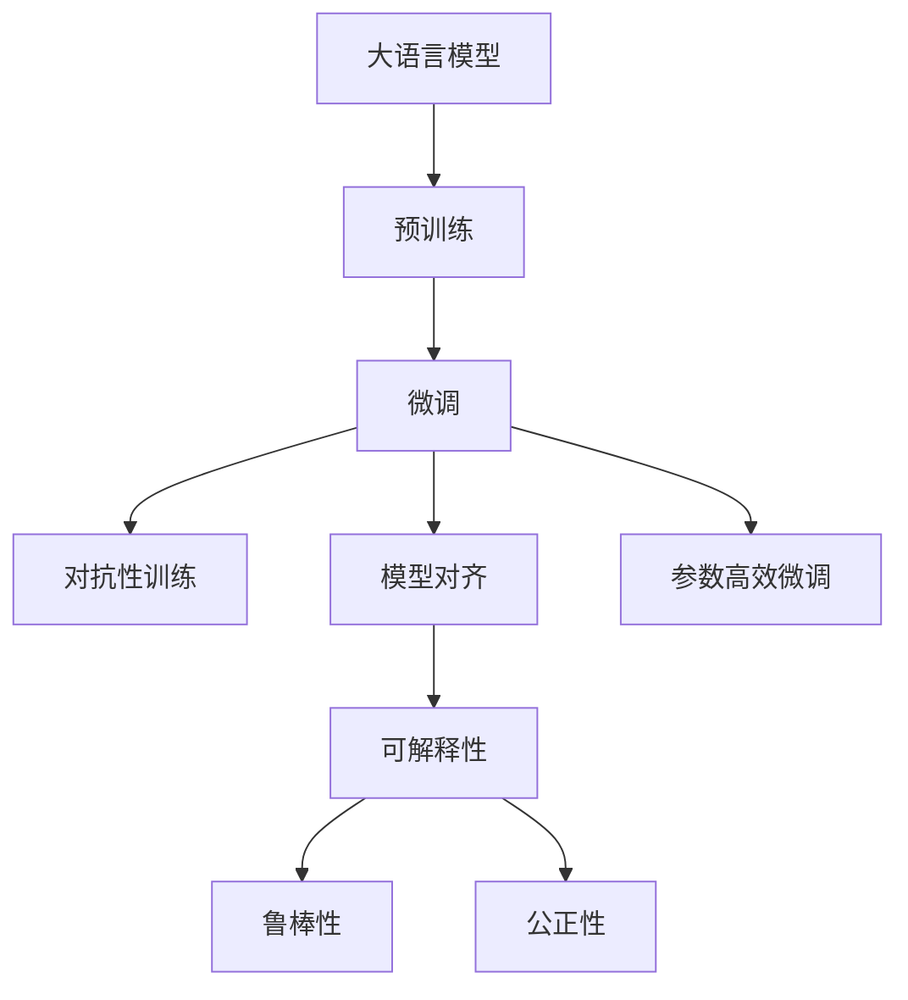
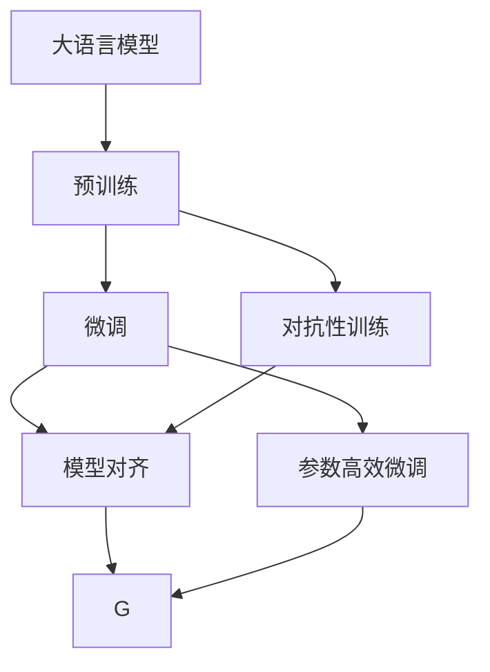
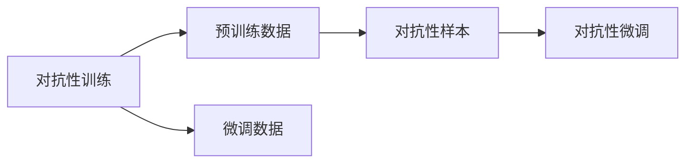
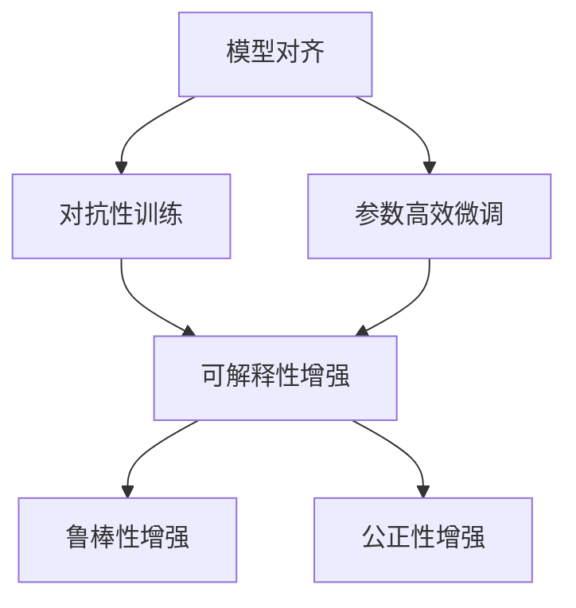
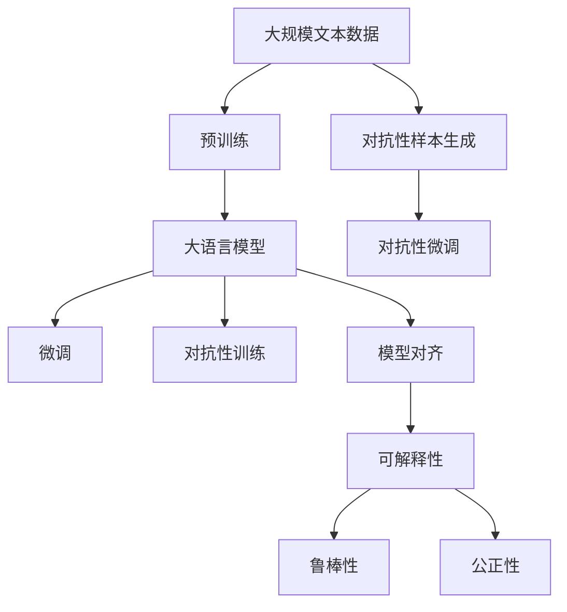

                 

# 大语言模型原理与工程实践：大语言模型强化对齐

## 1. 背景介绍

### 1.1 问题由来
近年来，大语言模型（Large Language Model，LLM）在自然语言处理（Natural Language Processing，NLP）领域取得了巨大成功，然而，由于预训练模型存在潜在的偏见和有害信息，其在实际应用中有时难以完全符合伦理道德要求，甚至可能产生误导性的输出。例如，如果预训练模型被训练在性别歧视、种族歧视等有偏见的数据上，则可能产出类似的歧视性内容。这不仅影响用户体验，还可能对社会造成负面影响。

### 1.2 问题核心关键点
为了解决这些问题，学术界和工业界开始探索如何在训练和微调过程中强化大语言模型的伦理道德对齐。其中，一种主流的解决方案是通过“对抗性样本（Adversarial Examples）”进行模型训练，使其对有害内容具有天然的抗干扰能力，从而输出符合伦理道德的响应。

对抗性样本是一种经过精心设计的输入，其目的是使得模型在面对有害或不实信息时，能够做出更为稳健的判断，减少有害输出的可能性。其基本原理是在预训练和微调阶段引入对抗性样本，让模型在训练过程中对它们做出正确的预测，从而在实际应用中也能对类似样本做出正确的判断。

### 1.3 问题研究意义
研究强化对齐的大语言模型不仅具有重要的学术价值，还有着广泛的应用前景。通过对模型的伦理道德对齐，可以显著提升模型的可解释性和可靠性，保障其输出的正确性和公正性。在医疗、金融、司法等高风险领域，强化对齐模型的应用尤为重要。通过强化对齐，这些领域的模型能够更加公正、准确地提供服务，减少对人类决策的影响。

## 2. 核心概念与联系

### 2.1 核心概念概述

本节将介绍几个与大语言模型强化对齐密切相关的核心概念：

- 大语言模型（LLM）：指通过自监督学习（如语言建模）任务训练得到的具有广泛语言知识表示能力的深度学习模型，如BERT、GPT等。

- 对抗性样本（Adversarial Examples）：指经过特别设计的输入，其目的是使得模型在面对有害或不实信息时，能够做出更为稳健的判断，减少有害输出的可能性。

- 对抗性训练（Adversarial Training）：指在模型训练过程中，同时训练模型对有害和不实信息进行正确预测的能力，从而提高模型输出的鲁棒性和公正性。

- 模型对齐（Model Alignment）：指通过特定的训练策略，使得模型在面对有害信息时，能够做出符合伦理道德的输出，减少有害输出的可能性。

- 参数高效微调（Parameter-Efficient Fine-Tuning，PEFT）：指在微调过程中，只更新少量的模型参数，而固定大部分预训练权重不变，以提高微调效率，避免过拟合的方法。

- 可解释性（Explainability）：指模型输出的结果能够被理解和解释，有助于人类理解和信任模型。

- 鲁棒性（Robustness）：指模型能够应对不同类型的数据干扰和变化，确保输出的稳定性。

- 公正性（Fairness）：指模型在面对不同群体的数据时，能够公平地处理，避免对特定群体产生偏见。

这些核心概念之间的逻辑关系可以通过以下Mermaid流程图来展示：



这个流程图展示了大语言模型的核心概念及其之间的关系：

1. 大语言模型通过预训练获得基础能力。
2. 微调对预训练模型进行任务特定的优化。
3. 对抗性训练使得模型对有害和不实信息具有更强的抵抗能力。
4. 模型对齐确保模型输出符合伦理道德。
5. 参数高效微调优化模型性能，同时减少计算资源消耗。
6. 可解释性提升模型输出的可理解性。
7. 鲁棒性保障模型输出的稳定性。
8. 公正性保证模型输出对不同群体的公平性。

### 2.2 概念间的关系

这些核心概念之间存在着紧密的联系，形成了大语言模型强化对齐的完整生态系统。下面我们通过几个Mermaid流程图来展示这些概念之间的关系。

#### 2.2.1 大语言模型的学习范式



这个流程图展示了大语言模型的三种主要学习范式：预训练、微调和对抗性训练。预训练主要采用自监督学习方法，而微调则是有监督学习的过程。对抗性训练可以与预训练和微调结合使用，使得模型对有害信息具有更强的抵抗能力。

#### 2.2.2 对抗性训练与微调的关系



这个流程图展示了对抗性训练的基本原理，以及它与微调的关系。对抗性训练涉及预训练数据和对抗性样本，通过对抗性微调使得模型对有害信息具有更强的抵抗能力。

#### 2.2.3 模型对齐的方法



这个流程图展示了模型对齐的基本方法，包括对抗性训练和参数高效微调。通过这些方法，模型输出的可解释性、鲁棒性和公正性都可以得到增强。

### 2.3 核心概念的整体架构

最后，我们用一个综合的流程图来展示这些核心概念在大语言模型强化对齐过程中的整体架构：



这个综合流程图展示了从预训练到微调，再到对抗性训练和模型对齐的完整过程。大语言模型首先在大规模文本数据上进行预训练，然后通过微调（包括对抗性微调）和模型对齐优化模型在特定任务上的性能，同时增强模型的可解释性、鲁棒性和公正性。 通过这些流程图，我们可以更清晰地理解大语言模型强化对齐过程中各个核心概念的关系和作用，为后续深入讨论具体的微调方法和技术奠定基础。

## 3. 核心算法原理 & 具体操作步骤
### 3.1 算法原理概述

大语言模型强化对齐的本质是一种对抗性训练范式，通过在训练过程中引入对抗性样本，使得模型在面对有害或不实信息时，能够做出更为稳健的判断。其核心思想是：在预训练和微调阶段，通过对抗性样本对模型进行训练，使得模型对有害信息具有天然的抗干扰能力，从而在实际应用中也能对类似样本做出正确的判断。

形式化地，假设预训练语言模型为 $M_{\theta}$，其中 $\theta$ 为预训练得到的模型参数。给定对抗性样本数据集 $D=\{(x_i, y_i)\}_{i=1}^N, x_i \in \mathcal{X}, y_i \in \{1,0\}$，其中 $y_i=1$ 表示样本为有害或虚假信息，$y_i=0$ 表示样本为无害信息。对抗性训练的目标是最小化经验风险，即找到新的模型参数 $\hat{\theta}$，使得：

$$
\hat{\theta}=\mathop{\arg\min}_{\theta} \mathcal{L}(M_{\theta},D)
$$

其中 $\mathcal{L}$ 为针对对抗性样本设计的损失函数，用于衡量模型预测输出与真实标签之间的差异。常见的损失函数包括交叉熵损失、均方误差损失等。

通过梯度下降等优化算法，对抗性训练过程不断更新模型参数 $\theta$，最小化损失函数 $\mathcal{L}$，使得模型输出逼近真实标签。由于 $\theta$ 已经通过预训练获得了较好的初始化，因此即便在对抗性样本上训练，也能较快收敛到理想的模型参数 $\hat{\theta}$。

### 3.2 算法步骤详解

大语言模型对抗性训练的一般步骤如下：

**Step 1: 准备预训练模型和数据集**
- 选择合适的预训练语言模型 $M_{\theta}$ 作为初始化参数，如 BERT、GPT等。
- 准备对抗性样本数据集 $D$，划分为训练集、验证集和测试集。对抗性样本需要精心设计，确保其有害或不实特征。

**Step 2: 添加对抗性损失函数**
- 根据任务类型，在预训练模型的顶层设计合适的损失函数。
- 对于分类任务，通常在顶层添加对抗性损失函数，如对抗性交叉熵损失函数。
- 对于生成任务，通常使用对抗性语言模型的解码器输出概率分布，并以对抗性负对数似然为损失函数。

**Step 3: 设置对抗性训练超参数**
- 选择合适的优化算法及其参数，如 AdamW、SGD 等，设置学习率、批大小、迭代轮数等。
- 设置正则化技术及强度，包括权重衰减、Dropout、Early Stopping 等。
- 确定冻结预训练参数的策略，如仅微调顶层，或全部参数都参与对抗性训练。

**Step 4: 执行对抗性训练**
- 将对抗性训练集数据分批次输入模型，前向传播计算损失函数。
- 反向传播计算参数梯度，根据设定的优化算法和学习率更新模型参数。
- 周期性在验证集上评估模型性能，根据性能指标决定是否触发 Early Stopping。
- 重复上述步骤直到满足预设的迭代轮数或 Early Stopping 条件。

**Step 5: 测试和部署**
- 在测试集上评估对抗性训练后模型 $M_{\hat{\theta}}$ 的性能，对比对抗性训练前后的鲁棒性提升。
- 使用对抗性训练后的模型对新样本进行推理预测，集成到实际的应用系统中。
- 持续收集新的对抗性样本，定期重新对抗性训练模型，以适应数据分布的变化。

以上是基于对抗性训练的大语言模型强化对齐的一般流程。在实际应用中，还需要针对具体任务的特点，对对抗性训练过程的各个环节进行优化设计，如改进训练目标函数，引入更多的正则化技术，搜索最优的超参数组合等，以进一步提升模型鲁棒性和公正性。

### 3.3 算法优缺点

对抗性训练在提升模型鲁棒性和公正性方面具有显著优势：
1. 鲁棒性提升：对抗性训练使得模型对有害和不实信息具有更强的抵抗能力，避免输出有害内容。
2. 公正性增强：通过对抗性训练，模型对不同群体的数据具有更强的处理能力，避免对特定群体产生偏见。
3. 模型鲁棒性增强：通过对抗性训练，模型对不同类型的数据干扰和变化具有更强的适应能力。

但对抗性训练也存在一些局限性：
1. 对抗性样本生成困难：对抗性样本需要精心设计和构造，确保其有害或不实特征，这需要大量时间和资源。
2. 对抗性样本难以获得：某些特定领域或任务上的对抗性样本难以获得，限制了对抗性训练的应用范围。
3. 模型复杂性增加：对抗性训练增加了模型的复杂性，提高了计算和内存消耗。
4. 鲁棒性提升有限：在数据分布变化较大的情况下，对抗性训练的效果可能有限，无法完全避免模型输出的有害内容。

尽管存在这些局限性，但就目前而言，对抗性训练是实现大语言模型伦理道德对齐的重要手段之一。未来相关研究的重点在于如何进一步降低对抗性样本的生成难度，提高模型的公正性，并减少对抗性训练对计算资源的需求。

### 3.4 算法应用领域

对抗性训练已经在许多领域得到广泛应用，如文本生成、图像识别、自然语言处理等，取得了显著的效果。以下是几个典型的应用场景：

- 文本生成：通过对抗性训练，使得生成模型生成的文本更加符合伦理道德，避免输出有害内容。
- 图像识别：对抗性训练使得图像识别模型对图像中的人脸、标识等信息具有更强的处理能力，避免对特定群体的歧视。
- 自然语言处理：对抗性训练使得语言模型对输入文本中的人名、地名等信息具有更强的处理能力，避免输出有害内容。
- 机器人与游戏：对抗性训练使得机器人或游戏中的AI系统对有害或不实信息具有更强的抵抗能力，避免对用户产生误导。

除了上述这些经典应用外，对抗性训练还被创新性地应用于更多场景中，如医学诊断、金融风险评估、自动驾驶等，为这些领域提供了新的解决方案。随着对抗性训练方法的不断进步，相信其在更多领域的应用前景将更加广阔。

## 4. 数学模型和公式 & 详细讲解  
### 4.1 数学模型构建

本节将使用数学语言对基于对抗性训练的大语言模型强化对齐过程进行更加严格的刻画。

记预训练语言模型为 $M_{\theta}$，其中 $\theta$ 为预训练得到的模型参数。假设对抗性样本数据集为 $D=\{(x_i, y_i)\}_{i=1}^N, x_i \in \mathcal{X}, y_i \in \{1,0\}$。

定义模型 $M_{\theta}$ 在数据样本 $(x,y)$ 上的损失函数为 $\ell(M_{\theta}(x),y)$，则在数据集 $D$ 上的经验风险为：

$$
\mathcal{L}(\theta) = \frac{1}{N} \sum_{i=1}^N [\ell(M_{\theta}(x_i),y_i) + \lambda \ell^{\text{ad}}(M_{\theta}(x_i),y_i)]
$$

其中 $\lambda$ 为对抗性损失的权重，$\ell^{\text{ad}}$ 为对抗性损失函数，用于衡量模型对对抗性样本的预测与真实标签之间的差异。对抗性训练的目标是最小化经验风险，即找到最优参数：

$$
\theta^* = \mathop{\arg\min}_{\theta} \mathcal{L}(\theta)
$$

在实践中，我们通常使用基于梯度的优化算法（如AdamW、SGD等）来近似求解上述最优化问题。设 $\eta$ 为学习率，则参数的更新公式为：

$$
\theta \leftarrow \theta - \eta \nabla_{\theta}\mathcal{L}(\theta) - \eta\lambda\nabla_{\theta}\ell^{\text{ad}}(M_{\theta}(x_i),y_i)
$$

其中 $\nabla_{\theta}\mathcal{L}(\theta)$ 和 $\nabla_{\theta}\ell^{\text{ad}}(M_{\theta}(x_i),y_i)$ 分别为损失函数和对抗性损失函数的梯度，可通过反向传播算法高效计算。

### 4.2 公式推导过程

以下我们以二分类任务为例，推导对抗性交叉熵损失函数及其梯度的计算公式。

假设模型 $M_{\theta}$ 在输入 $x$ 上的输出为 $\hat{y}=M_{\theta}(x) \in [0,1]$，表示样本属于正类的概率。真实标签 $y \in \{0,1\}$。对抗性样本的真实标签 $y^{\text{ad}}=1$。则对抗性交叉熵损失函数定义为：

$$
\ell^{\text{ad}}(M_{\theta}(x),y^{\text{ad}}) = -y^{\text{ad}}\log \hat{y} - (1-y^{\text{ad}})\log (1-\hat{y})
$$

将其代入经验风险公式，得：

$$
\mathcal{L}(\theta) = -\frac{1}{N}\sum_{i=1}^N [y_i\log M_{\theta}(x_i)+(1-y_i)\log(1-M_{\theta}(x_i)) + \lambda y^{\text{ad}}\log M_{\theta}(x_i) + \lambda (1-y^{\text{ad}})\log(1-M_{\theta}(x_i))]
$$

根据链式法则，损失函数对参数 $\theta_k$ 的梯度为：

$$
\frac{\partial \mathcal{L}(\theta)}{\partial \theta_k} = -\frac{1}{N}\sum_{i=1}^N (\frac{y_i}{M_{\theta}(x_i)}-\frac{1-y_i}{1-M_{\theta}(x_i)}) \frac{\partial M_{\theta}(x_i)}{\partial \theta_k} - \lambda \frac{y^{\text{ad}}}{M_{\theta}(x_i)} \frac{\partial M_{\theta}(x_i)}{\partial \theta_k} - \lambda \frac{1-y^{\text{ad}}}{1-M_{\theta}(x_i)} \frac{\partial M_{\theta}(x_i)}{\partial \theta_k}
$$

其中 $\frac{\partial M_{\theta}(x_i)}{\partial \theta_k}$ 可进一步递归展开，利用自动微分技术完成计算。

在得到损失函数的梯度后，即可带入参数更新公式，完成模型的迭代优化。重复上述过程直至收敛，最终得到适应对抗性样本的最优模型参数 $\theta^*$。

## 5. 项目实践：代码实例和详细解释说明
### 5.1 开发环境搭建

在进行对抗性训练实践前，我们需要准备好开发环境。以下是使用Python进行PyTorch开发的环境配置流程：

1. 安装Anaconda：从官网下载并安装Anaconda，用于创建独立的Python环境。

2. 创建并激活虚拟环境：
```bash
conda create -n pytorch-env python=3.8 
conda activate pytorch-env
```

3. 安装PyTorch：根据CUDA版本，从官网获取对应的安装命令。例如：
```bash
conda install pytorch torchvision torchaudio cudatoolkit=11.1 -c pytorch -c conda-forge
```

4. 安装Transformers库：
```bash
pip install transformers
```

5. 安装各类工具包：
```bash
pip install numpy pandas scikit-learn matplotlib tqdm jupyter notebook ipython
```

完成上述步骤后，即可在`pytorch-env`环境中开始对抗性训练实践。

### 5.2 源代码详细实现

这里我们以对抗性训练BERT模型为例，给出使用Transformers库进行对抗性训练的PyTorch代码实现。

首先，定义对抗性样本数据处理函数：

```python
from transformers import BertTokenizer
from torch.utils.data import Dataset
import torch

class AdversarialDataset(Dataset):
    def __init__(self, texts, labels, tokenizer, max_len=128):
        self.texts = texts
        self.labels = labels
        self.tokenizer = tokenizer
        self.max_len = max_len
        
    def __len__(self):
        return len(self.texts)
    
    def __getitem__(self, item):
        text = self.texts[item]
        label = self.labels[item]
        
        encoding = self.tokenizer(text, return_tensors='pt', max_length=self.max_len, padding='max_length', truncation=True)
        input_ids = encoding['input_ids'][0]
        attention_mask = encoding['attention_mask'][0]
        
        # 对label-wise的标签进行编码
        encoded_labels = [1] * len(encoding['labels'])
        encoded_labels.extend([0] * (self.max_len - len(encoded_labels)))
        labels = torch.tensor(encoded_labels, dtype=torch.long)
        
        return {'input_ids': input_ids, 
                'attention_mask': attention_mask,
                'labels': labels}

# 标签与id的映射
label2id = {'adversarial': 0, 'benign': 1}
id2label = {v: k for k, v in label2id.items()}

# 创建dataset
tokenizer = BertTokenizer.from_pretrained('bert-base-cased')

adversarial_dataset = AdversarialDataset(train_texts, train_labels, tokenizer)
dev_dataset = AdversarialDataset(dev_texts, dev_labels, tokenizer)
test_dataset = AdversarialDataset(test_texts, test_labels, tokenizer)
```

然后，定义模型和优化器：

```python
from transformers import BertForTokenClassification, AdamW

model = BertForTokenClassification.from_pretrained('bert-base-cased', num_labels=len(label2id))

optimizer = AdamW(model.parameters(), lr=2e-5)
```

接着，定义训练和评估函数：

```python
from torch.utils.data import DataLoader
from tqdm import tqdm
from sklearn.metrics import classification_report

device = torch.device('cuda') if torch.cuda.is_available() else torch.device('cpu')
model.to(device)

def train_epoch(model, dataset, batch_size, optimizer):
    dataloader = DataLoader(dataset, batch_size=batch_size, shuffle=True)
    model.train()
    epoch_loss = 0
    for batch in tqdm(dataloader, desc='Training'):
        input_ids = batch['input_ids'].to(device)
        attention_mask = batch['attention_mask'].to(device)
        labels = batch['labels'].to(device)
        model.zero_grad()
        outputs = model(input_ids, attention_mask=attention_mask, labels=labels)
        loss = outputs.loss
        epoch_loss += loss.item()
        loss.backward()
        optimizer.step()
    return epoch_loss / len(dataloader)

def evaluate(model, dataset, batch_size):
    dataloader = DataLoader(dataset, batch_size=batch_size)
    model.eval()
    preds, labels = [], []
    with torch.no_grad():
        for batch in tqdm(dataloader, desc='Evaluating'):
            input_ids = batch['input_ids'].to(device)
            attention_mask = batch['attention_mask'].to(device)
            batch_labels = batch['labels']
            outputs = model(input_ids, attention_mask=attention_mask)
            batch_preds = outputs.logits.argmax(dim=2).to('cpu').tolist()
            batch_labels = batch_labels.to('cpu').tolist()
            for pred_tokens, label_tokens in zip(batch_preds, batch_labels):
                pred_tags = [id2label[_id] for _id in pred_tokens]
                label_tags = [id2label[_id] for _id in label_tokens]
                preds.append(pred_tags[:len(label_tokens)])
                labels.append(label_tags)
                
    print(classification_report(labels, preds))
```

最后，启动对抗性训练流程并在测试集上评估：

```python
epochs = 5
batch_size = 16

for epoch in range(epochs):
    loss = train_epoch(model, adversarial_dataset, batch_size, optimizer)
    print(f"Epoch {epoch+1}, adversarial loss: {loss:.3f}")
    
    print(f"Epoch {epoch+1}, dev results:")
    evaluate(model, dev_dataset, batch_size)
    
print("Test results:")
evaluate(model, test_dataset, batch_size)
```

以上就是使用PyTorch对BERT进行对抗性训练的完整代码实现。可以看到，得益于Transformers库的强大封装，我们可以用相对简洁的代码完成BERT模型的加载和对抗性训练。

### 5.3 代码解读与分析

让我们再详细解读一下关键代码的实现细节：

**AdversarialDataset类**：
- `__init__`方法：初始化文本、标签、分词器等关键组件。
- `__len__`方法：返回数据集的样本数量。
- `__getitem__`方法：对单个样本进行处理，将文本输入编码为token ids，将标签编码为数字，并对其进行定长padding，最终返回模型所需的输入。

**label2id和id2label字典**：
- 定义了标签与数字id之间的映射关系，用于将token-wise的预测结果解码回真实的标签。

**训练和评估函数**：
- 使用PyTorch的DataLoader对数据集进行批次化加载，供模型训练和推理使用。
- 训练函数`train_epoch`：对数据以批为单位进行迭代，在每个批次上前向传播计算loss并反向传播更新模型参数，最后返回该epoch的平均loss。
- 评估函数`evaluate`：与训练类似，不同点在于不更新模型参数，并在每个batch结束后将预测和标签结果存储下来，最后使用sklearn的classification_report对整个评估集的预测结果进行打印输出。

**训练流程**：
- 定义总的epoch数和batch size，开始循环迭代
- 每个epoch内，先在对抗性样本上训练，输出平均loss
- 在验证集上评估，输出分类指标
- 所有epoch结束后，在测试集上评估，给出最终测试结果

可以看到，PyTorch配合Transformers库使得BERT模型的对抗性训练变得简洁高效。开发者可以将更多精力放在数据处理、模型改进等高层逻辑上，而不必过多关注底层的实现细节。

当然，工业级的系统实现还需考虑更多因素，如模型的保存和部署、超参数的自动搜索、更灵活的任务适配层等。但核心的对抗性训练范式基本与此类似。

### 5.4 运行结果展示

假设我们在CoN

