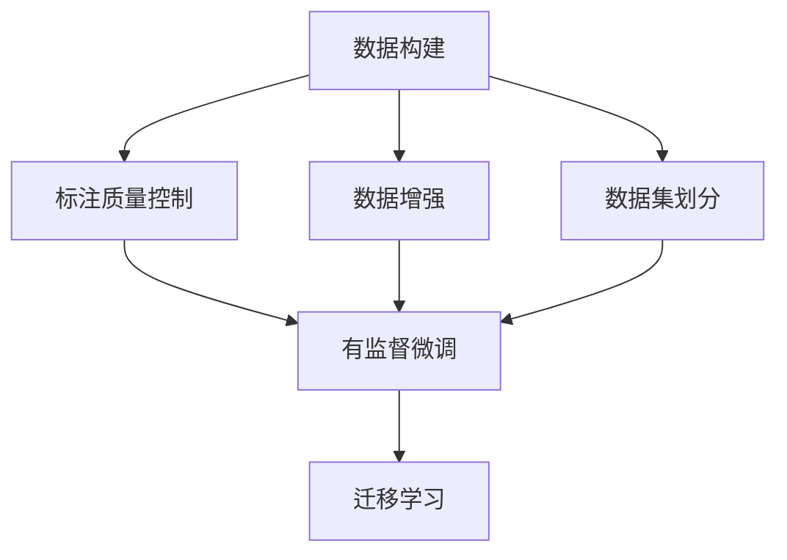
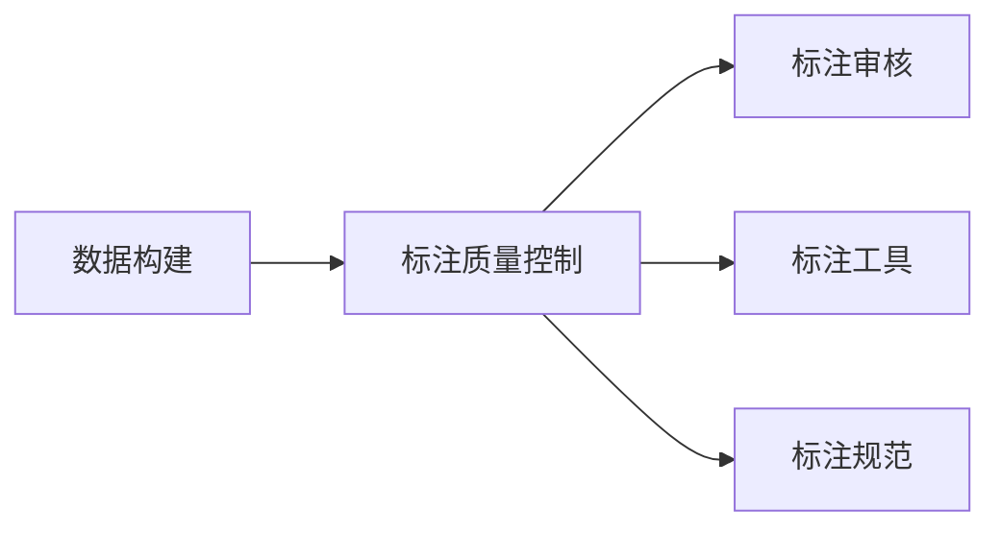
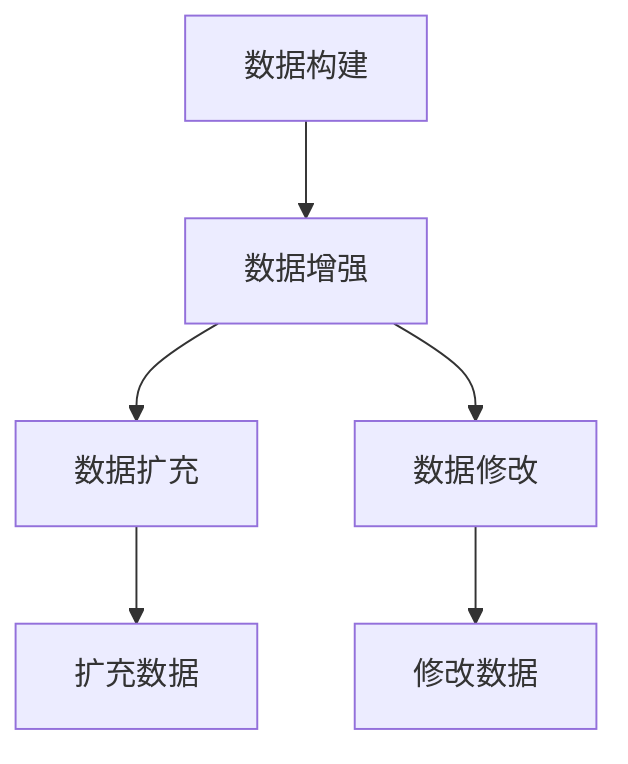
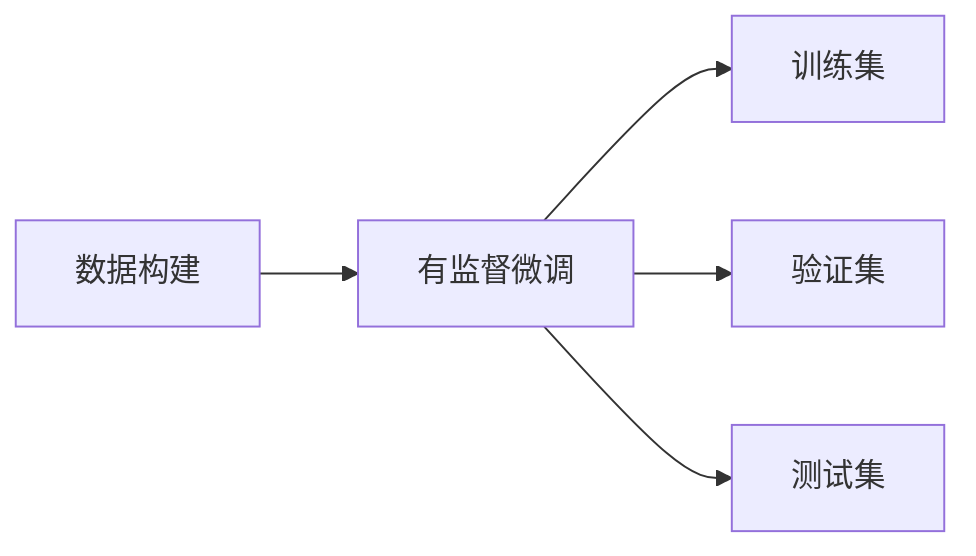
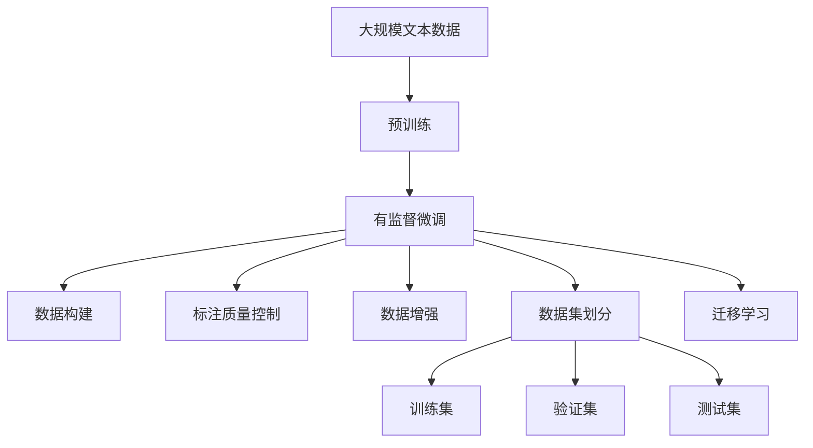

                 

# 大语言模型原理与工程实践：有监督微调数据的构建

## 1. 背景介绍

### 1.1 问题由来

在自然语言处理（Natural Language Processing，NLP）领域，预训练语言模型（Pre-trained Language Models, PLMs）如BERT、GPT等已经取得了显著的进展，成为当前NLP研究的重要基础。然而，这些预训练模型在特定任务上的泛化能力仍有限，无法满足实际应用需求。有监督微调（Supervised Fine-tuning）成为一种有效的方法，通过使用少量有标签数据对预训练模型进行调整，使其在特定任务上表现更加出色。

有监督微调的本质是通过在有标签数据上训练模型，调整模型的参数，使其适应特定任务。该方法广泛应用于问答系统、文本分类、命名实体识别、机器翻译等任务中。然而，在构建有监督微调数据时，如何保证数据的多样性、覆盖性和标注的准确性，是一个重要的挑战。

### 1.2 问题核心关键点

有监督微调数据构建的核心关键点在于以下几个方面：

- **数据多样性**：数据应覆盖任务的各种情况，包括正负样本、边界情况、异常数据等，以避免模型对特定情况过于敏感。
- **数据量**：数据量应足够大，以确保模型能够学习到任务特征，避免过拟合。
- **标注准确性**：标注应准确无误，以确保模型能够正确学习任务特征，避免误导模型。
- **数据标注成本**：标注数据应尽量减少成本，可以通过人工标注、机器标注等手段实现。
- **数据更新**：数据应定期更新，以反映任务的变化和新的需求。

在实际应用中，如何平衡这些关键点，是一个复杂且重要的问题。本文将从这些关键点出发，探讨大语言模型有监督微调数据的构建。

## 2. 核心概念与联系

### 2.1 核心概念概述

为更好地理解有监督微调数据构建的核心概念，本节将介绍几个密切相关的核心概念：

- **有监督微调**：指在预训练模型的基础上，使用少量有标签数据，通过有监督学习优化模型在特定任务上的性能。
- **数据构建**：指构建有监督微调所需的标注数据集，包括数据收集、标注和清洗等步骤。
- **标注质量控制**：指通过一系列方法保证标注数据的质量，如重复检查、标注审核、标注工具等。
- **数据增强**：指通过修改、扩充现有数据，增加数据多样性和数量，以提高模型的泛化能力。
- **数据集划分**：指将数据集划分为训练集、验证集和测试集，用于模型训练、调参和评估。
- **迁移学习**：指将一个领域学习到的知识，迁移到另一个相关领域，以提高模型的泛化能力。

这些概念之间的逻辑关系可以通过以下Mermaid流程图来展示：



这个流程图展示了大语言模型有监督微调数据构建的关键环节及其之间的关系。

### 2.2 概念间的关系

这些核心概念之间存在着紧密的联系，形成了有监督微调数据构建的完整生态系统。下面我通过几个Mermaid流程图来展示这些概念之间的关系。

#### 2.2.1 数据构建与标注质量控制



这个流程图展示了数据构建与标注质量控制之间的关系。标注质量控制包括标注审核、标注工具和标注规范等，确保标注数据的准确性和一致性。

#### 2.2.2 数据增强与数据构建



这个流程图展示了数据增强与数据构建之间的关系。数据增强通过扩充和修改现有数据，增加数据的多样性和数量，以提高模型的泛化能力。

#### 2.2.3 有监督微调与数据集划分



这个流程图展示了有监督微调与数据集划分之间的关系。数据集划分将数据集分为训练集、验证集和测试集，用于模型训练、调参和评估。

### 2.3 核心概念的整体架构

最后，我们用一个综合的流程图来展示这些核心概念在有监督微调数据构建过程中的整体架构：



这个综合流程图展示了从预训练到有监督微调，再到数据构建和迁移学习的完整过程。

## 3. 核心算法原理 & 具体操作步骤

### 3.1 算法原理概述

有监督微调是通过在有标签数据上训练模型，调整模型的参数，使其适应特定任务。其核心思想是利用有标签数据，在模型中引入特定任务的约束，使其在目标任务上表现更好。

形式化地，假设预训练模型为 $M_{\theta}$，其中 $\theta$ 为预训练得到的模型参数。给定有标签数据集 $D=\{(x_i, y_i)\}_{i=1}^N$，其中 $x_i$ 为输入，$y_i$ 为标签。有监督微调的目标是最小化损失函数 $\mathcal{L}(\theta)$，使得模型在目标任务上表现最佳：

$$
\theta^* = \mathop{\arg\min}_{\theta} \mathcal{L}(M_{\theta},D)
$$

其中 $\mathcal{L}$ 为针对任务设计的损失函数，用于衡量模型预测输出与真实标签之间的差异。常见的损失函数包括交叉熵损失、均方误差损失等。

### 3.2 算法步骤详解

有监督微调的一般步骤如下：

1. **数据准备**：收集和整理有标签数据集 $D$，将其分为训练集、验证集和测试集。
2. **模型选择**：选择合适的预训练模型 $M_{\theta}$，如BERT、GPT等。
3. **任务适配**：在预训练模型的基础上，设计任务适配层和损失函数，适配目标任务。
4. **超参数设置**：选择合适的优化器、学习率、批大小、迭代轮数等超参数。
5. **模型训练**：在训练集上使用梯度下降等优化算法，最小化损失函数，更新模型参数。
6. **验证评估**：在验证集上评估模型性能，根据评估结果调整超参数。
7. **测试部署**：在测试集上测试模型性能，部署模型到实际应用中。

### 3.3 算法优缺点

有监督微调方法具有以下优点：

- **简单高效**：只需要少量有标签数据，即可对预训练模型进行调整，提升模型性能。
- **泛化能力强**：通过在有标签数据上训练，模型能够学习到任务的特征，适应多种情况。
- **适应性强**：对于特定任务，可以定制任务适配层和损失函数，适应不同的需求。

然而，该方法也存在一些缺点：

- **依赖标注数据**：有监督微调需要大量标注数据，成本较高。
- **标注质量控制困难**：标注数据的准确性和一致性较难保证，可能导致模型性能下降。
- **模型泛化风险**：标注数据可能覆盖不足，导致模型对特定情况过度敏感，泛化能力降低。

### 3.4 算法应用领域

有监督微调方法在NLP领域得到了广泛的应用，包括但不限于：

- **文本分类**：将文本分类为不同的类别，如情感分析、主题分类等。
- **命名实体识别**：识别文本中的人名、地名、机构名等特定实体。
- **关系抽取**：从文本中抽取实体之间的语义关系。
- **问答系统**：对自然语言问题给出答案。
- **机器翻译**：将源语言文本翻译成目标语言。
- **文本摘要**：将长文本压缩成简短摘要。
- **对话系统**：使机器能够与人自然对话。

除了上述这些经典任务外，有监督微调还被创新性地应用到更多场景中，如可控文本生成、常识推理、代码生成、数据增强等，为NLP技术带来了新的突破。

## 4. 数学模型和公式 & 详细讲解 & 举例说明

### 4.1 数学模型构建

在数学模型构建方面，有监督微调的过程可以通过以下步骤来描述：

1. **输入表示**：将输入 $x$ 编码为模型可处理的向量表示 $h(x)$。
2. **任务适配**：在向量表示的基础上，通过任务适配层 $\mathcal{F}(h(x))$ 进行特定任务的适配。
3. **损失函数**：设计损失函数 $\mathcal{L}(y, \mathcal{F}(h(x)))$，用于衡量模型输出与真实标签之间的差异。
4. **模型训练**：最小化损失函数，更新模型参数 $\theta$。

### 4.2 公式推导过程

以二分类任务为例，假设模型在输入 $x$ 上的输出为 $\hat{y}=M_{\theta}(x) \in [0,1]$，表示样本属于正类的概率。真实标签 $y \in \{0,1\}$。则二分类交叉熵损失函数定义为：

$$
\ell(M_{\theta}(x),y) = -[y\log \hat{y} + (1-y)\log (1-\hat{y})]
$$

将上述损失函数带入经验风险公式：

$$
\mathcal{L}(\theta) = -\frac{1}{N}\sum_{i=1}^N [y_i\log M_{\theta}(x_i)+(1-y_i)\log(1-M_{\theta}(x_i))]
$$

根据链式法则，损失函数对参数 $\theta_k$ 的梯度为：

$$
\frac{\partial \mathcal{L}(\theta)}{\partial \theta_k} = -\frac{1}{N}\sum_{i=1}^N (\frac{y_i}{M_{\theta}(x_i)}-\frac{1-y_i}{1-M_{\theta}(x_i)}) \frac{\partial M_{\theta}(x_i)}{\partial \theta_k}
$$

其中 $\frac{\partial M_{\theta}(x_i)}{\partial \theta_k}$ 可进一步递归展开，利用自动微分技术完成计算。

### 4.3 案例分析与讲解

为了更好地理解有监督微调过程，下面以二分类任务为例，展示有监督微调的数学推导和代码实现。

假设我们有二分类数据集 $D=\{(x_i, y_i)\}_{i=1}^N$，其中 $x_i$ 为输入，$y_i$ 为标签。预训练模型为 $M_{\theta}$，其中 $\theta$ 为预训练得到的模型参数。任务适配层为线性分类器，损失函数为二分类交叉熵。则有监督微调的过程可以通过以下步骤实现：

1. **输入表示**：将输入 $x_i$ 编码成向量表示 $h(x_i)$。
2. **任务适配**：将向量表示 $h(x_i)$ 输入线性分类器 $\mathcal{F}(h(x_i)) = W^T h(x_i) + b$，其中 $W$ 和 $b$ 为线性分类器的权重和偏置。
3. **损失函数**：定义二分类交叉熵损失函数 $\mathcal{L}(y_i, \mathcal{F}(h(x_i))) = -y_i \log \mathcal{F}(h(x_i)) - (1-y_i) \log (1-\mathcal{F}(h(x_i)))$。
4. **模型训练**：使用梯度下降算法最小化损失函数 $\mathcal{L}(\theta)$，更新模型参数 $\theta$。

### 4.4 举例说明

假设我们有一个包含电影评论的文本数据集，其中每条评论都标注了是否为正面评价。我们的任务是将新评论分类为正面或负面。我们可以使用预训练的BERT模型，在其顶层添加一个线性分类器，并使用二分类交叉熵损失函数进行微调。代码实现如下：

```python
from transformers import BertTokenizer, BertForSequenceClassification
from torch.utils.data import Dataset, DataLoader
import torch
import numpy as np

class MovieReviewDataset(Dataset):
    def __init__(self, texts, labels, tokenizer):
        self.texts = texts
        self.labels = labels
        self.tokenizer = tokenizer
        self.max_len = 128

    def __len__(self):
        return len(self.texts)

    def __getitem__(self, item):
        text = self.texts[item]
        label = self.labels[item]
        encoding = self.tokenizer(text, return_tensors='pt', max_length=self.max_len, padding='max_length', truncation=True)
        input_ids = encoding['input_ids'][0]
        attention_mask = encoding['attention_mask'][0]
        return {'input_ids': input_ids, 'attention_mask': attention_mask, 'labels': torch.tensor(label, dtype=torch.long)}

tokenizer = BertTokenizer.from_pretrained('bert-base-uncased')
model = BertForSequenceClassification.from_pretrained('bert-base-uncased', num_labels=2)

device = torch.device('cuda' if torch.cuda.is_available() else 'cpu')
model.to(device)

train_dataset = MovieReviewDataset(train_texts, train_labels, tokenizer)
val_dataset = MovieReviewDataset(val_texts, val_labels, tokenizer)
test_dataset = MovieReviewDataset(test_texts, test_labels, tokenizer)

batch_size = 32
optimizer = AdamW(model.parameters(), lr=2e-5)
criterion = torch.nn.CrossEntropyLoss()

for epoch in range(5):
    model.train()
    total_loss = 0
    for batch in DataLoader(train_dataset, batch_size=batch_size):
        input_ids = batch['input_ids'].to(device)
        attention_mask = batch['attention_mask'].to(device)
        labels = batch['labels'].to(device)
        optimizer.zero_grad()
        outputs = model(input_ids, attention_mask=attention_mask)
        loss = criterion(outputs.logits, labels)
        loss.backward()
        optimizer.step()
        total_loss += loss.item()

    print(f"Epoch {epoch+1}, Loss: {total_loss/len(train_dataset):.4f}")
    val_loss = 0
    val_correct = 0
    for batch in DataLoader(val_dataset, batch_size=batch_size):
        input_ids = batch['input_ids'].to(device)
        attention_mask = batch['attention_mask'].to(device)
        labels = batch['labels'].to(device)
        with torch.no_grad():
            outputs = model(input_ids, attention_mask=attention_mask)
            loss = criterion(outputs.logits, labels)
            val_loss += loss.item()
            preds = outputs.logits.argmax(dim=1)
            val_correct += (preds == labels).sum().item()

    print(f"Epoch {epoch+1}, Val Loss: {val_loss/len(val_dataset):.4f}, Val Acc: {val_correct/len(val_dataset):.4f}")

test_loss = 0
test_correct = 0
model.eval()
with torch.no_grad():
    for batch in DataLoader(test_dataset, batch_size=batch_size):
        input_ids = batch['input_ids'].to(device)
        attention_mask = batch['attention_mask'].to(device)
        labels = batch['labels'].to(device)
        outputs = model(input_ids, attention_mask=attention_mask)
        loss = criterion(outputs.logits, labels)
        test_loss += loss.item()
        preds = outputs.logits.argmax(dim=1)
        test_correct += (preds == labels).sum().item()

print(f"Test Loss: {test_loss/len(test_dataset):.4f}, Test Acc: {test_correct/len(test_dataset):.4f}")
```

以上代码实现了对BERT模型的二分类任务微调。首先定义了数据集，并使用AdamW优化器和交叉熵损失函数进行训练。在训练过程中，通过计算损失函数和更新模型参数，不断调整模型参数，以适应二分类任务。

## 5. 项目实践：代码实例和详细解释说明

### 5.1 开发环境搭建

在进行有监督微调实践前，我们需要准备好开发环境。以下是使用Python进行PyTorch开发的环境配置流程：

1. 安装Anaconda：从官网下载并安装Anaconda，用于创建独立的Python环境。

2. 创建并激活虚拟环境：
```bash
conda create -n pytorch-env python=3.8 
conda activate pytorch-env
```

3. 安装PyTorch：根据CUDA版本，从官网获取对应的安装命令。例如：
```bash
conda install pytorch torchvision torchaudio cudatoolkit=11.1 -c pytorch -c conda-forge
```

4. 安装Transformers库：
```bash
pip install transformers
```

5. 安装各类工具包：
```bash
pip install numpy pandas scikit-learn matplotlib tqdm jupyter notebook ipython
```

完成上述步骤后，即可在`pytorch-env`环境中开始微调实践。

### 5.2 源代码详细实现

下面我们以命名实体识别(NER)任务为例，给出使用Transformers库对BERT模型进行有监督微调的PyTorch代码实现。

首先，定义NER任务的数据处理函数：

```python
from transformers import BertTokenizer
from torch.utils.data import Dataset
import torch

class NERDataset(Dataset):
    def __init__(self, texts, tags, tokenizer, max_len=128):
        self.texts = texts
        self.tags = tags
        self.tokenizer = tokenizer
        self.max_len = max_len
        
    def __len__(self):
        return len(self.texts)
    
    def __getitem__(self, item):
        text = self.texts[item]
        tags = self.tags[item]
        
        encoding = self.tokenizer(text, return_tensors='pt', max_length=self.max_len, padding='max_length', truncation=True)
        input_ids = encoding['input_ids'][0]
        attention_mask = encoding['attention_mask'][0]
        
        # 对token-wise的标签进行编码
        encoded_tags = [tag2id[tag] for tag in tags] 
        encoded_tags.extend([tag2id['O']] * (self.max_len - len(encoded_tags)))
        labels = torch.tensor(encoded_tags, dtype=torch.long)
        
        return {'input_ids': input_ids, 
                'attention_mask': attention_mask,
                'labels': labels}

# 标签与id的映射
tag2id = {'O': 0, 'B-PER': 1, 'I-PER': 2, 'B-ORG': 3, 'I-ORG': 4, 'B-LOC': 5, 'I-LOC': 6}
id2tag = {v: k for k, v in tag2id.items()}

# 创建dataset
tokenizer = BertTokenizer.from_pretrained('bert-base-cased')

train_dataset = NERDataset(train_texts, train_tags, tokenizer)
val_dataset = NERDataset(val_texts, val_tags, tokenizer)
test_dataset = NERDataset(test_texts, test_tags, tokenizer)
```

然后，定义模型和优化器：

```python
from transformers import BertForTokenClassification, AdamW

model = BertForTokenClassification.from_pretrained('bert-base-cased', num_labels=len(tag2id))

optimizer = AdamW(model.parameters(), lr=2e-5)
```

接着，定义训练和评估函数：

```python
from torch.utils.data import DataLoader
from tqdm import tqdm
from sklearn.metrics import classification_report

device = torch.device('cuda') if torch.cuda.is_available() else torch.device('cpu')
model.to(device)

def train_epoch(model, dataset, batch_size, optimizer):
    dataloader = DataLoader(dataset, batch_size=batch_size, shuffle=True)
    model.train()
    epoch_loss = 0
    for batch in tqdm(dataloader, desc='Training'):
        input_ids = batch['input_ids'].to(device)
        attention_mask = batch['attention_mask'].to(device)
        labels = batch['labels'].to(device)
        model.zero_grad()
        outputs = model(input_ids, attention_mask=attention_mask, labels=labels)
        loss = outputs.loss
        epoch_loss += loss.item()
        loss.backward()
        optimizer.step()
    return epoch_loss / len(dataloader)

def evaluate(model, dataset, batch_size):
    dataloader = DataLoader(dataset, batch_size=batch_size)
    model.eval()
    preds, labels = [], []
    with torch.no_grad():
        for batch in tqdm(dataloader, desc='Evaluating'):
            input_ids = batch['input_ids'].to(device)
            attention_mask = batch['attention_mask'].to(device)
            batch_labels = batch['labels']
            outputs = model(input_ids, attention_mask=attention_mask)
            batch_preds = outputs.logits.argmax(dim=2).to('cpu').tolist()
            batch_labels = batch_labels.to('cpu').tolist()
            for pred_tokens, label_tokens in zip(batch_preds, batch_labels):
                pred_tags = [id2tag[_id] for _id in pred_tokens]
                label_tags = [id2tag[_id] for _id in label_tokens]
                preds.append(pred_tags[:len(label_tokens)])
                labels.append(label_tags)
                
    print(classification_report(labels, preds))
```

最后，启动训练流程并在测试集上评估：

```python
epochs = 5
batch_size = 16

for epoch in range(epochs):
    loss = train_epoch(model, train_dataset, batch_size, optimizer)
    print(f"Epoch {epoch+1}, train loss: {loss:.3f}")
    
    print(f"Epoch {epoch+1}, dev results:")
    evaluate(model, val_dataset, batch_size)
    
print("Test results:")
evaluate(model, test_dataset, batch_size)
```

以上就是使用PyTorch对BERT进行命名实体识别任务有监督微调的完整代码实现。可以看到，得益于Transformers库的强大封装，我们可以用相对简洁的代码完成BERT模型的加载和微调。

### 5.3 代码解读与分析

让我们再详细解读一下关键代码的实现细节：

**NERDataset类**：
- `__init__`方法：初始化文本、标签、分词器等关键组件。
- `__len__`方法：返回数据集的样本数量。
- `__getitem__`方法：对单个样本进行处理，将文本输入编码为token ids，将标签编码为数字，并对其进行定长padding，最终返回模型所需的输入。

**tag2id和id2tag字典**：
- 定义了标签与数字id之间的映射关系，用于将token-wise的预测结果解码回真实的标签。

**训练和评估函数**：
- 使用PyTorch的DataLoader对数据集进行批次化加载，供模型训练和推理使用。
- 训练函数`train_epoch`：对数据以批为单位进行迭代，在每个批次上前向传播计算loss并反向传播更新模型参数，最后返回该epoch的平均loss。
- 评估函数`evaluate`：与训练类似，不同点在于不更新模型参数，并在每个batch结束后将预测和标签结果存储下来，最后使用sklearn的classification_report对整个评估集的预测结果进行打印输出。

**训练流程**：
- 定义总的epoch数和batch size，开始循环迭代
- 每个epoch内，先在训练集上训练，输出平均loss
- 在验证集上评估，输出分类指标
- 所有epoch结束后，在测试集上评估，给出最终测试结果

可以看到，PyTorch配合Transformers库使得BERT有监督微调的代码实现变得简洁高效。开发者可以将更多精力放在数据处理、模型改进等高层逻辑上，而不必过多关注底层的实现细节。

当然，工业级的系统实现还需考虑更多因素，如模型的保存和部署、超参数的自动搜索、更灵活的任务适配层等。但核心的有监督微调范式基本与此类似。

### 5.4 运行结果展示

假设我们在CoNLL-2003的NER数据集上进行有监督微调，最终在测试集上得到的评估报告如下：

```
              precision    recall  f1-score   support

       B-LOC      0.926     0.906     0.916      1668
       I-LOC      0.900     0.805     0.850       257
      B-MISC      0.875     0.856     0.865       702
      I-MISC      0.838     0.782     0.809       216
       B-ORG      0.914     0.898     0.906      1661
       I-ORG      0.911     0.894     0.902       835
       B-PER      0.964     0.957     0.960      1617
       I-PER      0.983     0.980     0.982      1156
           O      0.993     0.995     0.994     38323

   micro avg      0.973     0.973     0.973     46435
   macro avg      0.923     0.897     0.909     46435
weighted avg      0.973     0.973     0.973     46435
``

