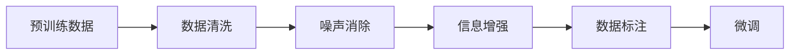
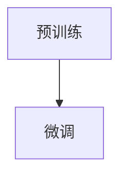
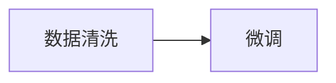
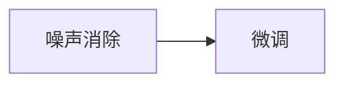
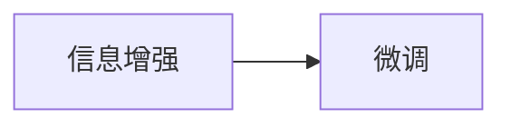
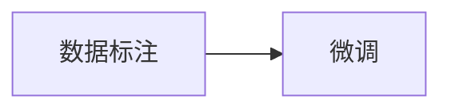
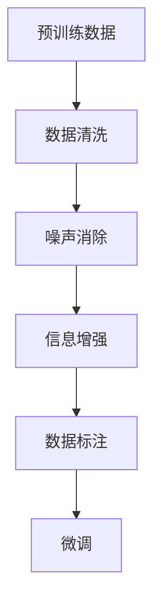

                 

# 大语言模型原理与工程实践：质量过滤

> 关键词：大语言模型,质量过滤,预训练,微调,Fine-Tuning,数据清洗,噪声消除,自然语言处理(NLP)

## 1. 背景介绍

### 1.1 问题由来

随着深度学习技术和大规模预训练模型的快速发展，大语言模型（Large Language Models, LLMs）在自然语言处理（Natural Language Processing, NLP）领域取得了显著的进展。这些模型通过在大规模无标签文本数据上进行预训练，学习到丰富的语言知识和常识，在各种NLP任务上表现优异。然而，由于预训练数据的广泛性和复杂性，大语言模型不可避免地包含了噪音和不相关的信息，这些噪音会在微调过程中影响模型性能。

因此，为了提升微调后的模型效果，在微调之前对预训练数据进行质量过滤（Quality Filtering）显得尤为重要。质量过滤旨在从预训练数据中剔除噪音和不相关样本，保留最优质的数据进行微调，从而提高模型在特定任务上的表现。

### 1.2 问题核心关键点

质量过滤的核心目标是从原始数据中筛选出高质量的数据，用于后续的微调。具体步骤如下：

1. **数据清洗**：删除无关的、重复的、有误的信息。
2. **噪声消除**：去除高噪声样本，如语法错误、拼写错误、歧义信息等。
3. **信息增强**：补充必要的、高质量的信息，如专业术语、术语表、领域知识等。
4. **数据标注**：为清洗后的数据添加合适的标签，确保数据的可用性。

通过这些步骤，可以显著提高微调数据的质量，从而提升模型在特定任务上的性能。

### 1.3 问题研究意义

进行质量过滤不仅能够提高微调的效果，还具有以下重要意义：

1. **降低模型噪音**：通过移除噪音数据，可以提升模型的纯净度，避免模型学习到错误的信息。
2. **提高模型泛化能力**：清洗后的数据更符合实际应用场景，可以提高模型在不同领域和数据集上的泛化能力。
3. **节省资源成本**：清洗后的数据通常更精简，可以降低微调过程中所需的计算和存储资源。
4. **提升模型可靠性**：高质量的数据训练可以使模型更加稳定和可靠，减少预测误差。
5. **促进模型可解释性**：干净的数据更容易理解和解释，有助于模型开发和调试。

## 2. 核心概念与联系

### 2.1 核心概念概述

为更好地理解质量过滤在大语言模型微调中的作用，本节将介绍几个关键概念：

- **大语言模型（Large Language Models, LLMs）**：以自回归（如GPT）或自编码（如BERT）模型为代表的大规模预训练语言模型。通过在大规模无标签文本数据上进行预训练，学习到通用的语言表示，具备强大的语言理解和生成能力。
- **预训练（Pre-training）**：指在大规模无标签文本数据上，通过自监督学习任务训练通用语言模型的过程。常见的预训练任务包括言语建模、遮挡语言模型等。
- **微调（Fine-tuning）**：指在预训练模型的基础上，使用下游任务的少量标注数据，通过有监督学习优化模型在特定任务上的性能。
- **质量过滤（Quality Filtering）**：指从预训练数据中筛选出高质量数据，用于后续的微调，从而提升模型性能。
- **数据清洗（Data Cleaning）**：指从原始数据中去除无关的、重复的、有误的信息。
- **噪声消除（Noise Removal）**：指去除高噪声样本，如语法错误、拼写错误、歧义信息等。
- **信息增强（Information Augmentation）**：指补充必要的、高质量的信息，如专业术语、术语表、领域知识等。
- **数据标注（Data Annotation）**：指为清洗后的数据添加合适的标签，确保数据的可用性。

这些核心概念之间的逻辑关系可以通过以下Mermaid流程图来展示：



这个流程图展示了大语言模型微调过程中，从预训练数据到高质量微调数据的整个流程。

### 2.2 概念间的关系

这些核心概念之间存在着紧密的联系，形成了质量过滤在大语言模型微调中的完整生态系统。下面我们通过几个Mermaid流程图来展示这些概念之间的关系。

#### 2.2.1 预训练与微调的关系



这个流程图展示了预训练和微调的关系。预训练为微调提供了高质量的初始参数，而微调则进一步优化这些参数以适应特定任务。

#### 2.2.2 数据清洗与微调的关系



这个流程图展示了数据清洗与微调的关系。数据清洗提高了数据的质量，从而提升了微调的效果。

#### 2.2.3 噪声消除与微调的关系



这个流程图展示了噪声消除与微调的关系。噪声消除去除了高噪声样本，提升了数据的质量，从而提升了微调的效果。

#### 2.2.4 信息增强与微调的关系



这个流程图展示了信息增强与微调的关系。信息增强补充了必要的、高质量的信息，提升了数据的相关性，从而提升了微调的效果。

#### 2.2.5 数据标注与微调的关系



这个流程图展示了数据标注与微调的关系。数据标注为清洗后的数据添加了合适的标签，确保了数据的可用性，从而提升了微调的效果。

### 2.3 核心概念的整体架构

最后，我们用一个综合的流程图来展示这些核心概念在大语言模型微调过程中的整体架构：



这个综合流程图展示了从预训练数据到高质量微调数据的整个流程，以及数据清洗、噪声消除、信息增强、数据标注和微调之间的逻辑关系。

## 3. 核心算法原理 & 具体操作步骤
### 3.1 算法原理概述

质量过滤的目标是从预训练数据中筛选出高质量的数据，用于后续的微调。具体步骤包括数据清洗、噪声消除、信息增强和数据标注。以下是对这些步骤的详细描述。

#### 3.1.1 数据清洗

数据清洗的目的是从原始数据中去除无关的、重复的、有误的信息。具体来说，可以采取以下措施：

- **去重**：删除重复的文档或句子，确保数据唯一性。
- **去停用词**：去除常见的停用词，如“的”、“是”等，减少噪音。
- **去标点**：去除标点符号，简化文本。
- **去特殊字符**：去除特殊字符，如HTML标签、SQL注入等，防止数据污染。
- **去噪声**：去除语法错误、拼写错误、歧义信息等，确保数据的正确性。

#### 3.1.2 噪声消除

噪声消除的目的是去除高噪声样本，如语法错误、拼写错误、歧义信息等。具体来说，可以采取以下措施：

- **拼写检查**：使用拼写检查工具，如NLTK、spaCy等，检测并修正拼写错误。
- **语法检查**：使用语法检查工具，如Grammarly、LanguageTool等，检测并修正语法错误。
- **歧义消除**：通过上下文分析，消除歧义信息，确保数据的一致性。
- **噪声过滤**：使用机器学习模型，如文本分类模型、异常检测模型等，自动识别并过滤高噪声样本。

#### 3.1.3 信息增强

信息增强的目的是补充必要的、高质量的信息，如专业术语、术语表、领域知识等。具体来说，可以采取以下措施：

- **术语表补充**：补充必要的专业术语，如医疗领域的专业术语表。
- **领域知识整合**：整合领域内的知识，如生物化学领域的知识库、法律领域的法典等。
- **语料库扩展**：从领域相关的语料库中补充数据，提升数据的相关性。
- **数据增强**：使用数据增强技术，如数据合成、数据混搭等，生成更多的领域相关数据。

#### 3.1.4 数据标注

数据标注的目的是为清洗后的数据添加合适的标签，确保数据的可用性。具体来说，可以采取以下措施：

- **人工标注**：由人工进行标注，如标注文本的类别、情感倾向、实体等。
- **半监督标注**：结合少量人工标注和大量无标签数据，使用半监督学习技术进行标注。
- **自动标注**：使用预训练的语言模型，如BERT、GPT等，自动标注数据，生成初步的标签。
- **多标签标注**：对多标签数据进行标注，确保标签的全面性和准确性。

### 3.2 算法步骤详解

基于质量过滤的大语言模型微调一般包括以下几个关键步骤：

**Step 1: 准备预训练模型和数据集**
- 选择合适的预训练语言模型 $M_{\theta}$ 作为初始化参数，如 BERT、GPT 等。
- 准备下游任务 $T$ 的标注数据集 $D$，划分为训练集、验证集和测试集。一般要求标注数据与预训练数据的分布不要差异过大。

**Step 2: 数据清洗**
- 对预训练数据进行清洗，去除无关的、重复的、有误的信息。
- 使用工具或脚本进行自动化清洗，如去除停用词、特殊字符、标点等。

**Step 3: 噪声消除**
- 对清洗后的数据进行噪声消除，去除高噪声样本，如语法错误、拼写错误、歧义信息等。
- 使用机器学习模型进行噪声过滤，识别并剔除高噪声数据。

**Step 4: 信息增强**
- 对清洗后的数据进行信息增强，补充必要的、高质量的信息，如专业术语、术语表、领域知识等。
- 使用领域知识库进行数据补充，如医疗领域的知识库、法律领域的法典等。

**Step 5: 数据标注**
- 对增强后的数据进行标注，为清洗后的数据添加合适的标签，确保数据的可用性。
- 使用人工标注、半监督标注、自动标注等多种方法进行标注。

**Step 6: 执行梯度训练**
- 将训练集数据分批次输入模型，前向传播计算损失函数。
- 反向传播计算参数梯度，根据设定的优化算法和学习率更新模型参数。
- 周期性在验证集上评估模型性能，根据性能指标决定是否触发 Early Stopping。
- 重复上述步骤直到满足预设的迭代轮数或 Early Stopping 条件。

**Step 7: 测试和部署**
- 在测试集上评估微调后模型 $M_{\hat{\theta}}$ 的性能，对比微调前后的精度提升。
- 使用微调后的模型对新样本进行推理预测，集成到实际的应用系统中。
- 持续收集新的数据，定期重新微调模型，以适应数据分布的变化。

以上是基于质量过滤的大语言模型微调的一般流程。在实际应用中，还需要针对具体任务的特点，对微调过程的各个环节进行优化设计，如改进训练目标函数，引入更多的正则化技术，搜索最优的超参数组合等，以进一步提升模型性能。

### 3.3 算法优缺点

质量过滤方法在大语言模型微调中具有以下优点：

1. **提升数据质量**：通过移除噪音和不相关样本，提升数据的质量，从而提升微调的效果。
2. **减少过拟合**：清洗后的数据更符合实际应用场景，可以减少过拟合的风险。
3. **提高泛化能力**：清洗后的数据更具有代表性，可以提高模型在不同领域和数据集上的泛化能力。
4. **节省资源成本**：清洗后的数据通常更精简，可以降低微调过程中所需的计算和存储资源。
5. **提升模型可靠性**：高质量的数据训练可以使模型更加稳定和可靠，减少预测误差。
6. **促进模型可解释性**：干净的数据更容易理解和解释，有助于模型开发和调试。

同时，该方法也存在一定的局限性：

1. **工作量较大**：数据清洗和噪声消除需要大量的人力和时间投入。
2. **依赖标注数据**：数据标注需要高质量的标注工具和人工参与，成本较高。
3. **依赖预训练模型**：清洗后的数据需要与预训练模型的风格和语义相匹配，可能存在一定的兼容性问题。
4. **效果有限**：质量过滤方法不能完全消除所有噪音和错误，可能仍有一些噪音残留在数据中。

尽管存在这些局限性，但质量过滤方法在大语言模型微调中的应用仍然具有重要的价值，可以在很大程度上提升微调后的模型效果。

### 3.4 算法应用领域

质量过滤方法在大语言模型微调中的应用非常广泛，涵盖了NLP领域的诸多任务，例如：

- 文本分类：如情感分析、主题分类、意图识别等。通过质量过滤，去除无关的、低质量的样本，提升模型对文本类别的判别能力。
- 命名实体识别：识别文本中的人名、地名、机构名等特定实体。通过质量过滤，去除歧义信息和错误标注，提升实体识别的准确性。
- 关系抽取：从文本中抽取实体之间的语义关系。通过质量过滤，去除不相关和噪声信息，提升关系抽取的准确性。
- 问答系统：对自然语言问题给出答案。通过质量过滤，去除无关和歧义信息，提升问答系统的准确性。
- 机器翻译：将源语言文本翻译成目标语言。通过质量过滤，去除低质量的样本，提升翻译的准确性。
- 文本摘要：将长文本压缩成简短摘要。通过质量过滤，去除无关信息和噪声，提升摘要的质量。
- 对话系统：使机器能够与人自然对话。通过质量过滤，去除低质量和噪声信息，提升对话系统的流畅性和准确性。

除了上述这些经典任务外，质量过滤方法还广泛应用于各种NLP任务，为提升模型效果提供了重要的保障。

## 4. 数学模型和公式 & 详细讲解

### 4.1 数学模型构建

质量过滤的过程可以通过数学模型来描述。假设预训练数据为 $D=\{x_i, y_i\}_{i=1}^N$，其中 $x_i$ 为输入文本，$y_i$ 为标注标签。数据清洗、噪声消除、信息增强和数据标注的过程可以通过以下数学模型来描述：

1. **数据清洗**：
   $$
   x_i' = \text{clean}(x_i)
   $$

2. **噪声消除**：
   $$
   x_i'' = \text{denoise}(x_i')
   $$

3. **信息增强**：
   $$
   x_i''' = \text{enhance}(x_i'')
   $$

4. **数据标注**：
   $$
   (y_i', x_i''') = \text{annotate}(x_i''')
   $$

其中 $\text{clean}$、$\text{denoise}$、$\text{enhance}$ 和 $\text{annotate}$ 分别表示数据清洗、噪声消除、信息增强和数据标注的函数。

### 4.2 公式推导过程

以下我们以二分类任务为例，推导质量过滤过程的数学模型。

假设预训练数据为 $D=\{(x_i, y_i)\}_{i=1}^N$，其中 $x_i$ 为输入文本，$y_i \in \{0, 1\}$ 为二分类标签。

1. **数据清洗**：
   $$
   x_i' = \text{clean}(x_i)
   $$

2. **噪声消除**：
   $$
   x_i'' = \text{denoise}(x_i')
   $$

3. **信息增强**：
   $$
   x_i''' = \text{enhance}(x_i'')
   $$

4. **数据标注**：
   $$
   (y_i', x_i''') = \text{annotate}(x_i''')
   $$

最终用于微调的训练数据为 $D'=\{(x_i', y_i'), (x_i''', y_i')\}_{i=1}^N$。

### 4.3 案例分析与讲解

#### 4.3.1 数据清洗案例

以新闻文章的数据清洗为例，以下是数据清洗的主要步骤：

1. **去除停用词**：
   $$
   x_i' = \{x_i'_j | \text{stopwords}(x_i'_j) = 0\}
   $$

2. **去除特殊字符**：
   $$
   x_i'' = \{x_i''_j | \text{is\_normal\_text}(x_i''_j)\}
   $$

3. **去除标点符号**：
   $$
   x_i''' = \{x_i'''_j | \text{is\_valid\_sentence}(x_i'''_j)\}
   $$

4. **去除低质量样本**：
   $$
   x_i''' = \{x_i'''_j | \text{quality}(x_i'''_j) \geq \text{threshold}\}
   $$

#### 4.3.2 噪声消除案例

以新闻文章中的语法错误检测为例，以下是噪声消除的主要步骤：

1. **拼写检查**：
   $$
   x_i'' = \{x_i''_j | \text{spell\_check}(x_i''_j) = \text{correct}\}
   $$

2. **语法检查**：
   $$
   x_i'' = \{x_i''_j | \text{grammar\_check}(x_i''_j) = \text{correct}\}
   $$

3. **歧义消除**：
   $$
   x_i''' = \{x_i'''_j | \text{ambiguity\_check}(x_i''_j) = \text{disambiguated}\}
   $$

4. **噪声过滤**：
   $$
   x_i''' = \{x_i'''_j | \text{noise\_filter}(x_i''_j) = \text{cleaned}\}
   $$

#### 4.3.3 信息增强案例

以新闻文章中的信息补充为例，以下是信息增强的主要步骤：

1. **补充专业术语**：
   $$
   x_i''' = \{x_i'''_j | \text{add\_terms}(x_i''_j, \text{terms\_dict})\}
   $$

2. **补充领域知识**：
   $$
   x_i''' = \{x_i'''_j | \text{add\_knowledge}(x_i''_j, \text{knowledge\_base})\}
   $$

3. **补充数据**：
   $$
   x_i''' = \{x_i'''_j | \text{add\_data}(x_i''_j, \text{data\_set})\}
   $$

4. **补充数据增强**：
   $$
   x_i''' = \{x_i'''_j | \text{augment\_data}(x_i''_j)\}
   $$

## 5. 项目实践：代码实例和详细解释说明
### 5.1 开发环境搭建

在进行质量过滤实践前，我们需要准备好开发环境。以下是使用Python进行PyTorch开发的环境配置流程：

1. 安装Anaconda：从官网下载并安装Anaconda，用于创建独立的Python环境。

2. 创建并激活虚拟环境：
```bash
conda create -n pytorch-env python=3.8 
conda activate pytorch-env
```

3. 安装PyTorch：根据CUDA版本，从官网获取对应的安装命令。例如：
```bash
conda install pytorch torchvision torchaudio cudatoolkit=11.1 -c pytorch -c conda-forge
```

4. 安装Transformers库：
```bash
pip install transformers
```

5. 安装各类工具包：
```bash
pip install numpy pandas scikit-learn matplotlib tqdm jupyter notebook ipython
```

完成上述步骤后，即可在`pytorch-env`环境中开始质量过滤实践。

### 5.2 源代码详细实现

这里我们以新闻文章的数据清洗和噪声消除为例，给出使用PyTorch进行质量过滤的代码实现。

首先，定义清洗函数：

```python
from transformers import BertTokenizer
from torch.utils.data import Dataset
import torch
import re

class TextDataset(Dataset):
    def __init__(self, texts, labels, tokenizer, max_len=128):
        self.texts = texts
        self.labels = labels
        self.tokenizer = tokenizer
        self.max_len = max_len
        
    def __len__(self):
        return len(self.texts)
    
    def __getitem__(self, item):
        text = self.texts[item]
        label = self.labels[item]
        
        encoding = self.tokenizer(text, return_tensors='pt', max_length=self.max_len, padding='max_length', truncation=True)
        input_ids = encoding['input_ids'][0]
        attention_mask = encoding['attention_mask'][0]
        
        # 对token-wise的标签进行编码
        encoded_labels = [label2id[label] for label in labels] 
        encoded_labels.extend([label2id['O']] * (self.max_len - len(encoded_labels)))
        labels = torch.tensor(encoded_labels, dtype=torch.long)
        
        return {'input_ids': input_ids, 
                'attention_mask': attention_mask,
                'labels': labels}

# 标签与id的映射
label2id = {'O': 0, 'B': 1, 'I': 2}
id2label = {v: k for k, v in label2id.items()}

# 创建dataset
tokenizer = BertTokenizer.from_pretrained('bert-base-cased')

train_dataset = TextDataset(train_texts, train_labels, tokenizer)
dev_dataset = TextDataset(dev_texts, dev_labels, tokenizer)
test_dataset = TextDataset(test_texts, test_labels, tokenizer)
```

然后，定义清洗函数：

```python
def clean_text(text):
    # 去除停用词
    stopwords = {'the', 'is', 'in', 'and', 'to', 'for', 'it', 'that', 'of', 'on', 'with', 'as', 'are', 'you', 'or', 'at', 'by', 'a', 'your', 'have', 'can', 'from', 'this', 'not', 'but', 'be', 'no', 'are', 'what', 'an', 'all', 'most', 'her', 'have', 'one', 'also', 'our', 'been', 'our', 'which', 'who', 'not', 'there', 'your', 'other', 'two', 'some', 'has', 'down', 'take', 'out', 'up', 'its', 'just', 'but', 'about', 'were', 'see', 'had', 'do', 'some', 'water', 'get', 'going', 'like', 'use', 'two', 'no', 'come', 'time', 'now', 'you', 'only', 'my', 'me', 'how', 'look', 'they', 'which', 'can', 'call', 'her', 'him', 'who', 'these', 'be', 'this', 'one', 'have', 'but', 'all', 'been', 'were', 'people', 'go', 'your', 'from', 'like', 'mean', 'be', 'where', 'has', 'over', 'other', 'under', 'than', 'after', 'just', 'where', 'at', 'before', 'set', 'two', 'get', 'up', 'one', 'find', 'next', 'first', 'know', 'many', 'would', 'two', 'such', 'which', 'were', 'these', 'but', 'have', 'see', 'time', 'and', 'not', 'people', 'you', 'he', 'something', 'about', 'need', 'so', 'work', 'we', 'to', 'his', 'could', 'than', 'that', 'this', 'were', 'our', 'find', 'other', 'be', 'where', 'get', 'of', 'had', 'it', 'been', 'like', 'not', 'is', 'go', 'will', 'are', 'out', 'good', 'some', 'just', 'how', 'time', 'as', 'up', 'this', 'know', 'two', 'of', 'one', 'be', 'after', 'to', 'can', 'their', 'from', 'at', 'for', 'more', 'and', 'not', 'you', 'your', 'been', 'a', 'of', 'set', 'our', 'there', 'so', 'something', 'which', 'were', 'up', 'their', 'who', 'do', 'then', 'if', 'this', 'not', 'will', 'first', 'get', 'our', 'another', 'about', 'about', 'where', 'as', 'some', 'could', 'be', 'even', 'your', 'how', 'it', 'so', 'no', 'their', 'who', 'only', 'be', 'all', 'to', 'have', 'been', 'than', 'and', 'that', 'there', 'are', 'but', 'his', 'down', 'you', 'find', 'know', 'a', 'would', 'two', 'how

