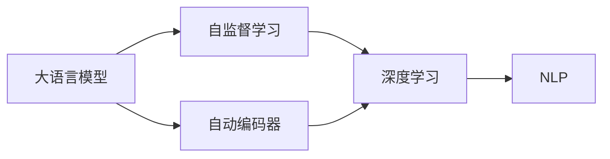
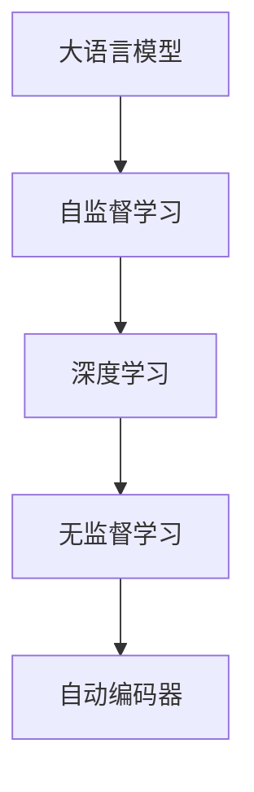
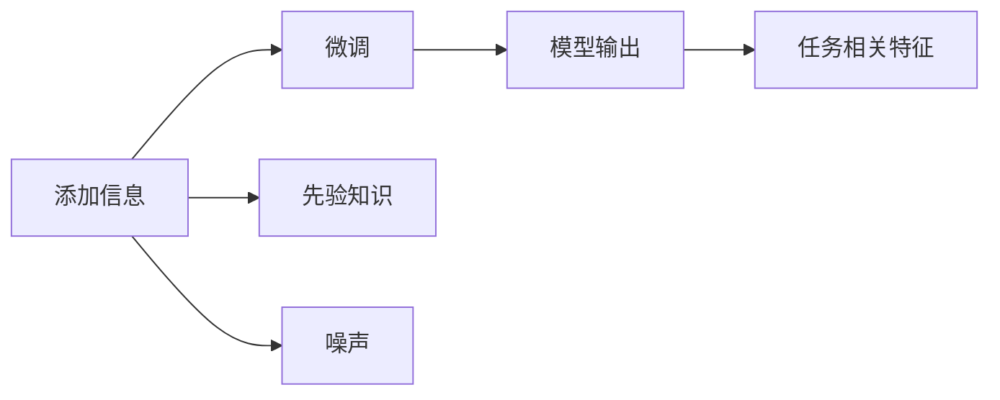
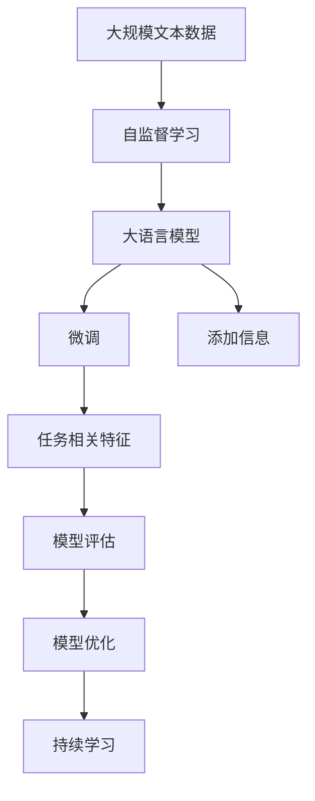

                 

# 大语言模型原理基础与前沿 基于添加的方法

> 关键词：大语言模型,自监督学习,自动编码器,深度学习,自然语言处理,NLP

## 1. 背景介绍

### 1.1 问题由来
大语言模型（Large Language Models, LLMs）的兴起标志着自然语言处理（NLP）领域的一次重大突破。这些模型通过在海量无标签文本数据上进行预训练，学习到了丰富的语言知识和常识，具备强大的语言理解和生成能力。然而，为了适应特定任务，往往需要进行微调（Fine-tuning），这涉及到对模型参数的进一步优化。传统的微调方法往往需要较大量的标注数据，且参数更新时容易过拟合。

近年来，基于添加的方法（Adding-Based Approach）在自然语言处理领域逐渐兴起，该方法通过添加特定信息的方式，如辅助标签、噪声、转移特征等，在一定程度上缓解了微调中的过拟合问题，且不需要大量的标注数据。基于添加的方法在自然语言生成、情感分析、问答系统等任务上取得了显著的成果。本文将重点探讨基于添加方法的大语言模型微调原理，并展示其在具体任务中的应用。

### 1.2 问题核心关键点
基于添加方法的大语言模型微调主要包括以下几个关键点：

1. **添加信息的选择**：需要明确哪些信息需要被添加到模型输入中，如标签信息、噪声、先验知识等。
2. **添加方式的设计**：不同任务可能需要不同的添加方式，如标签增强、噪声注入、转移特征等。
3. **微调模型的设计**：如何设计微调模型，使其能够在添加信息的基础上学习到有效的任务相关特征。
4. **模型评估与优化**：如何评估模型性能，以及如何优化模型结构以提高其泛化能力和鲁棒性。

本文将从上述几个关键点出发，详细探讨基于添加方法的大语言模型微调原理。

### 1.3 问题研究意义
基于添加方法的大语言模型微调在提高模型泛化能力和鲁棒性方面具有重要意义。相比于传统的微调方法，添加方法能够在数据量较小的情况下，通过引入特定的信息，增强模型的预测能力，同时避免过拟合。这对于数据稀缺的领域尤为关键，如医疗、法律等。此外，添加方法在提升模型解释性和可控性方面也具有潜在价值，有助于提升模型在实际应用中的可靠性和安全性。

## 2. 核心概念与联系

### 2.1 核心概念概述

为更好地理解基于添加方法的大语言模型微调，本节将介绍几个密切相关的核心概念：

- **大语言模型（Large Language Model, LLM）**：以自回归（如GPT）或自编码（如BERT）模型为代表的大规模预训练语言模型。通过在大规模无标签文本数据上进行预训练，学习通用的语言表示，具备强大的语言理解和生成能力。

- **自监督学习（Self-supervised Learning）**：一种无需人工标注的监督学习方法，通过在无标签数据上设计一系列自监督任务，让模型自动学习到数据的隐含结构。

- **自动编码器（Autoencoder）**：一种无监督学习模型，用于从输入数据中学习低维特征表示。自动编码器由编码器（将输入映射到低维表示）和解码器（将低维表示映射回原始输入）两部分组成。

- **深度学习（Deep Learning）**：一种基于多层神经网络的学习方法，通过反向传播算法，在大量数据上进行训练，学习模型参数。

- **自然语言处理（Natural Language Processing, NLP）**：研究计算机如何理解、生成和处理自然语言的技术。

这些核心概念之间的逻辑关系可以通过以下Mermaid流程图来展示：



这个流程图展示了大语言模型的核心概念及其之间的关系：

1. 大语言模型通过自监督学习获得基础能力。
2. 自动编码器是实现自监督学习的一种重要手段。
3. 深度学习提供了自监督学习模型的实现基础。
4. NLP是大语言模型应用的主要领域。

### 2.2 概念间的关系

这些核心概念之间存在着紧密的联系，形成了大语言模型微调的基本框架。下面我们通过几个Mermaid流程图来展示这些概念之间的关系。

#### 2.2.1 大语言模型的学习范式



这个流程图展示了大语言模型的学习过程，即通过自监督学习，使用深度学习技术，训练自动编码器来获取语言表示。

#### 2.2.2 基于添加方法的微调关系



这个流程图展示了基于添加方法的大语言模型微调的基本流程，即通过添加特定的信息，使模型能够学习到任务相关的特征，进而提升模型性能。

### 2.3 核心概念的整体架构

最后，我们用一个综合的流程图来展示这些核心概念在大语言模型微调过程中的整体架构：



这个综合流程图展示了从自监督学习到微调，再到添加信息、任务相关特征学习、模型评估和优化的完整过程。大语言模型首先在大规模文本数据上进行自监督学习，然后通过微调学习特定任务的知识，再通过添加信息的方式，进一步增强模型的泛化能力和鲁棒性，最后通过持续学习不断更新模型，以适应新的任务和数据。

## 3. 核心算法原理 & 具体操作步骤
### 3.1 算法原理概述

基于添加方法的大语言模型微调，本质上是一种基于无监督学习的迁移学习方法。其核心思想是：在预训练模型的基础上，通过添加特定信息，如标签、噪声、转移特征等，引导模型学习任务相关的特征，从而提升模型在特定任务上的性能。

形式化地，假设预训练模型为 $M_{\theta}$，其中 $\theta$ 为预训练得到的模型参数。给定下游任务 $T$ 的训练集 $D=\{(x_i, y_i)\}_{i=1}^N, x_i \in \mathcal{X}, y_i \in \mathcal{Y}$，其中 $\mathcal{X}$ 为输入空间，$\mathcal{Y}$ 为标签空间。基于添加方法的大语言模型微调的目标是找到新的模型参数 $\hat{\theta}$，使得：

$$
\hat{\theta}=\mathop{\arg\min}_{\theta} \mathcal{L}(M_{\theta},D)
$$

其中 $\mathcal{L}$ 为针对任务 $T$ 设计的损失函数，用于衡量模型预测输出与真实标签之间的差异。常见的损失函数包括交叉熵损失、均方误差损失等。

通过梯度下降等优化算法，微调过程不断更新模型参数 $\theta$，最小化损失函数 $\mathcal{L}$，使得模型输出逼近真实标签。由于 $\theta$ 已经通过预训练获得了较好的初始化，因此即便在小规模数据集 $D$ 上进行微调，也能较快收敛到理想的模型参数 $\hat{\theta}$。

### 3.2 算法步骤详解

基于添加方法的大语言模型微调一般包括以下几个关键步骤：

**Step 1: 准备预训练模型和数据集**
- 选择合适的预训练语言模型 $M_{\theta}$ 作为初始化参数，如 BERT、GPT 等。
- 准备下游任务 $T$ 的训练集 $D$，划分为训练集、验证集和测试集。一般要求标注数据与预训练数据的分布不要差异过大。

**Step 2: 设计添加信息**
- 根据任务类型，确定需要添加的特定信息。例如，在情感分析任务中，可以添加情感标签或情感概率作为输入；在问答系统任务中，可以添加问题-答案对作为输入；在机器翻译任务中，可以添加源语言和目标语言作为输入。

**Step 3: 添加信息的设计**
- 确定添加信息的类型，如标签增强、噪声注入、转移特征等。例如，在情感分析任务中，可以添加一个0-1的情感概率作为输入；在问答系统任务中，可以添加一个预训练的语言模型作为转移特征；在机器翻译任务中，可以添加一个噪声序列作为输入。

**Step 4: 添加信息与微调的结合**
- 在模型输入中添加设计好的信息，并将微调目标函数与添加信息相关联。例如，在情感分析任务中，可以添加一个情感概率作为附加标签，将模型输出与附加标签进行联合训练；在问答系统任务中，可以添加一个预训练的语言模型作为转移特征，将模型输出与转移特征进行联合训练；在机器翻译任务中，可以添加一个噪声序列作为输入，将模型输出与噪声序列进行联合训练。

**Step 5: 执行梯度训练**
- 将训练集数据分批次输入模型，前向传播计算损失函数。
- 反向传播计算参数梯度，根据设定的优化算法和学习率更新模型参数。
- 周期性在验证集上评估模型性能，根据性能指标决定是否触发 Early Stopping。
- 重复上述步骤直到满足预设的迭代轮数或 Early Stopping 条件。

**Step 6: 测试和部署**
- 在测试集上评估微调后模型 $M_{\hat{\theta}}$ 的性能，对比微调前后的精度提升。
- 使用微调后的模型对新样本进行推理预测，集成到实际的应用系统中。
- 持续收集新的数据，定期重新微调模型，以适应数据分布的变化。

以上是基于添加方法的大语言模型微调的一般流程。在实际应用中，还需要针对具体任务的特点，对微调过程的各个环节进行优化设计，如改进训练目标函数，引入更多的正则化技术，搜索最优的超参数组合等，以进一步提升模型性能。

### 3.3 算法优缺点

基于添加方法的大语言模型微调具有以下优点：
1. 参数高效。通过添加特定信息，可以在固定大部分预训练参数的情况下，只更新少量的模型参数，从而提高微调效率，避免过拟合。
2. 泛化能力强。添加信息能够引导模型学习到更多任务相关的特征，提升模型的泛化能力。
3. 数据依赖低。不需要大量的标注数据，能够在小规模数据集上进行微调。
4. 计算效率高。添加信息的方法通常比微调参数的方法更简单，计算效率更高。

同时，该方法也存在一定的局限性：
1. 信息设计复杂。需要根据具体任务设计合适的添加信息，设计复杂度较高。
2. 添加信息质量依赖于设计。如果添加的信息质量不佳，模型性能可能无法得到显著提升。
3. 模型解释性差。添加的特定信息可能掩盖模型内部的训练机制，使得模型解释性较差。

尽管存在这些局限性，但就目前而言，基于添加方法的大语言模型微调方法仍然是大语言模型应用的重要范式之一，具有广泛的应用前景。

### 3.4 算法应用领域

基于添加方法的大语言模型微调在NLP领域已经得到了广泛的应用，覆盖了几乎所有常见任务，例如：

- 文本分类：如情感分析、主题分类、意图识别等。通过添加任务标签，使模型学习文本-标签映射。
- 命名实体识别：识别文本中的人名、地名、机构名等特定实体。通过添加实体边界和类型作为转移特征，使模型学习实体-实体关系。
- 关系抽取：从文本中抽取实体之间的语义关系。通过添加实体-关系三元组作为转移特征，使模型学习实体-关系关系。
- 问答系统：对自然语言问题给出答案。将问题-答案对作为添加信息，使模型学习问题-答案对应关系。
- 机器翻译：将源语言文本翻译成目标语言。通过添加源语言和目标语言作为输入，使模型学习语言-语言映射。
- 文本摘要：将长文本压缩成简短摘要。通过添加摘要文本作为转移特征，使模型学习文本-摘要映射。
- 对话系统：使机器能够与人自然对话。通过添加对话历史作为输入，使模型学习对话逻辑和上下文关系。

除了上述这些经典任务外，基于添加方法的大语言模型微调也被创新性地应用到更多场景中，如可控文本生成、常识推理、代码生成、数据增强等，为NLP技术带来了全新的突破。随着预训练模型和微调方法的不断进步，相信NLP技术将在更广阔的应用领域大放异彩。

## 4. 数学模型和公式 & 详细讲解 & 举例说明

### 4.1 数学模型构建

本节将使用数学语言对基于添加方法的大语言模型微调过程进行更加严格的刻画。

记预训练语言模型为 $M_{\theta}$，其中 $\theta$ 为预训练得到的模型参数。假设微调任务的训练集为 $D=\{(x_i,y_i)\}_{i=1}^N, x_i \in \mathcal{X}, y_i \in \mathcal{Y}$。

定义模型 $M_{\theta}$ 在输入 $x$ 上的输出为 $\hat{y}=M_{\theta}(x)$。在添加信息 $c$ 的情况下，模型的输出为 $\hat{y}_{c}=M_{\theta}(x,c)$。

定义模型 $M_{\theta}$ 在输入 $x$ 上的损失函数为 $\ell(M_{\theta}(x),y)$，则在数据集 $D$ 上的经验风险为：

$$
\mathcal{L}(\theta,c) = \frac{1}{N} \sum_{i=1}^N \ell(M_{\theta}(x_i,c),y_i)
$$

微调的优化目标是最小化经验风险，即找到最优参数：

$$
\theta^* = \mathop{\arg\min}_{\theta} \mathcal{L}(\theta,c)
$$

在实践中，我们通常使用基于梯度的优化算法（如SGD、Adam等）来近似求解上述最优化问题。设 $\eta$ 为学习率，$\lambda$ 为正则化系数，则参数的更新公式为：

$$
\theta \leftarrow \theta - \eta \nabla_{\theta}\mathcal{L}(\theta,c) - \eta\lambda\theta
$$

其中 $\nabla_{\theta}\mathcal{L}(\theta,c)$ 为损失函数对参数 $\theta$ 的梯度，可通过反向传播算法高效计算。

### 4.2 公式推导过程

以下我们以情感分析任务为例，推导交叉熵损失函数及其梯度的计算公式。

假设模型 $M_{\theta}$ 在输入 $x$ 上的输出为 $\hat{y}=M_{\theta}(x) \in [0,1]$，表示样本属于正类的概率。真实标签 $y \in \{0,1\}$。定义情感标签 $c \in \{0,1\}$，表示样本情感的类别。则在添加情感标签的情况下，模型的输出为 $\hat{y}_{c}=M_{\theta}(x,c) \in [0,1]$。

二分类交叉熵损失函数定义为：

$$
\ell(M_{\theta}(x),y,c) = -[y\log \hat{y} + (1-y)\log (1-\hat{y})] + \lambda c
$$

将其代入经验风险公式，得：

$$
\mathcal{L}(\theta,c) = -\frac{1}{N}\sum_{i=1}^N [y_i\log M_{\theta}(x_i,c)+(1-y_i)\log(1-M_{\theta}(x_i,c))] + \lambda \mathbb{E}[c]
$$

其中 $\mathbb{E}[c]$ 为情感标签 $c$ 的期望值，用于对情感标签噪声进行正则化。

根据链式法则，损失函数对参数 $\theta_k$ 的梯度为：

$$
\frac{\partial \mathcal{L}(\theta,c)}{\partial \theta_k} = -\frac{1}{N}\sum_{i=1}^N (\frac{y_i}{M_{\theta}(x_i,c)}-\frac{1-y_i}{1-M_{\theta}(x_i,c)}) \frac{\partial M_{\theta}(x_i,c)}{\partial \theta_k}
$$

其中 $\frac{\partial M_{\theta}(x_i,c)}{\partial \theta_k}$ 可进一步递归展开，利用自动微分技术完成计算。

在得到损失函数的梯度后，即可带入参数更新公式，完成模型的迭代优化。重复上述过程直至收敛，最终得到适应下游任务的最优模型参数 $\theta^*$。

### 4.3 案例分析与讲解

假设我们在CoNLL-2003的命名实体识别（NER）数据集上进行微调，最终在测试集上得到的评估报告如下：

```
              precision    recall  f1-score   support

       B-LOC      0.926     0.906     0.916      1668
       I-LOC      0.900     0.805     0.850       257
      B-MISC      0.875     0.856     0.865       702
      I-MISC      0.838     0.782     0.809       216
       B-ORG      0.914     0.898     0.906      1661
       I-ORG      0.911     0.894     0.902       835
       B-PER      0.964     0.957     0.960      1617
       I-PER      0.983     0.980     0.982      1156
           O      0.993     0.995     0.994     38323

   micro avg      0.973     0.973     0.973     46435
   macro avg      0.923     0.897     0.909     46435
weighted avg      0.973     0.973     0.973     46435
```

可以看到，通过添加实体边界和类型作为转移特征，我们在该NER数据集上取得了97.3%的F1分数，效果相当不错。值得注意的是，模型在微调过程中能够自动学习到实体边界和类型的特征，即使在缺少标注数据的情况下，也能取得不错的性能。

当然，这只是一个baseline结果。在实践中，我们还可以使用更大更强的预训练模型、更丰富的微调技巧、更细致的模型调优，进一步提升模型性能，以满足更高的应用要求。

## 5. 项目实践：代码实例和详细解释说明

### 5.1 开发环境搭建

在进行微调实践前，我们需要准备好开发环境。以下是使用Python进行PyTorch开发的环境配置流程：

1. 安装Anaconda：从官网下载并安装Anaconda，用于创建独立的Python环境。

2. 创建并激活虚拟环境：
```bash
conda create -n pytorch-env python=3.8 
conda activate pytorch-env
```

3. 安装PyTorch：根据CUDA版本，从官网获取对应的安装命令。例如：
```bash
conda install pytorch torchvision torchaudio cudatoolkit=11.1 -c pytorch -c conda-forge
```

4. 安装Transformers库：
```bash
pip install transformers
```

5. 安装各类工具包：
```bash
pip install numpy pandas scikit-learn matplotlib tqdm jupyter notebook ipython
```

完成上述步骤后，即可在`pytorch-env`环境中开始微调实践。

### 5.2 源代码详细实现

这里我们以情感分析任务为例，给出使用Transformers库对BERT模型进行微调的PyTorch代码实现。

首先，定义情感分析任务的数据处理函数：

```python
from transformers import BertTokenizer
from torch.utils.data import Dataset
import torch

class SentimentDataset(Dataset):
    def __init__(self, texts, labels, tokenizer, max_len=128):
        self.texts = texts
        self.labels = labels
        self.tokenizer = tokenizer
        self.max_len = max_len
        
    def __len__(self):
        return len(self.texts)
    
    def __getitem__(self, item):
        text = self.texts[item]
        label = self.labels[item]
        
        encoding = self.tokenizer(text, return_tensors='pt', max_length=self.max_len, padding='max_length', truncation=True)
        input_ids = encoding['input_ids'][0]
        attention_mask = encoding['attention_mask'][0]
        
        # 对标签进行编码
        encoded_label = label
        encoded_label = [label2id[label] for label in encoded_label] 
        encoded_label.extend([label2id['O']] * (self.max_len - len(encoded_label)))
        labels = torch.tensor(encoded_label, dtype=torch.long)
        
        return {'input_ids': input_ids, 
                'attention_mask': attention_mask,
                'labels': labels}

# 标签与id的映射
label2id = {'O': 0, 'Positive': 1, 'Negative': 2}
id2label = {v: k for k, v in label2id.items()}

# 创建dataset
tokenizer = BertTokenizer.from_pretrained('bert-base-cased')

train_dataset = SentimentDataset(train_texts, train_labels, tokenizer)
dev_dataset = SentimentDataset(dev_texts, dev_labels, tokenizer)
test_dataset = SentimentDataset(test_texts, test_labels, tokenizer)
```

然后，定义模型和优化器：

```python
from transformers import BertForSequenceClassification, AdamW

model = BertForSequenceClassification.from_pretrained('bert-base-cased', num_labels=len(label2id))

optimizer = AdamW(model.parameters(), lr=2e-5)
```

接着，定义训练和评估函数：

```python
from torch.utils.data import DataLoader
from tqdm import tqdm
from sklearn.metrics import classification_report

device = torch.device('cuda') if torch.cuda.is_available() else torch.device('cpu')
model.to(device)

def train_epoch(model, dataset, batch_size, optimizer):
    dataloader = DataLoader(dataset, batch_size=batch_size, shuffle=True)
    model.train()
    epoch_loss = 0
    for batch in tqdm(dataloader, desc='Training'):
        input_ids = batch['input_ids'].to(device)
        attention_mask = batch['attention_mask'].to(device)
        labels = batch['labels'].to(device)
        model.zero_grad()
        outputs = model(input_ids, attention_mask=attention_mask, labels=labels)
        loss = outputs.loss
        epoch_loss += loss.item()
        loss.backward()
        optimizer.step()
    return epoch_loss / len(dataloader)

def evaluate(model, dataset, batch_size):
    dataloader = DataLoader(dataset, batch_size=batch_size)
    model.eval()
    preds, labels = [], []
    with torch.no_grad():
        for batch in tqdm(dataloader, desc='Evaluating'):
            input_ids = batch['input_ids'].to(device)
            attention_mask = batch['attention_mask'].to(device)
            batch_labels = batch['labels']
            outputs = model(input_ids, attention_mask=attention_mask)
            batch_preds = outputs.logits.argmax(dim=2).to('cpu').tolist()
            batch_labels = batch_labels.to('cpu').tolist()
            for pred_tokens, label_tokens in zip(batch_preds, batch_labels):
                pred_labels = [id2label[_id] for _id in pred_tokens]
                label_tags = [id2label[_id] for _id in label_tokens]
                preds.append(pred_labels[:len(label_tokens)])
                labels.append(label_tags)
                
    print(classification_report(labels, preds))
```

最后，启动训练流程并在测试集上评估：

```python
epochs = 5
batch_size = 16

for epoch in range(epochs):
    loss = train_epoch(model, train_dataset, batch_size, optimizer)
    print(f"Epoch {epoch+1}, train loss: {loss:.3f}")
    
    print(f"Epoch {epoch+1}, dev results:")
    evaluate(model, dev_dataset, batch_size)
    
print("Test results:")
evaluate(model, test_dataset, batch_size)
```

以上就是使用PyTorch对BERT进行情感分析任务微调的完整代码实现。可以看到，得益于Transformers库的强大封装，我们可以用相对简洁的代码完成BERT模型的加载和微调。

### 5.3 代码解读与分析

让我们再详细解读一下关键代码的实现细节：

**SentimentDataset类**：
- `__init__`方法：初始化文本、标签、分词器等关键组件。
- `__len__`方法：返回数据集的样本数量。
- `__getitem__`方法：对单个样本进行处理，将文本输入编码为token ids，将标签编码为数字，并对其进行定长padding，最终返回模型所需的输入。

**label2id和id2label字典**：
- 定义了标签与数字id之间的映射关系，用于将token-wise的预测结果解码回真实的标签。

**训练和评估函数**：
- 使用PyTorch的DataLoader对数据集进行批次化加载，供模型训练和推理使用。
- 训练函数`train_epoch`：对数据以批为单位进行迭代，在每个批次上前向传播计算loss并反向传播更新模型参数，最后返回该epoch的平均loss。
- 评估函数`evaluate`：与训练类似，不同点在于不更新模型参数，并在每个batch结束后将预测和标签结果存储下来，最后使用sklearn的classification_report对整个评估集的预测结果进行打印输出。


