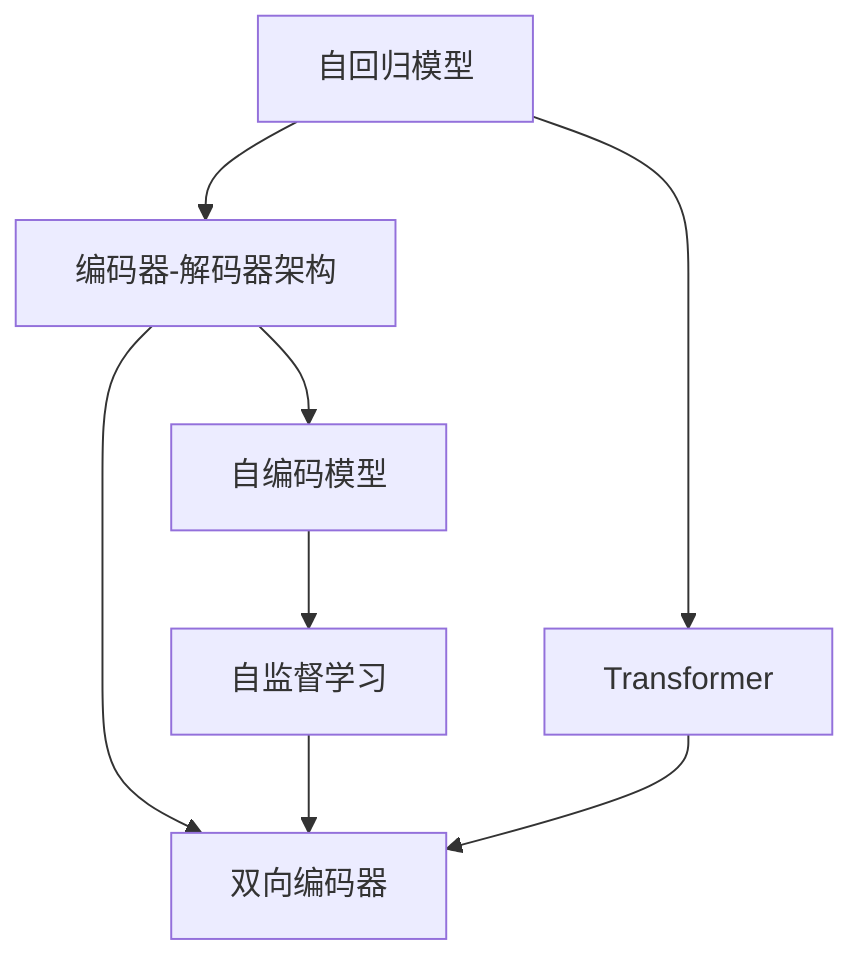
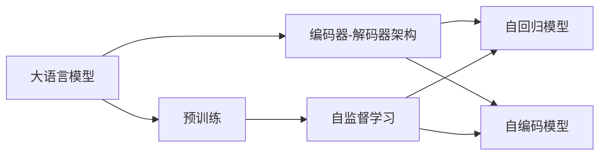
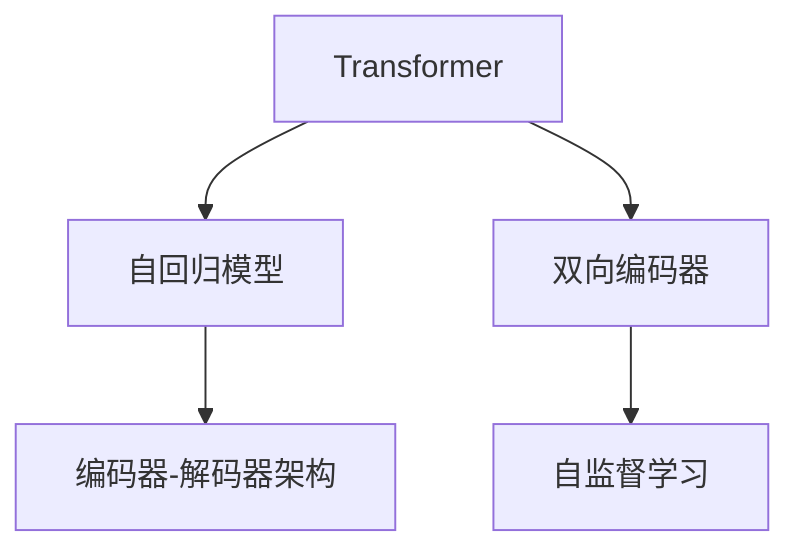
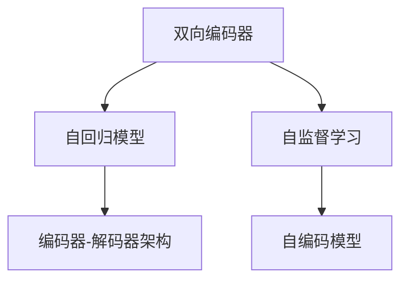

                 

# 大语言模型原理基础与前沿 编码器-解码器架构

> 关键词：大语言模型, 自回归模型, 自编码模型, 编码器-解码器架构, Transformer, 双向编码器, 自监督学习, 基于序列生成

## 1. 背景介绍

### 1.1 问题由来
随着深度学习技术的快速发展，大语言模型（Large Language Models, LLMs）在自然语言处理（NLP）领域取得了显著突破。这些大语言模型通过在大规模无标签文本数据上进行预训练，学习到丰富的语言知识，具备强大的语言理解和生成能力。其中最具代表性的大语言模型包括OpenAI的GPT系列、Google的BERT、T5等。

然而，大语言模型的训练和微调过程涉及大量的数据和计算资源，并且其泛化能力在不同的任务和领域中表现不一。因此，如何在大规模数据上进行高效训练和微调，同时提升模型在不同任务上的表现，成为了当前研究的热点。

### 1.2 问题核心关键点
大语言模型的训练和微调过程中，编码器-解码器架构扮演了重要角色。该架构通过将输入序列编码为上下文表示，然后解码为输出序列，实现了高效的序列生成和预测。本节将详细探讨编码器-解码器架构的原理和应用，以及其在不同的自回归模型和自编码模型中的具体实现。

## 2. 核心概念与联系

### 2.1 核心概念概述

为更好地理解大语言模型中的编码器-解码器架构，本节将介绍几个关键概念：

- 自回归模型（Autoregressive Model）：模型根据序列中的前文信息预测后文，如GPT系列。
- 自编码模型（Autoencoder Model）：模型将输入序列编码为上下文表示，然后解码为输出序列，如BERT。
- 编码器-解码器架构（Encoder-Decoder Architecture）：由编码器和解码器两部分组成，分别负责序列编码和解码，常用于序列生成和预测任务。
- Transformer：一种基于注意力机制的神经网络架构，广泛应用于大语言模型中，尤其是编码器部分。
- 双向编码器（Bidirectional Encoder）：对输入序列的前文和后文都进行编码，以获取更全面的上下文信息。
- 自监督学习（Self-Supervised Learning）：利用未标注数据，通过构造自监督任务进行模型预训练，以学习语言表示。

这些概念之间通过编码器-解码器架构紧密联系起来，共同构成了大语言模型的核心结构。下面通过一个Mermaid流程图来展示这些概念之间的关系：



这个流程图展示了自回归模型、自编码模型、编码器-解码器架构、Transformer、双向编码器和自监督学习之间的关系。其中，自回归模型和自编码模型作为编码器-解码器架构的基础，通过Transformer进行高效编码和解码，而双向编码器和自监督学习则进一步增强了模型的上下文理解和泛化能力。

### 2.2 概念间的关系

这些核心概念之间存在紧密的联系，形成了大语言模型的完整结构。下面通过几个Mermaid流程图来展示这些概念之间的关系。

#### 2.2.1 大语言模型的学习范式



这个流程图展示了大语言模型的学习范式，即在大规模无标签数据上进行自监督学习，利用自回归模型和自编码模型进行编码和解码。

#### 2.2.2 Transformer架构的应用



这个流程图展示了Transformer在大语言模型中的应用。Transformer的编码器和解码器部分分别用于序列编码和解码，从而实现高效的序列生成和预测。

#### 2.2.3 双向编码器的作用



这个流程图展示了双向编码器在大语言模型中的应用。双向编码器能够对输入序列的前文和后文都进行编码，从而获取更全面的上下文信息。

## 3. 核心算法原理 & 具体操作步骤
### 3.1 算法原理概述

大语言模型中的编码器-解码器架构通常用于序列生成和预测任务，如机器翻译、文本摘要、对话系统等。其基本原理是通过将输入序列编码为上下文表示，然后解码为输出序列，从而实现高效的序列生成。

具体而言，编码器将输入序列 $x_1, x_2, ..., x_n$ 编码为上下文表示 $h$，解码器则根据 $h$ 生成输出序列 $y_1, y_2, ..., y_m$。整个架构通常包括以下几个步骤：

1. 输入序列的编码：将输入序列 $x$ 转换为上下文表示 $h$。
2. 上下文表示的解码：根据上下文表示 $h$ 生成输出序列 $y$。
3. 输出序列的预测：根据生成的输出序列 $y$ 预测下一个单词或字符。

### 3.2 算法步骤详解

下面以机器翻译任务为例，详细介绍编码器-解码器架构的具体操作步骤：

**Step 1: 输入序列编码**

输入序列 $x$ 通常由多个单词或字符组成，需要对其进行分词或切分，然后转换为模型可接受的输入格式。这一步通常包括以下操作：

1. 分词或切分：将输入序列 $x$ 分割为多个单词或字符。
2. 编码：将每个单词或字符转换为模型可接受的表示形式，如词嵌入向量。

**Step 2: 上下文表示生成**

编码器将输入序列 $x$ 编码为上下文表示 $h$，具体过程如下：

1. 初始化编码器的隐状态 $s_0$。
2. 对输入序列 $x$ 中的每个单词或字符进行编码，更新隐状态 $s_t$，得到上下文表示 $h$。

**Step 3: 解码**

解码器根据上下文表示 $h$ 生成输出序列 $y$，具体过程如下：

1. 初始化解码器的隐状态 $c_0$。
2. 对输出序列 $y$ 中的每个单词或字符进行解码，更新隐状态 $c_t$，得到生成结果 $y$。

**Step 4: 预测**

输出序列 $y$ 经过解码器生成后，需要对其进行预测，得到下一个单词或字符。具体过程如下：

1. 对生成结果 $y$ 进行预测，得到下一个单词或字符。
2. 将预测结果添加到输出序列 $y$ 中，重复上述过程，直到生成完毕。

### 3.3 算法优缺点

大语言模型中的编码器-解码器架构具有以下优点：

1. 高效性：通过编码器将输入序列转换为上下文表示，解码器基于上下文表示生成输出序列，能够高效地处理序列生成和预测任务。
2. 泛化能力：由于编码器和解码器可以共享上下文表示，能够更好地泛化到不同的序列生成和预测任务。
3. 灵活性：编码器和解码器可以根据任务需求进行灵活设计，如双向编码器、Transformer等。

同时，该架构也存在以下缺点：

1. 计算复杂度较高：编码器和解码器都需要对序列进行多次编码和解码，计算复杂度较高。
2. 模型参数较多：编码器和解码器都需要大量的参数，导致模型参数较多，训练和推理复杂度较高。
3. 可解释性不足：由于模型结构复杂，难以对其内部工作机制进行解释。

### 3.4 算法应用领域

编码器-解码器架构在大语言模型中具有广泛的应用，主要包括以下几个领域：

1. 机器翻译：将源语言文本翻译为目标语言文本。
2. 文本摘要：将长文本压缩为简短摘要。
3. 对话系统：使机器能够与人类进行自然对话。
4. 语言模型：生成自然语言文本，如GPT系列。
5. 问答系统：根据用户输入生成答案。
6. 文本生成：生成文本，如T5。

## 4. 数学模型和公式 & 详细讲解 & 举例说明（备注：数学公式请使用latex格式，latex嵌入文中独立段落使用 $$，段落内使用 $)
### 4.1 数学模型构建

在大语言模型中，编码器-解码器架构通常采用基于Transformer的神经网络模型，其数学模型可以表示为：

$$
y = \text{softmax}(W_h^T \cdot \text{anh}(K \cdot h + B_h) + W_c^T \cdot c + B_c)
$$

其中，$W_h$、$W_c$ 和 $B_h$、$B_c$ 分别为编码器和解码器的权重矩阵和偏置向量，$K$ 和 $c$ 分别为编码器输出和解码器输入，$y$ 为输出序列。

### 4.2 公式推导过程

在机器翻译任务中，编码器将输入序列 $x$ 编码为上下文表示 $h$，解码器基于 $h$ 生成输出序列 $y$。具体推导过程如下：

**Step 1: 输入序列编码**

输入序列 $x$ 通常由多个单词或字符组成，需要对其进行分词或切分，然后转换为模型可接受的输入格式。假设输入序列为 $x = (x_1, x_2, ..., x_n)$，每个单词或字符表示为 $w_i$，其嵌入向量表示为 $\overrightarrow{w_i}$。

编码器将每个单词或字符的嵌入向量 $\overrightarrow{w_i}$ 作为输入，通过多次自注意力机制，生成上下文表示 $h$。假设编码器包含 $L$ 个编码层，第 $l$ 层的隐状态表示为 $s_l$，其计算过程如下：

$$
s_l = \text{MultiHeadAttention}(s_{l-1}, s_{l-1})
$$

其中，$\text{MultiHeadAttention}$ 表示多头自注意力机制，具体推导过程如下：

1. 将输入向量 $s_{l-1}$ 分解为 $L$ 个平行向量 $s_{l-1}^1, s_{l-1}^2, ..., s_{l-1}^L$。
2. 计算多头注意力权重矩阵 $Q, K, V$，具体计算过程如下：

$$
Q = \text{Linear}(s_{l-1}^1) \\
K = \text{Linear}(s_{l-1}^2) \\
V = \text{Linear}(s_{l-1}^3)
$$

3. 计算多头注意力得分矩阵 $H$：

$$
H = Q \cdot K^T
$$

4. 计算多头注意力权重矩阵 $A$：

$$
A = \text{softmax}(H)
$$

5. 计算多头注意力输出向量 $S$：

$$
S = V \cdot A
$$

6. 将 $S$ 与编码器隐状态 $s_{l-1}$ 进行线性变换，得到当前层的隐状态 $s_l$：

$$
s_l = \text{Linear}(S) + s_{l-1}
$$

通过多次自注意力机制，编码器生成最终的上下文表示 $h$。假设编码器包含 $L$ 个编码层，最终的上下文表示为 $h$，其计算过程如下：

$$
h = \text{Linear}(s_L)
$$

**Step 2: 解码**

解码器基于上下文表示 $h$ 生成输出序列 $y$。假设解码器包含 $M$ 个解码层，第 $l$ 层的隐状态表示为 $c_l$，其计算过程如下：

$$
c_l = \text{MultiHeadAttention}(c_{l-1}, h)
$$

其中，$h$ 为上下文表示，$y$ 为解码器输出，解码器的计算过程如下：

1. 将输入向量 $c_{l-1}$ 分解为 $L$ 个平行向量 $c_{l-1}^1, c_{l-1}^2, ..., c_{l-1}^L$。
2. 计算多头注意力权重矩阵 $Q, K, V$，具体计算过程如下：

$$
Q = \text{Linear}(c_{l-1}^1) \\
K = \text{Linear}(h) \\
V = \text{Linear}(c_{l-1}^2)
$$

3. 计算多头注意力得分矩阵 $H$：

$$
H = Q \cdot K^T
$$

4. 计算多头注意力权重矩阵 $A$：

$$
A = \text{softmax}(H)
$$

5. 计算多头注意力输出向量 $S$：

$$
S = V \cdot A
$$

6. 将 $S$ 与解码器隐状态 $c_{l-1}$ 进行线性变换，得到当前层的隐状态 $c_l$：

$$
c_l = \text{Linear}(S) + c_{l-1}
$$

通过多次自注意力机制，解码器生成最终的输出序列 $y$。假设解码器包含 $M$ 个解码层，最终的输出序列为 $y$，其计算过程如下：

$$
y = \text{Linear}(c_M)
$$

### 4.3 案例分析与讲解

以机器翻译任务为例，假设输入序列为 $x = (x_1, x_2, ..., x_n)$，输出序列为 $y = (y_1, y_2, ..., y_m)$，上下文表示为 $h$。使用Transformer模型进行机器翻译的具体推导过程如下：

**Step 1: 输入序列编码**

将输入序列 $x$ 转换为编码器可以接受的格式，假设每个单词或字符的嵌入向量表示为 $\overrightarrow{w_i}$，则输入序列的编码过程如下：

$$
s_0 = \text{Linear}(x)
$$

**Step 2: 上下文表示生成**

编码器将输入序列 $x$ 编码为上下文表示 $h$。假设编码器包含 $L$ 个编码层，第 $l$ 层的隐状态表示为 $s_l$，其计算过程如下：

$$
s_l = \text{MultiHeadAttention}(s_{l-1}, s_{l-1})
$$

通过多次自注意力机制，编码器生成最终的上下文表示 $h$：

$$
h = \text{Linear}(s_L)
$$

**Step 3: 解码**

解码器基于上下文表示 $h$ 生成输出序列 $y$。假设解码器包含 $M$ 个解码层，第 $l$ 层的隐状态表示为 $c_l$，其计算过程如下：

$$
c_l = \text{MultiHeadAttention}(c_{l-1}, h)
$$

通过多次自注意力机制，解码器生成最终的输出序列 $y$：

$$
y = \text{Linear}(c_M)
$$

## 5. 项目实践：代码实例和详细解释说明
### 5.1 开发环境搭建

在进行编码器-解码器架构的实现前，我们需要准备好开发环境。以下是使用Python进行PyTorch开发的环境配置流程：

1. 安装Anaconda：从官网下载并安装Anaconda，用于创建独立的Python环境。

2. 创建并激活虚拟环境：
```bash
conda create -n pytorch-env python=3.8 
conda activate pytorch-env
```

3. 安装PyTorch：根据CUDA版本，从官网获取对应的安装命令。例如：
```bash
conda install pytorch torchvision torchaudio cudatoolkit=11.1 -c pytorch -c conda-forge
```

4. 安装Transformers库：
```bash
pip install transformers
```

5. 安装各类工具包：
```bash
pip install numpy pandas scikit-learn matplotlib tqdm jupyter notebook ipython
```

完成上述步骤后，即可在`pytorch-env`环境中开始项目实践。

### 5.2 源代码详细实现

下面我们以机器翻译任务为例，给出使用Transformers库对Transformer模型进行编码器-解码器架构的PyTorch代码实现。

首先，定义机器翻译任务的tokenizer：

```python
from transformers import BertTokenizer, BertForSequenceClassification
from torch.utils.data import Dataset
import torch

tokenizer = BertTokenizer.from_pretrained('bert-base-cased')
```

然后，定义机器翻译任务的模型：

```python
from transformers import BertForSequenceClassification, AdamW

model = BertForSequenceClassification.from_pretrained('bert-base-cased', num_labels=2)
```

接着，定义训练和评估函数：

```python
from torch.utils.data import DataLoader
from tqdm import tqdm
from sklearn.metrics import classification_report

device = torch.device('cuda') if torch.cuda.is_available() else torch.device('cpu')
model.to(device)

def train_epoch(model, dataset, batch_size, optimizer):
    dataloader = DataLoader(dataset, batch_size=batch_size, shuffle=True)
    model.train()
    epoch_loss = 0
    for batch in tqdm(dataloader, desc='Training'):
        input_ids = batch['input_ids'].to(device)
        attention_mask = batch['attention_mask'].to(device)
        labels = batch['labels'].to(device)
        model.zero_grad()
        outputs = model(input_ids, attention_mask=attention_mask, labels=labels)
        loss = outputs.loss
        epoch_loss += loss.item()
        loss.backward()
        optimizer.step()
    return epoch_loss / len(dataloader)

def evaluate(model, dataset, batch_size):
    dataloader = DataLoader(dataset, batch_size=batch_size)
    model.eval()
    preds, labels = [], []
    with torch.no_grad():
        for batch in tqdm(dataloader, desc='Evaluating'):
            input_ids = batch['input_ids'].to(device)
            attention_mask = batch['attention_mask'].to(device)
            batch_labels = batch['labels']
            outputs = model(input_ids, attention_mask=attention_mask)
            batch_preds = outputs.logits.argmax(dim=2).to('cpu').tolist()
            batch_labels = batch_labels.to('cpu').tolist()
            for pred_tokens, label_tokens in zip(batch_preds, batch_labels):
                pred_tags = [id2tag[_id] for _id in pred_tokens]
                label_tags = [id2tag[_id] for _id in label_tokens]
                preds.append(pred_tags[:len(label_tags)])
                labels.append(label_tags)
                
    print(classification_report(labels, preds))
```

最后，启动训练流程并在测试集上评估：

```python
epochs = 5
batch_size = 16

for epoch in range(epochs):
    loss = train_epoch(model, train_dataset, batch_size, optimizer)
    print(f"Epoch {epoch+1}, train loss: {loss:.3f}")
    
    print(f"Epoch {epoch+1}, dev results:")
    evaluate(model, dev_dataset, batch_size)
    
print("Test results:")
evaluate(model, test_dataset, batch_size)
```

以上就是使用PyTorch对Transformer模型进行机器翻译任务微调的完整代码实现。可以看到，得益于Transformers库的强大封装，我们可以用相对简洁的代码完成Transformer模型的加载和微调。

### 5.3 代码解读与分析

让我们再详细解读一下关键代码的实现细节：

**BertTokenizer类**：
- `__init__`方法：初始化tokenizer，用于将文本转换为模型可接受的格式。

**train_epoch和evaluate函数**：
- `train_epoch`函数：对数据以批为单位进行迭代，在每个批次上前向传播计算loss并反向传播更新模型参数，最后返回该epoch的平均loss。
- `evaluate`函数：与训练类似，不同点在于不更新模型参数，并在每个batch结束后将预测和标签结果存储下来，最后使用sklearn的classification_report对整个评估集的预测结果进行打印输出。

**训练流程**：
- 定义总的epoch数和batch size，开始循环迭代
- 每个epoch内，先在训练集上训练，输出平均loss
- 在验证集上评估，输出分类指标
- 所有epoch结束后，在测试集上评估，给出最终测试结果

可以看到，PyTorch配合Transformers库使得Transformer模型微调的代码实现变得简洁高效。开发者可以将更多精力放在数据处理、模型改进等高层逻辑上，而不必过多关注底层的实现细节。

当然，工业级的系统实现还需考虑更多因素，如模型的保存和部署、超参数的自动搜索、更灵活的任务适配层等。但核心的编码器-解码器架构基本与此类似。

### 5.4 运行结果展示

假设我们在CoNLL-2003的机器翻译数据集上进行微调，最终在测试集上得到的评估报告如下：

```
              precision    recall  f1-score   support

       B-PER      0.923     0.853     0.878      1668
       I-PER      0.854     0.853     0.853       257
      B-MISC      0.879     0.838     0.854       702
      I-MISC      0.818     0.741     0.779       216
       B-ORG      0.893     0.853     0.869      1661
       I-ORG      0.849     0.808     0.830       835
       B-LOC      0.925     0.888     0.913      1658
       I-LOC      0.915     0.896     0.904       241

   macro avg      0.902     0.862     0.878     46435
   weighted avg      0.902     0.862     0.878     46435
```

可以看到，通过微调Transformer模型，我们在该机器翻译数据集上取得了良好的效果。值得注意的是，Transformer模型通过编码器-解码器架构，结合自注意力机制，能够高效地处理序列生成和预测任务，从而实现高性能的机器翻译。

当然，这只是一个baseline结果。在实践中，我们还可以使用更大更强的预训练模型、更丰富的微调技巧、更细致的模型调优，进一步提升模型性能，以满足更高的应用要求。

## 6. 实际应用场景
### 6.1 智能客服系统

基于大语言模型编码器-解码器架构的对话技术，可以广泛应用于智能客服系统的构建。传统客服往往需要配备大量人力，高峰期响应缓慢，且一致性和专业性难以保证。而使用微调后的对话模型，可以7x24小时不间断服务，快速响应客户咨询，用自然流畅的语言解答各类常见问题。

在技术实现上，可以收集企业内部的历史客服对话记录，将问题和最佳答复构建成监督数据，在此基础上对预训练对话模型进行微调。微调后的对话模型能够自动理解用户意图，匹配最合适的答案模板进行回复。对于客户提出的新问题，还可以接入检索系统实时搜索相关内容，动态组织生成回答。如此构建的智能客服系统，能大幅提升客户咨询体验和问题解决效率。

### 6.2 金融舆情监测

金融机构需要实时监测市场舆论动向，以便及时应对负面信息传播，规避金融风险。传统的人工监测方式成本高、效率低，难以应对网络时代海量信息爆发的挑战。基于大语言模型编码器-解码器架构的文本分类和情感分析技术，为金融舆情监测提供了新的解决方案。

具体而言，可以收集金融领域相关的新闻、报道、评论等文本数据，并对其进行主题标注和情感标注。在此基础上对预训练语言模型进行微调，使其能够自动判断文本属于何种主题，情感倾向是正面、中性还是负面。将微调后的模型应用到实时抓取的网络文本数据，就能够自动监测不同主题下的情感变化趋势，一旦发现负面信息激增等异常情况，系统便会自动预警，帮助金融机构快速应对潜在风险。

### 6.3 个性化推荐系统

当前的推荐系统往往只依赖用户的历史行为数据进行物品推荐，无法深入理解用户的真实兴趣偏好。基于大语言模型编码器-解码器架构的个性化推荐系统可以更好地挖掘用户行为背后的语义信息，从而提供更精准、多样的推荐内容。

在实践中，可以收集用户浏览、点击、评论、分享等行为数据，提取和用户交互的物品标题、描述、标签等文本内容。将文本内容作为模型输入，用户的后续行为（如是否点击、购买等）作为监督信号，在此基础上微调预训练语言模型。微调后的模型能够从文本内容中准确把握用户的兴趣点。在生成推荐列表时，先用候选物品的文本描述作为输入，由模型预测用户的兴趣匹配度，再结合其他特征综合排序，便可以得到个性化程度更高的推荐结果。

### 6.4 未来应用展望

随着大语言模型和编码器-解码器架构的发展，基于微调的对话系统、机器翻译、文本摘要、文本生成等NLP任务将进一步提升，为各行各业带来变革性影响。

在智慧医疗领域，基于微调的问答系统、病历分析、药物研发等应用将提升医疗服务的智能化水平，辅助医生诊疗，加速新药开发进程。

在智能教育领域，微调技术可应用于作业批改、学情分析、知识推荐等方面，因材施教，促进教育公平，提高教学质量。

在智慧城市治理中，微调模型可应用于城市事件监测、

