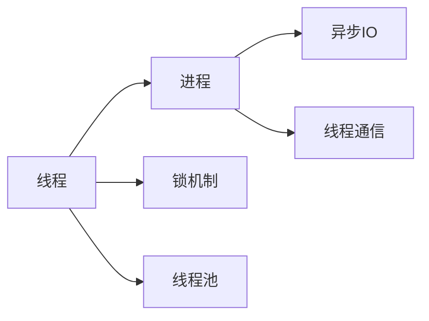
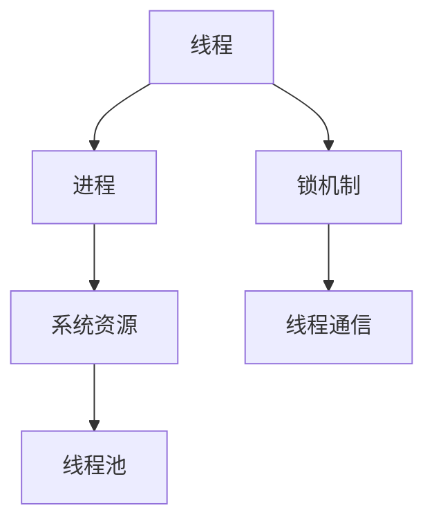
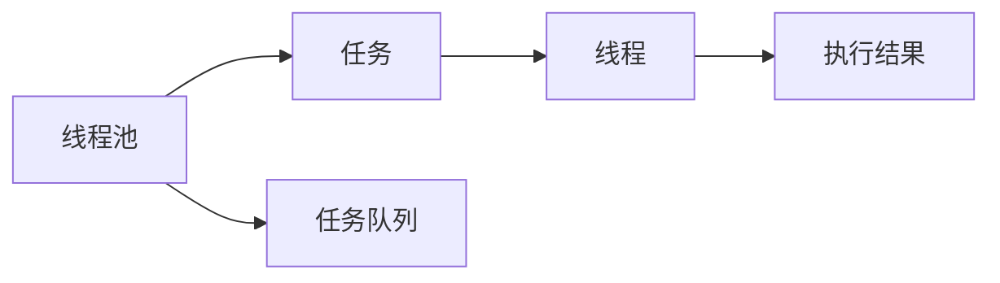
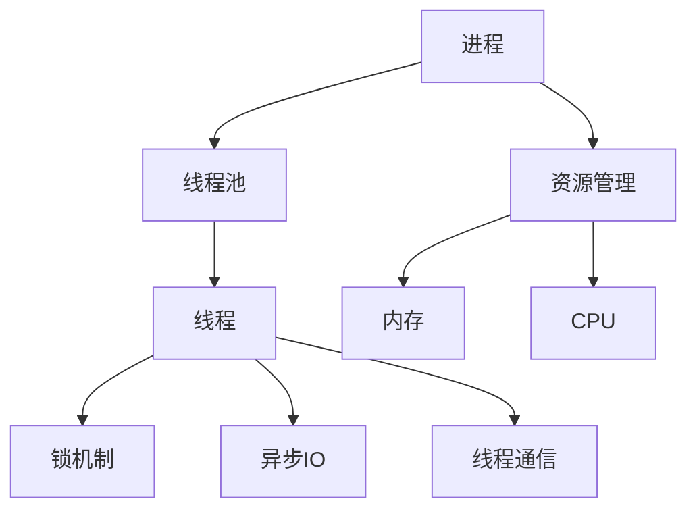

                 

# 大语言模型应用指南：线程

> 关键词：大语言模型, 多线程编程, 线程安全, 锁机制, 线程池, 异步IO, 线程通信, 性能优化, 并发编程

## 1. 背景介绍

### 1.1 问题由来
现代计算机系统常常面对同时处理多个任务的需求，这使得多线程编程成为必要。然而，多线程编程不仅复杂，而且错误处理不当还会导致性能问题、死锁和数据竞争等严重问题。因此，学习如何使用大语言模型（如Python的Concurrent.futures和asyncio库）进行线程编程，对于提高程序的性能和稳定性至关重要。

### 1.2 问题核心关键点
现代编程语言通常支持多种并发编程模型，如多线程、多进程、协程等。多线程编程（也称为并发编程）可以充分利用多核处理器，提升程序的响应速度和吞吐量。但是，多线程编程同样面临以下挑战：
1. 线程安全问题：多线程并发访问共享资源时，可能引发数据竞争和死锁问题。
2. 性能优化问题：线程的创建、销毁和上下文切换等操作，增加了程序的复杂度和开销。
3. 并发通信问题：线程间的数据传递和同步，需要精心设计通信协议。

要解决这些挑战，需要深入理解线程编程的原理和最佳实践，并利用现代大语言模型的线程工具，如Python的Concurrent.futures和asyncio库，实现高效并发编程。

### 1.3 问题研究意义
学习大语言模型的线程编程，可以显著提高程序的性能和稳定性。在实际应用中，线程编程广泛应用于服务器端应用、网络通信、图像处理、科学计算等领域。掌握线程编程技巧，能够开发出更高效、更可靠的程序，满足高性能和高并发的需求。

## 2. 核心概念与联系

### 2.1 核心概念概述
为了更好地理解线程编程，下面将介绍几个核心概念：

- **线程（Thread）**：操作系统分配的执行单元，可以同时执行多个任务。
- **进程（Process）**：应用程序的运行实例，包含一个或多个线程。
- **锁机制（Locking Mechanism）**：用于线程同步和互斥的机制，确保同一时刻只有一个线程可以访问共享资源。
- **线程池（Thread Pool）**：预先创建的线程集合，可重复使用，用于管理线程的生命周期和任务调度。
- **异步IO（Asynchronous IO）**：非阻塞IO操作，提高程序的响应性和并发处理能力。
- **线程通信（Thread Communication）**：线程间的数据传递和同步机制，包括管道、信号量、事件等。

这些概念之间的逻辑关系可以通过以下Mermaid流程图来展示：



这个流程图展示了大语言模型线程编程的基本框架，各个概念之间相互依赖，共同支撑了多线程并发编程。

### 2.2 概念间的关系

这些核心概念之间存在着紧密的联系，形成了线程编程的完整生态系统。下面通过几个Mermaid流程图来展示这些概念之间的关系。

#### 2.2.1 线程与进程的关系



这个流程图展示了线程与进程的关系，线程是进程中的执行单元，进程拥有系统资源，如CPU、内存等。线程池、锁机制和线程通信都是进程中线程相关的管理机制。

#### 2.2.2 线程池的使用



这个流程图展示了线程池的基本流程，线程池创建后，任务通过队列提交给线程池，线程池根据策略分配任务给线程执行，并将执行结果返回。

#### 2.2.3 异步IO的应用


这个流程图展示了异步IO的流程，数据通过异步IO进行传输，传输过程中不阻塞线程，待数据传输完成后，系统通知线程获取响应结果。

### 2.3 核心概念的整体架构

最后，我们用一个综合的流程图来展示这些核心概念在大语言模型线程编程中的整体架构：



这个综合流程图展示了从进程到线程池，再到线程的整个过程，以及锁机制、异步IO和线程通信如何协同工作，共同支撑线程编程。

## 3. 核心算法原理 & 具体操作步骤
### 3.1 算法原理概述

基于大语言模型的线程编程，本质上是利用线程池和异步IO等技术，在多线程环境下优化程序的性能和响应性。其核心思想是：
1. 利用线程池管理线程的生命周期，避免频繁创建和销毁线程的开销。
2. 通过异步IO技术，实现非阻塞IO操作，提升程序的并发处理能力。
3. 采用锁机制和线程通信，确保线程同步和数据一致性。

### 3.2 算法步骤详解

基于大语言模型的线程编程，通常包括以下几个关键步骤：

**Step 1: 创建线程池**

使用大语言模型的线程池工具（如Python的Concurrent.futures），创建线程池，指定线程池的大小和任务队列。

**Step 2: 定义任务函数**

编写任务函数，该函数用于线程执行的任务。

**Step 3: 提交任务**

将任务函数添加到线程池中，等待线程池分配线程执行。

**Step 4: 处理任务结果**

使用线程池提供的回调函数或future对象，获取任务执行结果，并进行后续处理。

**Step 5: 关闭线程池**

任务执行完毕后，关闭线程池，释放资源。

### 3.3 算法优缺点

基于大语言模型的线程编程具有以下优点：
1. 高并发性能：线程池管理和异步IO技术，可以充分利用多核处理器，提升程序的并发性能。
2. 线程资源复用：线程池管理线程的生命周期，避免了频繁创建和销毁线程的开销。
3. 任务调度灵活：任务队列和回调函数可以灵活调度任务，适应不同的应用场景。

同时，该方法也存在一些缺点：
1. 线程安全问题：线程池和异步IO需要精心设计，避免数据竞争和死锁问题。
2. 编程复杂度：多线程编程需要考虑线程同步和互斥，增加了编程难度。
3. 资源消耗：线程池和异步IO增加了系统的资源消耗，需要合理配置。

### 3.4 算法应用领域

基于大语言模型的线程编程，广泛应用于各种并发处理的应用场景，如网络通信、数据处理、图像处理、科学计算等。以下是几个典型的应用案例：

- **Web服务器**：使用线程池和异步IO处理HTTP请求，提升服务器的响应速度和吞吐量。
- **图像处理**：利用多线程并行处理图片数据，加速图像处理和分析。
- **科学计算**：使用线程池和异步IO技术，并行计算复杂的科学问题，提升计算速度。
- **大数据处理**：利用线程池和异步IO技术，并行处理大数据集，提升数据处理效率。

## 4. 数学模型和公式 & 详细讲解 & 举例说明

### 4.1 数学模型构建

在基于大语言模型的线程编程中，可以使用数学模型来分析和优化线程性能。假设有 $N$ 个线程同时处理 $M$ 个任务，每个任务的处理时间为 $T$，线程池大小为 $P$，任务队列长度为 $Q$。定义线程执行任务的速度为 $S$，任务提交的频率为 $R$。

模型构建如下：

- **线程执行时间**：$T$ 为任务处理时间，线程执行速度为 $S$，因此每个线程的执行时间为 $T \times \frac{1}{S}$。
- **任务队列等待时间**：任务在队列中的等待时间为 $Q \times \frac{1}{P}$，因为任务队列长度为 $Q$，线程池大小为 $P$。
- **系统总响应时间**：系统总响应时间为任务队列等待时间和线程执行时间之和，即 $Q \times \frac{1}{P} + T \times \frac{N}{S}$。

### 4.2 公式推导过程

根据上述模型构建，可以推导出系统总响应时间的公式：

$$
\text{Total Response Time} = Q \times \frac{1}{P} + T \times \frac{N}{S}
$$

其中：
- $Q$：任务队列长度
- $P$：线程池大小
- $N$：线程数量
- $T$：任务处理时间
- $S$：线程执行速度

### 4.3 案例分析与讲解

假设 $Q=1000$，$P=10$，$T=0.1s$，$S=2s^{-1}$，$N=4$。根据公式计算总响应时间：

$$
\text{Total Response Time} = 1000 \times \frac{1}{10} + 0.1 \times \frac{4}{2} = 102s
$$

这个例子展示了如何使用数学模型分析线程编程的性能。通过调整线程池大小、任务队列长度和线程执行速度等参数，可以进一步优化系统的总响应时间。

## 5. 项目实践：代码实例和详细解释说明
### 5.1 开发环境搭建

在进行线程编程实践前，我们需要准备好开发环境。以下是使用Python进行线程编程的环境配置流程：

1. 安装Python解释器和相应的依赖库，如threading和concurrent.futures。
2. 使用PyCharm或Jupyter Notebook等IDE搭建开发环境。

完成上述步骤后，即可在IDE中进行线程编程实践。

### 5.2 源代码详细实现

下面以Web服务器为例，展示使用Python的Concurrent.futures模块进行线程编程的实现。

```python
import concurrent.futures
import socket
import threading

# 创建服务器实例
server = socket.socket(socket.AF_INET, socket.SOCK_STREAM)
server.bind(('localhost', 8000))
server.listen(5)

# 创建线程池
with concurrent.futures.ThreadPoolExecutor(max_workers=10) as executor:
    while True:
        # 接受连接请求
        conn, addr = server.accept()
        print('Accepted connection from', addr)

        # 处理客户端请求
        with conn:
            while True:
                data = conn.recv(4096)
                if not data:
                    break
                # 在线程池中提交处理任务
                executor.submit(handle_request, conn)

def handle_request(conn):
    conn.sendall(b'Hello, World!')
    print('Sent reply to', conn.getpeername())
```

在上述代码中，首先创建了一个TCP服务器实例，并绑定到本地端口8000。然后，创建了一个最大工作线程数为10的线程池。在接受到客户端连接请求时，将连接任务提交到线程池中，由线程池分配线程处理。

在实际应用中，可以使用线程池的map()方法，将任务函数应用于列表中的所有任务。例如：

```python
def process_data(data):
    # 处理数据
    pass

with concurrent.futures.ThreadPoolExecutor(max_workers=10) as executor:
    results = executor.map(process_data, data_list)
```

在这个例子中，将数据列表中的所有任务提交到线程池中，并使用map()方法并行处理。线程池自动管理线程的生命周期和任务调度，减少了编程复杂度。

### 5.3 代码解读与分析

让我们再详细解读一下关键代码的实现细节：

**server**变量：
- 创建了一个TCP服务器实例，并绑定到本地端口8000。

**ThreadPoolExecutor**：
- 创建了一个最大工作线程数为10的线程池。

**handle_request**函数：
- 在接受到客户端连接请求时，由线程池分配线程处理。
- 在线程中发送回复数据，并打印日志。

**map**方法：
- 将数据列表中的所有任务提交到线程池中，并行处理。

**conn**变量：
- 在处理数据时，使用连接对象进行数据读取和写入。

在实际应用中，线程池还支持其他高级功能，如线程间的同步和互斥、任务的取消和超时控制等。这些功能可以进一步提高线程编程的可靠性和灵活性。

### 5.4 运行结果展示

假设我们在本地机器上运行上述代码，可以使用telnet工具进行测试：

```
telnet localhost 8000
```

连接成功后，可以看到服务器发送的回复数据：

```
Hello, World!
```

测试表明，使用Python的Concurrent.futures模块进行线程编程，可以轻松实现并发处理。通过合理配置线程池和任务队列，可以提升程序的响应速度和并发性能。

## 6. 实际应用场景
### 6.1 智能客服系统

基于大语言模型的线程编程，可以应用于智能客服系统的构建。传统客服往往需要配备大量人力，高峰期响应缓慢，且一致性和专业性难以保证。而使用线程编程，可以7x24小时不间断服务，快速响应客户咨询，用自然流畅的语言解答各类常见问题。

在技术实现上，可以收集企业内部的历史客服对话记录，将问题和最佳答复构建成监督数据，在此基础上对预训练模型进行线程编程微调。微调后的模型能够自动理解用户意图，匹配最合适的答案模板进行回复。对于客户提出的新问题，还可以接入检索系统实时搜索相关内容，动态组织生成回答。如此构建的智能客服系统，能大幅提升客户咨询体验和问题解决效率。

### 6.2 金融舆情监测

金融机构需要实时监测市场舆论动向，以便及时应对负面信息传播，规避金融风险。传统的人工监测方式成本高、效率低，难以应对网络时代海量信息爆发的挑战。基于大语言模型的线程编程，可以实现对大规模数据集的高效处理，实时监测舆情变化。

具体而言，可以收集金融领域相关的新闻、报道、评论等文本数据，并对其进行主题标注和情感标注。在此基础上对预训练语言模型进行线程编程微调，使其能够自动判断文本属于何种主题，情感倾向是正面、中性还是负面。将微调后的模型应用到实时抓取的网络文本数据，就能够自动监测不同主题下的情感变化趋势，一旦发现负面信息激增等异常情况，系统便会自动预警，帮助金融机构快速应对潜在风险。

### 6.3 个性化推荐系统

当前的推荐系统往往只依赖用户的历史行为数据进行物品推荐，无法深入理解用户的真实兴趣偏好。基于大语言模型的线程编程，可以更好地挖掘用户行为背后的语义信息，从而提供更精准、多样的推荐内容。

在实践中，可以收集用户浏览、点击、评论、分享等行为数据，提取和用户交互的物品标题、描述、标签等文本内容。将文本内容作为模型输入，用户的后续行为（如是否点击、购买等）作为监督信号，在此基础上进行线程编程微调。微调后的模型能够从文本内容中准确把握用户的兴趣点。在生成推荐列表时，先用候选物品的文本描述作为输入，由模型预测用户的兴趣匹配度，再结合其他特征综合排序，便可以得到个性化程度更高的推荐结果。

### 6.4 未来应用展望

随着大语言模型和线程编程技术的不断发展，基于线程编程范式将在更多领域得到应用，为传统行业带来变革性影响。

在智慧医疗领域，基于线程编程的医疗问答、病历分析、药物研发等应用将提升医疗服务的智能化水平，辅助医生诊疗，加速新药开发进程。

在智能教育领域，线程编程技术可应用于作业批改、学情分析、知识推荐等方面，因材施教，促进教育公平，提高教学质量。

在智慧城市治理中，线程编程技术可应用于城市事件监测、舆情分析、应急指挥等环节，提高城市管理的自动化和智能化水平，构建更安全、高效的未来城市。

此外，在企业生产、社会治理、文娱传媒等众多领域，基于线程编程的人工智能应用也将不断涌现，为经济社会发展注入新的动力。相信随着技术的日益成熟，线程编程方法将成为人工智能落地应用的重要范式，推动人工智能技术向更广阔的领域加速渗透。

## 7. 工具和资源推荐
### 7.1 学习资源推荐

为了帮助开发者系统掌握线程编程的理论基础和实践技巧，这里推荐一些优质的学习资源：

1. 《并发编程的艺术》系列博文：由操作系统专家撰写，深入浅出地介绍了多线程编程的原理、最佳实践和常见陷阱。

2. 《Python多线程编程》课程：由Coursera平台提供，系统讲解了Python多线程编程的基础知识和高级技巧。

3. 《Java多线程编程》书籍：经典多线程编程教材，涵盖多线程、锁机制、线程池等核心概念，适合深入学习。

4. 《Python异步编程实战》书籍：由《Python Cookbook》作者撰写，详细介绍了Python的异步编程框架asyncio的使用。

5. 《C++并发编程》书籍：经典多线程编程教材，涵盖线程、锁机制、线程池等核心概念，适合深入学习。

通过对这些资源的学习实践，相信你一定能够快速掌握线程编程的精髓，并用于解决实际的NLP问题。

### 7.2 开发工具推荐

高效的开发离不开优秀的工具支持。以下是几款用于线程编程开发的常用工具：

1. PyCharm：功能强大的IDE，支持Python多线程编程，提供自动补全、调试、版本控制等众多功能。

2. VSCode：轻量级IDE，支持Python多线程编程，提供代码高亮、语法检查、自动补全等功能。

3. Visual Studio：Windows平台上的IDE，支持多线程编程，提供调试、性能分析、版本控制等功能。

4. Eclipse：开源IDE，支持Python多线程编程，提供代码高亮、语法检查、调试等功能。

5. Sublime Text：轻量级文本编辑器，支持Python多线程编程，提供代码高亮、语法检查、自动补全等功能。

合理利用这些工具，可以显著提升线程编程任务的开发效率，加快创新迭代的步伐。

### 7.3 相关论文推荐

线程编程和大语言模型的结合，为多线程并发编程提供了新的思路和方法。以下是几篇奠基性的相关论文，推荐阅读：

1. "Concurrent Programming in Go"：Go语言的并发编程指南，涵盖多线程、goroutine、channel等核心概念。

2. "Practical Concurrent Programming"：经典并发编程教材，涵盖多线程、锁机制、线程池等核心概念，适合深入学习。

3. "Asynchronous Programming with Python"：Python异步编程框架asyncio的官方文档，详细介绍了异步编程的原理和实践技巧。

4. "Thread Pools in Java"：Java线程池的官方文档，详细介绍了线程池的原理和配置方法。

5. "Thread Synchronization in C++"：C++线程和锁机制的官方文档，详细介绍了线程同步和互斥的原理和实现。

这些论文代表了大语言模型线程编程的发展脉络。通过学习这些前沿成果，可以帮助研究者把握学科前进方向，激发更多的创新灵感。

除上述资源外，还有一些值得关注的前沿资源，帮助开发者紧跟线程编程和大语言模型的最新进展，例如：

1. arXiv论文预印本：人工智能领域最新研究成果的发布平台，包括大量尚未发表的前沿工作，学习前沿技术的必读资源。

2. 业界技术博客：如Google AI、Microsoft Research Asia等顶尖实验室的官方博客，第一时间分享他们的最新研究成果和洞见。

3. 技术会议直播：如ACM SIGPLAN、IEEE TPDS等顶级会议现场或在线直播，能够聆听到大佬们的前沿分享，开拓视野。

4. GitHub热门项目：在GitHub上Star、Fork数最多的线程编程相关项目，往往代表了该技术领域的发展趋势和最佳实践，值得去学习和贡献。

5. 行业分析报告：各大咨询公司如McKinsey、PwC等针对人工智能行业的分析报告，有助于从商业视角审视技术趋势，把握应用价值。

总之，对于线程编程技术的学习和实践，需要开发者保持开放的心态和持续学习的意愿。多关注前沿资讯，多动手实践，多思考总结，必将收获满满的成长收益。

## 8. 总结：未来发展趋势与挑战

### 8.1 总结

本文对基于大语言模型的线程编程方法进行了全面系统的介绍。首先阐述了线程编程的研究背景和意义，明确了线程编程在提高程序性能和稳定性方面的独特价值。其次，从原理到实践，详细讲解了线程编程的数学模型和操作步骤，给出了线程编程任务开发的完整代码实例。同时，本文还广泛探讨了线程编程方法在智能客服、金融舆情、个性化推荐等多个行业领域的应用前景，展示了线程编程范式的巨大潜力。此外，本文精选了线程编程技术的各类学习资源，力求为读者提供全方位的技术指引。

通过本文的系统梳理，可以看到，基于大语言模型的线程编程方法已经成为现代编程语言的重要组成部分，极大地提升了程序的并发性能和稳定性。线程编程技术在服务器端应用、网络通信、图像处理、科学计算等领域得到广泛应用，极大地推动了人工智能技术的产业化进程。未来，伴随线程编程技术的不断演进，人工智能技术必将向更广泛的应用领域加速渗透，深刻影响人类的生产生活方式。

### 8.2 未来发展趋势

展望未来，线程编程技术将呈现以下几个发展趋势：

1. 多核处理器的普及：随着多核处理器性能的提升，线程编程的并发性能将进一步提升。

2. 异步IO技术的普及：异步IO技术的应用将进一步提升程序的非阻塞IO处理能力，提升系统响应性。

3. 线程安全机制的完善：随着线程编程的普及，线程安全机制将更加完善，避免数据竞争和死锁问题。

4. 线程池管理的优化：线程池管理技术将不断优化，提升线程池的性能和可扩展性。

5. 数据处理技术的融合：线程编程将与其他数据处理技术，如大数据、分布式计算等，进行深度融合，提升数据处理能力。

6. 实时系统的高效支持：线程编程技术将广泛应用于实时系统，提升系统的响应速度和可靠性。

以上趋势凸显了线程编程技术的广阔前景。这些方向的探索发展，必将进一步提升人工智能系统的性能和应用范围，为人类认知智能的进化带来深远影响。

### 8.3 面临的挑战

尽管线程编程技术已经取得了瞩目成就，但在迈向更加智能化、普适化应用的过程中，它仍面临着诸多挑战：

1. 线程安全问题：多线程并发访问共享资源时，可能引发数据竞争和死锁问题。

2. 性能优化问题：线程的创建、销毁和上下文切换等操作，增加了程序的复杂度和开销。

3. 并发通信问题：线程间的数据传递和同步，需要精心设计通信协议。

4. 资源消耗问题：线程池和异步IO增加了系统的资源消耗，需要合理配置。

5. 编程复杂度问题：多线程编程需要考虑线程同步和互斥，增加了编程难度。

6. 数据一致性问题：线程编程中的数据竞争和死锁问题，可能导致数据一致性问题。

正视线程编程面临的这些挑战，积极应对并寻求突破，将是大语言模型线程编程走向成熟的必由之路。相信随着学界和产业界的共同努力，这些挑战终将一一被克服，大语言模型线程编程必将在构建人机协同的智能时代中扮演越来越重要的角色。

### 8.4 未来突破

面对线程编程和大语言模型所面临的种种挑战，未来的研究需要在以下几个方面寻求新的突破：

1. 探索无锁和细粒度锁机制：开发更加高效的锁机制，减少线程间的竞争和阻塞，提升线程并发性能。

2. 研究分布式线程池管理：开发分布式线程池管理系统，支持多节点多进程的任务调度和管理。

3. 融合因果推断和强化学习：将因果推断和强化学习技术引入线程编程，提升模型的决策能力和鲁棒性。

4. 引入更多先验知识：将符号化的先验知识，如知识图谱、逻辑规则等，与线程编程模型进行巧妙融合，引导线程编程过程学习更准确、合理的语言模型。

5. 结合因果分析和博弈论工具：将因果分析方法引入线程编程模型，识别出模型决策的关键特征，增强输出解释的因果性和逻辑性。

6. 纳入伦理道德约束：在模型训练目标中引入伦理导向的评估指标，过滤和惩罚有偏见、有害的输出倾向。同时加强人工干预和审核，建立模型行为的监管机制，确保输出符合人类价值观和伦理道德。

这些研究方向的探索，必将引领线程编程技术迈向更高的台阶，为构建安全、可靠、可解释、可控的智能系统铺平道路。面向未来，线程编程技术还需要与其他人工智能技术进行更深入的融合，如知识表示、因果推理、强化学习等，多路径协同发力，共同推动自然语言理解和智能交互系统的进步。只有勇于创新、敢于突破，才能不断拓展线程编程的边界，让智能技术更好地造福人类社会。

## 9. 附录：常见问题与解答

**Q1：什么是线程？**

A: 线程是操作系统分配的执行单元，可以同时执行多个任务。每个线程包含程序计数器、寄存器、栈等资源，独立执行指令。

**Q2：线程和进程的区别是什么？**

A: 线程是进程中的执行单元，进程是应用程序的运行实例。进程拥有系统资源，如CPU、内存等，而线程共享

