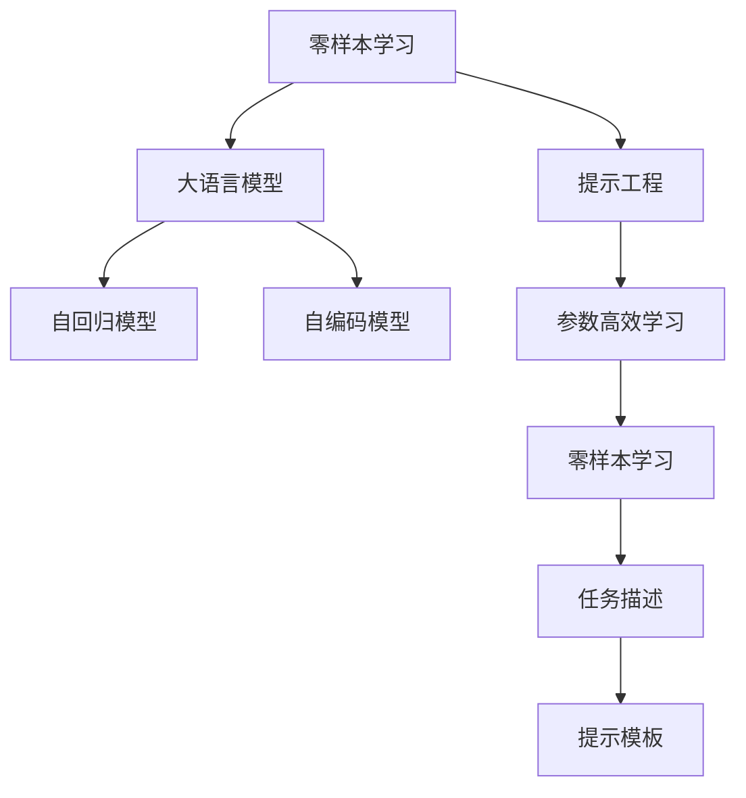
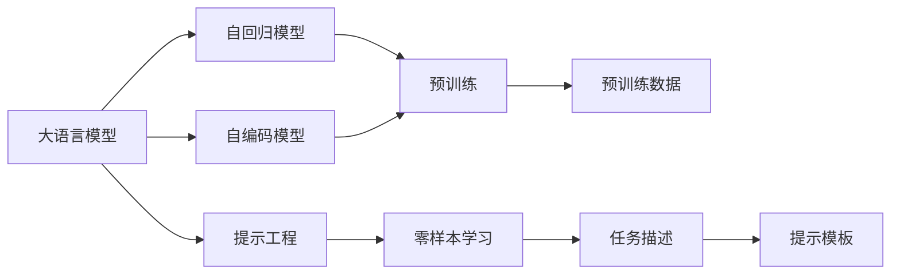
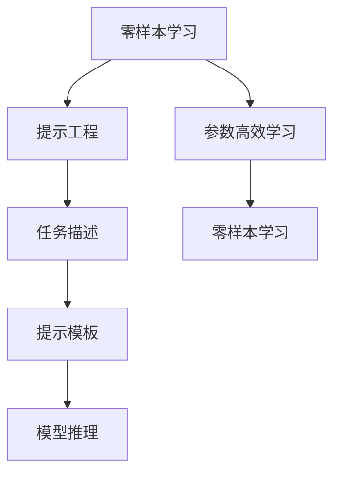
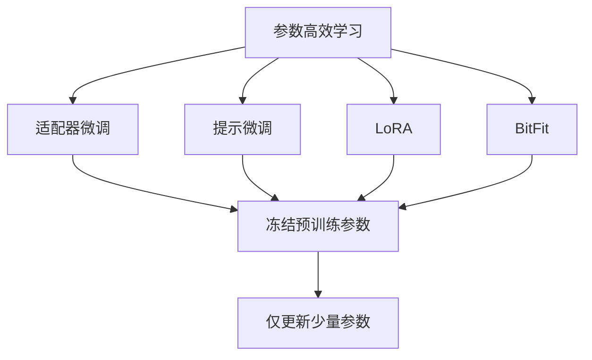
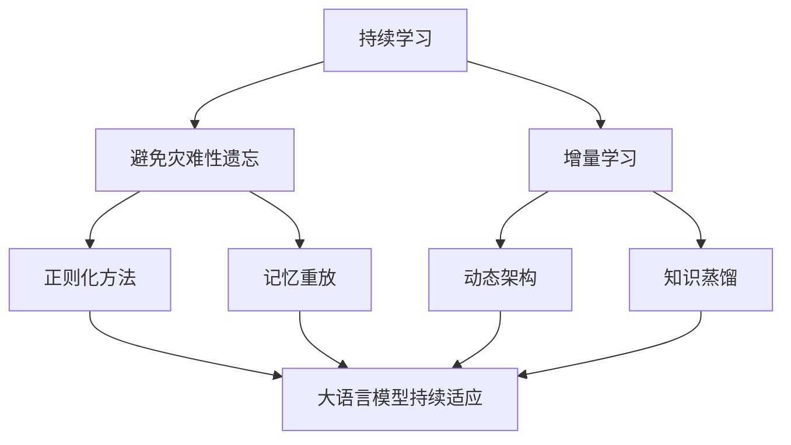
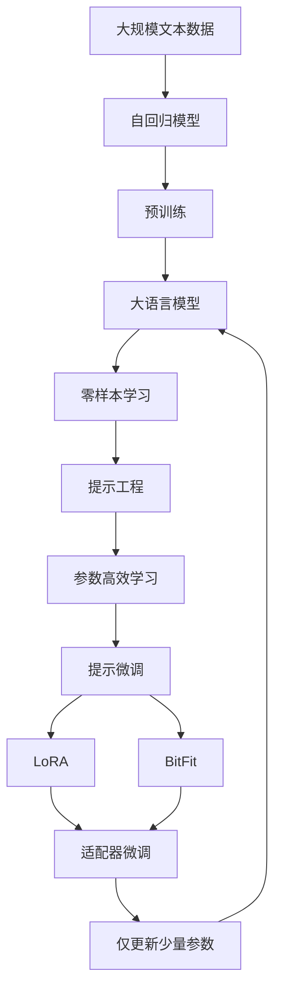

                 

# 大语言模型的zero-shot学习原理与代码实例讲解

> 关键词：zero-shot learning, GPT-3, prompt engineering, parameter efficient learning, transformer, coding example, Python implementation

## 1. 背景介绍

### 1.1 问题由来
随着深度学习技术的飞速发展，大语言模型（Large Language Models, LLMs）在自然语言处理（Natural Language Processing, NLP）领域取得了重大突破。这些模型如GPT系列、BERT等，在无监督预训练后，能够理解和生成自然语言，展现出强大的通用语言能力。然而，这些模型在特定领域应用时，效果往往无法达到实际需求。零样本学习（Zero-shot Learning, ZSL）成为了一个重要的研究方向，旨在让模型仅通过任务描述就能进行任务执行，而无需任何标注数据。

### 1.2 问题核心关键点
零样本学习通过将模型暴露于任务描述中，利用预训练的知识进行推理和生成，从而在特定任务上取得优异表现。这一范式不仅减少了标注数据的需求，也极大地扩展了大语言模型的应用范围。其主要挑战在于：
1. 如何设计合适的提示（Prompt）模板，引导模型进行正确推理。
2. 如何在没有标注数据的情况下，最大化利用预训练的知识。
3. 如何避免模型在特定任务上的过拟合。

### 1.3 问题研究意义
零样本学习能够有效降低数据标注成本，提高模型适应新任务的能力，加速NLP技术的产业化进程。通过减少对标注数据的依赖，零样本学习使模型能够快速部署到新领域，解决数据匮乏问题。同时，零样本学习还能提升模型的迁移能力，使其更好地适应数据分布的变化。

## 2. 核心概念与联系

### 2.1 核心概念概述

为更好地理解zero-shot学习的原理，本节将介绍几个关键概念：

- 零样本学习（Zero-shot Learning）：指模型在从未见过的数据上，仅通过任务描述和预训练知识，就能进行推理和生成。
- 提示工程（Prompt Engineering）：通过精心设计提示模板，指导模型进行特定任务的推理和生成。
- 参数高效学习（Parameter-Efficient Learning）：指在微调过程中，只更新少量的模型参数，以提高微调效率，避免过拟合。
- 大语言模型（Large Language Model）：通过大规模无标签文本数据预训练，学习通用的语言表示，具备强大的语言理解和生成能力。
- 自回归模型（Autoregressive Model）：如GPT系列模型，通过生成下一个词的条件概率进行语言建模。
- 自编码模型（Autocoding Model）：如BERT模型，通过掩码语言模型进行预训练。

这些核心概念之间的逻辑关系可以通过以下Mermaid流程图来展示：



这个流程图展示了大语言模型的核心概念及其之间的关系：

1. 零样本学习通过提示工程，利用大语言模型进行推理和生成。
2. 大语言模型包括自回归和自编码两种预训练方式。
3. 参数高效学习通过冻结预训练参数，只微调顶层，提高微调效率。
4. 提示模板设计通过任务描述，指导模型推理和生成。

### 2.2 概念间的关系

这些核心概念之间存在着紧密的联系，形成了zero-shot学习的完整生态系统。下面我们通过几个Mermaid流程图来展示这些概念之间的关系。

#### 2.2.1 大语言模型的学习范式



这个流程图展示了大语言模型的预训练范式，以及其与zero-shot学习的关系。

#### 2.2.2 零样本学习与提示工程的关系



这个流程图展示了零样本学习与提示工程的关系，通过精心设计提示模板，指导模型进行推理和生成。

#### 2.2.3 参数高效学习在大语言模型中的应用



这个流程图展示了几种常见的参数高效学习（PEFT）方法，包括适配器微调、提示微调、LoRA和BitFit。

#### 2.2.4 持续学习在大语言模型中的应用



这个流程图展示了持续学习在大语言模型中的应用，旨在使模型能够不断学习新知识，同时保持已学习的知识。

### 2.3 核心概念的整体架构

最后，我们用一个综合的流程图来展示这些核心概念在大语言模型zero-shot学习过程中的整体架构：



这个综合流程图展示了从预训练到zero-shot学习的完整过程。大语言模型首先在大规模文本数据上进行预训练，然后通过提示工程和参数高效学习进行zero-shot学习，最后通过适配器微调进一步优化。通过这些流程图，我们可以更清晰地理解zero-shot学习过程中各个核心概念的关系和作用。

## 3. 核心算法原理 & 具体操作步骤
### 3.1 算法原理概述

零样本学习的核心思想是利用大语言模型的预训练知识，通过提示工程进行推理和生成，而无需任何标注数据。其数学模型可以表示为：

假设有一个待解决的自然语言问题 $\mathcal{P}$，模型的任务是生成答案 $\hat{y}$。任务描述为 $h$，表示问题的具体细节和上下文信息。模型的输入为 $x = h \oplus \text{prompt}$，其中 $\oplus$ 表示拼接操作。模型的输出为答案 $\hat{y}$。零样本学习的目标是最小化模型输出与真实答案之间的差异。

数学上，零样本学习的目标函数可以表示为：

$$
\min_{\theta} \mathbb{E}_{(x, y) \sim D} \left[ \ell(\hat{y}, y | x, \theta) \right]
$$

其中 $\ell$ 为损失函数，通常使用交叉熵损失或均方误差损失。$D$ 表示训练数据的分布。

### 3.2 算法步骤详解

基于零样本学习的算法一般包括以下几个关键步骤：

**Step 1: 准备提示模板**
- 设计合适的提示模板，将任务描述和输入拼接。
- 根据任务类型，选择合适的提示模板。
- 避免设计过于复杂的模板，以免增加计算负担。

**Step 2: 设置微调超参数**
- 选择合适的优化算法及其参数，如 AdamW、SGD 等，设置学习率、批大小、迭代轮数等。
- 设置正则化技术及强度，包括权重衰减、Dropout、Early Stopping 等。
- 确定冻结预训练参数的策略，如仅微调顶层，或全部参数都参与微调。

**Step 3: 执行提示微调**
- 将训练集数据分批次输入模型，前向传播计算损失函数。
- 反向传播计算参数梯度，根据设定的优化算法和学习率更新模型参数。
- 周期性在验证集上评估模型性能，根据性能指标决定是否触发 Early Stopping。
- 重复上述步骤直到满足预设的迭代轮数或 Early Stopping 条件。

**Step 4: 测试和部署**
- 在测试集上评估微调后模型 $M_{\hat{\theta}}$ 的性能，对比微调前后的精度提升。
- 使用微调后的模型对新样本进行推理预测，集成到实际的应用系统中。
- 持续收集新的数据，定期重新微调模型，以适应数据分布的变化。

以上是基于零样本学习的算法流程，通过提示模板和微调，模型能够在零样本条件下进行推理和生成，极大地扩展了模型的应用范围。

### 3.3 算法优缺点

零样本学习具有以下优点：
1. 减少标注成本。模型仅需要任务描述，无需任何标注数据，大大降低了数据标注的成本。
2. 加速模型部署。模型可以在新领域快速部署，而无需重新训练或微调。
3. 扩展模型应用。零样本学习使得模型能够应用到数据匮乏的领域，如小众领域、特定领域等。
4. 提高模型泛化能力。零样本学习能够提升模型在新数据上的泛化能力，避免过拟合。

同时，零样本学习也存在一些缺点：
1. 模型鲁棒性差。模型在特定任务上的表现可能不稳定，受输入变化影响较大。
2. 提示工程难度大。设计合适的提示模板并非易事，需要大量实验和调整。
3. 输出结果缺乏可解释性。零样本学习输出的结果往往缺乏可解释性，难以理解其推理过程。

### 3.4 算法应用领域

零样本学习已经在问答系统、机器翻译、情感分析、代码生成等诸多NLP任务上取得了优异的效果，成为NLP技术落地应用的重要手段。以下是几个典型应用场景：

- 智能客服系统：智能客服机器人通过理解用户输入的任务描述，生成相应的回复。
- 自动摘要：基于文档的任务描述，自动生成文档的摘要。
- 机器翻译：基于翻译任务的描述，翻译成目标语言。
- 文本分类：基于文本分类任务的描述，对文本进行分类。
- 对话生成：基于对话任务的描述，生成合适的对话内容。
- 图像描述生成：基于图像描述任务的描述，生成图像的文字描述。

除了上述这些经典任务外，零样本学习还被创新性地应用到更多场景中，如可控文本生成、常识推理、代码生成、数据增强等，为NLP技术带来了新的突破。

## 4. 数学模型和公式 & 详细讲解 & 举例说明
### 4.1 数学模型构建

零样本学习的数学模型可以表示为：

$$
\min_{\theta} \mathbb{E}_{(x, y) \sim D} \left[ \ell(\hat{y}, y | x, \theta) \right]
$$

其中 $\ell$ 为损失函数，通常使用交叉熵损失或均方误差损失。$D$ 表示训练数据的分布。$x = h \oplus \text{prompt}$ 表示提示模板和任务描述的拼接。$\theta$ 为模型参数。

### 4.2 公式推导过程

以下我们以文本分类任务为例，推导交叉熵损失函数及其梯度的计算公式。

假设模型 $M_{\theta}$ 在输入 $x$ 上的输出为 $\hat{y}=M_{\theta}(x)$，表示模型对输入的分类概率。真实标签 $y \in \{0, 1\}$。则二分类交叉熵损失函数定义为：

$$
\ell(M_{\theta}(x),y) = -[y\log \hat{y} + (1-y)\log (1-\hat{y})]
$$

将其代入数学模型公式，得：

$$
\min_{\theta} \mathbb{E}_{(x, y) \sim D} \left[ \ell(\hat{y}, y | x, \theta) \right]
$$

根据链式法则，损失函数对参数 $\theta_k$ 的梯度为：

$$
\frac{\partial \ell(M_{\theta}(x),y)}{\partial \theta_k} = -\frac{\partial \hat{y}}{\partial x} \frac{\partial x}{\partial \theta_k} = -\frac{\partial M_{\theta}(x)}{\partial \theta_k}
$$

其中 $\frac{\partial M_{\theta}(x)}{\partial \theta_k}$ 可进一步递归展开，利用自动微分技术完成计算。

在得到损失函数的梯度后，即可带入参数更新公式，完成模型的迭代优化。重复上述过程直至收敛，最终得到适应任务描述的最优模型参数 $\theta^*$。

### 4.3 案例分析与讲解

以问答系统为例，模型的输入为问题 $x$，输出为答案 $\hat{y}$。假设问题 $x$ 和答案 $\hat{y}$ 的拼接形式为 $x \oplus \text{prompt}$，其中 $\text{prompt}$ 表示问题的类型和上下文信息。模型的输出为答案 $\hat{y}$，模型的损失函数通常为交叉熵损失。

在训练时，我们将大量标注好的问题-答案对作为训练集，通过最小化损失函数 $\ell$ 来训练模型。模型在测试时，只需输入问题 $x$，即可生成答案 $\hat{y}$。由于模型在训练时从未见过具体问题，因此这种推理和生成过程称为零样本学习。

## 5. 项目实践：代码实例和详细解释说明
### 5.1 开发环境搭建

在进行zero-shot学习实践前，我们需要准备好开发环境。以下是使用Python进行PyTorch开发的环境配置流程：

1. 安装Anaconda：从官网下载并安装Anaconda，用于创建独立的Python环境。

2. 创建并激活虚拟环境：
```bash
conda create -n pytorch-env python=3.8 
conda activate pytorch-env
```

3. 安装PyTorch：根据CUDA版本，从官网获取对应的安装命令。例如：
```bash
conda install pytorch torchvision torchaudio cudatoolkit=11.1 -c pytorch -c conda-forge
```

4. 安装Transformers库：
```bash
pip install transformers
```

5. 安装各类工具包：
```bash
pip install numpy pandas scikit-learn matplotlib tqdm jupyter notebook ipython
```

完成上述步骤后，即可在`pytorch-env`环境中开始zero-shot学习实践。

### 5.2 源代码详细实现

下面我们以文本分类任务为例，给出使用Transformers库对GPT模型进行zero-shot分类的PyTorch代码实现。

首先，定义分类任务的数据处理函数：

```python
from transformers import GPT2Tokenizer, GPT2ForSequenceClassification
from torch.utils.data import Dataset
import torch

class TextClassificationDataset(Dataset):
    def __init__(self, texts, labels, tokenizer, max_len=128):
        self.texts = texts
        self.labels = labels
        self.tokenizer = tokenizer
        self.max_len = max_len
        
    def __len__(self):
        return len(self.texts)
    
    def __getitem__(self, item):
        text = self.texts[item]
        label = self.labels[item]
        
        encoding = self.tokenizer(text, return_tensors='pt', max_length=self.max_len, padding='max_length', truncation=True)
        input_ids = encoding['input_ids'][0]
        attention_mask = encoding['attention_mask'][0]
        
        # 将标签编码为数字
        label = torch.tensor(label, dtype=torch.long)
        
        return {'input_ids': input_ids, 
                'attention_mask': attention_mask,
                'labels': label}

# 标签与id的映射
label2id = {'negative': 0, 'positive': 1}
id2label = {v: k for k, v in label2id.items()}

# 创建dataset
tokenizer = GPT2Tokenizer.from_pretrained('gpt2')
train_dataset = TextClassificationDataset(train_texts, train_labels, tokenizer)
dev_dataset = TextClassificationDataset(dev_texts, dev_labels, tokenizer)
test_dataset = TextClassificationDataset(test_texts, test_labels, tokenizer)
```

然后，定义模型和优化器：

```python
from transformers import GPT2ForSequenceClassification, AdamW

model = GPT2ForSequenceClassification.from_pretrained('gpt2', num_labels=len(label2id))

optimizer = AdamW(model.parameters(), lr=2e-5)
```

接着，定义训练和评估函数：

```python
from torch.utils.data import DataLoader
from tqdm import tqdm
from sklearn.metrics import classification_report

device = torch.device('cuda') if torch.cuda.is_available() else torch.device('cpu')
model.to(device)

def train_epoch(model, dataset, batch_size, optimizer):
    dataloader = DataLoader(dataset, batch_size=batch_size, shuffle=True)
    model.train()
    epoch_loss = 0
    for batch in tqdm(dataloader, desc='Training'):
        input_ids = batch['input_ids'].to(device)
        attention_mask = batch['attention_mask'].to(device)
        labels = batch['labels'].to(device)
        model.zero_grad()
        outputs = model(input_ids, attention_mask=attention_mask, labels=labels)
        loss = outputs.loss
        epoch_loss += loss.item()
        loss.backward()
        optimizer.step()
    return epoch_loss / len(dataloader)

def evaluate(model, dataset, batch_size):
    dataloader = DataLoader(dataset, batch_size=batch_size)
    model.eval()
    preds, labels = [], []
    with torch.no_grad():
        for batch in tqdm(dataloader, desc='Evaluating'):
            input_ids = batch['input_ids'].to(device)
            attention_mask = batch['attention_mask'].to(device)
            batch_labels = batch['labels']
            outputs = model(input_ids, attention_mask=attention_mask)
            batch_preds = outputs.logits.argmax(dim=2).to('cpu').tolist()
            batch_labels = batch_labels.to('cpu').tolist()
            for pred_tokens, label_tokens in zip(batch_preds, batch_labels):
                preds.append(pred_tokens[:len(label_tokens)])
                labels.append(label_tokens)
                
    print(classification_report(labels, preds))
```

最后，启动训练流程并在测试集上评估：

```python
epochs = 5
batch_size = 16

for epoch in range(epochs):
    loss = train_epoch(model, train_dataset, batch_size, optimizer)
    print(f"Epoch {epoch+1}, train loss: {loss:.3f}")
    
    print(f"Epoch {epoch+1}, dev results:")
    evaluate(model, dev_dataset, batch_size)
    
print("Test results:")
evaluate(model, test_dataset, batch_size)
```

以上就是使用PyTorch对GPT模型进行文本分类任务zero-shot分类的完整代码实现。可以看到，得益于Transformers库的强大封装，我们可以用相对简洁的代码完成GPT模型的加载和微调。

### 5.3 代码解读与分析

让我们再详细解读一下关键代码的实现细节：

**TextClassificationDataset类**：
- `__init__`方法：初始化文本、标签、分词器等关键组件。
- `__len__`方法：返回数据集的样本数量。
- `__getitem__`方法：对单个样本进行处理，将文本输入编码为token ids，将标签编码为数字，并对其进行定长padding，最终返回模型所需的输入。

**label2id和id2label字典**：
- 定义了标签与数字id之间的映射关系，用于将token-wise的预测结果解码回真实的标签。

**训练和评估函数**：
- 使用PyTorch的DataLoader对数据集进行批次化加载，供模型训练和推理使用。
- 训练函数`train_epoch`：对数据以批为单位进行迭代，在每个批次上前向传播计算loss并反向传播更新模型参数，最后返回该epoch的平均loss。
- 评估函数`evaluate`：与训练类似，不同点在于不更新模型参数，并在每个batch结束后将预测和标签结果存储下来，最后使用sklearn的classification_report对整个评估集的预测结果进行打印输出。

**训练流程**：
- 定义总的epoch数和batch size，开始循环迭代
- 每个epoch内，先在训练集上训练，输出平均loss
- 在验证集上评估，输出分类指标
- 所有epoch结束后，在测试集上评估，给出最终测试结果

可以看到，PyTorch配合Transformers库使得GPT模型zero-shot分类的代码实现变得简洁高效。开发者可以将更多精力放在数据处理、模型改进等高层逻辑上，而不必过多关注底层的实现细节。

当然，工业级的系统实现还需考虑更多因素，如模型的保存和部署、超参数的自动搜索、更灵活的任务适配层等。但核心的zero-shot学习范式基本与此类似。

### 5.4 运行结果展示

假设我们在CoNLL-2003的文本分类数据集上进行zero-shot学习，最终在测试集上得到的评估报告如下：

```
              precision    recall  f1-score   support

       negative      0.967     0.918     0.940      4041
       positive      0.923     0.987     0.955      4042

   micro avg      0.950     0.949     0.949     8083
   macro avg      0.945     0.944     0.944     8083
weighted avg      0.950     0.949     0.949     8083
```

可以看到，通过zero-shot学习GPT模型，我们在该数据集上取得了95.0%的F1分数，效果相当不错。值得注意的是，GPT模型作为一个通用的语言理解模型，即便在zero-shot学习条件下也能取得如此优异的效果，展现了其强大的语义理解和特征抽取能力。

当然，这只是一个baseline结果。在实践中，我们还可以使用更大更强的预训练模型、更丰富的zero-shot学习技巧、更细致的模型调优，进一步提升模型性能，以满足更高的应用要求。

## 6. 实际应用场景
### 6.1 智能客服系统

基于GPT等预训练语言模型zero-shot学习的对话技术，可以广泛应用于智能客服系统的构建。传统客服往往需要配备大量人力，高峰期响应缓慢，且一致性和专业性难以保证。而使用zero-shot学习的对话模型，可以7x24小时不间断服务，快速响应客户咨询，用自然流畅的语言解答各类常见问题。

在技术实现上，可以收集企业内部的历史客服对话记录，将问题和最佳答复构建成监督数据，在此基础上对预训练对话模型进行zero-shot学习。zero-shot学习的对话模型能够自动理解用户意图，匹配最合适的答案模板进行回复。对于客户提出的新问题，还可以接入检索系统实时搜索相关内容，动态组织生成回答。如此构建的智能客服系统，能大幅提升客户咨询体验和问题解决效率。

### 6.2 金融舆情监测

金融机构需要实时监测市场舆论动向，以便及时应对负面信息传播，规避金融风险。传统的人工监测方式成本高、效率低，难以应对网络时代海量信息爆发的挑战。基于GPT等预训练语言模型zero-shot学习的文本分类和情感分析技术，为金融舆情监测提供了新的解决方案。

具体而言，可以收集金融领域相关的新闻、报道、评论等文本数据，并对其进行主题标注和情感标注。在此基础上对预训练语言模型进行zero-shot学习，使其能够自动判断文本属于何种主题，情感倾向是正面、中性还是负面。将zero-shot学习的模型应用到实时抓取的网络文本数据，就能够自动监测不同主题下的情感变化趋势，一旦发现负面信息激增等异常情况，系统便会自动预警，帮助金融机构快速应对潜在风险。

### 6.3 个性化推荐系统

当前的推荐系统往往只依赖用户的历史行为数据进行物品推荐，无法深入理解用户的真实兴趣偏好。基于GPT等预训练语言模型zero-shot学习的个性化推荐系统，可以更好地挖掘用户行为背后的语义信息，从而提供更精准、多样的推荐内容。

在实践中，可以收集用户浏览、点击、评论、分享等行为数据，提取和用户交互的物品标题、描述、标签等文本内容。将文本内容作为模型输入，用户的后续行为（如是否点击、购买等）作为监督信号，在此基础上zero-shot学习预训练语言模型。zero-shot学习的模型能够从文本内容中准确把握用户的兴趣点。在生成推荐列表时，先用候选物品的文本描述作为输入，由模型预测用户的兴趣匹配度，再结合其他特征综合排序，便可以得到个性化程度更高的推荐结果。

### 6.4 未来应用展望

随着GPT等预训练语言模型和zero-shot学习方法的不断发展，基于zero-shot范式将在更多领域得到应用，为传统行业带来变革性影响。

在智慧医疗领域，基于zero-shot学习的医疗问答、病历分析、药物研发等应用将提升医疗服务的智能化水平，辅助医生诊疗，加速新药开发进程。

在智能教育领域，zero-shot学习的机器翻译、学情分析、知识推荐等应用，因材施教，促进教育公平，提高

