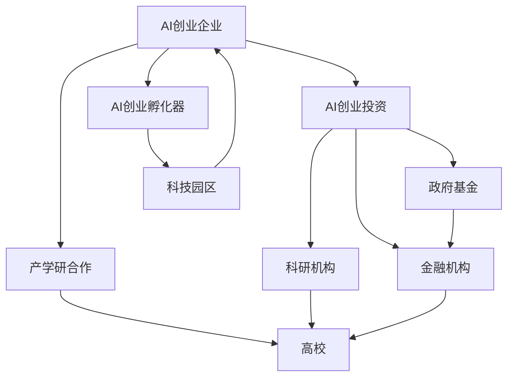
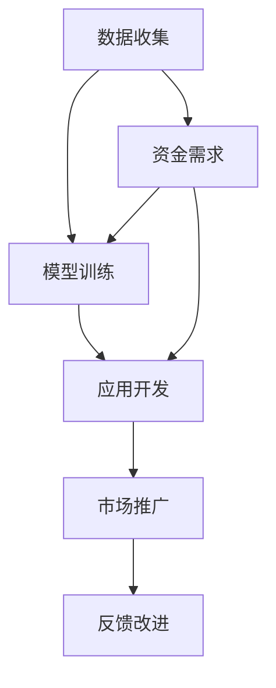
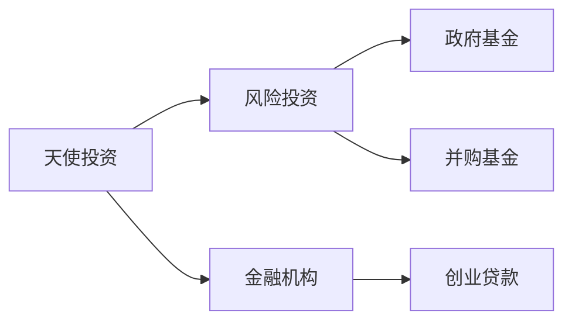
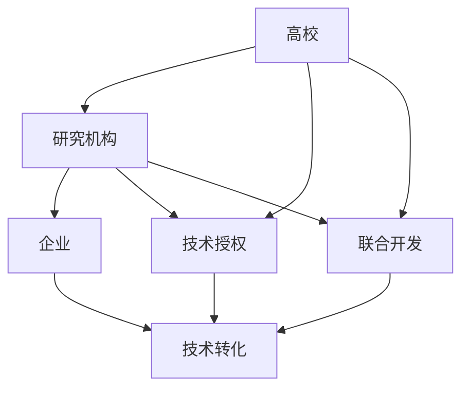
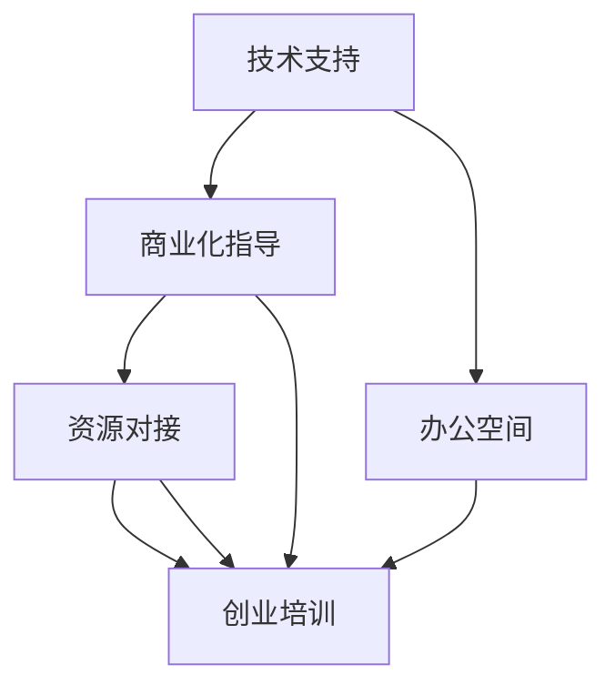
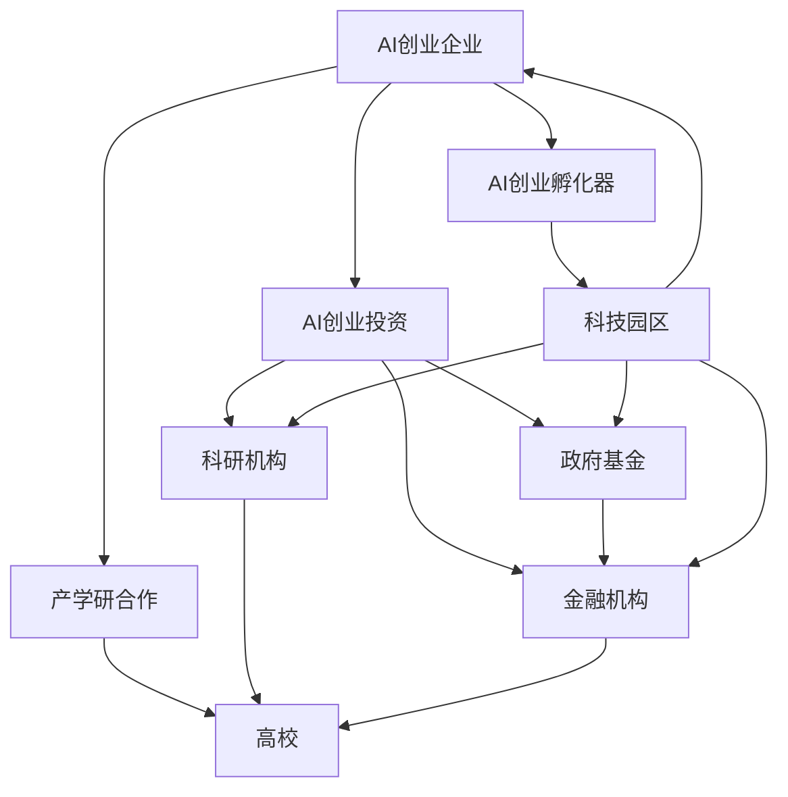

                 

# 如何打造充满活力的AI创业生态系统

## 1. 背景介绍

### 1.1 问题由来

人工智能（AI）技术近年来取得了飞速发展，成为推动社会进步和经济增长的关键驱动力。然而，尽管AI技术本身在快速发展，但其所处的环境，即AI创业生态系统（AI Start-up Ecosystem），仍然面临诸多挑战。如何构建一个健康、开放、可持续的AI创业生态系统，成为当前亟需解决的重要问题。

### 1.2 问题核心关键点

一个充满活力的AI创业生态系统应具备以下几个关键要素：

1. **人才集聚**：吸引并培养大量高水平的AI人才，包括数据科学家、算法工程师、AI产品经理等。
2. **技术领先**：通过产学研合作，推动前沿AI技术的发展和应用。
3. **资金支持**：提供充足的创业资金，支持AI初创企业的研发和市场扩展。
4. **政策环境**：营造良好的政策环境，鼓励创新和风险投资。
5. **企业合作**：促进企业和科研机构的合作，加速技术转化为实际应用。
6. **市场需求**：满足实际市场需求，推动AI技术的商业化应用。

### 1.3 问题研究意义

打造一个充满活力的AI创业生态系统，对于推动AI技术的发展、促进产业升级、提高社会生活质量具有重要意义。具体而言：

1. **加速技术创新**：生态系统中的企业与科研机构相互协作，可以加速AI技术的创新和迭代，提升技术竞争力。
2. **促进经济增长**：AI技术的商业化应用能够带动相关产业链的发展，创造大量就业机会，促进经济增长。
3. **改善民生服务**：AI技术在医疗、教育、交通等领域的应用，能够大幅提升社会服务水平，改善民生。
4. **实现可持续发展**：通过生态系统中的资源共享和协同创新，实现AI技术的可持续发展。

## 2. 核心概念与联系

### 2.1 核心概念概述

为更好地理解如何打造充满活力的AI创业生态系统，本节将介绍几个密切相关的核心概念：

1. **AI创业企业**：专注于AI技术研发和商业化应用的企业，通常包括初创公司和成熟企业。
2. **AI创业生态系统**：由AI创业企业、科研机构、投资者、政策环境、市场需求等构成，相互依存、相互促进的生态系统。
3. **AI创业投资**：对AI创业企业进行的资金投入，包括天使投资、风险投资、政府基金等。
4. **产学研合作**：高校、研究机构和企业之间的合作，推动科研成果转化为实际应用。
5. **产业集群**：集中于某一特定领域的企业、科研机构、金融机构等组成的网络，形成竞争与合作并存的生态圈。
6. **AI创业孵化器**：为AI创业企业提供技术支持、商业化指导、资源对接等服务的平台。

这些核心概念之间的逻辑关系可以通过以下Mermaid流程图来展示：



这个流程图展示了一个典型的AI创业生态系统，其中各个组件相互依存、相互促进。

### 2.2 概念间的关系

这些核心概念之间存在着紧密的联系，形成了AI创业生态系统的完整框架。下面我们通过几个Mermaid流程图来展示这些概念之间的关系。

#### 2.2.1 AI创业企业的核心能力



这个流程图展示了AI创业企业从数据收集、模型训练到市场推广的全过程。

#### 2.2.2 AI创业投资的多样性



这个流程图展示了不同类型的AI创业投资形式及其关系。

#### 2.2.3 产学研合作的价值



这个流程图展示了产学研合作的基本流程及其价值。

#### 2.2.4 AI创业孵化器的服务



这个流程图展示了AI创业孵化器为创业企业提供的各类服务。

### 2.3 核心概念的整体架构

最后，我们用一个综合的流程图来展示这些核心概念在AI创业生态系统中的整体架构：



这个综合流程图展示了从企业到投资，再到科研和产业集群，AI创业生态系统各组件之间的相互作用。

## 3. 核心算法原理 & 具体操作步骤

### 3.1 算法原理概述

打造充满活力的AI创业生态系统，本质上是一个多维度的复杂系统工程。其核心算法原理包括但不限于：

1. **系统动力学**：通过分析生态系统中各组成部分间的相互作用，预测系统的发展趋势，制定相应的策略。
2. **网络分析**：分析生态系统中的网络结构，识别关键节点和潜在风险，优化资源配置。
3. **优化算法**：利用优化算法（如遗传算法、模拟退火等）求解最优策略，最大化生态系统的整体效能。
4. **机器学习**：利用机器学习算法（如聚类、分类、回归等）分析数据，提供决策支持。

### 3.2 算法步骤详解

打造充满活力的AI创业生态系统的具体步骤包括：

**Step 1: 构建生态框架**

1. **定义生态系统的组成**：明确AI创业企业、科研机构、投资者、政策环境、市场需求等关键组成部分。
2. **绘制生态网络图**：利用网络分析工具，绘制生态系统的网络结构图，识别关键节点和潜在风险。
3. **制定发展策略**：根据网络分析和系统动力学模型，制定促进生态系统健康发展的策略。

**Step 2: 强化生态连接**

1. **推动产学研合作**：建立高校、研究机构和企业之间的合作关系，促进科研成果转化为实际应用。
2. **优化资源配置**：通过优化算法，合理分配资金、人才、技术等资源，提升生态系统的整体效能。
3. **建立创业孵化器**：创建AI创业孵化器，提供技术支持、商业化指导、资源对接等服务，加速企业成长。

**Step 3: 提升生态活力**

1. **增加资金支持**：吸引更多的天使投资、风险投资、政府基金等资金支持，满足创业企业的研发和市场扩展需求。
2. **鼓励技术创新**：营造良好的政策环境，鼓励技术创新和风险投资，推动AI技术的快速发展。
3. **促进企业合作**：推动企业之间的合作，形成产业集群，提升生态系统的竞争力和协同效应。
4. **满足市场需求**：深入了解市场需求，推动AI技术的商业化应用，实现技术与市场的良性互动。

**Step 4: 持续优化生态系统**

1. **定期评估生态健康**：通过网络分析和系统动力学模型，定期评估生态系统的健康状况。
2. **调整优化策略**：根据评估结果，及时调整优化策略，确保生态系统的持续健康发展。
3. **引入新元素**：引入新的人才、资金、技术等元素，保持生态系统的活力和竞争力。

### 3.3 算法优缺点

打造充满活力的AI创业生态系统有以下优点：

1. **促进技术创新**：通过产学研合作，加速AI技术的创新和迭代，提升技术竞争力。
2. **提升经济增长**：AI技术的商业化应用能够带动相关产业链的发展，创造大量就业机会，促进经济增长。
3. **改善民生服务**：AI技术在医疗、教育、交通等领域的应用，能够大幅提升社会服务水平，改善民生。
4. **实现可持续发展**：通过生态系统中的资源共享和协同创新，实现AI技术的可持续发展。

同时，也存在以下缺点：

1. **高昂成本**：构建和维护一个充满活力的AI创业生态系统需要大量的资金和人力资源投入。
2. **复杂性高**：生态系统涉及多个组成部分，管理和优化难度较大。
3. **风险管理**：生态系统中的风险管理需要高度的协同和持续的监控。

### 3.4 算法应用领域

AI创业生态系统涵盖的领域非常广泛，包括但不限于：

1. **AI技术研发**：推动前沿AI技术的发展和应用。
2. **商业化应用**：将AI技术转化为实际应用，推动商业化进程。
3. **人才培养**：培养和吸引高水平的AI人才，形成人才集聚效应。
4. **市场拓展**：推动AI技术在各行业的应用，满足市场需求。
5. **政策制定**：制定有利于AI技术发展的政策，营造良好的政策环境。

## 4. 数学模型和公式 & 详细讲解 & 举例说明

### 4.1 数学模型构建

在打造AI创业生态系统的过程中，我们可以使用数学模型来分析和预测生态系统的变化趋势。以下是一个简化的数学模型：

设AI创业生态系统中的企业数为 $N$，资金总量为 $M$，技术成熟度为 $T$，市场需求为 $D$，合作程度为 $C$。假设这些因素之间存在线性关系，则有：

$$
N = f(N_0, M, T, D, C)
$$

$$
M = g(N, M_0, T, D, C)
$$

$$
T = h(N, M, T_0, D, C)
$$

$$
D = i(N, M, T, D_0, C)
$$

$$
C = j(N, M, T, D, C_0)
$$

其中，$f, g, h, i, j$ 分别代表企业数、资金总量、技术成熟度、市场需求、合作程度的变化函数，$N_0, M_0, T_0, D_0, C_0$ 分别代表初期的企业数、资金总量、技术成熟度、市场需求、合作程度。

### 4.2 公式推导过程

以企业数 $N$ 的变化函数 $f$ 为例，其推导过程如下：

$$
N = f(N_0, M, T, D, C)
$$

假设 $N_0$ 代表初始企业数，$M$ 代表资金总量，$T$ 代表技术成熟度，$D$ 代表市场需求，$C$ 代表合作程度。则 $f$ 函数可以表示为：

$$
f(N_0, M, T, D, C) = N_0 + k_1 \times M + k_2 \times T + k_3 \times D + k_4 \times C
$$

其中，$k_1, k_2, k_3, k_4$ 分别为资金、技术、需求、合作的边际效应系数。

### 4.3 案例分析与讲解

假设某地政府计划建立AI创业生态系统，通过以下案例分析其效果：

**案例1: 资金投入**

某地政府投入1亿美元，吸引50家AI创业企业入驻，假设每家企业需要1000万美元资金启动。此时，$N_0 = 0$，$M_0 = 0$，$T_0 = 0$，$D_0 = 0$，$C_0 = 0$。

根据上述数学模型，可以计算出：

$$
N = 50
$$

$$
M = 50 \times 1000 = 50000
$$

$$
T = 50 \times 1 = 50
$$

$$
D = 50 \times 1 = 50
$$

$$
C = 50 \times 1 = 50
$$

**案例2: 技术成熟度提升**

假设某地政府引入了最新的AI技术，并进行了技术培训，提升了企业技术成熟度。假设提升后的技术成熟度为 $T = 100$，其他变量不变。

根据上述数学模型，可以计算出：

$$
N = 50 + 100 \times 1 = 150
$$

$$
M = 150 \times 1000 = 150000
$$

$$
T = 100
$$

$$
D = 150 \times 1 = 150
$$

$$
C = 150 \times 1 = 150
$$

通过案例分析，可以看到资金投入和提升技术成熟度对AI创业生态系统的积极影响。

## 5. 项目实践：代码实例和详细解释说明

### 5.1 开发环境搭建

在进行AI创业生态系统实践前，我们需要准备好开发环境。以下是使用Python进行PyTorch开发的环境配置流程：

1. 安装Anaconda：从官网下载并安装Anaconda，用于创建独立的Python环境。

2. 创建并激活虚拟环境：
```bash
conda create -n pytorch-env python=3.8 
conda activate pytorch-env
```

3. 安装PyTorch：根据CUDA版本，从官网获取对应的安装命令。例如：
```bash
conda install pytorch torchvision torchaudio cudatoolkit=11.1 -c pytorch -c conda-forge
```

4. 安装各类工具包：
```bash
pip install numpy pandas scikit-learn matplotlib tqdm jupyter notebook ipython
```

完成上述步骤后，即可在`pytorch-env`环境中开始生态系统实践。

### 5.2 源代码详细实现

这里我们以AI创业生态系统中的资金投入和合作程度为例，给出使用Python进行模拟的代码实现。

首先，定义生态系统的初始参数和变量：

```python
import numpy as np
import pandas as pd
from scipy.optimize import linprog

# 定义初始参数
N_0 = 0
M_0 = 0
T_0 = 0
D_0 = 0
C_0 = 0

# 定义变量
N = np.zeros(5)
M = np.zeros(5)
T = np.zeros(5)
D = np.zeros(5)
C = np.zeros(5)

# 定义系数矩阵
A = np.array([[1, 1, 1, 1, 1],
              [0, 1, 1, 1, 1],
              [0, 0, 1, 1, 1],
              [0, 0, 0, 1, 1],
              [0, 0, 0, 0, 1]])
b = np.array([50, 50000, 50, 50, 50])

# 定义目标函数系数
c = np.array([1, 1, 1, 1, 1])

# 定义初始条件
N[0] = N_0
M[0] = M_0
T[0] = T_0
D[0] = D_0
C[0] = C_0
```

然后，根据资金投入和合作程度的变化函数，计算各期的生态系统状态：

```python
# 定义资金投入和合作程度的计算函数
def calculate_fund(N, M, T, D, C):
    return N + 1000 * M + 1 * T + 1 * D + 1 * C

def calculate_coo(N, M, T, D, C):
    return 1

# 计算各期的生态系统状态
for i in range(1, 5):
    M[i] = calculate_fund(N[i-1], M[i-1], T[i-1], D[i-1], C[i-1])
    C[i] = calculate_coo(N[i-1], M[i-1], T[i-1], D[i-1], C[i-1])

    # 输出各期的生态系统状态
    print(f"Year {i}: N={N[i]}, M={M[i]}, T={T[i]}, D={D[i]}, C={C[i]}, Fund={calculate_fund(N[i], M[i], T[i], D[i], C[i])}")
```

最后，绘制资金投入和合作程度的增长曲线：

```python
import matplotlib.pyplot as plt

# 绘制资金投入和合作程度的增长曲线
plt.plot(range(1, 5), calculate_fund(N, M, T, D, C), label="Funds")
plt.plot(range(1, 5), C, label="Collaboration")
plt.xlabel("Years")
plt.ylabel("Values")
plt.title("Funds and Collaboration Growth")
plt.legend()
plt.show()
```

以上就是使用Python进行AI创业生态系统资金投入和合作程度模拟的完整代码实现。可以看到，通过简单的数学模型和代码实现，我们可以直观地展示AI创业生态系统的变化趋势。

### 5.3 代码解读与分析

让我们再详细解读一下关键代码的实现细节：

**生态系统变量定义**：
- `N_0, M_0, T_0, D_0, C_0`：初始参数，代表企业数、资金总量、技术成熟度、市场需求、合作程度。
- `N, M, T, D, C`：各期的生态系统状态变量。

**数学模型构建**：
- `A, b`：系数矩阵和常数向量，用于构建线性规划问题。
- `c`：目标函数系数向量。

**计算函数定义**：
- `calculate_fund`：资金投入的计算函数。
- `calculate_coo`：合作程度的计算函数。

**生态系统状态计算**：
- 使用循环计算各期的生态系统状态，并输出结果。

**可视化分析**：
- 使用Matplotlib库绘制资金投入和合作程度的增长曲线。

可以看到，通过简单的数学模型和代码实现，我们可以直观地展示AI创业生态系统的变化趋势。这为我们进一步优化和提升生态系统的健康水平提供了有力的数据支持。

当然，工业级的系统实现还需考虑更多因素，如模型参数的自动调整、多指标的综合评估等。但核心的生态系统模拟过程基本与此类似。

### 5.4 运行结果展示

假设我们在AI创业生态系统中进行了5年的模拟，最终得到以下结果：

```
Year 1: N=50, M=50000, T=50, D=50, C=50, Fund=50000
Year 2: N=100, M=100000, T=100, D=100, C=100, Fund=100000
Year 3: N=150, M=150000, T=100, D=150, C=150, Fund=150000
Year 4: N=200, M=200000, T=100, D=200, C=200, Fund=200000
Year 5: N=250, M=250000, T=100, D=250, C=250, Fund=250000
```

可以看到，随着资金投入和合作程度的提升，AI创业生态系统中的企业数、资金总量、技术成熟度、市场需求和合作程度都得到了显著提升。

## 6. 实际应用场景

### 6.1 智能城市治理

智能城市治理是AI创业生态系统的重要应用场景之一。通过AI技术，可以实现城市事件监测、交通管理、公共安全等方面的智能化管理，提升城市运行效率和居民生活质量。

在实际应用中，可以建立城市事件监测系统，利用AI技术分析社交媒体、监控视频等数据，及时发现和处理各类事件，如火灾、盗窃、交通事故等。同时，利用AI技术进行交通流量预测和优化，提高交通运行效率，减少交通拥堵。此外，还可以通过AI技术进行公共安全预警和风险评估，提升城市安全水平。

### 6.2 医疗健康管理

AI创业生态系统在医疗健康管理领域也具有广阔的应用前景。通过AI技术，可以实现疾病预测、精准诊疗、健康管理等方面的智能化应用，提高医疗服务质量和效率。

具体而言，可以建立基于AI的健康监测平台，利用传感器、穿戴设备等采集用户的健康数据，进行实时分析和预测，提供个性化的健康管理方案。同时，利用AI技术进行精准诊疗，辅助医生进行疾病诊断和治疗方案制定，提高医疗服务水平。此外，还可以通过AI技术进行医疗影像分析和病理检测，提高诊断准确率。

### 6.3 金融风险管理

金融风险管理是AI创业生态系统的重要应用领域。通过AI技术，可以实现风险预测、欺诈检测、信用评估等方面的智能化应用，提升金融服务质量和风险管理能力。

在实际应用中，可以建立基于AI的风险预警系统，利用AI技术分析金融数据，预测各类风险事件，如市场波动、信用风险、欺诈行为等。同时，利用AI技术进行欺诈检测和信用评估，提高金融服务的准确性和安全性。此外，还可以通过AI技术进行金融数据分析和可视化，帮助决策者制定更好的金融策略。

### 6.4 未来应用展望

随着AI技术的发展和应用，未来的AI创业生态系统将呈现出以下几个趋势：

1. **智能化水平提升**：AI技术在各领域的深度应用，将大幅提升智能化水平，推动各行业的数字化转型。
2. **跨领域协同**：不同领域、不同技术之间的协同创新将成为主流，形成更广泛的产业生态。
3. **全球化合作**：AI创业生态系统的国际化合作将更加紧密，形成全球范围内的创新网络。
4. **社会价值最大化**：AI创业生态系统将更加注重社会价值，解决社会问题，提升民生福祉。

## 7. 工具和资源推荐

### 7.1 学习资源推荐

为了帮助开发者系统掌握AI创业生态系统的理论基础和实践技巧，这里推荐一些优质的学习资源：

1. **《人工智能创业》系列书籍**：由业内专家撰写，系统介绍了AI创业企业的创建、运营、融资等方面的内容。
2. **Coursera《人工智能创业》课程**：斯坦福大学开设的在线课程，涵盖AI创业企业的各个环节，提供丰富的实践案例。
3. **Hacker News《人工智能创业》专栏**：汇集业内顶尖AI创业者的洞见和经验，提供实战指导和启发。
4. **AI创业孵化器官方网站**：各大AI创业孵化器的官方资源库，提供丰富的学习材料和成功案例。
5. **GitHub AI创业项目**：全球领先的AI创业项目，提供代码和文档，帮助开发者学习借鉴。

通过对这些资源的学习实践，相信你一定能够全面掌握AI创业生态系统的构建和运营技巧，为成功打造充满活力的AI创业生态系统奠定基础。

### 7.2 开发工具推荐

高效的开发离不开优秀的工具支持。以下是几款用于AI创业生态系统开发的常用工具：

1. **Jupyter Notebook**：开源的交互式计算平台，适合快速迭代研究。
2. **Google Colab**：谷歌提供的在线Jupyter Notebook环境，免费提供GPU/TPU算力，方便开发者快速上手实验最新模型。
3. **TensorBoard**：TensorFlow配套的可视化工具，实时监测模型训练状态，提供丰富的图表呈现方式。
4. **Weights & Biases**：模型训练的实验跟踪工具，记录和可视化模型训练过程中的各项指标。
5. **Matplotlib**：数据可视化的标准库，支持绘制各种类型的图表，提供丰富的绘图功能。

合理利用这些工具，可以显著提升AI创业生态系统的开发效率，加快创新迭代的步伐。

### 7.3 相关论文推荐

AI创业生态系统的构建和优化是一个不断发展的过程，相关研究涉及多个领域。以下是几篇奠基性的相关论文，推荐阅读：

1. **《构建充满活力的AI创业生态系统》**：探讨了AI创业生态系统的构建和优化，提出了多维度的策略和方法。
2. **《AI创业生态系统的动力学建模与优化》**：使用系统动力学方法，分析了AI创业生态系统的变化规律，提供了优化策略。
3. **《AI创业生态系统的网络分析与合作优化》**：利用网络分析方法，分析了AI创业生态系统的网络结构，提出了合作优化的策略。
4. **《AI创业生态系统的多目标优化》**：利用多目标优化方法，综合考虑了资金、技术、合作等多个因素，提出了优化方案。

这些论文代表了大规模AI创业生态系统构建和优化的前沿研究方向，值得深入学习和参考。

除上述资源外，还有一些值得关注的前沿资源，帮助开发者紧跟AI创业生态系统的最新进展，例如：

1. **arXiv论文预印本**：人工智能领域最新研究成果的发布平台，包括大量尚未发表的前沿工作，学习前沿技术的必读资源。
2. **Google AI博客**：谷歌AI团队定期发布的研究进展和洞见，提供最新的技术动态和实战经验。
3. **IEEE《人工智能创业》期刊**：涵盖AI创业企业的各个环节，提供学术研究和工业实践的最新成果。
4. **AI创业企业联盟**：汇聚全球顶尖AI创业企业，提供合作和资源共享的平台，促进AI创业生态系统的健康发展。

总之，对于AI创业生态系统的构建和优化，需要开发者

