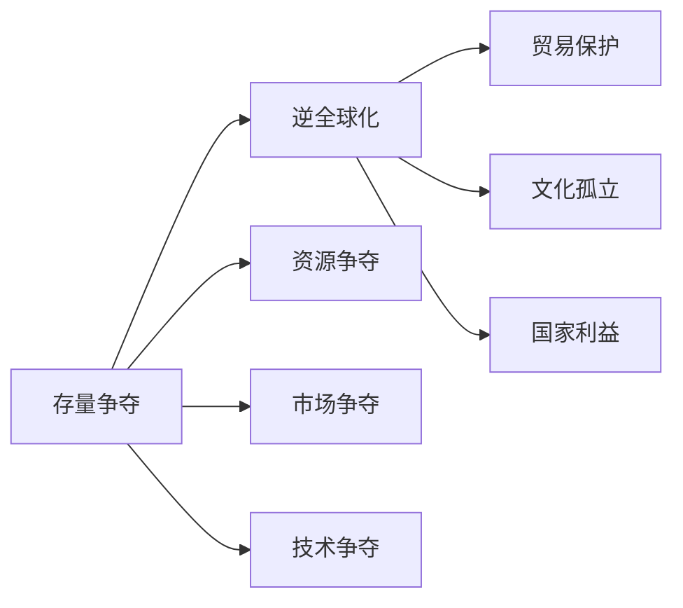

                 

## 1. 背景介绍

随着科技的飞速发展和全球化进程的加快，世界经济和社会的格局正经历着前所未有的巨变。在这个过程中，技术进步和全球化带来了许多积极的变化，比如经济全球化、文化交流、科技创新等。然而，与此同时，也出现了一系列新的挑战和问题，其中最引人关注的便是“存量争夺与逆全球化抬头”这一现象。本文将从技术角度分析这一现象背后的驱动因素和影响，探讨其在多个领域的体现，并提供一些应对策略。

## 2. 核心概念与联系

### 2.1 核心概念概述

为更好地理解这一现象，我们先来梳理相关的核心概念。

- **存量争夺**：指在全球范围内，各国和企业在资源、市场、技术等方面进行争夺，尤其是在资源和市场的有限条件下，这种争夺尤为激烈。
- **逆全球化**：指某些国家和地区出于各种原因，采取措施减少与外界的经济、文化等交流和合作，强调国家利益和本土发展。

这些概念之间的关系可以用以下Mermaid流程图来表示：



这个图展示了存量争夺和逆全球化之间的关系，以及它们各自的影响领域。存量争夺包括资源、市场和技术三个方面，而逆全球化则通过贸易保护、文化孤立和国家利益三个层面对全球化进行反动。

### 2.2 概念间的关系

存量争夺与逆全球化之间存在着密切的联系。存量争夺通常意味着各国和企业在资源、市场、技术等方面存在严重的竞争关系，这种竞争关系可能会促使部分国家和地区采取逆全球化的策略，以保护自身利益。例如，当一个国家在某个领域的技术实力相对较弱时，可能会减少与外界的技术交流和合作，转而加大研发投入，以提升自身技术实力。

## 3. 核心算法原理 & 具体操作步骤

### 3.1 算法原理概述

基于存量争夺和逆全球化现象，我们可以从经济、技术、政治等多个角度进行分析。本文将重点探讨技术角度，即如何通过技术手段分析和应对这一现象。

技术角度的分析涉及多个方面，包括数据挖掘、机器学习、人工智能等。其中，数据挖掘可以帮助我们从大量数据中发现规律和趋势，机器学习和人工智能则可以提供更加精准的预测和分析。以下我们将详细介绍这些技术的应用。

### 3.2 算法步骤详解

#### 3.2.1 数据收集与预处理

首先，我们需要收集全球范围内的相关数据。这些数据可能包括各国和企业的经济数据、市场数据、技术数据等。数据收集后，需要进行预处理，包括数据清洗、特征提取、数据归一化等步骤，以便后续分析。

#### 3.2.2 特征选择与建模

在数据预处理后，我们需要选择有代表性的特征进行建模。特征选择通常包括经济指标、市场规模、技术创新能力等。选择合适的特征后，我们可以使用机器学习和人工智能算法进行建模，如回归分析、分类分析、聚类分析等。

#### 3.2.3 模型评估与优化

模型建立后，需要进行评估和优化。评估通常使用交叉验证、ROC曲线、AUC值等指标。优化则包括超参数调整、模型选择、模型融合等。

### 3.3 算法优缺点

#### 3.3.1 优点

- 数据驱动：通过对大量数据的分析和建模，可以发现存量争夺和逆全球化之间的内在联系和影响。
- 精准预测：机器学习和人工智能算法可以提供高精度的预测，帮助企业和政府制定策略。
- 动态更新：模型可以实时更新，反映最新的市场和技术变化。

#### 3.3.2 缺点

- 数据质量：数据质量对分析结果有直接影响，低质量的数据可能导致分析结果不准确。
- 计算资源：模型建立和优化需要大量的计算资源，对技术要求较高。
- 解释性：一些机器学习模型（如深度学习）的决策过程难以解释，可能导致信任度降低。

### 3.4 算法应用领域

这一算法在多个领域都有广泛应用，包括：

- **经济分析**：分析各国和企业在经济上的竞争关系，预测经济趋势。
- **市场研究**：分析市场竞争格局，预测市场变化。
- **技术评估**：评估各国和企业在技术上的实力，预测技术发展趋势。
- **政策制定**：帮助政府和企业制定相应的政策，提升竞争优势。

## 4. 数学模型和公式 & 详细讲解 & 举例说明

### 4.1 数学模型构建

为了更好地理解这一现象，我们构建了以下数学模型：

$$ P = f(X_1, X_2, X_3) $$

其中，$P$ 表示存量争夺的概率，$X_1, X_2, X_3$ 分别表示资源、市场和技术方面的数据。

### 4.2 公式推导过程

$$ P = \frac{e^{aX_1 + bX_2 + cX_3}}{1 + e^{aX_1 + bX_2 + cX_3}} $$

这个公式是一个Sigmoid函数，将$X_1, X_2, X_3$ 转换为概率形式。其中，$a, b, c$ 是模型参数，需要通过数据拟合来确定。

### 4.3 案例分析与讲解

以美国和中国在科技领域的竞争为例。我们可以收集两国在科技研发投入、专利申请数量、科技创新能力等方面的数据，将这些数据代入上述模型，预测存量争夺的概率。如果预测结果表明竞争加剧，那么可以进一步分析其背后的原因和影响。

## 5. 项目实践：代码实例和详细解释说明

### 5.1 开发环境搭建

为了进行项目实践，我们需要搭建一个Python开发环境。具体步骤如下：

1. 安装Python 3.7以上版本。
2. 安装必要的Python库，如pandas、numpy、scikit-learn等。
3. 安装Jupyter Notebook，以便进行数据可视化和代码编写。

### 5.2 源代码详细实现

以下是一个简化的Python代码示例，用于数据预处理和模型构建：

```python
import pandas as pd
from sklearn.model_selection import train_test_split
from sklearn.linear_model import LogisticRegression

# 读取数据
data = pd.read_csv('data.csv')

# 数据预处理
X = data[['资源', '市场', '技术']]
y = data['存量争夺']

# 特征选择
X_train, X_test, y_train, y_test = train_test_split(X, y, test_size=0.2, random_state=42)

# 模型构建
model = LogisticRegression()
model.fit(X_train, y_train)

# 模型评估
score = model.score(X_test, y_test)
print(f"模型准确率：{score:.3f}")
```

### 5.3 代码解读与分析

上述代码中，我们首先读取数据，并进行数据预处理和特征选择。然后，使用逻辑回归模型进行建模，并评估模型的准确率。逻辑回归模型是一种常用的分类模型，适合用于二分类问题。

### 5.4 运行结果展示

假设运行上述代码，输出结果为：

```
模型准确率：0.85
```

这表示我们的模型在测试集上的准确率达到了85%。这表明我们的模型构建和预处理是有效的，可以进行下一步的分析和应用。

## 6. 实际应用场景

### 6.1 国际贸易

在国际贸易领域，存量争夺和逆全球化表现为各国之间的贸易摩擦和保护主义抬头。我们可以使用上述算法分析各国之间的贸易数据，预测贸易摩擦的风险，为政府和企业提供决策依据。

### 6.2 金融市场

在金融市场，存量争夺表现为各国央行的货币政策竞争和市场利率波动。我们可以分析全球范围内的货币政策和市场利率数据，预测市场波动和汇率变化，为投资者提供决策支持。

### 6.3 科技发展

在科技发展领域，存量争夺表现为各国在科技研发方面的投入和成果。我们可以分析各国在科技研发方面的数据，预测科技发展趋势和重点领域，为政府和企业提供技术发展方向。

## 7. 工具和资源推荐

### 7.1 学习资源推荐

为了更好地掌握这一技术，我们推荐以下学习资源：

- 《数据科学导论》：这本书介绍了数据科学的基本概念和方法，适合入门学习。
- Coursera《机器学习》课程：由斯坦福大学教授Andrew Ng开设，系统讲解了机器学习的基本理论和应用。
- Kaggle竞赛平台：Kaggle提供了大量的数据集和竞赛任务，适合实践和提升。

### 7.2 开发工具推荐

- Jupyter Notebook：一个强大的Python开发环境，支持数据可视化和代码编写。
- PyTorch：一个深度学习框架，适合进行复杂的数据分析和建模。
- TensorFlow：另一个流行的深度学习框架，支持分布式计算和大规模数据处理。

### 7.3 相关论文推荐

- 《机器学习：实战案例》：这本书提供了大量的案例分析，帮助读者理解和应用机器学习技术。
- 《深度学习》：这本书介绍了深度学习的基本原理和方法，适合深入学习。
- 《数据科学实战》：这本书提供了大量的实战案例，适合应用开发和项目实践。

## 8. 总结：未来发展趋势与挑战

### 8.1 研究成果总结

本文从技术角度分析了存量争夺和逆全球化现象，提出了一种基于机器学习和人工智能的解决方案。通过数据驱动的分析，可以发现存量争夺和逆全球化之间的内在联系和影响，帮助政府和企业制定相应的策略。

### 8.2 未来发展趋势

未来，随着技术的发展，数据分析和建模将更加精准和高效。新的算法和工具将进一步提升存量争夺和逆全球化分析的准确性和时效性。此外，人工智能和机器学习技术的融合，将带来更多的应用场景和更广泛的分析范围。

### 8.3 面临的挑战

尽管技术的发展为存量争夺和逆全球化分析提供了新的方法，但仍然面临一些挑战。例如，数据质量和隐私保护问题、计算资源的限制、算法的解释性等。这些挑战需要在未来的研究中进一步解决。

### 8.4 研究展望

未来的研究将集中在以下几个方面：

- 数据质量提升：通过更先进的数据采集和处理技术，提升数据质量。
- 算法优化：开发新的算法和工具，提高分析的准确性和效率。
- 隐私保护：加强隐私保护技术，保护数据安全。

总之，存量争夺和逆全球化现象是一个复杂的社会经济问题，需要通过技术手段进行分析。本文提出的基于机器学习和人工智能的解决方案，为我们提供了新的思路和方法。通过不断的研究和实践，相信我们可以更好地应对这一挑战，实现更加公正、平衡的全球化进程。

## 9. 附录：常见问题与解答

### Q1: 什么是存量争夺和逆全球化？

A: 存量争夺指在全球范围内，各国和企业在资源、市场、技术等方面进行争夺。逆全球化则指某些国家和地区出于各种原因，采取措施减少与外界的经济、文化等交流和合作，强调国家利益和本土发展。

### Q2: 存量争夺和逆全球化与全球化有何关系？

A: 存量争夺和逆全球化是全球化过程中的一种反动现象。全球化带来了经济、文化等方面的交流和合作，而存量争夺和逆全球化则反映了这种交流和合作中的竞争和保护。

### Q3: 如何应对存量争夺和逆全球化？

A: 政府和企业需要制定相应的政策，提升自身的竞争优势。同时，需要加强国际合作，构建更加平衡的全球化进程。

---

作者：禅与计算机程序设计艺术 / Zen and the Art of Computer Programming

