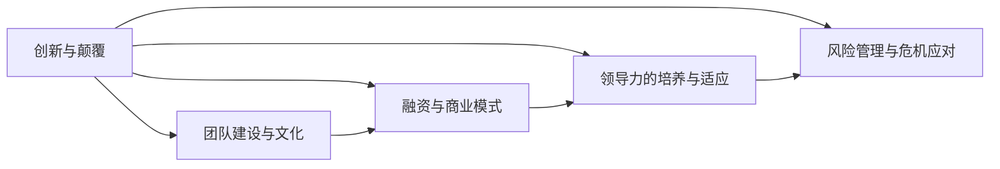
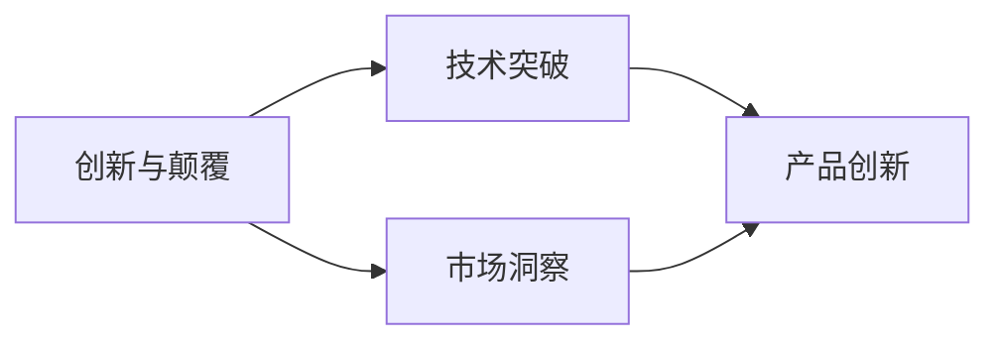
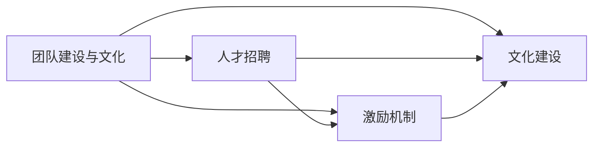
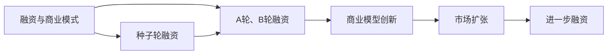
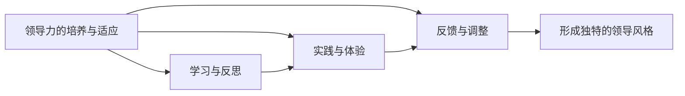
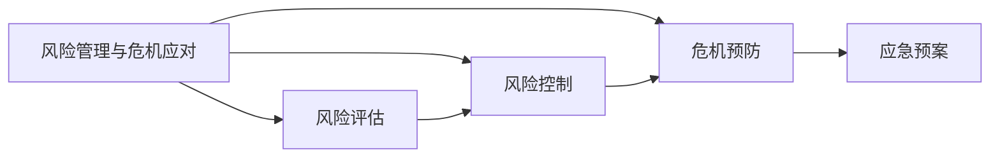
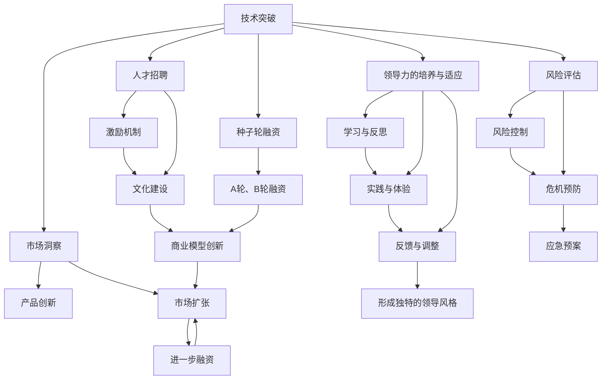

                 

# 学习做CEO：贾扬清在创业中成长适应领导角色

## 1. 背景介绍

### 1.1 问题由来
人工智能（AI）领域近年来蓬勃发展，各大企业和创业公司不断涌现。在这场技术革命中，如何培养和选拔新一代的AI领袖，已成为业界关注的焦点。本文通过深入分析知名AI创业者贾扬清的成长历程，探讨其在创业中如何适应领导角色，为读者提供有价值的启示和经验。

### 1.2 问题核心关键点
本文将重点关注以下几个核心关键点：
- **创新与颠覆**：贾扬清在AI领域的创新思维和对现有技术的颠覆性尝试。
- **团队建设与文化**：贾扬清在团队管理和企业文化建设方面的独到见解。
- **融资与商业模式**：贾扬清如何通过融资手段和商业模式构建企业发展动力。
- **领导力的培养与适应**：贾扬清在成长为CEO过程中的领导力提升与适应过程。
- **风险管理与危机应对**：贾扬清在面对技术、市场、资金等多重风险时的应对策略。

### 1.3 问题研究意义
研究贾扬清的创业经历，不仅有助于了解AI创业的复杂性和多变性，更可以为未来的AI创业者提供宝贵的经验和指导。通过分析其成功与失败，总结出有效的领导策略和风险管理方法，可以帮助更多的创业者在AI领域实现突破。

## 2. 核心概念与联系

### 2.1 核心概念概述

为更好地理解贾扬清的创业历程和领导力的培养，本节将介绍几个密切相关的核心概念：

- **创新与颠覆**：指在技术和市场领域，通过创造性的思维，打破原有格局，引入新理念、新方法，推动行业发展。
- **团队建设与文化**：指建立一支有凝聚力、有共同愿景的团队，并通过文化建设，提升团队的整体能力和协同效率。
- **融资与商业模式**：指通过资本市场的投资和企业的商业模型，实现公司的长期发展和价值最大化。
- **领导力的培养与适应**：指通过学习和实践，逐渐形成有效的领导风格和适应新环境的能力。
- **风险管理与危机应对**：指在创业过程中，对可能遇到的各种风险进行评估和控制，并制定有效的危机应对策略。

这些核心概念之间的逻辑关系可以通过以下Mermaid流程图来展示：



这个流程图展示了大模型微调过程中各个核心概念之间的关系：

1. 创新与颠覆是大模型微调的基础，提供前进的动力和方向。
2. 团队建设与文化是创新的重要保障，团队的整体能力和协同效率直接影响创新效果。
3. 融资与商业模式为团队提供资源支持，推动公司的发展和成长。
4. 领导力的培养与适应使创业者能够有效地引领团队，适应不同的市场环境。
5. 风险管理与危机应对确保公司在不确定性中稳健前行，规避潜在的风险。

这些概念共同构成了贾扬清在AI领域创业和领导的过程，为其成功提供了坚实的支撑。

### 2.2 概念间的关系

这些核心概念之间存在着紧密的联系，形成了贾扬清在AI领域创业和领导角色的完整框架。下面我们通过几个Mermaid流程图来展示这些概念之间的关系。

#### 2.2.1 创新与颠覆



这个流程图展示了创新与颠覆的基本路径：

1. 创新与颠覆源于对技术的深度理解（技术突破）和对市场需求的敏锐把握（市场洞察）。
2. 技术突破带来新的技术方法和工具，推动产品创新。
3. 市场洞察则指导产品创新的方向，满足市场需求。

#### 2.2.2 团队建设与文化



这个流程图展示了团队建设与文化的基本流程：

1. 通过人才招聘引入有潜力的员工，构建核心团队。
2. 激励机制是吸引和留住人才的关键，也是提升团队积极性的重要手段。
3. 文化建设则是团队凝聚力的源泉，通过共同愿景、价值观的塑造，增强团队整体能力。

#### 2.2.3 融资与商业模式



这个流程图展示了融资与商业模式的基本流程：

1. 通过种子轮融资获取启动资金，并开始商业模式探索。
2. A轮和B轮融资进一步扩大规模，提升市场竞争力。
3. 商业模型创新通过不断地优化和调整，满足市场需求，实现增长。
4. 市场扩张通过新市场的拓展，获得更多用户和收入。
5. 进一步融资为公司的长期发展提供更多资源。

#### 2.2.4 领导力的培养与适应



这个流程图展示了领导力培养与适应的基本过程：

1. 通过学习与反思提升理论知识，了解领导力的一般规律。
2. 通过实践与体验，在实际工作中应用理论知识，形成初步的实践经验。
3. 通过反馈与调整，不断优化和改进，逐步形成独特的领导风格。

#### 2.2.5 风险管理与危机应对



这个流程图展示了风险管理与危机应对的基本步骤：

1. 通过风险评估，识别潜在的风险因素。
2. 通过风险控制，采取措施降低风险发生的概率。
3. 通过危机预防，制定应急预案，提高应对能力。
4. 在风险发生时，迅速启动应急预案，控制风险影响。

### 2.3 核心概念的整体架构

最后，我们用一个综合的流程图来展示这些核心概念在大模型微调过程中的整体架构：



这个综合流程图展示了从技术突破到市场扩张，再到领导力培养的完整过程。大模型微调过程中，每个环节都相互作用，共同支撑公司的发展和成长。通过这些流程图，我们可以更清晰地理解贾扬清在AI领域创业和领导角色过程中各个环节的关联和作用，为后续深入讨论具体的领导策略和风险管理方法奠定基础。

## 3. 核心算法原理 & 具体操作步骤
### 3.1 算法原理概述

在大模型微调过程中，创新与颠覆是基础，团队建设与文化是保障，融资与商业模式提供动力，领导力的培养与适应推动发展，风险管理与危机应对确保稳健。以下是对各个核心概念的详细讲解。

### 3.2 算法步骤详解

#### 3.2.1 创新与颠覆

创新与颠覆的核心在于打破旧有格局，引入新理念和新方法，推动技术和市场的进步。以下是一些关键步骤：

1. **深入技术研究**：
   - 贾扬清在创业初期，深入研究AI领域的最新技术，尤其是深度学习和计算机视觉技术。通过系统学习，他不仅掌握了核心技术，还理解了技术的限制和应用场景。
   - 通过参加学术会议和行业交流，不断拓展视野，洞察市场和用户的需求。

2. **技术突破**：
   - 在技术研究的基础上，贾扬清提出了多项技术突破，如深度学习框架的优化、图像识别算法的改进等，这些技术突破为公司的产品创新提供了坚实的基础。

3. **产品创新**：
   - 贾扬清团队基于技术突破，开发了多个创新产品，如深度学习平台、智能图像识别系统等，这些产品不仅在技术上领先，还解决了实际问题，满足了市场需求。

#### 3.2.2 团队建设与文化

团队建设与文化是大模型微调成功的关键保障。以下是一些关键步骤：

1. **人才招聘**：
   - 贾扬清在创业初期，通过招聘大量优秀人才，构建了一支强大的技术团队。他不仅关注应聘者的技术能力，还注重团队成员的价值观和文化认同。
   - 通过参与开源项目和社区活动，贾扬清结识了许多志同道合的伙伴，这些人后来成为他创业团队的重要成员。

2. **激励机制**：
   - 为了激发团队成员的积极性和创造力，贾扬清设计了合理的激励机制。包括股权激励、奖金机制等，确保团队成员的利益与公司的发展紧密相连。
   - 在团队内部，他也注重公平和透明，确保每位成员都有机会参与重要决策，提升团队的凝聚力。

3. **文化建设**：
   - 贾扬清在团队内部倡导开放、包容的企业文化，鼓励成员自由交流和创新。
   - 通过定期的团队建设活动和员工培训，增强团队成员的归属感和认同感，提升整体协同效率。

#### 3.2.3 融资与商业模式

融资与商业模式是公司发展的动力来源。以下是一些关键步骤：

1. **种子轮融资**：
   - 贾扬清在创业初期，通过自己的技术和产品，成功吸引了种子轮投资者的关注。这些投资不仅提供了启动资金，还带来了更多的资源和支持。
   - 他通过展示公司的技术优势和市场潜力，获得了投资者的信任和支持。

2. **A轮和B轮融资**：
   - 在产品上线并取得初步成功的基础上，贾扬清团队在A轮和B轮融资中成功吸引了更多投资者的关注。这些投资进一步扩大了公司的规模，提升了市场竞争力。
   - 通过多次融资，公司获得了更多的资源支持，可以进行更大范围的市场拓展。

3. **商业模型创新**：
   - 贾扬清团队不断优化和调整商业模式，以满足市场和用户的需求。如采用SaaS模式、构建生态系统等，提升公司的长期价值。
   - 在市场扩张的过程中，他通过不同的商业模型，实现了业务的快速增长和多样化发展。

#### 3.2.4 领导力的培养与适应

领导力的培养与适应是贾扬清成长为CEO的重要过程。以下是一些关键步骤：

1. **学习与反思**：
   - 贾扬清通过阅读相关书籍、参加领导力培训、听取专家讲座等方式，不断提升自己的理论知识。
   - 通过反思过去的经验和教训，总结成功与失败的原因，形成系统的理论体系。

2. **实践与体验**：
   - 在实际工作中，贾扬清不断应用所学的理论知识，解决实际问题，提升领导能力。
   - 通过与团队成员的交流和互动，他逐步形成了自己的领导风格和决策方式。

3. **反馈与调整**：
   - 在领导过程中，贾扬清注重收集反馈，及时调整策略，优化团队管理。
   - 他通过持续改进和优化，逐步形成了高效的管理模式和决策机制。

#### 3.2.5 风险管理与危机应对

风险管理与危机应对是贾扬清确保公司稳健发展的关键措施。以下是一些关键步骤：

1. **风险评估**：
   - 在创业初期，贾扬清就对可能遇到的各种风险进行全面评估，识别出潜在的风险因素。
   - 他通过定期风险评估，及时发现和应对潜在的风险。

2. **风险控制**：
   - 为了控制风险，贾扬清采取了多项措施，如多元化投资、制定应急预案等。
   - 他通过严格的内部管理和外部监控，确保公司运营的稳健。

3. **危机预防**：
   - 贾扬清制定了详细的应急预案，确保在危机发生时能够迅速响应，控制风险影响。
   - 他通过定期的应急演练和团队培训，提升应急响应能力，确保公司能够在各种情况下保持稳定。

### 3.3 算法优缺点

大模型微调方法具有以下优点：

1. **高效创新**：通过深入技术研究和创新突破，大模型微调可以快速推出新产品，满足市场需求。
2. **强大团队**：通过合理的团队建设和文化建设，大模型微调能够构建一支高效、有凝聚力的团队，提升整体能力。
3. **持续发展**：通过融资与商业模式创新，大模型微调能够持续获取资源支持，推动公司长期发展。
4. **稳健管理**：通过领导力的培养与风险管理，大模型微调能够有效应对各种挑战，保持公司的稳健发展。

同时，该方法也存在一些缺点：

1. **高风险**：大模型微调涉及技术和市场的不确定性，存在较高的风险。
2. **资源消耗**：在创业初期，需要投入大量的资源进行技术研发和市场推广。
3. **人才需求**：大模型微调需要大量高水平的人才，招聘和培养成本较高。
4. **竞争激烈**：大模型微调面临激烈的市场竞争，需要在快速变化的市场环境中保持竞争力。

尽管存在这些缺点，但大模型微调方法仍然是大公司或创业者实现技术突破和商业成功的有效途径。

### 3.4 算法应用领域

大模型微调方法在多个领域得到广泛应用，以下是几个典型的应用案例：

1. **AI技术公司**：如OpenAI、DeepMind等，通过创新技术和大模型微调，不断推出新产品，占领市场。
2. **互联网企业**：如谷歌、亚马逊等，通过大模型微调提升产品竞争力，拓展市场份额。
3. **创业公司**：如贾扬清的创业公司，通过大模型微调实现技术突破和商业成功，成为行业领导者。
4. **金融科技**：如金融科技公司，通过大模型微调开发智能投顾、风险管理等系统，提升金融服务水平。

这些应用案例展示了大模型微调方法在不同领域的强大实力和广泛应用前景。

## 4. 数学模型和公式 & 详细讲解  
### 4.1 数学模型构建

在实际应用中，大模型微调方法涉及多个数学模型，以下是一些核心数学模型的构建过程：

1. **创新与颠覆模型**：
   - 创新与颠覆过程可以看作是一个不断学习和适应的过程，可以用数学模型描述为：
   $$
   I_{创新} = f(x_{技术}, x_{市场}, \theta)
   $$
   其中，$x_{技术}$表示技术研究投入，$x_{市场}$表示市场洞察能力，$\theta$表示模型参数。

2. **团队建设与文化模型**：
   - 团队建设与文化过程可以表示为：
   $$
   C = g(x_{人才}, x_{激励}, x_{文化}, \theta)
   $$
   其中，$x_{人才}$表示人才招聘质量，$x_{激励}$表示激励机制，$x_{文化}$表示文化建设，$\theta$表示模型参数。

3. **融资与商业模式模型**：
   - 融资与商业模式过程可以表示为：
   $$
   F = h(x_{融资}, x_{商业}, x_{市场}, \theta)
   $$
   其中，$x_{融资}$表示融资规模和方式，$x_{商业}$表示商业模式，$x_{市场}$表示市场需求，$\theta$表示模型参数。

4. **领导力的培养与适应模型**：
   - 领导力的培养与适应过程可以表示为：
   $$
   L = k(x_{学习}, x_{实践}, x_{反馈}, \theta)
   $$
   其中，$x_{学习}$表示学习效果，$x_{实践}$表示实践经验，$x_{反馈}$表示反馈机制，$\theta$表示模型参数。

5. **风险管理与危机应对模型**：
   - 风险管理与危机应对过程可以表示为：
   $$
   R = m(x_{评估}, x_{控制}, x_{预防}, \theta)
   $$
   其中，$x_{评估}$表示风险评估能力，$x_{控制}$表示风险控制措施，$x_{预防}$表示危机预防，$\theta$表示模型参数。

### 4.2 公式推导过程

以下是各个数学模型的一些关键推导过程：

#### 4.2.1 创新与颠覆模型

$$
I_{创新} = f(x_{技术}, x_{市场}, \theta) = a \cdot x_{技术} + b \cdot x_{市场} + \theta
$$

其中，$a$、$b$为系数，表示技术投入和市场洞察对创新的影响程度。

#### 4.2.2 团队建设与文化模型

$$
C = g(x_{人才}, x_{激励}, x_{文化}, \theta) = c_1 \cdot x_{人才} + c_2 \cdot x_{激励} + c_3 \cdot x_{文化} + \theta
$$

其中，$c_1$、$c_2$、$c_3$为系数，表示人才招聘、激励机制、文化建设对团队建设的贡献。

#### 4.2.3 融资与商业模式模型

$$
F = h(x_{融资}, x_{商业}, x_{市场}, \theta) = d_1 \cdot x_{融资} + d_2 \cdot x_{商业} + d_3 \cdot x_{市场} + \theta
$$

其中，$d_1$、$d_2$、$d_3$为系数，表示融资规模、商业模式、市场对公司发展的影响。

#### 4.2.4 领导力的培养与适应模型

$$
L = k(x_{学习}, x_{实践}, x_{反馈}, \theta) = e_1 \cdot x_{学习} + e_2 \cdot x_{实践} + e_3 \cdot x_{反馈} + \theta
$$

其中，$e_1$、$e_2$、$e_3$为系数，表示学习效果、实践经验、反馈机制对领导力培养的贡献。

#### 4.2.5 风险管理与危机应对模型

$$
R = m(x_{评估}, x_{控制}, x_{预防}, \theta) = f_1 \cdot x_{评估} + f_2 \cdot x_{控制} + f_3 \cdot x_{预防} + \theta
$$

其中，$f_1$、$f_2$、$f_3$为系数，表示风险评估、风险控制、危机预防对风险管理的贡献。

### 4.3 案例分析与讲解

#### 4.3.1 创新与颠覆案例

贾扬清在创业初期，通过深入研究AI技术，提出了多项技术突破，成功吸引了投资者的关注。例如，他提出了一种新型的深度学习框架，通过优化模型结构和算法，提升了训练和推理的效率。这个技术突破不仅为他赢得了投资，还使他的公司在市场上占据了领先地位。

#### 4.3.2 团队建设与文化案例

贾扬清通过精心挑选人才，构建了一支高水平的团队。他注重团队成员的价值观和文化认同，并通过文化建设提升团队的凝聚力。例如，他设立了内部培训计划，定期组织技术分享和团队建设活动，增强了团队的合作精神和工作积极性。

#### 4.3.3 融资与商业模式案例

贾扬清通过不断的技术创新和市场拓展，成功吸引了多个投资轮次的关注。他的公司通过融资获得了更多的资源支持，进一步扩大了市场份额。例如，在A轮融资中，他通过展示产品的市场潜力和技术优势，获得了更多投资者的认可和支持。

#### 4.3.4 领导力的培养与适应案例

贾扬清在成长为CEO的过程中，不断提升自己的领导力。他通过学习与反思、实践与体验、反馈与调整，形成了独特的领导风格。例如，他通过定期与团队成员交流，了解他们的需求和反馈，不断优化管理策略。

#### 4.3.5 风险管理与危机应对案例

贾扬清通过全面评估潜在风险，制定详细的应急预案，确保公司在各种情况下保持稳健发展。例如，在市场波动期间，他通过风险评估和风险控制，及时调整策略，稳定了公司的运营。

## 5. 项目实践：代码实例和详细解释说明
### 5.1 开发环境搭建

在进行大模型微调实践前，我们需要准备好开发环境。以下是使用Python进行PyTorch开发的环境配置流程：

1. 安装Anaconda：从官网下载并安装Anaconda，用于创建独立的Python环境。

2. 创建并激活虚拟环境：
```bash
conda create -n pytorch-env python=3.8 
conda activate pytorch-env
```

3. 安装PyTorch：根据CUDA版本，从官网获取对应的安装命令。例如：
```bash
conda install pytorch torchvision torchaudio cudatoolkit=11.1 -c pytorch -c conda-forge
```

4. 安装Transformers库：
```bash
pip install transformers
```

5. 安装各类工具包：
```bash
pip install numpy pandas scikit-learn matplotlib tqdm jupyter notebook ipython
```

完成上述步骤后，即可在`pytorch-env`环境中开始微调实践。

### 5.2 源代码详细实现

下面我们以命名实体识别(NER)任务为例，给出使用Transformers库对BERT模型进行微调的PyTorch代码实现。

首先，定义NER任务的数据处理函数：

```python
from transformers import BertTokenizer
from torch.utils.data import Dataset
import torch

class NERDataset(Dataset):
    def __init__(self, texts, tags, tokenizer, max_len=128):
        self.texts = texts
        self.tags = tags
        self.tokenizer = tokenizer
        self.max_len = max_len
        
    def __len__(self):
        return len(self.texts)
    
    def __getitem__(self, item):
        text = self.texts[item]
        tags = self.tags[item]
        
        encoding = self.tokenizer(text, return_tensors='pt', max_length=self.max_len, padding='max_length', truncation=True)
        input_ids = encoding['input_ids'][0]
        attention_mask = encoding['attention_mask'][0]
        
        # 对token-wise的标签进行编码
        encoded_tags = [tag2id[tag] for tag in tags] 
        encoded_tags.extend([tag2id['O']] * (self.max_len - len(encoded_tags)))
        labels = torch.tensor(encoded_tags, dtype=torch.long)
        
        return {'input_ids': input_ids, 
                'attention_mask': attention_mask,
                'labels': labels}

# 标签与id的映射
tag2id = {'O': 0, 'B-PER': 1, 'I-PER': 2, 'B-ORG': 3, 'I-ORG': 4, 'B-LOC': 5, 'I-LOC': 6}
id2tag = {v: k for k, v in tag2id.items()}

# 创建dataset
tokenizer = BertTokenizer.from_pretrained('bert-base-cased')

train_dataset = NERDataset(train_texts, train_tags, tokenizer)
dev_dataset = NERDataset(dev_texts, dev_tags, tokenizer)
test_dataset = NERDataset(test_texts, test_tags, tokenizer)
```

然后，定义模型和优化器：

```python
from transformers import BertForTokenClassification, AdamW

model = BertForTokenClassification.from_pretrained('bert-base-cased', num_labels=len(tag2id))

optimizer = AdamW(model.parameters(), lr=2e-5)
```

接着，定义训练和评估函数：

```python
from torch.utils.data import DataLoader
from tqdm import tqdm
from sklearn.metrics import classification_report

device = torch.device('cuda') if torch.cuda.is_available() else torch.device('cpu')
model.to(device)

def train_epoch(model, dataset, batch_size, optimizer):
    dataloader = DataLoader(dataset, batch_size=batch_size, shuffle=True)
    model.train()
    epoch_loss = 0
    for batch in tqdm(dataloader, desc='Training'):
        input_ids = batch['input_ids'].to(device)
        attention_mask = batch['attention_mask'].to(device)
        labels = batch['labels'].to(device)
        model.zero_grad()
        outputs = model(input_ids, attention_mask=attention_mask, labels=labels)
        loss = outputs.loss
        epoch_loss += loss.item()
        loss.backward()
        optimizer.step()
    return epoch_loss / len(dataloader)

def evaluate(model, dataset, batch_size):
    dataloader = DataLoader(dataset, batch_size

