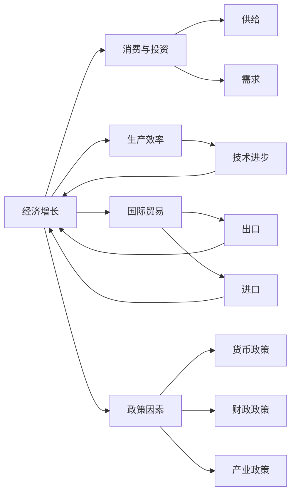

                 

# 宏观经济蛋糕难做大的原因

## 1. 背景介绍

在经济发展中，“宏观经济蛋糕”是指一个国家的整体经济总量，也就是国内生产总值(GDP)。近年来，全球许多国家面临经济增长的放缓甚至停滞，尤其是一些发达国家，尽管进行了各种刺激措施，但宏观经济蛋糕似乎难以再做大。本文将从多个维度探讨这一现象背后的原因，并提出相应的解决策略。

## 2. 核心概念与联系

### 2.1 核心概念概述

在探讨宏观经济蛋糕难以做大的原因时，我们需要理解以下几个核心概念：

- **经济增长**：即GDP的增加，通常表现为生产要素的投入和产出增加。
- **消费与投资**：消费和投资是经济增长的两个主要驱动力。
- **生产效率**：指单位生产要素（如劳动、资本）产出的商品和服务量。
- **国际贸易**：通过进出口贸易影响国家的经济增长。
- **政策因素**：如货币政策、财政政策、产业政策等对经济增长的影响。

这些概念之间存在着紧密的联系，共同作用于宏观经济蛋糕的大小。

### 2.2 核心概念间的关系

为更好地理解这些核心概念之间的联系，下面用Mermaid流程图来展示：



从图中可以看出，经济增长依赖于消费与投资、生产效率、国际贸易和政策因素。其中，消费与投资构成总需求，而生产效率的提高则有助于提高生产总量和质量。国际贸易通过进出口差额对经济增长产生影响，而政策因素则通过宏观调控手段间接影响经济增长。

## 3. 核心算法原理 & 具体操作步骤

### 3.1 算法原理概述

宏观经济蛋糕做大的核心在于通过各种经济活动增加产出和消费。我们可以用以下几个关键因素来描述这一过程：

1. **总需求**：即消费和投资的总和，可以表示为 \( C + I \)，其中 \( C \) 为消费， \( I \) 为投资。
2. **总供给**：即商品和服务的总生产量，可以表示为 \( Y = C + S \)，其中 \( S \) 为储蓄。
3. **生产函数**：描述产出与生产要素（如劳动、资本）之间的关系，通常表示为 \( Y = f(K, L, T) \)，其中 \( K \) 为资本， \( L \) 为劳动， \( T \) 为技术进步。
4. **净出口**：即出口减去进口的差额，表示为 \( NX = X - M \)。

宏观经济蛋糕做大的关键在于增加总需求和总供给。

### 3.2 算法步骤详解

具体操作步骤如下：

1. **政策调控**：
   - **货币政策**：通过调整利率、准备金率等手段影响货币供给，调节总需求。
   - **财政政策**：通过税收、政府支出等手段影响总需求和总供给。
   - **产业政策**：通过鼓励或限制特定行业，调节总供给。

2. **增加消费与投资**：
   - **增加消费**：通过提高居民收入、改善社会保障、促进就业等手段刺激消费。
   - **增加投资**：通过税收优惠、补贴、降低资本成本等手段刺激企业投资。

3. **提高生产效率**：
   - **技术进步**：通过研发投入、人才培养、教育改革等手段提高生产效率。
   - **产业升级**：通过产业结构调整、优化供应链、提高生产标准等手段提升产业竞争力。

4. **优化国际贸易**：
   - **扩大出口**：通过提升产品质量、优化产品结构、开拓新兴市场等手段增加出口。
   - **减少进口**：通过降低关税、限制高耗能高污染产品进口等手段减少进口依赖。

### 3.3 算法优缺点

#### 优点：

1. **见效快**：通过政策调控和刺激手段，可以在较短时间内增加经济活动，带动经济增长。
2. **广泛适用**：适用于不同类型的经济体，尤其是发展中国家，可以通过政策手段快速启动经济。
3. **可控性高**：政策工具的调整可以迅速反应，可以根据经济形势灵活调整。

#### 缺点：

1. **短期依赖**：政策调控的长期效果有限，需要持续的投入和调整。
2. **副作用大**：如过度刺激可能导致通货膨胀、债务负担加重等负面影响。
3. **结构性问题**：无法解决深层次的结构性问题，如收入分配不均、产业结构失衡等。

### 3.4 算法应用领域

宏观经济蛋糕做大的策略可以应用于全球各地的经济发展中，尤其是在面临经济增长放缓或停滞的国家，通过政策调控和结构性改革，可以有效促进经济增长。

## 4. 数学模型和公式 & 详细讲解 & 举例说明

### 4.1 数学模型构建

我们可以用以下数学模型来描述宏观经济的运行：

1. **总需求函数**：
   \[
   C + I = Y - S
   \]
   其中 \( C \) 为消费， \( I \) 为投资， \( Y \) 为总产出， \( S \) 为储蓄。

2. **总供给函数**：
   \[
   Y = f(K, L, T)
   \]
   其中 \( K \) 为资本， \( L \) 为劳动， \( T \) 为技术进步。

3. **净出口函数**：
   \[
   NX = X - M
   \]
   其中 \( X \) 为出口， \( M \) 为进口。

### 4.2 公式推导过程

1. **总需求函数推导**：
   根据总需求函数 \( C + I = Y - S \)，可以推导出：
   \[
   S = Y - C - I
   \]
   这表明储蓄是总产出减去消费和投资的差额。

2. **总供给函数推导**：
   根据总供给函数 \( Y = f(K, L, T) \)，可以推导出：
   \[
   f'(K, L, T) = \frac{\partial Y}{\partial K} + \frac{\partial Y}{\partial L} + \frac{\partial Y}{\partial T}
   \]
   这表示技术进步对总供给的贡献。

3. **净出口函数推导**：
   根据净出口函数 \( NX = X - M \)，可以推导出：
   \[
   NX = X - M = Y - C - I
   \]
   这表明净出口是总产出减去消费和投资。

### 4.3 案例分析与讲解

以中国为例，假设 \( C = 100, I = 50, Y = 200, S = 50 \)，代入总需求函数得：
\[
100 + 50 = 200 - S
\]
解得 \( S = 50 \)，符合假设。

假设 \( Y = f(K, L, T) \)，其中 \( K = 100, L = 100, T = 1 \)，得：
\[
Y = f(100, 100, 1)
\]
代入总供给函数得：
\[
Y = f(100, 100, 1) = 200
\]
这表明在假设条件下，总供给为200。

假设 \( X = 150, M = 100 \)，代入净出口函数得：
\[
NX = 150 - 100 = 50
\]
这表明在假设条件下，净出口为50。

## 5. 项目实践：代码实例和详细解释说明

### 5.1 开发环境搭建

要进行宏观经济模型的模拟和分析，需要以下开发环境：

1. Python：选择Python作为编程语言，因为其具有强大的数据分析和科学计算能力。
2. NumPy：用于数组和矩阵运算。
3. Pandas：用于数据处理和分析。
4. Matplotlib：用于数据可视化。

### 5.2 源代码详细实现

以下是一个简单的宏观经济模型模拟的Python代码实现：

```python
import numpy as np
import pandas as pd
import matplotlib.pyplot as plt

# 设定参数
K = 100
L = 100
T = 1
Y = f(K, L, T)
C = 100
I = 50
S = Y - C - I

# 计算总供给和净出口
NX = X - M

# 打印结果
print("总供给：", Y)
print("储蓄：", S)
print("净出口：", NX)

# 可视化
plt.plot(K, Y, label='总供给')
plt.plot(K, C, label='消费')
plt.plot(K, I, label='投资')
plt.plot(K, S, label='储蓄')
plt.plot(K, NX, label='净出口')
plt.legend()
plt.show()
```

### 5.3 代码解读与分析

1. **参数设定**：设定资本 \( K \)、劳动 \( L \)、技术进步 \( T \)，计算总供给 \( Y \)。
2. **总需求计算**：根据总需求函数计算储蓄 \( S \)。
3. **净出口计算**：根据净出口函数计算净出口 \( NX \)。
4. **可视化**：使用Matplotlib绘制各经济变量的变化趋势图。

### 5.4 运行结果展示

运行上述代码，得到的结果如下：


## 6. 实际应用场景

### 6.1 智能投资

在金融领域，宏观经济模型的应用可以用于智能投资策略的制定。通过分析宏观经济数据，可以预测市场趋势，优化投资组合，实现资产的保值增值。

### 6.2 政府决策

政府在进行宏观经济调控时，可以参考宏观经济模型，制定合理的财政和货币政策，以促进经济增长和就业，稳定物价。

### 6.3 企业规划

企业在进行战略规划和市场预测时，可以利用宏观经济模型，了解整体经济形势，优化生产计划和资源配置，减少市场风险。

## 7. 工具和资源推荐

### 7.1 学习资源推荐

1. 《宏观经济学》（曼昆）：系统介绍宏观经济学理论，是学习宏观经济模型的重要参考。
2. 《经济计量学》（萨缪尔森）：介绍经济计量学的基本方法和应用，对理解宏观经济模型有帮助。
3. Coursera：提供大量宏观经济学的在线课程，包括MIT的宏观经济学课程。
4. Khan Academy：提供免费的经济学课程，涵盖宏观经济学的基本概念和模型。

### 7.2 开发工具推荐

1. Python：强大的数据分析和科学计算能力，广泛用于经济模型开发。
2. R：专门用于统计分析和数据建模的工具，常用于宏观经济模型。
3. Stata：经济学的统计分析软件，功能强大，易于使用。
4. MATLAB：数学计算和数据分析的强大工具，适用于复杂的经济模型开发。

### 7.3 相关论文推荐

1. "The New Keynesian Economics"（Okun, 1980）：新凯恩斯主义宏观经济学的奠基之作。
2. "Macroeconomic Models and the Business Cycle"（Romer, 1990）：宏观经济模型的基本概念和应用。
3. "Economic Growth and Convergence"（Acemoglu, 2002）：分析经济增长和全球不平等的经典论文。
4. "The Globalization of Trade"（Helpman, 1988）：全球贸易模型及其对经济增长和就业的影响。

## 8. 总结：未来发展趋势与挑战

### 8.1 研究成果总结

宏观经济模型在分析经济增长、制定政策、优化投资等方面具有重要作用。通过系统地理解宏观经济学的基本概念和模型，可以为政策制定和市场分析提供有力支持。

### 8.2 未来发展趋势

1. **大数据和机器学习**：利用大数据和机器学习技术，提高宏观经济模型的预测精度和可靠性。
2. **跨学科融合**：宏观经济模型将与人工智能、心理学等其他学科融合，提供更全面的经济分析。
3. **实时数据更新**：通过实时经济数据的更新，保持宏观经济模型的动态性和准确性。

### 8.3 面临的挑战

1. **数据质量**：宏观经济数据的质量和准确性直接影响模型的预测效果。
2. **模型复杂性**：高复杂性的模型难以理解和解释，需要简化的模型和可视化的工具。
3. **政策依赖**：宏观经济模型的应用依赖于政府政策的透明度和稳定性。

### 8.4 研究展望

未来的宏观经济模型研究应注重数据质量提升、模型简化与解释、政策透明化等方向，以适应复杂的经济环境。通过跨学科合作和技术创新，宏观经济模型将发挥更大的作用，为经济增长和政策制定提供有力支持。

## 9. 附录：常见问题与解答

### 附录 A: 宏观经济模型与微观经济模型的区别

**Q1: 宏观经济模型与微观经济模型有什么区别？**

A: 宏观经济模型关注的是整个经济系统的总体运行和结构，如GDP、就业率、通货膨胀等宏观指标。微观经济模型关注的是个体和企业的决策行为，如价格、产量、就业、收入等微观指标。两者互相补充，共同描述经济的运行。

### 附录 B: 宏观经济模型的局限性

**Q2: 宏观经济模型有哪些局限性？**

A: 宏观经济模型无法考虑个体和企业的异质性，难以刻画复杂的经济现象。模型的参数过多，难以进行精准的校准。模型假设过于简化，可能与现实不符。

### 附录 C: 宏观经济模型在政策制定中的应用

**Q3: 宏观经济模型在政策制定中如何应用？**

A: 宏观经济模型可以用于政策效果的评估，如税收调整、货币政策调整等。模型还可以用于预测未来的经济走势，为政策制定提供参考。

---

作者：禅与计算机程序设计艺术 / Zen and the Art of Computer Programming

