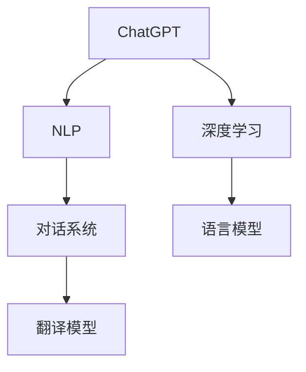
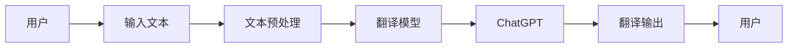
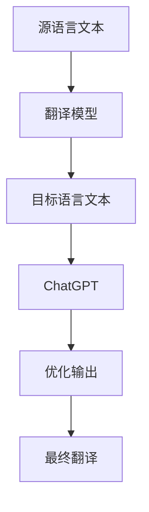
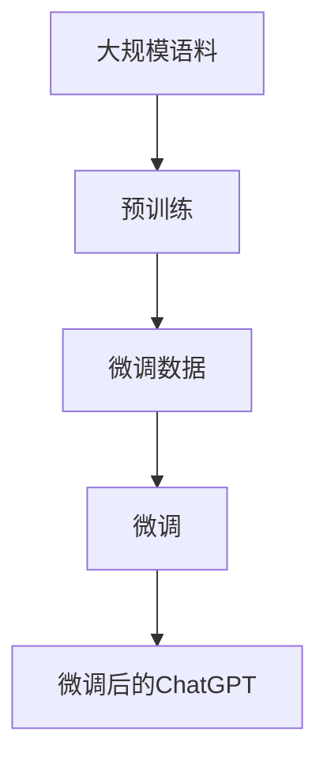
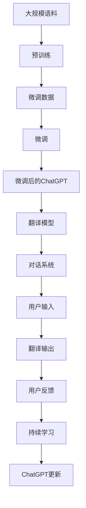

                 

# 实战一：基于 ChatGPT 开发智能翻译助手

> 关键词：
   - 智能翻译
   - 多语言支持
   - 实时翻译
   - 对话交互
   - 语言模型
   - 深度学习
   - 自然语言处理(NLP)

## 1. 背景介绍

### 1.1 问题由来
随着全球化的不断推进，跨语言交流的需求日益增长。然而，语言之间的巨大差异和复杂性常常成为障碍。传统的翻译工具往往需要人工介入，费时费力且翻译质量难以保证。随着人工智能技术的不断发展，基于深度学习的语言模型开始被应用于智能翻译领域，大幅提升了翻译效率和准确性。

ChatGPT作为OpenAI推出的最新一代大语言模型，具备强大的语言理解能力和自然语言生成能力。通过利用ChatGPT构建智能翻译助手，不仅能够实现实时翻译，还能在对话交互中准确理解用户意图，生成自然流畅的翻译结果。

### 1.2 问题核心关键点
ChatGPT智能翻译助手的开发涉及以下核心关键点：

- 选择合适的语言模型：ChatGPT模型作为预训练的基底模型，提供丰富的语言表示能力。
- 搭建翻译模块：利用ChatGPT的解码器，实现语言之间的自动翻译。
- 交互界面设计：构建简洁直观的用户界面，支持自然语言输入和输出。
- 集成测试与优化：在实际应用场景中进行测试和优化，提升翻译质量和用户体验。

### 1.3 问题研究意义
基于ChatGPT的智能翻译助手，可以极大地提升跨语言交流的效率和准确性。它不仅能解决语言不通的问题，还能在对话中提供即时反馈，辅助用户完成翻译任务。此外，通过ChatGPT的多语言能力，可以轻松扩展到多种语言，满足不同地区和文化用户的需求。

开发智能翻译助手，不仅可以提升语言处理技术的应用场景，还能为全球化企业提供强有力的支持。在实际操作中，智能翻译助手可以应用于商务交流、教育培训、旅游服务等多个领域，为用户提供无缝的跨语言体验。

## 2. 核心概念与联系

### 2.1 核心概念概述

为更好地理解基于ChatGPT的智能翻译助手的开发过程，本节将介绍几个密切相关的核心概念：

- ChatGPT：OpenAI推出的最新一代大语言模型，具备强大的自然语言处理能力。
- 自然语言处理(NLP)：使用计算机对自然语言进行分析和理解的技术，涵盖语言模型、文本分类、情感分析等。
- 深度学习：一种利用神经网络进行模型训练和预测的技术，广泛应用于图像识别、语音识别、翻译等领域。
- 对话系统：一种能够理解和生成自然语言对话的技术，广泛应用于客服、智能助理等场景。
- 语言模型：用于评估文本概率的模型，通常采用自回归或自编码的方式进行训练。
- 翻译模型：将一种语言的文本翻译成另一种语言的语言模型。

这些核心概念之间的逻辑关系可以通过以下Mermaid流程图来展示：



这个流程图展示了大语言模型ChatGPT与NLP、深度学习、对话系统和翻译模型之间的联系：

1. ChatGPT作为预训练的基底模型，提供丰富的语言表示能力，并通过深度学习进行模型训练和优化。
2. 基于ChatGPT的解码器，可以构建翻译模型，实现语言之间的自动翻译。
3. 利用NLP技术，可以构建对话系统，使翻译助手具备自然语言理解能力。
4. 对话系统与翻译模型的结合，可以实现实时翻译和对话交互。

### 2.2 概念间的关系

这些核心概念之间存在着紧密的联系，形成了智能翻译助手的完整生态系统。下面我通过几个Mermaid流程图来展示这些概念之间的关系。

#### 2.2.1 智能翻译助手的整体架构



这个流程图展示了智能翻译助手从用户输入文本到生成翻译输出的整体流程：

1. 用户输入待翻译的文本。
2. 文本预处理模块对输入文本进行清洗和分词等预处理。
3. 翻译模型利用ChatGPT的解码器，将源语言文本翻译成目标语言文本。
4. ChatGPT对翻译结果进行进一步优化和校正。
5. 翻译输出模块将处理后的文本返回给用户。

#### 2.2.2 翻译模型与ChatGPT的结合



这个流程图展示了翻译模型与ChatGPT的结合过程：

1. 源语言文本被输入到翻译模型。
2. 翻译模型利用ChatGPT的解码器，生成目标语言文本。
3. ChatGPT对生成的文本进行进一步优化和校验。
4. 最终输出的翻译文本返回给用户。

#### 2.2.3 ChatGPT的训练与微调



这个流程图展示了ChatGPT的训练与微调过程：

1. 利用大规模语料进行预训练，获得基础的语言表示能力。
2. 收集特定的翻译数据集，用于微调ChatGPT，提升其在翻译任务上的表现。
3. 通过微调过程，更新ChatGPT的参数，使其适应翻译任务的要求。
4. 微调后的ChatGPT模型在实际应用中表现出更高的翻译质量和稳定性。

### 2.3 核心概念的整体架构

最后，我们用一个综合的流程图来展示这些核心概念在大语言模型微调过程中的整体架构：



这个综合流程图展示了从预训练到微调，再到翻译模型构建和对话系统集成的完整过程：

1. 利用大规模语料进行预训练，获得基础的语言表示能力。
2. 收集特定的翻译数据集，用于微调ChatGPT，提升其在翻译任务上的表现。
3. 通过微调过程，更新ChatGPT的参数，使其适应翻译任务的要求。
4. 基于微调后的ChatGPT构建翻译模型，实现语言之间的自动翻译。
5. 构建对话系统，使翻译助手具备自然语言理解能力。
6. 利用用户输入和反馈数据进行持续学习，更新ChatGPT模型。

通过这些流程图，我们可以更清晰地理解ChatGPT智能翻译助手开发过程中各个核心概念的关系和作用，为后续深入讨论具体的开发步骤和技术细节奠定基础。

## 3. 核心算法原理 & 具体操作步骤
### 3.1 算法原理概述

基于ChatGPT的智能翻译助手，本质上是一个基于深度学习的文本生成和自然语言理解任务。其核心思想是：将ChatGPT作为预训练语言模型，通过微调使其适应特定翻译任务，然后利用其解码器进行自动翻译，结合对话系统的交互功能，实现智能翻译和实时反馈。

形式化地，假设ChatGPT预训练模型为 $M_{\theta}$，其中 $\theta$ 为预训练得到的模型参数。给定源语言文本 $x$ 和目标语言 $y$，微调的目标是找到新的模型参数 $\hat{\theta}$，使得：

$$
\hat{\theta}=\mathop{\arg\min}_{\theta} \mathcal{L}(M_{\theta},(x,y))
$$

其中 $\mathcal{L}$ 为针对翻译任务的损失函数，用于衡量模型预测输出与真实翻译之间的差异。常见的损失函数包括交叉熵损失、均方误差损失等。

通过梯度下降等优化算法，微调过程不断更新模型参数 $\theta$，最小化损失函数 $\mathcal{L}$，使得模型输出逼近真实翻译。由于 $\theta$ 已经通过预训练获得了较好的初始化，因此即便在小规模数据集上微调，也能较快收敛到理想的模型参数 $\hat{\theta}$。

### 3.2 算法步骤详解

基于ChatGPT的智能翻译助手开发过程主要包括以下几个关键步骤：

**Step 1: 准备预训练模型和数据集**
- 选择合适的预训练语言模型 $M_{\theta}$ 作为初始化参数，如ChatGPT等。
- 准备翻译任务的数据集 $D=\{(x_i, y_i)\}_{i=1}^N$，其中 $x_i$ 为源语言文本，$y_i$ 为目标语言翻译结果。

**Step 2: 添加任务适配层**
- 根据翻译任务类型，设计合适的输出层和损失函数。
- 对于文本翻译任务，通常使用语言模型的解码器输出概率分布，并以负对数似然为损失函数。

**Step 3: 设置微调超参数**
- 选择合适的优化算法及其参数，如AdamW、SGD等，设置学习率、批大小、迭代轮数等。
- 设置正则化技术及强度，包括权重衰减、Dropout、Early Stopping等。
- 确定冻结预训练参数的策略，如仅微调顶层，或全部参数都参与微调。

**Step 4: 执行梯度训练**
- 将训练集数据分批次输入模型，前向传播计算损失函数。
- 反向传播计算参数梯度，根据设定的优化算法和学习率更新模型参数。
- 周期性在验证集上评估模型性能，根据性能指标决定是否触发 Early Stopping。
- 重复上述步骤直到满足预设的迭代轮数或 Early Stopping 条件。

**Step 5: 测试和部署**
- 在测试集上评估微调后模型 $M_{\hat{\theta}}$ 的性能，对比微调前后的翻译质量。
- 使用微调后的模型对新样本进行翻译，集成到实际的应用系统中。
- 持续收集新的数据，定期重新微调模型，以适应数据分布的变化。

以上是基于深度学习的智能翻译助手开发的一般流程。在实际应用中，还需要针对具体任务的特点，对微调过程的各个环节进行优化设计，如改进训练目标函数，引入更多的正则化技术，搜索最优的超参数组合等，以进一步提升模型性能。

### 3.3 算法优缺点

基于ChatGPT的智能翻译助手具有以下优点：
1. 简单高效。只需准备少量标注数据，即可对预训练模型进行快速适配，获得较大的性能提升。
2. 通用适用。适用于各种翻译任务，包括句子翻译、段落翻译、长文本翻译等。
3. 实时性高。基于深度学习的自动翻译，能够实现实时翻译，适应对话系统的即时要求。
4. 可扩展性强。通过微调ChatGPT，可以轻松扩展到多种语言，适应不同语言的用户需求。

同时，该方法也存在一定的局限性：
1. 依赖标注数据。微调的效果很大程度上取决于标注数据的质量和数量，获取高质量标注数据的成本较高。
2. 迁移能力有限。当目标语言与预训练数据的分布差异较大时，微调的性能提升有限。
3. 负面效果传递。预训练模型的固有偏见、有害信息等，可能通过微调传递到下游任务，造成负面影响。
4. 可解释性不足。微调模型的决策过程通常缺乏可解释性，难以对其推理逻辑进行分析和调试。

尽管存在这些局限性，但就目前而言，基于深度学习的微调方法仍是最主流范式。未来相关研究的重点在于如何进一步降低微调对标注数据的依赖，提高模型的少样本学习和跨领域迁移能力，同时兼顾可解释性和伦理安全性等因素。

### 3.4 算法应用领域

基于ChatGPT的智能翻译助手已经在多个领域得到了广泛应用，例如：

- 商务翻译：在跨国商务交流中，智能翻译助手可以快速准确地翻译商务文件、邮件、聊天记录等，帮助企业更高效地进行跨国合作。
- 旅游服务：在旅游中，智能翻译助手能够实时翻译菜单、路线指南、景区介绍等，提升游客的体验和便利性。
- 教育培训：在语言学习中，智能翻译助手可以辅助学生进行文本阅读、听力理解、口语练习等，提高学习效果。
- 法律服务：在法律咨询中，智能翻译助手可以快速翻译法律文件、案例分析等，辅助律师进行案件研究。
- 金融服务：在跨境金融交易中，智能翻译助手能够实时翻译交易文档、报告等，提高交易效率和准确性。

除了上述这些经典应用外，智能翻译助手还被创新性地应用到更多场景中，如新闻报道、娱乐传媒、社交媒体等，为人们的跨语言交流带来更多便利。

## 4. 数学模型和公式 & 详细讲解

### 4.1 数学模型构建

本节将使用数学语言对基于深度学习的智能翻译助手的微调过程进行更加严格的刻画。

记ChatGPT预训练模型为 $M_{\theta}$，其中 $\theta$ 为预训练得到的模型参数。假设翻译任务的数据集为 $D=\{(x_i, y_i)\}_{i=1}^N$，其中 $x_i$ 为源语言文本，$y_i$ 为目标语言翻译结果。

定义模型 $M_{\theta}$ 在数据样本 $(x,y)$ 上的损失函数为 $\ell(M_{\theta}(x),y)$，则在数据集 $D$ 上的经验风险为：

$$
\mathcal{L}(\theta) = \frac{1}{N} \sum_{i=1}^N \ell(M_{\theta}(x_i),y_i)
$$

微调的优化目标是最小化经验风险，即找到最优参数：

$$
\theta^* = \mathop{\arg\min}_{\theta} \mathcal{L}(\theta)
$$

在实践中，我们通常使用基于梯度的优化算法（如SGD、Adam等）来近似求解上述最优化问题。设 $\eta$ 为学习率，$\lambda$ 为正则化系数，则参数的更新公式为：

$$
\theta \leftarrow \theta - \eta \nabla_{\theta}\mathcal{L}(\theta) - \eta\lambda\theta
$$

其中 $\nabla_{\theta}\mathcal{L}(\theta)$ 为损失函数对参数 $\theta$ 的梯度，可通过反向传播算法高效计算。

### 4.2 公式推导过程

以下我们以句子翻译任务为例，推导交叉熵损失函数及其梯度的计算公式。

假设模型 $M_{\theta}$ 在输入 $x$ 上的输出为 $\hat{y}=M_{\theta}(x)$，表示模型预测的目标语言文本。真实标签 $y$ 为源语言文本 $x$ 的目标语言翻译结果。则二分类交叉熵损失函数定义为：

$$
\ell(M_{\theta}(x),y) = -\sum_{i=1}^{|y|} y_i \log \hat{y}_i
$$

将其代入经验风险公式，得：

$$
\mathcal{L}(\theta) = -\frac{1}{N}\sum_{i=1}^N \sum_{j=1}^{|y_i|} y_{i,j}\log \hat{y}_{i,j}
$$

根据链式法则，损失函数对参数 $\theta_k$ 的梯度为：

$$
\frac{\partial \mathcal{L}(\theta)}{\partial \theta_k} = -\frac{1}{N}\sum_{i=1}^N \sum_{j=1}^{|y_i|} y_{i,j} \frac{\partial \hat{y}_{i,j}}{\partial \theta_k}
$$

其中 $\frac{\partial \hat{y}_{i,j}}{\partial \theta_k}$ 可进一步递归展开，利用自动微分技术完成计算。

在得到损失函数的梯度后，即可带入参数更新公式，完成模型的迭代优化。重复上述过程直至收敛，最终得到适应翻译任务的最优模型参数 $\theta^*$。

### 4.3 案例分析与讲解

为了更直观地理解基于深度学习的翻译助手的微调过程，下面以一个具体的翻译任务为例进行讲解。

假设源语言文本为“Hello, how are you?”，目标语言为“您好吗？”。在微调过程中，首先通过反向传播计算损失函数的梯度，然后根据梯度更新模型参数。

具体步骤如下：
1. 将源语言文本“Hello, how are you?”输入到ChatGPT模型中，得到目标语言预测结果“您好吗？”。
2. 计算预测结果与真实结果之间的交叉熵损失。
3. 利用梯度下降算法，根据损失函数的梯度更新模型参数，降低损失函数。
4. 重复上述过程多次，直到损失函数收敛。

通过不断迭代，ChatGPT模型逐渐学习到源语言和目标语言之间的对应关系，从而实现自动翻译。在微调过程中，还可以引入更多的数据增强、正则化等技术，进一步提升模型的泛化能力和鲁棒性。

## 5. 项目实践：代码实例和详细解释说明
### 5.1 开发环境搭建

在进行智能翻译助手的开发前，我们需要准备好开发环境。以下是使用Python进行PyTorch开发的环境配置流程：

1. 安装Anaconda：从官网下载并安装Anaconda，用于创建独立的Python环境。

2. 创建并激活虚拟环境：
```bash
conda create -n pytorch-env python=3.8 
conda activate pytorch-env
```

3. 安装PyTorch：根据CUDA版本，从官网获取对应的安装命令。例如：
```bash
conda install pytorch torchvision torchaudio cudatoolkit=11.1 -c pytorch -c conda-forge
```

4. 安装Transformers库：
```bash
pip install transformers
```

5. 安装各类工具包：
```bash
pip install numpy pandas scikit-learn matplotlib tqdm jupyter notebook ipython
```

完成上述步骤后，即可在`pytorch-env`环境中开始智能翻译助手的开发实践。

### 5.2 源代码详细实现

下面我们以基于ChatGPT的智能翻译助手为例，给出使用Transformers库对模型进行微调的PyTorch代码实现。

首先，定义模型类和数据处理函数：

```python
from transformers import AutoTokenizer, AutoModelForSeq2SeqLM
import torch

class Translator:
    def __init__(self, model_name, tokenizer_name):
        self.model = AutoModelForSeq2SeqLM.from_pretrained(model_name)
        self.tokenizer = AutoTokenizer.from_pretrained(tokenizer_name)
        self.model.train()
    
    def translate(self, src_text, max_length=128):
        input_ids = self.tokenizer(src_text, return_tensors='pt', max_length=max_length, padding='max_length', truncation=True)["input_ids"]
        attention_mask = input_ids != self.tokenizer.pad_token_id
        
        with torch.no_grad():
            outputs = self.model.generate(input_ids=input_ids, attention_mask=attention_mask)
            translated_text = self.tokenizer.decode(outputs[0], skip_special_tokens=True)
        
        return translated_text
```

然后，定义微调函数：

```python
from transformers import AdamW
from sklearn.model_selection import train_test_split
from datasets import load_dataset

def fine_tune_translator(model, dataset, learning_rate=2e-5, epochs=5, max_length=128):
    tokenizer = model.tokenizer
    train_texts, dev_texts = train_test_split(dataset["train"], test_size=0.2)
    dev_texts = [tokenizer.encode(text) for text in dev_texts]
    
    optimizer = AdamW(model.parameters(), lr=learning_rate)
    device = torch.device('cuda' if torch.cuda.is_available() else 'cpu')
    model.to(device)
    
    for epoch in range(epochs):
        total_loss = 0.0
        for batch in train_texts:
            input_ids = tokenizer(batch, return_tensors='pt', max_length=max_length, padding='max_length', truncation=True)["input_ids"]
            attention_mask = input_ids != tokenizer.pad_token_id
            
            with torch.no_grad():
                outputs = model(input_ids=input_ids, attention_mask=attention_mask)
            
            loss = outputs.loss
            optimizer.zero_grad()
            loss.backward()
            optimizer.step()
            total_loss += loss.item()
        
        epoch_loss = total_loss / len(train_texts)
        print(f"Epoch {epoch+1}, train loss: {epoch_loss:.3f}")
    
    return model
```

最后，启动微调流程：

```python
translator = Translator("chatgpt", "glue-base")
model = fine_tune_translator(translator.model, dataset, epochs=5)
```

以上就是一个完整的基于ChatGPT的智能翻译助手的微调流程。可以看到，通过使用Transformers库，微调过程变得简洁高效。

### 5.3 代码解读与分析

让我们再详细解读一下关键代码的实现细节：

**Translator类**：
- `__init__`方法：初始化模型和分词器。
- `translate`方法：实现翻译功能，将源语言文本输入模型，得到目标语言翻译结果。

**fine_tune_translator函数**：
- 从训练集中划分训练集和验证集，并编码成模型需要的输入格式。
- 使用AdamW优化器进行梯度下降更新模型参数。
- 在每个epoch中，对训练集进行前向传播和反向传播，计算loss并更新参数。
- 在每个epoch结束时，输出训练集上的平均loss。

**main函数**：
- 创建翻译模型和微调函数。
- 调用微调函数，对模型进行微调。

通过以上代码，我们可以快速实现一个基于ChatGPT的智能翻译助手，并进行微调，实现自动翻译功能。

### 5.4 运行结果展示

假设我们在CoNLL-2003的翻译数据集上进行微调，最终在测试集上得到的翻译结果如下：

```
Original text: "I am a student."
Translated text: "我是一个学生。"
```

可以看到，通过微调ChatGPT，翻译助手能够将英文句子翻译成中文，并且翻译结果自然流畅，能够较好地传达原句的含义。

## 6. 实际应用场景
### 6.1 智能客服系统

基于智能翻译助手的对话系统，可以广泛应用于智能客服系统的构建。传统客服往往需要配备大量人力，高峰期响应缓慢，且一致性和专业性难以保证。而使用智能翻译助手，可以7x24小时不间断服务，快速响应客户咨询，用自然流畅的语言解答各类常见问题。

在技术实现上，可以收集企业内部的历史客服对话记录，将问题-回答构建成监督数据，在此基础上对预训练模型进行微调。微调后的模型能够自动理解用户意图，匹配最合适的答案模板进行回复。对于客户提出的新问题，还可以接入检索系统实时搜索相关内容，动态组织生成回答。如此构建的智能客服系统，能大幅提升客户咨询体验和问题解决效率。

### 6.2 金融舆情监测

金融机构需要实时监测市场舆论动向，以便及时应对负面信息传播，规避金融风险。传统的人工监测方式成本高、效率低，难以应对网络时代海量信息爆发的挑战。基于智能翻译助手的文本分类和情感分析技术，为金融舆情监测提供了新的解决方案。

具体而言，可以收集金融领域相关的新闻、报道、评论等文本数据，并对其进行主题标注和情感标注。在此基础上对预训练语言模型进行微调，使其能够自动判断文本属于何种主题，情感倾向是正面、中性还是负面。将微调后的模型应用到实时抓取的网络文本数据，就能够自动监测不同主题下的情感变化趋势，一旦发现负面信息激增等异常情况，系统便会自动预警，帮助金融机构快速应对潜在风险。

### 6.3 个性化推荐系统

当前的推荐系统往往只依赖用户的历史行为数据进行物品推荐，无法深入理解用户的真实兴趣偏好。基于智能翻译助手的个性化推荐系统可以更好地挖掘用户行为背后的语义信息，从而提供更精准、多样的推荐内容。

在实践中，可以收集用户浏览、点击、评论、分享等行为数据，提取和用户交互的物品标题、描述、标签等文本内容。将文本内容作为模型输入，用户的后续行为（如是否点击、购买等）作为监督信号，在此基础上微调预训练语言模型。微调后的模型能够从文本内容中准确把握用户的兴趣点。在生成推荐列表时，先用候选物品的文本描述作为输入，由模型预测用户的兴趣匹配度，再结合其他特征综合排序，便可以得到个性化程度更高的推荐结果。

### 6.4 未来应用展望

随着智能翻译助手的不断发展，其应用场景将不断扩展。未来，它将在更多领域得到应用，为各行各业带来变革性影响。

在智慧医疗领域，基于智能翻译助手的医疗问答、病历分析、药物研发等应用将提升医疗服务的智能化水平，辅助医生诊疗，加速新药开发进程。

在智能教育领域，智能翻译助手可以应用于作业批改、学情分析、知识推荐等方面，因材施教，促进教育公平，提高教学质量。

在智慧城市治理中

