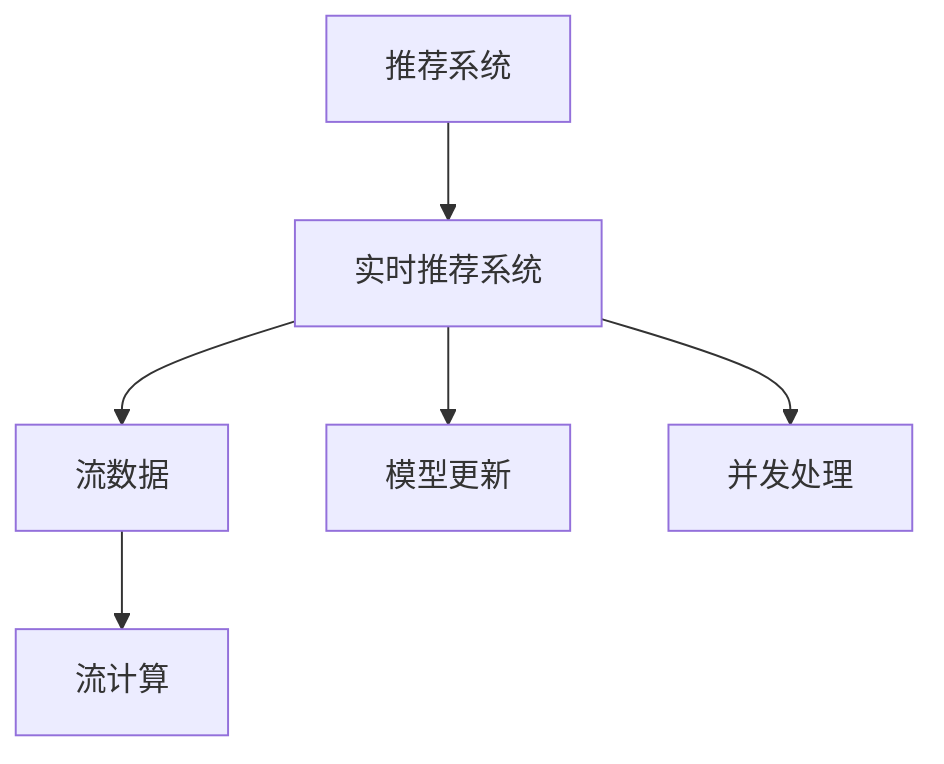
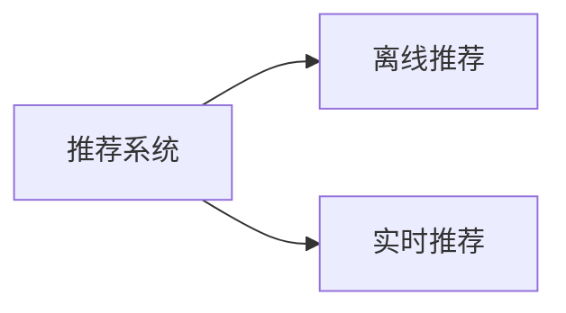
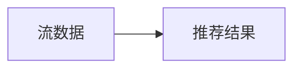
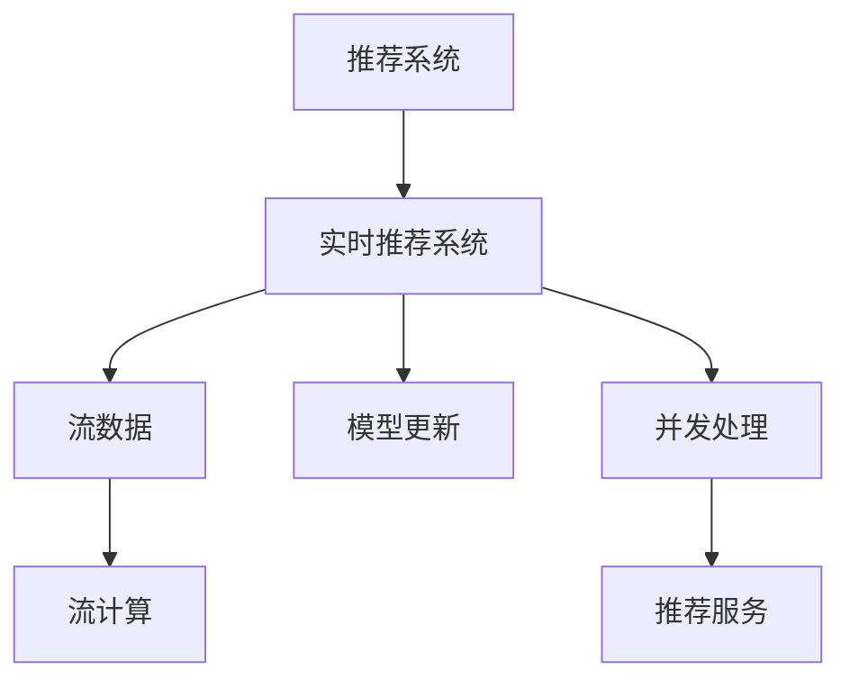

                 

# 实时推荐技术的实现与优化

## 1. 背景介绍

### 1.1 问题由来

随着互联网和电子商务的迅猛发展，推荐系统成为了各大平台获取用户满意度和增加用户粘性的关键技术。推荐系统通过分析用户历史行为和实时行为，为用户提供个性化的商品或内容推荐，极大地提高了用户体验和平台效益。然而，传统的推荐系统往往基于静态数据进行训练和推理，缺乏对实时动态数据的响应能力，难以满足快速变化的推荐需求。

为此，实时推荐系统应运而生，利用实时流数据对用户行为进行动态更新，并结合最新信息实时生成推荐结果，极大提升了推荐的个性化和时效性。实时推荐系统能够及时响应用户行为变化，适应环境变化，更好地服务用户。

### 1.2 问题核心关键点

实时推荐技术的核心在于如何将历史行为和实时行为结合起来，生成动态更新的个性化推荐。这涉及到以下几个关键问题：

- 如何高效地处理实时数据流，并进行实时计算？
- 如何在保证推荐效果的同时，减少计算资源消耗？
- 如何动态更新模型，并保持模型的稳定性和一致性？
- 如何实现高并发的推荐服务，确保系统稳定性和可用性？

这些关键问题共同构成了实时推荐技术的实现和优化框架。

### 1.3 问题研究意义

实时推荐技术的深入研究和应用，对于提升用户满意度和平台效益具有重要意义：

1. 个性化推荐：实时推荐能够根据用户最新行为数据，及时更新推荐结果，提供更为精准的个性化服务，提升用户体验。
2. 流量增长：通过实时推荐，平台能够吸引更多用户进入应用，提升流量和点击率，增加平台收益。
3. 数据驱动：实时推荐系统的优化，需要大量的数据支持，有助于深入挖掘用户行为特征，优化推荐策略。
4. 服务质量：实时推荐能够实时响应用户请求，减少等待时间，提升服务质量。

## 2. 核心概念与联系

### 2.1 核心概念概述

为更好地理解实时推荐技术，本节将介绍几个密切相关的核心概念：

- 推荐系统(Recommender System)：利用用户历史行为数据，通过算法生成推荐结果的系统。传统的推荐系统基于静态数据，推荐效果不够个性化。
- 实时推荐系统(Real-time Recommender System)：利用实时流数据，通过动态计算生成推荐结果的系统。能够实时响应用户行为变化，适应环境变化。
- 流数据(Steam Data)：实时产生、不断变化的数据流，如用户行为、系统日志等。需要进行实时处理和分析。
- 流计算(Stream Computing)：对实时数据流进行实时处理和计算的技术，实现高效的实时推荐。
- 模型更新(Model Update)：动态更新推荐模型，保持模型与数据的一致性，提升推荐效果。
- 并发处理(Concurrency)：在高并发环境下，保证系统稳定性和服务可用性的技术手段。

这些核心概念之间的逻辑关系可以通过以下Mermaid流程图来展示：



这个流程图展示了一个典型的实时推荐系统架构，以及其与流数据、流计算、模型更新和并发处理的关系。

### 2.2 概念间的关系

这些核心概念之间存在着紧密的联系，形成了实时推荐技术的完整生态系统。下面我通过几个Mermaid流程图来展示这些概念之间的关系。

#### 2.2.1 推荐系统的演进



这个流程图展示了推荐系统的演进过程。传统的离线推荐是基于静态数据进行的，而实时推荐系统能够利用实时数据流，动态更新推荐结果，满足用户的实时需求。

#### 2.2.2 流数据与推荐的关系



这个流程图展示了流数据与推荐结果之间的关系。实时推荐系统能够实时处理流数据，并基于最新数据生成推荐结果，提升推荐效果。

#### 2.2.3 流计算与推荐的关系


这个流程图展示了流计算与推荐模型的关系。流计算技术能够高效处理流数据，实现实时计算，为推荐模型提供数据支持。

#### 2.2.4 模型更新与推荐的关系


这个流程图展示了模型更新与推荐结果的关系。通过动态更新推荐模型，能够根据最新数据进行推荐，提升推荐效果。

#### 2.2.5 并发处理与推荐的关系


这个流程图展示了并发处理与推荐服务的关系。在高并发环境下，通过并发处理技术，能够确保推荐服务的高可用性和稳定性。

### 2.3 核心概念的整体架构

最后，我们用一个综合的流程图来展示这些核心概念在大语言模型微调过程中的整体架构：



这个综合流程图展示了从推荐系统到实时推荐系统的演进过程，以及各个关键组件之间的关系。实时推荐系统利用流数据进行流计算，动态更新推荐模型，并通过并发处理技术保证推荐服务的稳定性。

## 3. 核心算法原理 & 具体操作步骤
### 3.1 算法原理概述

实时推荐系统通过流数据流计算和模型更新，实现动态生成的个性化推荐。其核心思想是：

1. 实时收集用户行为数据，进行流数据处理和分析。
2. 基于流数据，动态更新推荐模型。
3. 根据最新模型，实时生成推荐结果。

具体来说，实时推荐系统可以分为以下几个步骤：

1. 数据预处理：对实时数据进行清洗、过滤、归一化等处理，确保数据质量。
2. 特征提取：从处理后的数据中提取有用的特征，用于生成推荐模型。
3. 模型训练：基于提取的特征，训练推荐模型，生成初始推荐结果。
4. 模型更新：利用实时数据流，动态更新推荐模型，保证模型与数据的一致性。
5. 实时推荐：根据最新模型，实时生成推荐结果，并推送给用户。

### 3.2 算法步骤详解

实时推荐系统的实现步骤可以细化为以下几个环节：

#### 3.2.1 数据预处理

数据预处理是实时推荐系统的第一步，主要包括以下几个步骤：

1. 数据采集：从用户行为数据源（如网站访问日志、交易记录等）采集实时数据。
2. 数据清洗：去除噪声和异常数据，确保数据质量。
3. 数据归一化：对数据进行归一化处理，避免数据量级差异带来的影响。

#### 3.2.2 特征提取

特征提取是将原始数据转换为推荐模型所需特征的过程，包括以下几个步骤：

1. 特征选择：选择与推荐相关的特征，如用户ID、商品ID、时间戳等。
2. 特征处理：对特征进行编码、降维、转换等处理，便于模型训练。
3. 特征组合：通过特征组合、交叉等方法，生成更加丰富的特征。

#### 3.2.3 模型训练

模型训练是基于特征提取生成的数据，训练推荐模型的过程。包括以下几个步骤：

1. 选择模型：选择适合实时推荐任务的模型，如协同过滤、矩阵分解、深度学习等。
2. 数据划分：将数据划分为训练集、验证集和测试集，用于模型训练和评估。
3. 模型训练：基于训练集数据，训练推荐模型，生成初始推荐结果。

#### 3.2.4 模型更新

模型更新是实时推荐系统的核心，包括以下几个步骤：

1. 数据流处理：对实时数据进行流处理，生成实时特征。
2. 模型融合：将实时特征与历史特征融合，动态更新推荐模型。
3. 模型优化：根据模型更新效果，调整模型参数，优化模型性能。

#### 3.2.5 实时推荐

实时推荐是基于最新模型，生成推荐结果的过程，包括以下几个步骤：

1. 实时计算：利用流计算技术，实时计算推荐结果。
2. 推荐推送：将推荐结果推送给用户，供用户选择。

### 3.3 算法优缺点

实时推荐系统的优点包括：

1. 个性化推荐：能够根据用户最新行为数据，实时更新推荐结果，提供更为精准的个性化服务。
2. 流量增长：通过实时推荐，吸引更多用户进入应用，提升流量和点击率。
3. 数据驱动：实时推荐系统的优化，需要大量的数据支持，有助于深入挖掘用户行为特征，优化推荐策略。

实时推荐系统的缺点包括：

1. 计算资源消耗：实时推荐系统需要处理大量实时数据，计算资源消耗较大。
2. 模型稳定性：模型频繁更新可能导致模型不稳定，影响推荐效果。
3. 高并发处理：实时推荐系统在高并发环境下，需要保证系统稳定性和服务可用性。

### 3.4 算法应用领域

实时推荐系统在多个领域得到了广泛应用，包括但不限于：

1. 电商推荐：根据用户浏览、购买行为，实时生成商品推荐，提升用户体验。
2. 视频推荐：根据用户观看历史和行为数据，实时生成视频推荐，提升用户黏性。
3. 音乐推荐：根据用户听歌历史和行为数据，实时生成音乐推荐，提升用户满意度。
4. 社交网络：根据用户互动行为，实时生成好友推荐、内容推荐，提升用户活跃度。
5. 旅游推荐：根据用户旅游历史和行为数据，实时生成旅游目的地推荐，提升旅游体验。

## 4. 数学模型和公式 & 详细讲解 & 举例说明

### 4.1 数学模型构建

实时推荐系统通常采用协同过滤算法实现，其数学模型可以表示为：

$$
\hat{y}_{ui} = \alpha \cdot \sum_{j \in N_u} \frac{R_{uj} \cdot x_{ui} \cdot x_{uj}}{\sqrt{(x_{uj} \cdot x_{uj} + \epsilon)}}
$$

其中，$y_{ui}$为推荐结果，$R_{uj}$为用户$u$对商品$j$的评分，$x_{ui}$和$x_{uj}$为商品$u$和$j$的特征向量，$\alpha$为模型系数，$\epsilon$为平滑系数。

### 4.2 公式推导过程

基于协同过滤的实时推荐模型，其推导过程如下：

1. 对每个用户$u$，计算其对所有商品的评分$R_{uj}$。
2. 对每个商品$j$，计算其对所有用户的评分$R_{uj}$。
3. 对每个用户$u$，计算其对所有商品的特征向量$x_{ui}$和$x_{uj}$。
4. 对每个商品$j$，计算其对所有用户的特征向量$x_{uj}$。
5. 根据用户$u$和商品$j$的特征向量，计算推荐结果$\hat{y}_{ui}$。

### 4.3 案例分析与讲解

假设我们有一个电商平台的实时推荐系统，需要根据用户的浏览和购买历史，实时生成商品推荐。具体实现步骤如下：

1. 数据采集：实时从电商平台采集用户的浏览和购买数据。
2. 数据清洗：去除异常数据，如用户未下单的商品。
3. 特征提取：提取用户的浏览历史、购买历史、商品ID、商品类别等特征。
4. 模型训练：基于协同过滤算法，训练推荐模型。
5. 模型更新：利用实时数据，动态更新推荐模型。
6. 实时推荐：根据最新模型，实时生成推荐结果，推送给用户。

## 5. 项目实践：代码实例和详细解释说明

### 5.1 开发环境搭建

在进行实时推荐系统开发前，我们需要准备好开发环境。以下是使用Python进行实时推荐系统开发的开发环境配置流程：

1. 安装Anaconda：从官网下载并安装Anaconda，用于创建独立的Python环境。

2. 创建并激活虚拟环境：
```bash
conda create -n pytorch-env python=3.8 
conda activate pytorch-env
```

3. 安装PyTorch：根据CUDA版本，从官网获取对应的安装命令。例如：
```bash
conda install pytorch torchvision torchaudio cudatoolkit=11.1 -c pytorch -c conda-forge
```

4. 安装TensorFlow：
```bash
pip install tensorflow
```

5. 安装pandas、numpy等工具包：
```bash
pip install pandas numpy matplotlib
```

6. 安装Dask：用于分布式数据处理：
```bash
pip install dask[fastparquet]
```

完成上述步骤后，即可在`pytorch-env`环境中开始实时推荐系统的开发。

### 5.2 源代码详细实现

下面我们以电商推荐系统为例，给出使用TensorFlow和Dask对协同过滤模型进行实时推荐开发的PyTorch代码实现。

首先，定义协同过滤模型：

```python
import tensorflow as tf
import dask.array as da

class CollaborativeFiltering(tf.keras.Model):
    def __init__(self, num_users, num_items, embedding_dim):
        super(CollaborativeFiltering, self).__init__()
        self.user_embeddings = tf.keras.layers.Embedding(num_users, embedding_dim)
        self.item_embeddings = tf.keras.layers.Embedding(num_items, embedding_dim)
        self.prediction_layer = tf.keras.layers.Dense(1)

    def call(self, inputs):
        user, item = inputs
        user_embeddings = self.user_embeddings(user)
        item_embeddings = self.item_embeddings(item)
        prediction = self.prediction_layer(tf.reduce_sum(tf.multiply(user_embeddings, item_embeddings), axis=-1))
        return prediction
```

然后，定义模型训练和预测函数：

```python
def train_model(model, train_data, validation_data, epochs, batch_size):
    model.compile(optimizer=tf.keras.optimizers.Adam(), loss='mse')
    model.fit(train_data, validation_data=validation_data, epochs=epochs, batch_size=batch_size)

def predict(model, test_data):
    test_data = da.from_array(test_data, chunks=1024)
    predictions = model.predict(test_data)
    return predictions.compute()
```

接下来，定义实时数据流处理函数：

```python
def process_data(stream, batch_size):
    for i in range(0, len(stream), batch_size):
        batch = stream[i:i+batch_size]
        yield batch
```

最后，启动实时推荐系统：

```python
stream = # 实时数据流
batch_size = 1024

model = CollaborativeFiltering(num_users=num_users, num_items=num_items, embedding_dim=128)
model = tf.function(model)

for batch in process_data(stream, batch_size):
    model(batch)
```

以上就是使用TensorFlow和Dask对协同过滤模型进行实时推荐开发的完整代码实现。可以看到，利用Dask的分布式计算特性，能够高效处理大规模实时数据流，实现实时推荐系统的快速迭代和优化。

### 5.3 代码解读与分析

让我们再详细解读一下关键代码的实现细节：

**CollaborativeFiltering类**：
- `__init__`方法：初始化模型参数，包括用户和商品的嵌入层以及预测层。
- `call`方法：定义模型的前向传播过程，计算预测结果。

**train_model函数**：
- 定义模型编译和训练过程，使用Adam优化器，均方误差损失函数。

**predict函数**：
- 将Dask数组转换为TensorFlow张量，利用模型进行预测，返回预测结果。

**process_data函数**：
- 对实时数据流进行分批处理，以便于模型进行批量训练和预测。

**启动实时推荐系统**：
- 启动实时数据流处理，循环迭代训练模型。

可以看出，TensorFlow和Dask的结合，可以高效地实现实时推荐系统的开发和优化，满足大规模数据处理的实时需求。

## 6. 实际应用场景

### 6.1 电商推荐

电商推荐是实时推荐系统的经典应用场景。电商平台通过实时推荐，能够根据用户浏览和购买历史，动态生成个性化商品推荐，提升用户购物体验和转化率。

在电商推荐中，实时推荐系统需要处理用户行为数据、商品信息、交易记录等大规模数据，实时计算推荐结果，并推送给用户。这需要系统具备高效的数据处理和实时计算能力，同时也需要优化模型，提升推荐效果。

### 6.2 视频推荐

视频推荐是实时推荐系统的另一个重要应用领域。视频平台通过实时推荐，能够根据用户观看历史和行为数据，动态生成个性化视频推荐，提升用户黏性和观看时长。

在视频推荐中，实时推荐系统需要处理用户行为数据、视频信息、评分数据等大规模数据，实时计算推荐结果，并推送给用户。这需要系统具备高效的数据处理和实时计算能力，同时也需要优化模型，提升推荐效果。

### 6.3 音乐推荐

音乐推荐是实时推荐系统的典型应用场景之一。音乐平台通过实时推荐，能够根据用户听歌历史和行为数据，动态生成个性化音乐推荐，提升用户满意度。

在音乐推荐中，实时推荐系统需要处理用户行为数据、音乐信息、评分数据等大规模数据，实时计算推荐结果，并推送给用户。这需要系统具备高效的数据处理和实时计算能力，同时也需要优化模型，提升推荐效果。

### 6.4 社交网络

社交网络是实时推荐系统的另一个重要应用领域。社交平台通过实时推荐，能够根据用户互动行为，动态生成好友推荐、内容推荐等，提升用户活跃度。

在社交网络中，实时推荐系统需要处理用户互动数据、好友关系、内容信息等大规模数据，实时计算推荐结果，并推送给用户。这需要系统具备高效的数据处理和实时计算能力，同时也需要优化模型，提升推荐效果。

## 7. 工具和资源推荐

### 7.1 学习资源推荐

为了帮助开发者系统掌握实时推荐技术的理论基础和实践技巧，这里推荐一些优质的学习资源：

1. 《推荐系统：算法与实现》书籍：详细介绍了推荐系统的理论基础和经典算法，包括协同过滤、矩阵分解等。
2. Coursera《推荐系统》课程：由斯坦福大学开设的推荐系统课程，涵盖推荐系统的理论、算法和应用。
3 《TensorFlow实战机器学习》书籍：详细介绍TensorFlow在推荐系统中的应用，包括模型构建、训练和优化。
4 《流数据处理与分析》书籍：详细介绍流数据处理和分析技术，包括Apache Flink、Apache Storm等。
5 《分布式深度学习》书籍：详细介绍分布式深度学习技术，包括TensorFlow、PyTorch等。

通过对这些资源的学习实践，相信你一定能够快速掌握实时推荐技术的精髓，并用于解决实际的推荐问题。

### 7.2 开发工具推荐

高效的开发离不开优秀的工具支持。以下是几款用于实时推荐系统开发的常用工具：

1. TensorFlow：由Google主导开发的深度学习框架，生产部署方便，适合大规模工程应用。
2. PyTorch：基于Python的开源深度学习框架，灵活动态的计算图，适合快速迭代研究。
3. Apache Spark：Apache基金会下的分布式计算框架，支持大规模数据处理和分析。
4. Apache Flink：Apache基金会下的流数据处理框架，支持实时数据流处理和计算。
5. Apache Kafka：Apache基金会下的分布式消息队列，支持实时数据流传输和存储。
6. Hadoop：Apache基金会下的分布式计算平台，支持大规模数据存储和处理。

合理利用这些工具，可以显著提升实时推荐系统的开发效率，加快创新迭代的步伐。

### 7.3 相关论文推荐

实时推荐技术的发展源于学界的持续研究。以下是几篇奠基性的相关论文，推荐阅读：

1. CF: Recommender Engines for Implicit User-Item Ratings（协同过滤）：提出协同过滤算法，用于处理用户隐式反馈数据。
2. DMatrix: Tensor-Parallel Matrix Factorization for Recommender Systems（矩阵分解）：提出矩阵分解算法，用于处理大规模用户-商品矩阵数据。
3 《Recommender Systems: Exploring Matrix Factorization Techniques for Predicting User Preferences》：介绍矩阵分解算法在推荐系统中的应用。
4 《On the Importance of Being Latent》：提出流数据处理技术，用于实时推荐系统。
5 《Distributed Collaborative Filtering: New Algorithms and Tools for Multi-User Scalability》：介绍分布式协同过滤算法，用于处理大规模实时推荐数据。

这些论文代表了大语言模型微调技术的发展脉络。通过学习这些前沿成果，可以帮助研究者把握学科前进方向，激发更多的创新灵感。

除上述资源外，还有一些值得关注的前沿资源，帮助开发者紧跟实时推荐技术的最新进展，例如：

1. arXiv论文预印本：人工智能领域最新研究成果的发布平台，包括大量尚未发表的前沿工作，学习前沿技术的必读资源。
2. 业界技术博客：如Amazon、Google AI、Facebook等顶尖实验室的官方博客，第一时间分享他们的最新研究成果和洞见。
3 技术会议直播：如SIGKDD、ICML、KDD等人工智能领域顶会现场或在线直播，能够聆听到大佬们的前沿分享，开拓视野。
4 技术会议论文集：如SIGKDD、ICML、KDD等会议的论文集，涵盖当前推荐系统研究的最新成果和进展。
5 技术会议视频集：如SIGKDD、ICML、KDD等会议的视频集，包含大量高质量的技术报告和演讲。

总之，对于实时推荐技术的开发，需要开发者保持开放的心态和持续学习的意愿。多关注前沿资讯，多动手实践，多思考总结，必将收获满满的成长收益。

## 8. 总结：未来发展趋势与挑战

### 8.1 总结

本文对实时推荐技术的实现与优化进行了全面系统的介绍。首先阐述了实时推荐系统的背景和意义，明确了实时推荐在个性化推荐、流量增长、数据驱动等方面的独特价值。其次，从原理到实践，详细讲解了实时推荐系统的数学模型和核心步骤，给出了实时推荐系统开发的完整代码实例。同时，本文还广泛探讨了实时推荐技术在电商推荐、视频推荐、音乐推荐、社交网络等多个行业领域的应用前景，展示了实时推荐系统的广阔前景。

通过本文的系统梳理，可以看到，实时推荐技术正在成为推荐系统的关键技术，极大地提升了推荐系统的个性化和时效性。得益于实时数据处理和动态模型更新，实时推荐系统能够适应环境变化，更好地服务用户。未来，随着实时推荐技术的不断进步，推荐系统必将在更多领域得到应用，为人类认知智能的进化带来深远影响。

### 8.2 未来发展趋势

展望未来，实时推荐技术将呈现以下几个发展趋势：

1. 数据驱动的推荐：利用更多的数据源和数据类型，进行综合推荐。利用自然语言处理、图像处理等技术，从多维度提取用户行为特征，提升推荐效果。
2. 多模态推荐：结合视觉、听觉、文本等多模态数据，进行综合推荐。通过多模态融合，提升推荐效果和用户体验。
3 实时流处理：利用流数据处理技术，进行实时推荐。支持高吞吐量、低延迟的实时数据处理，提升推荐的时效性。
4 分布式推荐：利用分布式计算技术，进行分布式推荐。支持大规模实时推荐系统的构建，提升系统稳定性和扩展性。
5 混合推荐：结合协同过滤、基于内容的推荐、混合推荐等多种推荐算法，进行综合推荐。通过混合推荐，提升推荐效果和用户体验。

以上趋势凸显了实时推荐技术的广阔前景。这些方向的探索发展，必将进一步提升推荐系统的性能和应用范围，为人类认知智能的进化带来深远影响。

### 8.3 面临的挑战

尽管实时推荐技术已经取得了瞩目成就，但在迈向更加智能化、普适化应用的过程中，它仍面临着诸多挑战：

1. 数据质量问题：实时推荐系统需要处理大规模数据，数据质量问题会影响推荐效果。需要解决数据缺失、噪声、异常等问题，提升数据质量。
2. 计算资源消耗：实时推荐系统需要处理大规模数据，计算资源消耗较大。需要优化算法，提升系统效率。
3 模型稳定性问题：模型频繁更新可能导致模型不稳定，影响推荐效果。需要优化模型更新策略，提升模型稳定性。
4 高并发问题：实时推荐系统在高并发环境下，需要保证系统稳定性和服务可用性。需要优化并发处理技术，提升系统稳定性。
5 数据隐私问题：实时推荐系统需要处理用户数据，数据隐私问题需要引起重视。需要加强数据保护和隐私保护措施，确保用户数据安全。

### 8.4 研究展望

面对实时推荐技术所面临的种种挑战，未来的研究需要在以下几个方面寻求新的突破：

1. 数据增强：通过数据增强技术，提升数据质量。利用合成数据、噪声注入等技术，提升数据多样性。
2 算法优化：通过算法优化，提升系统效率。利用分布式计算、并行计算等技术，提升系统效率。
3 模型融合：通过模型融合，提升推荐效果。结合多种推荐算法，进行综合推荐。
4 模型压缩：通过模型压缩，提升系统效率。利用模型剪枝、量化等技术，提升模型效率。
5 隐私保护：通过隐私保护技术，保护用户数据。利用差分隐私、数据脱敏等技术，保护用户隐私。

这些研究方向的研究突破，必将引领实时推荐技术迈向更高的台阶，为构建安全、可靠、可解释、可控的推荐系统铺平道路。面向未来，实时推荐技术还需要与其他人工智能技术进行更深入的融合，如知识表示、

