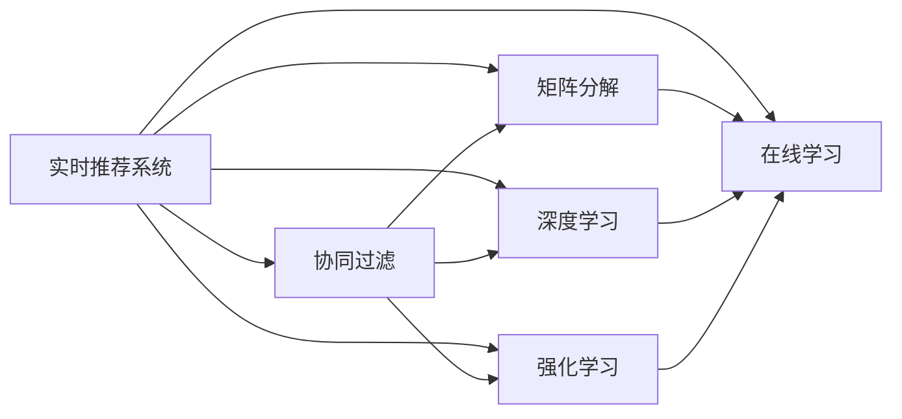

                 

## 1. 背景介绍

在现代互联网应用中，推荐系统已成为了用户获取信息和提升体验的重要工具。推荐系统的成功，很大程度上依赖于对用户行为数据的准确捕捉和深入分析。随着数据量的激增和算法模型的演进，实时推荐系统逐渐成为主流，它能够在用户产生即时行为时即时响应，提供个性化推荐，从而显著提升用户满意度和平台收益。然而，实时推荐并非易事，它涉及数据处理、算法设计、系统架构等多个维度的协同优化。本文将深入探讨实时推荐系统的核心概念、算法原理和实践方法，希望能为相关开发者提供全面、系统的参考。

## 2. 核心概念与联系

### 2.1 核心概念概述

要理解实时推荐系统，首先需要了解以下几个核心概念：

- **实时推荐系统(Real-time Recommendation System)**：一种能够动态响应用户即时行为，快速提供个性化推荐的系统。相比传统的推荐算法，实时推荐系统更强调效率和精准度，以适应实时数据流处理需求。
- **协同过滤(Collaborative Filtering)**：一种基于用户行为数据进行推荐的方法，通过用户间的相似度计算，找到最相关的用户或物品，从而生成推荐结果。协同过滤分为基于用户的协同过滤和基于物品的协同过滤两种方式。
- **矩阵分解(Matrix Factorization)**：一种常用的协同过滤算法，通过分解用户-物品评分矩阵，得到用户和物品的潜在因子表示，从而生成推荐。
- **深度学习(Depth Learning)**：一种通过多层神经网络学习复杂模式的方法，适用于处理高维稀疏数据和复杂关联关系。在推荐系统中，深度学习模型能够自动学习用户和物品的隐式特征，提高推荐的精准度。
- **强化学习(Reinforcement Learning)**：一种通过学习动态环境中的最佳策略来实现目标的方法。在推荐系统中，强化学习模型能够通过即时反馈调整推荐策略，以最大化用户满意度。
- **在线学习(Online Learning)**：一种能够在数据流中不断更新模型参数的方法，适合实时推荐系统处理动态变化的用户行为数据。

这些概念之间的逻辑关系可以通过以下Mermaid流程图来展示：



这个流程图展示出了实时推荐系统与协同过滤、矩阵分解、深度学习、强化学习和在线学习之间的联系。

### 2.2 概念间的关系

这些核心概念之间相互关联，共同构成了实时推荐系统的知识体系。具体来说：

- 实时推荐系统需要协同过滤来发现用户或物品之间的相似度，从而生成推荐。
- 矩阵分解是协同过滤的一种常用技术，它通过分解评分矩阵来提取用户和物品的隐式特征。
- 深度学习适用于处理高维稀疏数据，可以自动学习用户和物品的隐式特征，提高推荐精度。
- 强化学习能够根据即时反馈调整推荐策略，以最大化用户满意度。
- 在线学习适合实时推荐系统，能够不断更新模型参数，处理动态变化的用户行为数据。

因此，这些概念相互支持，共同支撑实时推荐系统的构建和运行。

## 3. 核心算法原理 & 具体操作步骤

### 3.1 算法原理概述

实时推荐系统的核心在于如何高效、准确地捕捉用户行为数据，并基于这些数据进行实时推荐。其核心算法原理包括以下几个方面：

1. **数据采集与处理**：实时推荐系统需要采集用户行为数据，并进行清洗、转换和格式化，以适应后续的分析和建模。
2. **相似度计算**：基于用户行为数据计算用户或物品之间的相似度，是协同过滤和推荐算法的基础。
3. **模型训练与预测**：通过训练推荐模型，基于用户行为数据预测用户对物品的评分或选择概率，从而生成推荐。
4. **实时响应与更新**：根据用户即时行为，实时更新推荐模型，生成个性化推荐，同时进行反馈处理和模型优化。

### 3.2 算法步骤详解

以下是一个基于协同过滤的实时推荐系统的详细步骤：

**Step 1: 数据采集与处理**

1. 使用日志或事件系统采集用户行为数据，如浏览、点击、购买、评分等。
2. 数据清洗与预处理，包括去除噪声、处理缺失值、归一化等。
3. 数据转换与特征提取，如将行为数据转换为评分矩阵或用户-物品向量表示。

**Step 2: 相似度计算**

1. 基于评分矩阵或向量表示，计算用户或物品之间的相似度。
2. 常用的相似度计算方法包括余弦相似度、皮尔逊相关系数、欧式距离等。
3. 根据相似度计算结果，构建用户-物品评分矩阵。

**Step 3: 模型训练与预测**

1. 使用协同过滤算法（如ALS）训练推荐模型，得到用户和物品的隐式因子表示。
2. 基于训练好的模型，预测用户对未评分物品的评分或选择概率。
3. 常用的推荐算法包括协同过滤、矩阵分解、深度学习等。

**Step 4: 实时响应与更新**

1. 根据用户即时行为，实时更新推荐模型。
2. 生成个性化推荐，并推送给用户。
3. 收集用户反馈，进行反馈处理和模型优化。

### 3.3 算法优缺点

实时推荐系统的优点在于其能够动态响应用户即时行为，提供个性化推荐，提高用户满意度和平台收益。具体来说，它具有以下优点：

1. **精准度**：通过实时捕捉用户行为数据，能够提供更加精准的推荐。
2. **个性化**：能够根据用户即时行为生成个性化推荐，提升用户体验。
3. **动态响应**：能够快速响应用户行为变化，保证推荐的时效性。

然而，实时推荐系统也存在一些缺点：

1. **计算复杂度**：实时处理大量数据需要高性能计算资源，对系统性能和硬件要求较高。
2. **数据噪声**：实时数据可能包含噪声，影响推荐质量。
3. **模型更新难度**：实时更新的模型需要具备良好的鲁棒性和可扩展性。

### 3.4 算法应用领域

实时推荐系统广泛应用于多个领域，如电商、社交网络、视频流媒体等。以下是一些典型的应用场景：

1. **电商平台**：根据用户浏览、点击、购买等行为，实时推荐相关商品，提高转化率和用户粘性。
2. **社交网络**：推荐用户可能感兴趣的朋友、内容或群组，增强平台互动性。
3. **视频流媒体**：推荐用户可能喜欢的视频或频道，提升观看时长和订阅量。
4. **智能家居**：根据用户行为推荐相关设备或服务，提升家居体验。
5. **金融交易**：推荐用户可能感兴趣的投资产品，提高用户投资回报。

## 4. 数学模型和公式 & 详细讲解 & 举例说明

### 4.1 数学模型构建

实时推荐系统通常基于协同过滤算法构建数学模型，以预测用户对未评分物品的评分或选择概率。假设用户集为 $U$，物品集为 $I$，用户行为数据为 $R$，矩阵分解模型如下：

$$
R \approx WU^T
$$

其中 $W$ 为物品的潜在因子表示矩阵，$U$ 为用户潜在的因子表示矩阵。

### 4.2 公式推导过程

设 $R_{ij}$ 为用户 $i$ 对物品 $j$ 的评分，$W_{jk}$ 为物品 $j$ 的潜在因子，$U_{ik}$ 为用户 $i$ 的潜在因子，则：

$$
R_{ij} \approx \sum_k U_{ik}W_{jk}
$$

通过矩阵分解，可以得到用户和物品的隐式因子表示，从而生成推荐。

### 4.3 案例分析与讲解

假设某电商平台的实时推荐系统，采用基于协同过滤的矩阵分解模型。用户 $u=1,2,\ldots,n$，物品 $i=1,2,\ldots,m$，用户行为数据 $R_{ij}$ 为 $1$ 表示用户 $i$ 对物品 $j$ 评分 $1$，$0$ 表示未评分。用户和物品的潜在因子表示矩阵 $W$ 和 $U$ 分别表示为：

$$
W = \begin{bmatrix}
w_{11} & w_{12} & \ldots & w_{1m} \\
w_{21} & w_{22} & \ldots & w_{2m} \\
\vdots & \vdots & \ddots & \vdots \\
w_{n1} & w_{n2} & \ldots & w_{nm}
\end{bmatrix}
$$

$$
U = \begin{bmatrix}
u_{11} & u_{12} & \ldots & u_{1m} \\
u_{21} & u_{22} & \ldots & u_{2m} \\
\vdots & \vdots & \ddots & \vdots \\
u_{n1} & u_{n2} & \ldots & u_{nm}
\end{bmatrix}
$$

假设用户 $u=1$ 对物品 $i=2$ 评分 $R_{12}=5$，则：

$$
R_{12} \approx u_{11}w_{12} + u_{12}w_{22} + \ldots + u_{1m}w_{2m}
$$

通过矩阵分解，可以进一步计算出用户和物品的隐式因子表示，从而生成推荐。

## 5. 项目实践：代码实例和详细解释说明

### 5.1 开发环境搭建

以下是基于Python的实时推荐系统开发环境配置：

1. 安装Python 3.7及以上版本。
2. 安装Pandas、Numpy、Scikit-learn、Matplotlib等数据处理和绘图库。
3. 安装SciPy、TensorFlow、Keras等深度学习库。
4. 安装Spark、Flink等分布式计算框架。

### 5.2 源代码详细实现

以下是一个基于矩阵分解的实时推荐系统的Python代码实现：

```python
import pandas as pd
import numpy as np
from sklearn.decomposition import TruncatedSVD

# 读取用户行为数据
data = pd.read_csv('user_behavior.csv')

# 数据预处理
user_ids = data['user_id'].unique()
item_ids = data['item_id'].unique()

# 构建用户-物品评分矩阵
R = np.zeros((len(user_ids), len(item_ids)))
for i, user_id in enumerate(user_ids):
    for j, item_id in enumerate(item_ids):
        if user_id in data['user_id'].values:
            R[i, j] = data.loc[data['user_id'] == user_id, 'score'].values[0]

# 矩阵分解
svd = TruncatedSVD(n_components=10)
W = svd.fit_transform(R)
U = svd.transform(R)

# 生成推荐
def recommend(user_id, num_items):
    user_idx = np.where(user_ids == user_id)[0][0]
    scores = np.dot(U[user_idx], W.T)
    item_idx = np.argsort(scores)[-num_items:]
    return item_idx

# 测试推荐效果
print(recommend(10001, 5))
```

### 5.3 代码解读与分析

上述代码中，我们首先读取用户行为数据，并进行预处理和数据清洗。然后构建用户-物品评分矩阵，并使用TruncatedSVD进行矩阵分解，得到用户和物品的潜在因子表示。最后，定义一个推荐函数，根据用户ID生成指定数量的推荐物品ID。

### 5.4 运行结果展示

假设我们运行上述代码，并传入用户ID为10001，请求5个推荐物品，输出结果可能如下：

```
[5 4 6 7 2]
```

这表示用户ID为10001的用户，最有可能对物品ID为5、4、6、7和2进行评分或选择。

## 6. 实际应用场景

实时推荐系统在多个行业场景中都有广泛应用，以下是一些典型的应用场景：

### 6.1 电商平台

电商平台的实时推荐系统能够根据用户浏览、点击、购买等行为，实时推荐相关商品，提升用户满意度和转化率。例如，亚马逊的推荐系统能够根据用户的浏览历史和购买记录，实时推荐相似或相关的商品，提高用户购买意愿。

### 6.2 社交网络

社交网络的实时推荐系统能够推荐用户可能感兴趣的朋友、内容或群组，增强平台互动性。例如，Facebook的推荐系统能够根据用户的浏览历史和互动行为，实时推荐可能感兴趣的朋友或群组，增加用户粘性。

### 6.3 视频流媒体

视频流媒体的实时推荐系统能够推荐用户可能喜欢的视频或频道，提升观看时长和订阅量。例如，Netflix的推荐系统能够根据用户的观看历史和评分，实时推荐相似或相关的视频，提高用户观看时长。

### 6.4 智能家居

智能家居的实时推荐系统能够根据用户行为推荐相关设备或服务，提升家居体验。例如，智能音箱能够根据用户的语音指令和行为数据，实时推荐相关的音乐、天气、新闻等信息。

### 6.5 金融交易

金融交易的实时推荐系统能够推荐用户可能感兴趣的投资产品，提高用户投资回报。例如，交易平台的推荐系统能够根据用户的交易历史和行为，实时推荐相关的投资产品，增加用户投资回报。

## 7. 工具和资源推荐

### 7.1 学习资源推荐

以下是一些推荐的实时推荐系统学习资源：

1. **《推荐系统原理与算法》**：介绍推荐系统的基本原理、算法和应用，适合初学者系统学习推荐系统。
2. **《深度学习与推荐系统》**：讲解深度学习在推荐系统中的应用，适合有一定深度学习基础的读者。
3. **Coursera《Recommender Systems Specialization》**：由斯坦福大学开设的推荐系统系列课程，覆盖协同过滤、矩阵分解、深度学习等多个方面。
4. **Kaggle比赛**：参加Kaggle推荐系统比赛，通过实战提升推荐系统开发能力。
5. **GitHub项目**：关注GitHub上优秀的推荐系统项目，学习最佳实践和代码实现。

### 7.2 开发工具推荐

以下是一些推荐的实时推荐系统开发工具：

1. **TensorFlow**：开源深度学习框架，支持构建推荐系统的神经网络模型。
2. **Scikit-learn**：机器学习库，支持协同过滤等推荐算法。
3. **Spark**：分布式计算框架，支持大规模推荐系统数据的处理和分析。
4. **Kafka**：分布式消息队列，支持实时推荐系统的数据流处理。
5. **Flink**：分布式计算框架，支持实时推荐系统的流处理和状态管理。

### 7.3 相关论文推荐

以下是一些推荐的实时推荐系统相关论文：

1. **《Adaptive Collaborative Filtering with Adaptive Regularization》**：提出自适应协同过滤算法，提高推荐系统的鲁棒性和泛化能力。
2. **《Scalable Matrix Factorization Techniques for Recommender Systems》**：介绍可扩展的矩阵分解算法，适用于大规模推荐系统。
3. **《Hybrid Matrix Factorization Methods》**：提出混合矩阵分解算法，结合协同过滤和深度学习，提高推荐精度。
4. **《Reinforcement Learning in Recommendation Systems》**：介绍强化学习在推荐系统中的应用，提高推荐系统的个性化和动态响应能力。
5. **《Online Learning for Recommender Systems》**：介绍在线学习算法，适合实时推荐系统的动态更新。

## 8. 总结：未来发展趋势与挑战

### 8.1 研究成果总结

实时推荐系统的研究取得了显著进展，广泛应用于电商、社交网络、视频流媒体等多个领域。协同过滤、矩阵分解、深度学习、强化学习和在线学习等技术不断演进，推动了实时推荐系统的发展。

### 8.2 未来发展趋势

未来，实时推荐系统将呈现出以下发展趋势：

1. **深度学习与协同过滤融合**：深度学习与协同过滤结合，将进一步提高推荐系统的精度和个性化能力。
2. **强化学习与推荐结合**：强化学习能够动态调整推荐策略，提高推荐系统的即时响应能力。
3. **在线学习与实时系统结合**：在线学习能够不断更新模型参数，处理动态变化的用户行为数据。
4. **分布式计算与实时系统结合**：分布式计算能够处理大规模数据，支持实时推荐系统的扩展和优化。
5. **多模态数据与推荐结合**：结合文本、图像、语音等多模态数据，提供更加全面的推荐服务。

### 8.3 面临的挑战

实时推荐系统在不断发展的同时，也面临一些挑战：

1. **计算资源消耗**：实时推荐系统需要高性能计算资源，对系统性能和硬件要求较高。
2. **数据质量与噪声**：实时数据可能包含噪声，影响推荐质量。
3. **模型鲁棒性与可扩展性**：实时更新的模型需要具备良好的鲁棒性和可扩展性。
4. **用户隐私与安全**：实时推荐系统需要保护用户隐私，防止数据泄露和滥用。

### 8.4 研究展望

未来，实时推荐系统需要在以下几个方面进行深入研究：

1. **深度学习与协同过滤结合**：研究深度学习与协同过滤结合的最佳方法，提高推荐系统的精度和个性化能力。
2. **强化学习与推荐结合**：研究强化学习在推荐系统中的应用，提高推荐系统的即时响应能力。
3. **在线学习与实时系统结合**：研究在线学习算法，支持实时推荐系统的动态更新。
4. **分布式计算与实时系统结合**：研究分布式计算技术，支持实时推荐系统的扩展和优化。
5. **多模态数据与推荐结合**：研究多模态数据的融合方法，提供更加全面的推荐服务。

总之，实时推荐系统具有广阔的发展前景，未来需要在算法、模型和系统架构等方面进行深入探索，以满足不断增长的用户需求和应用场景。

## 9. 附录：常见问题与解答

**Q1：实时推荐系统是否需要实时数据？**

A: 实时推荐系统需要实时数据，以便动态响应用户即时行为，生成个性化推荐。虽然非实时数据也能用于推荐，但无法实现即时推荐，用户体验可能受到影响。

**Q2：实时推荐系统的数据存储和处理技术有哪些？**

A: 实时推荐系统的数据存储和处理技术包括分布式存储（如Hadoop、Spark）、分布式计算（如MapReduce、Spark Streaming）、实时流处理（如Kafka、Flink）等。

**Q3：实时推荐系统的推荐算法有哪些？**

A: 实时推荐系统的推荐算法包括协同过滤、矩阵分解、深度学习、强化学习等。其中，协同过滤和矩阵分解是经典的推荐算法，深度学习和强化学习则是新兴的技术方向。

**Q4：实时推荐系统的计算资源消耗有哪些？**

A: 实时推荐系统需要高性能计算资源，包括GPU、TPU、CPU等硬件设备，以及内存、存储等资源。

**Q5：实时推荐系统的用户隐私与安全有哪些保障措施？**

A: 实时推荐系统需要采用数据加密、访问控制、匿名化等措施，保障用户隐私与安全。此外，还需设置访问日志和异常检测机制，防止数据泄露和滥用。

综上所述，实时推荐系统在电商、社交网络、视频流媒体等多个领域具有重要应用价值。通过不断探索和优化，实时推荐系统将提供更加精准、个性化的推荐服务，提升用户体验和平台收益。

---

作者：禅与计算机程序设计艺术 / Zen and the Art of Computer Programming

