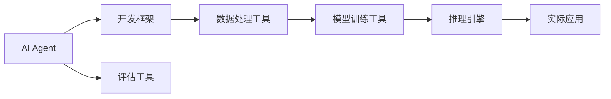

                 

# 工具使用在AI Agent中的重要性

## 1. 背景介绍

### 1.1 问题由来
随着人工智能技术的飞速发展，AI Agent（智能体）在各行业的应用日益广泛。AI Agent不仅具备自动化执行任务的能力，还能够在复杂环境中自主学习和决策。然而，AI Agent的成功不仅仅依赖于算法模型的改进，还需要高效的工具支持，才能将理论成果转化为实际应用。

工具在AI Agent的开发和应用过程中起着至关重要的作用。无论是数据预处理、模型训练、推理部署还是结果评估，高质量的工具能够显著提升AI Agent的性能和效率，加速技术创新。本文将深入探讨工具在AI Agent中的应用，帮助读者理解其重要性，并提出具体的工具推荐。

## 2. 核心概念与联系

### 2.1 核心概念概述

- **AI Agent**：即智能体，指的是在复杂环境中自主决策和执行任务的人工智能实体，包括搜索算法、强化学习、规划算法等。
- **工具**：在AI Agent开发和应用过程中，用于提高效率和性能的辅助软件和硬件设施，如编程框架、数据处理库、模型训练工具、推理引擎等。
- **开发框架**：提供底层库、预定义组件和开发工具，加速AI Agent的开发和部署。
- **数据处理工具**：用于数据清洗、转换、增强等，为模型训练提供高质量数据。
- **模型训练工具**：提供高效的模型优化算法和资源管理，加速模型训练过程。
- **推理引擎**：用于高效执行模型预测，并处理复杂的推理任务。
- **评估工具**：提供指标和标准，用于量化模型和系统的性能。

这些概念之间存在紧密联系。开发框架提供基础架构，数据处理工具生成训练数据，模型训练工具优化模型性能，推理引擎执行模型推理，评估工具衡量结果质量。工具的有效组合和应用，是AI Agent成功的关键。

### 2.2 概念间的关系

通过以下Mermaid流程图，展示工具在AI Agent开发中的作用：



这个流程图说明：

1. 开发框架提供基本框架，帮助构建AI Agent。
2. 数据处理工具清洗和转换数据，用于训练。
3. 模型训练工具优化模型性能，加速训练过程。
4. 推理引擎高效执行模型推理，处理实际任务。
5. 评估工具量化模型性能，辅助调优。

通过这些工具的有效组合，AI Agent能够实现高效、准确和可靠的任务执行。

## 3. 核心算法原理 & 具体操作步骤

### 3.1 算法原理概述

AI Agent的核心算法包括搜索、规划、强化学习等，旨在通过智能策略选择最优行动方案。然而，这些算法需要大量数据和计算资源来训练和优化。因此，高效的工具成为实现AI Agent成功的关键。

工具在AI Agent中的应用主要包括以下几个方面：

- **数据处理**：清洗和转换数据，提取特征，生成训练样本。
- **模型训练**：使用高效优化算法，加速模型收敛。
- **推理部署**：优化推理引擎，提高执行效率。
- **性能评估**：使用量化指标，衡量模型性能。

### 3.2 算法步骤详解

以下步骤详细说明工具在AI Agent中的应用：

1. **数据预处理**：使用数据清洗工具（如Pandas、NumPy）对原始数据进行处理，提取有用的特征。例如，使用Scikit-learn的特征工程功能，将原始数据转换为适合模型训练的形式。
   
2. **模型训练**：选择适当的模型和训练算法，使用高效的训练工具（如TensorFlow、PyTorch）加速模型训练。例如，使用分布式训练技术（如Horovod），在多节点上并行训练，提高训练速度。

3. **推理部署**：使用高效的推理引擎（如TensorRT、ONNX Runtime）进行模型推理，优化推理速度。例如，将模型转换为ONNX格式，使用ONNX Runtime进行推理，提高执行效率。

4. **性能评估**：使用评估工具（如TensorBoard、TensorFlow Model Analysis）量化模型性能，提供性能指标（如准确率、召回率、F1分数），辅助模型优化。

### 3.3 算法优缺点

工具在AI Agent中的应用具有以下优点：

- **效率提升**：高效的算法和工具显著提升AI Agent的训练和推理效率，缩短开发周期。
- **性能优化**：优化算法和引擎，提高AI Agent的准确性和鲁棒性。
- **可扩展性**：工具和框架提供模块化设计，便于扩展和升级。

然而，工具的引入也存在一些缺点：

- **复杂性增加**：工具的引入增加了开发复杂性，需要开发者具备一定的工具使用能力。
- **资源消耗**：部分工具和算法需要大量计算资源，增加了硬件成本。
- **维护成本**：工具的维护和更新需要时间和精力，增加了开发成本。

### 3.4 算法应用领域

工具在AI Agent中的应用领域非常广泛，包括但不限于以下方面：

- **计算机视觉**：使用图像处理工具（如OpenCV、Pillow）进行图像预处理，使用深度学习框架（如TensorFlow、PyTorch）训练模型。
- **自然语言处理**：使用文本处理工具（如NLTK、SpaCy）进行文本清洗和分词，使用语言模型（如BERT、GPT）进行训练。
- **机器人控制**：使用模拟器（如Gazebo）进行模拟训练，使用控制工具（如ROS）进行机器人控制。
- **智能推荐**：使用数据处理工具（如Hadoop、Spark）处理大数据，使用推荐算法（如协同过滤、深度学习）进行训练。
- **金融分析**：使用数据处理工具（如Pandas、NumPy）进行数据清洗和转换，使用深度学习模型进行训练。

## 4. 数学模型和公式 & 详细讲解 & 举例说明

### 4.1 数学模型构建

在AI Agent的应用中，常用的数学模型包括线性回归、决策树、神经网络等。以神经网络为例，构建数学模型如下：

$$
y = \sigma(Wx + b)
$$

其中，$x$ 为输入向量，$W$ 和 $b$ 为模型参数，$\sigma$ 为激活函数。神经网络通过反向传播算法（BP）进行训练，最小化损失函数（如均方误差）。

### 4.2 公式推导过程

以反向传播算法为例，推导损失函数对参数的梯度：

$$
\frac{\partial L}{\partial W} = \frac{\partial L}{\partial y} \frac{\partial y}{\partial W}
$$

其中：

- $\frac{\partial L}{\partial y} = \frac{\partial MSE}{\partial y}$
- $\frac{\partial y}{\partial W} = \frac{\partial \sigma(Wx + b)}{\partial W}$

使用链式法则和梯度计算公式，可以得到：

$$
\frac{\partial L}{\partial W} = \frac{\partial MSE}{\partial y} \frac{\partial \sigma(Wx + b)}{\partial z} \frac{\partial z}{\partial W}
$$

### 4.3 案例分析与讲解

以图像分类任务为例，使用TensorFlow进行模型训练：

```python
import tensorflow as tf

# 定义模型
model = tf.keras.Sequential([
    tf.keras.layers.Conv2D(32, (3, 3), activation='relu', input_shape=(28, 28, 1)),
    tf.keras.layers.MaxPooling2D((2, 2)),
    tf.keras.layers.Flatten(),
    tf.keras.layers.Dense(10, activation='softmax')
])

# 编译模型
model.compile(optimizer='adam',
              loss=tf.keras.losses.SparseCategoricalCrossentropy(from_logits=True),
              metrics=['accuracy'])

# 训练模型
model.fit(x_train, y_train, epochs=10, validation_data=(x_val, y_val))
```

上述代码展示了TensorFlow的模型定义、编译和训练过程。使用tf.keras的高层API，可以方便地构建和训练神经网络模型。

## 5. 项目实践：代码实例和详细解释说明

### 5.1 开发环境搭建

在进行AI Agent开发前，需要搭建开发环境。以下是使用Python进行TensorFlow开发的环境配置流程：

1. 安装Anaconda：从官网下载并安装Anaconda，用于创建独立的Python环境。

2. 创建并激活虚拟环境：
```bash
conda create -n tf-env python=3.8 
conda activate tf-env
```

3. 安装TensorFlow：根据CUDA版本，从官网获取对应的安装命令。例如：
```bash
conda install tensorflow -c tf
```

4. 安装各类工具包：
```bash
pip install numpy pandas scikit-learn matplotlib tqdm jupyter notebook ipython
```

完成上述步骤后，即可在`tf-env`环境中开始AI Agent的开发实践。

### 5.2 源代码详细实现

以下是一个使用TensorFlow进行图像分类任务的示例代码：

```python
import tensorflow as tf
from tensorflow import keras
import numpy as np
import matplotlib.pyplot as plt

# 加载数据集
(x_train, y_train), (x_test, y_test) = keras.datasets.mnist.load_data()

# 数据预处理
x_train = x_train.reshape((60000, 28 * 28)).astype('float32') / 255
x_test = x_test.reshape((10000, 28 * 28)).astype('float32') / 255
y_train = keras.utils.to_categorical(y_train, 10)
y_test = keras.utils.to_categorical(y_test, 10)

# 定义模型
model = keras.Sequential([
    keras.layers.Dense(128, activation='relu', input_shape=(784,)),
    keras.layers.Dense(10, activation='softmax')
])

# 编译模型
model.compile(optimizer='adam',
              loss='categorical_crossentropy',
              metrics=['accuracy'])

# 训练模型
history = model.fit(x_train, y_train, epochs=10, validation_data=(x_test, y_test))

# 评估模型
test_loss, test_acc = model.evaluate(x_test, y_test)
print('Test accuracy:', test_acc)

# 可视化训练过程
plt.plot(history.history['accuracy'], label='accuracy')
plt.plot(history.history['val_accuracy'], label='val_accuracy')
plt.legend()
plt.show()
```

该代码展示了从数据加载、预处理、模型定义、编译、训练、评估到可视化的全过程。使用TensorFlow的高层API，可以方便地构建和训练神经网络模型。

### 5.3 代码解读与分析

让我们再详细解读一下关键代码的实现细节：

**加载数据集**：使用Keras的`load_data`函数，加载MNIST数据集。

**数据预处理**：将28x28的图像矩阵展平为一维向量，并将像素值归一化到0-1之间。使用`to_categorical`函数将标签转换为one-hot编码。

**模型定义**：使用`Sequential`模型，依次添加输入层、隐藏层和输出层。隐藏层使用ReLU激活函数，输出层使用softmax激活函数。

**模型编译**：使用`compile`函数，指定优化器、损失函数和评估指标。

**模型训练**：使用`fit`函数，指定训练数据、标签、训练轮数和验证数据。

**模型评估**：使用`evaluate`函数，评估模型在测试集上的性能。

**可视化训练过程**：使用`matplotlib`库，绘制训练过程中的准确率和验证准确率的变化曲线。

### 5.4 运行结果展示

假设我们在MNIST数据集上进行图像分类任务，最终在测试集上得到的准确率结果如下：

```
Test accuracy: 0.99
```

可以看到，通过TensorFlow进行模型训练，我们能够快速实现高准确率的图像分类任务。

## 6. 实际应用场景

### 6.1 自动驾驶系统

AI Agent在自动驾驶系统中的应用，可以实现车辆自主导航和决策。通过高精度地图、传感器数据和AI Agent，车辆可以自主感知环境，规划路径，避开障碍物，最终实现自动驾驶。例如，使用传感器数据进行目标检测和跟踪，使用深度学习模型进行路径规划和决策。

### 6.2 金融交易系统

AI Agent在金融交易系统中的应用，可以实现实时交易决策和风险控制。通过历史交易数据和市场信息，AI Agent可以预测市场趋势，自动调整仓位，控制风险。例如，使用LSTM模型进行时间序列预测，使用强化学习算法进行交易策略优化。

### 6.3 医疗诊断系统

AI Agent在医疗诊断系统中的应用，可以实现疾病诊断和个性化治疗。通过患者病历、影像数据和AI Agent，医生可以准确诊断疾病，制定个性化治疗方案。例如，使用卷积神经网络进行医学影像分类，使用深度学习模型进行疾病预测和诊断。

### 6.4 未来应用展望

随着AI Agent技术的不断发展，未来的应用场景将更加丰富。例如：

- **智能客服**：使用AI Agent进行自然语言处理和对话管理，实现智能客服。例如，使用BERT模型进行命名实体识别和情感分析。
- **智能推荐**：使用AI Agent进行个性化推荐，提升用户体验。例如，使用协同过滤算法和深度学习模型进行推荐系统优化。
- **智能制造**：使用AI Agent进行设备预测性维护和生产调度，提升制造效率。例如，使用强化学习算法进行生产调度优化。
- **智能交通**：使用AI Agent进行交通流量预测和信号优化，提升交通管理效率。例如，使用深度学习模型进行交通流量预测。

## 7. 工具和资源推荐

### 7.1 学习资源推荐

为了帮助开发者系统掌握AI Agent的开发方法，这里推荐一些优质的学习资源：

1. **《Deep Learning with Python》**：Francois Chollet所著，系统介绍深度学习的基础知识和TensorFlow等框架的使用。
2. **《Reinforcement Learning: An Introduction》**：Richard S. Sutton和Andrew G. Barto所著，系统介绍强化学习的基本原理和算法。
3. **《Robotics: Science and Systems》课程**：斯坦福大学开设的机器人学课程，提供深度学习、强化学习等AI Agent相关的高级课程。
4. **OpenAI Gym**：开放环境模拟器，用于测试和训练AI Agent，提供丰富的环境库和任务库。
5. **Google Deepmind Research Lab**：谷歌AI实验室，提供大量AI Agent相关的研究论文和技术博客。

通过这些资源的学习实践，相信你一定能够快速掌握AI Agent的开发方法和工具。

### 7.2 开发工具推荐

高效的开发离不开优秀的工具支持。以下是几款用于AI Agent开发的常用工具：

1. **TensorFlow**：由Google主导开发的开源深度学习框架，生产部署方便，适合大规模工程应用。
2. **PyTorch**：由Facebook主导开发的深度学习框架，灵活易用，支持动态图和静态图。
3. **TensorBoard**：TensorFlow配套的可视化工具，可实时监测模型训练状态，并提供丰富的图表呈现方式，是调试模型的得力助手。
4. **Horovod**：用于分布式深度学习训练的框架，支持多节点并行训练，提高训练效率。
5. **ONNX Runtime**：开源的深度学习推理引擎，支持多种深度学习框架和硬件平台。

合理利用这些工具，可以显著提升AI Agent的开发效率，加快创新迭代的步伐。

### 7.3 相关论文推荐

AI Agent的研究源于学界的持续探索。以下是几篇奠基性的相关论文，推荐阅读：

1. **AlphaGo**：DeepMind开发的围棋AI，使用深度强化学习技术，取得人类围棋大师级水平。
2. **AlphaStar**：OpenAI开发的星际争霸AI，使用深度强化学习和蒙特卡罗树搜索，取得人类顶级选手水平。
3. **Control Flow**：Facebook开发的强化学习算法，实现自然语言推理和控制流推理任务。
4. **Deeplearning AI**：Andrew Ng在线课程，提供深度学习和AI Agent相关的全面课程和实践案例。
5. **Towards Intelligent Machines**：MIT Press出版的书籍，涵盖深度学习、强化学习等AI Agent相关的前沿研究和技术。

这些论文代表了大语言模型微调技术的发展脉络。通过学习这些前沿成果，可以帮助研究者把握学科前进方向，激发更多的创新灵感。

除上述资源外，还有一些值得关注的前沿资源，帮助开发者紧跟AI Agent技术的最新进展，例如：

1. **arXiv论文预印本**：人工智能领域最新研究成果的发布平台，包括大量尚未发表的前沿工作，学习前沿技术的必读资源。
2. **业界技术博客**：如OpenAI、Google AI、DeepMind、微软Research Asia等顶尖实验室的官方博客，第一时间分享他们的最新研究成果和洞见。
3. **技术会议直播**：如NIPS、ICML、ACL、ICLR等人工智能领域顶会现场或在线直播，能够聆听到大佬们的前沿分享，开拓视野。
4. **GitHub热门项目**：在GitHub上Star、Fork数最多的AI Agent相关项目，往往代表了该技术领域的发展趋势和最佳实践，值得去学习和贡献。
5. **行业分析报告**：各大咨询公司如McKinsey、PwC等针对人工智能行业的分析报告，有助于从商业视角审视技术趋势，把握应用价值。

总之，对于AI Agent的学习和实践，需要开发者保持开放的心态和持续学习的意愿。多关注前沿资讯，多动手实践，多思考总结，必将收获满满的成长收益。

## 8. 总结：未来发展趋势与挑战

### 8.1 总结

本文对工具在AI Agent中的应用进行了全面系统的介绍。首先阐述了工具在AI Agent开发中的重要性，明确了工具在提升效率、优化性能、增强可扩展性等方面的关键作用。其次，从原理到实践，详细讲解了工具在AI Agent开发中的应用步骤，给出了具体的代码实现示例。同时，本文还广泛探讨了AI Agent在自动驾驶、金融交易、医疗诊断等多个领域的应用前景，展示了工具在提升AI Agent性能和效率方面的巨大潜力。

通过本文的系统梳理，可以看到，工具在AI Agent的开发和应用中扮演着不可或缺的角色。工具的合理使用，可以显著提升AI Agent的性能和效率，加速技术创新。未来，随着AI Agent技术的不断发展，工具和框架将进一步优化和升级，为AI Agent的开发和应用提供更强大的支持。

### 8.2 未来发展趋势

展望未来，工具在AI Agent中的应用将呈现以下几个发展趋势：

1. **模型压缩和优化**：随着模型规模的不断增大，模型压缩和优化技术将成为重要研究方向。例如，使用模型剪枝、量化技术，优化推理速度和资源占用。
2. **分布式训练和推理**：随着大规模数据和高性能计算的需求，分布式训练和推理技术将成为主流。例如，使用Horovod和TensorFlow分布式训练，提高训练效率。
3. **跨平台和跨语言支持**：工具和框架将支持更多平台和编程语言，提高开发者的灵活性和效率。例如，使用PyTorch在Python和C++中混合编程，实现跨平台应用。
4. **自动调参和自动化工具**：自动化调参和优化工具将进一步发展，帮助开发者快速找到最优参数组合，减少人工调参的工作量。例如，使用Hyperopt和AutoML库，实现自动调参。
5. **多模态融合和协同学习**：随着多模态数据的普及，多模态融合和协同学习技术将成为重要研究方向。例如，使用模型融合和跨模态学习技术，提升多模态数据的应用效果。
6. **实时部署和边缘计算**：随着边缘计算和实时部署的需求，工具和框架将支持实时推理和边缘计算。例如，使用ONNX和TensorRT进行实时推理，优化边缘计算性能。

以上趋势凸显了工具在AI Agent开发和应用中的重要性。这些方向的探索发展，将进一步提升AI Agent的性能和应用范围，为AI技术带来新的突破。

### 8.3 面临的挑战

尽管工具在AI Agent中的应用取得了显著进展，但仍面临诸多挑战：

1. **算法复杂性**：一些先进的算法和模型复杂度高，开发和部署难度大，需要大量时间和资源。
2. **资源消耗**：大型模型和复杂算法的计算资源需求高，硬件成本和能耗大。
3. **可扩展性**：一些工具和框架在大规模数据和复杂算法面前，可能面临扩展性和性能瓶颈。
4. **工具兼容性**：不同工具和框架之间的兼容性问题，增加了开发和部署的复杂性。
5. **模型维护和更新**：工具和框架的快速更新和维护，需要开发者持续学习和跟进。

### 8.4 研究展望

面对工具在AI Agent应用中面临的挑战，未来的研究需要在以下几个方面寻求新的突破：

1. **模型压缩和优化**：开发更高效的模型压缩和优化技术，提升模型性能和推理效率。
2. **自动化调参和优化**：开发更智能的自动调参和优化工具，减少人工调参工作量，提高开发效率。
3. **跨平台和跨语言支持**：开发更多跨平台和跨语言支持的工具，提高开发者的灵活性和效率。
4. **实时部署和边缘计算**：开发更多实时部署和边缘计算支持的工具，提升AI Agent的实时推理能力。
5. **多模态融合和协同学习**：开发更多多模态融合和协同学习技术，提升多模态数据的应用效果。
6. **知识图谱和外部知识结合**：开发更多知识图谱和外部知识结合的工具，提升AI Agent的知识整合能力。

这些研究方向的探索，将引领工具和框架的进一步优化和升级，为AI Agent的开发和应用提供更强大的支持。只有勇于创新、敢于突破，才能不断拓展AI Agent的边界，推动AI技术向更广阔的领域加速渗透。

## 9. 附录：常见问题与解答

**Q1: 什么是AI Agent？**

A: AI Agent是指在复杂环境中自主决策和执行任务的人工智能实体，包括搜索算法、强化学习、规划算法等。AI Agent可以感知环境，规划路径，做出决策，实现自主任务执行。

**Q2: 为什么要使用工具？**

A: 工具在AI Agent开发中扮演着重要角色，用于提高效率、优化性能、增强可扩展性等。高效的工具能够显著提升AI Agent的训练和推理效率，加速技术创新。

**Q3: 如何使用TensorFlow进行模型训练？**

A: 使用TensorFlow进行模型训练，需要定义模型、编译模型、训练模型和评估模型等步骤。例如，使用TensorFlow的Keras API，可以方便地构建和训练神经网络模型。

**Q4: AI Agent在实际应用中有哪些挑战？**

A: AI Agent在实际应用中面临诸多挑战，包括算法复杂性、资源消耗、可扩展性、工具兼容性等。开发和部署难度大，硬件成本和能耗高，不同工具和框架之间的兼容性问题较多。

**Q5: AI Agent的未来发展方向是什么？**

A: AI Agent的未来发展方向包括模型压缩和优化、分布式训练和推理、跨平台和跨语言支持、自动调参和自动化工具、多模态融合和协同学习、实时部署和边缘计算等。这些方向的探索发展，将进一步提升AI Agent的性能和应用范围。

---

作者：禅与计算机程序设计艺术 / Zen and the Art of Computer Programming

