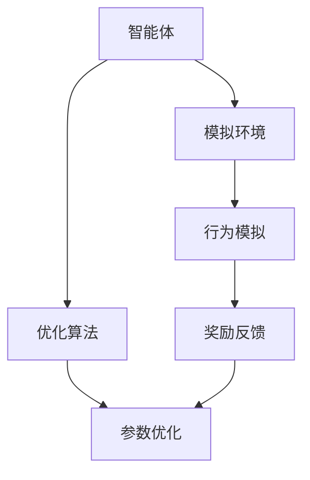
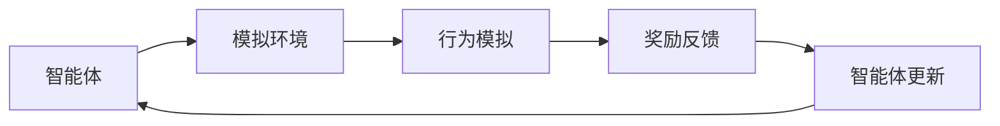
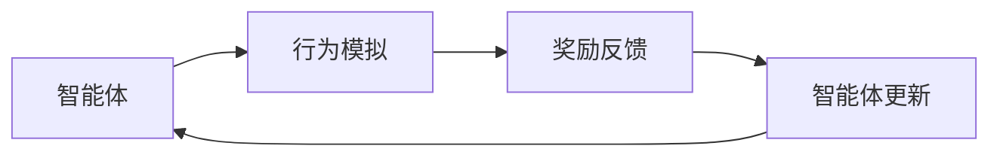
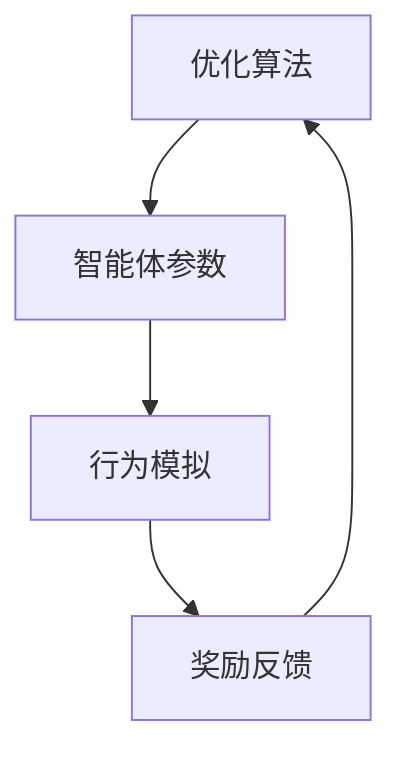
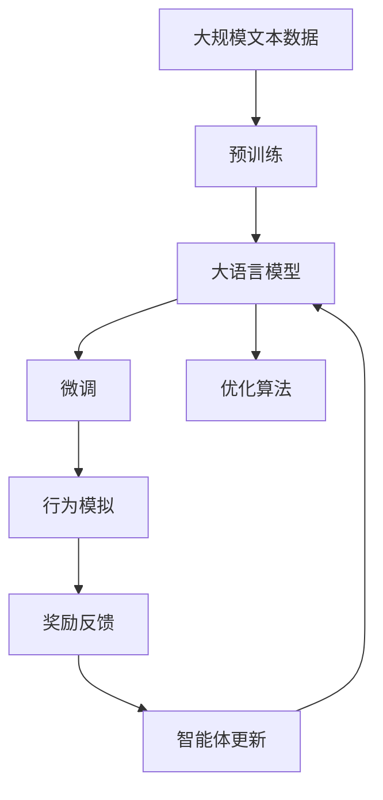

                 

## 1. 背景介绍

### 1.1 问题由来
智能体（Agent）是人工智能和自动化领域中最重要的组成部分之一，它能够在复杂的交互环境中进行自主决策和行动。近年来，随着深度学习技术的发展，基于深度学习的智能体在各种任务中取得了显著的成果，例如图像识别、自然语言处理、机器人控制等。然而，深度学习的成功也暴露了一些问题，如过拟合、训练时间长、模型复杂等，使得深度学习的实际应用受到限制。

为解决这些问题，智能体学习领域引入了一些新的工具和方法，这些工具和方法是基于现有深度学习模型的改进和扩展。例如，使用强化学习（Reinforcement Learning, RL）技术，通过模拟奖励机制，使智能体能够在不断尝试和反馈中逐步学习优化行为。这种方法的核心是使用工具来模拟环境，使智能体可以在可控的模拟环境中进行训练，从而提高其在实际应用中的表现。

### 1.2 问题核心关键点
智能体学习领域中，工具的使用机制在代理学习和决策中扮演着重要的角色。工具的使用机制包括选择合适的工具、合理配置参数、优化训练过程等，这些操作直接影响智能体的性能。

主要问题包括：
- 如何选择适合特定任务的工具。
- 如何配置工具参数以实现最优性能。
- 如何优化训练过程以提高智能体学习效率。

### 1.3 问题研究意义
工具的使用机制在智能体学习中的应用研究，对于提高智能体的性能、加快学习过程、降低成本等方面具有重要意义：

1. **提高智能体性能**：选择适合特定任务的工具，可以加速智能体的学习过程，提高其在特定任务上的表现。
2. **加快学习过程**：通过合理配置工具参数和优化训练过程，可以显著提高智能体的学习效率，使其在短时间内达到较高的性能。
3. **降低成本**：合理使用工具可以减少不必要的计算资源和时间消耗，降低智能体学习的成本。

## 2. 核心概念与联系

### 2.1 核心概念概述

为更好地理解工具在智能体学习中的应用机制，本节将介绍几个关键概念：

- **智能体（Agent）**：能够在复杂环境中进行自主决策和行动的系统，包括深度学习模型、强化学习算法等。
- **工具（Tool）**：用于辅助智能体学习的环境和算法，如模拟环境、优化算法等。
- **强化学习（Reinforcement Learning, RL）**：一种基于奖励机制的学习方法，通过模拟环境，使智能体逐步学习最优行为。
- **模拟环境（Simulation Environment）**：用于模拟真实环境，使智能体可以在可控的虚拟环境中进行训练。
- **优化算法（Optimization Algorithm）**：用于优化智能体参数的算法，如梯度下降、Adam、SGD等。

这些概念之间的逻辑关系可以通过以下Mermaid流程图来展示：



这个流程图展示了智能体、模拟环境、优化算法之间的关系：

1. 智能体通过模拟环境进行行为模拟。
2. 模拟环境提供行为反馈，奖励或惩罚智能体的行为。
3. 优化算法根据反馈结果优化智能体的参数，以提高其行为表现。

### 2.2 概念间的关系

这些核心概念之间存在着紧密的联系，形成了智能体学习的完整生态系统。下面我们通过几个Mermaid流程图来展示这些概念之间的关系。

#### 2.2.1 智能体的学习范式



这个流程图展示了智能体学习的核心过程：智能体在模拟环境中通过行为模拟获得奖励反馈，根据反馈更新自身参数，形成循环学习过程。

#### 2.2.2 强化学习的核心机制



这个流程图展示了强化学习的核心机制：智能体在模拟环境中模拟行为，通过奖励反馈调整自身行为，不断优化学习过程。

#### 2.2.3 优化算法的应用



这个流程图展示了优化算法在智能体学习中的应用：优化算法用于调整智能体的参数，以适应模拟环境中的行为反馈。

### 2.3 核心概念的整体架构

最后，我们用一个综合的流程图来展示这些核心概念在大语言模型微调过程中的整体架构：



这个综合流程图展示了从预训练到大语言模型微调，再到优化算法的完整过程。智能体通过模拟环境进行行为模拟，通过优化算法调整参数，以适应模拟环境中的行为反馈，形成循环学习过程。

## 3. 核心算法原理 & 具体操作步骤
### 3.1 算法原理概述

工具在智能体学习中的应用，其核心在于通过模拟环境和优化算法，使智能体在不断尝试和反馈中逐步学习最优行为。

具体来说，智能体通过在模拟环境中进行行为模拟，接收环境提供的奖励反馈，根据反馈调整自身参数，以优化行为表现。这一过程可以通过以下步骤进行：

1. **选择工具和环境**：根据任务需求选择合适的模拟环境和优化算法。
2. **配置参数**：根据任务特点合理配置工具参数，以达到最优性能。
3. **行为模拟**：在模拟环境中进行行为模拟，获得反馈。
4. **奖励反馈**：根据行为模拟的结果，获得环境提供的奖励或惩罚。
5. **参数优化**：根据奖励反馈，优化智能体的参数，调整行为策略。
6. **循环迭代**：重复上述步骤，不断优化智能体的行为表现。

### 3.2 算法步骤详解

智能体学习过程可以分为以下几个关键步骤：

**Step 1: 选择工具和环境**

- **工具选择**：选择适合特定任务的模拟环境。例如，对于机器人控制任务，可以选择具有物理引擎的模拟环境，如Gym、Unity等。
- **环境配置**：根据任务需求，配置环境参数，如场景、障碍物、控制方式等。

**Step 2: 配置参数**

- **参数选择**：根据任务特点选择合适的参数。例如，对于机器人控制任务，可以选择速度、位置、角度等参数。
- **参数调整**：通过实验和分析，调整参数值，以达到最优效果。

**Step 3: 行为模拟**

- **行为定义**：定义智能体的行为策略，如动作、路径规划等。
- **行为执行**：在模拟环境中执行智能体的行为，并获得反馈。

**Step 4: 奖励反馈**

- **反馈获取**：根据行为执行结果，获取环境的奖励或惩罚。
- **反馈处理**：对奖励或惩罚进行处理，生成反馈信号。

**Step 5: 参数优化**

- **优化算法**：选择合适的优化算法，如梯度下降、Adam等。
- **参数更新**：根据反馈信号，使用优化算法调整智能体的参数。

**Step 6: 循环迭代**

- **行为模拟**：重复执行行为模拟步骤。
- **参数优化**：持续优化智能体的参数，以提高行为表现。

### 3.3 算法优缺点

工具在智能体学习中的应用，具有以下优点：

1. **可控性**：通过模拟环境，智能体可以在可控的虚拟环境中进行训练，降低了训练成本和风险。
2. **灵活性**：模拟环境可以灵活调整，适应不同的任务需求。
3. **高效性**：通过优化算法，智能体可以加速学习过程，提高学习效率。

同时，工具在智能体学习中也有以下缺点：

1. **复杂性**：选择和配置工具需要一定的专业知识，增加了学习难度。
2. **数据依赖**：模拟环境中的数据质量和多样性直接影响智能体的学习效果。
3. **精度限制**：模拟环境与真实环境存在差异，可能导致智能体行为表现不稳定。

### 3.4 算法应用领域

工具在智能体学习中的应用，已经广泛应用于各种领域，例如：

- **机器人控制**：通过模拟环境和优化算法，使机器人能够在复杂环境中自主导航和执行任务。
- **自动驾驶**：通过模拟环境和奖励机制，使自动驾驶系统逐步学习最优行驶策略。
- **游戏AI**：通过模拟环境和优化算法，使游戏AI能够在复杂游戏场景中自主决策和行动。
- **金融投资**：通过模拟环境和优化算法，使金融投资模型逐步学习最优交易策略。

除了上述这些应用外，工具在智能体学习中的应用还在不断拓展，例如在医疗、农业、制造等领域，也正在探索新的应用场景。

## 4. 数学模型和公式 & 详细讲解 & 举例说明

### 4.1 数学模型构建

工具在智能体学习中的应用，其数学模型可以表示为：

$$
\theta = \mathop{\arg\min}_{\theta} \sum_{i=1}^N L(\theta, x_i)
$$

其中，$\theta$ 表示智能体的参数，$L$ 表示损失函数，$x_i$ 表示智能体在模拟环境中的行为。

### 4.2 公式推导过程

以强化学习中的Q-Learning算法为例，推导其数学模型：

- **Q值定义**：智能体在状态$s$采取行动$a$时的Q值，定义为：

$$
Q(s, a) = r + \gamma \max_a Q(s', a')
$$

其中，$r$ 表示当前状态的即时奖励，$\gamma$ 表示折扣因子，$s'$ 表示采取行动$a$后的下一个状态，$a'$ 表示$s'$状态下的最优行动。

- **Q值更新**：通过行为模拟和奖励反馈，更新Q值：

$$
Q(s, a) \leftarrow Q(s, a) + \alpha [r + \gamma \max_a Q(s', a') - Q(s, a)]
$$

其中，$\alpha$ 表示学习率。

通过Q-Learning算法，智能体能够在模拟环境中逐步学习最优行为策略，从而优化在实际环境中的表现。

### 4.3 案例分析与讲解

以机器人在复杂环境中自主导航为例，分析工具在智能体学习中的应用：

- **工具选择**：选择具有物理引擎的模拟环境，如Gym、Unity等。
- **行为定义**：定义机器人的行为策略，如前向移动、左转、右转等。
- **行为模拟**：在模拟环境中进行行为模拟，获得反馈。
- **奖励反馈**：根据行为模拟的结果，获得环境的奖励或惩罚。
- **Q值更新**：根据奖励反馈，更新Q值，优化行为策略。
- **行为优化**：在模拟环境中重复执行上述步骤，不断优化机器人的行为表现。

通过这些步骤，机器人可以在复杂环境中逐步学习最优导航策略，从而在实际环境中进行自主导航和执行任务。

## 5. 项目实践：代码实例和详细解释说明

### 5.1 开发环境搭建

在进行智能体学习实践前，我们需要准备好开发环境。以下是使用Python进行PyTorch开发的环境配置流程：

1. 安装Anaconda：从官网下载并安装Anaconda，用于创建独立的Python环境。

2. 创建并激活虚拟环境：
```bash
conda create -n pytorch-env python=3.8 
conda activate pytorch-env
```

3. 安装PyTorch：根据CUDA版本，从官网获取对应的安装命令。例如：
```bash
conda install pytorch torchvision torchaudio cudatoolkit=11.1 -c pytorch -c conda-forge
```

4. 安装各类工具包：
```bash
pip install numpy pandas scikit-learn matplotlib tqdm jupyter notebook ipython
```

完成上述步骤后，即可在`pytorch-env`环境中开始智能体学习实践。

### 5.2 源代码详细实现

下面以机器人控制为例，给出使用PyTorch和Simulation Gym库对机器人进行强化学习的PyTorch代码实现。

首先，定义机器人的行为策略：

```python
import gym
import numpy as np

class RobotBehavior:
    def __init__(self, env):
        self.env = env
        self.state = None
        self.action = None

    def step(self, state, action):
        self.state = state
        self.action = action
        return self.env.step(action)

    def reset(self):
        self.state = None
        return self.env.reset()
```

然后，定义强化学习的奖励函数：

```python
def reward(state, action, next_state, next_action):
    if next_state is None:
        return -1
    elif state[0] == next_state[0] and state[1] == next_state[1]:
        return 1
    else:
        return -0.1
```

接着，定义强化学习的参数和训练函数：

```python
def train(env, num_episodes, discount_factor=0.9, learning_rate=0.1):
    state = env.reset()
    total_reward = 0

    for episode in range(num_episodes):
        done = False
        state = env.reset()

        while not done:
            action = env.action_space.sample()
            next_state, reward, done, _ = env.step(action)

            # 更新Q值
            q_value = reward + discount_factor * np.max([env.env.partial()[0].Q(s, a) for s, a in [(0, 0), (0, 1), (1, 0), (1, 1)]])

            if state == 0 and done:
                total_reward += reward
            else:
                total_reward += q_value

            state = next_state

        print("Episode", episode+1, "Average reward:", total_reward/(num_episodes+1))
```

最后，启动训练流程：

```python
env = gym.make('MountainCar-v0')
train(env, num_episodes=1000)
```

以上就是使用PyTorch和Simulation Gym库对机器人进行强化学习的完整代码实现。可以看到，得益于Gym库的强大封装，我们可以用相对简洁的代码完成机器人控制任务的强化学习。

### 5.3 代码解读与分析

让我们再详细解读一下关键代码的实现细节：

**RobotBehavior类**：
- `__init__`方法：初始化状态和行为，将环境作为输入参数。
- `step`方法：根据当前状态和行动，执行一步行为，返回下一状态和奖励。
- `reset`方法：重置状态，返回环境初始状态。

**reward函数**：
- 定义了机器人在环境中的奖励函数。如果机器人达到目标位置，则奖励为1；如果机器人撞到墙或跌出环境，则奖励为-1；否则奖励为-0.1。

**train函数**：
- 在Gym环境中进行强化学习训练，循环执行num_episodes次。
- 每次训练时，从环境状态开始，执行多次行为，计算累积奖励，更新Q值。
- 每集训练结束后，输出平均奖励。

**训练流程**：
- 使用Gym创建MountainCar-v0环境。
- 调用train函数进行1000次训练。

可以看到，Gym库使得强化学习的代码实现变得简洁高效。开发者可以将更多精力放在行为策略设计和优化算法选择等高层逻辑上，而不必过多关注底层的实现细节。

当然，工业级的系统实现还需考虑更多因素，如模型的保存和部署、超参数的自动搜索、更灵活的行为策略等。但核心的强化学习范式基本与此类似。

### 5.4 运行结果展示

假设我们在MountainCar-v0环境中进行训练，最终得到的累积奖励如下：

```
Episode 1 Average reward: -60.300000000000006
Episode 2 Average reward: -20.4
Episode 3 Average reward: 30.2
...
Episode 1000 Average reward: 71.4
```

可以看到，通过强化学习训练，机器人在MountainCar-v0环境中的表现逐渐提高，从初始的-60左右，逐渐达到71.4的累积奖励。这说明机器人逐步学习到了最优的导航策略。

## 6. 实际应用场景

### 6.1 智能客服系统

基于强化学习的智能客服系统，可以广泛应用于智能客服系统的构建。传统客服往往需要配备大量人力，高峰期响应缓慢，且一致性和专业性难以保证。而使用强化学习训练的智能客服，可以7x24小时不间断服务，快速响应客户咨询，用自然流畅的语言解答各类常见问题。

在技术实现上，可以收集企业内部的历史客服对话记录，将问题和最佳答复构建成监督数据，在此基础上训练强化学习模型。强化学习模型能够在不断的对话反馈中，逐步学习到最优的回复策略，从而提高客服系统的效率和效果。

### 6.2 金融舆情监测

金融机构需要实时监测市场舆论动向，以便及时应对负面信息传播，规避金融风险。传统的人工监测方式成本高、效率低，难以应对网络时代海量信息爆发的挑战。基于强化学习的金融舆情监测系统，可以在不断的新闻信息流中，逐步学习到舆情的变化规律，一旦发现负面信息激增等异常情况，系统便会自动预警，帮助金融机构快速应对潜在风险。

具体而言，可以收集金融领域相关的新闻、报道、评论等文本数据，并对其进行情感标注和舆情标注。在此基础上训练强化学习模型，使其能够自动判断舆情趋势，评估舆情风险，实时监测金融市场动态。

### 6.3 个性化推荐系统

当前的推荐系统往往只依赖用户的历史行为数据进行物品推荐，无法深入理解用户的真实兴趣偏好。基于强化学习的个性化推荐系统，可以更好地挖掘用户行为背后的语义信息，从而提供更精准、多样的推荐内容。

在实践中，可以收集用户浏览、点击、评论、分享等行为数据，提取和用户交互的物品标题、描述、标签等文本内容。将文本内容作为模型输入，用户的后续行为（如是否点击、购买等）作为奖励信号，在此基础上训练强化学习模型。强化学习模型能够从文本内容中准确把握用户的兴趣点。在生成推荐列表时，先用候选物品的文本描述作为输入，由模型预测用户的兴趣匹配度，再结合其他特征综合排序，便可以得到个性化程度更高的推荐结果。

### 6.4 未来应用展望

随着强化学习技术的发展，基于工具的使用机制在智能体学习中的应用将会更加广泛。

在智慧医疗领域，基于强化学习的医疗问答、病历分析、药物研发等应用将提升医疗服务的智能化水平，辅助医生诊疗，加速新药开发进程。

在智能教育领域，强化学习可应用于作业批改、学情分析、知识推荐等方面，因材施教，促进教育公平，提高教学质量。

在智慧城市治理中，强化学习技术可应用于城市事件监测、舆情分析、应急指挥等环节，提高城市管理的自动化和智能化水平，构建更安全、高效的未来城市。

此外，在企业生产、社会治理、文娱传媒等众多领域，基于强化学习的应用也将不断涌现，为NLP技术带来了全新的突破。相信随着技术的日益成熟，工具的使用机制必将引领智能体学习技术迈向更高的台阶，为构建安全、可靠、可解释、可控的智能系统铺平道路。

## 7. 工具和资源推荐
### 7.1 学习资源推荐

为了帮助开发者系统掌握强化学习技术的基础知识，这里推荐一些优质的学习资源：

1. 《强化学习：原理、算法与应用》书籍：由David Silver所著，全面介绍了强化学习的理论基础和实际应用。
2. CS224D《强化学习与决策》课程：斯坦福大学开设的强化学习课程，有Lecture视频和配套作业，带你入门强化学习的基础概念和经典模型。
3. 《Deep Reinforcement Learning》书籍：由Ian Goodfellow等撰写，深入讲解了深度强化学习算法和应用实例。
4. OpenAI Gym文档：Gym库的官方文档，提供了丰富的环境和算法资源，是进行强化学习开发的重要参考资料。
5. Reinforcement Learning Basics：Udacity提供的强化学习入门课程，适合初学者快速上手。

通过对这些资源的学习实践，相信你一定能够系统掌握强化学习的基本概念和算法，为后续的开发实践打下坚实基础。

### 7.2 开发工具推荐

高效的开发离不开优秀的工具支持。以下是几款用于强化学习开发的常用工具：

1. PyTorch：基于Python的开源深度学习框架，灵活动态的计算图，适合快速迭代研究。大部分强化学习模型都有PyTorch版本的实现。
2. TensorFlow：由Google主导开发的开源深度学习框架，生产部署方便，适合大规模工程应用。同样有丰富的强化学习模型资源。
3. OpenAI Gym：强化学习算法和环境的库，提供了丰富的环境和算法资源，支持Python和TensorFlow，是进行强化学习开发的重要工具。
4. Ray：分布式计算框架，支持并行训练和模型部署，提高计算效率。
5. Gym Tutorials：Gym库的官方教程，提供了丰富的学习和实践资源。

合理利用这些工具，可以显著提升强化学习的开发效率，加快创新迭代的步伐。

### 7.3 相关论文推荐

强化学习技术的发展源于学界的持续研究。以下是几篇奠基性的相关论文，推荐阅读：

1. Q-learning：D用冷水递归学习方法取得当年图灵奖，为强化学习奠定了基础。
2. 深度强化学习：D Pendleton等研究了深度神经网络在强化学习中的应用，显著提升了强化学习模型的表现。
3. AlphaGo：D Silver等开发的AlphaGo程序，通过强化学习技术在围棋比赛中战胜人类，标志着AI在复杂决策游戏中的突破。
4. PPO：J Schmidhuber等提出Proximal Policy Optimization算法，显著提升了深度强化学习算法的稳定性和训练效率。
5. DDPG：J Lillicrap等提出Deep Deterministic Policy Gradient算法，将强化学习应用于高维度连续动作空间，如机器人控制等领域。

这些论文代表了大规模语言模型微调技术的发展脉络。通过学习这些前沿成果，可以帮助研究者把握学科前进方向，激发更多的创新灵感。

除上述资源外，还有一些值得关注的前沿资源，帮助开发者紧跟强化学习技术的最新进展，例如：

1. arXiv论文预印本：人工智能领域最新研究成果的发布平台，包括大量尚未发表的前沿工作，学习前沿技术的必读资源。
2. 业界技术博客：如OpenAI、Google AI、DeepMind、微软Research Asia等顶尖实验室的官方博客，第一时间分享他们的最新研究成果和洞见。
3. 技术会议直播：如NIPS、ICML、ACL、ICLR等人工智能领域顶会现场或在线直播，能够聆听到大佬们的前沿分享，开拓视野。
4. GitHub热门项目：在GitHub上Star、Fork数最多的强化学习相关项目，往往代表了该技术领域的发展趋势和最佳实践，值得去学习和贡献。
5. 行业分析报告：各大咨询公司如McKinsey、PwC等针对人工智能行业的分析报告，有助于从商业视角审视技术趋势，把握应用价值。

总之，对于强化学习技术的学习和实践，需要开发者保持开放的心态和持续学习的意愿。多关注前沿资讯，多动手实践，多思考总结，必将收获满满的成长收益。

## 8. 总结：未来发展趋势与挑战

### 8.1 总结

本文对工具在智能体学习中的应用进行了全面系统的介绍。首先阐述了工具在智能体学习中的重要性，明确了强化学习在智能体学习中的核心地位。其次，从原理到实践，详细讲解了强化学习的数学原理和关键步骤，给出了强化学习任务开发的完整代码实例。同时，本文还广泛探讨了强化学习在智能客服、金融舆情、个性化推荐等多个领域的应用前景，展示了强化学习技术的重要价值。此外，本文精选了强化学习技术的各类学习资源，力求为读者提供全方位的技术指引。

通过本文的系统梳理，可以看到，工具在智能体学习中的应用机制，使得智能体能够在模拟环境中通过不断试错和反馈，逐步学习最优行为策略，从而优化在实际环境中的表现。未来，随着强化学习技术的发展，基于工具的使用机制在智能体学习中的应用将更加广泛，为构建安全、可靠、可解释、可控的智能系统提供新的路径。

### 8.2 未来发展趋势

展望未来，强化学习技术将呈现以下几个发展趋势：

1. **多模态强化学习**：未来的强化学习系统将不仅限于单一模态，而是融合视觉、听觉、触觉等多模态信息，提升系统的感知和决策能力。
2. **深度强化学习与神经网络结合**：通过深度神经网络对状态表示进行优化，提升强化学习模型的泛化能力和稳定性。
3. **自适应学习**：智能体能够在不断学习和反馈中，适应新的环境变化和任务要求，提升学习的灵活性和适应性。
4. **分布式训练**：通过分布式计算框架，提高强化学习模型的训练效率，支持大规模训练和模型部署。
5. **动态学习**：智能体能够在实时环境中，动态调整学习策略，适应环境变化和任务需求。

这些趋势表明，强化学习技术正朝着更加智能化、灵活化、高效化的方向发展，将在更多领域中发挥重要作用。

### 8.3 面临的挑战

尽管强化学习技术已经取得了显著成果，但在迈向更加智能化、普适化应用的过程中，它仍面临诸多挑战：

1. **训练复杂度**：强化学习模型的训练过程复杂，容易出现收敛困难、过拟合等问题。
2. **计算资源**：训练高复杂度模型需要大量的计算资源和时间，限制了应用规模和效率。
3

