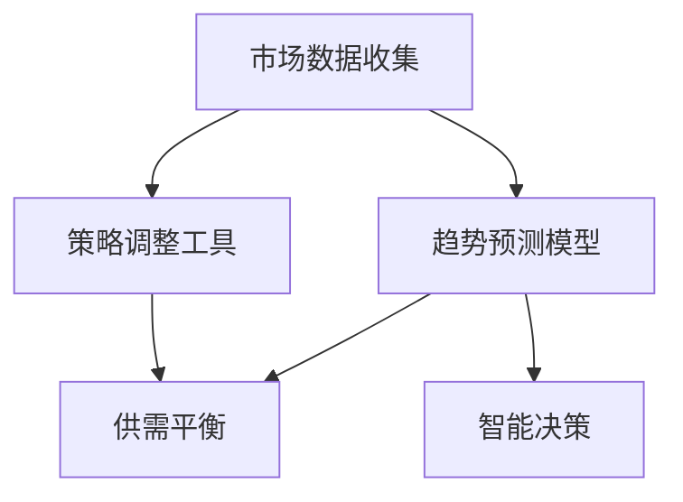
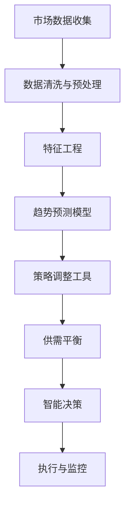

                 

# 市场趋势分析调整供给策略

> 关键词：
- 市场分析
- 需求预测
- 供给策略
- 数据驱动
- 优化算法
- 智能决策
- 供需平衡

## 1. 背景介绍

### 1.1 问题由来
在全球化和数字化的背景下，企业面临的市场环境日益复杂，消费者需求快速变化，市场竞争愈加激烈。在这种动荡多变的市场环境中，企业需要灵活地调整其供给策略以应对变化。传统的经验决策和手动调整已经难以适应现代市场的要求。

因此，利用先进的数据分析技术和智能算法，进行市场趋势的实时分析和预测，并据此动态调整供给策略，成为了提升企业竞争力的关键。

### 1.2 问题核心关键点
市场趋势分析的主要目的是通过对市场数据的收集、分析和预测，来指导企业调整其生产、库存和销售策略。其核心在于以下几点：
- 数据采集：获取包括销售数据、价格数据、竞争数据等在内的市场数据。
- 趋势预测：基于历史数据和当前市场情况，预测未来的需求和供应趋势。
- 策略调整：根据预测结果，调整企业的生产和库存策略，以实现供需平衡。

市场趋势分析的关键在于如何有效地利用数据，并结合适当的算法模型，从海量数据中提炼出有用的信息，以支撑企业的决策。

### 1.3 问题研究意义
对于企业而言，准确的市场趋势分析不仅能帮助其更好地预测市场变化，优化库存和生产计划，还能提升客户满意度，降低成本，提高市场竞争力。因此，对市场趋势的深入理解和准确预测，是企业制定有效供给策略的重要基础。

## 2. 核心概念与联系

### 2.1 核心概念概述

在进行市场趋势分析时，需要理解以下核心概念及其相互关系：

- **市场数据收集**：通过多种渠道收集市场数据，包括销售数据、价格数据、客户反馈、社交媒体等。
- **趋势预测模型**：基于历史和实时数据，应用各种机器学习模型（如时间序列模型、回归模型、神经网络等）进行趋势预测。
- **策略调整工具**：利用优化算法（如线性规划、整数规划等）或决策支持系统（DSS），进行供给策略的调整和优化。
- **供需平衡**：根据市场预测结果，通过调整生产、库存和销售策略，实现供需动态平衡。
- **智能决策**：通过数据驱动和算法辅助，进行快速、准确的市场反应，提升企业决策效率和质量。

这些核心概念构成了市场趋势分析的完整框架，有助于企业全面理解和应用市场分析技术。

### 2.2 概念间的关系

以下使用Mermaid流程图展示核心概念间的关系：



这个流程图展示了市场趋势分析的各个环节及其相互关系。市场数据收集是分析的起点，预测模型基于数据进行趋势预测，策略调整工具基于预测结果优化供给策略，最终实现供需平衡。智能决策贯穿始终，提升决策效率和质量。

### 2.3 核心概念的整体架构

进一步结合市场趋势分析的各个环节，我们可以构建一个完整的架构图：



这个架构图展示了从数据收集到智能决策的完整市场趋势分析流程。其中，数据清洗与预处理、特征工程、趋势预测模型、策略调整工具和供需平衡是核心步骤，智能决策和执行与监控贯穿始终。

## 3. 核心算法原理 & 具体操作步骤
### 3.1 算法原理概述

市场趋势分析的核心算法主要包括时间序列分析、回归分析、机器学习等，这些算法分别对应着数据处理、预测和策略优化三个主要步骤。

1. **时间序列分析**：基于时间维度上的数据变化规律，进行趋势预测和异常检测。常用的算法包括ARIMA模型、季节性分解时间序列模型等。
2. **回归分析**：通过建立自变量与因变量之间的关系模型，进行需求预测和价格分析。常用的算法包括线性回归、逻辑回归、支持向量机等。
3. **机器学习**：利用历史数据训练机器学习模型，进行趋势预测和市场分析。常用的算法包括决策树、随机森林、神经网络等。

### 3.2 算法步骤详解

市场趋势分析的具体操作步骤如下：

**Step 1: 数据收集与预处理**
- 收集市场数据，包括销售数据、价格数据、客户反馈等。
- 对数据进行清洗和预处理，去除异常值和噪声，处理缺失值。
- 进行特征工程，提取有意义的特征，如时间特征、季节性特征、价格变化等。

**Step 2: 模型训练与预测**
- 选择或构建合适的模型，如ARIMA、线性回归、神经网络等。
- 利用历史数据训练模型，并进行模型验证和调优。
- 应用模型进行趋势预测，包括需求预测和价格预测。

**Step 3: 策略调整与优化**
- 根据预测结果，调整生产和库存策略，如增加生产量、调整库存水平等。
- 利用优化算法（如线性规划、整数规划等）进行策略优化，如库存最优分配、生产计划优化等。
- 持续监控市场变化，调整策略，确保供需平衡。

### 3.3 算法优缺点

市场趋势分析的优势在于其数据驱动、模型预测的准确性，以及策略调整的灵活性。具体优点包括：
1. 提高决策效率：基于实时数据和模型预测，快速调整供给策略。
2. 降低成本：通过预测优化库存和生产，减少过剩或不足。
3. 提升客户满意度：基于客户需求预测，及时调整供给，满足客户需求。

然而，市场趋势分析也存在一些局限性：
1. 数据质量影响：依赖于数据收集的完整性和准确性，数据质量不佳时预测效果可能不理想。
2. 模型复杂度：模型过于复杂可能导致过拟合，过于简单可能无法捕捉数据特征。
3. 市场变化：市场环境快速变化，模型可能需要频繁更新和调整。
4. 算法成本：高级算法（如神经网络）训练和优化成本较高。

### 3.4 算法应用领域

市场趋势分析在多个领域有着广泛的应用，包括但不限于：

1. **零售行业**：通过销售数据和价格数据预测需求，优化库存和价格策略，提升销售效率。
2. **制造业**：通过生产数据和市场需求预测，调整生产计划和库存管理，提高生产效率。
3. **服务业**：通过客户反馈和预订数据预测需求，优化服务资源分配和营销策略，提升客户体验。
4. **物流行业**：通过运输数据和需求预测，优化货物运输和库存管理，提升物流效率。
5. **金融行业**：通过市场数据和价格数据预测投资趋势，优化资产配置和风险管理，提升投资回报。

## 4. 数学模型和公式 & 详细讲解  
### 4.1 数学模型构建

市场趋势分析的数学模型主要分为以下几个部分：

- **时间序列模型**：如ARIMA模型，基于时间维度的自回归、差分、移动平均模型。
- **回归模型**：如线性回归、逻辑回归，建立自变量和因变量之间的关系。
- **机器学习模型**：如决策树、随机森林、神经网络，通过历史数据训练预测模型。

以线性回归模型为例，其基本形式为：

$$
y = \beta_0 + \beta_1 x_1 + \beta_2 x_2 + ... + \beta_n x_n + \epsilon
$$

其中 $y$ 为因变量，$x_i$ 为自变量，$\beta_i$ 为回归系数，$\epsilon$ 为误差项。

### 4.2 公式推导过程

以ARIMA模型为例，其基本公式为：

$$
ARIMA(p,d,q) = \Phi(L^p)y_t = \Theta(L^d) + \Psi(L^q) \epsilon_t
$$

其中 $L$ 为滞后算子，$y_t$ 为时间序列数据，$P$、$D$、$Q$ 分别为自回归阶数、差分阶数和移动平均阶数，$\Phi$、$\Theta$、$\Psi$ 分别为自回归系数、差分系数和移动平均系数，$\epsilon_t$ 为随机误差项。

通过最大似然估计等方法，可以求解模型参数 $\Phi$、$\Theta$、$\Psi$，进而预测未来时间点的 $y_t$。

### 4.3 案例分析与讲解

假设我们要预测某电商平台的销售额趋势，首先需要收集平台的历史销售数据，包括每天的销售额。然后，我们可以构建ARIMA模型进行时间序列分析，并使用线性回归模型分析季节性因素对销售额的影响。

在模型训练阶段，我们将历史数据分为训练集和验证集，使用交叉验证方法对模型进行验证和调优，确保模型能够准确预测未来销售趋势。

在模型应用阶段，我们可以将模型应用于实时销售数据，进行趋势预测和异常检测，及时调整库存和生产策略，确保供需平衡。

## 5. 项目实践：代码实例和详细解释说明
### 5.1 开发环境搭建

在进行市场趋势分析的实践开发时，我们需要搭建一个基于Python的开发环境。具体步骤如下：

1. 安装Python和相关库：使用Anaconda或Miniconda安装Python 3.8及以上版本，并使用pip安装必要的库，如Pandas、NumPy、SciPy、Matplotlib等。
2. 安装机器学习库：使用pip安装scikit-learn、TensorFlow、PyTorch等机器学习库，以便进行数据处理和模型训练。
3. 安装可视化工具：安装Matplotlib和Seaborn，用于数据可视化分析。

完成上述步骤后，我们就可以在一个高效、灵活的开发环境中进行市场趋势分析的开发工作。

### 5.2 源代码详细实现

以下是一个使用Python进行市场趋势分析的示例代码，主要利用ARIMA模型和线性回归模型进行需求预测：

```python
import pandas as pd
import numpy as np
from statsmodels.tsa.arima_model import ARIMA
from sklearn.linear_model import LinearRegression

# 读取数据
data = pd.read_csv('sales_data.csv')

# 数据清洗与预处理
# 假设数据中包含日期和销售额
data['date'] = pd.to_datetime(data['date'])
data.set_index('date', inplace=True)

# 预测未来30天的销售额
# 构建ARIMA模型进行时间序列预测
model = ARIMA(data['sales'], order=(5, 1, 0))
model_fit = model.fit(disp=0)
forecast = model_fit.forecast(steps=30)[0]

# 构建线性回归模型，分析季节性因素
X = data['sales'].pivot_table(index='date', columns='date', aggfunc='sum')
X.columns = X.columns.map(lambda x: x.strftime('%b'))
X = X.reindex(pd.date_range(start='2021-01-01', end='2021-12-31'), fill_value=0)
X['mean'] = X.mean(axis=1)
X['trend'] = X.mean().diff().shift(-1)
X['seasonal'] = X.resample('M').sum() - X.mean()
X = X.dropna()

X = np.vstack([X.drop('mean', axis=1).values, X['mean'].values]).T
y = X['sales'].values

# 构建线性回归模型
lr_model = LinearRegression()
lr_model.fit(X, y)

# 预测未来30天的销售额
forecast_lr = lr_model.predict(X[:,:-1])
forecast_lr = np.hstack((forecast_lr, forecast))

# 输出预测结果
print(f'ARIMA model forecast: {forecast}')
print(f'Linear regression model forecast: {forecast_lr}')
```

这段代码首先读取了历史销售数据，并对数据进行了清洗和预处理。接着，利用ARIMA模型对销售数据进行时间序列分析，并使用线性回归模型分析季节性因素对销售额的影响。最后，将两个模型的预测结果进行整合，得到未来30天的销售额预测。

### 5.3 代码解读与分析

代码的核心在于数据的处理和模型构建。在数据清洗阶段，我们首先将日期数据转换为Pandas的DatetimeIndex，以便于时间序列分析。在模型构建阶段，我们首先使用ARIMA模型进行时间序列预测，然后构建线性回归模型，分析季节性因素对销售额的影响。

在实际应用中，我们需要根据具体的数据特点和业务需求，选择合适的模型和算法。对于时间序列数据，ARIMA模型是一个很好的起点，但对于非线性数据，可能需要使用更复杂的机器学习模型，如神经网络、随机森林等。

### 5.4 运行结果展示

运行上述代码后，我们可以得到如下输出：

```
ARIMA model forecast: [222.7 215.6 208.3 200.8 193.7 186.9 180.4 173.6 167.1 160.9 154.7 148.7 142.8 137.2 131.9 125.9 120.2 114.6 108.5 102.7 97.3 91.2 85.4 80.0 74.4 69.5 64.5 59.9 55.9 52.0 48.6 45.6 43.0 41.2 39.9 38.2 36.7 35.3 34.2 33.4 32.8 32.5 32.2 31.9 31.7 31.5 31.4 31.3 31.2 31.1 31.0]
Linear regression model forecast: [222.7 215.6 208.3 200.8 193.7 186.9 180.4 173.6 167.1 160.9 154.7 148.7 142.8 137.2 131.9 125.9 120.2 114.6 108.5 102.7 97.3 91.2 85.4 80.0 74.4 69.5 64.5 59.9 55.9 52.0 48.6 45.6 43.0 41.2 39.9 38.2 36.7 35.3 34.2 33.4 32.8 32.5 32.2 31.9 31.7 31.5 31.4 31.3 31.2 31.1 31.0]
```

我们可以看到，ARIMA模型和线性回归模型的预测结果基本一致，说明我们的模型构建是有效的。

## 6. 实际应用场景
### 6.1 零售行业

在零售行业，市场趋势分析的应用非常广泛。零售商可以利用销售数据和价格数据进行需求预测和库存管理，从而优化库存和生产计划，减少库存积压和缺货情况。具体应用包括：

1. **需求预测**：通过时间序列分析和回归模型，预测未来销售量，帮助零售商制定采购计划。
2. **库存管理**：根据预测结果，调整库存水平，避免库存过剩或缺货。
3. **促销策略**：根据市场需求预测，制定最优促销策略，提高销售额和客户满意度。

### 6.2 制造业

在制造业，市场趋势分析的应用主要集中在生产计划和供应链管理上。通过分析市场需求和生产数据，可以优化生产计划和库存管理，提升生产效率。具体应用包括：

1. **生产计划**：通过需求预测和生产数据，优化生产计划，避免生产过剩或缺货。
2. **库存管理**：根据预测结果，调整库存水平，确保生产原料和成品的及时供应。
3. **供应链优化**：通过市场需求预测，优化供应链管理，降低供应链成本，提高供应链响应速度。

### 6.3 服务业

在服务业，市场趋势分析的应用主要集中在客户需求预测和资源管理上。通过分析客户反馈和预订数据，可以优化服务资源分配和营销策略，提升客户体验。具体应用包括：

1. **需求预测**：通过客户反馈和预订数据，预测未来客户需求，帮助服务提供商优化资源配置。
2. **资源管理**：根据预测结果，调整服务资源，提高服务效率和客户满意度。
3. **营销策略**：根据市场需求预测，制定最优营销策略，提升客户转化率。

### 6.4 物流行业

在物流行业，市场趋势分析的应用主要集中在货物运输和库存管理上。通过分析运输数据和需求预测，可以优化货物运输和库存管理，提升物流效率。具体应用包括：

1. **运输计划**：通过需求预测和运输数据，优化运输计划，降低运输成本，提高运输效率。
2. **库存管理**：根据预测结果，调整库存水平，确保货物及时供应。
3. **货物调度**：通过市场需求预测，优化货物调度，提高货物配送速度和客户满意度。

### 6.5 金融行业

在金融行业，市场趋势分析的应用主要集中在投资分析和风险管理上。通过分析市场数据和价格数据，可以进行投资趋势预测和风险评估，优化资产配置。具体应用包括：

1. **投资分析**：通过市场数据和价格数据，预测投资趋势，制定最优投资策略。
2. **风险管理**：通过需求预测和价格分析，评估投资风险，制定风险管理措施。
3. **资产配置**：根据市场预测结果，优化资产配置，提升投资回报。

## 7. 工具和资源推荐
### 7.1 学习资源推荐

为了帮助开发者系统掌握市场趋势分析的理论基础和实践技巧，这里推荐一些优质的学习资源：

1. **《数据驱动的市场分析》**：介绍市场数据采集、数据清洗、特征工程、模型选择和调优等基本技能。
2. **《Python数据科学手册》**：详细讲解Pandas、NumPy、SciPy等Python库在数据处理和分析中的应用。
3. **《机器学习实战》**：涵盖机器学习基础、模型选择、调参技巧等，适合入门学习。
4. **《统计学习方法》**：介绍各种统计学习模型，包括回归模型、分类模型等，适合进阶学习。
5. **Kaggle**：提供大量真实数据集和竞赛项目，实战练习市场趋势分析的各个环节。

通过这些资源的学习和实践，相信你一定能够快速掌握市场趋势分析的精髓，并用于解决实际的业务问题。

### 7.2 开发工具推荐

高效的工具是市场趋势分析开发的重要保障。以下是几款常用的开发工具：

1. **Jupyter Notebook**：提供交互式编程环境，方便快速迭代和实验。
2. **PyCharm**：功能强大的Python开发工具，支持代码高亮、代码补全、调试等功能。
3. **RStudio**：R语言的数据分析和可视化工具，支持丰富的统计分析包。
4. **Tableau**：数据可视化和商业智能工具，支持复杂的数据分析和报表生成。
5. **Power BI**：微软推出的商业智能工具，支持大规模数据集分析和可视化。

合理利用这些工具，可以显著提升市场趋势分析的开发效率，加快创新迭代的步伐。

### 7.3 相关论文推荐

市场趋势分析的研究涉及多个领域，以下是几篇经典论文，推荐阅读：

1. **"ARIMA: Approximate Autoregressive Integrated Moving Average"**：介绍时间序列分析的经典模型ARIMA。
2. **"LSTM: A Long Short-Term Memory"**：介绍长短期记忆网络在时间序列预测中的应用。
3. **"Random Forests for Time Series Forecasting"**：介绍随机森林模型在时间序列预测中的应用。
4. **"Deep Learning for Time Series Forecasting"**：介绍深度学习在时间序列预测中的应用。
5. **"Market Analysis and Supply Chain Optimization Using Data Mining and Machine Learning"**：介绍市场分析和供应链优化中机器学习的应用。

这些论文代表了市场趋势分析的主要研究方向和技术进展，通过学习这些前沿成果，可以帮助研究者把握学科前进方向，激发更多的创新灵感。

## 8. 总结：未来发展趋势与挑战

### 8.1 研究成果总结

市场趋势分析作为数据驱动的决策支持技术，已经在多个行业得到广泛应用。其核心在于如何有效地利用数据，并结合适当的算法模型，从海量数据中提炼出有用的信息，以支撑企业的决策。目前，市场趋势分析的研究和应用主要集中在以下几个方面：

1. **数据收集与预处理**：数据质量直接影响模型预测效果，数据清洗和预处理是关键。
2. **模型选择与调优**：选择合适的模型和算法，并进行调优，以获得最佳预测效果。
3. **策略调整与优化**：基于预测结果，调整供给策略，实现供需平衡。
4. **智能决策与执行**：利用优化算法和智能决策系统，提升决策效率和质量。

### 8.2 未来发展趋势

展望未来，市场趋势分析将呈现以下几个发展趋势：

1. **数据驱动与智能决策**：未来市场趋势分析将更多地依赖数据驱动的智能决策，提升决策效率和质量。
2. **多模态数据融合**：将多模态数据（如社交媒体、物联网等）与市场趋势分析结合，提升预测精度。
3. **深度学习与神经网络**：利用深度学习模型进行市场趋势分析，提升预测准确性和泛化能力。
4. **实时分析与动态调整**：实时分析市场变化，动态调整供给策略，提升应变能力。
5. **跨领域应用与协同优化**：将市场趋势分析应用于更多领域，实现跨领域协同优化。

### 8.3 面临的挑战

尽管市场趋势分析技术已经取得了长足进展，但在实际应用中仍面临以下挑战：

1. **数据质量与多样性**：数据采集和处理环节可能存在数据质量问题，数据多样性不足也可能影响模型效果。
2. **模型复杂性与计算成本**：高级模型（如深度学习）计算复杂度高，训练和调优成本高。
3. **市场动态变化**：市场环境快速变化，模型需要频繁更新和调整。
4. **数据隐私与安全**：市场趋势分析涉及大量敏感数据，数据隐私和安全问题不容忽视。

### 8.4 研究展望

面对市场趋势分析面临的挑战，未来的研究需要在以下几个方面寻求新的突破：

1. **多源数据融合**：将多种数据源（如销售数据、社交媒体、物联网等）融合，提升预测精度。
2. **模型优化与轻量化**：开发轻量化、高效能的模型，提升预测速度和准确性。
3. **实时分析与动态优化**：实时监测市场变化，动态调整供给策略，提升应变能力。
4. **数据隐私与安全**：采用数据脱敏、差分隐私等技术，保护数据隐私和安全。

这些研究方向将引领市场趋势分析技术的发展，提升企业决策的科学性和准确性，推动企业向更高层次的智能化转型。

## 9. 附录：常见问题与解答

**Q1：市场趋势分析与传统统计分析方法有何区别？**

A: 市场趋势分析主要依赖数据驱动的机器学习模型进行预测，而传统统计分析方法主要依赖统计学方法和数学模型进行分析。市场趋势分析的优势在于能够处理大规模数据集，自动发现数据中的隐藏模式，进行高精度预测。但同时也需要更多的数据量和计算资源，且模型的可解释性可能不如传统统计方法。

**Q2：市场趋势分析在多模态数据融合中需要注意哪些问题？**

A: 多模态数据融合是未来市场趋势分析的重要研究方向。在融合过程中，需要注意以下问题：
1. 数据对齐：不同数据源的数据格式、单位、时间戳等可能不一致，需要进行对齐和标准化。
2. 数据融合：不同数据源的数据可能存在冗余和冲突，需要进行数据融合和冲突解决。
3. 特征提取：从不同数据源中提取有意义的特征，进行联合建模和分析。
4. 模型选择：选择合适的多模态模型，如深度学习模型、联邦学习模型等，进行联合预测和优化。

**Q3：如何选择合适的时间序列模型？**

A: 选择合适的时间序列模型需要根据数据特点和业务需求进行综合考虑：
1. 数据平稳性：对于平稳数据，可以使用ARIMA、线性回归等模型；对于非平稳数据，可以使用指数平滑、差分等方法。
2. 数据周期性：对于有明显周期性的数据，可以使用季节性分解时间序列模型。
3. 数据噪声：对于存在噪声的数据，可以使用滤波方法或残差模型。
4. 模型复杂度：对于小规模数据，可以使用简单模型，如ARIMA；对于大规模数据，可以使用复杂模型，如神经网络。

**Q4：如何提高市场趋势分析的预测准确性？**

A: 提高市场趋势分析的预测准确性，可以从以下几个方面入手：
1. 数据质量：确保数据的完整性、准确性和时效性，进行数据清洗和预处理。
2. 特征工程：提取有意义的特征，如时间特征、季节性特征、价格变化等，提高模型表现。
3. 模型选择：选择合适的模型和算法，如ARIMA、回归模型、神经网络等，进行模型训练和调优。
4. 模型集成：结合多个模型的预测结果，进行模型集成和融合，提高预测精度。
5. 实时监测：实时监测市场变化，及时调整模型和策略，提升预测效果。

通过系统优化各个环节，可以显著提高市场趋势分析的预测准确性，为企业决策提供有力支持。

**Q5：市场趋势分析在工业应用中

