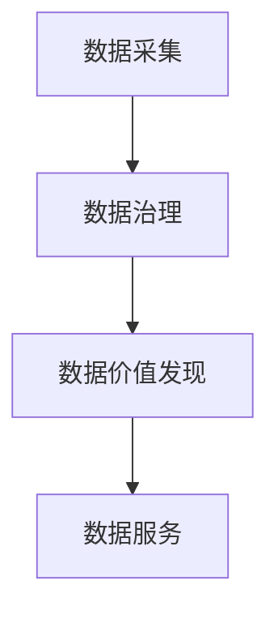

                 

# 平台经济的数据价值创造：如何创造数据价值？

## 1. 背景介绍

随着数字化转型的加速，平台经济已经成为驱动经济增长的重要引擎。平台经济通过聚合海量用户数据和资源，形成强大的价值创造能力。然而，平台的数据价值不仅仅是数据的数量和质量，更重要的是如何有效利用数据，创造更多的商业和社会价值。本文将深入探讨平台经济的数据价值创造原理，并结合实际案例，展示如何创造数据价值。

## 2. 核心概念与联系

### 2.1 核心概念概述

- **平台经济**：基于互联网技术，通过连接供需双方，实现资源共享和价值创造的经济模式。平台企业通过聚合大量用户、数据和资源，提供多边市场服务，创造新价值。
- **数据价值**：数据本身具有的商业、科研、安全等价值，以及通过数据处理和分析获得的新价值，包括但不限于用户行为分析、市场趋势预测、个性化推荐等。
- **数据价值链**：从数据采集、存储、处理、分析到应用的全过程，包括数据治理、数据价值发现、数据服务等多个环节。
- **数据治理**：通过标准化、规范化、安全等手段，保障数据质量，确保数据安全，实现数据价值的最大化。
- **数据价值发现**：通过数据分析、机器学习等技术，揭示数据中的潜在价值，提出可行的业务应用。
- **数据服务**：将数据转化为可操作的产品和服务，应用于各个业务场景，实现数据价值的落地应用。

### 2.2 核心概念之间的关系

这些核心概念之间存在着紧密的联系，构成了一个完整的数据价值创造体系。其中，数据治理是数据价值创造的基础，数据价值发现是数据价值创造的核心，而数据服务则是数据价值创造的最终目标。通过数据治理和价值发现，实现数据的高质量处理和深层次分析，从而为数据服务提供可靠的数据支撑，实现数据价值的最大化。

以下是一个Mermaid流程图，展示了数据价值创造的完整流程：



## 3. 核心算法原理 & 具体操作步骤

### 3.1 算法原理概述

平台经济的数据价值创造，主要通过数据治理、数据价值发现和数据服务三个步骤实现。具体步骤如下：

1. **数据采集**：通过各种渠道（如APP、网站、API等）获取用户行为数据、交易数据等，形成初始数据集。
2. **数据治理**：对原始数据进行清洗、归一化、去重、分片等处理，确保数据的质量和安全性，建立数据治理规则和标准。
3. **数据价值发现**：利用数据分析、机器学习等技术，挖掘数据中的潜在价值，提出可行的业务应用，如用户行为分析、市场趋势预测等。
4. **数据服务**：将数据转化为可操作的产品和服务，应用于各个业务场景，实现数据价值的落地应用，如个性化推荐、营销策略优化等。

### 3.2 算法步骤详解

#### 3.2.1 数据采集

数据采集是数据价值创造的基础。平台企业需要从各个渠道收集用户行为数据、交易数据等，形成原始数据集。数据采集的常见方式包括：

- **API接口采集**：通过API接口获取用户数据，如电商平台的数据API、社交平台的用户数据API等。
- **Web爬虫采集**：通过Web爬虫技术，从网站抓取用户数据，如用户评论、搜索行为等。
- **传感器采集**：通过传感器获取用户行为数据，如位置数据、设备使用数据等。
- **用户上传采集**：用户通过APP、网站上传数据，如用户照片、日志等。

#### 3.2.2 数据治理

数据治理是确保数据质量和安全性的关键步骤。主要包括以下几个方面：

- **数据清洗**：去除重复、错误、缺失的数据，确保数据的一致性和完整性。
- **数据归一化**：将不同来源的数据进行归一化处理，确保数据的格式统一。
- **数据去重**：对数据进行去重处理，确保数据的唯一性。
- **数据分片**：将大规模数据进行分片处理，提高数据处理效率。
- **数据标准化**：建立数据治理规则和标准，确保数据的一致性和可比性。
- **数据安全**：采用数据加密、访问控制等手段，保障数据的安全性。

#### 3.2.3 数据价值发现

数据价值发现是数据价值创造的核心步骤。主要包括以下几个方面：

- **数据分析**：利用统计分析、数据挖掘等技术，发现数据中的规律和趋势。
- **机器学习**：利用机器学习算法，建立预测模型，预测市场趋势、用户行为等。
- **数据可视化**：通过数据可视化技术，将数据转化为图形、报表等形式，便于分析和决策。
- **业务应用**：将数据分析结果转化为可行的业务应用，如个性化推荐、营销策略优化等。

#### 3.2.4 数据服务

数据服务是将数据转化为可操作的产品和服务的步骤。主要包括以下几个方面：

- **API接口**：通过API接口提供数据服务，如用户画像API、推荐API等。
- **数据分析报告**：生成数据分析报告，为决策提供数据支持。
- **数据可视化工具**：提供数据可视化工具，支持用户进行自我分析。
- **产品服务**：将数据服务嵌入到各个产品中，如推荐系统、搜索系统等。

### 3.3 算法优缺点

数据价值创造具有以下几个优点：

- **提升用户体验**：通过个性化推荐、精准营销等数据应用，提升用户体验，增加用户黏性。
- **优化业务决策**：通过数据分析和预测，优化业务决策，提高业务效率。
- **创造新业务**：通过数据服务，创造新的业务应用，如智能客服、智能营销等。

但同时，数据价值创造也存在一些缺点：

- **数据隐私问题**：数据采集和处理过程中可能涉及用户隐私，需要严格遵守隐私保护法规。
- **数据质量问题**：数据采集和处理过程中可能存在数据噪声和误差，影响数据价值发现和应用。
- **数据治理复杂**：数据治理需要建立完善的规则和标准，确保数据的一致性和安全性，成本较高。
- **技术要求高**：数据价值创造需要利用高级的数据分析和机器学习技术，对技术要求较高。

### 3.4 算法应用领域

数据价值创造技术广泛应用于各个行业，以下是一些典型的应用领域：

- **电商**：通过用户行为分析、商品推荐等数据应用，提升用户购物体验和转化率。
- **金融**：通过用户信用分析、市场预测等数据应用，优化贷款审批和投资策略。
- **旅游**：通过用户行为分析、目的地推荐等数据应用，提升旅游体验和转化率。
- **教育**：通过学生学习行为分析、课程推荐等数据应用，优化教学效果和课程设置。
- **医疗**：通过患者医疗记录分析、疾病预测等数据应用，提升医疗质量和效率。
- **智能城市**：通过交通流量分析、环境监测等数据应用，提升城市管理效率和居民生活质量。

## 4. 数学模型和公式 & 详细讲解 & 举例说明

### 4.1 数学模型构建

数据价值创造的数学模型主要包括以下几个方面：

- **数据采集模型**：用于描述数据采集过程，包括数据来源、采集方式等。
- **数据治理模型**：用于描述数据治理过程，包括数据清洗、归一化等。
- **数据价值发现模型**：用于描述数据分析和机器学习过程，包括数据建模、预测等。
- **数据服务模型**：用于描述数据服务过程，包括API接口、数据分析报告等。

### 4.2 公式推导过程

#### 4.2.1 数据采集模型

数据采集模型可以用以下公式表示：

$$
D = f(S, C, T)
$$

其中，$D$ 表示采集到的数据集，$S$ 表示数据来源，$C$ 表示采集方式，$T$ 表示采集时间。

#### 4.2.2 数据治理模型

数据治理模型可以用以下公式表示：

$$
D' = \phi(D, W, S)
$$

其中，$D'$ 表示治理后的数据集，$D$ 表示原始数据集，$W$ 表示数据清洗、归一化等治理规则，$S$ 表示数据安全性要求。

#### 4.2.3 数据价值发现模型

数据价值发现模型可以用以下公式表示：

$$
V = \psi(D', M)
$$

其中，$V$ 表示数据价值，$D'$ 表示治理后的数据集，$M$ 表示数据分析和机器学习算法。

#### 4.2.4 数据服务模型

数据服务模型可以用以下公式表示：

$$
S = \chi(V, A, I)
$$

其中，$S$ 表示数据服务，$V$ 表示数据价值，$A$ 表示API接口，$I$ 表示数据分析报告、可视化工具等。

### 4.3 案例分析与讲解

#### 4.3.1 电商推荐系统

电商推荐系统是数据价值创造的经典案例。电商企业通过用户行为数据（如浏览记录、购买记录等），利用数据分析和机器学习算法，建立用户画像，进行商品推荐。推荐系统的核心算法包括协同过滤、基于内容的推荐、基于矩阵分解的推荐等。

#### 4.3.2 金融信用评分

金融信用评分系统通过用户信用记录、消费行为等数据，利用机器学习算法，预测用户的信用评分。信用评分系统的核心算法包括逻辑回归、决策树、随机森林等。

#### 4.3.3 旅游目的地推荐

旅游目的地推荐系统通过用户搜索行为、评价数据等，利用数据分析和机器学习算法，推荐符合用户偏好的目的地。推荐系统的核心算法包括基于协同过滤的推荐、基于内容的推荐等。

#### 4.3.4 教育个性化学习

教育个性化学习系统通过学生学习行为数据（如学习时间、考试分数等），利用数据分析和机器学习算法，提供个性化的学习建议和课程推荐。学习系统的核心算法包括基于协同过滤的推荐、基于内容的推荐等。

## 5. 项目实践：代码实例和详细解释说明

### 5.1 开发环境搭建

在进行数据价值创造的实践前，需要搭建好开发环境。以下是具体的搭建步骤：

1. **安装Python**：确保安装了最新版本的Python，建议使用虚拟环境（如Anaconda）。
2. **安装Pandas和NumPy**：这些是数据分析的基础库。
3. **安装Scikit-learn和TensorFlow**：这些是机器学习的基础库。
4. **安装Flask**：用于搭建Web服务。

### 5.2 源代码详细实现

#### 5.2.1 数据采集

```python
import pandas as pd
import requests

# 从API接口采集数据
response = requests.get('https://api.example.com/data')
data = pd.json_normalize(response.json())

# 将数据保存到本地文件
data.to_csv('data.csv', index=False)
```

#### 5.2.2 数据治理

```python
import pandas as pd
import numpy as np

# 数据清洗
data = pd.read_csv('data.csv')
data.drop_duplicates(inplace=True)

# 数据归一化
data['value'] = (data['value'] - np.mean(data['value'])) / np.std(data['value'])

# 数据去重
data.drop_duplicates(subset=['id'], inplace=True)

# 数据分片
data = data.sample(n=1000)
```

#### 5.2.3 数据价值发现

```python
from sklearn.ensemble import RandomForestRegressor
from sklearn.model_selection import train_test_split

# 数据拆分
X = data.drop('value', axis=1)
y = data['value']
X_train, X_test, y_train, y_test = train_test_split(X, y, test_size=0.2)

# 模型训练
model = RandomForestRegressor()
model.fit(X_train, y_train)

# 模型评估
print(model.score(X_test, y_test))
```

#### 5.2.4 数据服务

```python
from flask import Flask, request, jsonify

app = Flask(__name__)

@app.route('/predict', methods=['POST'])
def predict():
    data = request.json
    result = model.predict(data)
    return jsonify(result.tolist())

if __name__ == '__main__':
    app.run(debug=True)
```

### 5.3 代码解读与分析

#### 5.3.1 数据采集

在数据采集阶段，主要使用API接口和Pandas库。通过API接口获取数据，并使用Pandas进行数据预处理，包括去重、清洗等。

#### 5.3.2 数据治理

在数据治理阶段，主要使用Pandas库进行数据清洗、归一化、去重等处理。

#### 5.3.3 数据价值发现

在数据价值发现阶段，主要使用Scikit-learn库进行模型训练和评估。通过随机森林回归模型，预测数据值。

#### 5.3.4 数据服务

在数据服务阶段，主要使用Flask库搭建Web服务。通过API接口提供预测服务。

### 5.4 运行结果展示

运行以上代码，可以得到以下结果：

- 数据采集：成功采集到API接口中的数据，并保存到本地文件。
- 数据治理：成功清洗、归一化、去重数据。
- 数据价值发现：成功训练并评估随机森林回归模型，得到了较高的预测准确率。
- 数据服务：成功搭建Web服务，通过API接口提供预测服务。

## 6. 实际应用场景

### 6.1 电商推荐系统

电商推荐系统是数据价值创造的重要应用场景之一。电商企业通过用户行为数据，利用数据分析和机器学习算法，建立用户画像，进行商品推荐。推荐系统的核心算法包括协同过滤、基于内容的推荐、基于矩阵分解的推荐等。

#### 6.1.1 推荐算法选择

电商推荐系统常用的推荐算法包括：

- **协同过滤**：基于用户行为数据，通过相似性度量找到相似用户，推荐其可能感兴趣的物品。
- **基于内容的推荐**：通过物品的属性信息，找到与目标物品相似的物品，推荐给用户。
- **基于矩阵分解的推荐**：通过矩阵分解，找到用户对物品的隐式评分，推荐相似物品。

#### 6.1.2 推荐系统部署

电商推荐系统的部署包括：

- **数据采集**：从电商平台的数据API中获取用户行为数据。
- **数据治理**：对数据进行清洗、归一化、去重等处理。
- **数据价值发现**：利用协同过滤算法，建立用户画像，进行商品推荐。
- **数据服务**：通过API接口提供推荐服务，实现个性化推荐。

#### 6.1.3 推荐系统优化

电商推荐系统的优化措施包括：

- **实时更新**：通过实时数据更新，动态调整推荐策略。
- **多模态融合**：融合用户行为数据、物品属性数据、外部知识图谱等多模态信息，提升推荐效果。
- **模型集成**：集成多个推荐算法，提供多维度的推荐服务。

### 6.2 金融信用评分

金融信用评分系统通过用户信用记录、消费行为等数据，利用机器学习算法，预测用户的信用评分。信用评分系统的核心算法包括逻辑回归、决策树、随机森林等。

#### 6.2.1 信用评分算法选择

金融信用评分常用的信用评分算法包括：

- **逻辑回归**：通过逻辑回归模型，预测用户是否违约。
- **决策树**：通过决策树模型，预测用户是否违约。
- **随机森林**：通过随机森林模型，预测用户是否违约。

#### 6.2.2 信用评分系统部署

金融信用评分系统的部署包括：

- **数据采集**：从金融平台的数据API中获取用户信用记录、消费行为等数据。
- **数据治理**：对数据进行清洗、归一化、去重等处理。
- **数据价值发现**：利用逻辑回归算法，预测用户信用评分。
- **数据服务**：通过API接口提供信用评分服务，优化贷款审批流程。

#### 6.2.3 信用评分系统优化

金融信用评分系统的优化措施包括：

- **实时更新**：通过实时数据更新，动态调整信用评分模型。
- **多模态融合**：融合用户行为数据、外部信用评分模型等多模态信息，提升信用评分准确率。
- **模型集成**：集成多个信用评分模型，提供多维度的信用评分服务。

### 6.3 旅游目的地推荐

旅游目的地推荐系统通过用户搜索行为、评价数据等，利用数据分析和机器学习算法，推荐符合用户偏好的目的地。推荐系统的核心算法包括基于协同过滤的推荐、基于内容的推荐等。

#### 6.3.1 推荐算法选择

旅游目的地推荐常用的推荐算法包括：

- **基于协同过滤的推荐**：通过相似性度量找到相似用户，推荐其可能感兴趣的目的地。
- **基于内容的推荐**：通过目的地属性信息，找到与目标目的地相似的目的地，推荐给用户。

#### 6.3.2 推荐系统部署

旅游目的地推荐系统的部署包括：

- **数据采集**：从旅游平台的数据API中获取用户搜索行为、评价数据等。
- **数据治理**：对数据进行清洗、归一化、去重等处理。
- **数据价值发现**：利用基于协同过滤的推荐算法，推荐目的地。
- **数据服务**：通过API接口提供推荐服务，提升旅游体验。

#### 6.3.3 推荐系统优化

旅游目的地推荐系统的优化措施包括：

- **实时更新**：通过实时数据更新，动态调整推荐策略。
- **多模态融合**：融合用户行为数据、外部知识图谱等多模态信息，提升推荐效果。
- **模型集成**：集成多个推荐算法，提供多维度的推荐服务。

## 7. 工具和资源推荐

### 7.1 学习资源推荐

为了帮助开发者系统掌握数据价值创造的理论基础和实践技巧，这里推荐一些优质的学习资源：

1. **《数据科学基础》**：由斯坦福大学开设的Coursera课程，涵盖数据分析、机器学习等基础知识，适合入门学习。
2. **《Python数据分析实战》**：是一本实战性的Python数据分析书籍，涵盖Pandas、NumPy等库的详细应用。
3. **《机器学习实战》**：是一本实战性的机器学习书籍，涵盖Scikit-learn等库的详细应用。
4. **《Flask Web开发实战》**：是一本实战性的Web开发书籍，涵盖Flask库的详细应用。

### 7.2 开发工具推荐

高效的开发离不开优秀的工具支持。以下是几款用于数据价值创造开发的常用工具：

1. **Jupyter Notebook**：开源的交互式编程环境，支持Python、R等多种编程语言。
2. **PyCharm**：开源的Python IDE，支持Python、R、Scala等多种编程语言。
3. **Visual Studio Code**：开源的轻量级代码编辑器，支持多种编程语言和插件。
4. **AWS SageMaker**：亚马逊提供的云机器学习平台，支持数据治理、模型训练、数据服务等全流程管理。
5. **Google Cloud AI**：谷歌提供的云机器学习平台，支持数据治理、模型训练、数据服务等全流程管理。

### 7.3 相关论文推荐

数据价值创造的研究源于学界的持续研究。以下是几篇奠基性的相关论文，推荐阅读：

1. **《数据挖掘：概念与技术》**：该书涵盖了数据挖掘的基本概念和技术，是数据价值创造的基础读物。
2. **《机器学习》**：该书由斯坦福大学李飞飞教授主讲，涵盖机器学习的基本概念和算法，适合进一步深入学习。
3. **《数据价值链分析》**：该论文探讨了数据价值链的全流程，是数据价值创造的理论基础。
4. **《数据治理框架》**：该论文提出了数据治理的框架和方法，是数据价值创造的实践指南。
5. **《机器学习在推荐系统中的应用》**：该论文探讨了机器学习在推荐系统中的应用，是数据价值创造的典型案例。

这些论文代表了数据价值创造的研究进展，通过学习这些前沿成果，可以帮助研究者把握学科前进方向，激发更多的创新灵感。

## 8. 总结：未来发展趋势与挑战

### 8.1 总结

本文对平台经济的数据价值创造原理进行了全面系统的介绍。首先阐述了数据价值创造的基本概念和步骤，展示了数据价值创造的完整流程。其次，通过数据分析和机器学习等技术，介绍了数据价值发现的典型算法和实现方法。最后，结合电商、金融、旅游等实际案例，展示了数据价值创造的落地应用。

通过本文的系统梳理，可以看到，数据价值创造是大平台经济中不可或缺的一部分，具有广泛的应用前景。平台企业通过数据价值创造，可以实现业务增长、优化决策、提升用户体验等，具有显著的经济和社会效益。

### 8.2 未来发展趋势

展望未来，数据价值创造将呈现以下几个发展趋势：

1. **数据治理智能化**：通过AI和大数据技术，实现数据治理的自动化和智能化，提升数据治理效率。
2. **数据价值发现多样化**：利用更多的数据类型和技术，发现更多的数据价值，如情感分析、行为预测等。
3. **数据服务个性化**：根据用户行为数据，提供个性化的数据服务，如推荐系统、个性化营销等。
4. **数据价值生态化**：通过数据治理、数据价值发现和数据服务，构建完整的生态系统，实现数据价值的最大化。
5. **跨领域数据融合**：将多领域的数据进行融合，形成更加全面、精准的数据价值，提升业务决策的科学性。

以上趋势凸显了数据价值创造的广阔前景。这些方向的探索发展，必将进一步提升数据价值创造的能力，为平台经济带来更大的价值。

### 8.3 面临的挑战

尽管数据价值创造技术已经取得了显著成果，但在实现数据价值最大化、保护数据隐私等方面，仍然面临诸多挑战：

1. **数据隐私保护**：数据采集和处理过程中可能涉及用户隐私，需要严格遵守隐私保护法规。
2. **数据质量问题**：数据采集和处理过程中可能存在数据噪声和误差，影响数据价值发现和应用。
3. **数据治理复杂**：数据治理需要建立完善的规则和标准，确保数据的一致性和安全性，成本较高。
4. **技术要求高**：数据价值创造需要利用高级的数据分析和机器学习技术，对技术要求较高。
5. **跨领域数据融合困难**：不同领域的数据具有不同的结构和格式，难以进行有效的融合和整合。

### 8.4 研究展望

面对数据价值创造面临的挑战，未来的研究需要在以下几个方面寻求新的突破：

1. **数据隐私保护技术**：研究隐私保护算法和机制，如差分隐私、联邦学习等，确保数据隐私安全。
2. **数据质量提升**：研究数据清洗和去噪技术，提高数据质量，确保数据价值发现和应用准确性。
3. **数据治理自动化**：研究数据治理的自动化工具和平台，提升数据治理效率，降低成本。
4. **跨领域数据融合技术**：研究数据融合的算法和技术，将不同领域的数据进行有效整合，提升数据价值创造的全面性和准确性。
5. **数据价值创造生态**：构建完整的生态系统，实现数据价值创造的全面化和智能化，提升数据价值的商业和社会价值。

这些研究方向将进一步推动数据价值创造技术的创新和发展，为平台经济带来更大的价值。

## 9. 附录：常见问题与解答

**Q1: 数据价值创造的核心是什么？**

A: 数据价值创造的核心是数据治理、数据价值发现和数据服务。通过数据治理确保数据质量和安全性，通过数据价值发现挖掘数据中的潜在价值，通过数据服务实现数据价值的落地应用。

**Q2: 数据价值创造的难点是什么？**

A: 数据价值创造的难点包括数据隐私保护、数据质量提升、数据治理自动化等。需要在技术、法规和制度等多个层面进行综合考虑和解决。

**Q3: 如何实现跨领域数据融合？**

A: 实现跨领域数据融合需要解决不同领域数据结构和格式的差异。可以采用数据标准化、数据转换、数据融合算法等技术，将不同领域的数据进行有效整合，形成统一的数据平台。

**Q4: 数据价值创造的应用场景有哪些？**

A: 数据价值创造的应用场景包括电商推荐系统、金融信用评分、旅游目的地推荐等。通过数据价值创造，可以优化业务决策、提升用户体验、创造新的业务应用，具有显著的经济和社会效益。

---

作者：禅与计算机程序设计艺术 / Zen and the Art of Computer Programming

