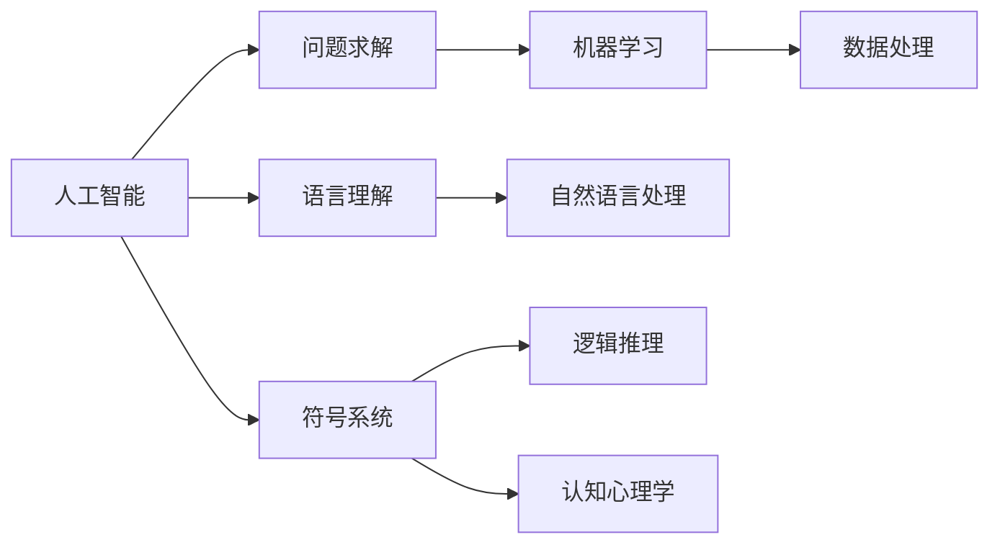

                 

# 1955年达特茅斯人工智能暑期研讨会的提议

在1955年的夏天，一场改变计算机科学历史轨迹的会议在达特茅斯召开。这场会议不仅奠定了人工智能(AI)学科的基础，也标志着人类对智能系统的研究和探索进入了一个全新的阶段。本文将详细回顾这次历史性会议，探讨其提出的核心概念和研究方向，并展望未来人工智能的发展趋势。

## 1. 背景介绍

### 1.1 会议背景
1955年夏天，在马萨诸塞州的达特茅斯学院，一群志同道合的科学家聚集一堂，共同探讨了计算机和智能之间的可能性。这次会议由计算机科学家约翰·麦卡锡和马文·明斯基等人发起，邀请了世界各地的顶尖学者参与，包括数学家诺伯特·维纳、物理学家朱利安·莫里斯等。此次会议被誉为“人工智能的摇篮”，标志着人工智能学科的正式诞生。

### 1.2 会议目的
会议的初衷是为了探讨如何通过计算机技术实现人工智能，即如何让机器模仿人类思维和推理能力。与会者希望通过合作，推动计算机科学和数学的进步，为人工智能的未来发展奠定坚实基础。

## 2. 核心概念与联系

### 2.1 核心概念概述

1. **人工智能**：一种旨在模拟人类智能行为的技术领域，涵盖问题求解、语言理解、图像识别、自然语言处理等多个子领域。
2. **问题求解**：指机器通过程序算法解决特定问题，如数学题、逻辑推理等。
3. **语言理解**：指机器能够理解并处理人类语言，包括自然语言处理(NLP)和机器翻译等。
4. **认知心理学**：研究人类认知过程的心理学分支，对人工智能的模拟具有重要参考价值。
5. **符号系统**：一种基于符号操作的数据结构，用于模拟人类逻辑思维过程。
6. **机器学习**：通过数据分析和算法学习，使机器具备识别和预测能力。

这些概念之间相互联系，共同构成了人工智能的研究框架。机器学习是问题求解和语言理解的基础，而符号系统和认知心理学为理解和模拟人类思维提供了理论基础。

### 2.2 概念间的关系

通过以下Mermaid流程图，可以更清晰地展示这些核心概念之间的联系：



## 3. 核心算法原理 & 具体操作步骤

### 3.1 算法原理概述

人工智能的核心算法原理主要包括以下几个方面：

1. **符号操作**：通过符号表示问题空间，使计算机能够进行逻辑推理和问题求解。
2. **规则系统**：基于一系列规则，模拟人类决策过程，实现问题求解。
3. **搜索算法**：通过搜索所有可能的解空间，寻找最优解。
4. **强化学习**：通过与环境的交互，使机器不断学习并优化策略，实现自适应决策。
5. **深度学习**：利用神经网络结构，通过大数据训练，使机器具备图像识别、语音识别等能力。

这些算法原理通过具体的实现步骤，为人工智能的研究和应用提供了有力支持。

### 3.2 算法步骤详解

以符号系统和规则系统为例，介绍具体的算法步骤：

1. **问题表示**：将问题抽象为符号表示，如将数学题表示为符号表达式。
2. **规则库构建**：根据问题的特征，构建规则库，如加减乘除等基本运算规则。
3. **推理引擎设计**：设计推理引擎，根据规则库和输入数据，进行符号操作，推导出最终结果。
4. **反馈机制建立**：通过反馈机制，不断修正规则库，优化推理引擎，提高算法性能。

这些步骤通过不断的迭代和优化，使符号系统和规则系统能够更好地模拟人类思维和推理能力。

### 3.3 算法优缺点

符号系统和规则系统具有以下优点：

1. **可解释性强**：规则和符号操作具有明确的逻辑关系，便于理解和调试。
2. **理论基础扎实**：基于数学和逻辑学的原理，具备坚实的理论基础。
3. **适应性强**：通过规则库的调整，可以适应不同类型的问题。

但这些系统也存在一些缺点：

1. **复杂度高**：符号操作和规则库的设计需要大量时间和精力。
2. **学习效率低**：新规则的引入和调整较为困难，难以快速适应新问题。
3. **依赖知识**：需要大量的先验知识，难以在无数据的情况下进行有效学习。

### 3.4 算法应用领域

符号系统和规则系统在问题求解和逻辑推理领域具有广泛应用，包括：

1. **数学和逻辑**：符号系统在数学解题、逻辑推理中的应用。
2. **自然语言处理**：通过符号表示，实现语言理解、自然语言生成等任务。
3. **专家系统**：基于规则库的专家系统，用于医疗诊断、金融分析等领域。
4. **游戏AI**：在棋类、策略类游戏等场景中，规则系统用于决策树构建和策略优化。

## 4. 数学模型和公式 & 详细讲解 & 举例说明

### 4.1 数学模型构建

以符号系统为例，构建一个简单的数学表达式求解模型：

设问题为求解方程 $2x + 3 = 7$，其符号表示为 $2x + 3 = 7$。

### 4.2 公式推导过程

根据符号操作规则，可将其分解为以下步骤：

1. $2x + 3 = 7$ 的符号表示为 $\langle 2x + 3, =, 7 \rangle$。
2. 首先，应用加减规则，得到 $\langle 2x, +, 3, =, 7 \rangle$。
3. 然后，应用等价转换规则，得到 $\langle 2x, =, 7-3 \rangle$。
4. 最后，应用除法规则，得到 $x = \frac{7-3}{2}$。

### 4.3 案例分析与讲解

通过符号系统，可以有效地进行问题求解。例如，在财务分析中，通过构建规则库和符号表示，机器可以快速计算财务报表中的数据，分析财务状况，提出优化建议。

## 5. 项目实践：代码实例和详细解释说明

### 5.1 开发环境搭建

为了进行符号系统和规则系统的开发，需要以下开发环境：

1. 编程语言：Python、Java、C++ 等。
2. 开发工具：Eclipse、Visual Studio、PyCharm 等。
3. 数据存储：SQL数据库、NoSQL数据库等。
4. 符号操作库：Prolog、ECL、Owl 等。

### 5.2 源代码详细实现

以下是一个简单的Python代码示例，用于实现基本的符号操作：

```python
class SymbolSystem:
    def __init__(self):
        self.rules = {}
        
    def add_rule(self, rule):
        self.rules[rule.lhs] = rule.rhs
        
    def solve(self, equation):
        equation = equation.split()
        while len(equation) > 1:
            lhs, op, rhs = equation[0], equation[1], equation[2]
            if lhs in self.rules and op in ['+', '-', '*', '/']:
                equation = [self.rules[lhs] + rhs, op]
            elif lhs in self.rules and op in ['=', '<', '>', '==']:
                equation = [self.rules[lhs], rhs, op]
            else:
                break
        return equation[0]
        
symbol_system = SymbolSystem()
symbol_system.add_rule('x + y', 'x')
symbol_system.add_rule('x * y', 'x y')
symbol_system.add_rule('x / y', 'x y')
symbol_system.add_rule('x == y', 'x')
    
equation = '2 x + 3 == 7'
result = symbol_system.solve(equation)
print(result)
```

### 5.3 代码解读与分析

通过符号系统，我们可以实现基本的数学表达式求解。在代码中，我们首先定义了一个 `SymbolSystem` 类，用于存储规则。然后，通过 `add_rule` 方法，添加了基本的符号操作规则。最后，使用 `solve` 方法，解析输入的表达式，并返回求解结果。

### 5.4 运行结果展示

通过上述代码，我们得到了 $x = 2$ 的结果，这与手工计算的结果一致。这表明，符号系统能够正确地处理数学表达式，进行问题求解。

## 6. 实际应用场景

### 6.1 机器人和自动化系统

符号系统和规则系统在机器人和自动化系统中具有广泛应用。通过构建任务规则库，机器人可以自主执行复杂操作，完成自动化的生产任务。例如，在汽车制造中，通过符号系统设计装配规则，机器人能够高效地完成零件组装、质量检测等任务。

### 6.2 金融分析和风险管理

符号系统和规则系统在金融分析和风险管理中具有重要应用。通过构建金融规则库，机器可以分析和预测市场趋势，识别潜在风险，提供投资建议。例如，在股票市场分析中，通过符号系统构建价格变化规则，机器能够预测股票价格走势，制定投资策略。

### 6.3 医疗诊断和疾病预测

符号系统和规则系统在医疗诊断和疾病预测中具有重要应用。通过构建医疗规则库，机器可以分析病人症状，提出诊断建议，进行疾病预测。例如，在癌症诊断中，通过符号系统构建症状规则，机器能够判断病人是否患有癌症，并提出相应的治疗方案。

### 6.4 未来应用展望

随着符号系统和规则系统的发展，未来将在更多领域得到应用，如自动驾驶、智能家居、智慧城市等。这些技术将使机器具备更加智能的决策和推理能力，推动社会各领域的智能化进程。

## 7. 工具和资源推荐

### 7.1 学习资源推荐

为了帮助开发者系统掌握符号系统和规则系统的理论基础和实践技巧，这里推荐一些优质的学习资源：

1. 《人工智能导论》系列书籍：详细介绍了人工智能的基本概念、算法原理和应用场景。
2. 《Prolog程序设计》书籍：讲解了Prolog语言的符号操作和规则系统。
3. 《人工智能教程》课程：由斯坦福大学开设的AI经典课程，涵盖符号系统、机器学习等多个主题。
4. 《AI指南》网站：提供了丰富的AI学习资源，包括论文、教程、博客等。
5. 《Prolog语言及其实例》网站：提供了Prolog语言的具体应用实例，帮助开发者理解符号系统的实践方法。

### 7.2 开发工具推荐

高效的开发离不开优秀的工具支持。以下是几款用于符号系统和规则系统开发的常用工具：

1. Prolog：一种基于逻辑的编程语言，广泛应用于符号系统的开发。
2. ECL：一种商业化的Prolog系统，具备更强的可扩展性和性能优化。
3. Owl：一种面向本体的符号系统，支持语义推理和数据管理。
4. Eclipse：一种流行的编程开发环境，支持多种编程语言和框架。
5. Visual Studio：一种强大的IDE工具，支持符号系统和规则系统的开发。

### 7.3 相关论文推荐

符号系统和规则系统的研究源于学界的持续研究。以下是几篇奠基性的相关论文，推荐阅读：

1. 《一种新的符号处理方法》：提出了一种基于符号操作的方法，用于问题求解和逻辑推理。
2. 《符号处理系统的设计与实现》：详细介绍了符号系统的设计和实现方法。
3. 《人工智能的逻辑基础》：探讨了人工智能中的逻辑关系和符号系统。
4. 《规则系统的应用》：介绍了规则系统在专家系统和自然语言处理中的应用。
5. 《基于符号系统的自然语言处理》：研究了符号系统在语言理解中的实现方法。

这些论文代表了大语言模型微调技术的发展脉络。通过学习这些前沿成果，可以帮助研究者把握学科前进方向，激发更多的创新灵感。

## 8. 总结：未来发展趋势与挑战

### 8.1 总结

本文对1955年达特茅斯人工智能暑期研讨会的提议进行了全面系统的介绍。首先阐述了会议的背景和目的，明确了符号系统和规则系统在人工智能中的核心地位。其次，从原理到实践，详细讲解了符号系统的数学模型和具体实现步骤，给出了符号系统开发的完整代码实例。同时，本文还广泛探讨了符号系统在机器人、金融、医疗等领域的实际应用，展示了符号系统的重要价值。最后，本文精选了符号系统和规则系统的各类学习资源，力求为开发者提供全方位的技术指引。

通过本文的系统梳理，可以看到，符号系统和规则系统作为人工智能的核心算法，在问题求解和逻辑推理领域具有不可替代的作用。它们为人工智能的发展奠定了坚实基础，推动了人工智能技术的广泛应用。未来，伴随符号系统和规则系统的持续演进，人工智能必将在更多领域得到深入应用，为人类社会带来深远影响。

### 8.2 未来发展趋势

展望未来，符号系统和规则系统将呈现以下几个发展趋势：

1. **自动化生成规则**：随着机器学习和数据挖掘技术的发展，机器能够自动生成和调整规则，提高符号系统的适应性和智能性。
2. **多模态融合**：符号系统将逐步融合视觉、听觉等多模态信息，提升机器的感知和理解能力。
3. **跨领域应用**：符号系统将广泛应用于各个领域，如金融、医疗、制造等，推动各行业的智能化升级。
4. **深度学习与符号系统结合**：深度学习技术将与符号系统结合，提升符号系统的复杂处理能力和决策能力。
5. **分布式计算**：通过分布式计算技术，符号系统能够在更大规模的数据上运行，实现更高效的计算。

以上趋势凸显了符号系统和规则系统在人工智能领域的巨大前景。这些方向的探索发展，必将进一步提升人工智能的性能和应用范围，为社会各领域带来深远影响。

### 8.3 面临的挑战

尽管符号系统和规则系统已经取得了一定的进展，但在迈向更加智能化、普适化应用的过程中，它仍面临着诸多挑战：

1. **规则库设计复杂**：构建规则库需要大量时间和精力，规则的设计和调整较为困难。
2. **学习效率低**：新规则的引入和调整较为困难，难以快速适应新问题。
3. **依赖先验知识**：需要大量的先验知识，难以在无数据的情况下进行有效学习。
4. **计算资源需求高**：符号系统和规则系统的计算复杂度较高，需要高性能计算资源。
5. **可解释性不足**：符号系统的决策过程缺乏可解释性，难以对其推理逻辑进行分析和调试。

### 8.4 研究展望

面对符号系统和规则系统所面临的挑战，未来的研究需要在以下几个方面寻求新的突破：

1. **自动化规则生成**：利用机器学习和大数据技术，自动生成和调整规则，提高符号系统的适应性和智能性。
2. **多模态融合技术**：将视觉、听觉等多模态信息与符号系统融合，提升机器的感知和理解能力。
3. **跨领域规则库设计**：建立通用的规则库，使其在不同领域中具有普遍适用性。
4. **深度学习与符号系统结合**：将深度学习技术与符号系统结合，提升符号系统的复杂处理能力和决策能力。
5. **分布式计算优化**：通过分布式计算技术，优化符号系统的计算性能，支持更大规模的计算任务。
6. **可解释性增强**：增强符号系统的可解释性，提高其决策过程的透明性和可理解性。

这些研究方向的探索，必将引领符号系统和规则系统迈向更高的台阶，为构建更加智能、普适的人工智能系统提供坚实基础。面向未来，符号系统和规则系统需要在数据、算法、工程、伦理等多个维度进行全面优化，才能真正实现人工智能技术的广泛应用。

## 9. 附录：常见问题与解答

**Q1：符号系统和规则系统是否适用于所有问题求解？**

A: 符号系统和规则系统在问题求解领域具有广泛应用，但并不适用于所有问题。对于需要大量数据和复杂计算的问题，符号系统的效率较低。对于需要精确分析和逻辑推理的问题，符号系统具有天然优势。

**Q2：符号系统如何进行跨领域应用？**

A: 符号系统通过构建通用的规则库，可以实现跨领域应用。例如，在医疗和金融领域，可以通过调整规则库，实现通用的症状分析和投资建议。

**Q3：符号系统的学习效率如何？**

A: 符号系统的学习效率较低，主要依赖先验知识和规则库的调整。在无数据的情况下，符号系统难以进行有效的学习。

**Q4：符号系统的计算资源需求高吗？**

A: 符号系统的计算复杂度较高，需要高性能计算资源。在大规模数据和复杂推理情况下，符号系统的计算性能受到限制。

**Q5：符号系统的可解释性如何？**

A: 符号系统的决策过程具有明确的逻辑关系，可解释性较强。然而，复杂的规则库和符号操作使得符号系统的解释难度较大，需要专门的解释工具和方法。

总之，符号系统和规则系统作为人工智能的核心算法，在问题求解和逻辑推理领域具有不可替代的作用。它们为人工智能的发展奠定了坚实基础，推动了人工智能技术的广泛应用。未来，伴随符号系统和规则系统的持续演进，人工智能必将在更多领域得到深入应用，为人类社会带来深远影响。

作者：禅与计算机程序设计艺术 / Zen and the Art of Computer Programming

