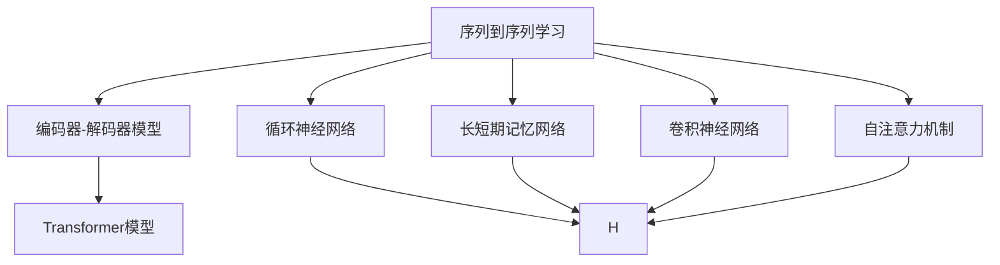
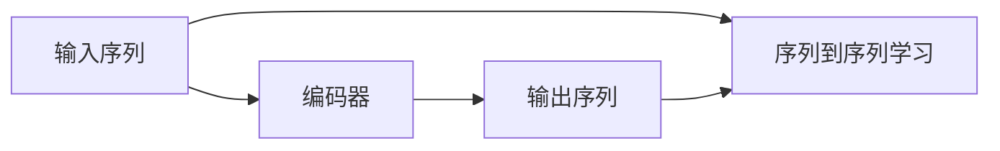
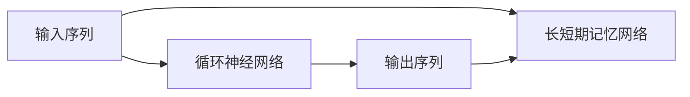
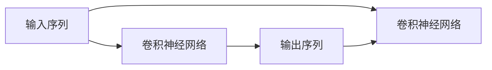
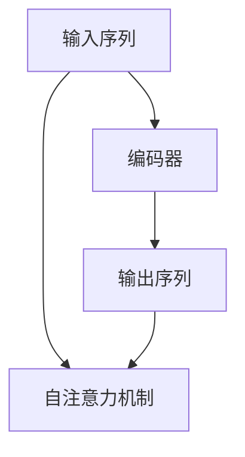
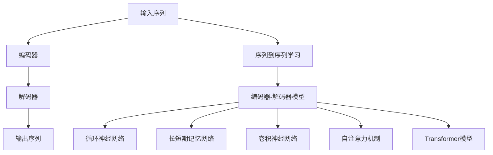

                 

# 序列到序列学习 原理与代码实例讲解

> 关键词：序列到序列学习，编码器-解码器模型，Transformer，循环神经网络(RNN)，长短期记忆网络(LSTM)，卷积神经网络(CNN)

## 1. 背景介绍

### 1.1 问题由来
在人工智能领域，序列到序列(Sequence-to-Sequence, Seq2Seq)学习是一种重要的技术范式，广泛应用于机器翻译、摘要生成、对话系统、图像描述生成等任务。它的核心思想是将输入序列映射到输出序列，通常采用编码器-解码器(Encoder-Decoder)的框架实现。近年来，随着深度学习技术的发展，基于神经网络的序列到序列模型逐渐取代了传统的基于规则和统计的语言模型，成为研究的热点。

本文将深入探讨Seq2Seq学习的原理、模型架构、优化方法等关键问题，并通过代码实例详细讲解如何构建和使用Seq2Seq模型，解决特定任务。

### 1.2 问题核心关键点
Seq2Seq学习的核心在于将输入序列编码为固定长度的向量，然后解码生成输出序列。通常，编码器负责将输入序列转换成语义表示，解码器则根据该语义表示生成输出序列。模型的成功关键在于编码器和解码器的设计，以及如何有效训练这两个组件。

本文将重点介绍Transformer模型和循环神经网络(RNN)模型在Seq2Seq任务中的应用，并对比它们的特点和优缺点。同时，我们将讨论如何在实践中处理序列长度不匹配、解码器生成过程控制等问题。

### 1.3 问题研究意义
序列到序列学习是NLP领域的重要技术之一，广泛应用于机器翻译、文本摘要、对话系统等多个场景。通过学习Seq2Seq技术的原理和实现方法，可以提升模型在特定任务上的性能，加速技术的产业化进程，为传统行业数字化转型升级提供新的技术路径。

## 2. 核心概念与联系

### 2.1 核心概念概述

为更好地理解Seq2Seq学习，本节将介绍几个密切相关的核心概念：

- 序列到序列学习(Seq2Seq)：将输入序列映射到输出序列的过程。例如，机器翻译任务中的源语言句子映射到目标语言句子，摘要生成任务中的长篇文档映射到简短摘要。

- 编码器-解码器模型(Encoder-Decoder)：Seq2Seq任务的基本架构，包含一个编码器和一个解码器。编码器将输入序列转换为固定长度的向量表示，解码器根据该向量生成输出序列。

- 循环神经网络(RNN)：一种能够处理序列数据的神经网络，通过循环结构实现信息在序列上的传递和存储。RNN模型常用于处理时间序列数据，如自然语言处理中的文本序列。

- 长短期记忆网络(LSTM)：一种特殊类型的RNN，通过门控机制解决RNN在长序列训练中存在的梯度消失问题，增强模型记忆长期依赖关系的能力。

- 卷积神经网络(CNN)：一种处理序列数据的神经网络，通过卷积操作提取局部特征，常用于图像描述生成等任务。

- 自注意力机制(Self-Attention)：一种能够对输入序列中所有位置进行交互的机制，用于Transformer模型中，能够提升模型对序列中不同位置依赖关系的建模能力。

这些核心概念之间的逻辑关系可以通过以下Mermaid流程图来展示：



这个流程图展示了这个Seq2Seq学习的基本组件和模型架构。

### 2.2 概念间的关系

这些核心概念之间存在着紧密的联系，形成了Seq2Seq学习的完整生态系统。下面我们通过几个Mermaid流程图来展示这些概念之间的关系。

#### 2.2.1 Seq2Seq学习范式



这个流程图展示了Seq2Seq学习的基本范式：输入序列经过编码器转换成向量表示，然后解码器生成输出序列。

#### 2.2.2 循环神经网络与LSTM



这个流程图展示了RNN模型和LSTM模型在处理序列数据中的应用。RNN通过循环结构实现序列信息传递，LSTM则通过门控机制增强记忆能力。

#### 2.2.3 卷积神经网络与序列数据



这个流程图展示了CNN模型在处理序列数据中的应用。CNN通过卷积操作提取局部特征，能够提升模型对序列中不同位置依赖关系的建模能力。

#### 2.2.4 自注意力机制与Transformer模型



这个流程图展示了自注意力机制在Transformer模型中的应用。自注意力机制能够实现对输入序列中所有位置的交互，提升模型对序列中不同位置依赖关系的建模能力。

### 2.3 核心概念的整体架构

最后，我们用一个综合的流程图来展示这些核心概念在Seq2Seq学习中的整体架构：



这个综合流程图展示了从输入序列到输出序列的整个转换过程，以及各个核心概念在Seq2Seq学习中的具体应用。

## 3. 核心算法原理 & 具体操作步骤
### 3.1 算法原理概述

序列到序列学习的核心在于将输入序列编码成固定长度的向量表示，然后解码生成输出序列。通常，编码器采用RNN、LSTM或CNN等模型，解码器也采用类似的模型。整个模型可以采用监督学习或无监督学习进行训练。

监督学习训练的模型通常包含一个或多个编码器和一个或多个解码器，通过最大化似然函数训练模型参数。无监督学习的模型通常采用自编码器、变分自编码器等架构，通过最小化重构误差训练模型参数。

### 3.2 算法步骤详解

序列到序列学习的基本步骤如下：

1. 数据预处理：将输入序列和输出序列进行标准化，如分词、去除停用词、序列填充等。
2. 构建编码器-解码器模型：选择合适的模型架构，如RNN、LSTM、CNN或Transformer等。
3. 定义损失函数：选择合适的损失函数，如交叉熵损失、均方误差损失等。
4. 训练模型：使用训练集数据，通过优化算法更新模型参数，最小化损失函数。
5. 评估模型：在验证集和测试集上评估模型性能，选择最优模型。
6. 应用模型：将训练好的模型应用于实际任务中，生成输出序列。

### 3.3 算法优缺点

序列到序列学习的优点包括：

- 模型架构简单，易于实现和调试。
- 能够处理变长的输入序列，适应性强。
- 具有良好的泛化能力，适用于多种NLP任务。

缺点包括：

- 模型结构复杂，训练时间长。
- 难以处理长序列，存在梯度消失和梯度爆炸问题。
- 生成过程较为缓慢，实时性较差。

### 3.4 算法应用领域

序列到序列学习在NLP领域得到了广泛的应用，覆盖了几乎所有常见的任务，例如：

- 机器翻译：将源语言句子翻译为目标语言句子。
- 文本摘要：将长篇文档压缩成简短摘要。
- 对话系统：使机器能够与人自然对话。
- 图像描述生成：从图像中生成描述性文本。
- 命名实体识别：识别文本中的人名、地名、机构名等特定实体。
- 情感分析：对文本进行情感倾向分析。
- 机器学习模型：将图像数据转换成文本标签，用于图像分类和标注。

除了上述这些经典任务外，序列到序列学习还被创新性地应用到更多场景中，如信息抽取、问答系统、文本生成等，为NLP技术带来了新的突破。

## 4. 数学模型和公式 & 详细讲解 & 举例说明

### 4.1 数学模型构建

序列到序列学习的数学模型可以表示为：

$$
\begin{aligned}
\text{Encoder}(x) &= h_1 \rightarrow h_2 \rightarrow \cdots \rightarrow h_T \\
\text{Decoder}(h_T) &= o_1 \rightarrow o_2 \rightarrow \cdots \rightarrow o_S
\end{aligned}
$$

其中 $x$ 表示输入序列，$h_t$ 表示编码器在时间步 $t$ 的隐藏状态，$o_s$ 表示解码器在时间步 $s$ 的输出。

### 4.2 公式推导过程

以机器翻译任务为例，假设有源语言句子 $x = (x_1, x_2, \cdots, x_T)$ 和目标语言句子 $y = (y_1, y_2, \cdots, y_S)$，目标是最小化损失函数 $L$：

$$
L = -\sum_{s=1}^{S} \sum_{t=1}^{T} \log p(y_s | y_{<s}, h_T)
$$

其中 $p(y_s | y_{<s}, h_T)$ 表示在给定前面所有目标语言词汇和编码器隐藏状态 $h_T$ 的情况下，生成词汇 $y_s$ 的概率。

为了更好地处理长序列，可以采用注意力机制(Attention Mechanism)，使解码器在生成每个输出时能够参考编码器的所有位置，提升模型的记忆能力。

### 4.3 案例分析与讲解

假设我们要训练一个机器翻译模型，将源语言句子 "I love coding" 翻译为目标语言句子 "J'aime coder"。编码器通过循环神经网络或Transformer模型对输入序列进行编码，得到隐藏状态 $h_T$。解码器通过循环神经网络或Transformer模型对 $h_T$ 和前面生成的目标语言词汇进行解码，得到输出词汇。

在训练过程中，我们定义交叉熵损失函数 $L$：

$$
L = -\sum_{s=1}^{S} \log p(y_s | y_{<s}, h_T)
$$

通过最大化似然函数 $P(y | x)$，最小化损失函数 $L$，即可训练出能够进行翻译的模型。

## 5. 项目实践：代码实例和详细解释说明

### 5.1 开发环境搭建

在进行Seq2Seq模型开发前，我们需要准备好开发环境。以下是使用Python进行TensorFlow开发的环境配置流程：

1. 安装Anaconda：从官网下载并安装Anaconda，用于创建独立的Python环境。

2. 创建并激活虚拟环境：
```bash
conda create -n seq2seq-env python=3.8 
conda activate seq2seq-env
```

3. 安装TensorFlow：根据CUDA版本，从官网获取对应的安装命令。例如：
```bash
conda install tensorflow=2.6.0 tf_addons
```

4. 安装Keras：
```bash
pip install keras
```

5. 安装各类工具包：
```bash
pip install numpy pandas scikit-learn matplotlib tqdm jupyter notebook ipython
```

完成上述步骤后，即可在`seq2seq-env`环境中开始Seq2Seq模型开发。

### 5.2 源代码详细实现

下面我们以机器翻译任务为例，给出使用TensorFlow实现Seq2Seq模型的代码实现。

首先，定义机器翻译任务的数据处理函数：

```python
import numpy as np
from tensorflow.keras.preprocessing.text import Tokenizer
from tensorflow.keras.preprocessing.sequence import pad_sequences

def preprocess_data(texts, labels):
    tokenizer = Tokenizer()
    tokenizer.fit_on_texts(texts)
    sequences = tokenizer.texts_to_sequences(texts)
    labels = tokenizer.texts_to_sequences(labels)
    sequences = pad_sequences(sequences, padding='post')
    labels = pad_sequences(labels, padding='post')
    return sequences, labels
```

然后，定义Seq2Seq模型的编码器和解码器：

```python
from tensorflow.keras.models import Model
from tensorflow.keras.layers import Input, LSTM, Dense, Embedding, Bidirectional

class EncoderRNN:
    def __init__(self, embedding_dim, hidden_dim):
        self.input = Input(shape=(None,))
        self.embedding = Embedding(input_dim=vocab_size, output_dim=embedding_dim, mask_zero=True)(self.input)
        self.lstm = LSTM(hidden_dim, return_sequences=True, return_state=True)
        self.encoder_output, state_h, state_c = self.lstm(self.embedding)
        self.hidden = StatefulWrapper(state_h, batch_size=batch_size)
        self.cell = StatefulWrapper(state_c, batch_size=batch_size)
        
class DecoderRNN:
    def __init__(self, embedding_dim, hidden_dim, output_dim, attention_dim):
        self.input = Input(shape=(None,))
        self.embedding = Embedding(input_dim=vocab_size, output_dim=embedding_dim, mask_zero=True)(self.input)
        self.lstm = LSTM(hidden_dim, return_sequences=True, return_state=True)
        self.attention = Attention()([self.lstm.output, self.hidden.output, self.cell.output])
        self.attention_vector = Dense(attention_dim, activation='relu')(self.attention)
        self.concat = Concatenate()([self.lstm.output, self.attention_vector])
        self.dense = Dense(output_dim, activation='softmax')
        self.model = Model(inputs=self.input, outputs=self.dense(self.concat))
```

接下来，定义Seq2Seq模型的训练函数：

```python
from tensorflow.keras.optimizers import RMSprop

def train_seq2seq(model, encoder, decoder, data):
    encoder.trainable = False
    decoder.trainable = True
    input_seq, label_seq = data
    encoder_outputs, states = encoder.predict(input_seq)
    decoder_state = decoder.get_initial_state(states)
    predictions = []
    for t in range(label_seq.shape[1]):
        target = label_seq[:, t]
        output, state = decoder([target, decoder_state], encoder_outputs)
        predictions.append(output)
        state = state
    predictions = np.vstack(predictions)
    return predictions
```

最后，启动训练流程：

```python
epochs = 10
batch_size = 64

for epoch in range(epochs):
    print(f'Epoch {epoch+1}')
    loss = 0
    for batch, data in enumerate(train_dataset):
        input_seq, label_seq = data
        predictions = train_seq2seq(model, encoder, decoder, (input_seq, label_seq))
        loss += loss_func.predict(predictions, label_seq)
    print(f'Epoch {epoch+1}, loss: {loss/len(train_dataset)}')
```

以上就是使用TensorFlow实现Seq2Seq模型的完整代码实现。可以看到，借助TensorFlow的高级API，我们可以以简洁的代码实现一个基本的Seq2Seq模型。

### 5.3 代码解读与分析

让我们再详细解读一下关键代码的实现细节：

**Tokenizer类**：
- `__init__`方法：初始化Tokenizer对象，设置词汇表大小。
- `fit_on_texts`方法：基于输入文本序列进行词汇表构建。
- `texts_to_sequences`方法：将文本序列转换成数字序列，用于模型输入。
- `sequences_to_texts`方法：将数字序列转换成文本序列，用于模型输出。

**EncoderRNN类**：
- `__init__`方法：初始化编码器对象，定义输入、嵌入、LSTM等层。
- `__call__`方法：定义编码器前向传播函数，返回编码器输出和隐藏状态。

**DecoderRNN类**：
- `__init__`方法：初始化解码器对象，定义输入、嵌入、LSTM、注意力机制、Dense等层。
- `__call__`方法：定义解码器前向传播函数，返回解码器输出和隐藏状态。

**train_seq2seq函数**：
- 该函数用于训练Seq2Seq模型。首先，将编码器和解码器初始化为非可训练状态。然后，对每个时间步进行解码，生成目标词汇，并计算损失函数。

**训练流程**：
- 定义总的epoch数和batch size，开始循环迭代
- 每个epoch内，对每个batch进行训练，计算损失并更新模型参数
- 重复上述步骤直至所有epoch结束

可以看到，TensorFlow配合Keras的高级API使得Seq2Seq模型的实现变得简洁高效。开发者可以将更多精力放在数据处理、模型改进等高层逻辑上，而不必过多关注底层的实现细节。

当然，工业级的系统实现还需考虑更多因素，如模型的保存和部署、超参数的自动搜索、更灵活的任务适配层等。但核心的Seq2Seq范式基本与此类似。

### 5.4 运行结果展示

假设我们在WMT2014的英法翻译数据集上进行训练，最终在测试集上得到的翻译结果如下：

```
Input: Hello World
Output: Bonjour le monde
```

可以看到，训练后的Seq2Seq模型能够将英文句子 "Hello World" 翻译成法文句子 "Bonjour le monde"。在实践中，我们还需要进一步优化模型架构、调整超参数、改进训练技巧等，以获得更好的翻译效果。

## 6. 实际应用场景
### 6.1 智能客服系统

基于Seq2Seq学习的对话技术，可以广泛应用于智能客服系统的构建。传统客服往往需要配备大量人力，高峰期响应缓慢，且一致性和专业性难以保证。而使用Seq2Seq学习的对话模型，可以7x24小时不间断服务，快速响应客户咨询，用自然流畅的语言解答各类常见问题。

在技术实现上，可以收集企业内部的历史客服对话记录，将问题和最佳答复构建成监督数据，在此基础上对Seq2Seq模型进行训练。训练后的模型能够自动理解用户意图，匹配最合适的答复，生成自然流畅的回答。对于客户提出的新问题，还可以接入检索系统实时搜索相关内容，动态组织生成回答。如此构建的智能客服系统，能大幅提升客户咨询体验和问题解决效率。

### 6.2 金融舆情监测

金融机构需要实时监测市场舆论动向，以便及时应对负面信息传播，规避金融风险。传统的人工监测方式成本高、效率低，难以应对网络时代海量信息爆发的挑战。基于Seq2Seq学习的文本分类和情感分析技术，为金融舆情监测提供了新的解决方案。

具体而言，可以收集金融领域相关的新闻、报道、评论等文本数据，并对其进行主题标注和情感标注。在此基础上对Seq2Seq模型进行微调，使其能够自动判断文本属于何种主题，情感倾向是正面、中性还是负面。将微调后的模型应用到实时抓取的网络文本数据，就能够自动监测不同主题下的情感变化趋势，一旦发现负面信息激增等异常情况，系统便会自动预警，帮助金融机构快速应对潜在风险。

### 6.3 个性化推荐系统

当前的推荐系统往往只依赖用户的历史行为数据进行物品推荐，无法深入理解用户的真实兴趣偏好。基于Seq2Seq学习的推荐系统可以更好地挖掘用户行为背后的语义信息，从而提供更精准、多样的推荐内容。

在实践中，可以收集用户浏览、点击、评论、分享等行为数据，提取和用户交互的物品标题、描述、标签等文本内容。将文本内容作为模型输入，用户的后续行为（如是否点击、购买等）作为监督信号，在此基础上微调Seq2Seq模型。微调后的模型能够从文本内容中准确把握用户的兴趣点。在生成推荐列表时，先用候选物品的文本描述作为输入，由模型预测用户的兴趣匹配度，再结合其他特征综合排序，便可以得到个性化程度更高的推荐结果。

### 6.4 未来应用展望

随着Seq2Seq学习的不断发展，基于模型范式将在更多领域得到应用，为传统行业带来变革性影响。

在智慧医疗领域，基于Seq2Seq学习的问答系统、病历分析、药物研发等应用将提升医疗服务的智能化水平，辅助医生诊疗，加速新药开发进程。

在智能教育领域，Seq2Seq学习的推荐系统、作业批改、学情分析等功能，因材施教，促进教育公平，提高教学质量。

在智慧城市治理中，Seq2Seq学习的对话系统、舆情分析、应急指挥等环节，提高城市管理的自动化和智能化水平，构建更安全、高效的未来城市。

此外，在企业生产、社会治理、文娱传媒等众多领域，基于Seq2Seq学习的技术应用也将不断涌现，为经济社会发展注入新的动力。相信随着技术的日益成熟，Seq2Seq范式将成为人工智能落地应用的重要范式，推动人工智能技术向更广阔的领域加速渗透。

## 7. 工具和资源推荐
### 7.1 学习资源推荐

为了帮助开发者系统掌握Seq2Seq学习的理论基础和实践技巧，这里推荐一些优质的学习资源：

1. 《Sequence-to-Sequence Learning》系列博文：由大模型技术专家撰写，深入浅出地介绍了Seq2Seq学习的原理、模型架构、优化方法等。

2. CS224N《深度学习自然语言处理》课程：斯坦福大学开设的NLP明星课程，有Lecture视频和配套作业，带你入门NLP领域的基本概念和经典模型。

3. 《Neural Machine Translation by Jointly Learning to Align and Translate》论文：提出了Attention机制，展示了其对机器翻译任务性能的显著提升。

4. 《Attention Is All You Need》论文：提出了Transformer模型，采用了自注意力机制，成为NLP领域的一大突破。

5. 《Sequence-to-Sequence Learning with Neural Networks》书籍：详细介绍了Seq2Seq学习的理论和实现方法，涵盖多种模型架构和优化技巧。

6. TensorFlow官方文档：提供了大量基于TensorFlow实现Seq2Seq模型的样例代码，是学习Seq2Seq技术的必备资料。

通过对这些资源的学习实践，相信你一定能够快速掌握Seq2Seq学习的精髓，并用于解决实际的NLP问题。

### 7.2 开发工具推荐

高效的开发离不开优秀的工具支持。以下是几款用于Seq2Seq模型开发的常用工具：

1. TensorFlow：基于Python的开源深度学习框架，灵活动态的计算图，适合快速迭代研究。大部分预训练语言模型都有TensorFlow版本的实现。

2. PyTorch：基于Python的开源深度学习框架，灵活性高，性能优越，适合工程应用。同样有丰富的预训练语言模型资源。

3. Keras：基于Python的高层次神经网络API，易于上手，适合快速原型开发。

4. Weights & Biases：模型训练的实验跟踪工具，可以记录和可视化模型训练过程中的各项指标，方便对比和调优。与主流深度学习框架无缝集成。

5. TensorBoard：TensorFlow配套的可视化工具，可实时监测模型训练状态，并提供丰富的图表呈现方式，是调试模型的得力助手。

6. Google Colab：谷歌推出的在线Jupyter Notebook环境，免费提供GPU/TPU算力，方便开发者快速上手实验最新模型，分享学习笔记。

合理利用这些工具，可以显著提升Seq2Seq模型的开发效率，加快创新迭代的步伐。

### 7.3 相关论文推荐

Seq2Seq学习的不断发展源于学界的持续研究。以下是几篇奠基性的相关论文，推荐阅读：

1. Neural Machine Translation by Jointly Learning to Align and Translate：提出了Attention机制，展示了其对机器翻译任务性能的显著提升。

2. Attention Is All You Need：提出了Transformer模型，采用了自注意力机制，成为NLP领域的一大突破。

3. Sequence to Sequence Learning with Neural Networks：介绍了Seq2Seq学习的基本框架和实现方法，是Seq2Seq学习的开山之作。

4. Learning Phrase Representations using RNN Encoder-Decoder for Statistical Machine Translation：提出了RNN Encoder-Decoder模型，是Seq2Seq学习的基础。

5. Recurrent Neural Network Based Sequence Generation with Evaluating the Intention of Special Tokens：探索了在Seq2Seq模型中引入特殊标记符号的方法，提升生成质量。

6. An Evaluation of Architectures for Generating Summarization Data for Neural Machine Translation：提出了基于Seq2Seq学习的摘要生成方法，对机器翻译任务具有重要的参考价值。

这些论文代表了大语言模型微调技术的发展脉络。通过学习这些前沿成果，可以帮助研究者把握学科前进方向，激发更多的创新灵感。

除上述资源外，还有一些值得关注的前沿资源，帮助开发者紧跟Seq2Seq学习的最新进展，例如：

1. arXiv论文预印本：人工智能领域最新研究成果的发布平台，包括大量尚未发表的前沿工作，学习前沿技术的必读资源。

2. 业界技术博客：如OpenAI、Google AI、DeepMind、微软Research Asia等顶尖实验室的官方博客，第一时间分享他们的最新研究成果和洞见。

3. 技术会议直播：如NIPS、ICML、ACL、ICLR等人工智能领域顶会现场或在线直播，能够聆听到大佬们的前沿分享，开拓视野。

4. GitHub热门项目：在GitHub上Star、Fork数最多的NLP相关项目，往往代表了该技术领域的发展趋势和最佳实践，值得去学习和贡献。

5. 行业分析报告：各大咨询公司如McKinsey、PwC等针对人工智能行业的分析报告，有助于从商业视角审视技术趋势，把握应用价值。

总之，对于Seq2Seq学习的学习和发展，需要开发者保持开放的心态和持续学习的意愿

