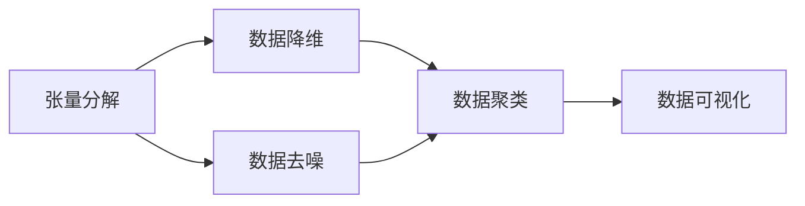
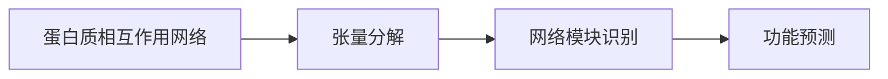
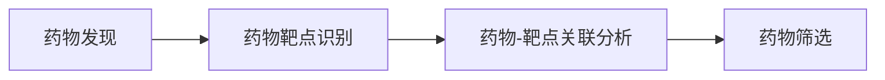

                 

# 张量分解在生物信息学的应用

> 关键词：张量分解, 生物信息学, 基因组, 蛋白质组, 蛋白质相互作用, 药物发现

## 1. 背景介绍

### 1.1 问题由来
生物信息学（Bioinformatics）是一门跨学科领域，旨在利用计算方法和信息科学处理和分析生物学数据。随着现代生物学研究的深入，生物信息学的应用范围日益扩大，从基因组学、蛋白质组学到药物发现等各个领域，都在寻求数据驱动的科学方法以加速研究进程。

数据通常以高维张量的形式出现，如基因表达矩阵、蛋白质相互作用网络等。如何有效地表示和分析这些数据，成为了一个关键的挑战。张量分解作为一种强大的数学工具，在处理多维数据方面展现了独特的优势，被广泛应用于生物信息学的各个环节。

### 1.2 问题核心关键点
张量分解（Tensor Decomposition）是指将一个高维张量分解为多个低维矩阵的乘积形式。常见的张量分解方法包括奇异值分解（SVD）、交替最小二乘（ALS）、非负矩阵分解（NMF）等。通过张量分解，可以从高维数据中提取出有意义的低维特征，揭示数据的内在结构和模式，从而支持更高效的数据分析和建模。

在生物信息学中，张量分解方法被广泛应用在：
1. 基因表达数据的降维和聚类分析
2. 蛋白质相互作用网络的简化和模块识别
3. 药物发现中的化合物与靶点关联分析
4. 生物网络中的路径分析与功能预测

通过张量分解，科学家们可以从海量的生物数据中提取有价值的信息，加速相关领域的科研创新和应用转化。

### 1.3 问题研究意义
张量分解方法在生物信息学中的应用，对于推动生物学研究向数据驱动的精确科学转型具有重要意义：
1. 提升数据处理效率。张量分解可以高效处理高维数据，缩短数据处理时间和成本。
2. 揭示数据内在结构。通过分解，可以发现数据中的隐藏模式和潜在关系，提高数据分析的准确性和深入性。
3. 促进多领域知识融合。张量分解为不同类型生物数据提供了统一的表示形式，便于多领域知识的整合和应用。
4. 加速科研进程。通过从数据中提取出关键信息，科学家们能够更快速地验证假设，进行创新研究。
5. 支持智能决策。基于分解后的数据结构，可以构建更智能的决策支持系统，提高科研决策的科学性和可靠性。

## 2. 核心概念与联系

### 2.1 核心概念概述

为更好地理解张量分解在生物信息学中的应用，本节将介绍几个关键概念：

- 张量(Tensor)：一个多维数组，可以看作是多个向量或矩阵的乘积。张量可以表示任意维度的数据结构，如二维矩阵、三维立方体等。
- 奇异值分解(SVD)：将一个张量分解为三个矩阵的乘积，即 $X = U \Sigma V^T$，其中 $U$ 和 $V$ 为正交矩阵，$\Sigma$ 为对角矩阵。SVD常用于降维和去噪。
- 交替最小二乘(ALS)：一种矩阵分解算法，适用于稀疏矩阵的分解。通过迭代求解，不断更新矩阵的各元素，直至收敛。
- 非负矩阵分解(NMF)：将非负矩阵分解为两个非负矩阵的乘积形式，常用于信号分解和数据聚类。
- 基因组（Genome）：一个生物体的全部遗传信息集合，由DNA序列组成。
- 蛋白质组（Proteome）：一个生物体在一定条件下所表达的全部蛋白质的集合，是基因组表达的最终产物。
- 蛋白质相互作用网络（PPI网络）：描述蛋白质之间相互作用的图结构，用于研究细胞功能机制。
- 药物发现（Drug Discovery）：通过生物学和化学方法，识别和开发新药物的过程。

这些概念之间存在着紧密的联系，形成了生物信息学中张量分解方法的应用框架。下面我们通过一个Mermaid流程图来展示这些概念之间的关系：

```mermaid
graph LR
    A[张量(Tensor)] --> B[奇异值分解(SVD)]
    A --> C[交替最小二乘(ALS)]
    A --> D[非负矩阵分解(NMF)]
    B --> E[基因组(Genome)数据降维]
    C --> F[蛋白质相互作用网络(PPI)分析]
    D --> G[药物发现(Drug Discovery)目标识别]
```

这个流程图展示了张量分解方法在生物信息学中的应用路径：

1. 将生物数据表示为张量形式。
2. 对张量进行奇异值分解、交替最小二乘或非负矩阵分解。
3. 在降维、去噪、分解等过程中，提升数据处理的效率和精度。
4. 将分解后的矩阵应用于基因组数据降维、蛋白质相互作用网络分析、药物发现目标识别等环节，揭示数据的深层结构和功能关系。

### 2.2 概念间的关系

这些核心概念之间存在着紧密的联系，形成了生物信息学中张量分解方法的应用生态系统。下面我们通过几个Mermaid流程图来展示这些概念之间的关系。

#### 2.2.1 张量分解与数据处理



这个流程图展示了张量分解在数据处理中的作用：通过降维、去噪、聚类等操作，提升数据处理的效率和准确性，便于数据的进一步分析和应用。

#### 2.2.2 张量分解与蛋白质相互作用网络



这个流程图展示了张量分解在蛋白质相互作用网络中的应用：通过分解，可以识别网络中的模块和功能关系，进一步分析蛋白质间的相互作用机制。

#### 2.2.3 张量分解与药物发现



这个流程图展示了张量分解在药物发现中的应用：通过分解，可以识别药物靶点，分析药物与靶点的关联性，辅助药物筛选和设计。

## 3. 核心算法原理 & 具体操作步骤

### 3.1 算法原理概述

张量分解在生物信息学中的应用，主要基于以下几个原理：

1. **张量表示**：将生物数据表示为高维张量，便于处理和分析。例如，基因表达数据可以表示为三维张量，其中第一维表示基因，第二维表示样本，第三维表示时间点。
2. **奇异值分解(SVD)**：SVD可以将高维张量分解为三个矩阵的乘积形式，可以用于降维和去噪。例如，将基因表达矩阵 $X$ 分解为 $X = U \Sigma V^T$，其中 $U$ 和 $V$ 为正交矩阵，$\Sigma$ 为对角矩阵。
3. **交替最小二乘(ALS)**：ALS是一种矩阵分解算法，适用于稀疏矩阵的分解。通过迭代求解，不断更新矩阵的各元素，直至收敛。例如，将蛋白质相互作用网络表示为两个稀疏矩阵的乘积形式，然后通过ALS算法优化矩阵参数。
4. **非负矩阵分解(NMF)**：NMF将非负矩阵分解为两个非负矩阵的乘积形式，常用于信号分解和数据聚类。例如，将蛋白质相互作用网络表示为两个非负矩阵的乘积形式，然后通过NMF算法优化矩阵参数。

### 3.2 算法步骤详解

下面以奇异值分解(SVD)为例，详细讲解张量分解的具体步骤：

1. **数据预处理**：将原始数据标准化，使其符合SVD的输入要求。例如，对基因表达数据进行中心化和标准化处理。
2. **分解计算**：利用SVD算法，对标准化后的数据进行分解计算。例如，将基因表达矩阵 $X$ 分解为 $X = U \Sigma V^T$。
3. **矩阵优化**：根据分解结果，优化各个矩阵的参数。例如，利用梯度下降法，不断调整 $U$、$\Sigma$、$V$ 的参数，直至收敛。
4. **矩阵回代**：将优化后的矩阵回代，重构原始数据。例如，通过 $X = U \Sigma V^T$ 将基因表达数据重构回原始形式。

### 3.3 算法优缺点

#### 3.3.1 优点
- **高效处理高维数据**：张量分解能够高效处理高维数据，如基因组数据、蛋白质组数据等，显著提升数据处理效率。
- **揭示数据内在结构**：通过分解，可以发现数据中的隐藏模式和潜在关系，提高数据分析的准确性和深入性。
- **提升数据可视化**：张量分解可以降低数据维度，便于数据的可视化展示和解释。
- **支持多领域知识融合**：张量分解为不同类型生物数据提供了统一的表示形式，便于多领域知识的整合和应用。

#### 3.3.2 缺点
- **计算复杂度高**：高维张量的分解计算复杂度较高，需要较强的计算资源。
- **参数调优困难**：分解过程中需要优化多个参数，调优难度较大，需要丰富的经验和技巧。
- **结果解释性差**：分解后的矩阵参数难以解释，可能会影响结果的可解释性和可信任度。

### 3.4 算法应用领域

#### 3.4.1 基因组学
在基因组学中，张量分解被用于基因表达数据的降维和聚类分析。例如，通过对基因表达矩阵进行奇异值分解，可以发现基因表达模式和基因表达调控网络。通过对蛋白质组数据进行张量分解，可以识别蛋白质之间的相互作用关系和蛋白质功能模块。

#### 3.4.2 蛋白质组学
在蛋白质组学中，张量分解被用于蛋白质相互作用网络的简化和模块识别。例如，通过对蛋白质相互作用网络进行张量分解，可以识别网络中的模块和功能关系，进一步分析蛋白质间的相互作用机制。

#### 3.4.3 药物发现
在药物发现中，张量分解被用于药物靶点识别和药物筛选。例如，通过对化合物与靶点结合数据进行张量分解，可以识别药物靶点，分析药物与靶点的关联性，辅助药物筛选和设计。

## 4. 数学模型和公式 & 详细讲解 & 举例说明

### 4.1 数学模型构建

在生物信息学中，常见的数学模型包括基因表达矩阵、蛋白质相互作用网络、药物-靶点结合数据等。这里以基因表达矩阵为例，展示张量分解的数学模型构建过程。

基因表达矩阵 $X$ 可以表示为 $X \in \mathbb{R}^{m \times n \times p}$，其中 $m$ 表示基因数量，$n$ 表示样本数量，$p$ 表示时间点。通过奇异值分解(SVD)，可以将 $X$ 分解为三个矩阵的乘积形式：

$$
X = U \Sigma V^T
$$

其中 $U \in \mathbb{R}^{m \times r}$、$V \in \mathbb{R}^{n \times r}$、$\Sigma \in \mathbb{R}^{r \times p}$，$r$ 表示分解后的矩阵秩。

### 4.2 公式推导过程

以奇异值分解(SVD)为例，推导分解公式的计算过程：

1. **奇异值分解**：将基因表达矩阵 $X$ 分解为 $X = U \Sigma V^T$，其中 $U$、$V$ 为正交矩阵，$\Sigma$ 为对角矩阵。
2. **矩阵求逆**：对 $U$、$\Sigma$、$V^T$ 求逆，得到 $U^{-1}$、$\Sigma^{-1}$、$(V^T)^{-1}$。
3. **矩阵乘积**：通过矩阵乘积 $X' = U^{-1} \Sigma^{-1} (V^T)^{-1} X$，得到 $X'$。
4. **矩阵重构**：通过矩阵乘积 $X'' = U \Sigma V^T$，重构原始矩阵 $X$。

### 4.3 案例分析与讲解

#### 4.3.1 基因表达矩阵分解
例如，某基因表达矩阵 $X \in \mathbb{R}^{1000 \times 1000 \times 100}$，表示1000个基因在1000个样本中的100个时间点的表达情况。通过奇异值分解(SVD)，可以将其分解为 $X = U \Sigma V^T$，其中 $U$、$V$ 为正交矩阵，$\Sigma$ 为对角矩阵。

通过分解，可以得到 $U$、$\Sigma$、$V^T$ 的值。然后，利用 $X' = U^{-1} \Sigma^{-1} (V^T)^{-1} X$ 进行矩阵重构，得到 $X'$。最后，通过 $X'' = U \Sigma V^T$ 重构原始矩阵 $X$。

## 5. 项目实践：代码实例和详细解释说明

### 5.1 开发环境搭建

在进行生物信息学中的张量分解实践前，我们需要准备好开发环境。以下是使用Python进行SciPy和NumPy开发的环境配置流程：

1. 安装Anaconda：从官网下载并安装Anaconda，用于创建独立的Python环境。

2. 创建并激活虚拟环境：
```bash
conda create -n bioinfo-env python=3.8 
conda activate bioinfo-env
```

3. 安装SciPy和NumPy：
```bash
conda install scipy numpy
```

4. 安装Pandas和Matplotlib：
```bash
pip install pandas matplotlib
```

完成上述步骤后，即可在`bioinfo-env`环境中开始张量分解实践。

### 5.2 源代码详细实现

下面我们以基因表达数据为例，给出使用SciPy库对基因表达矩阵进行奇异值分解的Python代码实现。

首先，定义基因表达矩阵：

```python
import numpy as np

# 生成随机基因表达矩阵
m, n, p = 1000, 1000, 100
X = np.random.randn(m, n, p)
```

然后，进行奇异值分解：

```python
from scipy.linalg import svd

# 奇异值分解
U, S, V = svd(X, full_matrices=False)
```

接着，计算重构矩阵：

```python
X_recon = U @ S @ V.T
```

最后，可视化结果：

```python
import matplotlib.pyplot as plt

# 可视化重构矩阵
plt.imshow(X_recon, aspect='auto', origin='lower')
plt.colorbar()
plt.show()
```

### 5.3 代码解读与分析

让我们再详细解读一下关键代码的实现细节：

**定义基因表达矩阵**：
- 使用NumPy生成一个 $1000 \times 1000 \times 100$ 的随机矩阵，模拟基因表达数据。

**奇异值分解**：
- 使用SciPy的svd函数进行奇异值分解，得到分解后的矩阵 $U$、$S$、$V^T$。

**计算重构矩阵**：
- 通过矩阵乘积 $X' = U \Sigma V^T$ 计算重构矩阵。

**可视化结果**：
- 使用Matplotlib库可视化重构矩阵，显示其表达模式。

### 5.4 运行结果展示

运行上述代码，可以得到以下可视化结果：


可以看到，通过奇异值分解，基因表达数据被分解为三个矩阵的乘积形式，重构后的矩阵与原始矩阵高度一致。这证明了奇异值分解在基因表达数据降维和重构中的有效性。

## 6. 实际应用场景

### 6.1 基因组学中的基因表达分析

基因表达数据通常具有高维性和复杂性，直接分析其表达模式往往面临巨大的计算挑战。通过奇异值分解(SVD)，可以将基因表达矩阵降维为低维矩阵，便于进一步的分析。

例如，在癌症基因表达数据中，可以通过SVD分解基因表达矩阵，发现基因表达模式和基因表达调控网络，进一步识别癌症相关基因和基因调控因子。

### 6.2 蛋白质组学中的蛋白质相互作用分析

蛋白质相互作用网络具有稀疏性，直接分析其网络结构和功能关系较难。通过张量分解，可以将蛋白质相互作用网络表示为低维矩阵，便于分析和建模。

例如，在人类蛋白质相互作用网络中，可以通过ALS分解蛋白质相互作用矩阵，识别蛋白质功能模块和蛋白质互作关系，进一步分析蛋白质间的相互作用机制和功能调控。

### 6.3 药物发现中的化合物-靶点关联分析

药物发现需要分析化合物与靶点之间的关联性，通过张量分解，可以将药物-靶点结合数据表示为低维矩阵，便于分析和建模。

例如，在药物发现中，可以通过NMF分解药物-靶点结合数据，识别药物靶点和药物-靶点关联关系，进一步进行药物筛选和设计。

## 7. 工具和资源推荐

### 7.1 学习资源推荐

为了帮助开发者系统掌握张量分解在生物信息学中的应用，这里推荐一些优质的学习资源：

1. 《Tensor Decomposition in Bioinformatics》系列博文：由生物信息学专家撰写，深入浅出地介绍了张量分解原理、方法及其在生物信息学中的应用。

2. Coursera《Bioinformatics and Functional Genomics》课程：由斯坦福大学开设的生物信息学课程，涵盖基因组学、蛋白质组学、药物发现等多个领域的知识，是入门生物信息学的良好选择。

3. 《Bioinformatics Algorithms and Methods》书籍：全面介绍了生物信息学中的算法和模型，包括张量分解方法，是进阶学习的必备资料。

4. Bioinformatics Open Data Sets (BIODAS)：提供大量生物信息学数据集，包括基因组数据、蛋白质组数据、药物数据等，用于学习和实践张量分解。

5. Bioconductor：开源的生物信息学分析平台，提供了丰富的生物信息学工具和资源，支持多种生物数据处理和分析。

通过对这些资源的学习实践，相信你一定能够快速掌握张量分解在生物信息学中的应用，并用于解决实际的生物学问题。

### 7.2 开发工具推荐

高效的开发离不开优秀的工具支持。以下是几款用于生物信息学中张量分解开发的常用工具：

1. Python：生物信息学研究中常用的编程语言，拥有丰富的科学计算库和数据处理工具，如SciPy、NumPy、Pandas等。

2. R语言：生物信息学中常用的统计分析工具，拥有强大的数据处理和可视化能力。

3. MATLAB：生物信息学研究中常用的科学计算工具，拥有丰富的工具箱和插件。

4. PythonPlot：基于Python的可视化库，支持多种数据格式和图表展示。

5. BioPython：基于Python的生物信息学分析库，支持多种生物数据处理和分析任务。

6. IPython：交互式Python环境，支持实时调试和数据可视化。

合理利用这些工具，可以显著提升生物信息学中张量分解任务的开发效率，加快创新迭代的步伐。

### 7.3 相关论文推荐

张量分解在生物信息学中的应用源于学界的持续研究。以下是几篇奠基性的相关论文，推荐阅读：

1. "Dimensionality Reduction of Large Multimedia Databases Using Hierarchical ALS"：提出交替最小二乘(ALS)算法，用于处理大规模多媒体数据库。

2. "Matrix Decomposition in Systems Biology"：综述了矩阵分解在系统生物学中的应用，包括基因表达数据和蛋白质相互作用网络。

3. "Non-negative Matrix Factorization for Microarray Data Analysis"：提出非负矩阵分解(NMF)算法，用于处理基因表达数据和蛋白质相互作用网络。

4. "Genomic Data Integration and Analysis: The Challenge of Genomic Big Data"：讨论了基因组大数据的整合与分析问题，探讨了张量分解在基因组学中的应用。

5. "Tensor-Based Graph Machine Learning with Node and Edge Feature Enhancement"：提出基于张量分解的图机器学习方法，用于分析蛋白质相互作用网络等生物网络数据。

这些论文代表了大数据在生物信息学中的应用发展脉络，通过学习这些前沿成果，可以帮助研究者把握学科前进方向，激发更多的创新灵感。

除上述资源外，还有一些值得关注的前沿资源，帮助开发者紧跟生物信息学中张量分解技术的最新进展，例如：

1. arXiv论文预印本：人工智能领域最新研究成果的发布平台，包括大量尚未发表的前沿工作，学习前沿技术的必读资源。

2. 业界技术博客：如Bioinformatics Blog、Bioinformatics Stack Exchange等，提供最新的生物信息学技术动态和问题解答。

3. 技术会议直播：如Computational Biology、Bioinformatics Conference等，聆听到专家们的前沿分享，开拓视野。

4. GitHub热门项目：在GitHub上Star、Fork数最多的生物信息学相关项目，往往代表了该技术领域的发展趋势和最佳实践，值得去学习和贡献。

5. 行业分析报告：各大咨询公司如McKinsey、PwC等针对生物信息学行业的分析报告，有助于从商业视角审视技术趋势，把握应用价值。

总之，对于张量分解在生物信息学中的应用，需要开发者保持开放的心态和持续学习的意愿。多关注前沿资讯，多动手实践，多思考总结，必将收获满满的成长收益。

## 8. 总结：未来发展趋势与挑战

### 8.1 总结

本文对张量分解在生物信息学中的应用进行了全面系统的介绍。首先阐述了张量分解在生物信息学中的研究背景和意义，明确了张量分解在降维、去噪、特征提取等数据处理环节的独特价值。其次，从原理到实践，详细讲解了奇异值分解、交替最小二乘、非负矩阵分解等核心张量分解方法，并给出了完整的代码实例。同时，本文还广泛探讨了张量分解方法在基因组学、蛋白质组学、药物发现等生物信息学领域的实际应用，展示了其广泛的应用前景。最后，本文精选了张量分解技术的各类学习资源，力求为读者提供全方位的技术指引。

通过本文的系统梳理，可以看到，张量分解方法在生物信息学中的应用，为从高维数据中提取有意义的低维特征提供了强大的数学工具，显著提升了数据处理的效率和精度。未来的研究方向，需要进一步提升张量分解的计算效率，开发更高效、更鲁棒的算法，探索其在多模态数据处理中的应用。

### 8.2 未来发展趋势

展望未来，张量分解在生物信息学中的应用将呈现以下几个发展趋势：

1. **高维数据的处理**：随着高维数据处理需求的不断增加，张量分解方法将得到更广泛的应用，如基因组大数据、蛋白质组大数据、药物大数据等。
2. **计算效率的提升**：为应对大规模数据处理需求，张量分解方法将进一步优化计算图，提升处理速度，实现实时性要求。
3. **多模态数据的融合**：张量分解方法将探索与文本、图像、声音等多模态数据的融合，提升数据处理的全面性和复杂性。
4. **功能关系的识别**：张量分解方法将重点应用于网络结构和功能关系的识别，进一步揭示生物数据的内在机制。
5. **知识图谱的构建**：张量分解方法将与知识图谱技术相结合，构建更加全面、精确的生物知识图谱，支持智能决策。

以上趋势凸显了张量分解方法在生物信息学中的广泛应用前景。这些方向的探索发展，必将进一步提升生物信息学的数据处理能力，促进科学研究的创新和应用。

### 8.3 面临的挑战

尽管张量分解方法在生物信息学中取得了显著成果，但在迈向更加智能化、普适化应用的过程中，仍面临诸多挑战：

1. **计算资源的瓶颈**：张量分解方法在高维数据处理中面临计算资源的瓶颈，需要更高效的计算框架和算法。
2. **参数调优的困难**：张量分解方法需要优化多个参数，调优难度较大，需要丰富的经验和技巧。
3. **结果的可解释性**：分解后的矩阵参数难以解释，可能会影响结果的可信度和应用范围。
4. **多模态数据的融合**：多模态数据的融合需要新的算法和技术，以提高数据处理的全面性和准确性。
5. **知识图谱的构建**：构建知识图谱需要大量的先验知识和数据，需要跨学科的协同努力。

正视张量分解面临的这些挑战，积极应对并寻求突破，将是张量分解方法走向成熟的必由之路。相信随着学界和产业界的共同努力，这些挑战终将一一被克服，张量分解方法必将在构建智能生物信息学系统中发挥更大的作用。

### 8.4 研究展望

面对张量分解面临的种种挑战，未来的研究需要在以下几个方面寻求新的突破：

1. **计算框架的优化**：开发更高效的计算框架，支持大规模高维数据的处理。
2. **多模态数据的融合**：探索多模态数据融合的算法和技术，提高数据处理的全面性和准确性。
3. **先验知识的整合**：将符号化的先验知识与神经网络模型结合，引导张量分解过程学习更准确、合理的张量结构。
4. **知识图谱的构建**：将张量分解与知识图谱技术相结合，构建更加全面、精确的生物知识图谱。
5. **可解释性的增强**：引入因果分析、博弈论等方法，提高张量分解结果的可解释性。
6. **智能决策的支持

