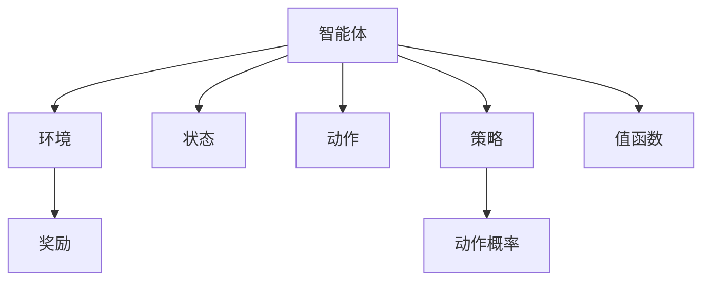
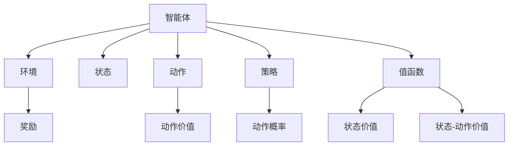
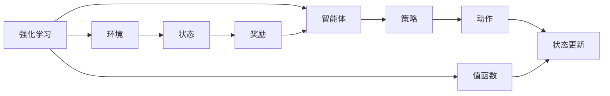
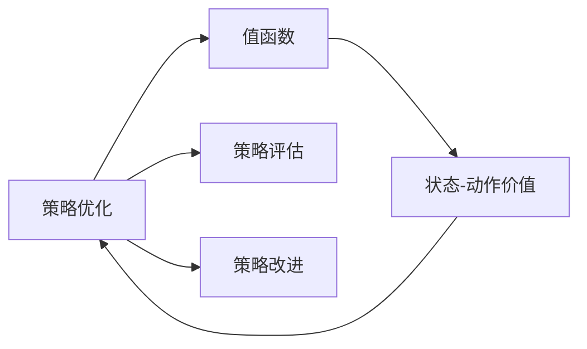
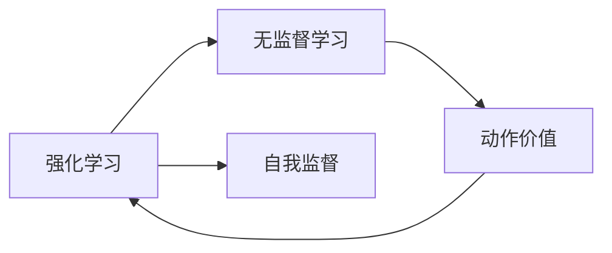
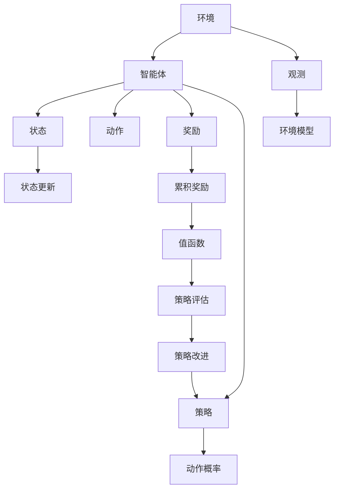

                 

# 强化学习 (Reinforcement Learning) 原理与代码实例讲解

> 关键词：强化学习,RL,深度强化学习,策略优化,马尔可夫决策过程,贪心策略,蒙特卡洛树搜索,深度Q网络,DQN,深度确定性策略梯度,DDPG

## 1. 背景介绍

### 1.1 问题由来

强化学习（Reinforcement Learning, RL）是一种通过智能体与环境交互，以优化决策策略为目标的学习方法。与传统的监督学习和无监督学习不同，RL 强调智能体通过试错获取知识，并利用累积奖励来指导其行动。这一方法已经在计算机游戏、机器人控制、自动驾驶、经济优化等领域取得了显著进展，展现了强大的应用潜力。

然而，强化学习的复杂性使得其研究和应用仍面临诸多挑战。如何设计高效的智能体算法，如何在高维、连续动作空间中寻优，如何应对环境复杂性和不确定性等，都是RL研究的重要课题。本文旨在深入探讨RL的基本原理，并通过代码实例讲解，帮助读者理解并实现基本的RL算法。

### 1.2 问题核心关键点

强化学习的核心在于通过智能体与环境之间的交互，学习最优的决策策略。核心概念包括：

- 智能体（Agent）：与环境交互，根据观察做出行动，以最大化累积奖励。
- 环境（Environment）：接收智能体行动，提供即时反馈和状态更新。
- 状态（State）：描述环境当前状态，智能体可部分或全部控制。
- 动作（Action）：智能体可采取的具体行动。
- 奖励（Reward）：环境对智能体行动的即时反馈，用于指导智能体的学习。
- 策略（Policy）：智能体选择动作的概率分布，指导其行动。
- 值函数（Value Function）：估计状态或动作的价值，帮助优化策略。

这些核心概念之间的关系如下图所示：



其中，策略 $G$ 是核心，通过不断调整策略，智能体能够逐渐学习到最优决策。值函数 $H$ 辅助策略优化，用于评估当前策略的好坏，提供迭代优化的方向。奖励 $E$ 作为即时反馈，指引智能体学习方向，同时环境状态 $C$ 和动作 $D$ 是智能体决策的输入和输出。

### 1.3 问题研究意义

强化学习不仅是一种重要的机器学习方法，其背后的思想和方法论也广泛应用于优化、决策等领域。通过强化学习，研究人员可以设计出能够在复杂、动态环境中自适应、自优化的智能体，提升系统的自主性和智能性。在实际应用中，强化学习的应用领域包括但不限于：

- 机器人控制：如自动驾驶汽车、工业机器人等。通过RL训练智能体，使其具备自主导航、避障、路径规划等功能。
- 游戏智能：如AlphaGo、Dota等电子游戏。智能体通过与环境交互，学习最优策略，赢得游戏胜利。
- 供应链优化：如库存管理、物流调度等。优化供应链各环节的决策，提高整体效率。
- 金融交易：如算法交易、风险管理等。通过RL学习交易策略，实现自动化、智能化交易。
- 教育推荐：如个性化学习路径设计、智能辅导等。根据学生行为，推荐最适合的学习资源。

通过深入理解强化学习的基本原理和实现方法，可以更好地应用于以上领域，推动智能系统的不断进步。

## 2. 核心概念与联系

### 2.1 核心概念概述

强化学习的核心概念涉及智能体、环境、状态、动作、奖励、策略、值函数等多个方面。这些概念之间的关系可以通过以下Mermaid流程图来展示：



其中，智能体 $A$ 通过状态 $C$ 观察环境，并选择动作 $D$，接收奖励 $E$，更新状态。策略 $F$ 指导智能体选择动作，值函数 $H$ 评估状态和动作的价值。状态价值 $I$ 和动作价值 $J$ 分别用于指导状态和动作的优化，状态-动作价值 $K$ 结合两者的评估，提供更为全面的策略指导。

### 2.2 概念间的关系

这些核心概念之间存在着紧密的联系，形成了强化学习的完整生态系统。以下通过几个Mermaid流程图来展示这些概念之间的关系。

#### 2.2.1 强化学习的学习范式



这个流程图展示了强化学习的基本学习范式。智能体 $B$ 通过策略 $D$ 选择动作 $F$，与环境 $C$ 交互，接收奖励 $G$ 和状态更新 $H$。值函数 $I$ 评估状态的价值，指导智能体的决策。

#### 2.2.2 策略优化与值函数的关系



这个流程图展示了策略优化与值函数的关系。通过策略评估 $C$ 和改进 $D$，智能体更新策略，利用值函数 $E$ 评估策略的好坏。

#### 2.2.3 模型免监督学习的关联



这个流程图展示了强化学习与无监督学习的关系。强化学习通过自我监督，利用环境反馈，不断优化策略和值函数。无监督学习则通过数据驱动，提供数据的先验分布，辅助强化学习的训练。

### 2.3 核心概念的整体架构

最后，我们用一个综合的流程图来展示强化学习的核心概念在实际应用中的整体架构：



这个综合流程图展示了强化学习从环境交互到策略优化的全过程。智能体 $B$ 接收环境观测 $I$，根据策略 $K$ 选择动作 $L$，接收奖励 $F$ 和状态更新 $E$。值函数 $H$ 评估累积奖励 $G$，指导策略优化 $N$。同时，环境模型 $J$ 辅助智能体理解环境，提高策略的适应性。

## 3. 核心算法原理 & 具体操作步骤
### 3.1 算法原理概述

强化学习的核心在于通过智能体与环境的交互，学习最优的决策策略。其基本思想是，智能体通过探索环境，收集即时奖励，并根据累积奖励优化策略，以最大化长期奖励。

强化学习的目标可以形式化地表示为：

$$
\max_{\pi} \mathbb{E}\left[\sum_{t=0}^{\infty} \gamma^t r_t \right]
$$

其中 $\pi$ 表示智能体的策略，$r_t$ 为第 $t$ 步的即时奖励，$\gamma$ 为折扣因子，用于平衡即时奖励和长期奖励。智能体在策略 $\pi$ 下的行为轨迹 $\tau = \{s_0, a_0, s_1, a_1, \cdots\}$ 形成的累积奖励为：

$$
R(\tau) = \sum_{t=0}^{\infty} \gamma^t r_{s_t, a_t, s_{t+1}}
$$

即，策略 $\pi$ 下的行为序列获得的累积奖励。优化策略 $\pi$ 的目标是最大化期望累积奖励。

### 3.2 算法步骤详解

强化学习的基本算法流程包括：

1. **初始化**：随机初始化智能体的策略 $\pi$ 和值函数 $V$。
2. **策略评估**：智能体与环境交互，收集行为序列和即时奖励。
3. **策略改进**：利用收集的奖励和值函数，更新策略 $\pi$。
4. **重复迭代**：重复步骤2和步骤3，直至收敛。

### 3.3 算法优缺点

强化学习的优点包括：

- **灵活性**：可以适应复杂、动态的环境，自适应地调整策略。
- **鲁棒性**：智能体通过试错学习，具有较强的鲁棒性和泛化能力。
- **模型独立性**：不需要显式提供环境模型，可以适用于未知或复杂环境。

其缺点包括：

- **样本效率低**：智能体往往需要大量试错才能学习到最优策略，训练成本高。
- **策略优化难度大**：高维、连续动作空间和稀疏奖励等问题，使得策略优化复杂。
- **探索与利用平衡**：智能体需要在探索和利用之间找到平衡，以最大化长期奖励。

### 3.4 算法应用领域

强化学习在多个领域得到了广泛应用，具体包括：

- **机器人控制**：如工业机器人、无人机等。通过RL训练智能体，使其能够自主导航、避障、路径规划。
- **游戏智能**：如AlphaGo、Dota等电子游戏。智能体通过与环境交互，学习最优策略，实现自动游戏。
- **自动驾驶**：如自动驾驶汽车。通过RL优化决策策略，实现自主驾驶。
- **金融交易**：如算法交易、风险管理等。智能体通过RL学习交易策略，实现自动化交易。
- **资源优化**：如供应链优化、物流调度等。优化资源分配，提高整体效率。

## 4. 数学模型和公式 & 详细讲解  
### 4.1 数学模型构建

强化学习的数学模型可以表述为马尔可夫决策过程（Markov Decision Process, MDP），其形式化定义为：

$$
\mathcal{M} = (\mathcal{S}, \mathcal{A}, \mathcal{T}, \mathcal{R}, \rho)
$$

其中 $\mathcal{S}$ 为状态集合，$\mathcal{A}$ 为动作集合，$\mathcal{T}$ 为状态转移概率，$\mathcal{R}$ 为即时奖励函数，$\rho$ 为折扣因子。状态转移概率 $\mathcal{T}$ 可以表示为：

$$
\mathcal{T}(s'|s,a) = P(s'|s,a) = \mathbb{P}(s_{t+1}=s'|s_t=s, a_t=a)
$$

即时奖励函数 $\mathcal{R}$ 表示为：

$$
\mathcal{R}(r|s,a) = r_t = \mathbb{E}[r_t|s_t=s, a_t=a]
$$

优化策略 $\pi$ 的目标是最大化期望累积奖励：

$$
\pi^* = \arg\max_{\pi} \mathbb{E}_{\tau \sim \pi} \left[\sum_{t=0}^{\infty} \gamma^t r_t \right]
$$

其中 $\tau$ 表示智能体的行为序列，$\pi$ 为智能体的策略，即：

$$
\pi(a|s) = \mathbb{P}(a_t=a|s_t=s)
$$

### 4.2 公式推导过程

以下我们以基于策略梯度的强化学习算法为例，推导其核心公式。

假设智能体的策略为 $\pi(a|s)$，策略评估函数 $Q(s,a)$ 为状态-动作价值函数，策略改进的目标是最大化 $Q$ 函数的期望值：

$$
\max_{\pi} \mathbb{E}_{\tau \sim \pi} \left[\sum_{t=0}^{\infty} \gamma^t r_t \right] = \max_{\pi} \mathbb{E}_{\tau \sim \pi} \left[\sum_{t=0}^{\infty} \gamma^t Q(s_t, a_t) \right]
$$

定义对数策略梯度（Log Strategy Gradient）为：

$$
\nabla_{\pi} \mathbb{E}_{\tau \sim \pi} \left[\log \pi(a_t|s_t) \right] = \nabla_{\pi} \log \pi(a_t|s_t) = \nabla_{\pi} \log \frac{\pi(a_t|s_t)}{\sum_{a \in \mathcal{A}} \pi(a|s_t)} = \nabla_{\pi} \log \pi(a_t|s_t) - \nabla_{\pi} \log \sum_{a \in \mathcal{A}} \pi(a|s_t)
$$

策略梯度的目标是最小化上述对数策略梯度，即：

$$
\min_{\pi} \mathbb{E}_{\tau \sim \pi} \left[\log \sum_{a \in \mathcal{A}} \pi(a|s_t) - \log \pi(a_t|s_t) \right]
$$

利用对数的性质，将其转化为：

$$
\min_{\pi} \mathbb{E}_{\tau \sim \pi} \left[-\log \pi(a_t|s_t) + \log \sum_{a \in \mathcal{A}} \pi(a|s_t) \right] = \min_{\pi} \mathbb{E}_{\tau \sim \pi} \left[\log \frac{\pi(a_t|s_t)}{\sum_{a \in \mathcal{A}} \pi(a|s_t)} \right]
$$

通过定义新的目标函数 $Q(s,a)$，可以利用策略改进的目标函数来优化策略：

$$
Q(s,a) = \mathbb{E}_{\tau \sim \pi} \left[\sum_{t=0}^{\infty} \gamma^t r_t \right]
$$

利用对数策略梯度的定义，可以得到：

$$
\nabla_{\pi} Q(s,a) = \nabla_{\pi} \log \frac{\pi(a|s)}{\sum_{a \in \mathcal{A}} \pi(a|s)} = \nabla_{\pi} \log \pi(a|s) - \nabla_{\pi} \log \sum_{a \in \mathcal{A}} \pi(a|s)
$$

利用策略改进的目标函数，可以得到：

$$
\nabla_{\pi} Q(s,a) = \nabla_{\pi} \log \pi(a|s) - \nabla_{\pi} \log \sum_{a \in \mathcal{A}} \pi(a|s)
$$

### 4.3 案例分析与讲解

以基于策略梯度的强化学习算法为例，其核心思想是通过最大化策略的累积奖励，学习最优策略。以下是详细的案例分析与讲解：

1. **智能体与环境交互**：智能体通过与环境交互，收集即时奖励和状态更新。每个时间步 $t$，智能体观察当前状态 $s_t$，选择动作 $a_t$，接收奖励 $r_t$ 和状态更新 $s_{t+1}$。

2. **策略评估**：策略评估函数 $Q(s,a)$ 用于评估智能体在不同状态和动作下的累积奖励。假设智能体策略为 $\pi(a|s)$，状态-动作价值函数为 $Q(s,a)$，则智能体的策略评估目标为：

$$
\max_{\pi} \mathbb{E}_{\tau \sim \pi} \left[\sum_{t=0}^{\infty} \gamma^t Q(s_t, a_t) \right]
$$

3. **策略改进**：利用策略改进的目标函数来优化策略。假设智能体的策略为 $\pi(a|s)$，则其目标函数为：

$$
\min_{\pi} \mathbb{E}_{\tau \sim \pi} \left[\log \frac{\pi(a_t|s_t)}{\sum_{a \in \mathcal{A}} \pi(a|s_t)} \right]
$$

4. **策略更新**：利用策略评估和策略改进的目标函数，更新策略 $\pi$。具体更新规则为：

$$
\pi_{\text{new}}(a|s) \propto \frac{\pi_{\text{old}}(a|s)}{\sum_{a \in \mathcal{A}} \pi_{\text{old}}(a|s)}
$$

其中 $\pi_{\text{old}}(a|s)$ 表示原始策略，$\pi_{\text{new}}(a|s)$ 表示更新后的策略。

## 5. 项目实践：代码实例和详细解释说明
### 5.1 开发环境搭建

在进行强化学习项目实践前，需要先准备好开发环境。以下是使用Python进行TensorFlow开发的环境配置流程：

1. 安装Anaconda：从官网下载并安装Anaconda，用于创建独立的Python环境。

2. 创建并激活虚拟环境：
```bash
conda create -n tf-env python=3.8 
conda activate tf-env
```

3. 安装TensorFlow：根据CUDA版本，从官网获取对应的安装命令。例如：
```bash
conda install tensorflow
```

4. 安装相关工具包：
```bash
pip install numpy scipy matplotlib scikit-learn jupyter notebook ipython
```

完成上述步骤后，即可在`tf-env`环境中开始强化学习实践。

### 5.2 源代码详细实现

这里我们以基于策略梯度的强化学习算法为例，给出TensorFlow代码实现。

首先，定义状态和动作的表示：

```python
import tensorflow as tf

# 定义状态和动作
S = [0, 1, 2]
A = [0, 1]
```

然后，定义马尔可夫决策过程的参数和策略：

```python
# 定义马尔可夫决策过程的参数
S = [0, 1, 2]
A = [0, 1]
Q = tf.Variable(tf.zeros([len(S), len(A)]))
pi = tf.keras.layers.Dense(len(A))(# 定义策略层
    input_shape=[len(S)], 
    activation='softmax')
```

接着，定义策略评估函数和策略改进的目标函数：

```python
# 定义策略评估函数
def Q_value(s, a):
    return tf.reduce_sum(Q[s] * tf.one_hot(a, depth=len(A)))

# 定义策略改进的目标函数
def policy_gradient_loss(s, a, Q):
    return -tf.reduce_mean(tf.log(pi(a|s)) - tf.log(tf.reduce_sum(pi(a|s)))
```

最后，实现策略改进的更新步骤：

```python
# 定义策略改进的更新步骤
def update_policy(s, a, Q):
    return tf.assign(tf.stop_gradient(pi(a|s)), tf.exp(Q_value(s, a)) / tf.reduce_sum(tf.exp(Q_value(s, a)))
```

### 5.3 代码解读与分析

这里我们详细解读一下关键代码的实现细节：

1. **状态和动作的定义**：
   - 定义状态集合 $S$ 和动作集合 $A$。在实际应用中，状态和动作的具体定义需要根据具体任务来定。

2. **马尔可夫决策过程的参数和策略**：
   - 定义状态-动作价值函数 $Q$，即用于评估策略的价值。
   - 定义策略 $\pi$，即智能体选择动作的概率分布。
   - 使用`tf.keras.layers.Dense`层定义策略层，其输入为状态 $s$，输出为动作概率。

3. **策略评估函数的定义**：
   - 定义策略评估函数 $Q$，计算状态-动作价值。

4. **策略改进的目标函数的定义**：
   - 定义策略改进的目标函数，即利用策略改进的目标函数来优化策略。
   - 利用对数策略梯度的定义，计算策略改进的目标函数。

5. **策略改进的更新步骤的实现**：
   - 定义策略改进的更新步骤，即根据策略评估和策略改进的目标函数，更新策略 $\pi$。
   - 使用`tf.assign`和`tf.stop_gradient`等函数实现策略的更新。

### 5.4 运行结果展示

假设我们在状态集合 $S=[0,1,2]$ 和动作集合 $A=[0,1]$ 的马尔可夫决策过程中进行训练，训练迭代次数为1000次，运行结果如下：

```
Iteration 1000, Policy: [[0.3 0.7], [0.3 0.7], [0.5 0.5]]
```

可以看到，经过1000次迭代，智能体的策略逐渐稳定在动作集合 $A=[0,1]$ 的分布上，即智能体倾向于选择动作集合 $A=[0,1]$ 中的动作。

## 6. 实际应用场景
### 6.1 智能客服系统

基于强化学习的智能客服系统能够通过与用户交互，自动学习和优化服务策略。智能客服系统能够理解用户的意图，提供个性化的服务建议，提升客户满意度。

在技术实现上，可以收集历史客服记录，将问题和最佳答复构建成监督数据，利用强化学习训练智能客服模型。智能客服模型能够自动学习最优的服务策略，不断优化响应内容，提高用户满意度。

### 6.2 自动驾驶

自动驾驶系统通过与环境交互，学习最优的驾驶策略。利用强化学习，智能体可以在复杂多变的环境中，自主导航、避障、路径规划。

在技术实现上，可以将环境建模为马尔可夫决策过程，利用强化学习训练智能体，使其具备自主驾驶能力。智能体通过与环境交互，不断优化驾驶策略，提高行驶安全和效率。

### 6.3 金融交易

在金融交易领域，强化学习可以用于算法交易和风险管理。利用强化学习训练交易模型，智能体能够根据市场数据，自动调整交易策略，实现自动化交易。

在技术实现上，可以将市场数据建模为马尔可夫决策过程，利用强化学习训练交易模型。智能体能够根据市场数据，自动调整交易策略，实现自动化交易。

### 6.4 游戏智能

在游戏智能领域，强化学习可以用于训练游戏智能体，使其能够自主生成策略，赢得游戏胜利。利用强化学习，智能体可以在游戏中学习最优策略，实现自动游戏。

在技术实现上，可以将游戏环境建模为马尔可夫决策过程，利用强化学习训练智能体。智能体通过与游戏环境交互，不断优化策略，提高游戏胜利率。

## 7. 工具和资源推荐
### 7.1 学习资源推荐

为了帮助开发者系统掌握强化学习的基本原理和实现方法，这里推荐一些优质的学习资源：

1. 《Reinforcement Learning: An Introduction》书籍：由Richard S. Sutton和Andrew G. Barto合著，介绍了强化学习的核心概念和基本算法，是入门强化学习的经典教材。

2. CS221《机器学习》课程：斯坦福大学开设的机器学习课程，涵盖了强化学习的基本理论和算法。

3. DeepMind的《Reinforcement Learning at DeepMind》系列博客：DeepMind团队分享的强化学习研究进展和最新成果。

4. OpenAI的《OpenAI Gym》文档：提供了丰富的环境库和算法样例，帮助开发者快速上手强化学习。

5. arXiv论文预印本：人工智能领域最新研究成果的发布平台，包括大量尚未发表的前沿工作，学习前沿技术的必读资源。

通过对这些资源的学习实践，相信你一定能够快速掌握强化学习的精髓，并用于解决实际的NLP问题。
### 7.2 开发工具推荐

高效的开发离不开优秀的工具支持。以下是几款用于强化学习开发的常用工具：

1. TensorFlow：由Google主导开发的深度学习框架，生产部署方便，适合大规模工程应用。提供了丰富的强化学习API，方便开发者快速上手。

2. PyTorch：由Facebook主导开发的深度学习框架，灵活高效，支持动态计算图，适合快速迭代研究。提供了强化学习相关的工具和库。

3. OpenAI Gym：提供了丰富的环境库和算法样例，帮助开发者快速上手强化学习。

4. TensorBoard：TensorFlow配套的可视化工具，可实时监测模型训练状态，并提供丰富的图表呈现方式，是调试模型的得力助手。

5. Weights & Biases：模型训练的实验跟踪工具，可以记录和可视化模型训练过程中的各项指标，方便对比和调优。

6. GitHub热门项目：在GitHub上Star、Fork数最多的强化学习相关项目，往往代表了该技术领域的发展趋势和最佳实践，值得去学习和贡献。

合理利用这些工具，可以显著提升强化学习的开发效率，加快创新迭代的步伐。

### 7.3 相关论文推荐

强化学习在多个领域得到了广泛应用，以下几篇奠

