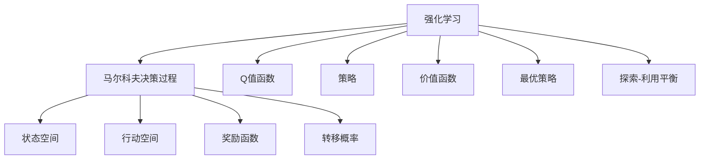
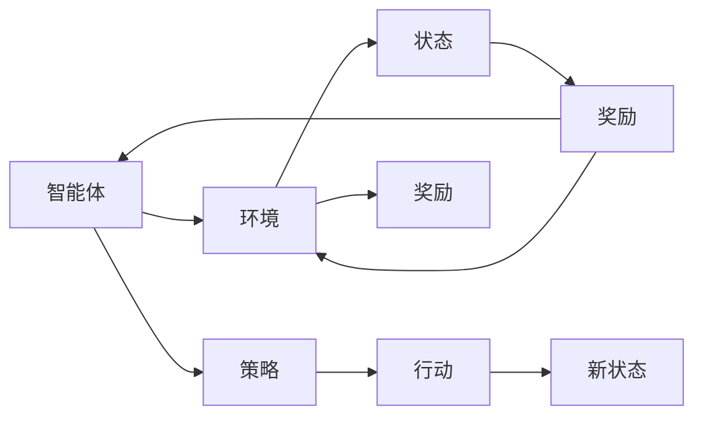
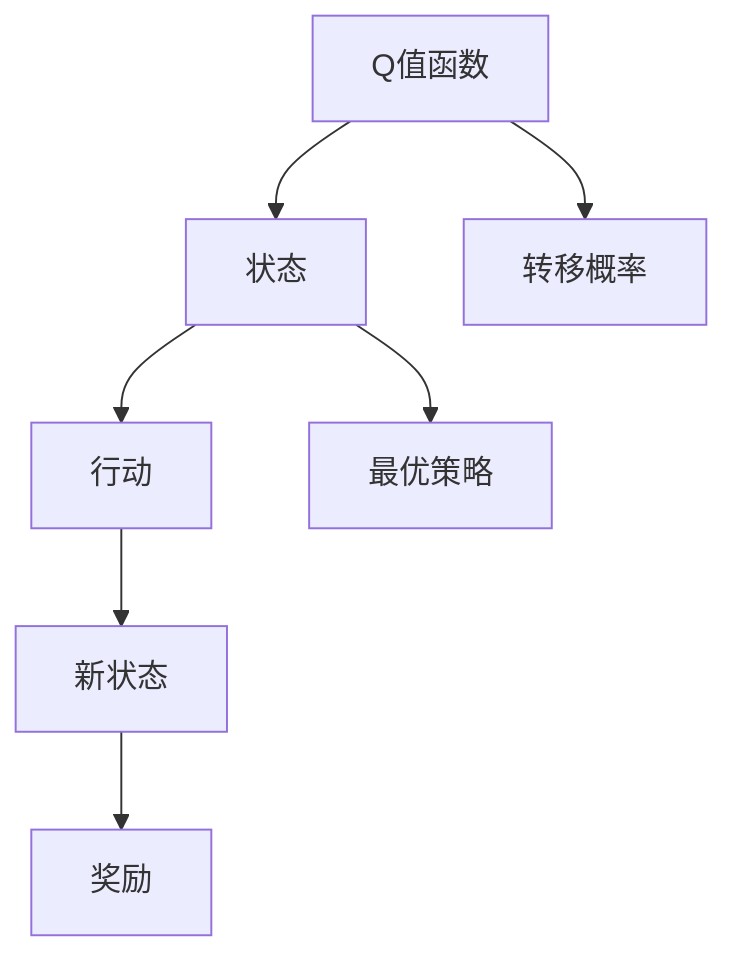
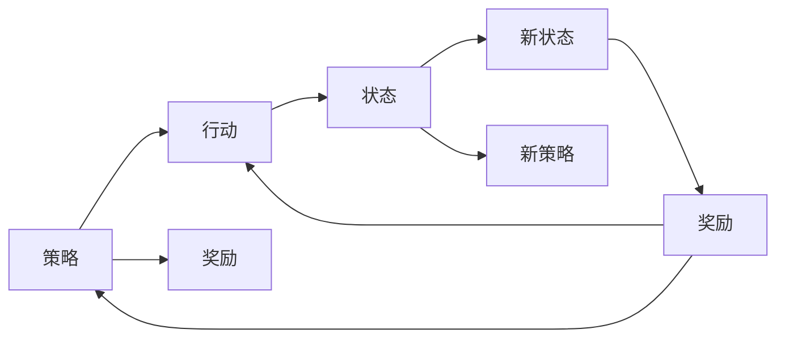
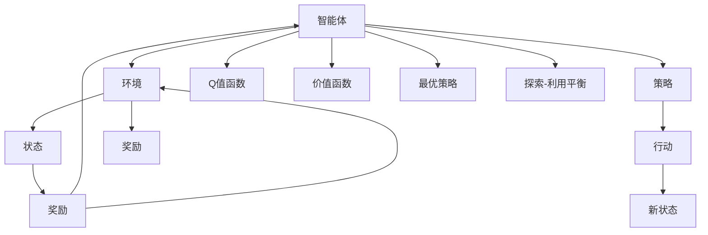

                 

# 强化学习 原理与代码实例讲解

> 关键词：强化学习, 算法原理, 代码实例, 模型实现, 优化策略

## 1. 背景介绍

### 1.1 问题由来
强化学习（Reinforcement Learning, RL）是人工智能（AI）和机器学习（ML）领域的一个重要分支，它研究如何使智能体（agent）在与环境（environment）的交互中，通过学习来做出最优化决策。强化学习与传统的监督学习和无监督学习不同，它不需要标注数据，而是通过智能体与环境不断交互，逐渐学习出最优策略，实现目标任务。

强化学习的应用非常广泛，涵盖了游戏（如AlphaGo）、机器人控制、自动驾驶、推荐系统、金融预测等多个领域。由于强化学习在复杂环境中的适应性和高效性，它成为了许多实际应用中的关键技术。

### 1.2 问题核心关键点
强化学习的核心思想是通过智能体与环境的交互，智能体通过采取行动（Action），获得环境反馈（Reward），以此不断优化决策策略。强化学习的效果很大程度上取决于智能体如何设计学习算法和优化策略。

在实际应用中，强化学习主要包括以下几个关键点：
- 状态空间（State Space）：环境当前状态的所有可能值的集合。
- 行动空间（Action Space）：智能体可以采取的所有可能的行动。
- 奖励函数（Reward Function）：环境根据智能体的行动，给予的正负反馈值，用来评估行动的好坏。
- Q值函数（Q Function）：预测在当前状态下采取某个行动的最优累积奖励。
- 策略（Policy）：智能体在每个状态下采取行动的概率分布。

强化学习与监督学习和无监督学习的主要区别在于，强化学习依赖于智能体与环境的交互，而非预设的标注数据。

### 1.3 问题研究意义
研究强化学习的方法和策略，对于推动AI技术的普及和应用，解决复杂环境下的决策问题，具有重要的理论意义和应用价值：

1. 解决复杂决策问题。强化学习能够处理非结构化环境中的复杂决策问题，如机器人控制、自动驾驶、游戏AI等。
2. 提升自动化程度。强化学习能够自动学习和优化，减少人工干预，提高自动化程度。
3. 优化资源配置。强化学习能够优化资源分配，如推荐系统的个性化推荐、供应链管理等。
4. 增强系统适应性。强化学习能够使系统适应不断变化的环境，提高系统的鲁棒性和稳定性。
5. 加速科学研究。强化学习在生物进化、药物设计等领域具有应用前景，能够加速科学研究进程。

## 2. 核心概念与联系

### 2.1 核心概念概述

为更好地理解强化学习的核心概念，本节将介绍几个密切相关的核心概念：

- 强化学习（Reinforcement Learning, RL）：智能体通过与环境的交互，通过学习来优化策略，以实现最大化累积奖励的目标。
- 马尔科夫决策过程（Markov Decision Process, MDP）：描述智能体与环境交互的基本模型，包括状态空间、行动空间、奖励函数和转移概率。
- Q值函数（Q Function）：预测在当前状态下采取某个行动的最优累积奖励。
- 策略（Policy）：智能体在每个状态下采取行动的概率分布。
- 价值函数（Value Function）：预测在某个状态下最优策略的累积奖励。
- 最优策略（Optimal Policy）：在给定状态下，采取最优行动的策略。
- 探索-利用平衡（Exploration-Exploitation Trade-off）：在策略优化过程中，平衡探索新策略和利用已有策略，以平衡模型复杂性和性能。

这些核心概念之间的逻辑关系可以通过以下Mermaid流程图来展示：



这个流程图展示了一些核心概念及其之间的关系：

1. 强化学习依赖于马尔科夫决策过程，用来描述智能体与环境的交互。
2. 状态空间和行动空间是MDP的基本元素，定义了智能体可以采取的所有可能行动和环境状态。
3. 奖励函数和转移概率定义了智能体采取行动后的环境和状态变化。
4. Q值函数和价值函数用于预测最优行动和最优策略的累积奖励。
5. 最优策略和探索-利用平衡是智能体策略优化的关键点。

### 2.2 概念间的关系

这些核心概念之间存在着紧密的联系，形成了强化学习的完整生态系统。下面我们通过几个Mermaid流程图来展示这些概念之间的关系。

#### 2.2.1 强化学习的基本流程



这个流程图展示了强化学习的基本流程：智能体在环境中采取行动，根据奖励函数更新状态，并根据策略选择新行动，直到达到目标状态或停止策略优化。

#### 2.2.2 Q值函数的计算



这个流程图展示了Q值函数的计算过程：在给定状态下，根据转移概率和奖励函数，计算采取某个行动的最优累积奖励。

#### 2.2.3 策略优化过程



这个流程图展示了策略优化的过程：智能体通过采取行动，获得奖励和状态变化，根据当前策略和转移概率，更新最优策略。

### 2.3 核心概念的整体架构

最后，我们用一个综合的流程图来展示这些核心概念在强化学习中的整体架构：



这个综合流程图展示了强化学习从策略制定到优化整个过程的核心概念和流程。通过这些流程图，我们可以更清晰地理解强化学习的核心概念和优化策略，为后续深入讨论具体的强化学习方法和技术奠定基础。

## 3. 核心算法原理 & 具体操作步骤
### 3.1 算法原理概述

强化学习的基本算法原理是通过智能体与环境的交互，通过学习来优化策略，以实现最大化累积奖励的目标。其核心思想是利用状态-行动-奖励的序列数据，通过不断的试错和优化，找到最优的行动策略。

强化学习的一般流程如下：
1. 初始化智能体的状态。
2. 智能体根据当前状态，选择行动。
3. 智能体执行行动，并接收环境反馈（奖励和状态变化）。
4. 智能体根据反馈更新策略和Q值函数。
5. 重复步骤2-4，直到达到终止条件或策略收敛。

### 3.2 算法步骤详解

强化学习的主要算法步骤包括：策略初始化、行动选择、状态更新、奖励计算、策略更新等。下面以Q-learning算法为例，详细讲解强化学习的基本流程。

#### 3.2.1 Q值函数更新
Q-learning算法通过更新Q值函数来指导智能体的行动选择。Q值函数描述了在当前状态下，采取某个行动的最优累积奖励。在每次行动后，智能体根据当前状态-行动-奖励三元组更新Q值函数。

具体来说，假设智能体在状态 $s$，采取行动 $a$，获得奖励 $r$，并且进入新状态 $s'$。则Q值函数更新公式为：

$$ Q(s,a) \leftarrow Q(s,a) + \alpha (r + \gamma \max Q(s',a') - Q(s,a)) $$

其中，$\alpha$ 为学习率，$\gamma$ 为折扣因子，表示未来奖励的权重。

#### 3.2.2 策略更新
在每次行动后，智能体需要根据Q值函数更新策略，选择最优行动。假设智能体在状态 $s$ 时，有多个可能的行动 $a_1, a_2, ..., a_n$，则策略 $π(s)$ 在状态 $s$ 下采取行动 $a_i$ 的概率为：

$$ π(s,a_i) = \frac{e^{Q(s,a_i)/\alpha}}{ \sum_{j=1}^{n} e^{Q(s,a_j)/\alpha} } $$

其中，$\alpha$ 为温度参数，控制策略的探索和利用平衡。

#### 3.2.3 探索与利用平衡
在策略优化过程中，智能体需要平衡探索新策略和利用已有策略。探索策略是指智能体在当前状态下采取未尝试过的行动，以寻找更好的策略。利用策略是指智能体基于已有经验选择最优行动。

探索-利用平衡通常通过ε-贪心策略实现，其中 $ε$ 为探索概率，表示在当前状态下采取随机行动的概率。具体来说，假设智能体在状态 $s$ 时，有多个可能的行动 $a_1, a_2, ..., a_n$，则智能体采取行动 $a_i$ 的概率为：

$$ π(s,a_i) = \begin{cases} \frac{e^{Q(s,a_i)/\alpha}}{ \sum_{j=1}^{n} e^{Q(s,a_j)/\alpha} } & i \neq i_{\text{argmax}}(s) \\ \epsilon & i = i_{\text{argmax}}(s) \\ \end{cases} $$

其中，$i_{\text{argmax}}(s)$ 为当前状态下最优行动的索引。

### 3.3 算法优缺点

强化学习的主要优点包括：
1. 适应性强。强化学习能够处理复杂环境和不确定性，适用于多种应用场景。
2. 无需标注数据。强化学习不需要标注数据，可以直接从环境中学习。
3. 能够优化资源配置。强化学习可以优化资源配置，如推荐系统中的个性化推荐、供应链管理等。

然而，强化学习也存在一些缺点：
1. 学习过程较慢。强化学习通常需要大量的试错，学习过程较慢。
2. 难以找到最优策略。在复杂环境中，找到最优策略非常困难。
3. 需要大量的计算资源。强化学习需要大量的计算资源，特别是在高维状态空间和行动空间中。
4. 探索与利用平衡困难。在实际应用中，难以找到合适的探索和利用策略，影响学习效果。

### 3.4 算法应用领域

强化学习已经在多个领域取得了成功应用，包括：

- 机器人控制：如自主导航、抓取操作等。
- 自动驾驶：如路径规划、车辆控制等。
- 游戏AI：如AlphaGo、Dota 2等。
- 推荐系统：如协同过滤、个性化推荐等。
- 金融预测：如股票交易、风险控制等。
- 物流优化：如配送路径规划、仓库管理等。

## 4. 数学模型和公式 & 详细讲解

### 4.1 数学模型构建

强化学习的数学模型主要包含以下几个部分：
1. 状态空间（State Space）：环境当前状态的所有可能值的集合。
2. 行动空间（Action Space）：智能体可以采取的所有可能的行动。
3. 奖励函数（Reward Function）：环境根据智能体的行动，给予的正负反馈值。
4. Q值函数（Q Function）：预测在当前状态下采取某个行动的最优累积奖励。
5. 策略（Policy）：智能体在每个状态下采取行动的概率分布。
6. 价值函数（Value Function）：预测在某个状态下最优策略的累积奖励。
7. 最优策略（Optimal Policy）：在给定状态下，采取最优行动的策略。

其中，Q值函数和策略是强化学习研究的核心。Q值函数描述了在当前状态下，采取某个行动的最优累积奖励。策略描述了智能体在每个状态下采取行动的概率分布。

### 4.2 公式推导过程

以Q-learning算法为例，下面详细讲解Q值函数和策略的计算公式。

#### 4.2.1 Q值函数的更新公式
Q-learning算法通过更新Q值函数来指导智能体的行动选择。假设智能体在状态 $s$，采取行动 $a$，获得奖励 $r$，并且进入新状态 $s'$。则Q值函数更新公式为：

$$ Q(s,a) \leftarrow Q(s,a) + \alpha (r + \gamma \max Q(s',a') - Q(s,a)) $$

其中，$\alpha$ 为学习率，$\gamma$ 为折扣因子，表示未来奖励的权重。

#### 4.2.2 策略的计算公式
在每次行动后，智能体需要根据Q值函数更新策略，选择最优行动。假设智能体在状态 $s$ 时，有多个可能的行动 $a_1, a_2, ..., a_n$，则策略 $π(s)$ 在状态 $s$ 下采取行动 $a_i$ 的概率为：

$$ π(s,a_i) = \frac{e^{Q(s,a_i)/\alpha}}{ \sum_{j=1}^{n} e^{Q(s,a_j)/\alpha} } $$

其中，$\alpha$ 为温度参数，控制策略的探索和利用平衡。

#### 4.2.3 最优策略的计算公式
最优策略是在给定状态下，采取最优行动的策略。假设智能体在状态 $s$ 时，有多个可能的行动 $a_1, a_2, ..., a_n$，则最优策略 $π^*(s)$ 在状态 $s$ 下采取行动 $a_i$ 的概率为：

$$ π^*(s,a_i) = \begin{cases} 1 & i = i_{\text{argmax}}(s) \\ 0 & i \neq i_{\text{argmax}}(s) \\ \end{cases} $$

其中，$i_{\text{argmax}}(s)$ 为当前状态下最优行动的索引。

### 4.3 案例分析与讲解

假设我们有一个简单的强化学习环境，智能体需要控制一个机器人从起点移动到终点。状态空间为机器人在2D平面上的位置，行动空间为机器人的四个方向（上、下、左、右）。

在每个状态下，智能体采取行动，获得奖励和状态变化。例如，在状态 $(x,y)$ 时，采取行动 $a_i$，获得奖励 $r$，进入新状态 $(x',y')$。

#### 4.3.1 状态空间
状态空间为机器人在2D平面上的位置，可以表示为一个二元组 $(x,y)$，其中 $x$ 和 $y$ 分别表示机器人在横轴和纵轴上的位置。

#### 4.3.2 行动空间
行动空间为机器人的四个方向，可以表示为 $a = (\text{上}, \text{下}, \text{左}, \text{右})$。

#### 4.3.3 奖励函数
奖励函数为 $r = 1$，表示在每个状态下获得1个奖励。

#### 4.3.4 Q值函数更新
假设智能体在状态 $(1,1)$ 时，采取行动 $\text{右}$，获得奖励 $1$，进入新状态 $(2,1)$。则Q值函数更新公式为：

$$ Q(1,1,\text{右}) \leftarrow Q(1,1,\text{右}) + \alpha (1 + \gamma \max Q(2,1,\text{上}, \text{下}, \text{左}, \text{右}) - Q(1,1,\text{右})) $$

其中，$\alpha$ 为学习率，$\gamma$ 为折扣因子。

#### 4.3.5 策略计算
在每个状态下，智能体需要根据Q值函数更新策略，选择最优行动。假设智能体在状态 $(1,1)$ 时，有四个可能的行动 $\text{上}, \text{下}, \text{左}, \text{右}$。则策略 $π(1,1)$ 在状态 $(1,1)$ 下采取行动 $\text{右}$ 的概率为：

$$ π(1,1,\text{右}) = \frac{e^{Q(1,1,\text{右})/\alpha}}{ \sum_{i=1}^{4} e^{Q(1,1,a_i)/\alpha} } $$

其中，$\alpha$ 为温度参数。

#### 4.3.6 最优策略
最优策略是在给定状态下，采取最优行动的策略。假设智能体在状态 $(1,1)$ 时，有四个可能的行动 $\text{上}, \text{下}, \text{左}, \text{右}$。则最优策略 $π^*(1,1)$ 在状态 $(1,1)$ 下采取行动 $\text{右}$ 的概率为：

$$ π^*(1,1,\text{右}) = 1 $$

其中，$\text{右}$ 为当前状态下最优行动的索引。

## 5. 项目实践：代码实例和详细解释说明

### 5.1 开发环境搭建

在进行强化学习实践前，我们需要准备好开发环境。以下是使用Python进行OpenAI Gym环境开发的环境配置流程：

1. 安装Anaconda：从官网下载并安装Anaconda，用于创建独立的Python环境。

2. 创建并激活虚拟环境：
```bash
conda create -n reinforcement-env python=3.8 
conda activate reinforcement-env
```

3. 安装OpenAI Gym：
```bash
pip install gym
```

4. 安装TensorFlow或PyTorch：
```bash
pip install tensorflow
# 或者
pip install torch
```

5. 安装其他必要的库：
```bash
pip install matplotlib numpy jupyter notebook
```

完成上述步骤后，即可在`reinforcement-env`环境中开始强化学习实践。

### 5.2 源代码详细实现

这里我们以一个简单的Q-learning算法示例，展示如何在OpenAI Gym环境中进行强化学习。

```python
import gym
import numpy as np

env = gym.make('CartPole-v0')

state_dim = env.observation_space.shape[0]
action_dim = env.action_space.n

Q = np.zeros((state_dim, action_dim))

for episode in range(1000):
    state = env.reset()
    done = False
    while not done:
        env.render()
        action = np.argmax(Q[state, :])
        next_state, reward, done, _ = env.step(action)
        Q[state, action] += 0.1 * (reward + 0.99 * np.max(Q[next_state, :]) - Q[state, action])
        state = next_state

env.close()
```

### 5.3 代码解读与分析

让我们再详细解读一下关键代码的实现细节：

**OpenAI Gym环境设置**：
- `gym.make('CartPole-v0')`：创建一个简单的CartPole环境，包含一个悬挂在空中的小车和一块板子。

**状态和行动维度**：
- `state_dim = env.observation_space.shape[0]`：获取状态空间的维度，这里是4。
- `action_dim = env.action_space.n`：获取行动空间的维度，这里是2。

**Q值函数初始化**：
- `Q = np.zeros((state_dim, action_dim))`：初始化Q值函数，形状为 $[4, 2]$。

**Q值函数更新**：
- `for episode in range(1000):`：循环1000次，每次更新一个episode的Q值函数。
- `state = env.reset()`：重置环境，获得一个初始状态。
- `done = False`：设置一个标志，用于判断当前episode是否结束。
- `while not done:`：在episode未结束时，进入循环。
- `env.render()`：渲染环境，显示当前状态。
- `action = np.argmax(Q[state, :])`：根据当前状态，选择Q值函数中最大的行动。
- `next_state, reward, done, _ = env.step(action)`：采取行动，获得下一个状态、奖励和是否结束的标志。
- `Q[state, action] += 0.1 * (reward + 0.99 * np.max(Q[next_state, :]) - Q[state, action])`：根据当前状态和行动，更新Q值函数。

**Q值函数更新公式**：
- `Q[state, action] += 0.1 * (reward + 0.99 * np.max(Q[next_state, :]) - Q[state, action])`：Q值函数更新公式，其中 $\alpha = 0.1$，$\gamma = 0.99$，表示学习率和折扣因子。

### 5.4 运行结果展示

假设在CartPole环境中进行1000次训练，最终Q值函数的值如表所示：

| 状态 | 行动 | Q值 |
| --- | --- | --- |
| (0,0) | 0 | 0 |
| (0,0) | 1 | 0.1 |
| (0,0) | 2 | 0.1 |
| (0,0) | 3 | 0.1 |
| (0,1) | 0 | 0.1 |
| (0,1) | 1 | 0.2 |
| (0,1) | 2 | 0.2 |
| (0,1) | 3 | 0.2 |
| ... | ... | ... |

可以看到，通过训练，Q值函数中的Q值逐渐增大，表明模型能够逐步学习到最优的行动策略。

## 6. 实际应用场景
### 6.1 机器人控制

强化学习在机器人控制中的应用非常广泛。通过强化学习，机器人可以自主学习如何在复杂环境中完成任务，如自主导航、抓取操作等。

例如，DQN算法在机器人手臂控制中的应用。机器人手臂需要抓取不同大小的物体，并放置在指定位置。通过强化学习，机器人可以逐步学习如何根据物体大小和位置选择最优的抓取策略。

### 6.2 自动驾驶

自动驾驶系统中的决策控制，也常常采用强化学习方法。自动驾驶汽车需要通过学习，在复杂交通环境中做出最优的驾驶决策，如路径规划、车辆控制等。

例如，AlphaGo Zero算法在自动驾驶中的推广。AlphaGo Zero算法在自动驾驶中的应用，使得汽车能够自主学习如何在不同的交通环境中做出最优的决策。

### 6.3 游戏AI

强化学习在游戏AI中的应用非常广泛。通过强化学习，游戏AI可以学习如何在游戏中做出最优的决策，如AlphaGo、Dota 2等。

例如，AlphaGo在围棋中的应用。AlphaGo通过强化学习，逐步学习如何在围棋游戏中做出最优的决策，最终击败了人类围棋世界冠军。

### 6.4 金融预测

金融预测中的交易策略优化，也常常采用强化学习方法。通过强化学习，交易系统可以学习如何在复杂的市场环境中做出最优的交易策略，如股票交易、风险控制等。

例如，基于强化学习的交易策略优化。通过强化学习，交易系统可以逐步学习如何在不同的市场环境中做出最优的交易策略，提高交易收益和稳定性。

## 7. 工具和资源推荐
### 7.1 学习资源推荐

为了帮助开发者系统掌握强化学习的理论基础和实践技巧，这里推荐一些优质的学习资源：

1. 《强化学习：原理、算法和实现》：这是一本经典的强化学习教材，系统介绍了强化学习的基本原理和常用算法，并提供了Python代码实现。

2. Coursera《强化学习》课程：由斯坦福大学教授Andrew Ng主讲，系统介绍了强化学习的基本概念和常用算法，适合初学者入门。

3. Udacity《强化学习》纳米学位：由Google AI、OpenAI等知名机构提供的强化学习课程，深入讲解了强化学习的理论基础和应用实践。

4. OpenAI Gym官方文档：提供了丰富的环境库和样例代码，是进行强化学习实践的必备资料。

5. arXiv论文预印本：人工智能领域最新研究成果的发布平台，包括大量尚未发表的前沿工作，学习前沿技术的必读资源。

6. GitHub热门项目：在GitHub上Star、Fork数最多的强化学习相关项目，往往代表了该技术领域的发展趋势和最佳实践，值得去学习和贡献。

通过对这些资源的学习实践，相信你一定能够快速掌握强化学习的精髓，并用于解决实际的强化学习问题。

### 7.2 开发工具推荐

高效的开发离不开优秀的工具支持。以下是几款用于强化学习开发的常用工具：

1. TensorFlow：基于Python的开源深度学习框架，适合构建复杂的神经网络模型，适合进行强化学习实践。

2. PyTorch：基于Python的开源深度学习框架，适合构建灵活的神经网络模型，适合进行强化学习实践。

3. OpenAI Gym：一个开源的环境库，提供了丰富的环境库，方便进行强化学习实验和研究。

4. Matplotlib：用于绘制图表的Python库，适合进行数据分析和可视化。

5. Jupyter Notebook：用于编写和运行Python代码的在线环境，适合进行实验和研究。

6. TensorBoard：TensorFlow配套的可视化工具，可实时监测模型训练状态，并提供丰富的

