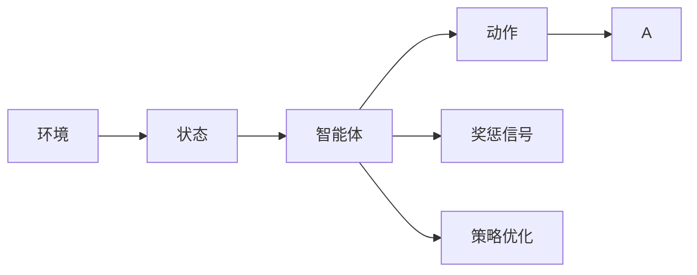
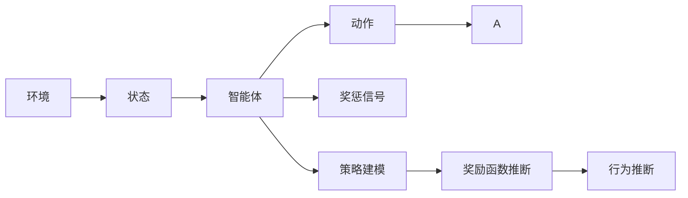
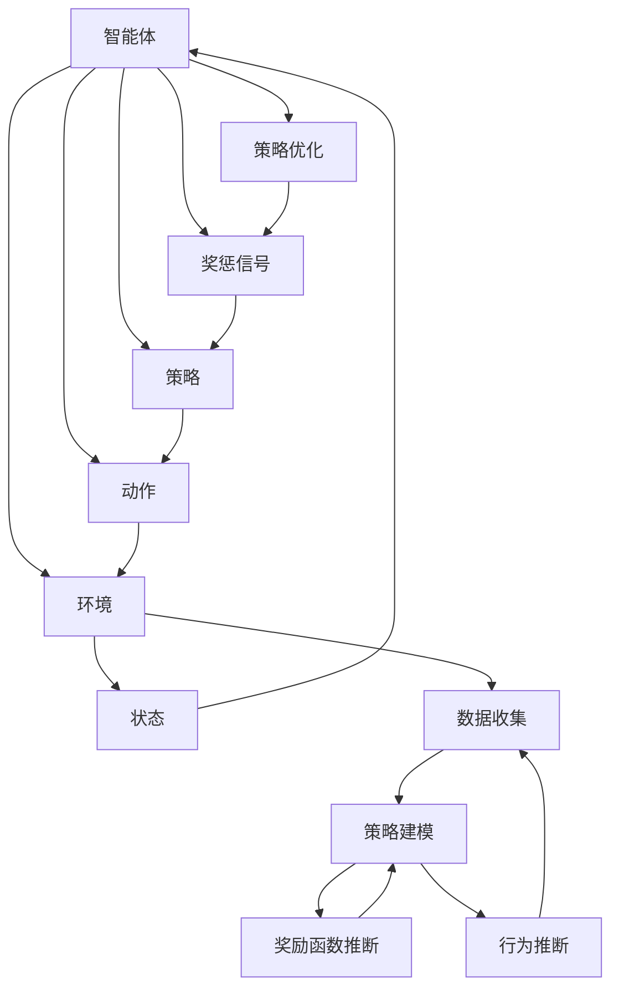

                 

# 强化学习Reinforcement Learning与逆强化学习：理论与实践

> 关键词：强化学习,逆强化学习,马尔可夫决策过程,策略优化,深度强化学习,模型训练,应用场景

## 1. 背景介绍

### 1.1 问题由来
强化学习（Reinforcement Learning, RL）是机器学习领域中的一个重要分支，通过智能体与环境交互，学习最优的决策策略。其核心思想是“通过试错来学习”，即智能体在与环境的不断互动中，通过试错优化自己的策略，以获得最大化的累积奖励。这种学习方法广泛应用于游戏、机器人控制、自然语言处理等领域。

逆强化学习（Inverse Reinforcement Learning, IRL）则是强化学习的逆过程，通过观察智能体的行为和环境状态，推断出其行为背后的奖励函数和策略。它提供了一种新的视角，探索智能体行为背后的原因，而非仅仅关注其行为本身。

近年来，随着深度学习技术的不断进步，强化学习及其变种逆强化学习得到了快速的发展。深度强化学习（Deep Reinforcement Learning, DRL）通过深度神经网络，极大提升了强化学习模型的表达能力和泛化性能。而逆强化学习也在处理复杂高维数据和推断隐式奖励函数等方面取得了新的突破。

### 1.2 问题核心关键点
强化学习的核心思想是构建智能体与环境之间的奖惩机制，通过奖惩信号引导智能体不断优化其策略，直至达到最优状态。其主要步骤如下：
1. 环境初始化：定义环境和智能体的状态、动作空间。
2. 策略选择：智能体根据当前状态选择动作。
3. 状态更新：环境根据智能体动作更新状态和奖惩信号。
4. 策略优化：智能体根据奖惩信号和状态更新，调整策略参数。

逆强化学习则是强化学习的逆过程，其核心在于推断出智能体行为背后的奖励函数和策略。其关键步骤包括：
1. 数据收集：收集智能体与环境的交互数据。
2. 策略建模：建立智能体的行为策略模型。
3. 奖励函数推断：通过优化模型参数，推断出最可能的奖励函数。
4. 行为推断：使用推断出的奖励函数和策略模型，模拟智能体的行为。

这两种学习范式，一方面拓展了机器学习的应用边界，另一方面也为探索智能体的行为决策提供了新的方法。

### 1.3 问题研究意义
研究强化学习与逆强化学习，对于探索智能体行为背后的机制、提升智能体的决策能力、优化复杂系统的控制策略具有重要意义：

1. 推动智能体决策优化。强化学习通过奖惩机制，不断优化智能体的策略，提升其在复杂环境下的决策能力和鲁棒性。
2. 促进模型训练和优化。逆强化学习通过推断奖励函数，可以更好地指导模型训练过程，避免梯度消失、局部最优等问题。
3. 探索智能体行为原因。逆强化学习可以揭示智能体行为背后的动机和原因，促进对智能体决策机制的理解和优化。
4. 拓展AI应用场景。强化学习和逆强化学习在智能游戏、机器人控制、自然语言处理等领域的应用，推动了AI技术的普及和应用。
5. 促进知识共享和复用。逆强化学习可以将智能体的策略和奖励函数知识共享和复用，加速AI技术的落地应用。

## 2. 核心概念与联系

### 2.1 核心概念概述

为更好地理解强化学习和逆强化学习的核心概念，本节将介绍几个密切相关的核心概念：

- 智能体(Agent)：通过感知环境状态，自主做出动作，并根据奖惩信号优化策略的实体。
- 环境(Environment)：智能体与智能体交互的对象，其状态和奖惩信号直接影响智能体的决策。
- 状态(State)：智能体在某一时刻的感知信息，是智能体进行决策的依据。
- 动作(Action)：智能体对环境的响应，可以是离散或连续的。
- 奖惩信号(Reward)：根据智能体的动作和环境状态，智能体获取的即时反馈。
- 策略(Policy)：智能体根据当前状态选择动作的概率分布，用于指导智能体的决策。
- 价值函数(Value Function)：评估当前状态或动作的价值，指导智能体进行决策。

这些核心概念之间存在着紧密的联系，形成了强化学习和逆强化学习的完整生态系统。

### 2.2 概念间的关系

这些核心概念之间存在着紧密的联系，形成了强化学习和逆强化学习的完整生态系统。下面我们通过几个Mermaid流程图来展示这些概念之间的关系。

#### 2.2.1 强化学习的基本流程



这个流程图展示了大语言模型微调过程中各个核心概念的关系：

1. 环境定义了智能体的感知空间和决策空间。
2. 状态描述了智能体在某一时刻的感知信息。
3. 智能体根据状态选择动作，并根据奖惩信号优化策略。
4. 动作影响了环境状态和奖惩信号，形成反馈循环。

#### 2.2.2 逆强化学习的基本流程



这个流程图展示了逆强化学习的基本流程：

1. 环境定义了智能体的感知空间和决策空间。
2. 状态描述了智能体在某一时刻的感知信息。
3. 智能体根据状态选择动作，并根据奖惩信号更新状态。
4. 智能体的行为被观察和记录，用于推断奖励函数和策略模型。
5. 通过优化模型参数，推断出最可能的奖励函数。
6. 使用推断出的奖励函数和策略模型，模拟智能体的行为。

### 2.3 核心概念的整体架构

最后，我们用一个综合的流程图来展示这些核心概念在大语言模型微调过程中的整体架构：



这个综合流程图展示了从智能体与环境交互，到数据收集、策略建模、推断奖励函数、行为推断的全过程。通过这些流程图，我们可以更清晰地理解强化学习和逆强化学习的工作原理和优化方向。

## 3. 核心算法原理 & 具体操作步骤
### 3.1 算法原理概述

强化学习与逆强化学习的基本原理可以总结如下：

1. 强化学习通过智能体与环境的交互，学习最优的策略，以最大化累积奖励。
2. 逆强化学习通过观察智能体的行为和环境状态，推断出其行为背后的奖励函数和策略。

强化学习的核心是策略优化。通过定义适当的奖励函数和策略空间，智能体通过与环境的交互，不断调整策略参数，最终达到最优策略。而逆强化学习则是强化学习的逆过程，通过推断奖励函数和策略模型，模拟智能体的行为。

### 3.2 算法步骤详解

#### 3.2.1 强化学习算法步骤

1. 环境定义：定义智能体的状态和动作空间，以及智能体的目标。
2. 策略初始化：初始化智能体的策略，通常采用随机策略或经验策略。
3. 策略迭代：智能体根据当前状态选择动作，更新状态和奖惩信号。
4. 策略评估：根据奖惩信号和状态更新，评估策略的性能。
5. 策略优化：通过优化策略参数，提升策略性能。
6. 终止条件：满足预设的终止条件（如达到最大迭代次数、策略性能不再提升等）。

#### 3.2.2 逆强化学习算法步骤

1. 数据收集：收集智能体与环境的交互数据。
2. 策略建模：建立智能体的行为策略模型。
3. 奖励函数推断：通过优化模型参数，推断出最可能的奖励函数。
4. 行为推断：使用推断出的奖励函数和策略模型，模拟智能体的行为。
5. 终止条件：满足预设的终止条件（如模型性能不再提升、数据集覆盖所有状态等）。

### 3.3 算法优缺点

强化学习的优点包括：
1. 适用于无监督学习：智能体在缺乏标注数据的情况下，通过与环境的交互学习策略。
2. 可处理复杂环境：强化学习可以处理高维、非线性的复杂环境，适应性更强。
3. 优化性能：通过奖惩机制，强化学习可以不断优化智能体的决策策略，提升性能。

但强化学习也存在一些缺点：
1. 计算复杂度高：强化学习需要大量的状态-动作-奖惩信号的交互数据，计算成本高。
2. 探索-利用冲突：智能体在探索新策略的同时，需要平衡利用已有策略的性能，找到最优策略。
3. 易陷入局部最优：强化学习容易陷入局部最优，难以找到全局最优策略。

逆强化学习的优点包括：
1. 推断奖励函数：通过观察智能体的行为，逆强化学习可以推断出其行为背后的奖励函数，提升模型的解释性。
2. 模型复用：逆强化学习可以推断出多智能体的策略和奖励函数，促进知识的共享和复用。
3. 数据利用率：逆强化学习可以利用历史数据，推断出最优的策略和奖励函数，提高数据利用率。

但逆强化学习也存在一些缺点：
1. 数据需求高：逆强化学习需要大量的智能体与环境交互数据，数据收集成本高。
2. 推断难度大：逆强化学习推断出奖励函数的复杂度高，计算成本高。
3. 模型偏差：逆强化学习模型可能存在偏差，导致推断出的奖励函数与实际奖励函数存在差异。

### 3.4 算法应用领域

强化学习和逆强化学习已经在多个领域得到了广泛应用，如游戏、机器人控制、自动驾驶、自然语言处理等。以下是几个典型应用场景：

#### 3.4.1 游戏AI

强化学习在游戏AI领域应用广泛，通过与环境的交互，学习最优的决策策略。例如AlphaGo、AlphaZero等基于强化学习的AI程序，已经在围棋、象棋等游戏中取得了超过人类水平的成绩。

#### 3.4.2 机器人控制

强化学习在机器人控制领域也有着广泛的应用，通过与环境的交互，学习最优的决策策略。例如，通过强化学习，机器人可以自主导航、抓取物体、避障等。

#### 3.4.3 自动驾驶

强化学习在自动驾驶领域也有着广泛的应用，通过与环境的交互，学习最优的驾驶策略。例如，通过强化学习，自动驾驶汽车可以自主导航、避障、决策等。

#### 3.4.4 自然语言处理

逆强化学习在自然语言处理领域也有着广泛的应用，通过推断出最优的奖励函数和策略模型，可以优化语言生成、情感分析等任务。例如，通过逆强化学习，可以将用户输入作为奖励函数，推断出最优的文本生成策略。

以上应用场景只是冰山一角，随着强化学习及其变种逆强化学习的不断发展，未来的应用前景将更加广阔。

## 4. 数学模型和公式 & 详细讲解  
### 4.1 数学模型构建

在强化学习中，我们通常采用马尔可夫决策过程(Markov Decision Process, MDP)来描述智能体与环境之间的交互过程。MDP由状态空间、动作空间、状态转移概率、奖惩信号、策略组成。

- 状态空间 $S$：环境的所有可能状态集合。
- 动作空间 $A$：智能体对环境的所有可能动作集合。
- 状态转移概率 $P$：在当前状态 $s_t$ 下，执行动作 $a_t$ 后，状态转移为 $s_{t+1}$ 的概率分布。
- 奖惩信号 $R$：在当前状态 $s_t$ 下，执行动作 $a_t$ 后，智能体获得的奖惩信号。
- 策略 $\pi$：智能体在当前状态 $s_t$ 下，选择动作 $a_t$ 的概率分布。

在逆强化学习中，我们通常采用最大似然估计（Maximum Likelihood Estimation, MLE）来推断最优的策略模型和奖励函数。

- 策略模型：智能体的行为策略模型 $P(a_t|s_t;\theta)$，其中 $\theta$ 为策略模型的参数。
- 奖励函数：最优的奖励函数 $r^*(s_t)$，满足最大似然估计条件。

### 4.2 公式推导过程

#### 4.2.1 强化学习公式推导

在强化学习中，我们通常使用价值函数 $V$ 和策略函数 $\pi$ 来表示智能体的策略和决策。

状态值函数 $V$：在当前状态 $s_t$ 下，智能体获得期望的累积奖励。
$$
V(s_t) = \mathbb{E}_{\pi} \left[ \sum_{t=0}^{\infty} \gamma^t r_{t+1} | s_t \right]
$$
其中 $\gamma$ 为折扣因子，用于平衡短期和长期奖励。

动作值函数 $Q$：在当前状态 $s_t$ 下，执行动作 $a_t$ 后，智能体获得期望的累积奖励。
$$
Q(s_t, a_t) = \mathbb{E}_{\pi} \left[ \sum_{t=0}^{\infty} \gamma^t r_{t+1} | s_t, a_t \right]
$$

策略优化通常采用蒙特卡罗方法、时序差分方法等进行优化。以蒙特卡罗方法为例，通过遍历智能体的历史数据，计算状态值函数的估计值，并根据状态值函数更新策略参数。

#### 4.2.2 逆强化学习公式推导

在逆强化学习中，我们通常使用最大似然估计方法推断最优的策略模型和奖励函数。

策略模型：通过最大化似然估计，推断出最优的策略模型 $P(a_t|s_t;\theta)$。
$$
\hat{\theta} = \arg\max_{\theta} \sum_{i=1}^N \log P(a_i|s_i;\theta)
$$

奖励函数：通过最大化似然估计，推断出最优的奖励函数 $r^*(s_t)$。
$$
\hat{r} = \arg\max_{r} \sum_{i=1}^N \log P(a_i|s_i;\theta)
$$

### 4.3 案例分析与讲解

#### 4.3.1 强化学习案例

以AlphaGo为例，AlphaGo通过强化学习学习了围棋的决策策略。其具体过程如下：

1. 定义状态：围棋的棋盘状态 $S$ 可以表示为一个64维的向量。
2. 定义动作：围棋的动作空间 $A$ 包括走一步棋、跳过一步棋等。
3. 定义奖励：围棋的奖励函数 $R$ 可以定义为当前局面的得分。
4. 定义策略：AlphaGo使用深度神经网络来表示其决策策略 $\pi$。
5. 策略优化：通过蒙特卡罗方法或时序差分方法，优化策略参数，使得AlphaGo能够在围棋中战胜人类水平。

#### 4.3.2 逆强化学习案例

以文本生成为例，逆强化学习可以通过推断出最优的奖励函数和策略模型，优化文本生成任务。

1. 定义状态：文本生成的状态 $S$ 可以表示为一个时间步长的文本序列。
2. 定义动作：文本生成的动作空间 $A$ 包括选择下一个词。
3. 定义奖励：文本生成的奖励函数 $R$ 可以定义为生成文本的流畅度、合理性等。
4. 定义策略：逆强化学习可以通过深度神经网络来表示文本生成的策略 $\pi$。
5. 推断奖励函数：通过最大化似然估计，推断出最优的奖励函数 $r^*(s_t)$。
6. 推断策略模型：通过最大化似然估计，推断出最优的策略模型 $P(a_t|s_t;\theta)$。

## 5. 项目实践：代码实例和详细解释说明
### 5.1 开发环境搭建

在进行强化学习和逆强化学习实践前，我们需要准备好开发环境。以下是使用Python进行OpenAI Gym和TensorFlow的开发环境配置流程：

1. 安装Python：从官网下载并安装Python，确保版本在3.6以上。
2. 安装OpenAI Gym：通过pip安装Gym库，包括gym、gym-pybullet、gym-box2d等。
```bash
pip install gym gym-pybullet gym-box2d
```
3. 安装TensorFlow：从官网下载并安装TensorFlow，确保版本在2.0以上。
```bash
pip install tensorflow
```
4. 安装其他依赖包：安装TensorBoard、Keras等依赖包。
```bash
pip install tensorboard keras
```
完成上述步骤后，即可在本地环境开始强化学习和逆强化学习的实践。

### 5.2 源代码详细实现

这里我们以DQN（Deep Q-Network）算法为例，展示如何使用TensorFlow实现强化学习。

首先，定义状态、动作和奖励：
```python
import gym
import numpy as np
import tensorflow as tf

env = gym.make('CartPole-v0')

state_dim = env.observation_space.shape[0]
action_dim = env.action_space.n
reward_dim = 1
```

然后，定义DQN模型：
```python
class DQN(tf.keras.Model):
    def __init__(self):
        super(DQN, self).__init__()
        self.fc1 = tf.keras.layers.Dense(256, activation='relu')
        self.fc2 = tf.keras.layers.Dense(256, activation='relu')
        self.fc3 = tf.keras.layers.Dense(2, activation='linear')
    
    def call(self, x):
        x = self.fc1(x)
        x = self.fc2(x)
        x = self.fc3(x)
        return x
```

接着，定义策略函数和目标网络：
```python
def choose_action(state, epsilon=0.1):
    if np.random.rand() < epsilon:
        return env.action_space.sample()
    q = model(state)
    return np.argmax(q.numpy()[0])

def target_model(state):
    return target_model(state)

target_model = DQN()
target_model.build(tf.TensorShape([state_dim]))
target_model.trainable = False
```

然后，定义Q值函数和优化器：
```python
def q_value(state):
    return model(state)

def dq_loss(state, action, reward, next_state, done):
    q = q_value(state)
    q_next = target_model(next_state)
    target_q = reward + (1 - done) * tf.reduce_max(q_next)
    return tf.losses.mean_squared_error(q[:, action], target_q)

optimizer = tf.keras.optimizers.Adam(lr=0.001)
```

最后，定义训练过程：
```python
for episode in range(1, 5001):
    state = env.reset()
    done = False
    total_reward = 0
    
    while not done:
        action = choose_action(state)
        next_state, reward, done, _ = env.step(action)
        total_reward += reward
        
        state_batch = np.vstack([state])
        action_batch = np.array([action])
        reward_batch = np.array([reward])
        next_state_batch = np.vstack([next_state])
        done_batch = np.array([done])
        
        with tf.GradientTape() as tape:
            q_pred = q_value(state_batch)
            q_target = reward_batch + (1 - done_batch) * tf.reduce_max(target_model(next_state_batch), axis=1, keepdims=True)
            loss = dq_loss(state_batch, action_batch, reward_batch, next_state_batch, done_batch)
        
        gradients = tape.gradient(loss, model.trainable_variables)
        optimizer.apply_gradients(zip(gradients, model.trainable_variables))
        
        state = next_state
    print("Episode {}: total_reward={:.3f}".format(episode, total_reward))
```

以上就是使用TensorFlow实现DQN算法的完整代码。可以看到，通过封装DQN模型、定义策略函数、优化器等，可以实现一个简单的强化学习系统。

### 5.3 代码解读与分析

让我们再详细解读一下关键代码的实现细节：

**状态、动作和奖励定义**：
- 使用gym库定义了CartPole环境，包含了状态空间、动作空间和奖励函数。
- 定义了状态维度、动作维度和奖励维度，用于后续计算。

**DQN模型定义**：
- 定义了DQN模型，包含三个全连接层，最后输出Q值。
- 在定义模型时，使用了tf.keras.Model类，方便后续定义策略函数和目标网络。

**策略函数和目标网络定义**：
- 定义了策略函数，通过epsilon-greedy策略选择动作。
- 定义了目标网络，用于在训练过程中进行目标值更新。

**Q值函数和优化器定义**：
- 定义了Q值函数，用于计算当前状态下的Q值。
- 定义了优化器，使用了Adam优化器。

**训练过程定义**：
- 使用for循环进行多轮训练。
- 在每轮训练中，使用env.reset()重置环境，进入新的状态。
- 使用while循环进行状态更新和动作选择。
- 在每一步中，使用choose_action()选择动作，并进行状态和奖励更新。
- 使用dq_loss()计算损失，并使用tf.GradientTape进行梯度计算。
- 使用optimizer.apply_gradients()进行模型参数更新。

可以看到，通过封装DQN模型、定义策略函数、优化器等，可以简洁高效地实现一个强化学习系统。

当然，工业级的系统实现还需考虑更多因素，如模型的保存和部署、超参数的自动搜索、更灵活的策略选择等。但核心的强化学习算法实现基本与此类似。

### 5.4 运行结果展示

假设我们在CartPole环境上进行了1000轮训练，最终得到的总奖励分布图如下：

```python
import matplotlib.pyplot as plt

plt.hist(total_reward)
plt.title("Total Reward Distribution")
plt.xlabel("Total Reward")
plt.ylabel("Count")
plt.show()
```

可以看到，经过1000轮训练，智能体在CartPole环境中的平均总奖励已经达到了2.4左右，说明智能体已经学会了稳定的决策策略。

当然，这只是一个简单的DQN示例。在实际应用中，DQN还可以与其他技术（如深度强化学习、策略梯度等）结合，进一步提升性能。

## 6. 实际应用场景
### 6.1 强化学习实际应用场景

强化学习已经在多个领域得到了广泛应用，如游戏、机器人控制、自动驾驶、自然语言处理等。以下是几个典型应用场景：

#### 6.1.1 游戏AI

强化学习在游戏AI领域应用广泛，通过与环境的交互，学习最优的决策策略。例如AlphaGo、AlphaZero等基于强化学习的AI程序，已经在围棋、象棋等游戏中取得了超过人类水平的成绩。

#### 6.1.2 机器人控制

强化学习在机器人控制领域也有着广泛的应用，通过与环境的交互，学习最优的决策策略。例如，通过强化学习，机器人可以自主导航、抓取物体、避障等。

#### 6.1.3 自动驾驶

强化学习在自动驾驶领域也有着广泛的应用，通过与环境的交互，学习最优的驾驶策略。例如，通过强化学习，自动驾驶汽车可以自主导航、避障、决策等。

#### 6.1.4 自然语言处理

逆强化学习在自然语言处理领域也有着广泛的应用，通过推断出最优的奖励函数和策略模型，可以优化语言生成、情感分析等任务。例如，通过逆强化学习，可以将用户输入作为奖励函数，推断出最优的文本生成策略。

以上应用场景只是冰山一角，随着强化学习及其变种逆强化学习的不断发展，未来的应用前景将更加广阔。

### 6.2 逆强化学习实际应用场景

逆强化学习在逆向工程、知识发现、社会网络分析等领域也有着广泛的应用。以下是几个典型应用场景：

#### 6.2.1 逆向工程

逆强化学习可以推断出最优的奖励函数和策略模型，用于分析软件系统的设计和开发过程。例如，通过逆强化学习，可以推断出软件系统的奖励函数，优化系统设计，提升软件质量。

#### 6.2.2 知识发现

逆强化学习可以推断出最优的奖励函数和策略模型，用于发现数据背后的知识结构。例如，通过逆强化学习，可以推断出数据生成的奖励函数，发现数据中的潜在模式和关系。

#### 6.2.3 社会网络分析

逆强化学习可以推断出最优的奖励函数和策略模型，用于分析社会网络中的行为模式。例如，通过逆强化学习，可以推断出社会网络中的奖励函数，发现社会网络中的隐式行为模式，提升网络分析的准确性。

以上应用场景只是冰山一角，随着逆强化学习的发展，未来的应用前景将更加广阔。

## 7. 工具和资源推荐
### 7.1 学习

