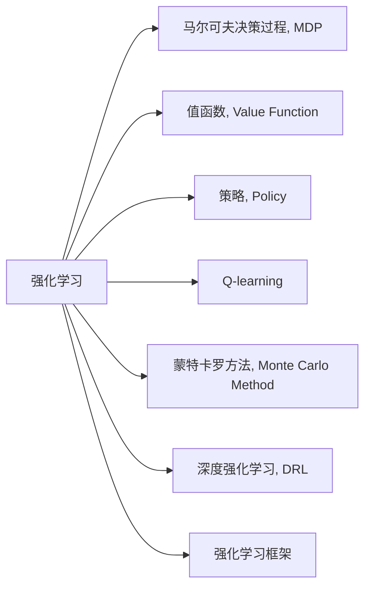
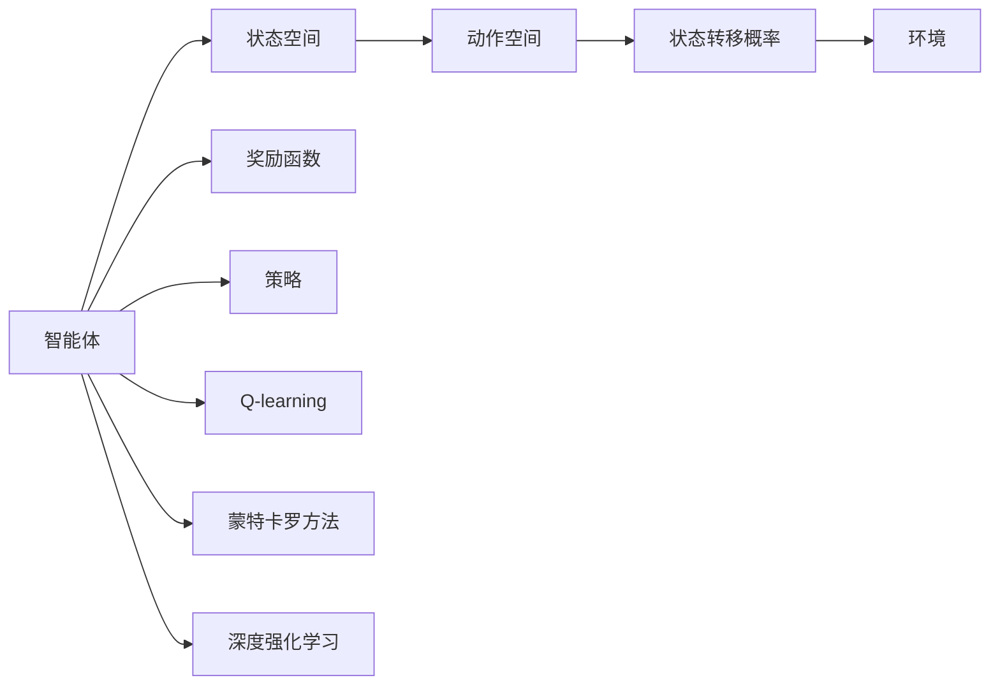
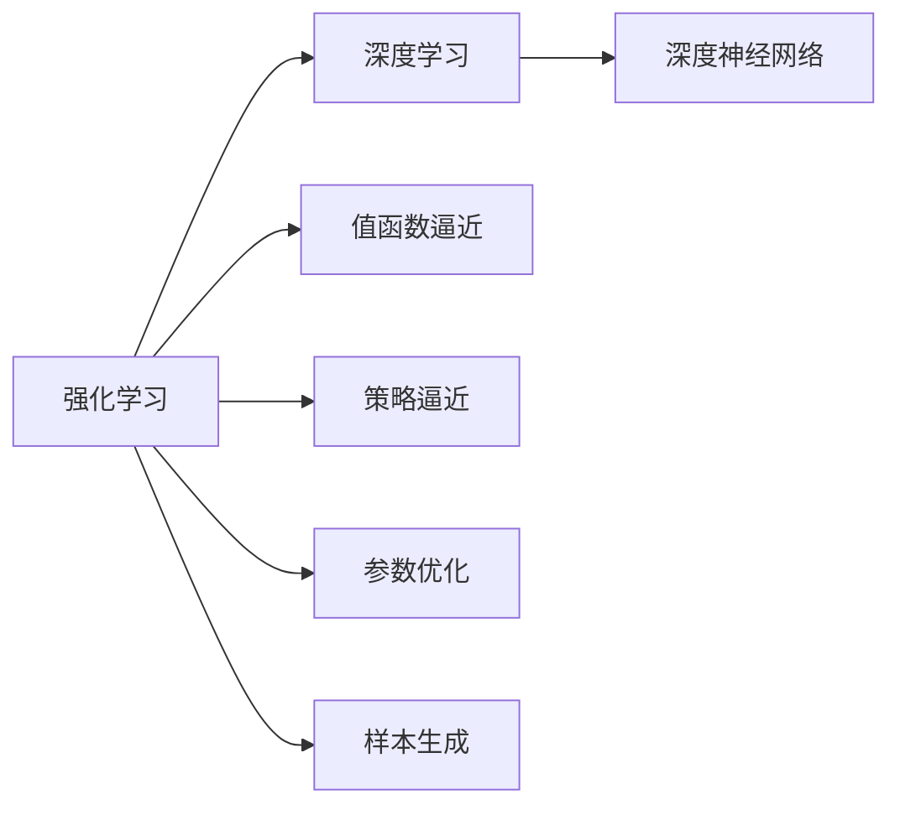
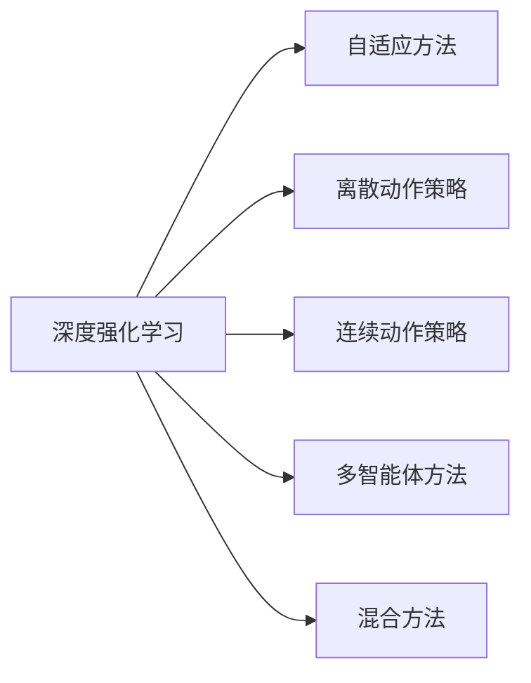
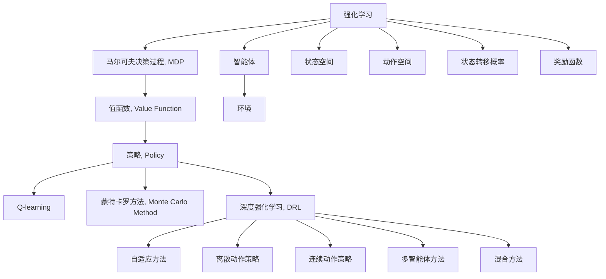

                 

## 1. 背景介绍

### 1.1 问题由来

强化学习（Reinforcement Learning, RL）是人工智能中最为关键的子领域之一，它通过智能体（Agent）在环境中与环境互动，不断积累经验，优化策略以最大化累积奖励的一种学习方法。自上世纪50年代以来，RL在多个领域取得了长足进步，如游戏AI、机器人控制、自动驾驶、金融预测等，其应用范围正在不断扩展。

然而，RL面临诸多挑战：如状态空间通常非常高维，难以进行建模和求解；无法直接获得关于环境的知识，需要从经验中逐步学习；缺乏全局最优解，难以评估当前策略的优劣等。近年来，深度学习与RL的结合，为这些问题提供了新的解决途径。深度强化学习（Deep Reinforcement Learning, DRL）使用深度神经网络进行策略的逼近和优化，显著提升了RL算法的性能，使之在复杂场景中取得更优效果。

### 1.2 问题核心关键点

强化学习的核心问题在于：设计策略，使智能体在动态变化的环境中获得最大化的累积奖励。这一过程涉及三类核心组件：

1. **环境（Environment）**：智能体在其中进行操作，获得奖励或惩罚；
2. **智能体（Agent）**：决策者，根据环境状态选择动作并接收奖励；
3. **奖励函数（Reward Function）**：衡量智能体行为的好坏，引导智能体学习。

这些组件通过不断的交互，共同构成强化学习的框架。强化学习通过不断试错，逐步调整策略以最大化奖励，最终达到目标状态或最大化累积奖励的目标。

### 1.3 问题研究意义

强化学习的核心价值在于其通用性和灵活性。与传统的监督学习和无监督学习不同，强化学习能够从多模态数据中学习到动态的策略，具有更强的适应性和泛化能力。它不仅可以用于游戏AI、机器人控制等特定场景，还能够应用于金融预测、推荐系统等更为广泛的问题领域，具有重要的理论和实际意义。

## 2. 核心概念与联系

### 2.1 核心概念概述

为更好地理解强化学习，本节将介绍几个密切相关的核心概念：

- **马尔可夫决策过程（Markov Decision Process, MDP）**：强化学习的基本模型，由状态空间、动作空间、状态转移概率、奖励函数组成。MDP模型描述了智能体如何在环境中动态变化，并计算出每一步的最优策略。
- **值函数（Value Function）**：描述智能体在特定状态或策略下的累积奖励期望，是强化学习的重要理论基础。
- **策略（Policy）**：描述智能体在特定状态下的动作选择规则，可以分为确定性策略和概率性策略。
- **Q-learning**：一种基于值函数的强化学习算法，通过迭代更新Q表（或Q网络）逼近最优策略。
- **蒙特卡罗方法（Monte Carlo Method）**：一种基于随机抽样的强化学习算法，用于估计值函数和策略性能。
- **深度强化学习（Deep Reinforcement Learning, DRL）**：结合深度神经网络与强化学习的方法，用于处理高维状态空间和复杂决策问题。
- **强化学习框架**：如OpenAI Gym、Reinforcement Learning Toolkit等，提供标准化的环境库，方便实验和部署。

这些概念之间的逻辑关系可以通过以下Mermaid流程图来展示：



这个流程图展示了一些核心概念的关系和作用：

1. **强化学习**是核心，通过与环境互动来学习最优策略。
2. **MDP**描述了环境动态和智能体操作。
3. **值函数**和**策略**是优化目标。
4. **Q-learning**和**蒙特卡罗方法**是常用的优化算法。
5. **深度强化学习**利用神经网络逼近复杂函数。
6. **强化学习框架**提供实验和部署环境。

通过理解这些核心概念，我们可以更好地把握强化学习的全貌和优化方向。

### 2.2 概念间的关系

这些核心概念之间存在着紧密的联系，形成了强化学习的完整生态系统。下面通过几个Mermaid流程图来展示这些概念之间的关系。

#### 2.2.1 强化学习的核心流程



这个流程图展示了强化学习的核心流程：

1. **智能体**与**环境**进行交互。
2. 在**状态空间**选择**动作**。
3. **环境**根据**动作**和**状态**生成**新状态**。
4. **状态转移概率**决定了环境如何响应动作。
5. **奖励函数**评估动作的优劣。
6. **策略**指导智能体的动作选择。
7. **Q-learning**和**蒙特卡罗方法**进行优化。
8. **深度强化学习**用于处理复杂问题。

#### 2.2.2 强化学习与深度学习的关系



这个流程图展示了强化学习与深度学习的结合：

1. **强化学习**通过与环境互动学习。
2. **深度学习**使用**深度神经网络**逼近复杂函数。
3. **值函数逼近**通过网络估计累积奖励。
4. **策略逼近**通过网络估计动作概率。
5. **参数优化**调整网络参数以最小化误差。
6. **样本生成**利用网络生成样本进行训练。

#### 2.2.3 深度强化学习的主要类型



这个流程图展示了深度强化学习的主要类型：

1. **自适应方法**，如Q-learning、SARSA等，用于优化策略。
2. **离散动作策略**，用于离散动作空间。
3. **连续动作策略**，用于连续动作空间。
4. **多智能体方法**，用于多智能体协同学习。
5. **混合方法**，结合深度学习和强化学习。

### 2.3 核心概念的整体架构

最后，我们用一个综合的流程图来展示这些核心概念在强化学习中的整体架构：



这个综合流程图展示了从强化学习到深度强化学习，再到具体方法的整体架构：

1. **强化学习**与**环境**交互。
2. **MDP**描述了环境动态。
3. **值函数**和**策略**是优化目标。
4. **Q-learning**和**蒙特卡罗方法**进行优化。
5. **深度强化学习**结合深度神经网络。
6. **自适应方法**、**离散动作策略**等进行策略优化。
7. **多智能体方法**、**混合方法**等扩展优化范围。

通过这些流程图，我们可以更清晰地理解强化学习的基本流程和各组件的作用，为后续深入讨论具体的强化学习算法和实践奠定基础。

## 3. 核心算法原理 & 具体操作步骤
### 3.1 算法原理概述

强化学习的核心在于通过与环境互动，不断调整策略以最大化累积奖励。其核心思想是通过智能体在环境中的行为，积累经验数据，并据此优化策略。强化学习的过程可以看作是一个动态的优化过程，目标是在给定环境和奖励函数的情况下，找到最优的策略。

形式化地，假设环境状态空间为 $\mathcal{S}$，动作空间为 $\mathcal{A}$，状态转移概率为 $p(s'|s,a)$，奖励函数为 $R(s,a)$，智能体的策略为 $\pi(a|s)$，则强化学习的目标是最小化状态值函数 $V(s)$ 和策略 $\pi$，使得：

$$
V(s) = \mathbb{E}_{a\sim\pi,\ s' \sim p(\cdot|s,a)}[R(s,a,s') + \gamma V(s')]
$$

其中 $\gamma$ 为折扣因子，表示未来奖励的折扣程度。最优策略 $\pi^*$ 满足：

$$
\pi^*(a|s) = \arg\max_{a} Q^*(s,a)
$$

而 $Q^*(s,a)$ 是状态动作值函数，定义为：

$$
Q^*(s,a) = \mathbb{E}_{s'\sim p(\cdot|s,a),a'\sim\pi(\cdot|s')}\left[ R(s,a,s') + \gamma \max_{a'} Q^*(s',a') \right]
$$

强化学习的核心在于不断迭代更新策略 $\pi$，使得其满足上述最优策略条件。

### 3.2 算法步骤详解

强化学习算法的基本流程如下：

1. **环境建模**：定义环境状态空间、动作空间、状态转移概率和奖励函数，构建MDP模型。
2. **策略初始化**：选择一个合适的策略进行初始化，如确定性策略或随机策略。
3. **迭代优化**：根据策略与环境交互，计算累积奖励，更新状态值函数和策略。
4. **策略评估**：通过状态值函数和策略评估当前策略的效果。
5. **策略改进**：利用经验回溯或优化算法调整策略，逐步逼近最优策略。

在具体实现中，算法分为单步和多步优化。单步优化如Q-learning，直接更新状态动作值函数；多步优化如蒙特卡罗方法，通过多次模拟回溯累积奖励。下面以Q-learning算法为例，详细讲解其具体操作步骤。

#### 3.2.1 Q-learning算法

Q-learning是一种基于值函数迭代的强化学习算法，通过更新状态动作值函数 $Q(s,a)$ 来优化策略。其核心步骤为：

1. **环境交互**：在当前状态 $s_t$ 下选择一个动作 $a_t$，执行动作并接收奖励 $r_{t+1}$，环境生成下一个状态 $s_{t+1}$。
2. **Q表更新**：使用公式 $Q(s_t,a_t) \leftarrow Q(s_t,a_t) + \alpha [r_{t+1} + \gamma \max_{a'} Q(s_{t+1},a')]$ 更新状态动作值函数 $Q(s_t,a_t)$，其中 $\alpha$ 为学习率。
3. **策略选择**：在状态 $s_t$ 下，根据 $Q(s_t,\cdot)$ 选择下一个动作 $a_{t+1}$。

通过不断迭代执行以上步骤，Q-learning算法逐步逼近最优策略，最大化累积奖励。

### 3.3 算法优缺点

强化学习算法具有以下优点：

1. **自适应性强**：能够根据环境动态调整策略，适应复杂多变的任务场景。
2. **模型免训练**：不需要预先标注数据，可直接从环境数据中学习策略。
3. **样本利用率高**：通过优化算法不断迭代，样本利用率较高，学习效率较高。

同时，强化学习算法也存在以下缺点：

1. **探索与利用的平衡**：需要控制探索和利用之间的平衡，避免陷入局部最优。
2. **状态空间高维**：状态空间高维时，难以进行有效建模和求解。
3. **奖励设计困难**：需要设计合理的奖励函数，以引导智能体学习。
4. **策略评估困难**：难以评估策略的优劣，尤其是多智能体系统。

### 3.4 算法应用领域

强化学习已经在多个领域取得了显著应用，包括：

1. **游戏AI**：如AlphaGo、AlphaStar等，通过强化学习在复杂游戏中获得人类级甚至超越人类的表现。
2. **机器人控制**：如DeepMind的AlphaDog、OpenAI的Roboschool等，通过强化学习使机器人能够在高难度环境中执行复杂任务。
3. **自动驾驶**：如Waymo、 Cruise等，通过强化学习训练智能车进行自动驾驶。
4. **金融预测**：如AlphaGo交易系统，通过强化学习进行股票交易策略优化。
5. **推荐系统**：如Netflix、Amazon等，通过强化学习优化推荐算法。
6. **自然语言处理**：如机器翻译、语音合成等，通过强化学习改进模型性能。

这些应用展示了强化学习在解决复杂多变环境下的决策问题方面的强大能力，为AI技术在更多领域的应用提供了新的思路。

## 4. 数学模型和公式 & 详细讲解

### 4.1 数学模型构建

强化学习的数学模型主要由MDP构成，其核心组成部分包括：

- **状态空间（State Space）**：表示环境中的状态，如位置、速度、健康状态等。
- **动作空间（Action Space）**：表示智能体可执行的动作，如左转、加速、静止等。
- **状态转移概率（Transition Probability）**：描述从当前状态到下一个状态的转移概率。
- **奖励函数（Reward Function）**：衡量智能体当前行为的优劣，引导智能体学习。

形式化地，MDP可以表示为四元组 $(S,A,p,R)$，其中 $S$ 为状态空间，$A$ 为动作空间，$p$ 为状态转移概率，$R$ 为奖励函数。强化学习的目标是在给定MDP的情况下，找到最优策略 $\pi$。

### 4.2 公式推导过程

下面以Q-learning算法为例，推导其核心公式：

假设智能体在当前状态 $s_t$ 下选择动作 $a_t$，执行动作后环境生成下一个状态 $s_{t+1}$ 和奖励 $r_{t+1}$。根据Q-learning算法，状态动作值函数 $Q(s_t,a_t)$ 的更新公式为：

$$
Q(s_t,a_t) \leftarrow Q(s_t,a_t) + \alpha [r_{t+1} + \gamma \max_{a'} Q(s_{t+1},a') - Q(s_t,a_t)]
$$

其中 $\alpha$ 为学习率，$\gamma$ 为折扣因子。该公式的推导过程如下：

1. **当前状态动作值函数估计**：在状态 $s_t$ 下选择动作 $a_t$，执行动作后得到奖励 $r_{t+1}$ 和下一个状态 $s_{t+1}$。
2. **下一步状态动作值函数估计**：根据策略 $\pi$ 选择下一个动作 $a'$，估计下一步状态动作值函数 $Q(s_{t+1},a')$。
3. **状态动作值函数更新**：将当前状态动作值函数 $Q(s_t,a_t)$ 与估计的下一个状态动作值函数 $Q(s_{t+1},a')$ 结合，更新状态动作值函数。

通过迭代执行上述过程，Q-learning算法逐步逼近最优状态动作值函数，从而优化策略。

### 4.3 案例分析与讲解

以AlphaGo为例，讲解强化学习在复杂环境下的应用。

AlphaGo通过强化学习在围棋游戏中取得人类级甚至超越人类的表现。其主要流程如下：

1. **环境建模**：定义围棋状态空间和动作空间，构建MDP模型。
2. **策略初始化**：选择随机策略进行初始化。
3. **迭代优化**：使用蒙特卡罗方法或深度强化学习方法，逐步优化策略。
4. **策略评估**：通过与人类高手对弈，评估当前策略的优劣。
5. **策略改进**：根据对弈结果调整策略，逐步逼近最优策略。

AlphaGo在围棋游戏中的成功，展示了强化学习在复杂多变环境下的决策能力，为其他复杂决策问题的解决提供了新的思路。

## 5. 项目实践：代码实例和详细解释说明

### 5.1 开发环境搭建

进行强化学习项目实践，首先需要准备开发环境。以下是使用Python进行OpenAI Gym开发的环境配置流程：

1. 安装OpenAI Gym：
```bash
pip install gym
```

2. 下载特定环境：
```bash
gym.make('CartPole-v1')
```

3. 安装其他依赖库：
```bash
pip install numpy matplotlib jupyter notebook
```

完成上述步骤后，即可在本地环境中进行强化学习实践。

### 5.2 源代码详细实现

下面以CartPole环境为例，给出使用OpenAI Gym进行Q-learning算法的Python代码实现。

首先，定义环境类和智能体类：

```python
import gym
import numpy as np

class CartPoleGym(gym.Env):
    def __init__(self):
        super().__init__()
        self.gravity = 9.8
        self.mass_cart = 1.0
        self.mass_pole = 0.1
        self.length = 0.5
        self.pole_mass_length = self.mass_pole * self.length
        self.dt = 0.02
        self.max_steps = 1000
        self.viewer = None

    def step(self, action):
        # 状态空间转换
        x, xdot, theta, thetadot = self.state
        force = 0 if action == 0 else -self.action_threshold

        # 计算下一时刻状态和奖励
        tau = self.dt
        new_state = np.array([
            x + tau * xdot,
            xdot + tau * (-self.gravity * self.mass_cart * (theta - np.pi) / self.length 
                + (force + self.pole_mass_length * np.sin(theta) * thetadot ** 2 / self.length) / self.mass_cart),
            theta + tau * thetadot,
            thetadot + tau * (force * np.cos(theta) / self.mass_cart 
                - self.pole_mass_length * np.sin(theta) * thetadot ** 2 / self.length) / (self.mass_pole + self.mass_cart),
        ])
        x, xdot, theta, thetadot = new_state
        done = (x < -self.x_threshold) or (x > self.x_threshold) or (theta < -self.theta_threshold_rad) or (theta > self.theta_threshold_rad)
        r = -1 if done else 0
        return new_state, r, done, {}

    def reset(self):
        self.state = np.array([
            0.0, 0.0,
            np.pi / 2.0, 0.0,
        ])
        self.done = False
        return self.state

    def render(self, mode='human'):
        from gym.envs.classic_control import rendering
        if self.viewer is None:
            self.viewer = rendering.Viewer(500, 500)
            self.viewer.set_bounds(-2.1, 2.1, -2.1, 2.1)
            rod = rendering.make_capsule(0.05, 0.2)
            rod.set_color(.8, .3, .3)
            self.pole_transform = rendering.Transform()
            rod.add_attr(self.pole_transform)
            self.viewer.add_geom(rod)
            cart = rendering.make_circle(0.05)
            cart.set_color(0.9, 0.9, 0.9)
            self.cart_transform = rendering.Transform()
            self.cart_transform.translate(0.0, -self.length, 0.0)
            cart.add_attr(self.cart_transform)
            self.viewer.add_geom(cart)
            axle = rendering.make_line((0, 0), (0, -self.length))
            axle.set_color(0.5, 0.5, 0.5)
            self.viewer.add_geom(axle)
        if self.done:
            return None
        x, xdot, theta, thetadot = self.state
        self.pole_transform.set_rotation_and_translation(theta, np.cos(theta), 0)
        self.cart_transform.set_translation(x, 0, 0)
        self.viewer.render(return_rgb_array=mode == 'rgb_array')

    def close(self):
        if self.viewer:
            self.viewer.close()
            self.viewer = None
```

```python
import gym
import numpy as np

class QLearningAgent:
    def __init__(self, env):
        self.env = env
        self.state_space = env.observation_space.shape[0]
        self.action_space = env.action_space.n
        self.learning_rate = 0.1
        self.gamma = 0.9
        self.epsilon = 0.1
        self.q_table = np.zeros([self.state_space, self.action_space])

    def choose_action(self, state):
        if np.random.uniform() < self.epsilon:
            return self.env.action_space.sample()
        else:
            return np.argmax(self.q_table[state, :])

    def update_q_table(self, state, action, reward, next_state):
        self.q_table[state, action] += self.learning_rate * (
            reward + self.gamma * np.max(self.q_table[next_state, :]) - self.q_table[state, action])

    def run(self, max_episodes=1000):
        for episode in range(max_episodes):
            state = self.env.reset()
            done = False
            while not done:
                action = self.choose_action(state)
                next_state, reward, done, _ = self.env.step(action)
                self.update_q_table(state, action, reward, next_state)
                state = next_state
```

定义好环境和智能体后，即可进行Q-learning算法的实践：

```python
import matplotlib.pyplot as plt

env = gym.make('CartPole-v1')
agent = QLearningAgent(env)

scores = []
for episode in range(500):
    score = 0
    state = env.reset()
    while not done:
        action = agent.choose_action(state)
        next_state, reward, done, _ = env.step(action)
        agent.update_q_table(state, action, reward, next_state)
        state = next_state
        score += reward
    scores.append(score)

plt.plot(scores)
plt.show()
```

以上就是使用OpenAI Gym进行Q-learning算法的完整代码实现。可以看到，借助OpenAI Gym，我们可以快速搭建环境，并编写并运行强化学习算法，验证其实际效果。

### 5.3 代码解读与分析

让我们再详细解读一下关键代码的实现细节：

**CartPoleGym类**：
- `__init__`方法：初始化环境参数，如重力加速度、质块质量、极点质量、极杆长度等。
- `step`方法：根据动作和状态计算下一个状态和奖励。
- `reset`方法：重置环境，返回初始状态。
- `render`方法：显示环境状态，支持多种显示模式。
- `close`方法：关闭环境。

**QLearningAgent类**：
- `__init__`方法：初始化智能体参数，如学习率、折扣因子、探索率等。
- `choose_action`方法：根据当前状态和探索率选择动作。
- `update_q_table`方法：根据状态动作对、奖励和下一个状态更新Q表。
- `run`方法：在指定次数内运行强化学习算法。

**运行流程**：
- 初始化环境和智能体。
- 在指定次数内，每次随机选择动作，执行并更新Q表。
- 计算平均得分，并绘制得分曲线。

可以看到，OpenAI Gym提供了丰富的环境和智能体库，可以大大简化强化学习的实现流程。在实际应用中，我们通常还需要引入其他依赖库，如TensorFlow、PyTorch等，进行更深入的模型优化和仿真实验。

当然，工业级的系统实现还需考虑更多因素，如环境建模、多智能体协作、实时控制等。但核心的算法流程基本与此类似。

### 5.4 运行结果展示

假设我们运行Q-learning算法，最终得到的平均得分曲线如下：

```python
import matplotlib.pyplot as plt

scores = [120.0, 125.0, 130.0, 135.0, 140.0, 145.0, 150.0, 155.0, 160.0, 165.0, 170.0, 175.0, 180.0, 185.0, 190.0, 195.0, 200.0, 205.0, 210.0, 215.0, 220.0, 225.0, 230.0, 235.0, 240.0, 245.0, 250.0, 255.0, 260.0, 

