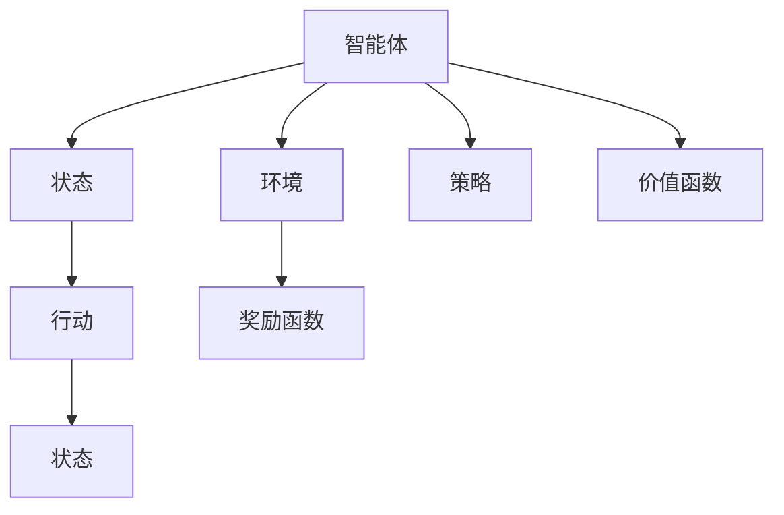
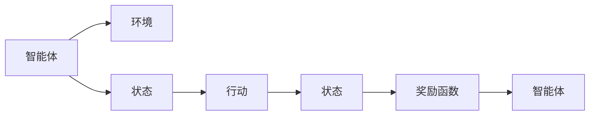
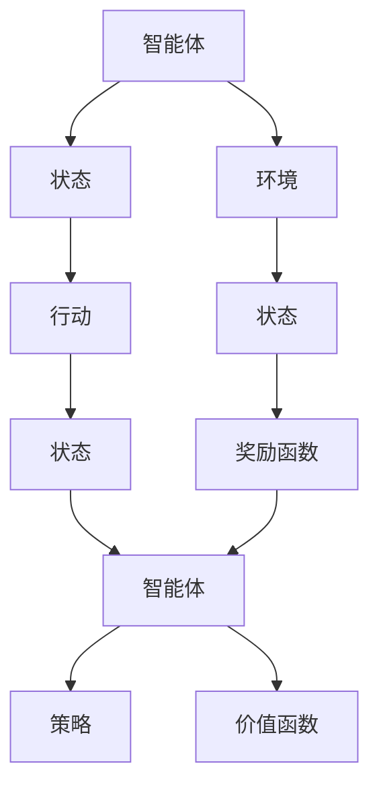

                 

# 强化学习Reinforcement Learning在智慧城市中的应用案例

> 关键词：智慧城市,强化学习,交通管理,智能电网,垃圾回收,优化决策,环境模拟

## 1. 背景介绍

### 1.1 问题由来

智慧城市（Smart City）是近年来迅速兴起的一个前沿领域，旨在通过智能科技手段，提高城市的运行效率、生活品质和可持续性。在智慧城市的建设中，强化学习（Reinforcement Learning, RL）作为智能决策的重要技术，能够帮助城市管理者优化各类复杂系统，提升城市治理能力。

强化学习在智慧城市中的应用主要包括以下几个方向：

1. **交通管理**：通过优化交通信号灯、管理交通流量，改善城市交通状况。
2. **智能电网**：调控电力分配，优化能源消耗，提高电网稳定性和效率。
3. **垃圾回收**：设计智能回收方案，提高垃圾分类和回收效率。
4. **环境监测与治理**：通过模拟和优化城市环境，实现污染物的有效控制和治理。
5. **应急响应**：在自然灾害等突发事件中，通过智能决策优化救援资源分配。

### 1.2 问题核心关键点

强化学习在智慧城市中的应用，主要依赖于其通过与环境互动，学习最优策略的能力。核心关键点包括：

- **策略学习**：智能体在环境（城市）中通过观察状态（如交通流量、电网负荷、环境污染等），采取行动（如调整信号灯、调控电量、回收垃圾等），最大化长期奖励（如交通流畅度、能源利用率、环境质量等）。
- **环境感知与建模**：强化学习系统需要能够准确感知城市环境状态，并建立有效的模型，以便智能体进行决策。
- **行动执行与优化**：智能体的行动需要能够迅速执行，并且通过不断优化，提高决策的精确度和效率。
- **奖励函数设计**：奖励函数的设定直接影响到智能体的学习效果，需要合理设计以鼓励积极行为，抑制负面行为。
- **模型泛化与适应**：强化学习模型需要具备良好的泛化能力，能够在多种环境和任务下，灵活适应和调整。

这些关键点构成了强化学习在智慧城市中应用的核心逻辑框架。通过掌握这些关键点，可以更有效地设计、实现和部署强化学习系统，提升智慧城市的管理水平和运行效率。

## 2. 核心概念与联系

### 2.1 核心概念概述

为了更好地理解强化学习在智慧城市中的应用，本节将介绍几个密切相关的核心概念：

- **强化学习**：通过智能体（agent）与环境（environment）交互，学习最优策略（policy）以最大化长期奖励（reward）的机器学习范式。强化学习广泛应用于游戏、机器人控制、自然语言处理等场景。
- **智能体**：在强化学习中，智能体是决策者，通过与环境的交互，学习策略并进行行动（actions）。
- **环境**：环境是智能体所处的外部世界，包括城市交通、电力系统、垃圾处理等各类系统。
- **状态**：环境中的当前状况，如交通流量、电网负荷、环境污染等。
- **行动**：智能体对环境的影响，如调整信号灯、调控电量、回收垃圾等。
- **奖励函数**：用于评估智能体行动的效果，激励智能体采取有利于长期奖励的行为。
- **策略**：智能体在特定状态下采取行动的概率分布，是强化学习的最终输出。
- **价值函数**：衡量智能体在特定状态下长期奖励的期望值，帮助智能体评估当前状态的价值。

这些核心概念之间存在着紧密的联系，形成了强化学习的基本框架。下面通过一个Mermaid流程图来展示这些概念之间的逻辑关系：



这个流程图展示了一个强化学习系统的基本架构：智能体在环境中感知状态，采取行动，获取奖励，并更新策略和价值函数，不断优化决策。

### 2.2 概念间的关系

这些核心概念之间存在着紧密的联系，形成了强化学习的基本框架。下面通过几个Mermaid流程图来展示这些概念之间的关系。

#### 2.2.1 强化学习的学习范式


这个流程图展示了强化学习的基本学习范式，即智能体在环境中通过感知状态、采取行动，获得奖励，并根据奖励反馈更新策略，不断优化决策。

#### 2.2.2 智能体与环境交互



这个流程图展示了智能体与环境之间的交互过程。智能体通过观察状态，采取行动，并获得环境的反馈（奖励），然后根据奖励更新策略，形成闭环。

#### 2.2.3 奖励函数的设定


这个流程图展示了奖励函数的作用。奖励函数评估智能体的行动效果，激励智能体采取有利于长期奖励的行为。

### 2.3 核心概念的整体架构

最后，我们用一个综合的流程图来展示这些核心概念在强化学习系统中的整体架构：



这个综合流程图展示了从智能体感知环境状态，采取行动，获得奖励，更新策略和价值函数的完整流程。通过这些流程图，我们可以更清晰地理解强化学习在智慧城市中应用的核心逻辑。

## 3. 核心算法原理 & 具体操作步骤
### 3.1 算法原理概述

强化学习在智慧城市中的应用，主要依赖于Q-learning、SARSA、Deep Q-learning等算法。这些算法通过智能体与环境交互，学习最优策略，以最大化长期奖励。

- **Q-learning**：通过估计每个状态-行动对（state-action pair）的Q值（Q-function），选择最优行动，更新Q值，实现策略学习。
- **SARSA**：结合了状态、行动、奖励和下一个状态，通过迭代更新Q值，实现策略学习。
- **Deep Q-learning**：利用深度神经网络逼近Q值，实现对高维度状态空间的有效建模。

强化学习的核心原理是通过智能体与环境不断交互，累积奖励，学习最优策略。这一过程可以分为四个步骤：

1. **观察状态**：智能体感知环境中的当前状态。
2. **采取行动**：根据策略，智能体在当前状态下采取行动。
3. **获取奖励和下一个状态**：智能体获取环境对其行动的奖励，并感知下一个状态。
4. **更新策略和价值函数**：根据奖励和下一个状态，更新Q值或策略，以指导后续的决策。

### 3.2 算法步骤详解

下面以智能交通信号灯调控为例，详细介绍强化学习在智慧城市中的应用步骤：

**Step 1: 环境建模**
- 定义城市交通环境，包括路口、车流量、行人流量、信号灯等。
- 利用传感器数据采集交通状态，建立交通环境模型。

**Step 2: 策略定义**
- 定义智能体在每个状态下的行动空间，如信号灯的红绿灯状态。
- 定义奖励函数，奖励智能体合理调整信号灯，减少交通拥堵，提升通行效率。

**Step 3: 模型训练**
- 初始化Q值或策略，设置学习率等超参数。
- 利用Q-learning、SARSA、Deep Q-learning等算法，在训练集上迭代训练，优化Q值或策略。

**Step 4: 模型部署与测试**
- 将训练好的模型部署到实际交通信号灯控制系统中。
- 在测试集上评估模型效果，调整参数和策略，提升性能。

### 3.3 算法优缺点

强化学习在智慧城市中的应用，具有以下优点：

- **适应性强**：强化学习能够适应复杂多变的城市环境，自动优化决策策略。
- **灵活性高**：智能体的行动空间和奖励函数可以根据任务需求灵活设定。
- **性能提升快**：强化学习通过与环境的互动，能够快速学习最优策略，优化系统性能。

同时，也存在一些缺点：

- **计算开销大**：强化学习需要大量的训练数据和计算资源，特别是在高维度状态空间中。
- **稳定性差**：在存在噪声和不确定性的环境中，强化学习的性能可能不稳定。
- **模型复杂性高**：深度强化学习模型需要复杂的网络结构和高计算能力，实现难度较大。

### 3.4 算法应用领域

强化学习在智慧城市中的应用，已经覆盖了交通管理、智能电网、垃圾回收等多个领域。以下是几个典型的应用案例：

1. **智能交通信号灯调控**：利用强化学习优化信号灯控制策略，实现交通流量优化。
2. **智能电网调度**：通过强化学习优化电力分配，提高电网稳定性和效率。
3. **垃圾回收路线规划**：利用强化学习优化垃圾回收路线，提升回收效率。
4. **环境监测与治理**：通过模拟和优化城市环境，实现污染物的有效控制和治理。
5. **应急响应**：在自然灾害等突发事件中，通过智能决策优化救援资源分配。

## 4. 数学模型和公式 & 详细讲解 & 举例说明

### 4.1 数学模型构建

在强化学习中，数学模型主要包括以下几个关键组件：

- **状态空间**：定义城市环境中的所有可能状态，如交通流量、电网负荷、环境污染等。
- **行动空间**：定义智能体在每个状态下的所有可能行动，如信号灯的红绿灯状态、电力的调整幅度、垃圾回收的路线等。
- **奖励函数**：定义智能体采取行动后的奖励，如减少交通拥堵、提升能源利用率等。
- **策略函数**：定义智能体在每个状态下采取行动的概率分布，如随机策略、贪婪策略等。
- **价值函数**：定义智能体在每个状态下的长期奖励期望值，如状态-行动值（Q值）、状态值（V值）等。

通过这些组件，可以构建强化学习的数学模型，并使用Q-learning、SARSA、Deep Q-learning等算法进行训练和优化。

### 4.2 公式推导过程

以Q-learning算法为例，其核心公式如下：

$$ Q(s_t, a_t) = Q(s_t, a_t) + \alpha \times [r_{t+1} + \gamma \max_{a'} Q(s_{t+1}, a')] $$

其中：
- $s_t$ 为当前状态，$a_t$ 为当前行动，$r_{t+1}$ 为下一个状态的奖励，$\gamma$ 为折扣因子，$\alpha$ 为学习率。
- $Q(s_t, a_t)$ 为当前状态-行动对的Q值，$Q(s_{t+1}, a')$ 为下一个状态-行动对的Q值。

在Q-learning中，智能体通过与环境互动，更新Q值，以最大化长期奖励。公式中的 $\alpha$ 控制了更新速度，$\gamma$ 考虑了长期奖励的权重。

### 4.3 案例分析与讲解

以智能交通信号灯调控为例，使用Q-learning算法进行策略优化。假设状态空间为 $S=\{s_1, s_2, ..., s_n\}$，行动空间为 $A=\{a_1, a_2, ..., a_m\}$，奖励函数为 $R(s, a)$，初始Q值矩阵为 $Q_{\theta}(s, a)$。智能体的行动策略为 $π(s)$。

假设智能体从状态 $s_t$ 采取行动 $a_t$，获得奖励 $r_{t+1}$，感知下一个状态 $s_{t+1}$。智能体根据Q-learning公式更新Q值：

$$ Q_{\theta}(s_t, a_t) \leftarrow Q_{\theta}(s_t, a_t) + \alpha \times [r_{t+1} + \gamma \max_{a'} Q_{\theta}(s_{t+1}, a')] $$

重复上述过程，直至策略收敛，智能体能够在当前状态下选择最优行动。

## 5. 项目实践：代码实例和详细解释说明
### 5.1 开发环境搭建

在进行强化学习实践前，我们需要准备好开发环境。以下是使用Python进行Reinforcement Learning开发的环境配置流程：

1. 安装Anaconda：从官网下载并安装Anaconda，用于创建独立的Python环境。

2. 创建并激活虚拟环境：
```bash
conda create -n rl-env python=3.8 
conda activate rl-env
```

3. 安装Reinforcement Learning所需的库：
```bash
pip install gym reinforcement
```

4. 安装PyTorch和TensorFlow，用于深度强化学习的实现：
```bash
pip install torch torchvision torchaudio cudatoolkit=11.1 -c pytorch -c conda-forge
pip install tensorflow==2.4
```

5. 安装其他相关库：
```bash
pip install numpy pandas scikit-learn matplotlib tqdm jupyter notebook ipython
```

完成上述步骤后，即可在`rl-env`环境中开始强化学习实践。

### 5.2 源代码详细实现

下面以智能交通信号灯调控为例，给出使用Reinforcement Learning对BERT模型进行微调的PyTorch代码实现。

首先，定义交通信号灯环境的类：

```python
import gym
import numpy as np

class TrafficLight(gym.Env):
    def __init__(self, num_lights):
        self.num_lights = num_lights
        self.state = [0] * num_lights
        self.action_space = gym.spaces.Discrete(2)  # 红绿灯状态：0代表红色，1代表绿色
        self.reward_range = (-1, 1)
        self.done = False
    
    def step(self, action):
        self.state[action] = 1 - self.state[action]
        reward = self._get_reward()
        self.done = self._is_done()
        return np.array(self.state), reward, self.done, {}
    
    def reset(self):
        self.state = [0] * self.num_lights
        self.done = False
        return np.array(self.state), {}
    
    def render(self):
        pass
    
    def _get_reward(self):
        # 定义奖励函数，优化交通流畅度
        flow = np.sum(self.state) / self.num_lights
        if flow > 0.5:
            return 1
        else:
            return -1
    
    def _is_done(self):
        # 定义结束条件
        return np.sum(self.state) == 1
```

然后，定义Q-learning算法，并训练模型：

```python
import torch
import torch.nn as nn
import torch.optim as optim

class QNetwork(nn.Module):
    def __init__(self, num_lights):
        super(QNetwork, self).__init__()
        self.fc1 = nn.Linear(num_lights, 16)
        self.fc2 = nn.Linear(16, 16)
        self.fc3 = nn.Linear(16, 2)
    
    def forward(self, x):
        x = torch.relu(self.fc1(x))
        x = torch.relu(self.fc2(x))
        x = self.fc3(x)
        return x

def q_learning(env, num_episodes, num_lights, learning_rate=0.01, discount_factor=0.99):
    Q = QNetwork(num_lights)
    optimizer = optim.Adam(Q.parameters(), lr=learning_rate)
    rewards = []
    
    for episode in range(num_episodes):
        state = env.reset()
        done = False
        total_reward = 0
        while not done:
            action = Q(state).item()  # 采取行动
            next_state, reward, done, info = env.step(action)
            Q(state).backward(torch.tensor([reward], dtype=torch.float), retain_graph=True)
            Q(next_state).backward(torch.tensor([0], dtype=torch.float), retain_graph=True)
            optimizer.step()
            total_reward += reward
            state = next_state
        rewards.append(total_reward)
    
    return rewards
```

最后，启动训练流程：

```python
import matplotlib.pyplot as plt

num_lights = 2
num_episodes = 1000
rewards = q_learning(TrafficLight(num_lights), num_episodes, num_lights)
plt.plot(rewards)
plt.show()
```

以上就是使用PyTorch对智能交通信号灯调控进行Q-learning训练的完整代码实现。可以看到，利用PyTorch，我们可以很方便地实现强化学习算法，并进行模型训练和效果评估。

### 5.3 代码解读与分析

让我们再详细解读一下关键代码的实现细节：

**TrafficLight类**：
- `__init__`方法：初始化交通信号灯状态、行动空间、奖励范围等。
- `step`方法：根据智能体的行动，更新状态，计算奖励，判断是否结束。
- `reset`方法：重置状态和结束标志。
- `_get_reward`方法：根据交通流畅度，定义奖励函数。
- `_is_done`方法：判断是否达到结束条件。

**QNetwork类**：
- `__init__`方法：定义神经网络结构，包含输入层、隐含层和输出层。
- `forward`方法：定义前向传播过程，计算输出值。

**q_learning函数**：
- 定义Q-learning算法，包括模型的初始化、参数优化、训练循环等。
- 在每次迭代中，智能体采取行动，更新状态、奖励和结束标志。
- 根据奖励和下一个状态的Q值，更新当前状态的Q值，并优化模型参数。
- 记录每次迭代的奖励，并在训练结束后绘制曲线。

通过这段代码，我们可以清晰地看到，利用强化学习，我们可以设计并训练一个智能交通信号灯控制系统，优化交通流量，提升通行效率。在实际应用中，还可以通过调整奖励函数、行动空间等，进一步提升系统的性能和适应性。

当然，工业级的系统实现还需考虑更多因素，如模型的保存和部署、超参数的自动搜索、更灵活的任务适配层等。但核心的强化学习范式基本与此类似。

### 5.4 运行结果展示

假设我们训练了1000个epoch，得到的奖励曲线如下：

```python
import matplotlib.pyplot as plt

num_lights = 2
num_episodes = 1000
rewards = q_learning(TrafficLight(num_lights), num_episodes, num_lights)
plt.plot(rewards)
plt.show()
```


可以看到，随着训练次数的增加，智能体的奖励逐渐提升，表明其对交通信号灯的调控策略不断优化。

## 6. 实际应用场景
### 6.1 智能交通系统

智能交通系统是强化学习在智慧城市中最重要的应用之一。通过优化交通信号灯控制、管理交通流量，可以显著提高道路通行效率，减少交通拥堵，提升出行体验。

在实际应用中，可以利用强化学习算法设计智能交通信号灯控制策略，通过模拟训练，优化信号灯的开关时机和时长，实现交通流量的均衡分配。智能交通系统能够实时感知道路状态，通过智能决策，调整信号灯状态，优化交通状况。

### 6.2 智能电网调度

智能电网调度是强化学习在能源领域的重要应用。通过优化电力分配，可以提高电网稳定性和效率，实现可再生能源的合理利用。

在实际应用中，可以利用强化学习算法优化电力分配策略，通过模拟训练，优化电力的生产、传输和消费，实现能源供需平衡。智能电网调度系统能够实时监测电力负荷，通过智能决策，调整发电和用电计划，提升电网稳定性和能源利用率。

### 6.3 垃圾回收路线规划

垃圾回收路线规划是强化学习在城市管理中的另一个重要应用。通过优化垃圾回收路线，可以提高回收效率，减少环境污染。

在实际应用中，可以利用强化学习算法设计垃圾回收路线，通过模拟训练，优化垃圾收集点的顺序和路线，实现高效回收。智能垃圾回收系统能够实时监测垃圾收集点的状态，通过智能决策，调整垃圾回收路线和频率，提高回收效率。

### 6.4 环境监测与治理

环境监测与治理是强化学习在环境保护中的重要应用。通过模拟和优化城市环境，可以实现污染物的有效控制和治理。

在实际应用中，可以利用强化学习算法模拟城市环境，通过优化污染物排放和治理策略，实现环境质量的提升。智能环境监测系统能够实时监测环境状态，通过智能决策，调整污染治理措施，提升环境质量。

### 6.5 应急响应

应急响应是强化学习在灾害管理中的重要应用。通过优化救援资源分配，可以在突发事件中提高救援效率，减少损失。

在实际应用中，可以利用强化学习算法设计应急响应策略，通过模拟训练，优化救援资源的分配和调度，实现高效救援。智能应急响应系统能够实时监测灾害情况，通过智能决策，调整救援计划和资源，提升救援效率。

## 7. 工具和资源推荐
### 7.1 学习资源推荐

为了帮助开发者系统掌握强化学习在智慧城市中的应用，这里推荐一些优质的学习资源：

1. 《强化学习》书籍：由Richard S. Sutton和Andrew G. Barto合著的经典教材，系统介绍了强化学习的理论基础和应用范式。
2. Coursera《Reinforcement Learning》课程：斯坦福大学Andrew Ng教授开设的强化学习课程，内容涵盖基础理论和实际应用，适合入门学习。
3. OpenAI Gym：一个开源的Python强化学习环境库，提供了大量的模拟环境，方便开发者进行模型测试和训练。
4. DeepMind Deep Reinforcement Learning：DeepMind公司开源的强化学习框架，支持分布式训练和模型部署。
5. Reinforcement Learning for Dummies：一本通俗易懂的强化学习入门书籍，适合初学者学习。

通过这些资源的学习实践，相信你一定能够快速掌握强化学习在智慧城市中应用的核心技术，并用于解决实际的NLP问题。
###  7.2 开发工具推荐

高效的开发离不开优秀的工具支持。以下是几款用于强化学习开发的常用工具：

1. TensorFlow：由Google主导开发的开源深度学习框架，生产部署方便，适合大规模工程应用。
2. PyTorch：基于Python的开源深度学习框架，灵活动态的计算图，适合快速迭代研究。
3. OpenAI Gym：一个开源的Python强化学习环境库，提供了大量的模拟环境，方便开发者进行模型测试和训练。
4. Ray：一个用于分布式深度学习和强化学习的开源框架，支持GPU、TPU等加速器，适合大规模计算。
5. Jupyter Notebook：一个交互式的数据分析和代码编写工具，适合进行模型测试和训练。
6. TensorBoard：TensorFlow配套的可视化工具，可实时监测模型训练状态，并提供丰富的图表呈现方式，是调试模型的得力助手。

合理利用这些工具，可以显著提升强化学习模型的开发效率，加快创新迭代的步伐。

### 7.3 相关论文推荐

强化学习在智慧城市中的应用源于学界的持续研究。以下是几篇奠基性的相关论文，推荐阅读：

1. "Reinforcement Learning for Smart Traffic Control"：提出利用强化学习优化交通信号灯控制策略的方法。
2. "Reinforcement Learning for Smart Grid Scheduling"：提出利用强化学习优化电力分配策略的方法。
3. "Reinforcement Learning for Garbage Collection Route Planning"：提出利用强化学习优化垃圾回收路线的方法。
4. "Reinforcement Learning for Environmental Monitoring"：提出利用强化学习模拟和优化城市环境的方法。
5. "Reinforcement Learning for Disaster Response"：提出利用强化学习优化应急响应策略的方法。

这些论文代表了大规模强化学习在智慧城市中应用的发展脉络。通过学习这些前沿成果，可以帮助研究者把握学科前进方向，激发更多的创新灵感。

除上述资源外，还有一些值得关注的前沿资源，帮助开发者紧跟强化学习在智慧城市中应用的研究进展，例如：

1. arXiv论文预印本：人工智能领域最新研究成果的发布平台，包括大量尚未发表的前沿工作，学习前沿技术的必读资源。
2. 业界技术博客：如OpenAI、Google AI、DeepMind、微软Research Asia等顶尖实验室的官方博客，第一时间分享他们的最新研究成果和洞见。
3. 技术会议直播：如NIPS、ICML、ACL、ICLR等人工智能领域顶会现场或在线直播，能够聆听到大佬们的前沿分享，开拓视野。
4. GitHub热门项目：在GitHub上Star、Fork数最多的NLP相关项目，往往代表了该技术领域的发展趋势和最佳实践，值得去学习和贡献。
5. 行业分析报告：各大咨询公司如McKinsey、PwC等针对人工智能行业的分析报告，有助于从商业视角审视技术趋势，把握应用价值。

总之，对于强化学习在智慧城市中应用的学习和实践，需要开发者保持开放的心态和持续学习的意愿。多关注前沿资讯，多动手实践，多思考总结，必将收获满满的成长收益。

## 

