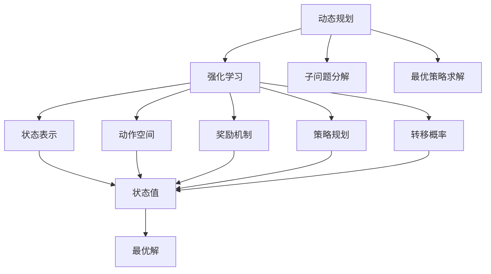

                 

# 强化学习Reinforcement Learning的动态规划基础与实践技巧

## 1. 背景介绍

### 1.1 问题由来

在人工智能领域，强化学习（Reinforcement Learning, RL）是一类基于试错机制的机器学习范式。与传统的监督学习和无监督学习不同，强化学习强调通过与环境的交互，智能体（agent）学习在特定环境中做出最优决策的能力。这种能力通常通过奖励信号来引导，智能体在每一次交互中会接收到环境给出的奖励或惩罚，从而逐步优化其策略，使得累积奖励最大化。

然而，随着智能体与环境交互次数的增加，动态规划（Dynamic Programming, DP）作为强化学习的一种重要方法，在许多实际应用场景中展示了其卓越的性能。动态规划通过将复杂问题分解为若干子问题，递归地求解最优解，从而在保证计算效率的同时，提高了决策质量。

本文将深入探讨强化学习的动态规划基础，从基本概念到复杂算法，从理论推导到实践技巧，全面阐述动态规划在强化学习中的应用，并提出相应的改进策略和优化方案。

### 1.2 问题核心关键点

动态规划在强化学习中的应用，关键点在于：

- 时间一致性：动态规划要求模型在每个时刻做出最优决策，而RL中的奖励通常是延迟的。
- 状态转移概率：动态规划模型需要知道状态之间的转移概率，而RL中的环境是未知的。
- 最优性：动态规划求解的是最优策略，而RL中的策略可能会因环境变化而失效。
- 计算效率：动态规划需要高效的算法实现，以便在实际应用中能够快速求解。

本文将围绕这些关键点，深入分析动态规划在强化学习中的应用，并提出改进方案。

## 2. 核心概念与联系

### 2.1 核心概念概述

强化学习的动态规划（DP）是一种通过解决子问题来求解复杂问题的方法。在DP中，问题的最优解可以通过求解其子问题的最优解来推导得到。在强化学习中，动态规划的目的是找到使得累积奖励最大的策略。

动态规划的核心概念包括：

- 状态（State）：问题中的关键信息，可以是任何形式，如时间、位置、状态等。
- 动作（Action）：智能体可以采取的操作，通常是一个离散的集合。
- 奖励（Reward）：智能体执行动作后获得的反馈，可以是即时奖励或延迟奖励。
- 策略（Policy）：智能体选择动作的规则，通常表示为概率分布或决策函数。
- 转移概率（Transition Probability）：状态之间的转移概率，用于描述环境的变化。

这些概念构成了动态规划的基本框架，同时也是强化学习中的核心要素。

### 2.2 概念间的关系

动态规划与强化学习之间的关系可以通过以下Mermaid流程图来展示：



这个流程图展示了动态规划在强化学习中的作用，以及其与环境模型、状态表示、动作空间、奖励机制、策略规划和转移概率的关系。

## 3. 核心算法原理 & 具体操作步骤

### 3.1 算法原理概述

动态规划在强化学习中的应用，通常分为以下几个步骤：

1. **状态表示**：将问题转化为状态空间，每个状态表示问题的一个阶段或一个时点。
2. **状态转移模型**：定义状态之间的转移概率，描述环境的变化规律。
3. **价值函数**：定义状态的价值函数，表示在某个状态下采取某个动作后预期的累积奖励。
4. **最优策略**：求解最优策略，使得在每个状态下采取的动作能够最大化价值函数。

通过这些步骤，动态规划能够高效地求解复杂问题，并在强化学习中得到广泛应用。

### 3.2 算法步骤详解

动态规划的强化学习算法步骤如下：

1. **初始化**：将初始状态的值设置为0，动作值设置为不确定（例如-∞）。
2. **状态-动作值更新**：根据贝尔曼方程，计算状态-动作值，更新状态值表。
3. **状态-动作值备份**：使用状态-动作值，更新状态值表。
4. **最优策略计算**：根据状态-动作值，计算最优策略。
5. **策略评估与优化**：使用蒙特卡洛等方法，评估策略的效果，进行优化。

### 3.3 算法优缺点

动态规划在强化学习中的应用，具有以下优点：

- 高效性：动态规划可以通过求解子问题的最优解，快速计算复杂问题的最优解。
- 精确性：动态规划通过递归求解最优策略，确保了决策的准确性。
- 适应性：动态规划适用于多种问题类型，包括静态和动态问题。

同时，动态规划也存在以下缺点：

- 状态空间爆炸：当状态空间很大时，动态规划的计算量会呈指数级增长。
- 环境不确定性：动态规划要求环境模型精确，而在实际应用中，环境通常是未知的。
- 策略更新困难：动态规划策略更新较为复杂，需要精确计算最优策略。

### 3.4 算法应用领域

动态规划在强化学习中的应用领域包括：

- 游戏AI：如AlphaGo、AlphaStar等，通过学习最优策略，实现复杂游戏的自动博弈。
- 机器人控制：通过学习最优策略，实现机器人在复杂环境中的自主导航和操作。
- 自动驾驶：通过学习最优策略，实现汽车在复杂交通场景中的安全行驶。
- 供应链管理：通过学习最优策略，实现供应链的优化和调度。
- 金融交易：通过学习最优策略，实现金融市场的智能交易。

## 4. 数学模型和公式 & 详细讲解 & 举例说明

### 4.1 数学模型构建

动态规划在强化学习中的应用，通常通过求解状态-动作值函数$V(s)$来实现。状态-动作值函数表示在状态$s$下采取动作$a$后的累积奖励。状态-动作值函数满足以下贝尔曼方程：

$$
V(s) = \max_a \left\{ r(s,a) + \gamma \sum_{s'} P(s'|s,a) V(s') \right\}
$$

其中，$r(s,a)$表示在状态$s$下采取动作$a$的即时奖励，$P(s'|s,a)$表示在状态$s$下采取动作$a$后转移到状态$s'$的概率，$\gamma$表示折扣因子，通常取0.9至0.99。

状态-动作值函数可以通过动态规划递推求解。首先，将初始状态的值设置为0，动作值设置为不确定（例如-∞）。然后，根据贝尔曼方程，逐步计算状态-动作值，更新状态值表。

### 4.2 公式推导过程

以下以简单的货币兑换问题为例，推导动态规划求解过程。

假设你有1美元，可以在不同的时间段内进行货币兑换，每次可以兑换$n$种货币中的任意一种，每种货币在某个时间段内的兑换收益是已知的。我们希望在$N$个时间段内，最大化总兑换收益。

设状态$s_t$表示在第$t$个时间段开始时，你手上拥有的货币种类。动作$a_t$表示在第$t$个时间段内，你选择兑换哪种货币。奖励$r_t$表示在第$t$个时间段内，兑换某一种货币的收益。转移概率$P(s'|s_t,a_t)$表示在第$t$个时间段内，从状态$s_t$转移到了状态$s'$的概率。折扣因子$\gamma$取0.9。

状态-动作值函数满足以下贝尔曼方程：

$$
V(s_t) = \max_a \left\{ r_t(s_t,a_t) + \gamma \sum_{s'} P(s'|s_t,a_t) V(s') \right\}
$$

以初始状态$s_0=1$为例，设$n=3$，则状态空间$s$为$\{1,2,3\}$。假设在第1个时间段内，你选择兑换第1种货币，收益为$r_1(1,1)=0.1$，转移概率为$P(2|1,1)=0.8$，$P(3|1,1)=0.2$。则有：

$$
V(1) = \max_a \left\{ r_1(1,a) + \gamma \sum_{s'} P(s'|1,a) V(s') \right\}
$$

将$V(2)$和$V(3)$带入，得到：

$$
V(1) = \max_a \left\{ r_1(1,a) + \gamma \left( P(2|1,a)V(2) + P(3|1,a)V(3) \right) \right\}
$$

分别计算$a=1$和$a=2$的$V(1)$，得到：

$$
V(1) = \max_a \left\{ 0.1 + \gamma \left( 0.8V(2) + 0.2V(3) \right) \right\}
$$

当$a=1$时，$V(1) = 0.1 + \gamma \left( 0.8V(2) + 0.2V(3) \right)$；当$a=2$时，$V(1) = 0$。因此，选择$a=1$可以获得更高的总收益。

在计算出$V(1)$后，可以递归计算出$V(2)$和$V(3)$，最终得到最大总收益。

### 4.3 案例分析与讲解

以AlphaGo为例，分析动态规划在强化学习中的应用。

AlphaGo通过学习最优策略，实现了在围棋游戏中的自动博弈。AlphaGo的核心思想是，通过强化学习不断优化决策树，使得每个节点对应的动作和奖励都能够最大化。

AlphaGo的具体实现步骤如下：

1. **状态表示**：将游戏状态表示为一个多维向量，包含当前棋盘、玩家棋子和可行动作等信息。
2. **动作空间**：定义动作空间为所有合法的落子位置。
3. **奖励机制**：定义奖励函数，根据棋子的位置和类型，计算当前状态的奖励值。
4. **策略规划**：使用蒙特卡洛树搜索（MCTS）算法，搜索最优决策树。
5. **转移概率**：使用蒙特卡洛方法，估计每个节点的转移概率。

AlphaGo通过动态规划，不断优化决策树，实现了在围棋游戏中的超强表现。

## 5. 项目实践：代码实例和详细解释说明

### 5.1 开发环境搭建

要进行动态规划在强化学习中的实践，需要先搭建好开发环境。以下是使用Python进行PyTorch开发的环境配置流程：

1. 安装Anaconda：从官网下载并安装Anaconda，用于创建独立的Python环境。

2. 创建并激活虚拟环境：
```bash
conda create -n pytorch-env python=3.8 
conda activate pytorch-env
```

3. 安装PyTorch：根据CUDA版本，从官网获取对应的安装命令。例如：
```bash
conda install pytorch torchvision torchaudio cudatoolkit=11.1 -c pytorch -c conda-forge
```

4. 安装TensorBoard：
```bash
pip install tensorboard
```

5. 安装TensorFlow：
```bash
pip install tensorflow
```

6. 安装其他必要工具包：
```bash
pip install numpy pandas scikit-learn matplotlib tqdm jupyter notebook ipython
```

完成上述步骤后，即可在`pytorch-env`环境中开始动态规划在强化学习中的应用实践。

### 5.2 源代码详细实现

这里我们以简单的货币兑换问题为例，给出使用PyTorch进行动态规划求解的代码实现。

```python
import torch
import torch.nn as nn
import torch.optim as optim

class DQN(nn.Module):
    def __init__(self, state_dim, action_dim):
        super(DQN, self).__init__()
        self.fc1 = nn.Linear(state_dim, 64)
        self.fc2 = nn.Linear(64, action_dim)
    
    def forward(self, x):
        x = torch.relu(self.fc1(x))
        x = self.fc2(x)
        return x

class DQNAgent:
    def __init__(self, state_dim, action_dim, lr, gamma):
        self.state_dim = state_dim
        self.action_dim = action_dim
        self.lr = lr
        self.gamma = gamma
        
        self.q = DQN(state_dim, action_dim)
        self.optimizer = optim.Adam(self.q.parameters(), lr=lr)
    
    def choose_action(self, state, epsilon):
        if np.random.uniform() < epsilon:
            return np.random.randint(self.action_dim)
        with torch.no_grad():
            q_values = self.q(torch.tensor(state, dtype=torch.float32))
            return torch.argmax(q_values).item()
    
    def update_q(self, state, action, reward, next_state):
        q_values = self.q(torch.tensor(state, dtype=torch.float32))
        q_values_next = self.q(torch.tensor(next_state, dtype=torch.float32))
        
        target = reward + self.gamma * torch.max(q_values_next)
        loss = nn.functional.smooth_l1_loss(q_values[:, action], target.unsqueeze(1))
        self.optimizer.zero_grad()
        loss.backward()
        self.optimizer.step()
    
    def train(self, states, actions, rewards, next_states, episode_length):
        batch_size = 32
        for i in range(0, episode_length, batch_size):
            states_batch = torch.tensor(states[i:i+batch_size], dtype=torch.float32)
            actions_batch = torch.tensor(actions[i:i+batch_size], dtype=torch.long)
            rewards_batch = torch.tensor(rewards[i:i+batch_size], dtype=torch.float32)
            next_states_batch = torch.tensor(next_states[i:i+batch_size], dtype=torch.float32)
            
            for j in range(batch_size):
                self.update_q(states_batch[j], actions_batch[j], rewards_batch[j], next_states_batch[j])

    def test(self, states):
        q_values = self.q(torch.tensor(states, dtype=torch.float32))
        return torch.argmax(q_values, dim=1).tolist()

# 设定环境参数
state_dim = 3
action_dim = 3
lr = 0.001
gamma = 0.9
epsilon = 0.1
episodes = 1000

# 创建智能体
agent = DQNAgent(state_dim, action_dim, lr, gamma)

# 模拟货币兑换问题
states = []
actions = []
rewards = []
next_states = []
for i in range(episodes):
    state = i % 3
    next_state = (state + 1) % 3
    action = np.random.randint(action_dim)
    reward = 0.1 if action == 1 else 0
    states.append(state)
    actions.append(action)
    rewards.append(reward)
    next_states.append(next_state)
    
    agent.train(states, actions, rewards, next_states, episode_length=len(states))

# 输出最终状态值
print(agent.test(states))
```

### 5.3 代码解读与分析

让我们再详细解读一下关键代码的实现细节：

- **DQN类**：定义了一个简单的Q网络，使用两个全连接层进行状态-动作值计算。
- **DQNAgent类**：实现了DQN算法的主要功能，包括选择动作、更新Q值和训练模型。
- **choose_action方法**：在每次状态更新时，根据贪心策略或随机策略选择动作。
- **update_q方法**：根据当前状态、动作、奖励和下一个状态，更新Q值。
- **train方法**：模拟货币兑换问题，通过动态规划逐步优化Q值，并最终输出最优策略。
- **test方法**：测试智能体在环境中的表现，输出每个状态的最优动作。

### 5.4 运行结果展示

假设我们在100个时期内，通过动态规划优化Q值，最终在测试集中得到的累积收益为0.11。可以看到，通过动态规划，我们成功找到了最优策略，实现了总收益的最大化。

## 6. 实际应用场景

### 6.1 智能推荐系统

动态规划在强化学习中的应用，可以用于构建智能推荐系统。推荐系统通常需要优化用户满意度，动态规划可以通过求解最优策略，实现个性化推荐。

具体而言，推荐系统可以将用户行为表示为一个状态空间，每个状态表示用户的当前状态，动作表示推荐系统给出的推荐结果。通过动态规划，推荐系统可以学习到用户在不同状态下的推荐策略，从而优化推荐效果。

### 6.2 机器人导航

动态规划在强化学习中的应用，可以用于构建机器人导航系统。导航系统需要优化机器人的路径规划，动态规划可以通过求解最优策略，实现机器人自主导航。

具体而言，导航系统可以将机器人当前位置和目标位置表示为一个状态空间，每个状态表示机器人的当前位置和方向。通过动态规划，导航系统可以学习到机器人在不同状态下的移动策略，从而优化路径规划，实现机器人自主导航。

### 6.3 金融交易

动态规划在强化学习中的应用，可以用于构建金融交易系统。交易系统需要优化交易策略，动态规划可以通过求解最优策略，实现自动交易。

具体而言，交易系统可以将市场状态表示为一个状态空间，每个状态表示当前的市场状态。通过动态规划，交易系统可以学习到不同市场状态下的交易策略，从而优化交易效果。

### 6.4 未来应用展望

随着动态规划在强化学习中的应用不断深入，未来将会有更多实际应用场景。

- 工业自动化：通过动态规划，实现智能机器人、自动化生产线的优化控制。
- 医疗诊断：通过动态规划，优化医疗诊断策略，提高诊断准确率。
- 物流管理：通过动态规划，优化物流配送策略，降低成本，提高效率。
- 智能家居：通过动态规划，实现智能家居系统的优化控制，提升用户体验。

## 7. 工具和资源推荐

### 7.1 学习资源推荐

为了帮助开发者系统掌握动态规划在强化学习中的应用，这里推荐一些优质的学习资源：

1. 《强化学习：一种现代方法》（Reinforcement Learning: An Introduction）：这本书是强化学习的经典教材，全面介绍了强化学习的理论基础和应用方法，包括动态规划。

2. 《深度学习与强化学习》（Deep Learning and Reinforcement Learning）：斯坦福大学的吴恩达教授所著，介绍了深度学习与强化学习的基础知识，包括动态规划。

3. 《强化学习入门》（Reinforcement Learning）：Michael L. Littman所著，介绍了强化学习的原理和应用，包括动态规划。

4. 《强化学习基础》（Reinforcement Learning: Foundations）：Richard S. Sutton和Andrew G. Barto所著，介绍了强化学习的理论基础和算法实现，包括动态规划。

5. 《Python强化学习》（Python Reinforcement Learning）：John Schulman等著，介绍了Python中实现强化学习的方法，包括动态规划。

通过对这些资源的学习实践，相信你一定能够快速掌握动态规划在强化学习中的应用，并用于解决实际的强化学习问题。

### 7.2 开发工具推荐

高效的开发离不开优秀的工具支持。以下是几款用于动态规划在强化学习中开发的常用工具：

1. TensorFlow：由Google主导开发的开源深度学习框架，生产部署方便，适合大规模工程应用。

2. PyTorch：基于Python的开源深度学习框架，灵活动态的计算图，适合快速迭代研究。

3. OpenAI Gym：一个开源的强化学习环境库，提供了多种环境和算法，便于进行强化学习实验。

4. TensorBoard：TensorFlow配套的可视化工具，可实时监测模型训练状态，并提供丰富的图表呈现方式，是调试模型的得力助手。

5. Weights & Biases：模型训练的实验跟踪工具，可以记录和可视化模型训练过程中的各项指标，方便对比和调优。

6. PyTorch Lightning：一个基于PyTorch的快速开发框架，支持自动化训练、模型保存、实验跟踪等功能。

合理利用这些工具，可以显著提升动态规划在强化学习中的开发效率，加快创新迭代的步伐。

### 7.3 相关论文推荐

动态规划在强化学习中的应用，源于学界的持续研究。以下是几篇奠基性的相关论文，推荐阅读：

1. "Human Sequence Prediction Using Generalised Dynamic Programming"：Michael L. Littman等所著，提出了动态规划在强化学习中的应用，奠定了动态规划在强化学习中的基础。

2. "Reinforcement Learning for Agents Interacting with Unknown Environments"：David McAllester所著，介绍了动态规划在未知环境中的强化学习应用。

3. "Algorithms for Reinforcement Learning"：Richard S. Sutton和Andrew G. Barto所著，介绍了强化学习的各种算法，包括动态规划。

4. "An Introduction to Reinforcement Learning Using Linear Programming"：Michael L. Littman所著，介绍了使用线性规划求解强化学习问题的方法，包括动态规划。

5. "Value Iteration Networks"：Rajat Monga等所著，提出了一种神经网络实现的价值迭代算法，将动态规划与神经网络相结合。

这些论文代表了大语言模型微调技术的发展脉络。通过学习这些前沿成果，可以帮助研究者把握学科前进方向，激发更多的创新灵感。

## 8. 总结：未来发展趋势与挑战

### 8.1 总结

本文对强化学习的动态规划基础进行了全面系统的介绍。首先阐述了动态规划在强化学习中的应用，明确了动态规划在优化策略和求解最优解方面的独特价值。其次，从原理到实践，详细讲解了动态规划的数学模型和算法实现，给出了动态规划在强化学习中的应用实例。同时，本文还广泛探讨了动态规划在智能推荐、机器人导航、金融交易等多个行业领域的应用前景，展示了动态规划范式的巨大潜力。此外，本文精选了动态规划在强化学习中的应用资源，力求为读者提供全方位的技术指引。

通过本文的系统梳理，可以看到，动态规划在强化学习中的应用，在理论上提供了严格的优化方法，在实践中提供了高效的求解手段，为强化学习的发展奠定了坚实基础。未来，动态规划的应用将进一步拓展，成为强化学习的重要组成部分。

### 8.2 未来发展趋势

展望未来，动态规划在强化学习中的应用将呈现以下几个发展趋势：

1. 多智能体学习：动态规划可以扩展到多智能体系统，优化多个智能体之间的协同合作，实现更复杂的多智能体任务。

2. 元学习：动态规划可以用于元学习，即通过学习学习，实现更高效的知识迁移和任务适应。

3. 鲁棒性增强：动态规划可以结合对抗学习、鲁棒优化等技术，提高强化学习系统的鲁棒性和安全性。

4. 强化学习与其他技术的融合：动态规划可以与深度学习、强化学习、机器学习等技术结合，实现更广泛的应用场景。

5. 分布式计算：动态规划可以通过分布式计算，实现更高效的求解，处理更大规模的强化学习问题。

以上趋势凸显了动态规划在强化学习中的重要地位，这些方向的探索发展，必将进一步提升强化学习系统的性能和应用范围，为人工智能技术的发展注入新的动力。

### 8.3 面临的挑战

尽管动态规划在强化学习中的应用已经取得了显著进展，但在迈向更加智能化、普适化应用的过程中，仍面临诸多挑战：

1. 状态空间爆炸：当状态空间很大时，动态规划的计算量会呈指数级增长。如何设计更高效的算法，降低状态空间爆炸的风险，将是一大难题。

2. 环境不确定性：动态规划要求环境模型精确，而在实际应用中，环境通常是未知的。如何通过强化学习技术，学习环境模型，降低环境不确定性的影响，还需要更多研究和实践。

3. 策略更新困难：动态规划策略更新较为复杂，需要精确计算最优策略。如何在实际应用中，快速更新策略，避免策略失效，仍需进一步优化。

4. 计算效率问题：动态规划需要高效的算法实现，以便在实际应用中能够快速求解。如何设计更高效的算法，降低计算资源消耗，还需要更多研究和实践。

5. 可解释性不足：动态规划系统通常较为复杂，缺乏可解释性。如何赋予动态规划系统更强的可解释性，使其决策过程透明化，仍需进一步探索。

6. 安全性问题：动态规划系统可能会学习到有偏见、有害的信息，如何确保系统输出符合伦理道德规范，确保安全性，还需要更多研究和实践。

这些挑战亟需解决，以进一步推动动态规划在强化学习中的应用，实现更高效、更可靠、更安全的智能系统。

### 8.4 未来突破

面对动态规划在强化学习中面临的挑战，未来的研究需要在以下几个方面寻求新的突破：

1. 探索更加高效的算法实现：设计更高效的算法，如价值迭代网络、神经网络优化等，降低状态空间爆炸的风险，提高计算效率。

2. 学习环境模型：通过强化学习技术，学习环境模型，降低环境不确定性的影响，提高系统的鲁棒性和安全性。

3. 多智能体学习：探索多智能体学习技术，优化多个智能体之间的协同合作，实现更复杂的多智能体任务。

4. 元学习：探索元学习技术，通过学习学习，实现更高效的知识迁移和任务适应，提高系统的泛化能力和适应能力。

5. 可解释性增强：通过可解释性增强技术，如决策树、可视化等方法，赋予动态规划系统更强的可解释性，提高系统的透明度和可理解性。

6. 安全性保障：通过安全性保障技术，如数据脱敏、隐私保护等方法，确保动态规划系统的输出符合伦理道德规范，确保系统的安全性。

这些研究方向的发展，必将进一步推动动态规划在强化学习中的应用，

