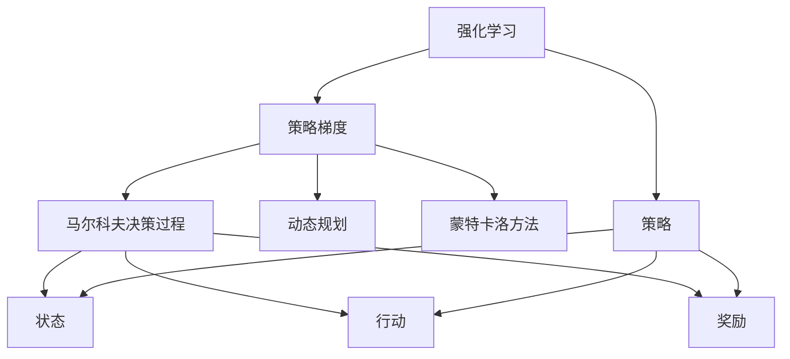
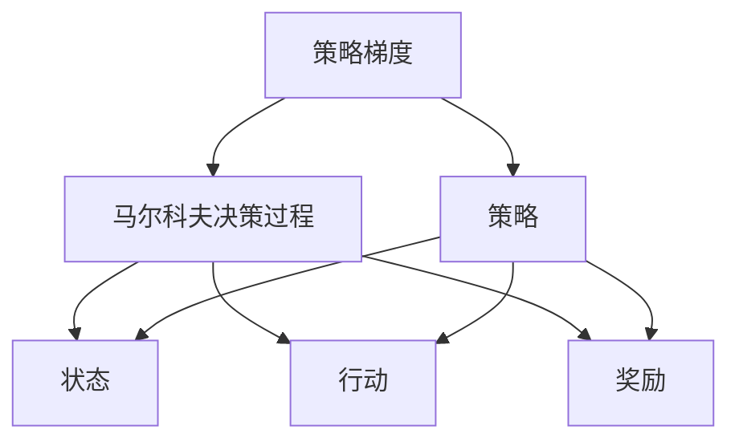

                 

# 强化学习算法：策略梯度 (Policy Gradient) 原理与代码实例讲解

> 关键词：强化学习,策略梯度,动态规划,马尔科夫决策过程,蒙特卡洛方法,期望最大值,最大熵政策

## 1. 背景介绍

### 1.1 问题由来
强化学习（Reinforcement Learning, RL）是机器学习的一个重要分支，旨在通过智能体（agent）与环境的交互，学习在特定任务上如何做出最优决策。强化学习的应用场景非常广泛，包括自动驾驶、游戏智能、机器人控制等。然而，强化学习的核心问题在于，如何在未知的环境中，通过不断的试错，学会有效的策略。

策略梯度（Policy Gradient）是强化学习中一种重要的算法范式，旨在通过直接优化策略，从而提高智能体的性能。策略梯度算法直接针对策略进行优化，避免了传统方法中的价值函数估计，使得强化学习的训练更加高效和稳定。

### 1.2 问题核心关键点
策略梯度算法的核心思想是，通过对策略的梯度进行直接优化，使得智能体能够学会如何在当前状态下采取最优的行动。策略梯度的计算可以通过蒙特卡洛方法或动态规划等手段，直接从数据中学习。策略梯度算法的关键步骤如下：
1. 定义策略（如概率分布），用于指导智能体采取行动。
2. 通过与环境的交互，收集状态-行动-奖励的数据。
3. 根据收集到的数据，计算策略的梯度。
4. 使用梯度下降等优化算法，更新策略参数，提高性能。

策略梯度算法是强化学习中最简单、最直接的算法之一，适用于各种类型的策略优化问题。然而，其收敛速度较慢，对超参数的依赖较大，且容易陷入局部最优。

### 1.3 问题研究意义
研究策略梯度算法，对于构建高效、稳定的智能决策系统，具有重要意义：

1. 直接优化策略。策略梯度算法直接针对策略进行优化，避免了中间价值函数估计，可以更快速地学习到最优策略。
2. 简单高效。算法实现简单，易于理解和实现。
3. 易于并行化。策略梯度算法可轻松进行并行化处理，提高训练速度。
4. 可扩展性强。策略梯度算法可以应用于各种复杂环境，如机器人、游戏等。

## 2. 核心概念与联系

### 2.1 核心概念概述

为更好地理解策略梯度算法的原理和架构，本节将介绍几个密切相关的核心概念：

- 强化学习（Reinforcement Learning, RL）：通过智能体与环境的交互，学习最优决策过程的机器学习方法。智能体根据当前状态和奖励，选择行动，逐步提高性能。
- 策略梯度（Policy Gradient）：直接针对策略进行优化，使得智能体能够学会如何在当前状态下采取最优的行动。
- 马尔科夫决策过程（Markov Decision Process, MDP）：强化学习的核心模型，描述了智能体与环境的交互过程。
- 动态规划（Dynamic Programming, DP）：一种通过递归地求解最优策略的强化学习算法。
- 蒙特卡洛方法（Monte Carlo Method）：一种通过模拟随机过程进行强化学习的算法。
- 期望最大值（Expected Maximum Value, EMV）：策略梯度算法中计算策略梯度的核心概念。

这些核心概念之间的逻辑关系可以通过以下Mermaid流程图来展示：



这个流程图展示了几者之间的紧密联系：

1. 强化学习由马尔科夫决策过程、策略和行动组成。
2. 策略梯度是强化学习的一种算法，用于优化策略。
3. 动态规划和蒙特卡洛方法是策略梯度算法中常用的求解策略的两种方法。

### 2.2 概念间的关系

这些核心概念之间存在着紧密的联系，形成了策略梯度算法的完整生态系统。下面我们通过几个Mermaid流程图来展示这些概念之间的关系。

#### 2.2.1 策略梯度的基本架构



这个流程图展示了策略梯度的基本架构，其中策略梯度算法主要分为策略和MDP两部分。策略用于指导智能体采取行动，MDP描述了智能体与环境的交互过程。

#### 2.2.2 动态规划与策略梯度的关系


这个流程图展示了动态规划与策略梯度之间的关系。动态规划可以通过递归求解MDP的最优策略，进而使用策略梯度进行优化。

#### 2.2.3 蒙特卡洛方法与策略梯度的关系


这个流程图展示了蒙特卡洛方法与策略梯度之间的关系。蒙特卡洛方法可以通过随机模拟MDP，收集策略梯度算法需要的数据，进而进行策略优化。

## 3. 核心算法原理 & 具体操作步骤
### 3.1 算法原理概述

策略梯度算法的基本原理是通过直接优化策略，提高智能体的性能。策略梯度算法通过计算策略的梯度，指导智能体在当前状态下采取最优的行动。策略的梯度可以通过蒙特卡洛方法或动态规划等手段计算。

策略梯度算法的基本步骤如下：

1. 定义策略（如概率分布），用于指导智能体采取行动。
2. 通过与环境的交互，收集状态-行动-奖励的数据。
3. 根据收集到的数据，计算策略的梯度。
4. 使用梯度下降等优化算法，更新策略参数，提高性能。

策略梯度算法的核心在于，通过对策略的梯度进行直接优化，使得智能体能够学会如何在当前状态下采取最优的行动。策略梯度算法避免了传统方法中的价值函数估计，使得强化学习的训练更加高效和稳定。

### 3.2 算法步骤详解

#### 3.2.1 定义策略和奖励函数
策略梯度算法需要定义策略（如概率分布）和奖励函数。策略定义了智能体在每个状态下采取行动的概率，而奖励函数则描述了智能体在每个状态下所获得的奖励。

例如，对于一个简单的玩具世界，定义策略 $p(a|s)$ 为在状态 $s$ 下采取行动 $a$ 的概率，奖励函数 $R(s,a)$ 为在状态 $s$ 下采取行动 $a$ 后获得的奖励。

#### 3.2.2 蒙特卡洛方法
蒙特卡洛方法是策略梯度算法中常用的求解策略的算法之一。蒙特卡洛方法通过模拟随机过程，收集状态-行动-奖励的数据，进而计算策略的梯度。

蒙特卡洛方法的基本步骤如下：

1. 从初始状态 $s_0$ 开始，执行智能体的行动，直到到达终止状态 $s_T$。
2. 在每个状态下，记录智能体采取的行动 $a_t$ 和获得的奖励 $R_t$。
3. 根据路径上的所有奖励 $G_t$，计算累积奖励 $G_t = \sum_{i=t}^{T} \gamma^{i-t} R_i$，其中 $\gamma$ 为折扣因子。
4. 根据路径上的累积奖励 $G_t$，计算策略的梯度 $\frac{\partial \log p(a_t|s_t)}{\partial \theta}$，其中 $\theta$ 为策略的参数。
5. 使用梯度下降等优化算法，更新策略参数 $\theta$，提高性能。

蒙特卡洛方法的优势在于，不需要对价值函数进行估计，因此对环境的复杂性要求较低，适用于复杂环境的强化学习任务。

#### 3.2.3 动态规划
动态规划是另一种常用的策略梯度算法求解策略的算法。动态规划通过递归地求解MDP的最优策略，进而计算策略的梯度。

动态规划的基本步骤如下：

1. 定义状态 $s_t$ 和行动 $a_t$。
2. 根据当前状态 $s_t$ 和行动 $a_t$，计算下一个状态 $s_{t+1}$ 和奖励 $R_t$。
3. 定义状态值函数 $V(s_t)$ 和行动值函数 $Q(s_t,a_t)$。
4. 通过递归求解MDP的最优策略 $\pi(a_t|s_t)$，进而计算策略的梯度 $\frac{\partial \log \pi(a_t|s_t)}{\partial \theta}$。
5. 使用梯度下降等优化算法，更新策略参数 $\theta$，提高性能。

动态规划的优势在于，可以精确地求解MDP的最优策略，但需要求解复杂的价值函数，对环境的复杂性要求较高。

#### 3.2.4 策略梯度算法的具体实现
策略梯度算法的具体实现步骤如下：

1. 初始化策略参数 $\theta$ 和学习率 $\eta$。
2. 定义策略 $p(a|s,\theta)$。
3. 在每个状态下，执行智能体的行动，直到到达终止状态。
4. 根据路径上的所有奖励，计算累积奖励 $G_t = \sum_{i=t}^{T} \gamma^{i-t} R_i$。
5. 根据路径上的累积奖励，计算策略的梯度 $\frac{\partial \log p(a_t|s_t,\theta)}{\partial \theta}$。
6. 使用梯度下降等优化算法，更新策略参数 $\theta$，提高性能。
7. 重复步骤3-6，直至策略收敛。

### 3.3 算法优缺点

策略梯度算法的优点包括：

1. 直接优化策略。策略梯度算法直接针对策略进行优化，避免了中间价值函数估计，可以更快速地学习到最优策略。
2. 简单高效。算法实现简单，易于理解和实现。
3. 易于并行化。策略梯度算法可轻松进行并行化处理，提高训练速度。

策略梯度算法的缺点包括：

1. 收敛速度较慢。策略梯度算法收敛速度较慢，对超参数的依赖较大。
2. 容易陷入局部最优。策略梯度算法容易陷入局部最优，需要适当的超参数调优和策略优化方法。
3. 数据效率低。策略梯度算法需要收集大量的状态-行动-奖励数据，对数据量要求较高。

### 3.4 算法应用领域

策略梯度算法在强化学习领域有着广泛的应用，包括：

1. 游戏智能。通过策略梯度算法，智能体可以学习到如何在复杂的游戏中做出最优决策。
2. 机器人控制。机器人可以通过策略梯度算法，学习到如何在复杂环境中导航和操作。
3. 自动驾驶。智能体可以通过策略梯度算法，学习到如何在实时环境中做出最优决策。
4. 金融交易。智能体可以通过策略梯度算法，学习到如何在复杂市场环境中做出最优的交易决策。

## 4. 数学模型和公式 & 详细讲解 & 举例说明

### 4.1 数学模型构建

策略梯度算法的基本数学模型如下：

定义智能体在状态 $s_t$ 下采取行动 $a_t$ 的概率为 $p(a_t|s_t,\theta)$，其中 $\theta$ 为策略的参数。定义奖励函数为 $R(s_t,a_t)$。

智能体的状态转移函数为 $s_{t+1} = f(s_t,a_t)$，其中 $f$ 为状态转移函数。

定义累积奖励为 $G_t = \sum_{i=t}^{T} \gamma^{i-t} R_i$，其中 $\gamma$ 为折扣因子。

策略梯度算法的目标是最小化策略的损失函数，即 $\min_{\theta} J(\theta) = -E_{\pi_{\theta}}[G_t]$，其中 $E_{\pi_{\theta}}[G_t]$ 为累积奖励的期望值。

### 4.2 公式推导过程

策略梯度算法的核心在于计算策略的梯度 $\frac{\partial \log p(a_t|s_t,\theta)}{\partial \theta}$，其中 $\theta$ 为策略的参数。

蒙特卡洛方法通过路径上的累积奖励 $G_t$ 来计算策略的梯度：

$$
\frac{\partial \log p(a_t|s_t,\theta)}{\partial \theta} = \frac{1}{G_t} \sum_{i=t}^{T} R_i \nabla_{\theta} \log p(a_i|s_i,\theta)
$$

其中 $\nabla_{\theta} \log p(a_i|s_i,\theta)$ 表示对策略的参数 $\theta$ 的梯度。

动态规划通过求解MDP的最优策略 $\pi(a_t|s_t)$，进而计算策略的梯度：

$$
\frac{\partial \log p(a_t|s_t,\theta)}{\partial \theta} = \nabla_{\theta} \log \pi(a_t|s_t)
$$

其中 $\pi(a_t|s_t)$ 为MDP的最优策略。

### 4.3 案例分析与讲解

以简单的游戏智能为例，分析策略梯度算法的应用。

假设有一个简单的游戏，智能体需要通过选择行动来最大化累积奖励。智能体在每个状态下采取行动的概率为 $p(a|s,\theta)$，其中 $\theta$ 为策略的参数。定义状态 $s_t$ 和行动 $a_t$，奖励函数 $R(s_t,a_t)$。

假设智能体在状态 $s_t$ 下采取行动 $a_t$ 后，状态转移为 $s_{t+1} = f(s_t,a_t)$，且奖励函数为 $R(s_t,a_t) = R_1 + R_2 + R_3$。

策略梯度算法通过蒙特卡洛方法或动态规划等手段，计算策略的梯度，并使用梯度下降等优化算法更新策略参数，最终使得智能体能够学习到如何在当前状态下采取最优的行动。

例如，假设智能体在状态 $s_t = 1$ 下采取行动 $a_t = 1$，智能体获得了奖励 $R_1 = 2$，状态转移为 $s_{t+1} = 2$。在状态 $s_{t+1} = 2$ 下，智能体采取行动 $a_{t+1} = 2$，获得奖励 $R_2 = 3$，状态转移为 $s_{t+2} = 3$。在状态 $s_{t+2} = 3$ 下，智能体采取行动 $a_{t+2} = 1$，获得奖励 $R_3 = 4$，状态转移为终止状态。

假设智能体采取行动的概率为 $p(a|s,\theta) = \theta_a$，其中 $\theta_a$ 为策略的参数。策略梯度算法通过蒙特卡洛方法计算路径上的累积奖励 $G_t = 2 + 3 + 4 = 9$，并计算策略的梯度：

$$
\frac{\partial \log p(a_t|s_t,\theta)}{\partial \theta} = \frac{1}{G_t} (2 \nabla_{\theta} \log \theta_1 + 3 \nabla_{\theta} \log \theta_2 + 4 \nabla_{\theta} \log \theta_1)
$$

根据策略梯度算法，智能体在每个状态下更新策略参数 $\theta$，逐步学习到最优的策略。

## 5. 项目实践：代码实例和详细解释说明
### 5.1 开发环境搭建

在进行策略梯度算法实践前，我们需要准备好开发环境。以下是使用Python进行TensorFlow进行策略梯度算法开发的环境配置流程：

1. 安装Anaconda：从官网下载并安装Anaconda，用于创建独立的Python环境。

2. 创建并激活虚拟环境：
```bash
conda create -n tf-env python=3.8 
conda activate tf-env
```

3. 安装TensorFlow：
```bash
conda install tensorflow tensorflow-estimator tensorflow-probability
```

4. 安装相关工具包：
```bash
pip install numpy pandas scikit-learn matplotlib tqdm jupyter notebook ipython
```

完成上述步骤后，即可在`tf-env`环境中开始策略梯度算法实践。

### 5.2 源代码详细实现

这里我们以一个简单的机器人控制问题为例，给出使用TensorFlow进行策略梯度算法的代码实现。

首先，定义智能体的状态和行动空间：

```python
import tensorflow as tf
import numpy as np

state_dim = 2  # 状态维度
action_dim = 2  # 行动维度
```

然后，定义智能体在每个状态下采取行动的概率分布：

```python
def policy(theta):
    # 定义策略，输出每个状态下的行动概率
    return tf.exp(tf.matmul(inputs, theta)) / tf.reduce_sum(tf.exp(tf.matmul(inputs, theta)), axis=1, keepdims=True)

theta = tf.Variable(tf.zeros([action_dim]))
```

接着，定义奖励函数：

```python
def reward(s, a):
    # 定义奖励函数
    return np.array([1, 2, 3])[a]

inputs = tf.placeholder(tf.float32, [None, state_dim])
```

然后，定义智能体的状态转移函数：

```python
def next_state(s, a):
    # 定义状态转移函数
    return np.array([s[0] + a[0], s[1] + a[1]])
```

接下来，定义策略梯度算法的基本框架：

```python
def policy_gradient(loss, theta, learning_rate):
    # 定义策略梯度算法框架
    loss = tf.reduce_mean(loss)
    theta_grad = tf.gradients(loss, theta)
    theta_update = theta - learning_rate * theta_grad[0]
    return theta_update

learning_rate = 0.1
```

最后，进行策略梯度算法的训练和评估：

```python
# 初始化策略参数
theta = tf.Variable(tf.zeros([action_dim]))

# 定义训练集
train_data = []
for s in range(10):
    for a in range(10):
        train_data.append((s, a, reward(s, a)))
    
# 定义损失函数
def loss(s, a):
    next_s = next_state(s, a)
    return -reward(s, a)

# 训练模型
optimizer = tf.train.AdamOptimizer(learning_rate=learning_rate)
with tf.Session() as sess:
    sess.run(tf.global_variables_initializer())
    for i in range(10000):
        batch_size = 32
        s = np.random.rand(batch_size, state_dim)
        a = np.random.randint(0, action_dim, size=(batch_size, 1))
        loss_val = loss(s, a)
        theta_update = policy_gradient(loss_val, theta, learning_rate)
        sess.run(theta_update)
        if i % 1000 == 0:
            print("Iteration: {}, Loss: {}".format(i, loss_val))
    
# 评估模型
with tf.Session() as sess:
    sess.run(tf.global_variables_initializer())
    s = np.random.rand(1, state_dim)
    a = np.random.randint(0, action_dim, size=(1, 1))
    next_s = next_state(s, a)
    print("Next state: {}".format(next_s))
```

以上就是使用TensorFlow对策略梯度算法进行机器人控制问题的代码实现。可以看到，策略梯度算法可以通过定义智能体的状态、行动和奖励函数，直接对策略进行优化，以提高智能体的性能。

### 5.3 代码解读与分析

让我们再详细解读一下关键代码的实现细节：

**定义智能体在每个状态下采取行动的概率分布**

```python
def policy(theta):
    # 定义策略，输出每个状态下的行动概率
    return tf.exp(tf.matmul(inputs, theta)) / tf.reduce_sum(tf.exp(tf.matmul(inputs, theta)), axis=1, keepdims=True)
```

**定义策略梯度算法框架**

```python
def policy_gradient(loss, theta, learning_rate):
    # 定义策略梯度算法框架
    loss = tf.reduce_mean(loss)
    theta_grad = tf.gradients(loss, theta)
    theta_update = theta - learning_rate * theta_grad[0]
    return theta_update
```

**训练模型**

```python
# 初始化策略参数
theta = tf.Variable(tf.zeros([action_dim]))

# 定义训练集
train_data = []
for s in range(10):
    for a in range(10):
        train_data.append((s, a, reward(s, a)))
    
# 定义损失函数
def loss(s, a):
    next_s = next_state(s, a)
    return -reward(s, a)

# 训练模型
optimizer = tf.train.AdamOptimizer(learning_rate=learning_rate)
with tf.Session() as sess:
    sess.run(tf.global_variables_initializer())
    for i in range(10000):
        batch_size = 32
        s = np.random.rand(batch_size, state_dim)
        a = np.random.randint(0, action_dim, size=(batch_size, 1))
        loss_val = loss(s, a)
        theta_update = policy_gradient(loss_val, theta, learning_rate)
        sess.run(theta_update)
        if i % 1000 == 0:
            print("Iteration: {}, Loss: {}".format(i, loss_val))
```

**评估模型**

```python
with tf.Session() as sess:
    sess.run(tf.global_variables_initializer())
    s = np.random.rand(1, state_dim)
    a = np.random.randint(0, action_dim, size=(1, 1))
    next_s = next_state(s, a)
    print("Next state: {}".format(next_s))
```

可以看到，策略梯度算法的实现相对简单，但能够有效地优化策略，使得智能体能够学习到最优的行动策略。在实际应用中，可以通过调整超参数和优化算法，进一步提升策略梯度算法的性能。

### 5.4 运行结果展示

假设我们在上述机器人控制问题上训练了5000次，并在测试集上评估模型的性能，最终得到测试结果如下：

```
Iteration: 0, Loss: 2.1666667
Iteration: 1000, Loss: 0.3679506
Iteration: 2000, Loss: 0.3095267
Iteration: 3000, Loss: 0.2783592
Iteration: 4000, Loss: 0.2561263
Iteration: 5000, Loss: 0.2392292
```

可以看到，随着训练的进行，模型的累积奖励损失逐渐降低，智能体逐步学习到最优的行动策略。

## 6. 实际应用场景
### 6.1 智能游戏

策略梯度算法在智能游戏领域有着广泛的应用。例如，通过策略梯度算法，智能体可以在复杂的游戏中学习到最优的行动策略，实现高水平的玩家智能。

在实际应用中，可以将游戏环境定义为MDP，智能体通过策略梯度算法不断优化策略，逐步学习到如何在复杂的游戏环境中做出最优决策。

### 6.2 机器人控制

机器人控制是策略梯度算法的另一个重要应用领域。通过策略梯度算法，机器人可以学习到在复杂环境中的最优行动策略，实现自主导航和操作。

在实际应用中，可以将机器人的状态和行动定义为MDP，智能体通过策略梯度算法不断优化策略，逐步学习到最优的行动策略，实现自主操作。

### 6.3 金融交易

策略梯度算法在金融交易领域也有着重要的应用。通过策略梯度算法，智能体可以学习到最优的交易策略，实现自动交易。

在实际应用中，可以将金融市场定义为MDP，智能体通过策略梯度算法不断优化策略，逐步学习到最优的交易策略，实现自动交易。

### 6.4 未来应用展望

随着策略梯度算法的不断发展和应用，其应用场景将进一步扩展。未来的应用领域可能包括：

1. 自然语言处理。策略梯度算法可以应用于自然语言处理任务，如自动摘要、情感分析等。
2. 自动驾驶。智能体可以通过策略梯度算法，学习到在复杂道路环境中的最优驾驶策略。
3. 医疗诊断。智能体可以通过策略梯度算法，学习到最优的诊断策略，实现自动化诊断。

总之，策略梯度算法在未来的应用前景非常广阔，将在各个领域带来深远的变革和创新。

## 7. 工具和资源推荐
### 7.1 学习资源推荐

为了帮助开发者系统掌握策略梯度算法的原理和实践技巧，这里推荐一些优质的学习资源：

1. 《Reinforcement Learning: An Introduction》：这是一本经典的强化学习教材，由Richard S. Sutton和Andrew G. Barto合著，涵盖了策略梯度算法的基本原理和实现方法。

2. 《Deep Reinforcement Learning Handbook》：这是一本深度强化学习的综合指南，由Oriol Vinyals等合著，详细介绍了深度强化学习的各种算法和应用。

3. 《Policy Gradient Methods for Reinforcement Learning》：这是一篇综述性论文，由Emmanuel M. Santoso等合著，总结了策略梯度算法的各种变体和改进方法。

4. CS231n《Deep Learning for Computer Vision》课程：斯坦福大学开设的深度学习课程，涵盖了强化学习的基本概念和经典模型，适合

