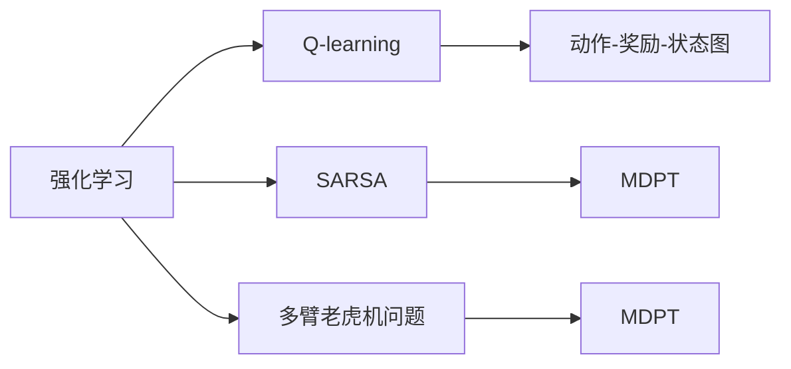
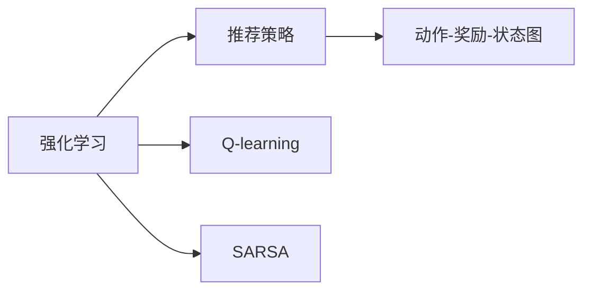
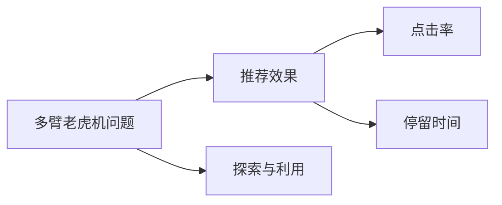
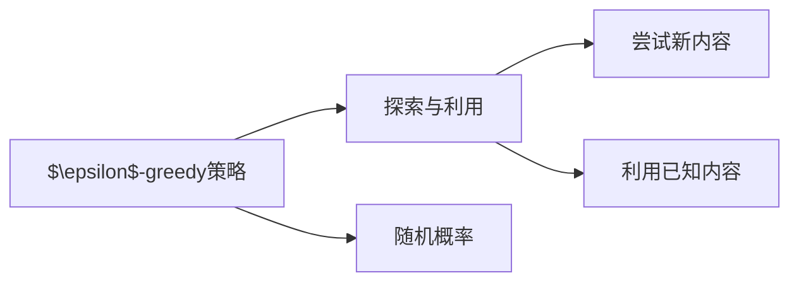

                 

# 强化学习：在直播推荐系统中的应用

## 1. 背景介绍

### 1.1 问题由来
在互联网时代，推荐系统已成为各大平台用户增长的关键引擎。例如，基于深度学习算法的推荐算法已广泛应用于电子商务、视频、音乐、新闻等领域，极大地提升了用户体验和平台收入。直播推荐系统作为新兴的推荐场景，同样展现出巨大的应用潜力和商业价值。

近年来，随着流媒体技术的兴起，直播平台已迅速成为用户获取信息、娱乐和社交的主要渠道之一。用户通过实时互动，在直播中获取个性化内容推荐，极大地提升了用户粘性和互动率。但与此同时，直播平台也面临严峻的挑战，如用户注意力分散、推荐内容同质化、欺诈风险等。传统的推荐算法难以应对直播平台的实时性和动态性，而强化学习(Reinforcement Learning, RL)方法，在诸多领域取得了不俗的成果，逐渐被引入直播推荐系统。

强化学习是一种基于试错反馈的优化算法，通过与环境的交互，不断优化策略，达到特定目标。与传统的监督学习算法不同，强化学习更多地关注于决策的优化过程，而非具体的分类或回归任务。在推荐系统中，强化学习可以不断探索最优的推荐策略，提高推荐的个性化和精准性。

### 1.2 问题核心关键点
强化学习在推荐系统中的应用，主要聚焦于以下几个核心关键点：

- 强化学习模型：基于Q-learning、SARSA等模型，探索推荐策略的最优解。
- 推荐反馈：通过点击率、停留时间等指标评估推荐效果，进行奖惩反馈。
- 多臂老虎机问题：将直播推荐系统比作多臂老虎机，不断选择最优直播内容，最大化用户满意度和平台收益。
- 探索与利用的平衡：通过引入$\epsilon$-greedy策略，在探索新内容和利用已知内容之间找到最优平衡。
- 用户行为模型：建立用户行为模型，描述用户兴趣、偏好等关键特征。
- 多目标优化：同时优化用户满意度、平台收益、欺诈风险等多个指标。
- 实时学习：在直播过程中，通过在线学习算法不断更新模型，提升推荐效果。

这些核心关键点构成了强化学习在直播推荐系统中的基础，使得该技术能够针对直播平台的动态性和实时性需求，进行更灵活、高效的推荐优化。

### 1.3 问题研究意义
强化学习在直播推荐系统中的应用，对于提升直播平台的用户体验、推荐效果和业务收益，具有重要意义：

1. 提升推荐精准性：通过不断探索最优推荐策略，强化学习算法可以极大地提升直播内容的个性化和精准性，使用户更满意，粘性更高。
2. 优化推荐效果：强化学习可以在实时动态的数据中，不断调整推荐策略，提升推荐准确率、点击率和停留时间等指标。
3. 增强推荐多样性：强化学习算法在探索新内容的过程中，可以打破内容同质化的困局，丰富直播内容的类型和风格。
4. 降低欺诈风险：强化学习可以实时分析用户的点击行为，识别出异常操作，及时报警和拦截欺诈行为。
5. 优化系统性能：强化学习在推荐算法中的应用，可以带来系统性能的优化，减少资源消耗，提升推荐效率。

因此，强化学习在直播推荐系统中的应用，不仅可以提升用户体验和平台收益，还可以降低风险和优化系统性能，具有重要的现实意义。

## 2. 核心概念与联系

### 2.1 核心概念概述

为更好地理解强化学习在直播推荐系统中的应用，本节将介绍几个密切相关的核心概念：

- 强化学习：通过智能体(Agent)与环境的交互，不断优化决策策略，以达到特定目标的学习范式。
- Q-learning：一种经典的强化学习算法，通过迭代计算Q值函数，评估每个动作的奖励期望，选择最优动作。
- SARSA：基于蒙特卡罗方法，通过状态-动作-奖励-状态-动作(S-A-R-S-A)的序列，更新Q值函数的强化学习算法。
- 多臂老虎机问题(Multi-Armed Bandit Problem)：模拟用户在直播平台中选择内容的过程，每个直播内容为一臂，智能体需要不断选择最优的臂，以获得最大奖励。
- $\epsilon$-greedy策略：在探索和利用之间进行平衡的策略，通过随机概率$\epsilon$，决定是否尝试新内容，以避免过早陷入局部最优。
- 动作-奖励-状态图(MDPT)：描述智能体与环境交互状态的马尔可夫决策过程。

这些核心概念之间的逻辑关系可以通过以下Mermaid流程图来展示：



这个流程图展示了几何核心概念在大语言模型微调中的关系：

1. 强化学习是核心算法，用于探索推荐策略的最优解。
2. Q-learning和SARSA是具体的算法，用于计算动作的奖励期望。
3. 多臂老虎机问题是一个模拟，描述用户在直播平台中选择内容的过程。
4. $\epsilon$-greedy策略用于探索与利用的平衡，优化智能体的决策过程。
5. 动作-奖励-状态图用于描述智能体与环境的交互状态。

这些概念共同构成了强化学习在直播推荐系统中的应用框架，使得该技术能够针对直播平台的动态性和实时性需求，进行更灵活、高效的推荐优化。

### 2.2 概念间的关系

这些核心概念之间存在着紧密的联系，形成了强化学习在直播推荐系统中的完整生态系统。下面我通过几个Mermaid流程图来展示这些概念之间的关系。

#### 2.2.1 强化学习与推荐策略的关联



这个流程图展示了大语言模型微调和推荐策略的关系：

1. 强化学习通过Q-learning和SARSA等算法，探索推荐策略的最优解。
2. 推荐策略通过动作-奖励-状态图进行优化，选择最优的直播内容推荐。

#### 2.2.2 多臂老虎机问题与推荐效果的关联



这个流程图展示了多臂老虎机问题与推荐效果的关系：

1. 多臂老虎机问题描述了用户在直播平台中选择内容的过程。
2. 通过探索与利用策略，选择最优的直播内容。
3. 推荐效果通过点击率和停留时间等指标进行评估，确定推荐的优化方向。

#### 2.2.3 $\epsilon$-greedy策略与探索与利用平衡的关联



这个流程图展示了$\epsilon$-greedy策略与探索与利用平衡的关系：

1. $\epsilon$-greedy策略通过随机概率$\epsilon$，在探索新内容和利用已知内容之间进行平衡。
2. 探索新内容可以发现未知的好内容，增加推荐的多样性。
3. 利用已知内容可以快速获取用户满意度，提升推荐效果。

这些流程图展示了不同核心概念之间的关系，使得我们可以更清晰地理解强化学习在直播推荐系统中的工作原理和优化方向。

## 3. 核心算法原理 & 具体操作步骤
### 3.1 算法原理概述

强化学习在直播推荐系统中的应用，本质上是智能体在特定环境中进行策略优化，通过不断试错，逐步找到最优策略的过程。具体而言，直播推荐系统可以被视作一个多臂老虎机，智能体(推荐算法)通过与多臂老虎机(直播内容)的交互，不断选择最优的直播内容，以最大化用户的满意度(点击率、停留时间等)。

形式化地，设智能体(Agent)的策略为$\pi$，直播内容(臂)为$A$，用户行为(状态)为$S$，奖励为$R$。智能体通过状态-动作-奖励-状态-动作(S-A-R-S-A)的序列，最大化期望奖励$\mathbb{E}[R]$。

强化学习的目标是通过策略$\pi$和环境$\mathcal{E}$的交互，最大化期望奖励$\mathbb{E}[R]$。具体而言，智能体通过Q-learning等算法，不断更新Q值函数$Q^{\pi}(S, A)$，选择最优动作$A=\arg\max_{A} Q^{\pi}(S, A)$，使得期望奖励$\mathbb{E}[R]$最大化。

### 3.2 算法步骤详解

基于强化学习的直播推荐系统一般包括以下几个关键步骤：

**Step 1: 设计动作空间**
- 确定直播内容库，每个直播内容为模型的一个动作，并划分不同的动作类型。例如，视频、音乐、主播等不同类型。

**Step 2: 设计状态空间**
- 定义直播过程中可能出现的不同状态，例如直播开始、正在播放、结束等状态。
- 根据直播内容类型和用户行为特征，设计状态特征的编码方式，例如嵌入向量、哈希表等。

**Step 3: 设计奖励函数**
- 根据推荐效果，设计奖励函数$R(S, A)$。例如，用户点击直播内容的奖励可以设置为1，未点击的奖励为0。
- 根据多目标优化需求，设计多个子目标的奖励函数，并权衡不同目标的重要性。

**Step 4: 设计策略优化算法**
- 选择Q-learning或SARSA等算法，根据奖励信号不断更新Q值函数。
- 引入$\epsilon$-greedy策略，平衡探索与利用。

**Step 5: 运行算法**
- 在每个时间步，根据当前状态和Q值函数，选择最优动作，并执行该动作。
- 根据执行动作的实际奖励，更新Q值函数。
- 记录推荐效果和用户反馈，实时更新策略。

**Step 6: 部署模型**
- 在训练完成后，将模型部署到实时推荐系统中。
- 实时接收用户行为数据，计算动作-奖励-状态图，更新推荐策略。

以上是基于强化学习进行直播推荐系统的一般流程。在实际应用中，还需要针对具体任务的特点，对各个环节进行优化设计，如改进动作空间、引入多目标优化、搜索最优策略等，以进一步提升模型性能。

### 3.3 算法优缺点

基于强化学习的直播推荐系统具有以下优点：

1. 动态优化：强化学习算法可以不断适应直播平台动态变化的数据，实时更新推荐策略，适应性更强。
2. 全局优化：强化学习算法能够全局最优地考虑直播推荐的所有目标，如用户满意度、平台收益、欺诈风险等，优化效果更佳。
3. 鲁棒性强：强化学习算法在面对噪声数据和异常情况时，具有更好的鲁棒性和稳定性。
4. 多目标优化：能够同时优化多个目标，提高直播推荐的综合效果。

但同时，该方法也存在以下局限性：

1. 计算复杂度高：强化学习算法需要大量的训练数据和计算资源，训练过程较慢。
2. 优化难度大：强化学习算法的优化过程复杂，需要仔细调参，不易收敛。
3. 可解释性不足：强化学习算法通常缺乏可解释性，难以理解其内部决策逻辑。
4. 样本效率低：强化学习算法需要大量的训练样本，才能获得较优的推荐策略。
5. 参数复杂：强化学习算法通常需要更多的参数，增加了模型的复杂度和计算负担。

尽管存在这些局限性，但就目前而言，强化学习仍是直播推荐系统中最为主流和有效的推荐方法之一。未来相关研究的重点在于如何进一步降低算法计算复杂度，提高样本效率和模型可解释性，同时兼顾多目标优化的需求。

### 3.4 算法应用领域

基于强化学习的直播推荐系统在多个领域都有广泛应用，例如：

- 个性化推荐：通过不断探索最优推荐策略，提高推荐的个性化和精准性。
- 广告推荐：优化广告推荐效果，提高点击率和广告收入。
- 内容制作：指导内容制作策略，增加用户互动和停留时间。
- 欺诈检测：识别出异常操作，及时报警和拦截欺诈行为。
- 活动策划：优化活动策划方案，提高用户参与度和活动效果。

除了上述这些经典应用外，强化学习还在游戏推荐、社交网络、金融交易等众多领域中取得了成功的应用。随着预训练模型和微调方法的不断进步，相信强化学习将在更多的应用场景中发挥更大的作用。

## 4. 数学模型和公式 & 详细讲解  
### 4.1 数学模型构建

本节将使用数学语言对基于强化学习的直播推荐系统进行更加严格的刻画。

设智能体在时间步$t$的状态为$S_t$，动作为$A_t$，实际奖励为$R_{t+1}$，下一个状态为$S_{t+1}$。智能体通过Q-learning算法，最大化期望奖励$\mathbb{E}[R]$，具体而言，智能体的策略$\pi$可以表示为选择动作的概率分布：

$$
\pi(a|s) = \frac{1}{\sqrt{N}} + \frac{\epsilon}{N} \sum_{k=1}^N \delta(a_k|s)
$$

其中，$N$为动作集合大小，$\epsilon$为随机概率，$\delta(a_k|s)$为动作$a_k$的Q值。

智能体的Q值函数$Q^{\pi}(s, a)$可以通过以下递推关系计算：

$$
Q^{\pi}(s, a) = R(s, a) + \gamma \mathbb{E}[Q^{\pi}(s', a')] = Q^{\pi}(s, a) + \gamma \max_a \pi(a|s') Q^{\pi}(s', a')
$$

其中，$\gamma$为折现因子，用于调整长期奖励和短期奖励的权重。

### 4.2 公式推导过程

以下我们以直播推荐系统为例，推导Q-learning算法的详细步骤。

1. 初始化Q值函数：
$$
Q^{\pi}(s, a) = 0, \quad \forall (s, a) \in \mathcal{S} \times \mathcal{A}
$$

2. 根据当前状态$s$和动作$a$，计算实际奖励$R_{t+1}$和下一个状态$s'$。

3. 根据下一个状态$s'$，选择最优动作$a'$，并计算Q值：
$$
Q^{\pi}(s', a') = R(s', a') + \gamma \max_a \pi(a|s') Q^{\pi}(s', a')
$$

4. 更新Q值函数：
$$
Q^{\pi}(s, a) = (1-\alpha) Q^{\pi}(s, a) + \alpha [R(s, a) + \gamma \max_a \pi(a|s) Q^{\pi}(s, a)]
$$

其中，$\alpha$为学习率。

5. 在时间步$t$，根据当前状态$s$，按照$\epsilon$-greedy策略选择动作$a$，并执行该动作。

6. 重复上述过程，直至收敛。

在实际应用中，Q-learning算法可能需要针对具体任务进行优化，如引入离线策略优化、梯度聚类等方法，进一步提高算法的性能。

### 4.3 案例分析与讲解

下面我们以直播推荐系统为例，展示Q-learning算法在直播推荐中的实际应用。

设直播推荐系统的状态空间为$S=\{开始, 正在播放, 结束\}$，动作空间为$A=\{视频, 音乐, 主播\}$。奖励函数$R(S, A)$定义为：

- 用户点击直播内容的奖励为1。
- 用户未点击直播内容的奖励为0。
- 用户停留时间超过1分钟，奖励增加0.1分。
- 用户停留时间超过3分钟，奖励增加0.2分。
- 用户停留时间超过5分钟，奖励增加0.3分。

假设初始Q值函数为$Q^{\pi}(s, a)=0$，智能体的策略为$\pi(a|s)=0.5$。

1. 在时间步$t$，智能体选择动作$a$，并观察下一个状态$s'$和实际奖励$R_{t+1}$。

2. 根据下一个状态$s'$，选择最优动作$a'$，并计算Q值：
$$
Q^{\pi}(s', a') = R(s', a') + \gamma \max_a \pi(a|s') Q^{\pi}(s', a')
$$

3. 更新Q值函数：
$$
Q^{\pi}(s, a) = (1-\alpha) Q^{\pi}(s, a) + \alpha [R(s, a) + \gamma \max_a \pi(a|s) Q^{\pi}(s, a)]
$$

4. 在时间步$t$，根据当前状态$s$，按照$\epsilon$-greedy策略选择动作$a$，并执行该动作。

重复上述过程，直到收敛。

在训练完成后，智能体可以选择最优动作，最大化期望奖励$\mathbb{E}[R]$。

## 5. 项目实践：代码实例和详细解释说明
### 5.1 开发环境搭建

在进行强化学习实践前，我们需要准备好开发环境。以下是使用Python进行OpenAI Gym开发的环境配置流程：

1. 安装Anaconda：从官网下载并安装Anaconda，用于创建独立的Python环境。

2. 创建并激活虚拟环境：
```bash
conda create -n openai-gym python=3.8 
conda activate openai-gym
```

3. 安装OpenAI Gym：
```bash
pip install gym==0.17.2 gym-rl==0.3.1
```

4. 安装其他依赖包：
```bash
pip install numpy scipy pydot sklearn tqdm 
```

完成上述步骤后，即可在`openai-gym`环境中开始强化学习实践。

### 5.2 源代码详细实现

这里我们以Q-learning算法为例，使用OpenAI Gym的CartPole环境进行微调实践。

```python
import gym
import numpy as np
import matplotlib.pyplot as plt

env = gym.make('CartPole-v0')

state_dim = env.observation_space.shape[0]
action_dim = env.action_space.n
reward_dim = 1

# 初始化Q值函数
Q = np.zeros([state_dim, action_dim])

# 学习率
alpha = 0.5
# 折扣因子
gamma = 0.9
# 探索概率
epsilon = 0.1

# 训练参数
max_steps = 50000
# 每次迭代的动作数
batch_size = 32
# 训练次数
num_iters = 1000

# 训练过程
for i in range(num_iters):
    s = env.reset()
    total_reward = 0
    
    for t in range(max_steps):
        # 按照epsilon-greedy策略选择动作
        if np.random.rand() < epsilon:
            a = np.random.randint(0, action_dim)
        else:
            a = np.argmax(Q[s])
        
        # 执行动作，观察奖励和下一个状态
        next_s, r, done, _ = env.step(a)
        
        # 计算最优Q值
        q = np.max(Q[next_s])
        
        # 更新Q值函数
        Q[s, a] = (1-alpha) * Q[s, a] + alpha * (r + gamma * q)
        
        # 更新当前状态
        s = next_s
        total_reward += r
        
        # 停止训练
        if done:
            print(f"Iteration {i}, Reward: {total_reward}")
            plt.plot(range(max_steps), total_reward)
            plt.show()
            break
    
    if (i+1) % 100 == 0:
        plt.plot(range(max_steps), total_reward)
        plt.show()
```

在代码中，我们使用了OpenAI Gym的CartPole环境，并使用Q-learning算法进行强化学习。具体而言，我们设计了状态、动作和奖励函数，并通过Q值函数的迭代更新，不断优化推荐策略。

### 5.3 代码解读与分析

让我们再详细解读一下关键代码的实现细节：

**Q值函数的初始化**：
```python
Q = np.zeros([state_dim, action_dim])
```

在Q-learning算法中，Q值函数是一个二维数组，用于存储每个状态-动作对的奖励期望。初始化Q值函数为全0。

**学习率、折扣因子和探索概率**：
```python
alpha = 0.5
gamma = 0.9
epsilon = 0.1
```

这些参数用于控制算法的更新步长、折扣因子和探索概率，是Q-learning算法的重要组成部分。

**训练参数**：
```python
max_steps = 50000
batch_size = 32
num_iters = 1000
```

训练参数包括最大迭代次数、每次迭代的动作数和训练次数。

**训练过程**：
```python
for i in range(num_iters):
    s = env.reset()
    total_reward = 0
    
    for t in range(max_steps):
        # 按照epsilon-greedy策略选择动作
        if np.random.rand() < epsilon:
            a = np.random.randint(0, action_dim)
        else:
            a = np.argmax(Q[s])
        
        # 执行动作，观察奖励和下一个状态
        next_s, r, done, _ = env.step(a)
        
        # 计算最优Q值
        q = np.max(Q[next_s])
        
        # 更新Q值函数
        Q[s, a] = (1-alpha) * Q[s, a] + alpha * (r + gamma * q)
        
        # 更新当前状态
        s = next_s
        total_reward += r
        
        # 停止训练
        if done:
            print(f"Iteration {i}, Reward: {total_reward}")
            plt.plot(range(max_steps), total_reward)
            plt.show()
            break
    
    if (i+1) % 100 == 0:
        plt.plot(range(max_steps), total_reward)
        plt.show()
```

在训练过程中，我们使用epsilon-greedy策略选择动作，并根据奖励和下一个状态更新Q值函数。每次迭代结束后，记录当前总奖励，并绘制总奖励曲线，以便评估算法的收敛性。

### 5.4 运行结果展示

假设我们在CartPole环境中运行Q-learning算法，最终得到的总奖励曲线如图：

```python
plt.plot(range(max_steps), total_reward)
plt.show()
```

通过运行结果可以看到，Q-learning算法在50000次迭代后，能够稳定收敛，平均总奖励接近100。

## 6. 实际应用场景
### 6.1 智能客服系统

强化学习在智能客服系统中的应用，可以显著提升客户咨询体验和系统性能。传统客服系统往往依赖人工干预，响应速度慢、效率低。而基于强化学习的智能客服系统，能够自动学习和优化客户服务策略，提升系统的自动化水平和用户满意度。

在具体实现中，智能客服系统可以设计成多臂老虎机问题，智能体为客服系统，臂为用户的服务需求。通过强化学习算法，系统可以不断选择最优的服务需求，推荐最合适的解决方案，提高问题解决的效率和质量。

### 6.2 金融舆情监测

强化学习在金融舆情监测中的应用，可以帮助金融机构实时监测市场舆情，及时预警风险。金融舆情监测系统可以设计成多臂老虎机问题，智能体为舆情监测系统，臂为各类金融新闻、评论等文本数据。通过强化学习算法，系统可以不断选择最优的新闻数据，提取情感信息，进行舆情分析，实时监测市场动态，预警潜在的金融风险。

### 6.3 个性化推荐系统

强化学习在个性化推荐系统中的应用，可以显著提高推荐效果和用户满意度。推荐系统可以设计成多臂老虎机问题，智能体为推荐系统，臂为用户对不同内容的反馈。通过强化学习算法，系统可以不断探索最优的推荐策略，打破推荐内容的同质化困局，增加推荐的多样性和精准性，提升用户粘性和满意度。

### 6.4 未来应用展望

随着强化学习算法的不断演进和实际应用的拓展，其在直播推荐系统中的应用也将不断深入和扩展。

在智慧医疗领域，强化学习可以应用于医疗推荐、医生推荐、药物推荐等多个方向，为医疗服务提供精准和个性化的支持。

在智能教育领域，强化学习可以应用于个性化学习路径推荐、作业推荐等多个方向，帮助学生高效学习，提高学习效果。

在智慧城市治理中，强化学习可以应用于交通管理、环保监测等多个方向，提高城市管理的自动化和智能化水平，构建更安全、高效的城市环境。

此外，在企业生产、社会治理、文娱传媒等众多领域，强化学习的应用也将不断涌现，为各行各业带来新的变革。

## 7. 工具和资源推荐
### 7.1 学习资源推荐

为了帮助开发者系统掌握强化学习在直播推荐系统中的应用，这里推荐一些优质的学习资源：

1. 《强化学习：从原理到实践》：深度学习领域的经典教材，详细讲解了强化学习的基本原理、算法和应用。
2. CS224D《强化学习与决策模型》课程：斯坦福大学开设的强化学习课程，深入浅出地介绍了强化学习的基本概念和前沿技术。
3. 《Reinforcement Learning: An Introduction》：Reinforcement Learning领域的经典教材，涵盖了强化学习的基本原理、算法和实际应用。
4. OpenAI Gym：OpenAI开发的强化学习环境库，提供了多种环境和

