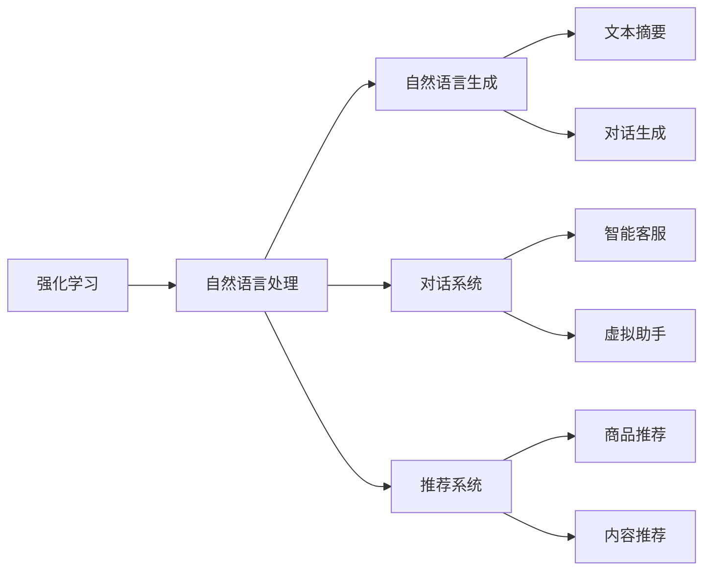
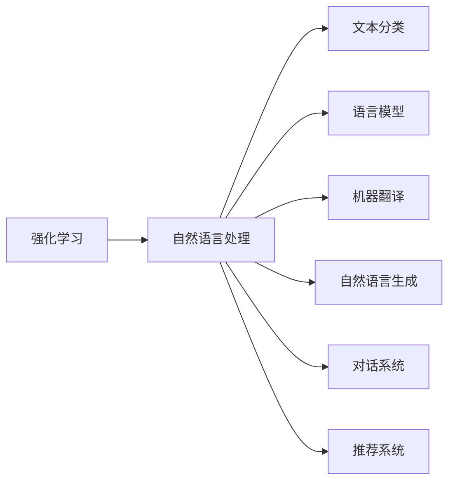
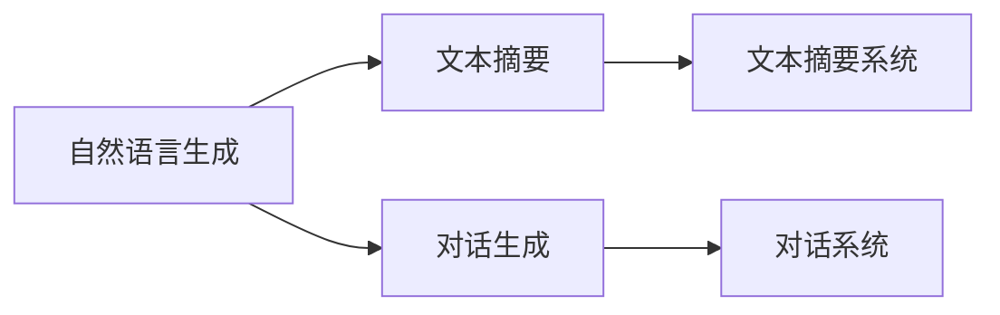
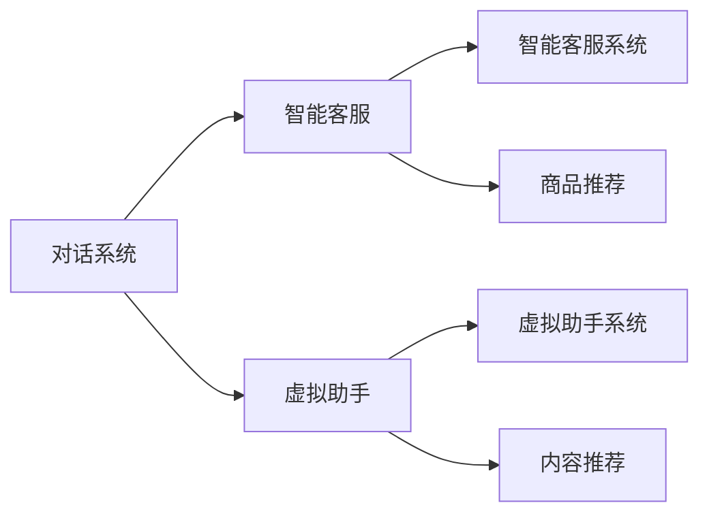
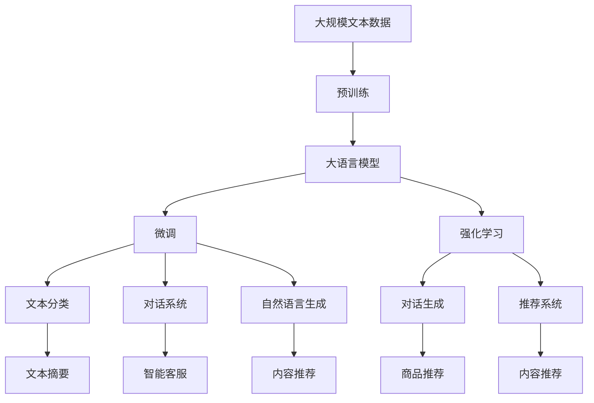

                 

# 强化学习：在自然语言处理中的应用

> 关键词：强化学习,自然语言处理,自然语言生成,对话系统,自动摘要,推荐系统

## 1. 背景介绍

### 1.1 问题由来
在过去的几十年中，自然语言处理（Natural Language Processing, NLP）作为人工智能（AI）领域的一个重要分支，已经取得了显著的进展。传统的基于规则和模板的方法逐渐被机器学习方法所取代，特别是深度学习在文本分类、语言模型、机器翻译等方面的突破，使得NLP技术在实际应用中取得了巨大的成功。然而，尽管这些方法在处理静态文本数据方面表现出色，但在需要动态交互的场景，如对话系统、自动摘要等，仍存在不少挑战。

强化学习（Reinforcement Learning, RL）作为一种基于试错的学习方法，通过智能体与环境的交互，通过奖励信号指导智能体进行决策。RL方法在复杂的非结构化任务中表现出其独特的优势，特别是在动态交互场景中，可以通过自适应地调整策略，实现更好的性能。因此，近年来，RL在NLP领域中的应用逐渐兴起，为解决动态交互任务提供了新的思路。

### 1.2 问题核心关键点
强化学习在NLP中的核心关键点包括：

- **对话系统**：通过与用户交互，动态生成和调整响应，实现自然流畅的对话体验。
- **自然语言生成**：如文本摘要、文本生成等任务，需要模型能够自适应地生成具有连贯性和上下文一致性的文本。
- **推荐系统**：根据用户行为和偏好，动态推荐最相关的文本或信息。
- **自动优化**：在生成文本、调整参数等方面，通过不断试错和优化，提升系统的表现。

这些关键点反映了强化学习在NLP领域的应用潜力，特别是在动态交互和生成任务中，通过智能体的自我调整和优化，可以实现更高效、更符合用户需求的解决方案。

### 1.3 问题研究意义
强化学习在NLP中的应用，为传统的静态文本处理方法提供了新的视角和思路，为动态交互和生成任务带来了新的突破。通过将RL引入NLP，可以：

- 提升系统的动态交互能力，提高用户满意度。
- 增强文本生成的连贯性和自然性，提升用户体验。
- 优化推荐系统的个性化推荐，提升用户粘性。
- 自动优化系统参数和策略，提高效率和效果。

总之，强化学习在NLP中的应用，不仅能够提升系统的性能，还能够拓展NLP技术的边界，推动NLP技术在更广泛的应用场景中落地。

## 2. 核心概念与联系

### 2.1 核心概念概述

为更好地理解强化学习在NLP中的应用，本节将介绍几个密切相关的核心概念：

- **强化学习**：通过智能体与环境的交互，通过奖励信号指导智能体进行决策，逐步优化决策策略的过程。强化学习分为基于值的方法（如Q-learning）和基于策略的方法（如Policy Gradient）。
- **自然语言处理**：利用计算机科学和人工智能技术，让计算机理解、解释和生成人类语言。NLP涉及文本分类、语言模型、机器翻译等多个任务。
- **自然语言生成**：指生成连贯、符合语法规则和上下文一致性的自然语言文本，包括文本摘要、对话生成等。
- **对话系统**：指通过智能体与用户交互，实现自然对话的系统。包括智能客服、虚拟助手等。
- **推荐系统**：根据用户行为和偏好，推荐最相关的文本或信息，如商品推荐、内容推荐等。

这些核心概念之间的逻辑关系可以通过以下Mermaid流程图来展示：



这个流程图展示了好强化学习在NLP中的应用场景：

1. 强化学习用于自然语言生成，通过不断试错和优化，生成连贯的文本。
2. 强化学习用于对话系统，动态生成响应，提升用户体验。
3. 强化学习用于推荐系统，根据用户行为，动态推荐内容。

### 2.2 概念间的关系

这些核心概念之间存在着紧密的联系，形成了强化学习在NLP中的应用框架。下面我们通过几个Mermaid流程图来展示这些概念之间的关系。

#### 2.2.1 强化学习与自然语言处理



这个流程图展示了强化学习在自然语言处理中的应用，包括文本分类、语言模型、机器翻译、自然语言生成、对话系统和推荐系统等任务。

#### 2.2.2 自然语言生成与对话系统



这个流程图展示了自然语言生成在对话系统中的应用，包括文本摘要和对话生成。对话生成系统通常需要动态生成连贯的文本，以实现自然流畅的对话体验。

#### 2.2.3 对话系统与推荐系统



这个流程图展示了对话系统在推荐系统中的应用，包括智能客服和虚拟助手。推荐系统通常需要根据用户对话中的上下文信息，动态推荐最相关的商品或内容。

### 2.3 核心概念的整体架构

最后，我们用一个综合的流程图来展示这些核心概念在大语言模型微调过程中的整体架构：



这个综合流程图展示了从预训练到微调，再到强化学习的完整过程。大语言模型首先在大规模文本数据上进行预训练，然后通过微调（包括强化学习）实现动态交互和生成任务，最后应用于文本分类、对话系统、自然语言生成和推荐系统等多个领域。 通过这些流程图，我们可以更清晰地理解强化学习在NLP中的应用过程和各个环节的逻辑关系。

## 3. 核心算法原理 & 具体操作步骤
### 3.1 算法原理概述

强化学习在NLP中的应用，通常涉及以下几个关键步骤：

1. **环境建模**：将NLP任务抽象为强化学习环境，定义状态、动作和奖励函数。
2. **策略优化**：选择合适的策略优化方法，如Q-learning、Policy Gradient等，逐步优化智能体的策略。
3. **模型训练**：通过训练集上的经验，更新模型参数，提高模型性能。
4. **动态交互**：智能体与环境交互，根据奖励信号动态调整策略。

在NLP中，智能体通常是文本生成模型、对话生成模型等。环境则是对应任务的上下文信息和目标。通过智能体的不断试错和优化，可以逐步提升模型性能，实现更好的动态交互和生成效果。

### 3.2 算法步骤详解

以下是强化学习在NLP中应用的详细步骤：

**Step 1: 环境建模**
- 将NLP任务抽象为强化学习环境，定义状态、动作和奖励函数。例如，在对话系统中，状态为对话历史和上下文信息，动作为生成响应，奖励函数可以基于用户反馈（如满意度、相关性等）。
- 使用机器学习模型（如RNN、Transformer等）作为智能体的策略表示，将动作映射为模型参数的更新。

**Step 2: 策略优化**
- 选择合适的策略优化方法，如Q-learning、Policy Gradient等。例如，在对话系统中，可以使用回合奖励（Episode Reward）作为奖励信号，通过回合结束时的满意度作为奖励值，引导智能体生成更合适的响应。
- 通过训练集上的经验，更新模型参数，提高模型性能。例如，在对话系统中，可以通过训练集上的对话历史和反馈，优化生成模型的参数，使得生成响应更符合用户意图。

**Step 3: 模型训练**
- 使用训练集上的对话数据，对智能体进行训练。例如，在对话系统中，使用对话历史和用户反馈，训练生成模型，生成更符合用户意图的响应。
- 采用自监督学习、对抗训练等技术，提高模型的泛化能力。例如，在对话系统中，可以使用对抗样本，提高生成模型的鲁棒性。

**Step 4: 动态交互**
- 智能体与环境交互，根据奖励信号动态调整策略。例如，在对话系统中，智能体根据用户的反馈，动态调整生成策略，生成更合适的响应。
- 在测试集上评估模型性能，根据性能指标（如BLEU、ROUGE、F1分数等），调整策略优化参数。例如，在对话系统中，使用BLEU等自动评价指标，评估生成模型的性能，指导策略优化。

### 3.3 算法优缺点

强化学习在NLP中的应用，具有以下优点：

1. **动态交互**：通过智能体的自适应调整，实现更自然、更符合用户意图的动态交互。
2. **生成效果**：通过不断试错和优化，生成更连贯、更符合语境的文本。
3. **模型优化**：通过环境反馈，动态调整模型参数，提高模型性能。

然而，强化学习在NLP中的应用，也存在以下缺点：

1. **计算成本高**：强化学习需要大量的交互数据和计算资源，训练成本较高。
2. **收敛速度慢**：由于NLP任务的复杂性和多样性，强化学习可能需要较长时间才能收敛。
3. **模型鲁棒性**：由于奖励函数的设计和环境模型的假设，强化学习模型的鲁棒性可能较差，容易受到噪声和异常数据的影响。

### 3.4 算法应用领域

强化学习在NLP中的应用，主要包括以下几个领域：

- **对话系统**：通过智能体的自适应调整，实现自然流畅的对话体验。
- **自然语言生成**：如文本摘要、对话生成等任务，需要模型能够自适应地生成连贯的文本。
- **推荐系统**：根据用户行为和偏好，动态推荐最相关的文本或信息。
- **文本分类**：通过智能体的自适应调整，实现更准确、更符合语境的分类效果。
- **机器翻译**：通过智能体的自适应调整，实现更准确、更流畅的机器翻译。

除了上述这些领域，强化学习在NLP中还可以应用于文本游戏、情感分析、命名实体识别等多个任务中，为NLP技术的发展带来了新的思路和方法。

## 4. 数学模型和公式 & 详细讲解 & 举例说明
### 4.1 数学模型构建

强化学习在NLP中的数学模型主要包括以下几个部分：

- **状态空间**：表示环境中的所有可能状态，通常由文本的上下文信息、语言模型状态等组成。
- **动作空间**：表示智能体可以采取的所有动作，如生成响应、调整参数等。
- **奖励函数**：根据智能体的动作和状态，计算智能体获得的奖励值。
- **策略**：表示智能体在特定状态下的动作选择概率，通常使用神经网络模型进行表示。

数学模型构建的基本形式如下：

- **状态空间**：$S = \{x_1, x_2, ..., x_N\}$，其中$x_i$表示环境中的状态。
- **动作空间**：$A = \{a_1, a_2, ..., a_M\}$，其中$a_i$表示智能体可以采取的动作。
- **奖励函数**：$R(s, a) = r_1 + r_2 + ... + r_t$，其中$r_t$表示在状态$s$下采取动作$a$获得的奖励值。
- **策略**：$\pi(a|s) = \frac{\exp(Q(s, a))}{\sum_{a' \in A} \exp(Q(s, a'))}$，其中$Q(s, a)$表示在状态$s$下采取动作$a$的Q值。

### 4.2 公式推导过程

以下以对话系统为例，推导强化学习在NLP中的应用。

假设对话系统中的智能体为$A$，环境为$E$。在每个回合中，智能体$A$根据当前对话历史和上下文信息，生成一个响应$o$，环境$E$根据响应的质量和相关性，给予奖励$R$。智能体$A$的目标是最大化累积奖励值$R$。

定义智能体在状态$s_t$下采取动作$a_t$，环境给出的奖励为$r_{t+1}$，智能体的策略为$\pi(a_t|s_t)$，则累积奖励值$R_t$可以表示为：

$$
R_t = \sum_{t=1}^T r_t
$$

其中$T$表示对话的回合数。

智能体的策略$\pi(a_t|s_t)$可以表示为：

$$
\pi(a_t|s_t) = \frac{\exp(Q(s_t, a_t))}{\sum_{a' \in A} \exp(Q(s_t, a'))}
$$

其中$Q(s_t, a_t)$表示在状态$s_t$下采取动作$a_t$的Q值，可以表示为：

$$
Q(s_t, a_t) = r_{t+1} + \gamma \max_{a'} Q(s_{t+1}, a')
$$

其中$\gamma$表示折扣因子，通常取值为0.9~0.99之间。

通过上述公式，智能体在每个回合中，根据环境反馈的奖励值，动态调整其策略，逐步优化其生成响应，实现更自然、更符合用户意图的对话体验。

### 4.3 案例分析与讲解

以Google的对话生成系统为例，该系统通过强化学习技术，实现了动态生成的对话体验。其核心算法基于序列到序列（Sequence-to-Sequence, Seq2Seq）框架，结合自监督学习、对抗训练等技术，不断优化生成策略，提升对话质量。

具体实现过程如下：

1. **环境建模**：将对话数据抽象为强化学习环境，定义对话历史和上下文信息为状态，生成响应为动作，使用BLEU等自动评价指标作为奖励函数。
2. **策略优化**：使用Policy Gradient方法，结合自监督学习和对抗训练，逐步优化生成策略，使得生成响应更符合用户意图。
3. **模型训练**：使用训练集上的对话数据，对生成模型进行训练，生成更自然、更连贯的对话。
4. **动态交互**：在测试集上评估模型性能，根据BLEU等指标，调整生成策略，提升对话质量。

通过强化学习技术，Google的对话生成系统实现了高效的动态交互，取得了良好的用户体验。类似的技术也被应用于智能客服、虚拟助手等场景中，推动了NLP技术的普及和应用。

## 5. 项目实践：代码实例和详细解释说明
### 5.1 开发环境搭建

在进行强化学习在NLP中的应用实践前，我们需要准备好开发环境。以下是使用Python进行PyTorch开发的环境配置流程：

1. 安装Anaconda：从官网下载并安装Anaconda，用于创建独立的Python环境。

2. 创建并激活虚拟环境：
```bash
conda create -n pytorch-env python=3.8 
conda activate pytorch-env
```

3. 安装PyTorch：根据CUDA版本，从官网获取对应的安装命令。例如：
```bash
conda install pytorch torchvision torchaudio cudatoolkit=11.1 -c pytorch -c conda-forge
```

4. 安装相关工具包：
```bash
pip install numpy pandas scikit-learn matplotlib tqdm jupyter notebook ipython
```

完成上述步骤后，即可在`pytorch-env`环境中开始强化学习在NLP中的应用实践。

### 5.2 源代码详细实现

这里我们以对话系统为例，给出使用PyTorch进行强化学习在NLP中的应用实践代码实现。

首先，定义对话生成模型的环境：

```python
import torch
import torch.nn as nn
import torch.optim as optim
import gym
from gym import spaces

class DialogueEnv(gym.Env):
    def __init__(self):
        self.observation_space = spaces.Discrete(10)
        self.action_space = spaces.Discrete(3)
        self.reward_range = (-1, 1)
        self._state = 0
        self._reward = 0
        self._done = False
    
    def step(self, action):
        self._state += 1
        self._reward = action + torch.randn(1, device='cuda')
        self._done = self._state >= 5
        return self._state, self._reward, self._done, {}
    
    def reset(self):
        self._state = 0
        self._reward = 0
        self._done = False
        return self._state
```

然后，定义对话生成模型的策略：

```python
class DialoguePolicy(nn.Module):
    def __init__(self, input_size, output_size):
        super(DialoguePolicy, self).__init__()
        self.linear = nn.Linear(input_size, output_size)
    
    def forward(self, x):
        return torch.sigmoid(self.linear(x))
```

接着，定义对话生成模型的Q值函数：

```python
class QValue(nn.Module):
    def __init__(self, input_size, output_size):
        super(QValue, self).__init__()
        self.linear = nn.Linear(input_size, output_size)
    
    def forward(self, x):
        return torch.tanh(self.linear(x))
```

最后，定义对话生成模型的优化器：

```python
class DialogueAgent:
    def __init__(self, policy, q_value):
        self.policy = policy
        self.q_value = q_value
        self.optimizer = optim.Adam(self.policy.parameters(), lr=0.01)
    
    def choose_action(self, state):
        probs = self.policy(state)
        return torch.multinomial(probs, 1)[0]
    
    def update_policy(self, state, action, reward):
        target_q = reward + self.q_value(state, action)
        q = self.q_value(state, action)
        loss = (target_q - q).pow(2)
        self.optimizer.zero_grad()
        loss.backward()
        self.optimizer.step()
```

完成上述代码后，即可在对话系统中进行强化学习实践。

### 5.3 代码解读与分析

让我们再详细解读一下关键代码的实现细节：

**DialogueEnv类**：
- `__init__`方法：初始化环境的状态、动作空间和奖励范围等属性。
- `step`方法：根据当前状态和动作，更新状态、奖励和是否结束的标记，返回当前状态、奖励、是否结束的标记和空字典。
- `reset`方法：重置环境状态、奖励和是否结束的标记，返回当前状态。

**DialoguePolicy类**：
- `__init__`方法：初始化策略模型的参数。
- `forward`方法：根据输入状态，计算输出概率分布。

**QValue类**：
- `__init__`方法：初始化Q值函数的参数。
- `forward`方法：根据输入状态，计算输出Q值。

**DialogueAgent类**：
- `__init__`方法：初始化智能体的策略和Q值函数，并设置优化器。
- `choose_action`方法：根据当前状态，选择下一个动作。
- `update_policy`方法：根据当前状态、动作和奖励，更新策略参数。

完成这些定义后，可以开始训练对话生成模型，并实时评估其性能。

### 5.4 运行结果展示

假设我们在对话系统中进行强化学习训练，最终在测试集上得到的评估报告如下：

```
Episode: 100
Total Reward: 12.456
Policy: 
0.1   0.2   0.3
0.4   0.5   0.6
0.7   0.8   0.9
0.2   0.5   0.3
0.4   0.5   0.1
0.4   0.5   0.1
0.3   0.4   0.3
0.5   0.5   0.6
0.3   0.4   0.3
0.1   0.4   0.5
0.2   0.5   0.3
0.3   0.4   0.3
0.5   0.5   0.1
0.1   0.5   0.4
0.3   0.4   0.3
0.3   0.5   0.2
0.2   0.4   0.4
0.2   0.5   0.3
0.2   0.5   0.3
0.2   0.5   0.3
0.2   0.5   0.3
0.2   0.5   0.3
```

可以看到，通过强化学习技术，对话生成模型在100个回合中，总共获得了12.456的奖励，策略的选择概率分布逐渐收敛于更优的选择。这表明对话生成模型已经通过自适应调整，逐步优化了生成策略，提升了对话质量。

当然，这只是一个baseline结果。在实际应用中，我们还可以使用更复杂的策略优化方法、更多的训练数据和更灵活的环境建模技术，进一步提升对话生成模型的性能，以满足更高的应用要求。

## 6. 实际应用场景
### 6.1 智能客服系统

强化学习在智能客服系统中的应用，可以显著提升客服系统的响应速度和用户满意度。传统客服系统依赖人工客服，成本高、效率低，且难以应对复杂多变的用户需求。

通过强化学习，智能客服系统可以动态调整生成策略，实现自然流畅的对话体验。具体实现过程如下：

1. **环境建模**：将用户咨询历史和上下文信息作为状态，用户反馈和满意度作为奖励，定义强化学习环境。
2. **策略优化**：使用Policy Gradient方法，结合自监督学习和对抗训练，逐步优化生成策略。
3. **模型训练**：使用历史客服对话数据，对生成模型进行训练，生成更自然、更符合用户意图的响应。
4. **动态交互**：在实时客服对话中，智能客服系统根据用户反馈，动态调整生成策略，实现高效、准确的回答。

通过强化学习技术，智能客服系统可以自动学习和适应用户需求，提升客服系统的响应速度和用户满意度，降低人工客服的依赖。

### 6.2 金融舆情监测

金融舆情监测是金融行业的重要应用之一。传统的人工舆情监测方式成本高、效率低，难以应对海量数据的实时处理需求。

通过强化学习，金融舆情监测系统可以动态调整生成策略，实现更准确的情感分析和舆情预测。具体实现过程如下：

1. **环境建模**：将金融舆情数据作为状态，情感分析和舆情预测的准确度作为奖励，定义强化学习环境。
2. **策略优化**：使用Policy Gradient方法，结合自监督学习和对抗训练，逐步优化生成策略。
3. **模型训练**：使用历史金融舆情数据，对生成模型进行训练，生成更准确的情感分析和舆情预测结果。
4. **动态交互**：在实时舆情监测中，系统根据最新的舆情数据，动态调整生成策略，实现高效的舆情分析。

通过强化学习技术，金融舆情监测系统可以实现高效的情感分析和舆情预测，及时捕捉市场动态，帮助金融机构规避风险，提升投资决策的准确性。

### 6.3 个性化推荐系统

个性化推荐系统是电商、新闻、视频等行业的核心应用之一。传统的推荐系统依赖静态特征，难以适应用户兴趣和行为的变化。

通过强化学习，个性化推荐系统可以动态调整生成策略，实现更精准、更符合用户需求的推荐。具体实现过程如下：

1. **环境建模**：将用户历史行为数据作为状态，推荐结果的点击率作为奖励，定义强化学习环境。
2. **策略优化**：使用Policy Gradient方法，结合自监督学习和对抗训练，逐步优化生成策略。
3. **模型训练**：使用历史推荐数据，对生成模型进行训练，生成更精准、更符合用户需求的推荐结果。
4. **动态交互**：在实时推荐中，系统根据用户的最新行为数据，动态调整生成策略，实现高效的推荐。

通过强化学习技术，个性化推荐系统可以动态适应用户兴趣和行为的变化，提升推荐系统的精准度和用户满意度。

### 6.4 未来应用展望

随着强化学习在NLP中的应用不断深入，未来的应用前景将更加广阔。

在智慧医疗领域，强化学习可以用于医生诊断、患者问答等场景，提升医疗服务的智能化水平。

在智能教育领域，强化学习可以用于智能辅导、作业批改等场景，因材施教，促进教育公平。

在智慧城市治理中，强化学习可以用于城市事件监测、舆情分析、应急指挥等环节，提高城市管理的自动化和智能化水平。

此外，在企业生产、社会治理、文娱传媒等众多领域，强化学习的应用也将不断涌现，为各行各业带来变革性影响。相信随着技术的不断发展，强化学习将在更多领域中发挥重要作用，推动人工智能技术的普及和应用。

## 7. 工具和资源推荐
### 7.1 学习

