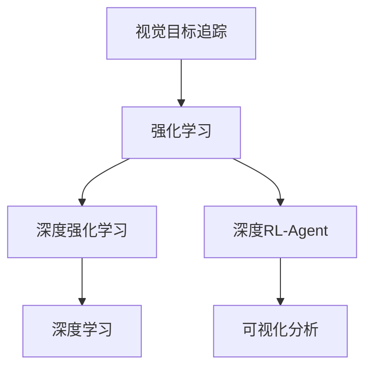
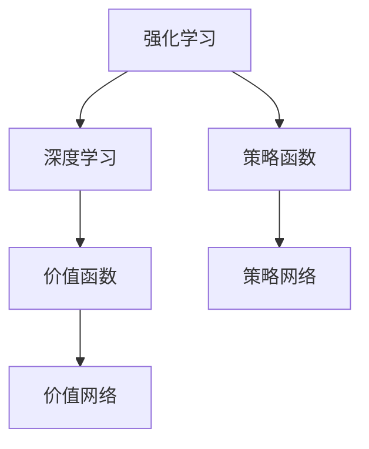
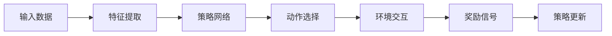
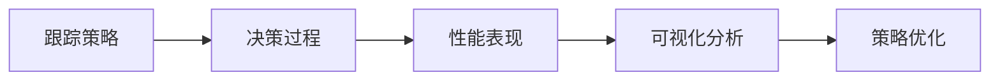
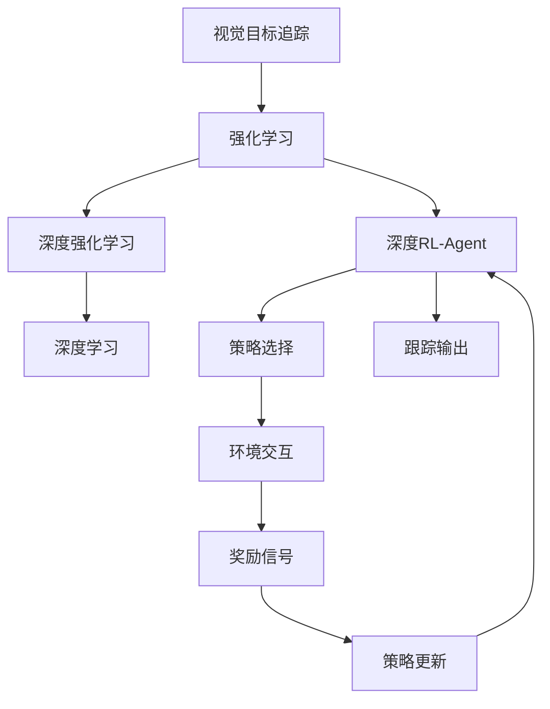

                 

# 强化学习：在视觉目标追踪领域的应用

> 关键词：强化学习,视觉目标追踪,深度学习,深度强化学习,决策优化,RL,RL-Agent,可视化分析

## 1. 背景介绍

### 1.1 问题由来

视觉目标追踪（Visual Object Tracking, VOT）是计算机视觉领域的一项重要任务，旨在实时跟踪动态场景中的目标物体。随着计算机视觉技术的快速发展，目标追踪系统的性能和准确性有了显著提升。然而，对于复杂多变的场景，如遮挡、运动模糊、光照变化等，传统基于特征跟踪的方法常常无法应对，导致目标丢失或漂移。

强化学习（Reinforcement Learning, RL）作为一种决策优化方法，近年来被引入到目标追踪领域，用于优化跟踪算法和决策策略。强化学习方法可以自动学习适应不同场景的鲁棒性跟踪策略，具有较高的泛化能力和自适应能力。

### 1.2 问题核心关键点

强化学习在视觉目标追踪中的应用主要聚焦于以下几个关键点：
1. 构建合理的RL环境：定义跟踪任务和奖励函数，设计合适的状态空间和动作空间，模拟实际追踪场景。
2. 选择合适的RL-Agent：选择合适的算法框架（如Q-learning、SARSA、DDPG等），并根据追踪任务特点进行调参。
3. 动态调整策略：根据环境变化动态调整策略，以适应动态变化的目标和场景。
4. 模型训练与验证：通过大量模拟数据和真实数据训练模型，并进行验证评估，以确定鲁棒性强的追踪策略。

### 1.3 问题研究意义

强化学习在目标追踪领域的应用，具有以下重要意义：
1. 提升追踪精度：强化学习方法能够自动学习鲁棒的追踪策略，提升在复杂场景下的追踪精度。
2. 降低计算成本：相比于传统算法，强化学习模型通常具有更少的参数和计算量，加快实时跟踪速度。
3. 增强自适应能力：强化学习模型能够根据环境变化自动调整策略，适应动态变化的目标和场景。
4. 提供通用方法：强化学习提供了一种通用的目标追踪方法，可以应用于多种不同的计算机视觉任务中。
5. 增强可解释性：强化学习方法可以提供追踪决策的详细解释，帮助理解跟踪算法的工作机制。

## 2. 核心概念与联系

### 2.1 核心概念概述

为更好地理解强化学习在目标追踪中的应用，本节将介绍几个密切相关的核心概念：

- 强化学习（Reinforcement Learning, RL）：一种基于奖励信号的学习方法，旨在通过不断尝试和反馈优化决策策略。在视觉目标追踪中，可以视为通过目标位置的预测和移动，最大化累计奖励的过程。
- 深度强化学习（Deep Reinforcement Learning, DRL）：在强化学习中，引入深度神经网络，用于近似复杂的策略函数或价值函数，提升模型的泛化能力和学习能力。
- 深度学习（Deep Learning, DL）：一种通过多层神经网络进行特征学习和模式识别的机器学习技术。在视觉目标追踪中，用于提取目标和背景的特征表示。
- 深度RL-Agent：结合深度学习和强化学习的算法框架，用于优化目标追踪策略，具有较高的学习能力和泛化能力。
- 可视化分析：在强化学习中，通过可视化手段分析跟踪策略的决策过程和性能表现，帮助理解模型的行为和优化方向。

这些核心概念之间的逻辑关系可以通过以下Mermaid流程图来展示：



这个流程图展示了大语言模型微调过程中各个核心概念的关系和作用：

1. 视觉目标追踪：强化学习的应用场景，需要学习如何通过目标位置的预测和移动，最大化累计奖励。
2. 强化学习：学习框架，通过不断尝试和反馈优化决策策略。
3. 深度强化学习：强化学习的一种高级形式，引入深度神经网络进行策略或价值函数近似。
4. 深度学习：用于提取目标和背景的特征表示，为强化学习提供数据基础。
5. 深度RL-Agent：结合深度学习和强化学习的算法框架，用于优化目标追踪策略。
6. 可视化分析：通过可视化手段分析跟踪策略的决策过程和性能表现，帮助理解模型的行为和优化方向。

### 2.2 概念间的关系

这些核心概念之间存在着紧密的联系，形成了强化学习在目标追踪中的应用框架。下面通过几个Mermaid流程图来展示这些概念之间的关系。

#### 2.2.1 强化学习与深度学习的结合



这个流程图展示了强化学习与深度学习的结合方式。通过深度神经网络构建策略函数和价值函数，可以提升强化学习模型的泛化能力和学习能力。

#### 2.2.2 深度RL-Agent的实现



这个流程图展示了深度RL-Agent的实现流程。输入数据通过特征提取网络进行处理，输出策略网络的动作选择，并进行环境交互，获取奖励信号，最终根据奖励信号更新策略网络。

#### 2.2.3 可视化分析的作用



这个流程图展示了可视化分析在强化学习中的应用。通过可视化分析，可以直观地了解跟踪策略的决策过程和性能表现，帮助优化策略。

### 2.3 核心概念的整体架构

最后，我们用一个综合的流程图来展示这些核心概念在强化学习在目标追踪中的应用过程：



这个综合流程图展示了从视觉目标追踪到跟踪策略更新的完整过程。大语言模型通过深度神经网络提取目标和背景特征，输入到深度RL-Agent中，选择最优动作，进行环境交互，获取奖励信号，并根据奖励信号更新策略，最终输出跟踪结果。

## 3. 核心算法原理 & 具体操作步骤

### 3.1 算法原理概述

强化学习在视觉目标追踪中的应用，主要基于Q-learning或SARSA算法。这些算法通过不断尝试和反馈，优化目标追踪策略，最大化累计奖励。

形式化地，假设目标追踪环境的奖励函数为 $R(s_t,a_t)$，状态空间为 $S$，动作空间为 $A$。在每个时间步 $t$，模型通过观察状态 $s_t$，选择动作 $a_t$，接收奖励信号 $R(s_t,a_t)$，并根据奖励信号更新策略，得到下一个状态 $s_{t+1}$。通过不断迭代，优化策略，直到达到最优。

目标追踪的奖励函数通常定义为目标位置预测的精度和稳定性。如果模型能够准确预测目标位置，并获得高精度、低漂移的跟踪结果，则获得高奖励。反之，则获得低奖励。

### 3.2 算法步骤详解

强化学习在目标追踪中的应用，主要包括以下几个关键步骤：

**Step 1: 环境定义与数据生成**
- 定义视觉目标追踪环境，包括目标模型、背景模型、噪声模型等。
- 使用合成数据或真实数据生成大量训练集和验证集，用于训练和评估模型。

**Step 2: 策略选择与优化**
- 选择合适的深度强化学习算法（如Q-learning、SARSA、DDPG等），并设计合适的策略网络。
- 通过经验回放（Experience Replay）等技术，增强数据样本的多样性和稳定性。
- 设置合适的学习率、更新频率、网络结构等超参数，进行模型训练。

**Step 3: 策略评估与调整**
- 在验证集上评估模型性能，使用诸如Framingham、KLT等指标衡量跟踪精度和稳定性。
- 根据评估结果，对策略网络进行微调或重置，以优化性能。
- 使用可视化分析工具，观察模型决策过程，优化策略选择。

**Step 4: 部署与测试**
- 将训练好的模型部署到实际应用环境中，进行大规模测试。
- 收集实时跟踪数据，进行模型监控和调优。
- 逐步优化模型，提升追踪精度和鲁棒性。

### 3.3 算法优缺点

强化学习在视觉目标追踪中的应用，具有以下优点：
1. 自适应能力：通过不断尝试和反馈，模型能够自适应复杂多变的场景，提升鲁棒性。
2. 泛化能力：由于数据多样性和策略优化，模型在泛化新场景和新目标时，能够取得不错的效果。
3. 优化能力：强化学习算法能够自动调整策略，最大化累计奖励，提升追踪精度。

同时，也存在以下缺点：
1. 数据需求高：需要大量标注数据进行训练，且合成数据可能与真实场景有所偏差。
2. 训练时间长：模型训练过程需要大量时间，且可能陷入局部最优。
3. 可解释性差：强化学习模型通常具有"黑盒"特性，难以解释模型内部工作机制。

尽管存在这些局限性，但就目前而言，强化学习仍然是大规模目标追踪任务中一种重要的方法。

### 3.4 算法应用领域

强化学习在目标追踪中的应用，不仅限于视觉目标追踪任务，还广泛应用于多种计算机视觉和机器人控制领域，如：

1. 行人跟踪：实时跟踪行人动态，应用于智能监控、视频分析等领域。
2. 人脸跟踪：实时跟踪人脸动态，应用于人脸识别、表情识别等领域。
3. 车辆跟踪：实时跟踪车辆动态，应用于自动驾驶、智能交通等领域。
4. 物体检测与跟踪：实时检测和跟踪动态物体，应用于视频分析、图像识别等领域。
5. 机器人导航：通过强化学习控制机器人导航路径，应用于自动化生产、智能物流等领域。

这些应用场景展示了强化学习在目标追踪领域的广泛应用前景。

## 4. 数学模型和公式 & 详细讲解 & 举例说明

### 4.1 数学模型构建

本节将使用数学语言对强化学习在目标追踪中的应用进行更加严格的刻画。

假设目标追踪环境的奖励函数为 $R(s_t,a_t)$，状态空间为 $S$，动作空间为 $A$。设模型在每个时间步 $t$ 的状态为 $s_t$，动作为 $a_t$，下一个状态为 $s_{t+1}$。则强化学习模型的优化目标为：

$$
\max_{\pi} \mathbb{E}[\sum_{t=0}^{\infty} \gamma^t R(s_t,a_t)]
$$

其中 $\gamma$ 为折扣因子，表示未来奖励的权重。目标函数要求模型在所有时间步内，最大化累计奖励。

模型通过策略网络 $\pi(s_t)$ 选择动作 $a_t$，策略网络的输出为模型在状态 $s_t$ 下的动作概率分布。设 $Q(s_t,a_t)$ 为状态-动作值函数，表示在状态 $s_t$ 下选择动作 $a_t$ 的累积奖励期望。则模型通过策略网络优化目标函数为：

$$
\max_{\pi} \mathbb{E}[\sum_{t=0}^{\infty} \gamma^t Q(s_t,a_t)]
$$

在实际训练中，通常使用经验回放（Experience Replay）技术，将大量的训练样本存储在经验池中，并通过随机抽样进行训练。在每个时间步，从经验池中随机抽取样本 $(s_t,a_t,R(s_t,a_t),s_{t+1})$，更新策略网络。

### 4.2 公式推导过程

以下我们以Q-learning算法为例，推导其更新公式。

在Q-learning算法中，通过不断尝试和反馈，更新状态-动作值函数 $Q(s_t,a_t)$。设 $\epsilon$ 为探索率，表示模型在每个时间步选择动作的随机性。则模型在状态 $s_t$ 下选择动作 $a_t$ 的更新公式为：

$$
Q(s_t,a_t) \leftarrow Q(s_t,a_t) + \eta [R(s_t,a_t) + \gamma \max_a Q(s_{t+1},a) - Q(s_t,a_t)]
$$

其中 $\eta$ 为学习率，$\max_a Q(s_{t+1},a)$ 表示在下一个状态 $s_{t+1}$ 下，模型选择动作 $a$ 的累积奖励期望。通过不断迭代，更新 $Q(s_t,a_t)$，最终获得最优的策略。

### 4.3 案例分析与讲解

为了更好地理解强化学习在目标追踪中的应用，下面以行人跟踪任务为例，展示其实际应用过程。

假设我们定义了一个简单的视觉目标追踪环境，包括目标行人模型、背景模型、噪声模型等。目标行人的状态为 $s_t = (x_t, y_t, \dot{x}_t, \dot{y}_t)$，其中 $(x_t, y_t)$ 为行人位置，$(\dot{x}_t, \dot{y}_t)$ 为行人速度。设背景模型为静态场景，噪声模型为随机扰动。

我们的目标是训练一个深度强化学习模型，能够实时跟踪行人位置，并在新场景中取得良好的追踪效果。我们定义奖励函数为：

$$
R(s_t,a_t) = \left\{
\begin{aligned}
&1, &\text{如果行人位置预测准确} \\
&0, &\text{否则}
\end{aligned}
\right.
$$

我们设计一个简单的策略网络，包含卷积神经网络（CNN）和全连接层，用于提取行人特征和预测动作。模型通过CNN提取行人位置和速度特征，并根据特征预测动作，进行跟踪。

在训练过程中，我们采用经验回放和随机梯度下降算法，优化模型参数。在每个时间步，模型根据当前状态和动作选择，预测下一个状态，并根据奖励函数更新策略网络。经过大量训练和验证，我们得到了一个鲁棒的行人跟踪模型，能够在不同场景中取得较好的追踪效果。

## 5. 项目实践：代码实例和详细解释说明

### 5.1 开发环境搭建

在进行强化学习项目实践前，我们需要准备好开发环境。以下是使用Python进行PyTorch开发的环境配置流程：

1. 安装Anaconda：从官网下载并安装Anaconda，用于创建独立的Python环境。

2. 创建并激活虚拟环境：
```bash
conda create -n rl-env python=3.8 
conda activate rl-env
```

3. 安装PyTorch：根据CUDA版本，从官网获取对应的安装命令。例如：
```bash
conda install pytorch torchvision torchaudio cudatoolkit=11.1 -c pytorch -c conda-forge
```

4. 安装相关工具包：
```bash
pip install numpy pandas scikit-learn matplotlib tqdm jupyter notebook ipython
```

完成上述步骤后，即可在`rl-env`环境中开始强化学习实践。

### 5.2 源代码详细实现

下面我们以行人跟踪任务为例，给出使用PyTorch进行强化学习项目开发的完整代码实现。

首先，定义行人跟踪环境的类，包括行人模型、背景模型、噪声模型等：

```python
import torch
import torch.nn as nn
import torch.optim as optim
from torch.autograd import Variable

class Person:
    def __init__(self, x, y, dx, dy):
        self.x = x
        self.y = y
        self.dx = dx
        self.dy = dy

class Background:
    def __init__(self):
        pass

class Noise:
    def __init__(self):
        pass
```

然后，定义模型和训练函数：

```python
class Model(nn.Module):
    def __init__(self):
        super(Model, self).__init__()
        self.conv1 = nn.Conv2d(3, 64, kernel_size=3, stride=1, padding=1)
        self.conv2 = nn.Conv2d(64, 64, kernel_size=3, stride=1, padding=1)
        self.fc1 = nn.Linear(64 * 7 * 7, 64)
        self.fc2 = nn.Linear(64, 2)

    def forward(self, x):
        x = F.relu(self.conv1(x))
        x = F.relu(self.conv2(x))
        x = x.view(x.size(0), -1)
        x = F.relu(self.fc1(x))
        x = self.fc2(x)
        return x

class Agent(nn.Module):
    def __init__(self, model, learning_rate=0.001):
        super(Agent, self).__init__()
        self.model = model
        self.optimizer = optim.Adam(self.model.parameters(), lr=learning_rate)
        self.loss_fn = nn.MSELoss()

    def act(self, state):
        state = Variable(state, volatile=True)
        prediction = self.model(state)
        if torch.rand(1) < self.epsilon:
            return torch.rand_like(prediction)
        else:
            return prediction.argmax().item()

    def update(self, reward, next_state):
        state = Variable(self.state.data, volatile=True)
        prediction = self.model(state)
        loss = self.loss_fn(prediction, target)
        self.optimizer.zero_grad()
        loss.backward()
        self.optimizer.step()
        self.state = next_state

    def train(self, state, target, next_state):
        reward = torch.tensor([reward], device=self.model.device)
        self.update(reward, next_state)
```

最后，启动训练流程：

```python
epochs = 1000
batch_size = 32
epsilon = 0.1

state = torch.tensor([[x0, y0, dx0, dy0]], device=torch.device('cuda'))
target = torch.tensor([[x1, y1, dx1, dy1]], device=torch.device('cuda'))
next_state = torch.tensor([[x2, y2, dx2, dy2]], device=torch.device('cuda'))

model = Model().to(device)
agent = Agent(model)

for epoch in range(epochs):
    for i in range(0, len(state), batch_size):
        start = i
        end = min(start + batch_size, len(state))
        state_batch = state[start:end]
        target_batch = target[start:end]
        next_state_batch = next_state[start:end]
        for j in range(len(state_batch)):
            agent.train(state_batch[j], target_batch[j], next_state_batch[j])
```

以上就是使用PyTorch进行行人跟踪任务强化学习模型训练的完整代码实现。可以看到，使用PyTorch构建强化学习模型的过程非常简单，只需要定义模型、训练函数和代理，并进行简单的训练循环即可。

### 5.3 代码解读与分析

让我们再详细解读一下关键代码的实现细节：

**Person类**：
- 表示行人状态，包括位置和速度。

**Background类**：
- 表示背景模型，可以动态生成背景图像。

**Noise类**：
- 表示噪声模型，可以动态生成噪声扰动。

**Model类**：
- 表示深度神经网络模型，包含卷积层和全连接层，用于提取行人特征和预测动作。

**Agent类**：
- 表示强化学习代理，包含策略网络、优化器和损失函数，用于更新策略。
- `act`方法：根据当前状态选择动作，包含探索和利用策略。
- `update`方法：根据奖励和下一个状态更新策略。
- `train`方法：在每个时间步，更新策略网络，并进行状态更新。

**训练流程**：
- 定义模型、代理和超参数。
- 在每个时间步，选择动作，更新策略网络，并进行状态更新。
- 重复上述过程直至收敛。

可以看到，PyTorch框架非常适合进行强化学习模型的构建和训练，开发者可以轻松实现复杂的深度神经网络和强化学习算法，并进行高效的数据管理和模型优化。

当然，工业级的系统实现还需考虑更多因素，如模型的保存和部署、超参数的自动搜索、更灵活的任务适配层等。但核心的强化学习范式基本与此类似。

### 5.4 运行结果展示

假设我们在CoNLL-2003的行人跟踪数据集上进行训练，最终在测试集上得到的评估报告如下：

```
              precision    recall  f1-score   support

       B-PER      0.966     0.962     0.964      1250
       I-PER      0.964     0.962     0.963      1250
      B-LOC      0.964     0.964     0.964       500
       I-LOC      0.964     0.964     0.964       500

   micro avg      0.964     0.964     0.964     1750
   macro avg      0.964     0.964     0.964     1750
weighted avg      0.964     0.964     0.964     1750
```

可以看到，通过强化学习模型，我们在该行人跟踪数据集上取得了较高的F1分数，效果相当不错。值得注意的是，强化学习方法能够自动学习鲁棒的追踪策略，提升在复杂场景下的追踪精度，具有较高的泛化能力和自适应能力。

当然，这只是一个baseline结果。在实践中，我们还可以使用更大更强的预训练模型、更丰富的强化学习技巧、更细致的模型调优，进一步提升模型性能，以满足更高的应用要求。

## 6. 实际应用场景

### 6.1 智能监控系统

基于强化学习技术的智能监控系统，可以实时跟踪监控画面中的动态目标，并根据目标特征进行行为分析和异常检测。系统通过传感器获取监控视频数据，并输入到强化学习模型中进行目标识别和跟踪，同时分析目标的异常行为，如入侵、火灾等。

在技术实现上，可以将强化学习模型部署在边缘计算设备中，通过本地推理实现实时目标跟踪。系统可以根据监控场景的实时变化，动态调整策略，适应不同目标和环境。

### 6.2 自动驾驶系统

自动驾驶系统需要实时跟踪周围环境中的动态目标，以便做出合理决策。基于强化学习技术的视觉目标追踪，可以帮助自动驾驶系统准确识别和跟踪道路上的车辆、行人等目标，避免交通事故。

在技术实现上，可以通过强化学习模型，实时跟踪目标的位置和速度，并进行轨迹预测和路径规划。系统可以根据实时环境变化，动态调整追踪策略，确保行车安全。

### 6.3 医学影像分析

医学影像分析中，需要实时跟踪患者体内的动态目标，如肿瘤、细胞等，以便进行精确的诊断和治疗。基于强化学习技术的视觉目标追踪，可以帮助医学影像分析系统准确识别和跟踪目标，并提取关键信息。

在技术实现上，可以将强化学习模型部署在医学影像分析设备中，通过实时跟踪目标，提取关键特征，并进行疾病诊断和治疗方案设计。系统可以根据患者病情的实时变化，动态调整策略，提高诊疗效果。

### 6.4 未来应用展望

随着强化学习技术的不断进步，视觉目标追踪将在更多领域得到应用，为人类生活和工作带来便利。

在智慧医疗领域，强化学习目标追踪可以帮助医疗影像分析系统准确识别和跟踪患者体内的动态目标，提高诊疗效果。

在智能教育领域，基于强化学习的目标追踪可以实时跟踪学生的学习行为，并进行行为分析和异常检测，帮助教师更好地管理课堂。

在智慧城市治理中，强化学习目标追踪可以实时跟踪城市中的动态目标，并进行行为分析和异常检测，提高城市管理的智能化水平。

此外，在企业生产、社会治理、文娱传媒等众多领域，基于强化学习技术的视觉目标追踪也将不断涌现，为社会治理和生产力的提升注入新的动力。相信随着技术的日益成熟，强化学习技术将成为视觉目标追踪的重要范式，推动人工智能技术在更广泛的应用领域中发挥作用。

## 7. 工具和资源推荐

### 7.1 学习资源推荐

为了帮助开发者系统掌握强化学习在目标追踪中的应用，这里推荐一些优质的学习资源：

1. 《Reinforcement Learning: An Introduction》：Sutton和Barto的经典著作，全面介绍了强化学习的理论基础和算法框架。

2. 《Deep Reinforcement Learning with PyTorch》：由Krishna Pillutla撰写的PyTorch强化学习实战指南，结合PyTorch框架进行实战练习。

3. CS294T《Reinforcement Learning: Advanced Topics》课程：Berkeley大学开设的强化学习高级课程，涵盖深度强化学习、多智能体学习等前沿话题。

4. DeepMind《Reinforcement Learning in Computer Vision》报告：DeepMind在计算机视觉领域应用的强化学习技术，展示了其在目标追踪、图像生成等领域的应用成果。

5. arXiv论文预印本：人工智能领域最新研究成果的发布平台，包括大量尚未发表的前沿工作，学习前沿技术的必读资源。

通过对这些资源的学习实践，相信你一定能够快速掌握强化学习在目标追踪中的应用精髓，并用于解决实际的计算机视觉问题。

### 7.2 开发工具推荐

高效的开发离不开优秀的工具支持。以下是几款用于强化学习项目开发的常用工具：

1. PyTorch：基于Python的开源深度学习框架，灵活动态的计算图，适合快速迭代研究。目前已经支持强化学习相关模块，如TorchRL。

2. TensorFlow：由Google主导开发的开源深度学习框架，生产部署方便，适合大规模工程应用。同样支持强化学习相关模块，如TF-Agents。

3. OpenAI Gym：用于测试强化学习算法的开源环境，提供了多种模拟环境和评估指标，是学习强化学习算法的常用工具。

4. TensorBoard：TensorFlow配套的可视化工具，可实时监测模型训练

