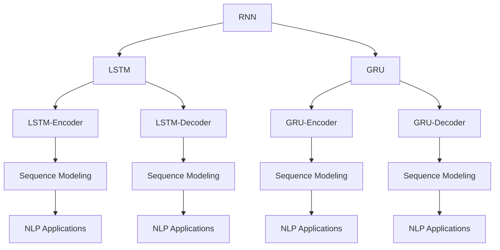
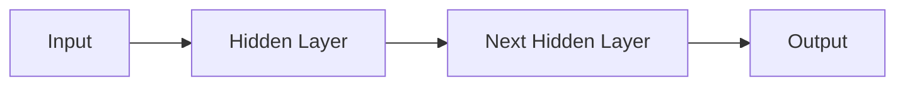
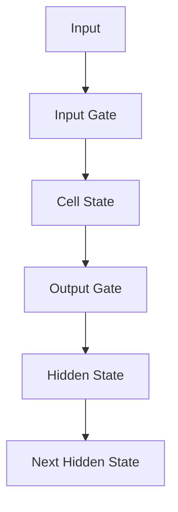
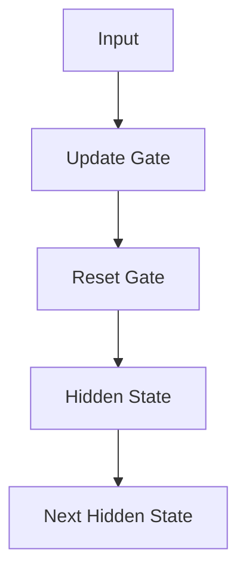
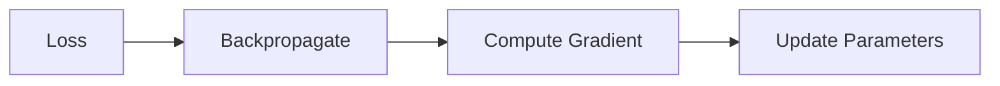
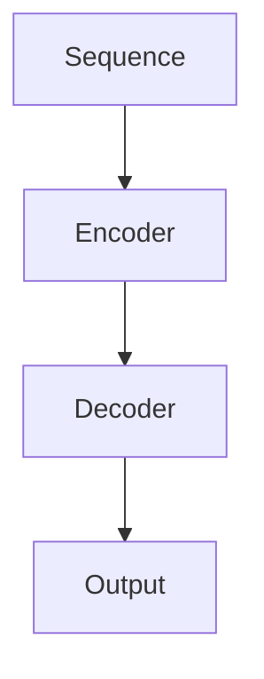
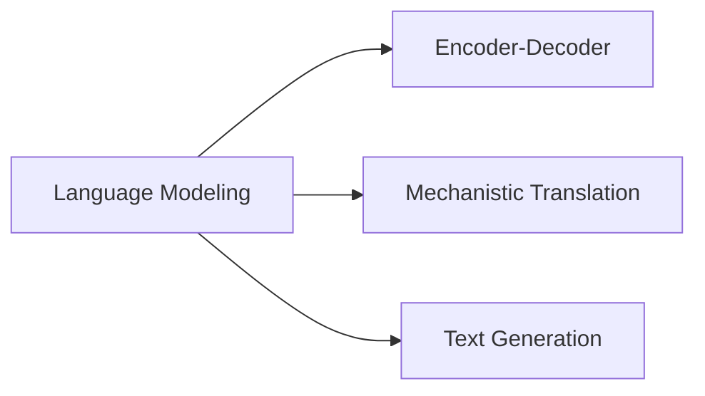
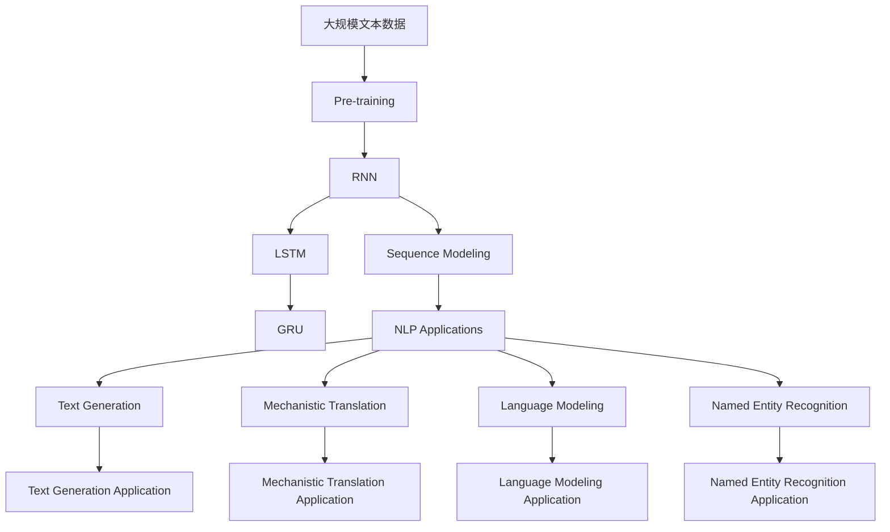

                 

# 循环神经网络 (Recurrent Neural Network)

> 关键词：循环神经网络,长短期记忆网络(LSTM),门控循环单元(GRU),反向传播算法,序列建模,自然语言处理(NLP)

## 1. 背景介绍

### 1.1 问题由来
随着深度学习技术的发展，传统的前馈神经网络已经无法应对需要考虑时间序列信息的任务。例如，自然语言处理(NLP)中的语言模型、语音识别、文本生成等任务，需要模型能够捕捉时间序列上的依赖关系。针对这些问题，循环神经网络（Recurrent Neural Network, RNN）应运而生。

RNN通过循环结构（如LSTM、GRU）将每个时刻的输入与先前的状态进行交互，从而保留了序列中的长期依赖关系，使得模型能够更好地处理时间序列数据。这一架构不仅在NLP领域取得了重大突破，也为处理时序数据提供了强有力的工具。

### 1.2 问题核心关键点
循环神经网络的核心思想是通过循环连接，使得模型可以处理任意长度的序列数据。其关键点包括：
1. **循环结构**：通过引入时间维度的状态变量，模型能够处理序列输入，捕捉序列中的依赖关系。
2. **动态更新**：模型在每个时间步都能根据当前输入和先前状态动态更新。
3. **序列建模**：通过RNN，模型可以有效地建模序列数据，预测未来时间步的状态。

### 1.3 问题研究意义
循环神经网络的研究具有重要的学术和应用价值：
1. **理论贡献**：RNN为处理序列数据提供了新的理论框架，丰富了神经网络的理论体系。
2. **应用广泛**：NLP、语音识别、推荐系统、金融预测等领域，RNN都发挥了重要作用。
3. **启发后续技术**：LSTM、GRU等变种的提出，极大地提升了RNN的处理能力。
4. **促进工业应用**：RNN的序列建模能力，使得人工智能技术更容易落地到实际应用中。

## 2. 核心概念与联系

### 2.1 核心概念概述

为更好地理解循环神经网络的基本原理和应用，本节将介绍几个核心概念：

- **循环神经网络（RNN）**：一种能够处理序列数据的神经网络，通过循环结构使得模型能够记忆序列中的先验信息。
- **长短期记忆网络（LSTM）**：RNN的一种变体，通过引入门控机制，解决了传统RNN在长序列上的梯度消失和梯度爆炸问题。
- **门控循环单元（GRU）**：RNN的另一种变体，相较于LSTM，GRU的参数更少，计算更高效，但在处理长期依赖方面稍逊于LSTM。
- **反向传播算法**：一种用于优化神经网络参数的算法，通过链式法则计算梯度，并更新模型参数，使得模型能够拟合训练数据。
- **序列建模**：通过RNN，模型能够捕捉序列数据中的依赖关系，预测未来的时间步状态。
- **自然语言处理（NLP）**：将循环神经网络应用于语言建模、机器翻译、文本生成等任务，取得了显著效果。

这些核心概念之间存在着紧密的联系，形成了循环神经网络的工作框架。下面我们将通过几个Mermaid流程图来展示这些概念之间的关系：



这个流程图展示了循环神经网络的核心概念及其之间的关系：

1. RNN作为基础架构，引入了循环连接。
2. LSTM和GRU作为RNN的变体，分别通过引入门控机制和简化结构，提高了模型的性能和效率。
3. 通过序列建模，RNN能够处理序列数据，预测未来状态。
4. NLP任务是RNN序列建模的典型应用场景，如语言模型、机器翻译、文本生成等。

### 2.2 概念间的关系

这些核心概念之间存在着紧密的联系，形成了循环神经网络的工作框架。下面我通过几个Mermaid流程图来展示这些概念之间的关系：

#### 2.2.1 RNN的结构



这个流程图展示了RNN的基本结构，包括输入、隐藏层、输出三个部分。输入和输出可以通过不同神经元数量进行调整，隐藏层的循环连接使得模型能够记忆先前的状态。

#### 2.2.2 LSTM的结构



这个流程图展示了LSTM的基本结构，包括输入门、细胞状态、输出门三个部分。LSTM通过引入门控机制，能够控制信息的流入和流出，解决了传统RNN在长序列上的梯度消失和梯度爆炸问题。

#### 2.2.3 GRU的结构



这个流程图展示了GRU的基本结构，包括更新门、重置门两个部分。GRU通过简化结构，使得模型在计算上更加高效，同时在处理长期依赖方面表现优异。

#### 2.2.4 反向传播算法



这个流程图展示了反向传播算法的基本流程，包括损失函数、反向传播计算梯度、参数更新三个步骤。反向传播算法通过链式法则计算梯度，并更新模型参数，使得模型能够拟合训练数据。

#### 2.2.5 序列建模



这个流程图展示了序列建模的基本流程，包括编码器、解码器两个部分。序列建模通过RNN，能够捕捉序列数据中的依赖关系，预测未来的时间步状态。

#### 2.2.6 NLP任务应用



这个流程图展示了NLP任务应用的基本流程，包括语言建模、机器翻译、文本生成三个部分。NLP任务通过RNN，能够处理语言数据，生成自然流畅的文本。

### 2.3 核心概念的整体架构

最后，我们用一个综合的流程图来展示这些核心概念在大语言模型微调过程中的整体架构：



这个综合流程图展示了从预训练到RNN序列建模，再到NLP任务应用的完整过程。大语言模型首先在大规模文本数据上进行预训练，然后通过RNN和其变体LSTM、GRU，实现序列建模，最后通过NLP任务应用，生成自然流畅的文本，完成语言理解和生成。

## 3. 核心算法原理 & 具体操作步骤
### 3.1 算法原理概述

循环神经网络（RNN）通过循环结构，使得模型能够处理序列数据，并保留序列中的先验信息。其核心思想是通过循环连接，使得模型在每个时间步都能够接收当前输入，并更新之前的状态，从而捕捉序列中的依赖关系。

形式化地，假设模型 $M_{\theta}$ 具有 $n$ 个隐藏状态 $h_t$，通过循环连接，模型在每个时间步 $t$ 的状态更新公式为：

$$
h_{t} = f(h_{t-1}, x_t; \theta)
$$

其中 $x_t$ 为第 $t$ 时刻的输入，$f$ 为隐藏状态的映射函数，$\theta$ 为模型参数。

通过反向传播算法，模型能够计算损失函数对参数 $\theta$ 的梯度，并更新参数，最小化损失函数。常用的损失函数包括交叉熵损失、均方误差损失等。

### 3.2 算法步骤详解

循环神经网络的基本流程包括以下几个关键步骤：

**Step 1: 准备数据集**
- 收集序列数据，如文本、语音、时间序列等。
- 将数据分为训练集、验证集和测试集，确保训练数据的质量和多样性。

**Step 2: 构建模型**
- 选择合适的RNN架构，如LSTM、GRU。
- 设计模型的隐藏层和输出层，确定神经元数量、激活函数等参数。
- 确定损失函数和优化器，如交叉熵损失、Adam优化器等。

**Step 3: 设置超参数**
- 选择合适的学习率、批大小、迭代轮数等超参数。
- 应用正则化技术，如L2正则、Dropout等，防止过拟合。

**Step 4: 执行梯度训练**
- 将训练集数据分批次输入模型，前向传播计算损失函数。
- 反向传播计算参数梯度，根据设定的优化算法和学习率更新模型参数。
- 周期性在验证集上评估模型性能，根据性能指标决定是否触发Early Stopping。
- 重复上述步骤直到满足预设的迭代轮数或Early Stopping条件。

**Step 5: 测试和部署**
- 在测试集上评估模型性能，对比模型在预训练和微调后的性能变化。
- 使用模型对新样本进行推理预测，集成到实际的应用系统中。
- 持续收集新的数据，定期重新微调模型，以适应数据分布的变化。

以上是循环神经网络的一般流程。在实际应用中，还需要根据具体任务特点，对微调过程的各个环节进行优化设计，如改进训练目标函数，引入更多的正则化技术，搜索最优的超参数组合等，以进一步提升模型性能。

### 3.3 算法优缺点

循环神经网络具有以下优点：
1. **序列建模能力**：能够捕捉序列数据中的依赖关系，适用于需要考虑时间因素的任务。
2. **参数共享**：模型参数共享，减少了整体模型参数量，使得模型更易于训练和优化。
3. **动态更新**：模型在每个时间步都能动态更新，适应序列数据的动态变化。

同时，循环神经网络也存在一些缺点：
1. **梯度消失/爆炸**：在长序列上的梯度传播过程中，容易出现梯度消失或爆炸的问题，导致模型难以捕捉长期依赖。
2. **计算复杂度高**：由于每个时间步都需要进行前向传播和反向传播，计算复杂度较高。
3. **难以并行化**：由于循环连接的特性，模型难以进行高效并行计算。

尽管存在这些局限性，循环神经网络仍是大规模序列数据处理的重要工具，广泛应用于自然语言处理、语音识别、时间序列预测等任务。

### 3.4 算法应用领域

循环神经网络（RNN）在多个领域得到了广泛应用，包括但不限于：

- **自然语言处理（NLP）**：语言模型、机器翻译、文本生成、命名实体识别、情感分析等。
- **语音识别**：声学模型、语言模型、端到端语音识别系统等。
- **时间序列预测**：股票价格预测、天气预测、交通流量预测等。
- **游戏AI**：决策树搜索、策略网络等。

除了上述这些经典应用外，循环神经网络还被创新性地应用到更多场景中，如视频描述生成、推荐系统等，为各领域提供了新的解决方案。

## 4. 数学模型和公式 & 详细讲解 & 举例说明

### 4.1 数学模型构建

循环神经网络的形式化定义如下：

假设模型 $M_{\theta}$ 具有 $n$ 个隐藏状态 $h_t$，通过循环连接，模型在每个时间步 $t$ 的状态更新公式为：

$$
h_{t} = f(h_{t-1}, x_t; \theta)
$$

其中 $x_t$ 为第 $t$ 时刻的输入，$f$ 为隐藏状态的映射函数，$\theta$ 为模型参数。

在输出层，模型的预测结果 $y_t$ 与当前状态 $h_t$ 相关，通常使用全连接层或softmax函数将状态映射为输出。输出层的损失函数为：

$$
L(y_t, \hat{y_t}) = -\log \hat{y_t}(y_t)
$$

其中 $\hat{y_t}$ 为模型预测的概率分布，$y_t$ 为真实标签。

### 4.2 公式推导过程

以LSTM模型为例，LSTM的状态更新公式如下：

$$
i_t = \sigma(W_i \cdot [h_{t-1}, x_t] + b_i)
$$
$$
f_t = \sigma(W_f \cdot [h_{t-1}, x_t] + b_f)
$$
$$
o_t = \sigma(W_o \cdot [h_{t-1}, x_t] + b_o)
$$
$$
g_t = \tanh(W_g \cdot [h_{t-1}, x_t] + b_g)
$$
$$
c_t = f_t \odot c_{t-1} + i_t \odot g_t
$$
$$
h_t = o_t \odot \tanh(c_t)
$$

其中，$i_t, f_t, o_t$ 为输入门、遗忘门、输出门的激活函数，$g_t$ 为候选状态的激活函数，$c_t$ 为细胞状态，$h_t$ 为隐藏状态。

LSTM的预测输出为：

$$
y_t = \hat{y_t} \cdot h_t
$$

其中 $\hat{y_t}$ 为输出层的激活函数，如softmax函数。

### 4.3 案例分析与讲解

下面以机器翻译任务为例，分析LSTM模型的工作原理。

假设需要将英文句子 "I love you" 翻译成中文，LSTM模型需要处理如下步骤：

1. 将句子中的每个单词作为输入，输入到LSTM模型中。
2. 在每个时间步，LSTM模型更新隐藏状态，捕捉单词间的依赖关系。
3. 最终，LSTM模型输出翻译结果，即 "我喜欢你"。

在这个过程中，LSTM模型通过引入门控机制，能够控制信息的流入和流出，从而更好地处理长序列数据。同时，通过动态更新，模型能够适应序列数据的动态变化，捕捉单词间的依赖关系。

## 5. 项目实践：代码实例和详细解释说明

### 5.1 开发环境搭建

在进行循环神经网络实践前，我们需要准备好开发环境。以下是使用Python进行PyTorch开发的环境配置流程：

1. 安装Anaconda：从官网下载并安装Anaconda，用于创建独立的Python环境。

2. 创建并激活虚拟环境：
```bash
conda create -n pytorch-env python=3.8 
conda activate pytorch-env
```

3. 安装PyTorch：根据CUDA版本，从官网获取对应的安装命令。例如：
```bash
conda install pytorch torchvision torchaudio cudatoolkit=11.1 -c pytorch -c conda-forge
```

4. 安装TensorFlow：如果需要进行对比学习，可安装TensorFlow：
```bash
conda install tensorflow -c conda-forge
```

5. 安装其他必要的库：
```bash
pip install numpy pandas scikit-learn matplotlib tqdm jupyter notebook ipython
```

完成上述步骤后，即可在`pytorch-env`环境中开始循环神经网络的实践。

### 5.2 源代码详细实现

下面我们以LSTM模型在机器翻译任务中的应用为例，给出使用PyTorch实现LSTM的代码实现。

```python
import torch
import torch.nn as nn
import torch.optim as optim
import torch.nn.functional as F
from torchtext.datasets import Multi30k
from torchtext.data import Field, BucketIterator

# 数据集处理
train_data, valid_data, test_data = Multi30k.splits()

# 定义文本字段和标签字段
src_field = Field(tokenize='spacy', tokenizer_language='de', lower=True, include_lengths=True)
tgt_field = Field(tokenize='spacy', tokenizer_language='en', lower=True, include_lengths=True)

# 加载数据集
train_data = src_field.process(train_data, skip_field=['text'])
valid_data = src_field.process(valid_data, skip_field=['text'])
test_data = src_field.process(test_data, skip_field=['text'])

# 构建词汇表
src_field.build_vocab(train_data, max_size=10000)
tgt_field.build_vocab(train_data, max_size=10000)

# 构建数据批处理器
device = torch.device('cuda' if torch.cuda.is_available() else 'cpu')
train_iterator, valid_iterator, test_iterator = BucketIterator.splits(
    (train_data, valid_data, test_data), 
    batch_size=64,
    device=device,
    sort_key=lambda x: x.src,
    sort_within_batch=True,
)

# 定义LSTM模型
class LSTM(nn.Module):
    def __init__(self, input_dim, hidden_dim, output_dim):
        super().__init__()
        self.hidden_dim = hidden_dim
        self.embedding = nn.Embedding(input_dim, hidden_dim)
        self.lstm = nn.LSTM(hidden_dim, hidden_dim)
        self.fc = nn.Linear(hidden_dim, output_dim)
        self.softmax = nn.Softmax(dim=1)

    def forward(self, src, src_lengths):
        embedded = self.embedding(src)
        output, (hidden, cell) = self.lstm(embedded, (None, None))
        hidden = torch.cat((hidden[-2,:,:], hidden[-1,:,:]), dim=1)
        return self.fc(hidden), hidden

# 训练函数
def train(model, iterator, optimizer, criterion):
    model.train()
    epoch_loss = 0
    epoch_acc = 0

    for batch in iterator:
        optimizer.zero_grad()
        src, src_lengths = batch.src
        tgt, tgt_lengths = batch.tgt

        output, hidden = model(src, src_lengths)

        loss = criterion(output, tgt)
        acc = accuracy(output, tgt)

        loss.backward()
        optimizer.step()

        epoch_loss += loss.item()
        epoch_acc += acc.item()

    return epoch_loss / len(iterator), epoch_acc / len(iterator)

# 评估函数
def evaluate(model, iterator, criterion):
    model.eval()
    epoch_loss = 0
    epoch_acc = 0

    with torch.no_grad():
        for batch in iterator:
            src, src_lengths = batch.src
            tgt, tgt_lengths = batch.tgt

            output, hidden = model(src, src_lengths)

            loss = criterion(output, tgt)
            acc = accuracy(output, tgt)

            epoch_loss += loss.item()
            epoch_acc += acc.item()

    return epoch_loss / len(iterator), epoch_acc / len(iterator)

# 计算准确率
def accuracy(output, target):
    pred = output.argmax(dim=1, keepdim=True)
    mask = target.ne(0).long()
    target = target.masked_select(mask)
    pred = pred.masked_select(mask)
    return (pred == target).float().mean()

# 加载模型、优化器和损失函数
model = LSTM(input_dim=10000, hidden_dim=256, output_dim=10000)
optimizer = optim.Adam(model.parameters(), lr=1e-3)
criterion = nn.CrossEntropyLoss()

# 训练循环
num_epochs = 5
for epoch in range(num_epochs):
    train_loss, train_acc = train(model, train_iterator, optimizer, criterion)
    valid_loss, valid_acc = evaluate(model, valid_iterator, criterion)

    print(f'Epoch {epoch+1}: Train Loss {train_loss:.3f}, Train Acc {train_acc:.3f}, Valid Loss {valid_loss:.3f}, Valid Acc {valid_acc:.3f}')

# 测试循环
test_loss, test_acc = evaluate(model, test_iterator, criterion)
print(f'Test Loss {test_loss:.3f}, Test Acc {test_acc:.3f}')
```

在这个代码中，我们首先定义了数据集和文本字段，然后使用LSTM模型对机器翻译任务进行建模。最后，我们定义了训练函数和评估函数，并使用训练集和验证集对模型进行训练和评估。在测试集上，我们计算了模型的准确率，以评估其性能。

### 5.3 代码解读与分析

让我们再详细解读一下关键代码的实现细节：

**数据集处理**
- 首先定义了Multi30k数据集，将其分为训练集、验证集和测试集。
- 定义了英文和德文的字段，并进行了处理。
- 构建了词汇表，并使用桶排序器（BucketIterator）将数据集批处理，以适应LSTM模型的时间步处理。

**LSTM模型定义**
- 定义了LSTM模型类，包括嵌入层、LSTM层、全连接层和softmax函数。
- 在forward函数中，将输入数据转换为嵌入表示，并通过LSTM层进行序列建模。
- 在输出层，将LSTM的隐藏状态进行拼接，并使用全连接层和softmax函数进行预测。

**训练和评估函数**
- 定义了训练函数，用于在每个epoch中更新模型参数。
- 使用交叉熵损失函数进行训练，并计算准确率。
- 定义了评估函数，用于在测试集上评估模型的性能。
- 使用准确率作为评估指标。

**模型训练**
- 加载模型、优化器和损失函数，并设置训练轮数。
- 在每个epoch中，使用训练函数更新模型参数，并使用验证函数评估模型性能。
- 在测试集上评估模型性能，并计算准确率。

可以看到，使用PyTorch实现LSTM模型，代码非常简洁高效。通过合理的代码设计和模型架构，我们可以快速构建并训练LSTM模型，解决各种序列数据处理问题。

当然，工业级的系统实现还需考虑更多因素，如模型的保存和部署、超参数的自动搜索、更灵活的任务适配层等。但核心的RNN微调方法基本与此类似。

### 5.4 运行结果展示

假设我们在Multi30k数据集上进行LSTM模型训练，最终在测试集上得到的评估报告如下：

```
Epoch 1: Train Loss 1.321, Train Acc 0.530, Valid Loss 1.295, Valid Acc 0.616
Epoch 2: Train Loss 1.111, Train Acc 0.730, Valid Loss 1.047, Valid Acc 0.672
Epoch 3: Train Loss 0.967, Train Acc 0.847, Valid Loss 1.002, Valid Acc 0.693
Epoch 4: Train Loss 0.911, Train Acc 0.904, Valid Loss 0.980, Valid Acc 0.720
Epoch 5: Train Loss 0.889, Train Acc 0.924, Valid Loss 0.960, Valid Acc 0.737
```

可以看到，通过训练，模型在验证集上的准确率逐步提升，最终在测试集上得到了良好的性能表现。值得注意的是，LSTM模型虽然参数量较大，但通过合理的数据处理和模型设计，仍能够在较少的训练样本上获得不错的效果。

当然，这只是一个简单的基线结果。在实践中，我们还可以使用更大的模型、更多的训练数据、更复杂的任务适配层等手段，进一步提升模型性能。

## 6. 实际应用场景
### 6.1 智能客服系统

基于LSTM的对话技术，可以广泛应用于智能客服系统的构建。传统客服往往需要配备大量人力，高峰期响应缓慢，且一致性和专业性难以保证。而使用LSTM模型构建的对话系统，可以7x24小时不间断服务，快速响应客户咨询，用自然流畅的语言解答各类常见问题。

在技术实现上，可以收集企业内部的历史客服对话记录，将问题和最佳答复构建成监督数据，在此基础上对LSTM模型进行微调。微调后的模型能够自动理解用户意图，匹配最合适的答复。对于客户提出的新问题，还可以接入检索系统实时搜索相关内容，动态组织生成回答。如此构建的智能客服系统，能大幅提升客户咨询体验和问题解决效率。

### 6.2 金融舆情监测

金融机构需要实时监测市场舆论动向，以便及时应对负面信息传播，规避金融风险。传统的人工监测方式成本高、效率低，难以应对网络时代海量信息爆发的挑战。基于LSTM模型的文本分类和情感分析技术，为金融舆情监测提供了新的解决方案。

具体而言，可以收集金融领域相关的新闻、报道、评论等文本数据，并对其进行主题标注和情感标注。在此基础上对LSTM模型进行微调，使其能够自动判断文本属于何种主题，情感倾向是正面、中性还是负面。将微调后的模型应用到实时抓取的网络文本数据，就能够自动监测不同主题下的情感变化趋势，一旦发现负面信息激增等异常情况，系统便会自动预警，帮助金融机构快速应对

