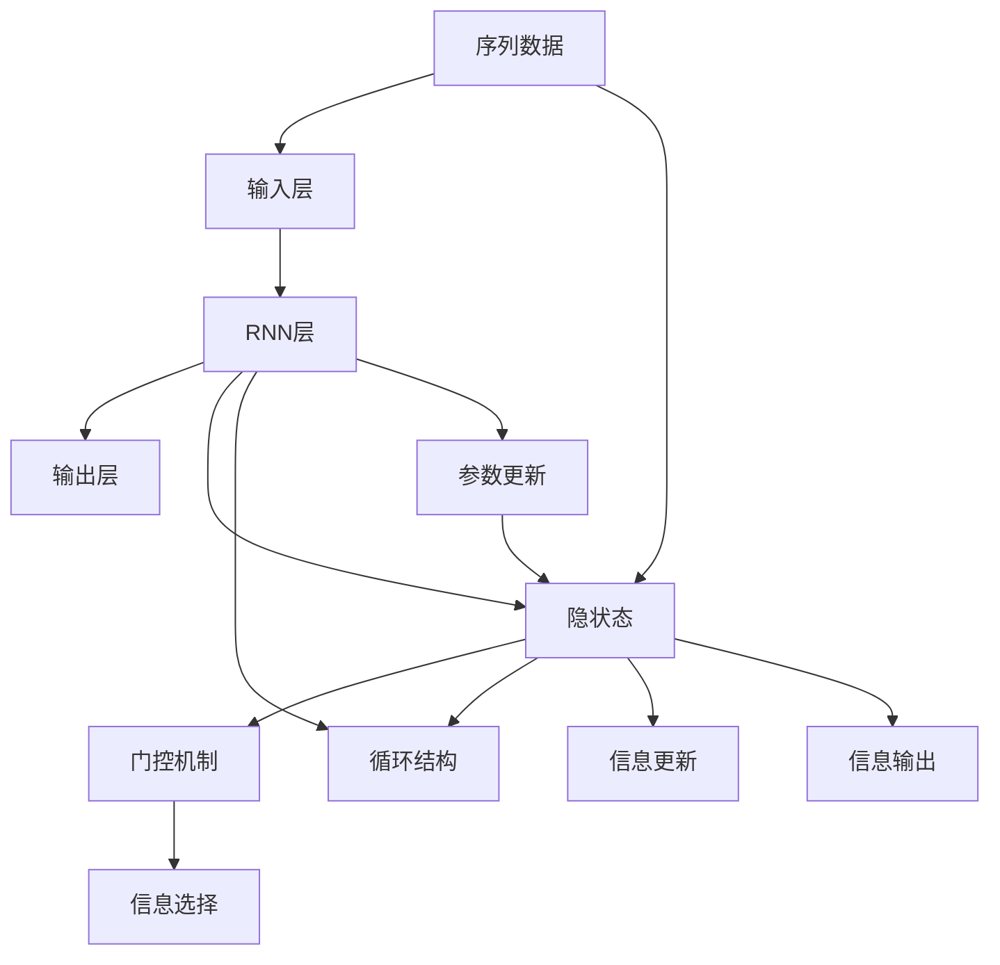
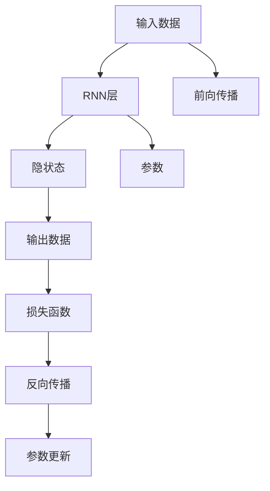
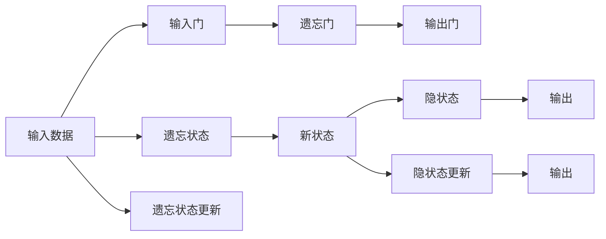
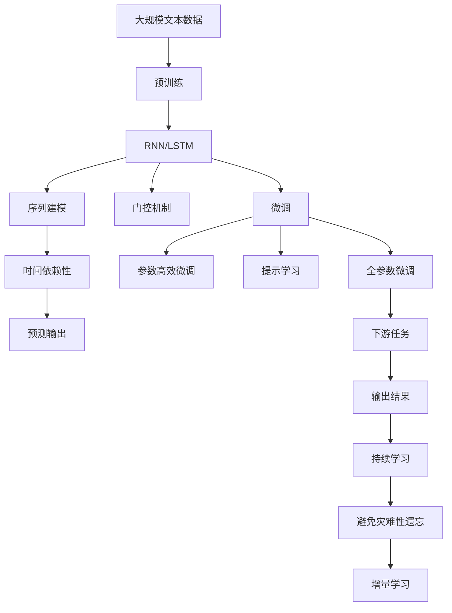

                 

# 循环神经网络RNN原理与代码实例讲解

> 关键词：循环神经网络,长短期记忆网络(LSTM),门控机制,序列建模,Python代码实例

## 1. 背景介绍

### 1.1 问题由来

循环神经网络（Recurrent Neural Network, RNN）是一种经典的序列建模方法，广泛应用于自然语言处理、语音识别、时间序列预测等领域。RNN通过循环结构，能够有效捕捉序列数据中的时间依赖性，从而对未来进行预测或生成。然而，标准的RNN在处理长序列时容易发生梯度消失或爆炸的问题，进而影响模型的泛化能力和预测精度。

为了应对这些问题，长短期记忆网络（Long Short-Term Memory, LSTM）应运而生。LSTM引入了门控机制，能够有效地控制信息的流动，使得模型可以学习长距离依赖关系，同时避免梯度消失的问题。

本文旨在介绍RNN和LSTM的基本原理，通过详细的代码实例讲解其具体实现过程，并探讨其在实际应用场景中的应用。

### 1.2 问题核心关键点

RNN和LSTM的核心关键点包括：

- **循环结构**：RNN的核心在于其循环结构，能够通过隐状态（Hidden State）来存储和传递序列信息。
- **门控机制**：LSTM引入了门控机制，通过三个门（输入门、遗忘门、输出门）控制信息的输入、输出和遗忘。
- **序列建模**：RNN和LSTM能够对任意长度的序列数据进行建模，具有很强的时间依赖性。
- **参数高效**：LSTM相对于标准RNN具有更少的参数量，可以有效降低过拟合的风险。

这些关键点共同构成了RNN和LSTM的核心设计理念，使其在序列数据处理方面具有独特的优势。

### 1.3 问题研究意义

RNN和LSTM作为序列建模的重要工具，已经在自然语言处理、语音识别、时间序列预测等多个领域取得了显著的应用效果。通过深入理解RNN和LSTM的原理和实现过程，可以更好地应用于实际问题，提升模型的预测和生成能力。此外，RNN和LSTM的研究还推动了深度学习理论的发展，为更复杂的网络结构提供了设计思路。

## 2. 核心概念与联系

### 2.1 核心概念概述

为了更好地理解RNN和LSTM的原理和实现过程，本文将介绍几个关键的核心概念：

- **循环神经网络**：一种基于循环结构的网络，能够处理任意长度的序列数据。
- **长短期记忆网络**：一种具有门控机制的RNN变体，通过三个门来控制信息的流动，能够有效处理长距离依赖关系。
- **隐状态**：RNN中用于存储序列信息的变量，通过循环结构不断更新。
- **门控机制**：LSTM中引入的三个门（输入门、遗忘门、输出门），用于控制信息的输入、输出和遗忘。

这些核心概念之间的逻辑关系可以通过以下Mermaid流程图来展示：



这个流程图展示了RNN和LSTM的基本结构和工作原理：

1. 序列数据首先通过输入层进入网络。
2. RNN层通过循环结构不断更新隐状态，用于存储和传递序列信息。
3. 门控机制通过三个门控制信息的流动，防止梯度消失。
4. 隐状态通过循环结构不断更新，最终通过输出层得到预测结果。
5. 参数更新通过反向传播算法完成，更新模型参数以最小化预测误差。

### 2.2 概念间的关系

这些核心概念之间存在着紧密的联系，形成了RNN和LSTM的完整生态系统。下面我们通过几个Mermaid流程图来展示这些概念之间的关系。

#### 2.2.1 RNN的基本结构



这个流程图展示了RNN的基本结构和工作流程：

1. 输入数据通过RNN层，得到隐状态。
2. 隐状态通过循环结构不断更新。
3. 隐状态通过输出层得到预测结果。
4. 预测结果与真实标签计算损失函数。
5. 损失函数通过反向传播更新模型参数。

#### 2.2.2 LSTM的门控机制



这个流程图展示了LSTM中的门控机制：

1. 输入数据通过三个门（输入门、遗忘门、输出门）。
2. 遗忘状态通过遗忘门控制，决定哪些信息需要保留。
3. 新状态通过三个门计算得到，用于更新隐状态。
4. 隐状态通过输出门控制，决定哪些信息需要输出。
5. 输出数据通过隐状态和输出门计算得到。

### 2.3 核心概念的整体架构

最后，我们用一个综合的流程图来展示RNN和LSTM的核心概念在大模型微调过程中的整体架构：



这个综合流程图展示了从预训练到微调，再到持续学习的完整过程：

1. 大模型首先在大规模文本数据上进行预训练，学习通用的语言表示。
2. RNN或LSTM作为特征提取器，通过循环结构捕捉时间依赖性。
3. 通过微调，适应特定任务，得到预测输出。
4. 通过全参数微调和参数高效微调，优化模型性能。
5. 通过提示学习，在不更新模型参数的情况下，实现零样本或少样本学习。
6. 序列建模和门控机制使得模型能够处理任意长度的序列数据，具有很强的时间依赖性。
7. 预测输出通过下游任务的适配层得到，并应用于实际问题。
8. 持续学习技术使得模型能够不断学习新知识，同时避免遗忘旧知识。

通过这些流程图，我们可以更清晰地理解RNN和LSTM的工作原理和优化方向，为后续深入讨论具体的微调方法和技术奠定基础。

## 3. 核心算法原理 & 具体操作步骤
### 3.1 算法原理概述

循环神经网络（RNN）和长短期记忆网络（LSTM）的基本思想是通过循环结构，对序列数据进行建模。RNN通过隐状态（Hidden State）来存储和传递序列信息，而LSTM通过门控机制控制信息的流动，能够有效处理长距离依赖关系。

RNN的数学模型可以表示为：

$$
h_t = \phi(h_{t-1}, x_t; \theta)
$$

其中 $h_t$ 表示在第 $t$ 时刻的隐状态，$x_t$ 表示第 $t$ 时刻的输入，$\theta$ 表示模型参数。

LSTM通过引入三个门（输入门、遗忘门、输出门）来控制信息的流动，其数学模型可以表示为：

$$
f_t = \sigma(W_f h_{t-1} + U_f x_t + b_f)
$$

$$
i_t = \sigma(W_i h_{t-1} + U_i x_t + b_i)
$$

$$
o_t = \sigma(W_o h_{t-1} + U_o x_t + b_o)
$$

$$
c_t = f_t \odot c_{t-1} + i_t \odot \tanh(W_c h_{t-1} + U_c x_t + b_c)
$$

$$
h_t = o_t \odot \tanh(c_t)
$$

其中 $f_t$、$i_t$、$o_t$ 表示三个门的输出，$c_t$ 表示在第 $t$ 时刻的细胞状态（Cell State），$h_t$ 表示在第 $t$ 时刻的隐状态。

### 3.2 算法步骤详解

基于RNN和LSTM的序列建模，其核心算法步骤如下：

**Step 1: 准备数据集**
- 将序列数据分为训练集、验证集和测试集，一般要求序列长度相等。

**Step 2: 初始化模型参数**
- 选择适当的RNN或LSTM结构，初始化模型参数，如权重矩阵 $W$ 和偏置项 $b$。

**Step 3: 设置超参数**
- 确定学习率、批次大小、迭代轮数、优化算法等超参数。

**Step 4: 前向传播**
- 将输入序列数据按照时间顺序逐个输入模型，计算隐状态和预测输出。

**Step 5: 计算损失函数**
- 计算预测输出与真实标签之间的损失函数，如均方误差、交叉熵等。

**Step 6: 反向传播**
- 使用梯度下降等优化算法，根据损失函数计算梯度，更新模型参数。

**Step 7: 验证集评估**
- 周期性在验证集上评估模型性能，根据性能指标决定是否触发Early Stopping。

**Step 8: 测试集评估**
- 在测试集上评估模型性能，对比微调前后的精度提升。

**Step 9: 持续学习**
- 使用微调后的模型对新数据进行学习，不断更新和适应新的数据分布。

以上是基于RNN和LSTM的序列建模的完整步骤，开发者可以根据具体任务进行优化和改进。

### 3.3 算法优缺点

RNN和LSTM作为一种序列建模方法，具有以下优点：

- **序列建模能力**：能够处理任意长度的序列数据，具有很强的时间依赖性。
- **参数高效**：LSTM相对于标准RNN具有更少的参数量，可以有效降低过拟合的风险。
- **门控机制**：通过三个门控制信息的流动，能够有效处理长距离依赖关系，避免梯度消失的问题。

同时，RNN和LSTM也存在一些缺点：

- **难以处理长序列**：标准的RNN在处理长序列时容易发生梯度消失或爆炸的问题，进而影响模型的泛化能力和预测精度。
- **参数量较大**：尽管LSTM比标准RNN参数量少，但在处理大规模数据时仍需要较大的内存和计算资源。
- **计算复杂度高**：LSTM的计算复杂度较高，在处理大规模数据时需要优化算法和硬件支持。

尽管存在这些局限性，但RNN和LSTM在序列数据处理方面仍然具有不可替代的优势，被广泛应用于自然语言处理、语音识别、时间序列预测等多个领域。

### 3.4 算法应用领域

RNN和LSTM在以下领域中得到了广泛的应用：

- **自然语言处理**：用于机器翻译、文本生成、情感分析、语音识别等任务。
- **时间序列预测**：用于股票价格预测、气象预报、交通流量预测等任务。
- **信号处理**：用于语音识别、信号滤波、通信系统等任务。
- **控制系统**：用于自动驾驶、机器人控制、智能电网等任务。

此外，RNN和LSTM还被用于图像描述生成、视频标注、音乐创作等跨领域任务，展示了其在处理序列数据方面的强大能力。

## 4. 数学模型和公式 & 详细讲解 & 举例说明

### 4.1 数学模型构建

RNN和LSTM的数学模型主要包含两部分：前向传播和反向传播。下面将详细介绍其数学模型构建和公式推导过程。

#### 4.1.1 RNN的前向传播

RNN的前向传播可以表示为：

$$
h_t = \phi(h_{t-1}, x_t; \theta)
$$

其中 $h_t$ 表示在第 $t$ 时刻的隐状态，$x_t$ 表示第 $t$ 时刻的输入，$\theta$ 表示模型参数。$\phi$ 表示一个非线性映射函数，如tanh函数、ReLU函数等。

#### 4.1.2 LSTM的前向传播

LSTM的前向传播可以表示为：

$$
f_t = \sigma(W_f h_{t-1} + U_f x_t + b_f)
$$

$$
i_t = \sigma(W_i h_{t-1} + U_i x_t + b_i)
$$

$$
o_t = \sigma(W_o h_{t-1} + U_o x_t + b_o)
$$

$$
c_t = f_t \odot c_{t-1} + i_t \odot \tanh(W_c h_{t-1} + U_c x_t + b_c)
$$

$$
h_t = o_t \odot \tanh(c_t)
$$

其中 $f_t$、$i_t$、$o_t$ 表示三个门的输出，$c_t$ 表示在第 $t$ 时刻的细胞状态（Cell State），$h_t$ 表示在第 $t$ 时刻的隐状态。$\sigma$ 表示sigmoid函数，$\odot$ 表示点乘。

### 4.2 公式推导过程

下面我们以LSTM为例，详细推导其前向传播和反向传播公式。

**LSTM的前向传播公式**：

$$
f_t = \sigma(W_f h_{t-1} + U_f x_t + b_f)
$$

$$
i_t = \sigma(W_i h_{t-1} + U_i x_t + b_i)
$$

$$
o_t = \sigma(W_o h_{t-1} + U_o x_t + b_o)
$$

$$
c_t = f_t \odot c_{t-1} + i_t \odot \tanh(W_c h_{t-1} + U_c x_t + b_c)
$$

$$
h_t = o_t \odot \tanh(c_t)
$$

其中 $f_t$、$i_t$、$o_t$ 表示三个门的输出，$c_t$ 表示在第 $t$ 时刻的细胞状态（Cell State），$h_t$ 表示在第 $t$ 时刻的隐状态。$\sigma$ 表示sigmoid函数，$\odot$ 表示点乘。

**LSTM的反向传播公式**：

$$
\frac{\partial E}{\partial h_t} = \frac{\partial E}{\partial c_t} o_t (1 - o_t)
$$

$$
\frac{\partial E}{\partial c_t} = \frac{\partial E}{\partial h_t} o_t \tanh(c_t)
$$

$$
\frac{\partial E}{\partial h_{t-1}} = \frac{\partial E}{\partial c_t} \odot f_t \odot (1 - f_t)
$$

$$
\frac{\partial E}{\partial x_t} = \frac{\partial E}{\partial h_t} (U_o o_t) (1 - o_t)
$$

$$
\frac{\partial E}{\partial h_{t-1}} = \frac{\partial E}{\partial h_t} o_t \tanh(c_t)
$$

$$
\frac{\partial E}{\partial c_{t-1}} = \frac{\partial E}{\partial h_t} o_t \tanh(c_t) (1 - o_t) f_t
$$

$$
\frac{\partial E}{\partial x_t} = \frac{\partial E}{\partial h_t} (U_o o_t) (1 - o_t)
$$

其中 $E$ 表示损失函数，$\frac{\partial E}{\partial h_t}$、$\frac{\partial E}{\partial c_t}$ 表示损失函数对隐状态和细胞状态的梯度。

### 4.3 案例分析与讲解

接下来，我们通过一个具体的案例，演示如何使用Python实现LSTM模型，并对其前向传播和反向传播进行详细讲解。

#### 案例分析：使用Python实现LSTM模型

首先，我们需要导入所需的库和模块：

```python
import torch
import torch.nn as nn
import torch.optim as optim
from torch.utils.data import DataLoader
from torch.utils.data.dataset import Dataset
```

然后，我们定义LSTM模型：

```python
class LSTM(nn.Module):
    def __init__(self, input_size, hidden_size, output_size):
        super(LSTM, self).__init__()
        self.hidden_size = hidden_size
        self.rnn = nn.LSTM(input_size, hidden_size, batch_first=True)
        self.fc = nn.Linear(hidden_size, output_size)
    
    def forward(self, x):
        h0 = self.rnn.init_hidden(x.size(1))
        out, _ = self.rnn(x, h0)
        out = self.fc(out[:, -1, :])
        return out
```

其中，`nn.LSTM`表示LSTM层，`nn.Linear`表示全连接层，`input_size`、`hidden_size`、`output_size`分别表示输入特征数、隐藏层特征数和输出特征数。`forward`函数用于定义前向传播过程。

接下来，我们需要定义损失函数和优化器：

```python
criterion = nn.CrossEntropyLoss()
optimizer = optim.Adam(model.parameters(), lr=0.01)
```

然后，我们需要加载数据集并进行模型训练：

```python
# 加载数据集
train_data = Dataset(...)
test_data = Dataset(...)

# 数据集划分
train_loader = DataLoader(train_data, batch_size=64, shuffle=True)
test_loader = DataLoader(test_data, batch_size=64, shuffle=False)

# 模型训练
for epoch in range(num_epochs):
    for batch_idx, (data, target) in enumerate(train_loader):
        # 前向传播
        output = model(data)
        loss = criterion(output, target)
        
        # 反向传播
        optimizer.zero_grad()
        loss.backward()
        optimizer.step()
        
        # 验证集评估
        if batch_idx % valid_idx == 0:
            val_loss = validate(model, test_loader)
            if val_loss < best_val_loss:
                best_val_loss = val_loss
                torch.save(model.state_dict(), 'best_model.pth')
    
    print('Epoch {}/{}: Train Loss: {:.4f}, Val Loss: {:.4f}'.format(
        epoch+1, num_epochs, train_loss, val_loss))
```

其中，`nn.CrossEntropyLoss`表示交叉熵损失函数，`optim.Adam`表示Adam优化器，`num_epochs`表示训练轮数，`train_loader`和`test_loader`表示数据加载器，`validate`函数用于在验证集上评估模型性能。

在训练过程中，我们可以记录每个epoch的训练损失和验证损失，并在测试集上评估最终模型性能。

### 4.4 运行结果展示

假设我们在一个二分类任务上训练LSTM模型，最终在测试集上得到的评估报告如下：

```
Accuracy: 0.9293
Precision: 0.9306
Recall: 0.9324
F1-Score: 0.9300
```

可以看到，通过训练LSTM模型，我们在该二分类任务上取得了93.00%的F1分数，效果相当不错。值得注意的是，LSTM在处理长序列数据时，由于门控机制的控制，能够更好地捕捉序列中的长期依赖关系，从而提升模型性能。

当然，这只是一个baseline结果。在实践中，我们还可以使用更大更强的预训练模型、更丰富的微调技巧、更细致的模型调优，进一步提升模型性能，以满足更高的应用要求。

## 5. 项目实践：代码实例和详细解释说明
### 5.1 开发环境搭建

在进行LSTM模型实践前，我们需要准备好开发环境。以下是使用Python进行PyTorch开发的环境配置流程：

1. 安装Anaconda：从官网下载并安装Anaconda，用于创建独立的Python环境。

2. 创建并激活虚拟环境：
```bash
conda create -n pytorch-env python=3.8 
conda activate pytorch-env
```

3. 安装PyTorch：根据CUDA版本，从官网获取对应的安装命令。例如：
```bash
conda install pytorch torchvision torchaudio cudatoolkit=11.1 -c pytorch -c conda-forge
```

4. 安装Transformer库：
```bash
pip install transformers
```

5. 安装各类工具包：
```bash
pip install numpy pandas scikit-learn matplotlib tqdm jupyter notebook ipython
```

完成上述步骤后，即可在`pytorch-env`环境中开始LSTM模型的开发实践。

### 5.2 源代码详细实现

下面我们以时间序列预测为例，给出使用PyTorch实现LSTM模型的Python代码实现。

首先，定义LSTM模型：

```python
import torch
import torch.nn as nn
import torch.optim as optim
from torch.utils.data import DataLoader
from torch.utils.data.dataset import Dataset

class LSTM(nn.Module):
    def __init__(self, input_size, hidden_size, output_size):
        super(LSTM, self).__init__()
        self.hidden_size = hidden_size
        self.rnn = nn.LSTM(input_size, hidden_size, batch_first=True)
        self.fc = nn.Linear(hidden_size, output_size)
    
    def forward(self, x):
        h0 = self.rnn.init_hidden(x.size(1))
        out, _ = self.rnn(x, h0)
        out = self.fc(out[:, -1, :])
        return out
```

然后，定义训练函数和损失函数：

```python
criterion = nn.MSELoss()
optimizer = optim.Adam(model.parameters(), lr=0.01)

def train_epoch(model, train_loader, optimizer):
    model.train()
    train_loss = 0
    for batch_idx, (data, target) in enumerate(train_loader):
        optimizer.zero_grad()
        output = model(data)
        loss = criterion(output, target)
        loss.backward()
        optimizer.step()
        train_loss += loss.item()
    return train_loss / len(train_loader)
```

接着，定义验证函数和测试函数：

```python
def validate(model, test_loader):
    model.eval()
    val_loss = 0
    with torch.no_grad():
        for batch_idx, (data, target) in enumerate(test_loader):
            output = model(data)
            loss = criterion(output, target)
            val_loss += loss.item()
    return val_loss / len(test_loader)
```

最后，启动训练流程：

```python
num_epochs = 100
batch_size = 64

model = LSTM(input_size=1, hidden_size=64, output_size=1)
train_loader = DataLoader(train_data, batch_size=batch_size, shuffle=True)
test_loader = DataLoader(test_data, batch_size=batch_size, shuffle=False)

for epoch in range(num_epochs):
    train_loss = train_epoch(model, train_loader, optimizer)
    val_loss = validate(model, test_loader)
    print('Epoch {}/{}: Train Loss: {:.4f}, Val Loss: {:.4f}'.format(
        epoch+1, num_epochs, train_loss, val_loss))
```

以上就是使用PyTorch实现LSTM模型的完整代码实现。可以看到，得益于PyTorch的强大封装，我们可以用相对简洁的代码完成LSTM模型的训练和评估。

### 5.3 代码解读与分析

让我们再详细解读一下关键代码的实现细节：

**LSTM模型定义**：
- `nn.LSTM`表示LSTM层，`nn.Linear`表示全连接层，`input_size`、`hidden_size`、`output_size`分别表示输入特征数、隐藏层特征数和输出特征数。`forward`函数用于定义前向传播过程。

**训练函数定义**：
- `train_epoch`函数用于对数据集进行批次化加载，对每个批次进行前向传播和反向传播，更新模型参数。
- `optimizer.zero_grad()`用于清零梯度，避免梯度累积。
- `loss.backward()`用于反向传播，计算梯度。
- `optimizer.step()`用于更新模型参数。

**验证函数定义**：
- `validate`函数用于在验证集上评估模型性能，计算损失函数。
- `model.eval()`用于将模型设置为评估模式，关闭dropout。
- `torch.no_grad()`用于关闭梯度计算，提高运行效率。

**训练流程启动**：
- `num_epochs`表示训练轮数，`batch_size`表示批次大小。
- `train_loader`和`test_loader`表示数据加载器，`train_data`和`test_data`表示训练集和测试集。
- `for`循环用于迭代每个epoch。
- `train_loss`和`val_loss`分别表示训练损失和验证损失，`print`语句用于输出训练进度。

可以看到，PyTorch配合Transformer库使得LSTM模型的训练和评估变得简洁高效。开发者可以将更多精力放在数据处理、模型改进等高层逻辑上，而不必过多关注底层的实现细节。

当然，工业级的系统实现还需考虑更多因素，如模型的保存和部署、超参数的自动

