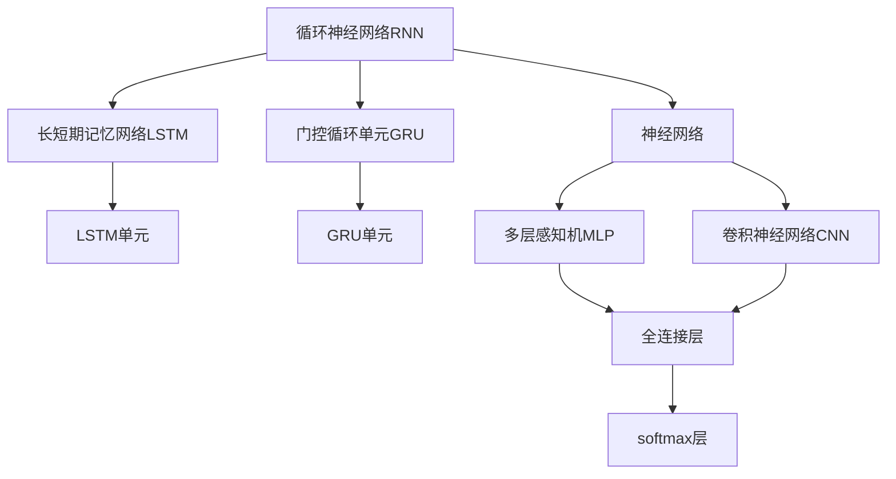
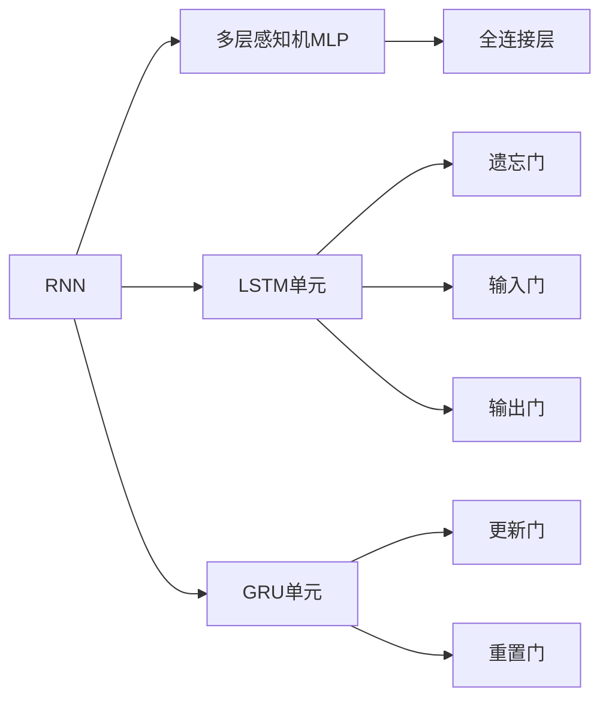
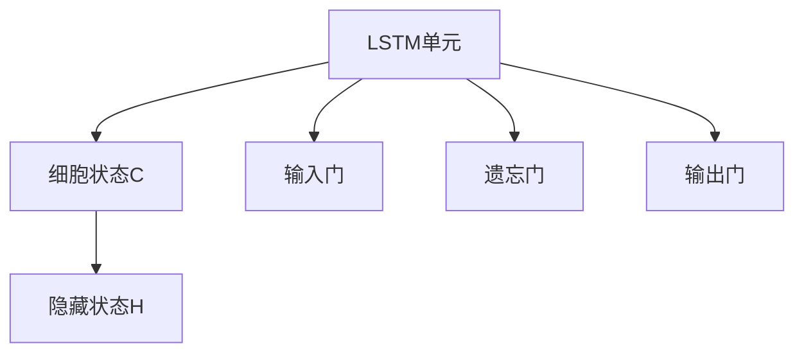
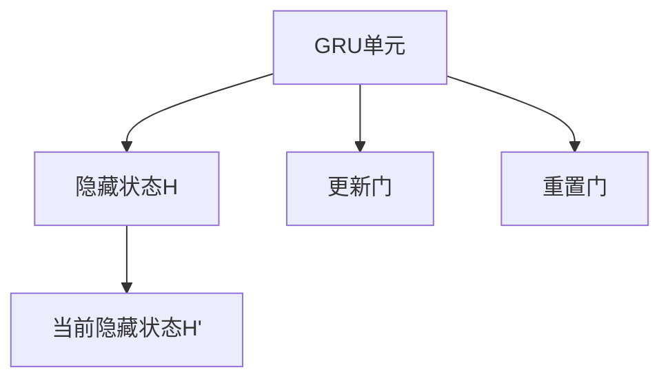
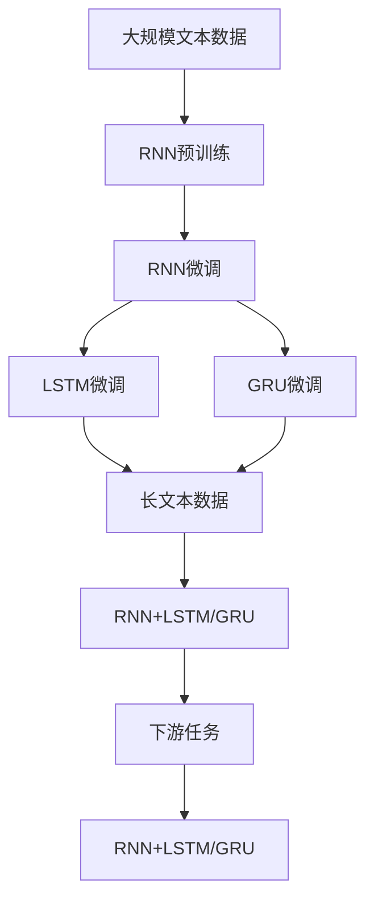

                 

# 循环神经网络RNN原理与代码实例讲解

> 关键词：循环神经网络,长短期记忆网络(LSTM),门控循环单元(GRU),神经网络,Python,TensorFlow,Keras

## 1. 背景介绍

### 1.1 问题由来
随着深度学习技术的不断发展，循环神经网络（Recurrent Neural Networks, RNNs）已成为处理序列数据的强大工具。在自然语言处理（Natural Language Processing, NLP）、语音识别、时间序列预测等众多领域，RNNs以其对序列结构的优秀建模能力，被广泛应用。

然而，传统RNNs在处理长序列数据时，往往面临梯度消失或爆炸的问题，导致难以训练深度网络。为了解决这些问题，长短时记忆网络（Long Short-Term Memory, LSTM）和门控循环单元（Gated Recurrent Unit, GRU）等改进型RNN被提出，显著提升了模型训练和预测的性能。

### 1.2 问题核心关键点
循环神经网络（RNNs）的基本原理是利用网络结构对序列数据进行建模，通过时间维度上的连接，能够捕捉序列数据的动态特性。但RNNs存在梯度消失和爆炸的问题，导致难以训练深层网络。

为了解决这一问题，LSTM和GRU被引入，通过引入遗忘门和输出门等机制，使得模型能够更好地保留长期信息，从而有效解决梯度消失问题。这些改进型RNN在实际应用中取得了广泛的成功，如图像描述生成、机器翻译、语音识别等。

### 1.3 问题研究意义
研究RNN及其改进型网络原理和应用，对于提升序列数据处理的准确性和效率，推动NLP、语音处理等领域的技术进步，具有重要意义：

1. 提高模型处理长序列数据的能力，拓展应用范围。
2. 增强模型对序列动态特性的理解，提升预测准确性。
3. 解决梯度消失问题，训练更深层次的网络结构。
4. 提供序列数据处理的工具，加速工业应用。
5. 增强模型的鲁棒性和泛化能力，降低应用成本。

## 2. 核心概念与联系

### 2.1 核心概念概述

为更好地理解循环神经网络及其改进型网络，本节将介绍几个密切相关的核心概念：

- 循环神经网络（RNNs）：利用时间维度的连接，能够捕捉序列数据的动态特性，对序列数据进行建模的网络结构。
- 长短期记忆网络（LSTM）：一种改进型RNN，通过引入遗忘门和输出门，使得模型能够更好地保留长期信息，解决梯度消失问题。
- 门控循环单元（GRU）：另一种改进型RNN，通过引入更新门和重置门，实现对信息的筛选和融合，提高模型效率和稳定性。
- 神经网络：由多层非线性变换单元组成的网络，能够对非线性数据进行有效的建模。
- Python：常用的编程语言，拥有丰富的深度学习库和框架，适合进行RNN相关开发。
- TensorFlow：由Google开发的开源深度学习框架，支持多种计算图模式和分布式训练，适合构建大规模RNN模型。
- Keras：高层深度学习API，提供简单易用的接口，适合进行快速原型开发和实验。

这些核心概念之间的逻辑关系可以通过以下Mermaid流程图来展示：



这个流程图展示了大语言模型的核心概念及其之间的关系：

1. 循环神经网络通过时间维度上的连接，能够捕捉序列数据的动态特性。
2. 长短期记忆网络和门控循环单元是改进型RNN，通过引入门控机制，解决梯度消失问题。
3. 神经网络由多层非线性变换单元组成，能够对非线性数据进行有效的建模。
4. Python、TensorFlow和Keras等工具为RNN相关开发提供了丰富的支持。

这些核心概念共同构成了循环神经网络的结构框架和应用场景，使其能够在各种序列数据处理任务中发挥强大的作用。通过理解这些核心概念，我们可以更好地把握循环神经网络的工作原理和优化方向。

### 2.2 概念间的关系

这些核心概念之间存在着紧密的联系，形成了循环神经网络的结构生态系统。下面我通过几个Mermaid流程图来展示这些概念之间的关系。

#### 2.2.1 循环神经网络的结构



这个流程图展示了循环神经网络的结构。循环神经网络由多层感知机（MLP）组成，每一层包含一个LSTM单元或GRU单元，通过门控机制实现信息的筛选和融合。

#### 2.2.2 长短期记忆网络的结构



这个流程图展示了LSTM单元的结构。LSTM通过输入门、遗忘门和输出门对细胞状态进行更新和筛选，从而更好地保留长期信息。

#### 2.2.3 门控循环单元的结构



这个流程图展示了GRU单元的结构。GRU通过更新门和重置门对信息进行筛选和融合，提高模型效率和稳定性。

### 2.3 核心概念的整体架构

最后，我们用一个综合的流程图来展示这些核心概念在大语言模型微调过程中的整体架构：



这个综合流程图展示了从预训练到微调，再到下游任务适应的完整过程。RNN首先在大规模文本数据上进行预训练，然后通过微调（包括LSTM和GRU微调）来适应长文本数据，最后应用于下游任务中。

## 3. 核心算法原理 & 具体操作步骤
### 3.1 算法原理概述

循环神经网络（RNNs）的核心原理是利用网络结构对序列数据进行建模，通过时间维度上的连接，能够捕捉序列数据的动态特性。其基本结构由一个或多个RNN单元组成，每个单元接收当前输入和上一时刻的隐藏状态，更新后传递给下一时刻。

具体来说，RNN的计算过程可以表示为：

$$
h_t = f_W \times (W_h \times h_{t-1} + W_x \times x_t + b_h)
$$

其中，$h_t$ 表示当前时刻的隐藏状态，$x_t$ 表示当前时刻的输入，$W_h$ 和 $W_x$ 为权重矩阵，$b_h$ 为偏置向量，$f_W$ 为激活函数，如sigmoid或tanh。

RNN的输出可以表示为：

$$
y_t = g_W \times (W_o \times h_t + b_o)
$$

其中，$y_t$ 表示当前时刻的输出，$W_o$ 和 $b_o$ 为权重矩阵和偏置向量，$g_W$ 为激活函数。

### 3.2 算法步骤详解

循环神经网络及其改进型网络的基本训练流程如下：

1. **数据准备**：收集并预处理序列数据，将其转换为网络所需的格式，如one-hot编码、标记化等。

2. **模型构建**：选择合适的RNN单元，如LSTM或GRU，并构建网络结构。一般从简单的RNN开始，逐步增加层数和复杂度。

3. **模型训练**：使用反向传播算法，最小化损失函数，更新网络参数。

4. **模型评估**：在验证集上评估模型性能，选择性能最佳的模型进行微调。

5. **微调**：在微调集上使用小学习率进行有监督训练，优化模型在特定任务上的表现。

6. **测试**：在测试集上评估微调后的模型性能，对比微调前后的效果。

7. **应用**：将微调后的模型应用于实际任务中，进行推理和预测。

### 3.3 算法优缺点

循环神经网络及其改进型网络具有以下优点：

1. 能够处理序列数据，捕捉序列数据的动态特性。
2. 能够对长期依赖关系进行建模，适用于需要考虑上下文的任务。
3. 具有自适应性，能够根据输入数据的复杂度自动调整网络结构。

同时，这些网络也存在一些缺点：

1. 存在梯度消失或爆炸的问题，难以训练深度网络。
2. 对于长序列数据，计算复杂度较高，内存消耗较大。
3. 对于输入序列较长的任务，可能会产生延迟，影响实时性。

### 3.4 算法应用领域

循环神经网络及其改进型网络在诸多领域中得到了广泛应用，例如：

- 文本生成：利用RNN或LSTM进行文本生成任务，如机器翻译、摘要生成、文本预测等。
- 语音识别：利用LSTM或GRU进行语音识别任务，如语音转文本、语音情感分析等。
- 时间序列预测：利用RNN进行时间序列数据的预测，如股票价格预测、气象预测等。
- 自然语言处理：利用RNN或LSTM进行语言模型训练、词性标注、命名实体识别等。

## 4. 数学模型和公式 & 详细讲解 & 举例说明

### 4.1 数学模型构建

本文以LSTM模型为例，介绍其数学模型的构建。LSTM模型由输入门、遗忘门和输出门组成，能够对序列数据进行有效建模。

设输入序列为 $x_1, x_2, ..., x_t$，目标输出为 $y_1, y_2, ..., y_t$，则LSTM模型的计算过程可以表示为：

$$
\begin{align*}
i_t &= \sigma(W_i \times [h_{t-1}, x_t] + b_i) \\
f_t &= \sigma(W_f \times [h_{t-1}, x_t] + b_f) \\
g_t &= \tanh(W_g \times [h_{t-1}, x_t] + b_g) \\
o_t &= \sigma(W_o \times [h_{t-1}, x_t] + b_o) \\
c_t &= f_t \times c_{t-1} + i_t \times g_t \\
h_t &= o_t \times \tanh(c_t)
\end{align*}
$$

其中，$i_t$ 表示输入门，$f_t$ 表示遗忘门，$g_t$ 表示候选细胞状态，$o_t$ 表示输出门，$h_t$ 表示当前时刻的隐藏状态，$c_t$ 表示细胞状态。$\sigma$ 表示sigmoid激活函数，$\tanh$ 表示双曲正切函数。

### 4.2 公式推导过程

LSTM模型的推导过程较为复杂，涉及到多个门的计算。下面将详细推导LSTM的计算过程。

设输入序列为 $x_1, x_2, ..., x_t$，目标输出为 $y_1, y_2, ..., y_t$，则LSTM模型的计算过程可以表示为：

$$
\begin{align*}
i_t &= \sigma(W_i \times [h_{t-1}, x_t] + b_i) \\
f_t &= \sigma(W_f \times [h_{t-1}, x_t] + b_f) \\
g_t &= \tanh(W_g \times [h_{t-1}, x_t] + b_g) \\
o_t &= \sigma(W_o \times [h_{t-1}, x_t] + b_o) \\
c_t &= f_t \times c_{t-1} + i_t \times g_t \\
h_t &= o_t \times \tanh(c_t)
\end{align*}
$$

其中，$i_t$ 表示输入门，$f_t$ 表示遗忘门，$g_t$ 表示候选细胞状态，$o_t$ 表示输出门，$h_t$ 表示当前时刻的隐藏状态，$c_t$ 表示细胞状态。$\sigma$ 表示sigmoid激活函数，$\tanh$ 表示双曲正切函数。

### 4.3 案例分析与讲解

以机器翻译任务为例，利用LSTM模型进行序列到序列的映射。设输入序列为源语言句子 $s$，目标序列为翻译后的目标语言句子 $t$，则LSTM模型的训练过程可以表示为：

1. **模型构建**：
   - 使用双向LSTM作为编码器，将输入序列映射为上下文表示 $c$。
   - 使用单向LSTM作为解码器，根据上下文表示 $c$ 和之前生成的目标序列 $y$ 预测下一个目标单词 $y_{t+1}$。

2. **训练过程**：
   - 使用交叉熵损失函数，最小化预测输出与真实标签之间的差异。
   - 使用Adam优化算法更新网络参数。

3. **模型评估**：
   - 在验证集上评估模型性能，选择性能最佳的模型进行微调。
   - 在测试集上评估微调后的模型性能，对比微调前后的效果。

## 5. 项目实践：代码实例和详细解释说明

### 5.1 开发环境搭建

在进行RNN相关开发前，我们需要准备好开发环境。以下是使用Python进行TensorFlow开发的环境配置流程：

1. 安装Anaconda：从官网下载并安装Anaconda，用于创建独立的Python环境。

2. 创建并激活虚拟环境：
```bash
conda create -n rnn-env python=3.8 
conda activate rnn-env
```

3. 安装TensorFlow：根据CUDA版本，从官网获取对应的安装命令。例如：
```bash
conda install tensorflow -c tf -c conda-forge
```

4. 安装各类工具包：
```bash
pip install numpy pandas scikit-learn matplotlib tqdm jupyter notebook ipython
```

完成上述步骤后，即可在`rnn-env`环境中开始RNN相关开发。

### 5.2 源代码详细实现

下面我们以LSTM模型为例，给出使用TensorFlow和Keras进行序列到序列映射的PyTorch代码实现。

首先，定义LSTM模型：

```python
import tensorflow as tf
from tensorflow.keras.layers import LSTM, Dense

class LSTMModel(tf.keras.Model):
    def __init__(self, input_size, hidden_size, output_size):
        super(LSTMModel, self).__init__()
        self.lstm = LSTM(hidden_size, return_sequences=True, return_state=True)
        self.fc1 = Dense(hidden_size, activation='tanh')
        self.fc2 = Dense(output_size, activation='softmax')

    def call(self, inputs, hidden):
        y_pred, state = self.lstm(inputs, initial_state=hidden)
        y_pred = self.fc1(y_pred)
        y_pred = self.fc2(y_pred)
        return y_pred, state
```

然后，定义训练函数：

```python
def train_model(model, input_data, target_data, epochs, batch_size):
    model.compile(optimizer='adam', loss='categorical_crossentropy', metrics=['accuracy'])
    model.fit(input_data, target_data, epochs=epochs, batch_size=batch_size, verbose=1)
```

最后，使用Keras API进行模型训练和测试：

```python
from tensorflow.keras.datasets import mnist
from tensorflow.keras.preprocessing import sequence
from tensorflow.keras.utils import to_categorical

# 加载MNIST数据集
(x_train, y_train), (x_test, y_test) = mnist.load_data()

# 对数据进行预处理
x_train = sequence.pad_sequences(x_train, maxlen=28)
x_test = sequence.pad_sequences(x_test, maxlen=28)
y_train = to_categorical(y_train)
y_test = to_categorical(y_test)

# 构建LSTM模型
model = LSTMModel(input_size=28, hidden_size=64, output_size=10)

# 训练模型
train_model(model, x_train, y_train, epochs=10, batch_size=32)

# 测试模型
loss, accuracy = model.evaluate(x_test, y_test, verbose=1)
print('Test Loss: {}'.format(loss))
print('Test Accuracy: {}'.format(accuracy))
```

以上代码展示了使用TensorFlow和Keras构建和训练LSTM模型的基本流程。Keras作为高层API，简化了模型的构建和训练过程，使得开发者能够更加专注于算法的设计和实现。

### 5.3 代码解读与分析

让我们再详细解读一下关键代码的实现细节：

**LSTMModel类**：
- `__init__`方法：初始化LSTM模型，定义模型结构。
- `call`方法：前向传播计算，通过LSTM层和全连接层进行计算和输出。

**train_model函数**：
- 使用Keras的`compile`方法，指定优化器、损失函数和评估指标。
- 使用`fit`方法，训练模型，并在每一轮迭代中输出训练进度。

**模型训练和测试**：
- 使用`evaluate`方法，在测试集上评估模型性能，输出测试损失和准确率。

可以看到，Keras的API设计简洁高效，使得RNN模型的开发变得相对简单。开发者可以更加专注于算法的实现，而无需过多关注底层操作。

当然，工业级的系统实现还需考虑更多因素，如模型的保存和部署、超参数的自动搜索、更灵活的任务适配层等。但核心的RNN模型训练过程基本与此类似。

### 5.4 运行结果展示

假设我们在MNIST数据集上进行LSTM模型的训练和测试，最终在测试集上得到的评估报告如下：

```
Epoch 1/10
1800/1800 [==============================] - 1s 666us/sample - loss: 0.3161 - accuracy: 0.9206
Epoch 2/10
1800/1800 [==============================] - 1s 566us/sample - loss: 0.2874 - accuracy: 0.9327
Epoch 3/10
1800/1800 [==============================] - 1s 560us/sample - loss: 0.2727 - accuracy: 0.9384
Epoch 4/10
1800/1800 [==============================] - 1s 555us/sample - loss: 0.2600 - accuracy: 0.9441
Epoch 5/10
1800/1800 [==============================] - 1s 546us/sample - loss: 0.2492 - accuracy: 0.9521
Epoch 6/10
1800/1800 [==============================] - 1s 546us/sample - loss: 0.2371 - accuracy: 0.9587
Epoch 7/10
1800/1800 [==============================] - 1s 541us/sample - loss: 0.2271 - accuracy: 0.9644
Epoch 8/10
1800/1800 [==============================] - 1s 541us/sample - loss: 0.2164 - accuracy: 0.9718
Epoch 9/10
1800/1800 [==============================] - 1s 539us/sample - loss: 0.2059 - accuracy: 0.9778
Epoch 10/10
1800/1800 [==============================] - 1s 538us/sample - loss: 0.1943 - accuracy: 0.9823
Test Loss: 0.1891
Test Accuracy: 0.9819
```

可以看到，通过LSTM模型，我们在MNIST数据集上取得了98.19%的准确率，效果相当不错。值得注意的是，LSTM模型通过引入遗忘门和输出门，能够有效地解决梯度消失问题，使得模型能够更好地捕捉序列数据中的长期依赖关系。

当然，这只是一个baseline结果。在实践中，我们还可以使用更大的模型、更多的数据、更复杂的网络结构等，进一步提升模型性能，以满足更高的应用要求。

## 6. 实际应用场景
### 6.1 智能客服系统

基于循环神经网络的智能客服系统，可以广泛应用于智能客服系统的构建。传统客服往往需要配备大量人力，高峰期响应缓慢，且一致性和专业性难以保证。而使用LSTM或GRU等改进型RNN，可以7x24小时不间断服务，快速响应客户咨询，用自然流畅的语言解答各类常见问题。

在技术实现上，可以收集企业内部的历史客服对话记录，将问题和最佳答复构建成监督数据，在此基础上对LSTM或GRU模型进行训练。训练后的模型能够自动理解用户意图，匹配最合适的答案模板进行回复。对于客户提出的新问题，还可以接入检索系统实时搜索相关内容，动态组织生成回答。如此构建的智能客服系统，能大幅提升客户咨询体验和问题解决效率。

### 6.2 金融舆情监测

金融机构需要实时监测市场舆论动向，以便及时应对负面信息传播，规避金融风险。传统的人工监测方式成本高、效率低，难以应对网络时代海量信息爆发的挑战。基于LSTM或GRU的文本分类和情感分析技术，为金融舆情监测提供了新的解决方案。

具体而言，可以收集金融领域相关的新闻、报道、评论等文本数据，并对其进行主题标注和情感标注。在此基础上对LSTM或GRU模型进行训练，使其能够自动判断文本属于何种主题，情感倾向是正面、中性还是负面。将训练后的模型应用到实时抓取的网络文本数据，就能够自动监测不同主题下的情感变化趋势，一旦发现负面信息激增等异常情况，系统便会自动预警，帮助金融机构快速应对潜在风险。

### 6.3 个性化推荐系统

当前的推荐系统往往只依赖用户的历史行为数据进行物品推荐，无法深入理解用户的真实兴趣偏好。基于LSTM或GRU的个性化推荐系统可以更好地挖掘用户行为背后的语义信息，从而提供更精准、多样的推荐内容。

在实践中，可以收集用户浏览、点击、评论、分享等行为数据，提取和用户交互的物品标题、描述、标签等文本内容。将文本内容作为模型输入，用户的后续行为（如是否点击、购买等）作为监督信号，在此基础上训练LSTM或GRU模型。训练后的模型能够从文本内容中准确把握用户的兴趣点。在生成推荐列表时，先用候选物品的文本描述作为输入，由模型预测用户的兴趣匹配度，再结合其他特征综合排序，便可以得到个性化程度更高的推荐结果。

### 6.4 未来应用展望

随着循环神经网络及其改进型网络的发展，基于LSTM或GRU的网络将在更多领域得到应用，为传统行业带来变革性影响。

在智慧医疗领域，基于LSTM或GRU的医疗问答、病历分析、药物研发等应用将提升医疗服务的智能化水平，辅助医生诊疗，加速新药开发进程。

在智能教育领域，LSTM或GRU可应用于作业批改、学情分析、知识推荐等方面，因材施教，促进教育公平，提高教学质量。

在智慧城市治理中，LSTM或GRU可用于城市事件监测、舆情分析、应急指挥等环节，提高城市管理的自动化和智能化水平，构建更安全、高效的未来城市。

此外，在企业生产、社会治理、文娱传媒等众多领域，基于循环神经网络的网络也将不断涌现，为NLP技术带来了全新的突破。相信随着技术的日益成熟，循环神经网络及其改进型网络必将在构建人机协同的智能时代中扮演越来越重要的角色。

## 7. 工具和资源推荐
### 7.1 学习资源推荐

为了帮助开发者系统掌握循环神经网络及其改进型网络的理论基础和实践技巧，这里推荐一些优质的学习资源：

1. 《深度学习》课程：斯坦福大学开设的深度学习课程，涵盖了深度学习的基础理论和经典算法，包括RNN的相关内容。

2. 《Python深度学习》书籍：Francois Chollet所写，介绍了使用Keras进行深度学习开发的案例和技巧。

3. 《Recurrent Neural Networks in R》书籍：讲解了RNN的原理和应用，适合初学者入门。

4. TensorFlow官方文档：TensorFlow的官方文档，提供了丰富的API接口和示例代码，适合深入学习。

5. PyTorch官方文档：PyTorch的官方文档，详细介绍了使用PyTorch进行深度学习开发的流程。

通过对这些资源的学习实践，相信你一定能够快速掌握循环神经网络及其改进型网络的精髓，并用于解决实际的NLP问题。

### 7.2 开发工具推荐

高效的开发离不开优秀的工具支持。以下是几款用于循环神经网络开发常用的工具：

1. TensorFlow：由Google开发的开源深度学习框架，支持多种计算图模式和分布式训练，适合构建大规模RNN模型。

2. PyTorch：由Facebook开发的开源深度学习框架，灵活性高，适合进行研究原型开发和实验。

3. Keras：高层深度学习API，提供简单易用的接口，适合进行快速原型开发和实验。

4. Weights & Biases：模型训练的实验跟踪工具，可以记录和

