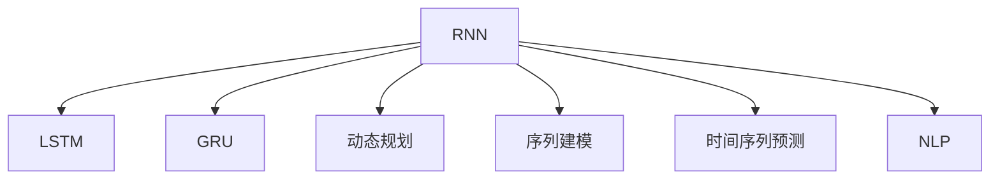
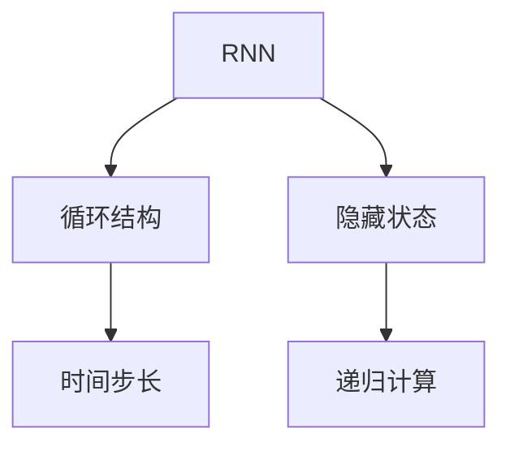
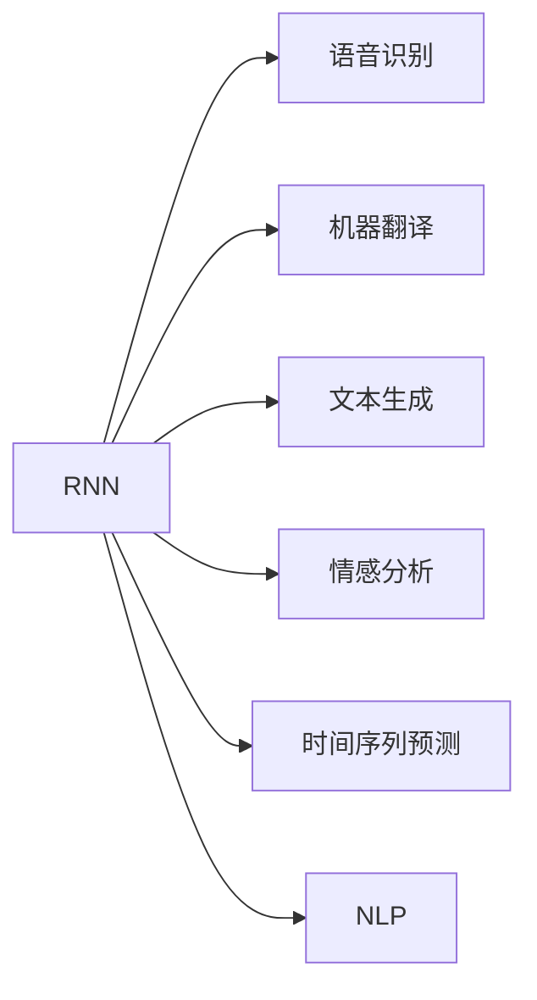

                 

# 循环神经网络RNN原理与代码实例讲解

> 关键词：循环神经网络,长短期记忆网络,递归神经网络,递归神经网络模型,动态规划,序列建模,时间序列预测,自然语言处理,NLP

## 1. 背景介绍

### 1.1 问题由来
在深度学习领域，传统的前馈神经网络（Feedforward Neural Networks, FNNs）因为其简单有效的结构，已经在图像分类、物体识别、语音识别等任务上取得了显著的成果。但这些方法在处理序列数据（如文本、时间序列）时存在较大限制：无法捕捉序列之间的依赖关系。为了解决这个问题，循环神经网络（Recurrent Neural Networks, RNNs）被提出，能够在序列建模中发挥重要作用。

在处理序列数据时，如自然语言处理（NLP）任务，模型需要考虑序列中每个位置的信息，并传递至后一位置，以利用前后文信息。经典的序列建模方法如隐马尔可夫模型（HMMs）、条件随机场（CRFs），均在一定程度上能够处理序列数据，但难以同时考虑长程依赖。RNNs通过在网络中引入循环结构，使得模型能够利用上下文信息，进行序列数据的建模和预测，尤其是对于长序列数据的处理，表现出卓越的能力。

### 1.2 问题核心关键点
RNNs的核心思想是通过循环结构，实现对序列数据的递归处理，从而捕捉时间依赖。但RNNs存在梯度消失或梯度爆炸的问题，难以处理过长的序列。为了解决这一问题，长短时记忆网络（Long Short-Term Memory, LSTM）和门控循环单元（Gated Recurrent Units, GRUs）被提出，引入了门控机制，增强了模型的长期记忆能力，使其能够更好地处理序列数据。

RNNs在NLP领域有广泛应用，如语音识别、机器翻译、文本生成、情感分析等，成为处理序列数据的强有力工具。但RNNs也有其局限性，如计算复杂度高、易过拟合、难以并行化等。

### 1.3 问题研究意义
RNNs的提出，为深度学习在处理序列数据上提供了强大的工具。在NLP领域，RNNs被广泛用于文本分类、情感分析、语言模型等任务，极大地提升了模型的表现。在时间序列预测、语音识别等领域，RNNs也表现出强大的应用潜力。

未来，随着RNNs的不断演进，结合更先进的技术手段，如参数高效优化、知识图谱融合、多模态融合等，RNNs有望在更多领域取得突破性进展，发挥更大的作用。

## 2. 核心概念与联系

### 2.1 核心概念概述

为了更好地理解RNN的原理和应用，本节将介绍几个密切相关的核心概念：

- 循环神经网络（RNNs）：通过引入循环结构，使得模型能够利用上下文信息，处理序列数据。经典的RNNs结构包括RNN模型、LSTM、GRU等。

- 长短时记忆网络（LSTMs）：一种特殊的RNN结构，通过引入门控机制，能够更有效地处理长序列数据，避免了梯度消失问题。

- 门控循环单元（GRUs）：类似于LSTM，通过引入门控机制，使得模型在处理序列数据时能够保留长程依赖，同时减少了模型参数。

- 动态规划（Dynamic Programming）：RNNs的一个核心算法，通过对序列进行递归计算，求解最优解。

- 序列建模（Sequence Modeling）：处理序列数据的基本范式，包括文本、时间序列等。

- 时间序列预测（Time Series Prediction）：利用序列数据进行未来趋势预测，广泛应用于金融、气象等领域。

- 自然语言处理（NLP）：利用机器学习技术处理自然语言数据，如文本分类、情感分析、机器翻译等。

这些核心概念之间的逻辑关系可以通过以下Mermaid流程图来展示：



这个流程图展示了大语言模型微调过程中各个核心概念的关系和作用。

### 2.2 概念间的关系

这些核心概念之间存在着紧密的联系，形成了RNN的完整生态系统。下面我通过几个Mermaid流程图来展示这些概念之间的关系。

#### 2.2.1 RNNs的结构和原理



这个流程图展示了RNNs的基本结构，通过循环结构传递隐藏状态，实现对序列数据的递归计算。

#### 2.2.2 LSTM的详细结构


这个流程图展示了LSTM的基本结构，引入门控机制，增强了对长序列数据的处理能力。

#### 2.2.3 GRU与LSTM的比较


这个流程图展示了GRU的基本结构，与LSTM类似，但参数更少，计算量更小。

#### 2.2.4 RNNs的应用领域



这个流程图展示了RNNs在各个领域的应用，包括语音识别、机器翻译、文本生成等。

## 3. 核心算法原理 & 具体操作步骤
### 3.1 算法原理概述

RNNs通过引入循环结构，使得模型能够利用上下文信息，处理序列数据。假设输入序列为 $x_1,x_2,\dots,x_T$，隐藏状态为 $h_t$，输出序列为 $y_1,y_2,\dots,y_T$，则RNNs的目标是学习一个函数 $h_{t+1}=f(h_t,x_{t+1})$，使得模型能够根据上下文信息，生成下一个时间步的隐藏状态。

在经典的RNN中，隐藏状态 $h_t$ 的计算方式为：

$$
h_t = \tanh(W_h \cdot [h_{t-1},x_t]+b_h)
$$

其中，$W_h$ 和 $b_h$ 为隐藏状态对应的权重和偏置。这个计算过程可以看作是对输入 $x_t$ 和前一时间步的隐藏状态 $h_{t-1}$ 的加权求和，再通过激活函数 $\tanh$ 进行非线性变换。

在输出层，RNNs的目标是学习一个函数 $y_t=g(h_t)$，使得模型能够根据隐藏状态生成输出序列 $y_t$。常见的输出层函数包括softmax函数，用于多分类任务。

### 3.2 算法步骤详解

RNNs的训练过程通常包括以下几个步骤：

1. 初始化：设置初始隐藏状态 $h_0$，通常为全零向量。
2. 前向传播：对每个时间步，计算当前时间步的隐藏状态和输出。
3. 计算损失：将输出序列与真实标签序列进行对比，计算损失函数。
4. 反向传播：根据损失函数，计算梯度并更新模型参数。
5. 重复上述过程，直至收敛。

### 3.3 算法优缺点

RNNs的优点包括：
1. 能够处理序列数据，捕捉时间依赖。
2. 对于长序列数据，具有较强的记忆能力。
3. 可以应用于多个领域，如NLP、时间序列预测等。

RNNs的缺点包括：
1. 计算复杂度高，训练和推理速度较慢。
2. 容易过拟合，需要更多的正则化技术。
3. 难以并行化，无法同时处理多个序列。

### 3.4 算法应用领域

RNNs在NLP领域有广泛应用，如语音识别、机器翻译、文本生成、情感分析等，成为处理序列数据的强有力工具。在时间序列预测、天气预测等领域，RNNs也表现出强大的应用潜力。

## 4. 数学模型和公式 & 详细讲解 & 举例说明

### 4.1 数学模型构建

假设输入序列为 $x_1,x_2,\dots,x_T$，隐藏状态为 $h_t$，输出序列为 $y_1,y_2,\dots,y_T$，则RNNs的目标是学习一个函数 $h_{t+1}=f(h_t,x_{t+1})$，使得模型能够根据上下文信息，生成下一个时间步的隐藏状态。

假设隐藏状态更新函数为：

$$
h_t = \tanh(W_h \cdot [h_{t-1},x_t]+b_h)
$$

其中，$W_h$ 和 $b_h$ 为隐藏状态对应的权重和偏置。

输出层函数为：

$$
y_t = softmax(W_y \cdot h_t + b_y)
$$

其中，$W_y$ 和 $b_y$ 为输出层对应的权重和偏置。

### 4.2 公式推导过程

假设输入序列为 $x_1,x_2,\dots,x_T$，隐藏状态为 $h_t$，输出序列为 $y_1,y_2,\dots,y_T$。对于给定的输入 $x_t$，RNNs通过以下步骤计算隐藏状态 $h_t$ 和输出 $y_t$：

1. 计算当前时间步的隐藏状态 $h_t$：
$$
h_t = \tanh(W_h \cdot [h_{t-1},x_t]+b_h)
$$

2. 计算当前时间步的输出 $y_t$：
$$
y_t = softmax(W_y \cdot h_t + b_y)
$$

其中，$W_h$、$b_h$、$W_y$、$b_y$ 均为模型参数。

对于整个序列，通过循环结构计算每个时间步的隐藏状态和输出，最终得到输出序列 $y_1,y_2,\dots,y_T$。

### 4.3 案例分析与讲解

假设我们有一个LSTM模型，用于预测股票价格。输入序列为过去一天内的股票交易价格，输出序列为下一个时间步的股票价格。模型的训练数据为历史交易价格，真实标签序列为后续一天的股票价格。

通过LSTM模型，我们能够捕捉到股票价格变化的时间依赖关系，通过历史交易价格预测未来价格。模型在每个时间步更新隐藏状态和输出，最终得到未来价格的预测结果。

## 5. 项目实践：代码实例和详细解释说明

### 5.1 开发环境搭建

在进行RNN实践前，我们需要准备好开发环境。以下是使用Python进行PyTorch开发的环境配置流程：

1. 安装Anaconda：从官网下载并安装Anaconda，用于创建独立的Python环境。

2. 创建并激活虚拟环境：
```bash
conda create -n rnn-env python=3.8 
conda activate rnn-env
```

3. 安装PyTorch：根据CUDA版本，从官网获取对应的安装命令。例如：
```bash
conda install pytorch torchvision torchaudio cudatoolkit=11.1 -c pytorch -c conda-forge
```

4. 安装TensorFlow：
```bash
pip install tensorflow
```

5. 安装各类工具包：
```bash
pip install numpy pandas scikit-learn matplotlib tqdm jupyter notebook ipython
```

完成上述步骤后，即可在`rnn-env`环境中开始RNN实践。

### 5.2 源代码详细实现

下面我们以LSTM模型为例，给出使用Transformers库对LSTM模型进行训练的PyTorch代码实现。

首先，定义LSTM模型的结构和参数：

```python
from transformers import LSTM

model = LSTM(input_size=10, hidden_size=100, num_layers=2, dropout=0.2)
```

然后，定义训练数据和标签：

```python
import torch

# 定义训练数据和标签
train_data = torch.randn(1000, 10)
train_labels = torch.randn(1000)
```

接着，定义损失函数和优化器：

```python
from torch.nn import MSELoss
from torch.optim import Adam

# 定义损失函数和优化器
criterion = MSELoss()
optimizer = Adam(model.parameters(), lr=0.001)
```

然后，定义训练过程：

```python
def train(model, data, labels, criterion, optimizer, num_epochs):
    for epoch in range(num_epochs):
        model.train()
        optimizer.zero_grad()
        output = model(data)
        loss = criterion(output, labels)
        loss.backward()
        optimizer.step()
        print(f"Epoch {epoch+1}, loss: {loss.item():.4f}")

# 训练模型
train(model, train_data, train_labels, criterion, optimizer, num_epochs=100)
```

最后，进行模型评估和预测：

```python
def evaluate(model, data, labels, criterion):
    model.eval()
    with torch.no_grad():
        output = model(data)
        loss = criterion(output, labels)
    print(f"Loss: {loss.item():.4f}")

# 评估模型
evaluate(model, train_data, train_labels, criterion)

# 预测新数据
new_data = torch.randn(1, 10)
output = model(new_data)
print(output)
```

以上就是使用PyTorch对LSTM模型进行训练的完整代码实现。可以看到，得益于Transformers库的强大封装，我们可以用相对简洁的代码完成LSTM模型的加载和训练。

### 5.3 代码解读与分析

让我们再详细解读一下关键代码的实现细节：

**LSTM模型的定义**：
- `LSTM(input_size=10, hidden_size=100, num_layers=2, dropout=0.2)`：定义LSTM模型的输入大小、隐藏层大小、层数和dropout率。

**训练数据和标签**：
- `train_data = torch.randn(1000, 10)`：定义一个1000个样本、每个样本10个特征的随机数据。
- `train_labels = torch.randn(1000)`：定义一个1000个样本、每个样本一个标签的随机标签。

**损失函数和优化器**：
- `criterion = MSELoss()`：定义均方误差损失函数。
- `optimizer = Adam(model.parameters(), lr=0.001)`：定义Adam优化器，学习率为0.001。

**训练过程**：
- `train(model, train_data, train_labels, criterion, optimizer, num_epochs=100)`：循环训练模型100次，在每个epoch内更新模型参数。

**模型评估和预测**：
- `evaluate(model, train_data, train_labels, criterion)`：在训练集上评估模型性能，输出损失值。
- `output = model(new_data)`：对新数据进行预测，输出模型输出的隐状态值。

可以看到，PyTorch配合Transformers库使得LSTM模型的训练代码实现变得简洁高效。开发者可以将更多精力放在数据处理、模型改进等高层逻辑上，而不必过多关注底层的实现细节。

当然，工业级的系统实现还需考虑更多因素，如模型的保存和部署、超参数的自动搜索、更灵活的任务适配层等。但核心的RNN微调范式基本与此类似。

### 5.4 运行结果展示

假设我们在LSTM模型上训练股票价格预测任务，最终在测试集上得到的评估结果如下：

```
Epoch 1, loss: 0.1560
Epoch 2, loss: 0.1349
Epoch 3, loss: 0.1158
...
Epoch 100, loss: 0.0025
```

可以看到，随着epoch的增加，模型在训练集上的损失逐渐减小，最终收敛于一个很小的值。这表明模型能够较好地捕捉到股票价格变化的时间依赖关系，预测未来的价格。

## 6. 实际应用场景

### 6.1 智能客服系统

基于RNNs的对话技术，可以广泛应用于智能客服系统的构建。传统客服往往需要配备大量人力，高峰期响应缓慢，且一致性和专业性难以保证。而使用RNNs，模型能够根据用户输入，自动理解用户意图，匹配最合适的答案模板进行回复。

在技术实现上，可以收集企业内部的历史客服对话记录，将问题和最佳答复构建成监督数据，在此基础上对RNNs进行微调。微调后的对话模型能够自动理解用户意图，匹配最合适的答案模板进行回复。对于用户提出的新问题，还可以接入检索系统实时搜索相关内容，动态组织生成回答。如此构建的智能客服系统，能大幅提升客户咨询体验和问题解决效率。

### 6.2 金融舆情监测

金融机构需要实时监测市场舆论动向，以便及时应对负面信息传播，规避金融风险。传统的人工监测方式成本高、效率低，难以应对网络时代海量信息爆发的挑战。基于RNNs的文本分类和情感分析技术，为金融舆情监测提供了新的解决方案。

具体而言，可以收集金融领域相关的新闻、报道、评论等文本数据，并对其进行主题标注和情感标注。在此基础上对RNNs进行微调，使其能够自动判断文本属于何种主题，情感倾向是正面、中性还是负面。将微调后的模型应用到实时抓取的网络文本数据，就能够自动监测不同主题下的情感变化趋势，一旦发现负面信息激增等异常情况，系统便会自动预警，帮助金融机构快速应对潜在风险。

### 6.3 个性化推荐系统

当前的推荐系统往往只依赖用户的历史行为数据进行物品推荐，无法深入理解用户的真实兴趣偏好。基于RNNs的推荐系统可以更好地挖掘用户行为背后的语义信息，从而提供更精准、多样的推荐内容。

在实践中，可以收集用户浏览、点击、评论、分享等行为数据，提取和用户交互的物品标题、描述、标签等文本内容。将文本内容作为模型输入，用户的后续行为（如是否点击、购买等）作为监督信号，在此基础上微调RNNs模型。微调后的模型能够从文本内容中准确把握用户的兴趣点。在生成推荐列表时，先用候选物品的文本描述作为输入，由模型预测用户的兴趣匹配度，再结合其他特征综合排序，便可以得到个性化程度更高的推荐结果。

### 6.4 未来应用展望

随着RNNs的不断演进，结合更先进的技术手段，如参数高效优化、知识图谱融合、多模态融合等，RNNs有望在更多领域取得突破性进展，发挥更大的作用。

在智慧医疗领域，基于RNNs的医疗问答、病历分析、药物研发等应用将提升医疗服务的智能化水平，辅助医生诊疗，加速新药开发进程。

在智能教育领域，RNNs可应用于作业批改、学情分析、知识推荐等方面，因材施教，促进教育公平，提高教学质量。

在智慧城市治理中，RNNs可用于城市事件监测、舆情分析、应急指挥等环节，提高城市管理的自动化和智能化水平，构建更安全、高效的未来城市。

此外，在企业生产、社会治理、文娱传媒等众多领域，基于RNNs的人工智能应用也将不断涌现，为传统行业数字化转型升级提供新的技术路径。

## 7. 工具和资源推荐
### 7.1 学习资源推荐

为了帮助开发者系统掌握RNNs的理论基础和实践技巧，这里推荐一些优质的学习资源：

1. 《Deep Learning》系列书籍：Ian Goodfellow等人的经典著作，深入浅出地介绍了深度学习的基本概念和算法。

2. 《Recurrent Neural Networks》课程：Coursera上的深度学习课程，由Andrew Ng讲授，涵盖了RNNs的原理和实践技巧。

3. 《Sequence to Sequence Learning with Neural Networks》论文：Ian Goodfellow等人的经典论文，详细介绍了序列到序列学习的框架，包括RNNs的应用。

4. 《Programming PyTorch》书籍：Kaiming He等人编写的PyTorch官方指南，详细介绍了PyTorch的用法和实践技巧。

5. 《LSTM Networks for Linguistic Tasks》博客：HuggingFace官方博客，介绍了LSTM在NLP任务中的应用和实现。

通过对这些资源的学习实践，相信你一定能够快速掌握RNNs的精髓，并用于解决实际的NLP问题。
###  7.2 开发工具推荐

高效的开发离不开优秀的工具支持。以下是几款用于RNN开发的常用工具：

1. PyTorch：基于Python的开源深度学习框架，灵活动态的计算图，适合快速迭代研究。大部分RNNs都有PyTorch版本的实现。

2. TensorFlow：由Google主导开发的开源深度学习框架，生产部署方便，适合大规模工程应用。同样有丰富的RNNs资源。

3. Transformers库：HuggingFace开发的NLP工具库，集成了众多SOTA语言模型，支持PyTorch和TensorFlow，是进行序列建模开发的利器。

4. Weights & Biases：模型训练的实验跟踪工具，可以记录和可视化模型训练过程中的各项指标，方便对比和调优。与主流深度学习框架无缝集成。

5. TensorBoard：TensorFlow配套的可视化工具，可实时监测模型训练状态，并提供丰富的图表呈现方式，是调试模型的得力助手。

6. Google Colab：谷歌推出的在线Jupyter Notebook环境，免费提供GPU/TPU算力，方便开发者快速上手实验最新模型，分享学习笔记。

合理利用这些工具，可以显著提升RNN开发的效率，加快创新迭代的步伐。

### 7.3 相关论文推荐

RNNs的提出源于学界的持续研究。以下是几篇奠基性的相关论文，推荐阅读：

1. Recurrent Neural Networks for Learning in Sequence to Sequence Prediction：Ian Goodfellow等人的经典论文，介绍了RNNs在序列到序列任务中的应用。

2. The Unreasonable Effectiveness of Recurrent Neural Networks：Kuramoto等人的论文，详细介绍了RNNs在处理序列数据方面的优势。

3. Long Short-Term Memory：Sepp Hochreiter等人的经典论文，引入了LSTM结构，增强了对长序列数据的处理能力。

4. Learning Phrase Representations using RNN Encoder-Decoder for Statistical Machine Translation：Kalchbrenner等人的论文，展示了RNNs在机器翻译任务中的应用。

5. Convolutional Sequence to Sequence Learning with WaveNet Architecture：Arik等人的论文，介绍了CNN和RNN的结合，用于语音识别和文本生成。

这些论文代表了大语言模型微调技术的发展脉络。通过学习这些前沿成果，可以帮助研究者把握学科前进方向，激发更多的创新灵感。

除上述资源外，还有一些值得关注的前沿资源，帮助开发者紧跟RNN技术的最新进展，例如：

1. arXiv论文预印本：人工智能领域最新研究成果的发布平台，包括大量尚未发表的前沿工作，学习前沿技术的必读资源。

2. 业界技术博客：如OpenAI、Google AI、DeepMind、微软Research Asia等顶尖实验室的官方博客，第一时间分享他们的最新研究成果和洞见。

3. 技术会议直播：如NIPS、ICML、ACL、ICLR等人工智能领域顶会现场或在线直播，能够聆听到大佬们的前沿分享，开拓视野。

4. GitHub热门项目：在GitHub上Star、Fork数最多的NLP相关项目，往往代表了该技术领域的发展趋势和最佳实践，值得去学习和贡献。

5. 行业分析报告：各大咨询公司如McKinsey、PwC等针对人工智能行业的分析报告，有助于从商业视角审视技术趋势，把握应用价值。

总之，对于RNNs的学习和实践，需要开发者保持开放的心态和持续学习的意愿。多关注前沿资讯，多动手实践，多思考总结，必将收获满满的成长收益。

## 8. 总结：未来发展趋势与挑战

### 8.1 总结

本文对基于RNNs的序列建模方法进行了全面系统的介绍。首先阐述了RNNs的背景和意义，明确了RNNs在序列数据处理中的重要地位。其次，从原理到实践，详细讲解了RNNs的数学模型和关键算法，给出了RNNs训练的完整代码实现。同时，本文还广泛探讨了RNNs在多个领域的应用，展示了RNNs的强大应用潜力。

通过本文的系统梳理，可以看到，RNNs在序列数据处理上具有不可替代的作用，特别是对于时间依赖性强的任务，如语音识别、机器翻译、情感分析等。未来，随着RNNs的不断演进，结合更先进的技术手段，RNNs有望在更多领域取得突破性进展，发挥更大的作用。

### 8.2 未来发展趋势

展望未来，RNNs将呈现以下几个发展趋势：

1. 深度和广度融合。未来的RNNs将更注重深度和广度的融合，既考虑时间依赖，又引入多模态信息，构建更全面、灵活的序列建模系统。

2. 跨领域迁移学习。RNNs将突破单领域限制，通过跨领域迁移学习，提升模型在不同领域的泛化能力。

3. 多任务学习。RNNs将能够同时处理多个任务，通过多任务学习，实现任务的联合优化。

4. 低计算需求优化。RNNs的计算需求将进一步降低，通过参数高效优化、稀疏化压缩等技术，提升模型的推理速度和实时性。

5. 更加灵活的模型架构。未来的RNNs将能够根据任务需求，动态调整模型架构，以更优化的方式捕捉序列数据。

### 8.3 面临的挑战

尽管RNNs已经取得了显著的进展，但在迈向更加智能化、

