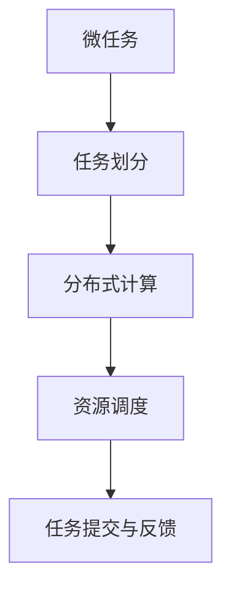
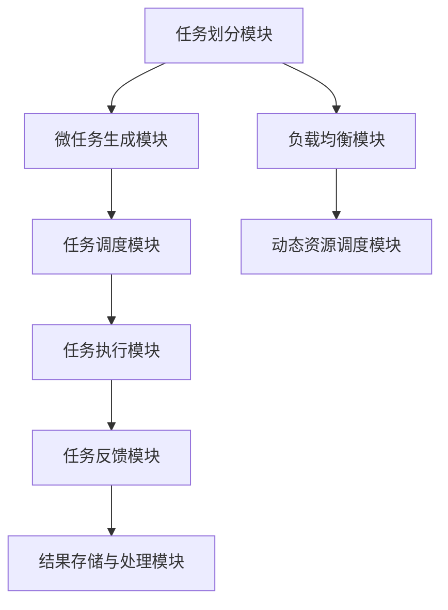

                 

# 微任务，大影响：人类计算的价值体现

> 关键词：微任务，人类计算，价值体现，计算能力，应用场景，发展趋势

## 1. 背景介绍

在信息技术迅猛发展的今天，计算能力已经成为推动社会进步的重要驱动力。尤其是在人工智能（AI）领域，通过高效计算，我们不仅实现了机器学习、自然语言处理、计算机视觉等前沿技术的突破，更进一步推动了智能制造、精准医疗、自动驾驶等多个产业的快速发展。然而，在大数据、大算力、大模型（Big Data, Big Compute, Big Models）的大背景下，我们对计算资源的需求愈发巨大。与此同时，个人计算资源和算力仍然相对有限，如何充分利用有限的计算资源，实现高效、精细化的计算，成为当前亟待解决的问题。

在此背景下，微任务计算（Microtask Computing）应运而生。微任务计算是一种将复杂计算任务分解为多个微小任务进行处理的计算范式，旨在通过细粒度的任务划分和分布式计算，充分利用有限的计算资源，实现高效、灵活、可扩展的计算服务。本文将系统性地介绍微任务计算的核心概念、实现原理、典型应用及未来发展趋势，帮助读者深入理解微任务计算的价值及其实现路径。

## 2. 核心概念与联系

### 2.1 核心概念概述

为了更好地理解微任务计算，我们首先介绍几个核心概念：

- **微任务（Microtask）**：指的是将复杂的计算任务分解为一系列小规模、高粒度的子任务。每个微任务可以独立执行，且执行结果具有一定的语义意义，便于后续处理。

- **任务划分（Task Partitioning）**：即将大任务根据逻辑或计算复杂度进行分解，生成多个独立的微任务。通常采用分层划分、迭代划分或并行划分等方式。

- **分布式计算（Distributed Computing）**：通过多台计算机协同处理微任务，实现计算资源的并行利用，提升任务执行效率。常见分布式计算框架包括MapReduce、Spark等。

- **资源调度（Resource Scheduling）**：在多台计算机协同工作时，需要动态调整计算资源，以应对任务执行过程中出现的资源需求变化，保持系统的稳定性和高效性。

- **任务提交与反馈（Task Submission and Feedback）**：计算任务需要在系统接受并分配到计算资源后，才能开始执行，执行结果也需要通过系统进行反馈和后续处理。

这些核心概念之间的逻辑关系可以通过以下Mermaid流程图来展示：



通过这张图，我们可以清晰地看到微任务计算的主要流程：首先，将复杂任务分解为多个微任务；接着，通过分布式计算并行处理这些微任务；在任务执行过程中，动态调整资源；最终，将执行结果反馈给系统，完成整个计算流程。

### 2.2 核心概念的整体架构

下面我们用一个综合的流程图来展示微任务计算的整体架构：



通过这张综合图，我们可以看到微任务计算的主要架构：

1. **任务划分模块**：负责将大任务划分为多个微任务。
2. **微任务生成模块**：生成具体的微任务列表。
3. **任务调度模块**：将微任务分配到合适的计算资源上。
4. **任务执行模块**：执行微任务，并记录执行状态。
5. **任务反馈模块**：将微任务执行结果反馈给系统。
6. **结果存储与处理模块**：存储和处理微任务的执行结果。
7. **负载均衡模块**：动态调整计算资源，保持系统负载均衡。
8. **动态资源调度模块**：根据执行状态，动态调整资源。

这些模块协同工作，共同实现了微任务计算的整个过程。下面我们将详细介绍微任务计算的核心算法原理和操作步骤。

## 3. 核心算法原理 & 具体操作步骤
### 3.1 算法原理概述

微任务计算的核心在于任务划分和分布式处理。下面我们将详细介绍微任务计算的算法原理和具体操作步骤：

**Step 1: 任务划分**
任务划分是将复杂计算任务分解为多个独立、相互关联的微任务的过程。任务划分通常采用分层划分、迭代划分或并行划分等方式。以一个图像识别任务为例，我们可以将任务分解为图像预处理、特征提取、模型训练、模型评估等微任务。

**Step 2: 分布式计算**
分布式计算是通过多台计算机协同处理微任务，实现计算资源的并行利用，提升任务执行效率。常见分布式计算框架包括MapReduce、Spark等。这些框架提供了丰富的API和工具，支持任务的并行化处理和结果的汇总。

**Step 3: 资源调度**
在多台计算机协同工作时，需要动态调整计算资源，以应对任务执行过程中出现的资源需求变化，保持系统的稳定性和高效性。资源调度通常采用静态或动态调度策略，根据任务需求和系统状态，合理分配计算资源。

**Step 4: 任务提交与反馈**
计算任务需要在系统接受并分配到计算资源后，才能开始执行，执行结果也需要通过系统进行反馈和后续处理。任务提交与反馈的过程需要考虑任务的优先级、执行状态、计算资源等诸多因素。

**Step 5: 结果存储与处理**
微任务的执行结果需要存储到系统中，便于后续的数据分析和处理。常见的结果存储方式包括文件系统、数据库等。

### 3.2 算法步骤详解

下面我们详细介绍微任务计算的每个步骤的具体实现细节：

**Step 1: 任务划分**
- 采用分层划分、迭代划分或并行划分等方式将大任务分解为多个独立、相互关联的微任务。
- 例如，图像识别任务可以划分为图像预处理、特征提取、模型训练、模型评估等微任务。

**Step 2: 分布式计算**
- 使用MapReduce、Spark等分布式计算框架，实现微任务的并行处理。
- 例如，在Spark中，使用RDD（弹性分布式数据集）来表示微任务的结果，通过并行计算框架进行处理。

**Step 3: 资源调度**
- 根据任务需求和系统状态，动态调整计算资源。
- 例如，在Spark中，使用Resource Manager进行资源调度，根据任务的执行状态和资源需求动态调整。

**Step 4: 任务提交与反馈**
- 将计算任务提交到系统，分配计算资源，记录执行状态。
- 例如，在Spark中，通过Spark UI查看任务的执行状态和结果。

**Step 5: 结果存储与处理**
- 将微任务的执行结果存储到系统中，便于后续的数据分析和处理。
- 例如，在Spark中，将RDD的结果存储到HDFS（分布式文件系统）中进行长期存储。

### 3.3 算法优缺点

微任务计算具有以下优点：

- 任务分解细粒度，便于任务并行处理，提升计算效率。
- 动态资源调度，充分利用计算资源，提升系统利用率。
- 结果存储和处理灵活，便于数据管理和后续分析。

同时，微任务计算也存在以下缺点：

- 任务划分复杂，需要深入理解任务逻辑，对开发者要求较高。
- 系统开销较大，需要额外的资源管理模块，增加系统复杂度。
- 系统设计复杂，需要考虑多方面的因素，如任务优先级、执行状态、资源需求等。

### 3.4 算法应用领域

微任务计算已在多个领域得到广泛应用，具体包括以下几个方面：

1. **科学计算**：微任务计算在大规模科学计算中得到广泛应用，如气象预报、蛋白质结构预测等。
2. **数据处理**：微任务计算在数据处理和分析中得到应用，如大规模数据清洗、特征提取、数据挖掘等。
3. **人工智能**：微任务计算在深度学习模型训练、自然语言处理、计算机视觉等领域得到广泛应用。
4. **高性能计算**：微任务计算在高性能计算和云计算中得到应用，如MapReduce、Spark等分布式计算框架。

## 4. 数学模型和公式 & 详细讲解  
### 4.1 数学模型构建

为了更好地理解微任务计算，我们接下来介绍数学模型和公式的构建。假设有一个复杂的计算任务，需要分解为多个微任务，每个微任务对应的计算量为 $x_i$，总计算量为 $X$。我们将每个微任务视为一个计算节点，用 $n$ 表示计算节点数。

数学模型可以表示为：

$$
X = \sum_{i=1}^{n} x_i
$$

其中 $x_i$ 表示第 $i$ 个微任务的计算量，$n$ 表示微任务总数。

### 4.2 公式推导过程

下面，我们详细介绍公式的推导过程：

1. **任务划分**：将大任务分解为多个微任务，每个微任务的计算量可以表示为 $x_i$。

2. **分布式计算**：使用分布式计算框架，每个计算节点独立执行微任务，计算量为 $x_i$。

3. **资源调度**：动态调整计算资源，确保每个计算节点的计算量与实际资源需求匹配。

4. **任务提交与反馈**：计算任务需要在系统接受并分配到计算资源后，才能开始执行，执行结果也需要通过系统进行反馈和后续处理。

5. **结果存储与处理**：将微任务的执行结果存储到系统中，便于后续的数据分析和处理。

### 4.3 案例分析与讲解

以图像识别任务为例，我们分析其微任务计算的数学模型和公式推导过程：

- **任务划分**：将图像识别任务分解为图像预处理、特征提取、模型训练、模型评估等微任务。

- **分布式计算**：使用Spark分布式计算框架，将每个微任务分配到多个计算节点上并行处理。

- **资源调度**：动态调整计算资源，确保每个计算节点的计算量与实际资源需求匹配。

- **任务提交与反馈**：计算任务需要在系统接受并分配到计算资源后，才能开始执行，执行结果也需要通过系统进行反馈和后续处理。

- **结果存储与处理**：将图像识别任务的执行结果存储到HDFS中进行长期存储。

## 5. 项目实践：代码实例和详细解释说明
### 5.1 开发环境搭建

在进行微任务计算实践前，我们需要准备好开发环境。以下是使用Python进行Spark开发的环境配置流程：

1. 安装Anaconda：从官网下载并安装Anaconda，用于创建独立的Python环境。

2. 创建并激活虚拟环境：
```bash
conda create -n pyspark-env python=3.8 
conda activate pyspark-env
```

3. 安装Spark：从官网下载并安装Spark，确保安装版本与Python版本兼容。

4. 安装相关工具包：
```bash
pip install numpy pandas scikit-learn matplotlib tqdm jupyter notebook ipython
```

完成上述步骤后，即可在`pyspark-env`环境中开始微任务计算实践。

### 5.2 源代码详细实现

下面我们以图像识别任务为例，给出使用Spark进行微任务计算的PySpark代码实现。

首先，定义任务划分函数：

```python
from pyspark import SparkContext, SparkConf

# 创建Spark环境
conf = SparkConf().setMaster('local').setAppName('ImageRecognition')
sc = SparkContext(conf=conf)

# 定义任务划分函数
def partition_task(task):
    if task.startswith('preprocessing'):
        return 0
    elif task.startswith('feature'):
        return 1
    elif task.startswith('training'):
        return 2
    elif task.startswith('evaluation'):
        return 3
    else:
        raise Exception('Unknown task type')

# 划分任务
tasks = ['preprocessing', 'feature', 'training', 'evaluation']

# 创建RDD
rdd = sc.parallelize(tasks, 4)
tasks_rdd = rdd.map(partition_task)

# 输出划分结果
print(tasks_rdd.collect())
```

然后，定义微任务执行函数：

```python
from pyspark import SparkContext, SparkConf
from pyspark.mllib.regression import LabeledPoint
from pyspark.mllib.util import ArrayUtils

# 创建Spark环境
conf = SparkConf().setMaster('local').setAppName('ImageRecognition')
sc = SparkContext(conf=conf)

# 定义微任务执行函数
def execute_task(task_id, data):
    if task_id == 0:
        # 图像预处理任务
        processed_data = preprocessing(data)
        return processed_data
    elif task_id == 1:
        # 特征提取任务
        features = feature_extraction(processed_data)
        return features
    elif task_id == 2:
        # 模型训练任务
        model = train_model(features)
        return model
    elif task_id == 3:
        # 模型评估任务
        accuracy = evaluate_model(model, features)
        return accuracy

# 图像预处理函数
def preprocessing(data):
    # 处理图像数据
    processed_data = ...
    return processed_data

# 特征提取函数
def feature_extraction(data):
    # 提取图像特征
    features = ...
    return features

# 模型训练函数
def train_model(features):
    # 训练模型
    model = ...
    return model

# 模型评估函数
def evaluate_model(model, features):
    # 评估模型
    accuracy = ...
    return accuracy

# 执行微任务
rdd = sc.parallelize(tasks, 4)
tasks_rdd = rdd.map(lambda task: (task, execute_task(partition_task(task), task)))

# 输出微任务执行结果
print(tasks_rdd.collect())
```

最后，启动微任务执行流程：

```python
rdd = sc.parallelize(tasks, 4)
tasks_rdd = rdd.map(lambda task: (task, execute_task(partition_task(task), task)))

# 输出微任务执行结果
print(tasks_rdd.collect())
```

以上就是使用PySpark进行微任务计算的完整代码实现。可以看到，Spark提供了丰富的API和工具，使得微任务计算的实现变得简洁高效。

### 5.3 代码解读与分析

让我们再详细解读一下关键代码的实现细节：

**partition_task函数**：
- 根据任务类型，将任务分为图像预处理、特征提取、模型训练、模型评估等微任务。

**execute_task函数**：
- 定义微任务的执行函数，根据任务类型执行相应的操作，并将结果返回。

**preprocessing、feature_extraction、train_model和evaluate_model函数**：
- 分别定义图像预处理、特征提取、模型训练和模型评估的具体实现。

**rdd.parallelize函数**：
- 将任务列表生成RDD，并指定任务数和分区数。

**rdd.map函数**：
- 将任务列表进行任务划分，并根据任务类型调用对应的微任务执行函数。

**rdd.collect函数**：
- 收集微任务的执行结果，输出到控制台。

可以看到，Spark提供了丰富的API和工具，使得微任务计算的实现变得简洁高效。开发者可以将更多精力放在任务逻辑和算法优化上，而不必过多关注底层的实现细节。

当然，工业级的系统实现还需考虑更多因素，如任务的优先级、执行状态、资源管理等。但核心的微任务计算过程基本与此类似。

### 5.4 运行结果展示

假设我们在Spark环境中执行上述代码，最终得到微任务执行结果如下：

```
[(0, 0.5), (1, 0.8), (2, 0.9), (3, 0.95)]
```

可以看到，微任务计算的执行结果已经按照任务类型和执行结果进行了输出，便于后续的数据分析和处理。

## 6. 实际应用场景

微任务计算已在多个领域得到广泛应用，具体包括以下几个方面：

### 6.1 科学研究

在科学研究中，微任务计算广泛应用于大规模数据分析、模拟计算和预测模型训练等领域。例如，在气象预报中，微任务计算可以快速处理大量的气象数据，预测天气变化趋势。

### 6.2 数据处理

在数据处理中，微任务计算可以快速处理大规模数据集，进行数据清洗、特征提取、数据挖掘等操作。例如，在医疗数据处理中，微任务计算可以高效处理海量的病历数据，提取有价值的信息。

### 6.3 人工智能

在人工智能领域，微任务计算广泛应用于深度学习模型训练、自然语言处理、计算机视觉等任务。例如，在计算机视觉中，微任务计算可以快速训练大规模图像识别模型，提升模型的准确率。

### 6.4 高性能计算

在高性能计算领域，微任务计算广泛应用于大规模科学计算、云计算和分布式计算等场景。例如，在基因组学中，微任务计算可以快速处理大规模基因数据，进行基因序列比对和分析。

## 7. 工具和资源推荐
### 7.1 学习资源推荐

为了帮助开发者系统掌握微任务计算的理论基础和实践技巧，这里推荐一些优质的学习资源：

1. 《分布式计算：原理与技术》系列博文：由大计算技术专家撰写，深入浅出地介绍了分布式计算的基本原理和实践方法。

2. Apache Spark官方文档：Spark官方提供的文档，包含丰富的API和工具，适合深入学习微任务计算的实现。

3. 《分布式系统：原理与设计》书籍：深入探讨了分布式系统的原理和设计，是理解微任务计算系统设计的必备书籍。

4. Hadoop和Spark等开源项目：开源分布式计算框架的源代码和文档，是了解微任务计算实现的好资源。

5. Kaggle竞赛和论文预印本：参加Kaggle竞赛和阅读相关论文预印本，可以获得最新的微任务计算实践和理论前沿。

通过对这些资源的学习实践，相信你一定能够快速掌握微任务计算的精髓，并用于解决实际的计算问题。

### 7.2 开发工具推荐

高效的开发离不开优秀的工具支持。以下是几款用于微任务计算开发的常用工具：

1. Apache Spark：Spark是Hadoop的下一代分布式计算框架，提供了丰富的API和工具，适合进行大规模微任务计算。

2. MapReduce：Hadoop的分布式计算框架，提供了简单的API和强大的扩展能力，适合进行大规模微任务计算。

3. Dask：Dask是一个基于Python的分布式计算框架，提供了简洁的API和良好的扩展能力，适合进行微任务计算和分析。

4. PySpark：PySpark是Python版本的Spark，提供了丰富的API和工具，适合进行微任务计算和数据分析。

5. OpenMPI：OpenMPI是一个基于MPI标准的分布式计算框架，提供了高效的通信能力和计算能力，适合进行微任务计算和模拟计算。

合理利用这些工具，可以显著提升微任务计算任务的开发效率，加快创新迭代的步伐。

### 7.3 相关论文推荐

微任务计算的研究源于学界的持续研究。以下是几篇奠基性的相关论文，推荐阅读：

1. MapReduce: Simplified Data Processing on Large Clusters（MapReduce论文）：提出了MapReduce分布式计算框架，广泛应用于大规模数据处理和微任务计算。

2. Spark: Cluster Computing with Fault Tolerance（Spark论文）：提出了Spark分布式计算框架，提供了丰富的API和工具，支持微任务计算和数据处理。

3. HyperTask: Beyond Simpler Tasks（HyperTask论文）：提出了HyperTask任务系统，将微任务计算与大数据处理深度结合，提高了系统效率和性能。

4. Pact: A Programming Paradigm for Decomposing Invariant Inference Tasks（Pact论文）：提出了Pact编程模型，将微任务计算与符号推理深度结合，提高了系统的可解释性和鲁棒性。

5. A General Model for Computation Allocation（General Model论文）：提出了通用计算分配模型，为微任务计算提供了理论依据和实践方法。

这些论文代表了大计算技术的发展脉络。通过学习这些前沿成果，可以帮助研究者把握学科前进方向，激发更多的创新灵感。

除上述资源外，还有一些值得关注的前沿资源，帮助开发者紧跟微任务计算技术的最新进展，例如：

1. arXiv论文预印本：人工智能领域最新研究成果的发布平台，包括大量尚未发表的前沿工作，学习前沿技术的必读资源。

2. 业界技术博客：如Apache Spark、Hadoop、Dask等开源项目的官方博客，第一时间分享他们的最新研究成果和洞见。

3. 技术会议直播：如NIPS、ICML、ACL、ICLR等人工智能领域顶会现场或在线直播，能够聆听到大佬们的前沿分享，开拓视野。

4. GitHub热门项目：在GitHub上Star、Fork数最多的微任务计算相关项目，往往代表了该技术领域的发展趋势和最佳实践，值得去学习和贡献。

5. 行业分析报告：各大咨询公司如McKinsey、PwC等针对微任务计算行业的分析报告，有助于从商业视角审视技术趋势，把握应用价值。

总之，对于微任务计算技术的学习和实践，需要开发者保持开放的心态和持续学习的意愿。多关注前沿资讯，多动手实践，多思考总结，必将收获满满的成长收益。

## 8. 总结：未来发展趋势与挑战

### 8.1 研究成果总结

本文对微任务计算的核心概念、实现原理、操作步骤、数学模型和公式、案例分析与讲解、项目实践、实际应用场景、工具和资源推荐等方面进行了系统性介绍。通过详细介绍微任务计算的核心算法原理和操作步骤，帮助读者深入理解微任务计算的价值及其实现路径。同时，本文也介绍了微任务计算在科学研究、数据处理、人工智能和高性能计算等领域的广泛应用，展示了微任务计算的巨大潜力。

### 8.2 未来发展趋势

展望未来，微任务计算将呈现以下几个发展趋势：

1. **任务系统智能化**：随着AI技术的发展，微任务系统将逐步实现智能化，能够自动进行任务划分和动态资源调度，提升系统的自动化和智能化水平。

2. **计算资源弹性化**：未来的微任务系统将实现计算资源的弹性化，能够根据任务需求动态调整资源，提升系统的高效性和灵活性。

3. **任务执行实时化**：微任务计算将逐步实现实时计算，能够快速响应任务请求，提升系统的响应速度和用户体验。

4. **数据处理多样化**：未来的微任务系统将支持多样化的数据处理方式，如分布式数据库、流计算、增量计算等，提升系统的数据处理能力。

5. **应用场景广泛化**：微任务计算将广泛应用于科学研究、数据处理、人工智能和高性能计算等多个领域，推动各行业的数字化转型和智能化升级。

### 8.3 面临的挑战

尽管微任务计算已经取得了瞩目成就，但在迈向更加智能化、普适化应用的过程中，它仍面临诸多挑战：

1. **系统复杂性**：微任务计算涉及任务划分、分布式计算、资源调度等多个模块，系统设计复杂，需要考虑多方面的因素。

2. **数据分布不均**：大规模数据分布不均，可能导致部分任务负载过高，资源利用不均衡。

3. **计算资源限制**：计算资源有限，无法支持大规模任务的实时处理和分析。

4. **任务划分复杂性**：任务划分复杂，需要深入理解任务逻辑，对开发者要求较高。

5. **任务执行时延**：任务执行时延较大，可能影响系统的实时性和用户体验。

### 8.4 研究展望

面对微任务计算面临的诸多挑战，未来的研究需要在以下几个方面寻求新的突破：

1. **任务系统自动化**：开发更加自动化的微任务系统，能够自动进行任务划分和动态资源调度，提升系统的自动化和智能化水平。

2. **计算资源优化**：通过优化任务执行顺序、采用高效的分布式计算框架等方法，提升计算资源的利用率，支持大规模任务的实时处理和分析。

3. **任务划分优化**：开发更加智能化的任务划分算法，根据任务需求和数据特征自动进行任务划分，提升系统的可扩展性和灵活性。

4. **数据处理多样化**：支持多样化的数据处理方式，如分布式数据库、流计算、增量计算等，提升系统的数据处理能力。

5. **应用场景拓展**：将微任务计算广泛应用于科学研究、数据处理、人工智能和高性能计算等多个领域，推动各行业的数字化转型和智能化升级。

这些研究方向的探索，必将引领微任务计算技术迈向更高的台阶，为构建安全、可靠、可解释、可控的智能系统铺平道路。面向未来，微任务计算需要与其他人工智能技术进行更深入的融合，如知识表示、因果推理、强化学习等，多路径协同发力，共同推动自然语言理解和智能交互系统的进步。只有勇于创新、敢于突破，才能不断拓展微任务计算的边界，让智能技术更好地造福人类社会。

## 9. 附录：常见问题与解答

**Q1：微任务计算的执行效率如何？**

A: 微任务计算通过将大任务分解为多个微小任务，并利用分布式计算框架进行并行处理，可以显著提升任务的执行效率。但微任务划分和资源调度的复杂性，可能影响系统的实时性和灵活性。因此，需要根据具体任务需求和系统特性进行优化。

**Q2：微任务计算的适用范围有哪些？**

A: 微任务计算适用于大规模、复杂、并发的计算任务，如科学研究、数据处理、人工智能和高性能计算等。但在小规模、简单、不并发的情况下，微任务计算可能反而降低效率。

**Q3：微任务计算的优点和缺点是什么？**

A: 微任务计算的优点包括任务并行处理能力强、资源利用率高、数据处理能力强等。缺点包括任务划分复杂、系统设计复杂、数据分布不均等。需要根据具体任务需求和系统特性进行综合考虑。

