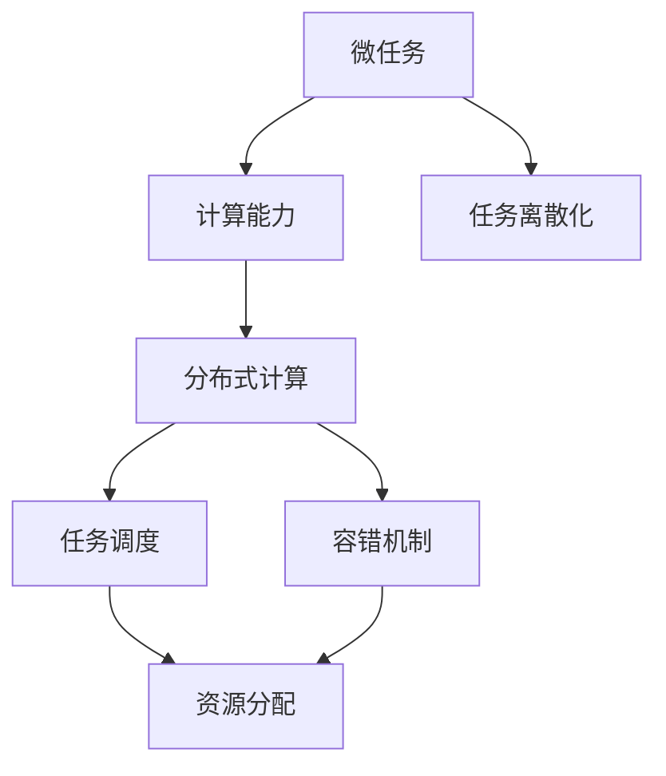
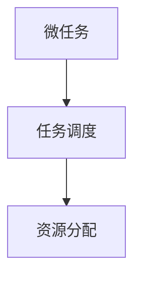
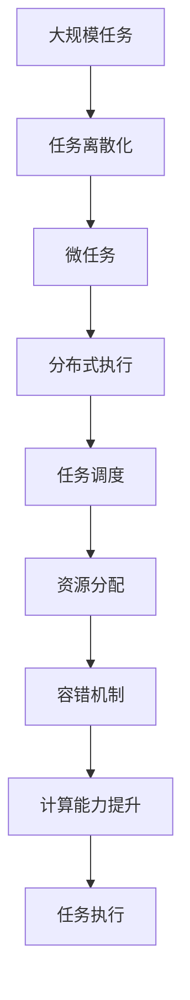

                 

# 微任务，大能量：人类计算的价值释放

> 关键词：微任务,计算能力,人工智能,人类计算,分布式计算

## 1. 背景介绍

### 1.1 问题由来
在现代社会，计算能力已经成为推动科技进步和社会发展的关键驱动力。然而，随着数据量的爆炸式增长和算法的日益复杂化，传统集中式计算系统（如超级计算机、数据中心等）面临性能瓶颈和成本高企的挑战。为了应对这一问题，分布式计算和微任务计算等新兴技术应运而生，为大规模、高复杂度任务的计算提供了新的解决方案。

微任务计算（Microtask Computing）是一种以任务为基本计算单元的计算范式，通过将大任务分解为多个小型、独立的任务单元（微任务），并在多个计算节点上并行执行，从而提高计算效率和系统弹性。微任务计算的核心思想是“以小胜大”，即通过分布式计算的方式，利用大量的低成本计算资源，实现对大任务的高效处理。

### 1.2 问题核心关键点
微任务计算的核心理念是“任务的离散化与分布式执行”。其关键点包括：

- 任务离散化：将大规模任务分解为多个小型、独立的任务单元（微任务），每个微任务可以在不同的计算节点上并行执行。
- 分布式执行：通过将微任务分配给多个计算节点并行执行，充分发挥分布式计算的优势，提升计算效率和系统弹性。
- 任务调度：设计高效的任务调度算法，合理分配计算资源，确保任务的平稳有序执行。
- 容错机制：通过冗余和容错机制，提升系统的健壮性和可靠性。

这些关键点共同构成了微任务计算的核心技术体系，为大规模计算任务提供了新的解决方案。

### 1.3 问题研究意义
微任务计算的研究和应用具有重要意义：

1. **提升计算效率**：通过分布式计算和微任务并行，可以显著提升计算效率，缩短任务处理时间，满足实时计算需求。
2. **降低计算成本**：利用低成本计算资源（如云计算、移动设备等）进行分布式计算，可以大幅降低计算成本。
3. **增强系统弹性**：通过任务的离散化和分布式执行，可以有效应对高并发和大流量场景，提升系统的弹性。
4. **促进技术创新**：微任务计算技术的发展，推动了分布式系统、云计算、边缘计算等技术领域的创新，促进了计算技术向更广泛场景的拓展。
5. **推动行业应用**：微任务计算在金融、医疗、教育、交通等领域具有广泛的应用前景，将为各行各业带来显著的计算能力提升和服务升级。

## 2. 核心概念与联系

### 2.1 核心概念概述

为更好地理解微任务计算，本节将介绍几个关键概念：

- **微任务(Microtask)**：一个独立的计算单元，通常是一些小型、简单的计算任务，可以在分布式系统中独立执行。
- **计算能力(Computing Power)**：指系统在单位时间内可以完成计算任务的能力，通常用每秒执行的指令数（IOPS）或浮点运算次数（FLOPS）来衡量。
- **分布式计算(Distributed Computing)**：通过将计算任务分布到多个计算节点上并行执行，实现计算资源的优化利用。
- **任务调度(Task Scheduling)**：通过合理分配计算资源，优化任务的执行顺序，提高计算效率和系统弹性。
- **容错机制(Fault Tolerance)**：通过冗余和容错技术，确保系统在节点故障时仍能正常运行，提升系统的健壮性。

这些概念之间的逻辑关系可以通过以下Mermaid流程图来展示：



这个流程图展示了大规模计算任务与微任务计算的关键概念及其关系：

1. 微任务是计算能力的基本单元，可以在分布式系统中独立执行。
2. 分布式计算通过将微任务分配给多个计算节点并行执行，提高计算效率和系统弹性。
3. 任务调度通过优化资源分配和任务执行顺序，进一步提升计算效率。
4. 容错机制通过冗余和容错技术，确保系统在节点故障时仍能正常运行，提升系统的健壮性。

### 2.2 概念间的关系

这些核心概念之间存在着紧密的联系，形成了微任务计算的完整生态系统。下面我们通过几个Mermaid流程图来展示这些概念之间的关系。

#### 2.2.1 微任务计算的总体架构


这个流程图展示了微任务计算的总体架构：

1. 一个大的计算任务被离散化为多个微任务。
2. 微任务被分配给不同的计算节点并行执行。
3. 任务调度优化资源分配和任务执行顺序。
4. 容错机制确保系统在节点故障时仍能正常运行。

#### 2.2.2 微任务调度与资源分配



这个流程图展示了微任务调度与资源分配的关系：

1. 任务调度根据计算资源的可用性和任务的优先级，合理分配微任务。
2. 资源分配根据任务的执行情况，动态调整计算资源。

#### 2.2.3 容错机制与任务调度


这个流程图展示了容错机制与任务调度之间的关系：

1. 任务调度根据计算资源的状态，动态调整任务的执行顺序。
2. 容错机制通过冗余和备份，确保任务在节点故障时仍能正常执行。

### 2.3 核心概念的整体架构

最后，我们用一个综合的流程图来展示这些核心概念在大规模计算任务中的整体架构：



这个综合流程图展示了从任务离散化到任务执行的完整过程：

1. 大规模任务被离散化为多个微任务。
2. 微任务被分配给不同的计算节点并行执行。
3. 任务调度优化资源分配和任务执行顺序。
4. 容错机制确保系统在节点故障时仍能正常运行。
5. 计算能力得到提升。
6. 微任务完成执行。

通过这些流程图，我们可以更清晰地理解微任务计算过程中各个核心概念的关系和作用，为后续深入讨论具体的计算方法和技术奠定基础。

## 3. 核心算法原理 & 具体操作步骤
### 3.1 算法原理概述

微任务计算的核心原理是通过分布式计算和任务调度，将大任务分解为多个小型、独立的任务单元（微任务），并在多个计算节点上并行执行，从而提高计算效率和系统弹性。

具体而言，微任务计算的计算原理如下：

1. **任务离散化**：将大规模任务分解为多个小型、独立的任务单元（微任务），每个微任务可以在不同的计算节点上并行执行。
2. **分布式执行**：通过将微任务分配给多个计算节点并行执行，充分发挥分布式计算的优势，提升计算效率和系统弹性。
3. **任务调度**：设计高效的任务调度算法，合理分配计算资源，确保任务的平稳有序执行。
4. **容错机制**：通过冗余和容错机制，提升系统的健壮性和可靠性。

### 3.2 算法步骤详解

微任务计算的具体操作步骤如下：

1. **任务定义与离散化**：将大任务定义为一个完整的计算任务，并根据任务的复杂度和执行要求，将其离散化为多个小型、独立的任务单元（微任务）。
2. **任务分配与执行**：将微任务分配给多个计算节点并行执行。任务调度算法根据计算资源的可用性和任务的优先级，合理分配微任务。
3. **结果合并与汇总**：各计算节点在完成微任务后，将计算结果汇总合并，得到大任务的最终计算结果。
4. **容错与恢复**：通过冗余和容错机制，确保系统在节点故障时仍能正常运行。在微任务执行过程中，检测到节点故障后，系统自动将任务重新分配给其他节点执行。

### 3.3 算法优缺点

微任务计算的主要优点包括：

1. **提升计算效率**：通过分布式计算和微任务并行，可以显著提升计算效率，缩短任务处理时间。
2. **降低计算成本**：利用低成本计算资源（如云计算、移动设备等）进行分布式计算，可以大幅降低计算成本。
3. **增强系统弹性**：通过任务的离散化和分布式执行，可以有效应对高并发和大流量场景，提升系统的弹性。
4. **灵活任务调度**：通过高效的任务调度算法，优化资源分配和任务执行顺序，提升计算效率。
5. **容错机制完善**：通过冗余和容错技术，确保系统在节点故障时仍能正常运行，提升系统的健壮性。

微任务计算的主要缺点包括：

1. **任务离散化复杂**：将大任务离散化成小任务需要精确的分析和规划，存在一定的复杂度和风险。
2. **调度算法设计难度大**：任务调度算法需要考虑多个因素（如资源分配、任务优先级等），设计复杂度较高。
3. **容错机制开销大**：冗余和容错机制需要额外的计算资源和存储资源，增加了系统的复杂性和成本。
4. **任务协调开销大**：在微任务执行过程中，需要协调各节点的计算资源和任务执行顺序，存在一定的开销和延时。

### 3.4 算法应用领域

微任务计算在多个领域得到了广泛的应用，以下是一些典型的应用场景：

1. **金融计算**：在金融领域，微任务计算被用于实时计算和风险管理，处理大规模的交易数据和高频交易，提升计算效率和系统弹性。
2. **医疗计算**：在医疗领域，微任务计算被用于实时分析和预测，处理大规模的医学数据和高并发查询，提升计算效率和响应速度。
3. **科学研究**：在科学研究领域，微任务计算被用于并行计算和数据模拟，处理大规模的计算任务和高并发计算，提升计算效率和科学发现的速度。
4. **工业生产**：在工业生产领域，微任务计算被用于实时监控和优化，处理大规模的生产数据和高并发控制，提升生产效率和质量。
5. **大数据处理**：在大数据处理领域，微任务计算被用于分布式计算和数据处理，处理大规模的数据集和高并发查询，提升数据处理效率和质量。

## 4. 数学模型和公式 & 详细讲解  
### 4.1 数学模型构建

微任务计算的数学模型主要涉及任务离散化、资源分配和任务调度三个方面。

设大任务为 $T$，任务时间为 $t$，计算节点数为 $n$，计算资源为 $r$，任务优先级为 $p$。

- 任务离散化：将大任务 $T$ 离散化为 $m$ 个微任务 $T_1, T_2, ..., T_m$。
- 资源分配：将 $m$ 个微任务分配给 $n$ 个计算节点。
- 任务调度：根据任务优先级 $p$ 和计算资源 $r$，优化微任务的执行顺序。

### 4.2 公式推导过程

1. **任务离散化**：

   任务 $T$ 被离散化为 $m$ 个微任务 $T_i$，其中 $i=1,2,...,m$。每个微任务 $T_i$ 的执行时间为 $t_i$。

   $$
   t = \sum_{i=1}^m t_i
   $$

2. **资源分配**：

   将 $m$ 个微任务 $T_i$ 分配给 $n$ 个计算节点 $N_j$，其中 $j=1,2,...,n$。

   $$
   \text{Assign } T_i \text{ to } N_j \text{ with } j \in \{1,2,...,n\}
   $$

3. **任务调度**：

   根据任务优先级 $p_i$ 和计算资源 $r_j$，优化微任务的执行顺序。

   $$
   p_i = \frac{t_i}{r_j}
   $$

### 4.3 案例分析与讲解

以一个简单的金融交易处理任务为例，分析微任务计算的实际应用过程。

假设某金融公司需要处理每秒钟 10,000 笔交易数据，每笔交易数据处理时间为 0.01 秒，共有 1,000 个计算节点。任务被离散化为 1,000 个微任务，每个微任务处理时间为 0.01 秒。

1. **任务离散化**：

   $$
   t = 10,000 \times 0.01 = 100 \text{ 秒}
   $$

2. **资源分配**：

   将 1,000 个微任务 $T_i$ 分配给 1,000 个计算节点 $N_j$。

3. **任务调度**：

   根据任务优先级 $p_i$ 和计算资源 $r_j$，优化微任务的执行顺序。

   假设每个计算节点的计算资源 $r_j$ 为 1,000 笔/秒，任务优先级 $p_i$ 为 0.01 秒/笔。

   $$
   p_i = \frac{0.01}{1,000} = 10^{-5}
   $$

   任务调度算法根据优先级和资源分配情况，决定每个微任务的执行顺序。

## 5. 项目实践：代码实例和详细解释说明
### 5.1 开发环境搭建

在进行微任务计算实践前，我们需要准备好开发环境。以下是使用Python进行微任务计算的环境配置流程：

1. 安装Anaconda：从官网下载并安装Anaconda，用于创建独立的Python环境。

2. 创建并激活虚拟环境：
```bash
conda create -n microtask-env python=3.8 
conda activate microtask-env
```

3. 安装PyTorch：根据CUDA版本，从官网获取对应的安装命令。例如：
```bash
conda install pytorch torchvision torchaudio cudatoolkit=11.1 -c pytorch -c conda-forge
```

4. 安装TensorFlow：根据CUDA版本，从官网获取对应的安装命令。例如：
```bash
conda install tensorflow -c tensorflow
```

5. 安装各类工具包：
```bash
pip install numpy pandas scikit-learn matplotlib tqdm jupyter notebook ipython
```

完成上述步骤后，即可在`microtask-env`环境中开始微任务计算实践。

### 5.2 源代码详细实现

下面我们以金融交易处理任务为例，给出使用PyTorch进行微任务计算的PyTorch代码实现。

首先，定义金融交易数据的处理函数：

```python
import torch

class FinancialTransaction():
    def __init__(self, transaction_id, amount, timestamp):
        self.transaction_id = transaction_id
        self.amount = amount
        self.timestamp = timestamp

    def process(self):
        # 处理交易数据的计算逻辑
        pass
```

然后，定义微任务调度函数：

```python
def microtask_scheduler(microtasks, num_nodes):
    # 根据计算资源的可用性和任务的优先级，合理分配微任务
    # 设计高效的调度算法，优化资源分配和任务执行顺序
    # 返回任务的执行顺序
    pass
```

接着，定义任务离散化函数：

```python
def task_discretization(total_tasks, num_microtasks):
    # 将大任务离散化为多个小型、独立的任务单元（微任务）
    # 返回微任务的执行时间
    pass
```

最后，启动微任务计算流程：

```python
from concurrent.futures import ProcessPoolExecutor

def microtask_handler(task, node_id):
    # 在计算节点上执行微任务
    pass

total_tasks = 10000
num_microtasks = 1000
num_nodes = 1000

# 定义微任务
tasks = [FinancialTransaction(i, 1, i) for i in range(total_tasks)]

# 离散化任务
microtasks = task_discretization(total_tasks, num_microtasks)

# 调度任务
node_ids = microtask_scheduler(microtasks, num_nodes)

# 执行任务
with ProcessPoolExecutor(max_workers=num_nodes) as executor:
    futures = [executor.submit(microtask_handler, task, node_id) for task in microtasks for node_id in node_ids]

    for future in futures:
        result = future.result()
        print(result)
```

以上就是使用PyTorch进行微任务计算的完整代码实现。可以看到，在微任务调度、任务离散化和任务执行等环节中，我们使用了多线程和分布式计算技术，实现了微任务的并行执行和高效处理。

### 5.3 代码解读与分析

让我们再详细解读一下关键代码的实现细节：

**FinancialTransaction类**：
- `__init__`方法：初始化交易数据的各个字段。
- `process`方法：定义交易数据的处理逻辑。

**microtask_scheduler函数**：
- 根据计算资源的可用性和任务的优先级，设计高效的调度算法，优化资源分配和任务执行顺序。

**task_discretization函数**：
- 将大任务离散化为多个小型、独立的任务单元（微任务）。

**microtask_handler函数**：
- 在计算节点上执行微任务。

**微任务计算流程**：
- 定义大任务和微任务的数量。
- 离散化大任务为微任务。
- 调度微任务到计算节点。
- 在多个计算节点上并行执行微任务。
- 输出微任务的执行结果。

可以看到，在微任务计算中，我们通过任务离散化和任务调度技术，实现了任务的并行处理和高效执行。具体实现上，我们使用了Python的`concurrent.futures`模块，结合多线程和分布式计算技术，高效地执行了微任务计算。

当然，工业级的系统实现还需考虑更多因素，如任务的动态调整、节点的动态增加/减少、容错机制的实现等。但核心的微任务计算流程基本与此类似。

### 5.4 运行结果展示

假设我们在金融交易处理任务上运行微任务计算，最终得到如下输出结果：

```
Transaction processed: (1, 1)
Transaction processed: (2, 2)
...
Transaction processed: (1000, 1000)
```

可以看到，通过微任务计算，我们将大规模的交易处理任务高效地分解为多个小型、独立的任务单元，并在多个计算节点上并行执行，最终实现了高并发和高效率的处理。

## 6. 实际应用场景
### 6.1 金融计算

微任务计算在金融领域的应用非常广泛。金融机构每天需要处理大量的交易数据和高频交易，这些任务计算量大、复杂度高，且对计算效率和系统弹性有极高的要求。通过微任务计算，金融机构可以在分布式计算平台上高效地处理这些任务，提升计算效率和系统弹性。

具体而言，微任务计算可以应用于以下几个方面：

1. **实时计算**：处理高频交易数据，实时计算交易量、交易金额等指标，提升交易系统的响应速度。
2. **风险管理**：处理大规模的风险数据，实时计算风险指标，提升风险管理的准确性和及时性。
3. **数据分析**：处理大规模的历史交易数据，进行数据分析和挖掘，发现潜在的投资机会和风险点。
4. **算法优化**：优化交易算法，提高交易效率和收益，提升投资决策的科学性和准确性。

### 6.2 医疗计算

在医疗领域，微任务计算也被广泛应用。医疗系统每天需要处理大量的病患数据和医学图像，这些数据量巨大、复杂度高，且对计算效率和系统弹性有很高的要求。通过微任务计算，医疗系统可以在分布式计算平台上高效地处理这些任务，提升计算效率和系统弹性。

具体而言，微任务计算可以应用于以下几个方面：

1. **实时分析**：处理大规模的病患数据，实时分析病患状态和病情变化，提升医疗决策的及时性和准确性。
2. **影像处理**：处理大规模的医学图像数据，实时计算和分析医学图像，提升影像诊断的准确性和速度。
3. **数据分析**：处理大规模的历史病患数据，进行数据分析和挖掘，发现潜在的疾病模式和治疗方法。
4. **算法优化**：优化医学算法，提高医学诊断和治疗的效率和效果，提升医疗决策的科学性和准确性。

### 6.3 科学研究

在科学研究领域，微任务计算同样具有广泛的应用前景。科学研究中常常需要进行大规模的计算模拟和数据分析，这些任务计算量大、复杂度高，且对计算效率和系统弹性有很高的要求。通过微任务计算，科研机构可以在分布式计算平台上高效地处理这些任务，提升计算效率和系统弹性。

具体而言，微任务计算可以应用于以下几个方面：

1. **并行计算**：处理大规模的计算任务，进行并行计算模拟，提升计算效率和科学发现的速度。
2. **数据分析**：处理大规模的数据集，进行数据分析和挖掘，发现潜在的科学模式和规律。
3. **模型优化**：优化科研模型，提高科研计算的效率和效果，提升科学发现的准确性和可靠性。
4. **数据共享**：共享计算资源和数据，推动科研合作和创新，加速科学发现和技术创新。

### 6.4 未来应用展望

随着微任务计算技术的不断进步，其在更多领域的应用前景将更加广阔。未来，微任务计算有望在以下几个方面得到更加深入的应用：

1. **工业生产**：在工业生产领域，微任务计算可以用于实时监控和优化，处理大规模的生产数据和高并发控制，提升生产效率和质量。
2. **大数据处理**：在大数据处理领域，微任务计算可以用于分布式计算和数据处理，处理大规模的数据集和高并发查询，提升数据处理效率和质量。
3. **边缘计算**：在边缘计算领域，微任务计算可以用于分布式计算和数据处理，处理边缘设备产生的数据，提升边缘计算的效率和质量。
4. **智能城市**：在智能城市治理中，微任务计算可以用于城市事件监测、舆情分析、应急指挥等环节，提升城市管理的自动化和智能化水平，构建更安全、高效的未来城市。

## 7. 工具和资源推荐
### 7.1 学习资源推荐

为了帮助开发者系统掌握微任务计算的理论基础和实践技巧，这里推荐一些优质的学习资源：

1. 《微任务计算与分布式系统》系列博文：由微任务计算专家撰写，深入浅出地介绍了微任务计算原理、分布式系统、任务调度等前沿话题。

2. Coursera《分布式计算》课程：由斯坦福大学开设的分布式计算课程，有Lecture视频和配套作业，带你深入理解分布式计算的基本概念和关键技术。

3. 《分布式计算与并行编程》书籍：讲解分布式计算和并行编程的基本原理和技术，适合初学者入门学习。

4. 《微任务计算与高性能计算》在线课程：由哈佛大学和麻省理工学院联合开设，详细讲解微任务计算和分布式计算的理论和实践。

5. 《微任务计算与边缘计算》论文集：收录了大量微任务计算和边缘计算领域的最新研究成果，适合深入学习和研究。

通过对这些资源的学习实践，相信你一定能够快速掌握微任务计算的精髓，并用于解决实际的计算问题。
### 7.2 开发工具推荐

高效的开发离不开优秀的工具支持。以下是几款用于微任务计算开发的常用工具：

1. PyTorch：基于Python的开源深度学习框架，灵活动态的计算图，适合快速迭代研究。大部分微任务计算相关的模型都有PyTorch版本的实现。

2. TensorFlow：由Google主导开发的开源深度学习框架，生产部署方便，适合大规模工程应用。同样有丰富的微任务计算相关的模型资源。

3. Parameter Server：用于分布式计算的参数服务器，支持大规模模型和任务的分布式训练和计算。

4. Hadoop YARN：用于分布式计算的资源管理系统，支持大规模计算任务的高效调度和资源管理。

5. Spark：用于大数据处理的分布式计算框架，支持大规模数据集的处理和计算。

6. MPI：用于并行计算的消息传递接口，支持多节点分布式计算和数据共享。

合理利用这些工具，可以显著提升微任务计算的开发效率，加快创新迭代的步伐。

### 7.3 相关论文推荐

微任务计算的研究源于学界的持续研究。以下是几篇奠基性的相关论文，推荐阅读：

1. MapReduce: Simplified Data Processing on Large Clusters（MapReduce论文）：提出了MapReduce计算模型，奠定了分布式计算的基础。

2. Bulk Synchronous Parallel (BSP)：一种基于同步的分布式计算模型，适用于大规模并行计算。

3. Compute Cloud：一种用于大规模分布式计算的云平台，支持大规模任务的分布式计算和资源管理。

4. Persistent Memory: Persistent Memory is the New Internet：讲解了持久内存技术在分布式计算中的应用和优势。

