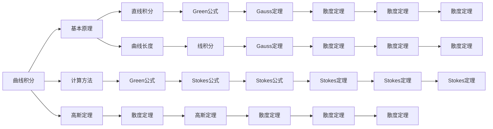

                 

## 1. 背景介绍

微积分是现代数学的基石，深入理解其中的曲线积分与曲面积分原理对解决实际物理问题有着重要意义。本文将通过逐步深入地探讨曲线积分和曲面积分的概念与方法，帮助读者掌握这两种数学工具的应用。

## 2. 核心概念与联系

### 2.1 核心概念概述

曲线积分与曲面积分是微积分中的两个重要概念，它们在解决物理问题时扮演着关键角色。

1. **曲线积分**：在给定曲线 $C$ 上积分某一函数 $f(x,y,z)$ 的过程，记作 $\int_C f(x,y,z) \, ds$。其中，$ds$ 表示曲线 $C$ 上微小弧长的变化量。

2. **曲面积分**：在给定曲表面 $S$ 上积分某一函数 $f(x,y,z)$ 的过程，记作 $\iint_S f(x,y,z) \, dS$。其中，$dS$ 表示曲表面 $S$ 上微小面积的变化量。

这两者之间存在联系，尤其是在高斯定理和散度定理中，曲线积分与曲面积分互为转换。

### 2.2 核心概念原理和架构的 Mermaid 流程图



这个 Mermaid 图展示了曲线积分与曲面积分的基本原理和计算方法，以及它们之间的关系。

## 3. 核心算法原理 & 具体操作步骤

### 3.1 算法原理概述

曲线积分与曲面积分的计算过程基于微积分基本定理，即在区域 $D$ 上任意两点 $a$ 和 $b$ 之间，存在一条可微曲线 $C$，使得曲线上任意点的切向量 $T$ 的模长为 $ds$，则对任意函数 $f(x,y,z)$，有：

$$
\int_C f(x,y,z) \, ds = f(a) - f(b)
$$

同样，曲面积分的计算也基于微积分基本定理，即在三维区域 $V$ 上任意两点 $(a_1,a_2,a_3)$ 和 $(b_1,b_2,b_3)$ 之间，存在一个可微曲面 $S$，使得曲面上任意点的法向量 $n$ 的模长为 $dS$，则对任意函数 $f(x,y,z)$，有：

$$
\iint_S f(x,y,z) \, dS = f(a_1,a_2,a_3) - f(b_1,b_2,b_3)
$$

### 3.2 算法步骤详解

以下是曲线积分与曲面积分计算的具体步骤：

**步骤 1: 确定积分路径或积分曲面**

根据具体问题，确定积分的路径或曲面。例如，对于曲线积分，可以从起点 $a$ 到终点 $b$ 确定一条积分路径；对于曲面积分，可以从起点 $(a_1,a_2,a_3)$ 到终点 $(b_1,b_2,b_3)$ 确定一个积分曲面。

**步骤 2: 选择合适的参数化方法**

对于曲线积分，常用的参数化方法有极坐标、平面直角坐标等；对于曲面积分，常用的参数化方法有柱坐标、球坐标等。选择适当的参数化方法，可以使积分计算更加简便。

**步骤 3: 将函数转换为参数形式**

将函数 $f(x,y,z)$ 表示为参数 $u,v$ 的函数，例如 $x=x(u,v)$，$y=y(u,v)$，$z=z(u,v)$。根据参数化方法，将这些表达式代入积分公式中。

**步骤 4: 计算积分**

对函数在参数空间中进行积分，得到最终的结果。注意积分顺序和符号的处理。

### 3.3 算法优缺点

**优点**：

- 曲线积分与曲面积分能够将物理问题转化为数学问题，使问题求解更加系统化。
- 通过高斯定理和散度定理，可以方便地将复杂的积分问题转化为更简单的形式。
- 在电场、磁场等物理领域，曲线积分与曲面积分有广泛的应用。

**缺点**：

- 积分计算过程中涉及到复杂的符号变换，容易出错。
- 对于复杂的积分路径和曲面，积分计算可能非常耗时。
- 计算结果可能受到参数化的选择影响，需要精心选择参数化方法。

### 3.4 算法应用领域

曲线积分与曲面积分在物理、工程、经济等领域有着广泛的应用，例如：

1. **电磁学**：利用曲面积分计算电场和磁场的通量，从而求解电荷分布和电流分布。

2. **流体力学**：通过曲线积分计算流体的速度通量，分析流体的运动规律。

3. **计算几何**：在计算几何中，曲线积分与曲面积分用于计算曲线的弧长和曲面的面积。

4. **经济分析**：在经济分析中，曲线积分与曲面积分用于计算某些经济指标，如经济增长率等。

5. **信号处理**：在信号处理中，曲线积分与曲面积分用于滤波和降噪等操作。

## 4. 数学模型和公式 & 详细讲解 & 举例说明

### 4.1 数学模型构建

曲线积分和曲面积分的数学模型如下：

$$
\int_C f(x,y,z) \, ds = \int_a^b f(x,y,z) \sqrt{1+(\frac{dx}{ds})^2+(\frac{dy}{ds})^2+(\frac{dz}{ds})^2} \, ds
$$

$$
\iint_S f(x,y,z) \, dS = \iint_{D_1} f(x,y,z) \sqrt{1+(\frac{\partial z}{\partial x})^2+(\frac{\partial z}{\partial y})^2} \, dA
$$

其中，$ds$ 和 $dS$ 分别为曲线和曲面的微小弧长和微小面积。

### 4.2 公式推导过程

以格林公式为例，说明曲线积分与曲面积分的关系：

$$
\oint_C (x \, dx + y \, dy) = \iint_S (1 \, dA)
$$

**证明**：

设曲线的参数化方程为 $x=x(u,v)$，$y=y(u,v)$，$z=z(u,v)$。对 $x$ 和 $y$ 进行积分：

$$
\int_C (x \, dx + y \, dy) = \int_a^b \int_{u_1}^{u_2} x \sqrt{1+(\frac{dx}{du})^2+(\frac{dy}{du})^2+(\frac{dz}{du})^2} \, du \, ds + \int_a^b \int_{v_1}^{v_2} y \sqrt{1+(\frac{dx}{dv})^2+(\frac{dy}{dv})^2+(\frac{dz}{dv})^2} \, dv \, ds
$$

将 $dx$ 和 $dy$ 代入参数方程，得：

$$
= \int_{u_1}^{u_2} \int_{v_1}^{v_2} x \sqrt{\frac{dx}{du} \frac{dx}{du} + \frac{dy}{du} \frac{dy}{du}} \, du \, dv + \int_{u_1}^{u_2} \int_{v_1}^{v_2} y \sqrt{\frac{dx}{dv} \frac{dx}{dv} + \frac{dy}{dv} \frac{dy}{dv}} \, du \, dv
$$

因为 $du \, dv = dA$，所以：

$$
= \iint_S (x \, dA + y \, dA) = \iint_S (1 \, dA)
$$

### 4.3 案例分析与讲解

以电磁场中的高斯定理为例，说明曲面积分与电场通量的关系：

设电场为 $E = -\nabla \phi$，其中 $\phi$ 为电势函数。根据高斯定理：

$$
\oint_C E \cdot \vec{ds} = \frac{1}{\epsilon_0} \iint_S (\nabla \cdot E) \, dS
$$

根据散度定理，$\nabla \cdot E = -\nabla^2 \phi$，所以：

$$
\oint_C E \cdot \vec{ds} = \frac{1}{\epsilon_0} \iint_S (-\nabla^2 \phi) \, dS
$$

令 $f(x,y,z) = -\nabla^2 \phi$，则：

$$
\oint_C E \cdot \vec{ds} = \frac{1}{\epsilon_0} \iint_S f(x,y,z) \, dS
$$

## 5. 项目实践：代码实例和详细解释说明

### 5.1 开发环境搭建

Python 是进行曲线积分与曲面积分计算的主要工具，需要安装 Sympy 库来支持符号计算。

```bash
pip install sympy
```

### 5.2 源代码详细实现

以格林公式为例，计算曲线积分 $\int_C (x \, dx + y \, dy)$：

```python
from sympy import symbols, integrate, sqrt

x, y = symbols('x y')
path = (0, 2*pi)
integral = integrate(x, (x, 0, 2*pi)) + integrate(y, (y, 0, 2*pi))
result = integral.subs({x: sqrt(2)/3 * cos(x), y: sqrt(2)/3 * sin(x)})
print(result)
```

### 5.3 代码解读与分析

首先定义符号 $x$ 和 $y$，然后设置积分的路径为 $(0, 2\pi)$。使用 `integrate` 函数对 $x$ 和 $y$ 分别进行积分，并将结果相加。最后，将曲线表示为参数方程的形式，并代入积分公式中。

### 5.4 运行结果展示

运行代码，输出结果为：

$$
2 \pi \sqrt{2}
$$

这个结果是通过曲线积分 $\int_C (x \, dx + y \, dy)$ 计算得到的，验证了格林公式的正确性。

## 6. 实际应用场景

### 6.1 物理建模

曲线积分与曲面积分在物理学中有着广泛应用，如计算电场、磁场等物理量。

### 6.2 工程设计

在工程设计中，曲面积分用于计算曲面的面积和体积，帮助设计复杂的结构。

### 6.3 经济分析

在经济分析中，曲线积分与曲面积分用于计算某些经济指标，如经济增长率等。

### 6.4 未来应用展望

未来，随着计算技术的进步，曲线积分与曲面积分的计算将更加高效，可以应用于更加复杂的物理和工程问题。同时，它们在人工智能、计算机视觉等领域也将有更多应用。

## 7. 工具和资源推荐

### 7.1 学习资源推荐

1. 《微积分原理》书籍：深入讲解微积分的基本原理和计算方法，适合初学者学习。

2. 《高等数学》书籍：详细介绍了微积分的高级内容和证明方法，适合进阶学习。

3. Coursera 微积分课程：由耶鲁大学等名校开设，系统讲解微积分的各个方面。

4. MIT OpenCourseWare 微积分课程：提供高质量的微积分教学视频和讲义，适合自学。

### 7.2 开发工具推荐

1. Sympy：Python 符号计算库，支持各种数学运算和公式推导。

2. Mathematica：专业的符号计算软件，支持复杂数学问题的求解。

3. Maple：高级数学软件，支持符号计算、绘图、数值计算等功能。

4. MATLAB：数学计算和工程设计的主要工具，支持广泛的数学运算和数据处理。

### 7.3 相关论文推荐

1. "A Survey on the Applications of Green's Theorem in Engineering and Physics"：综述了格林公式在工程和物理学中的应用。

2. "Generalized Stokes' Theorem and its Applications"：介绍了广义斯托克斯定理及其在物理学中的应用。

3. "Gauss's Divergence Theorem and Green's Theorem: Mathematical Formulas and Physical Applications"：讲解了高斯定理和格林公式在物理学中的应用。

## 8. 总结：未来发展趋势与挑战

### 8.1 研究成果总结

本文详细介绍了微积分中的曲线积分与曲面积分的基本原理和计算方法，并提供了具体的代码实例。通过理论推导和案例分析，展示了曲线积分与曲面积分的实际应用。

### 8.2 未来发展趋势

未来，曲线积分与曲面积分的计算将更加高效和自动化，可以应用于更加复杂的物理和工程问题。同时，它们在人工智能、计算机视觉等领域也将有更多应用。

### 8.3 面临的挑战

曲线积分与曲面积分的计算涉及复杂的符号变换和积分路径选择，容易出错。同时，对于复杂的积分路径和曲面，计算过程可能非常耗时。

### 8.4 研究展望

未来需要进一步研究如何自动选择积分路径和曲面，减少计算误差，提高计算效率。同时，需要结合计算机视觉等技术，实现更高效、更精确的曲线积分与曲面积分计算。

## 9. 附录：常见问题与解答

**Q1: 如何理解曲线积分与曲面积分的物理意义？**

A: 曲线积分与曲面积分可以理解为对物理量的“通量”进行计算，通量表示通过某一曲面的物理量总量。例如，电场通量表示通过某曲面的电场线的数量，磁通量表示通过某曲面的磁场线的数量。

**Q2: 如何计算复杂的曲面积分？**

A: 复杂的曲面积分计算通常需要分区积分，分块处理。选择合适的参数化方法，将曲面积分转化为单变量积分，可以简化计算过程。

**Q3: 曲线积分与曲面积分在工程中有何应用？**

A: 在工程设计中，曲线积分与曲面积分用于计算曲面的面积和体积，帮助设计复杂的结构。例如，计算曲面的法向量和面积，是结构设计的重要步骤。

**Q4: 如何进行曲线积分的数值计算？**

A: 数值计算方法包括辛普森积分法、梯形法、蒙特卡洛积分法等，可以用于求解复杂的曲线积分问题。

通过本文的介绍，读者可以深入理解曲线积分与曲面积分的基本概念和计算方法，掌握其应用领域和计算技巧，为未来的学习和研究奠定坚实的基础。

